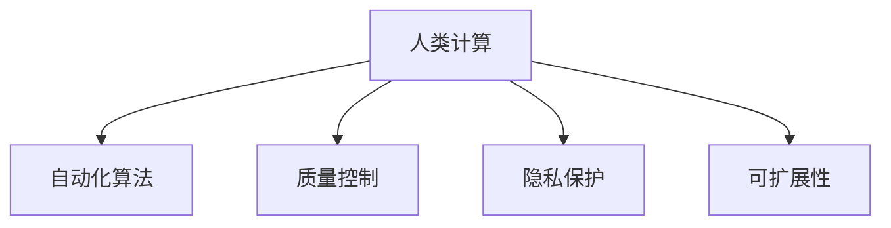

                 

# 人类计算：超越传统众包

> 关键词：人类计算, 众包, 人工智能, 机器学习, 数据标注, 自动化, 质量控制, 安全与隐私

## 1. 背景介绍

### 1.1 问题由来

在人工智能(AI)领域，特别是自然语言处理(NLP)和计算机视觉(CV)等方向，传统的机器学习算法往往依赖大量的标注数据进行训练和验证。然而，由于标注数据获取的困难和昂贵，研究人员和工程师们需要付出大量时间和资源来准备这些数据，成为技术发展的一大瓶颈。

近年来，众包平台（如Amazon Mechanical Turk、CrowdFlower等）逐渐成为数据标注的主要来源。众包模式通过吸引大量在线工作者完成各种小型任务，有效缓解了标注数据获取的难题。然而，传统众包模式仍存在以下问题：

1. **数据质量参差不齐**：众包工作者往往水平不一，标注的质量不稳定，难以保证标注的一致性和准确性。
2. **成本高昂**：尽管众包平台可以降低标注成本，但高质量标注仍然昂贵。
3. **隐私安全风险**：众包过程中涉及用户隐私数据，数据泄露和滥用风险较高。
4. **效率低下**：标注任务往往需要反复迭代和审核，耗时较长。

面对这些问题，亟需新的计算模式来替代传统众包，提升数据标注的效率、质量和安全性。人类计算（Human Computation）正是在这一背景下逐渐兴起，旨在利用人类的计算能力，结合机器学习算法，实现更高质量的标注和数据处理。

### 1.2 问题核心关键点

人类计算的核心思想在于：利用人类丰富的计算资源和创造性思维，结合机器学习的自动化算法，解决传统众包模式中存在的问题。具体而言，人类计算包括以下几个关键点：

1. **任务分解**：将复杂任务分解为多个子任务，利用人类的计算能力，逐步完成。
2. **自动化算法**：设计高效的自动化算法，引导人类计算过程，提升工作效率和一致性。
3. **质量控制**：引入质量控制机制，通过数据分析和模型反馈，确保标注结果的准确性和一致性。
4. **隐私保护**：设计隐私保护机制，防止数据泄露和滥用，保护参与者的隐私权益。
5. **可扩展性**：设计可扩展的计算框架，支持大规模任务的高效处理。

这些关键点共同构成了人类计算的基本框架，使其能够在不降低标注质量的前提下，显著提升标注效率和安全性。

## 2. 核心概念与联系

### 2.1 核心概念概述

为更好地理解人类计算的原理和架构，本节将介绍几个密切相关的核心概念：

- **人类计算（Human Computation）**：利用人类的计算能力和创造性思维，结合自动化算法，解决复杂计算问题。与传统众包相比，更注重质量控制和隐私保护。
- **自动化算法（Automated Algorithms）**：通过编程和机器学习算法，引导人类计算过程，提升工作效率和一致性。
- **质量控制（Quality Control）**：通过数据分析和模型反馈，确保标注结果的准确性和一致性。
- **隐私保护（Privacy Protection）**：设计隐私保护机制，防止数据泄露和滥用，保护参与者的隐私权益。
- **可扩展性（Scalability）**：设计可扩展的计算框架，支持大规模任务的高效处理。

这些核心概念之间的逻辑关系可以通过以下Mermaid流程图来展示：



这个流程图展示了一些核心概念及其之间的关系：

1. 人类计算作为核心思想，通过自动化算法、质量控制、隐私保护和可扩展性来具体实现。
2. 自动化算法通过编程和机器学习算法，提升人类计算的效率和一致性。
3. 质量控制通过数据分析和模型反馈，确保标注结果的准确性和一致性。
4. 隐私保护通过设计隐私保护机制，防止数据泄露和滥用，保护参与者的隐私权益。
5. 可扩展性通过设计可扩展的计算框架，支持大规模任务的高效处理。

这些概念共同构成了人类计算的计算框架，使其能够高效、安全、可靠地完成复杂计算任务。

## 3. 核心算法原理 & 具体操作步骤

### 3.1 算法原理概述

人类计算的算法原理可以概括为以下几个步骤：

1. **任务分解**：将复杂任务分解为多个子任务，通过众包平台引导人类完成。
2. **自动化算法设计**：设计自动化算法，通过编程和机器学习模型，指导人类计算过程，提升效率和一致性。
3. **质量控制机制**：引入质量控制机制，通过数据分析和模型反馈，确保标注结果的准确性和一致性。
4. **隐私保护策略**：设计隐私保护策略，防止数据泄露和滥用，保护参与者的隐私权益。
5. **可扩展性设计**：设计可扩展的计算框架，支持大规模任务的高效处理。

这些步骤共同构成了人类计算的算法框架，使得复杂的计算任务得以高效、安全地完成。

### 3.2 算法步骤详解

下面将详细介绍人类计算的核心算法步骤：

**Step 1: 任务分解**

将复杂任务分解为多个子任务，并通过众包平台引导人类完成。这通常包括以下几个步骤：

1. **任务定义**：明确任务的目标和要求，将其分解为多个可执行的子任务。
2. **子任务分配**：将子任务分配给众包平台上的工作者，确保每个子任务都有足够的工作者完成。
3. **任务监控**：实时监控子任务的执行情况，确保任务按时完成。

**Step 2: 自动化算法设计**

设计自动化算法，通过编程和机器学习模型，指导人类计算过程，提升效率和一致性。这通常包括以下几个步骤：

1. **算法设计**：设计高效的自动化算法，用于指导人类计算过程。例如，可以使用决策树、神经网络等模型，对标注结果进行预测和校正。
2. **模型训练**：使用标注数据训练自动化算法，使其能够准确预测标注结果。
3. **模型应用**：将训练好的模型应用到标注任务中，自动引导人类计算过程。

**Step 3: 质量控制机制**

引入质量控制机制，通过数据分析和模型反馈，确保标注结果的准确性和一致性。这通常包括以下几个步骤：

1. **标注数据收集**：收集标注数据，用于模型训练和质量评估。
2. **数据分析**：对标注数据进行分析，评估标注结果的准确性和一致性。
3. **模型反馈**：根据数据分析结果，调整自动化算法和任务分配策略，确保标注结果的准确性和一致性。

**Step 4: 隐私保护策略**

设计隐私保护策略，防止数据泄露和滥用，保护参与者的隐私权益。这通常包括以下几个步骤：

1. **数据匿名化**：对标注数据进行匿名化处理，防止数据泄露。
2. **访问控制**：设计访问控制机制，确保只有授权人员可以访问敏感数据。
3. **隐私保护技术**：使用隐私保护技术，如差分隐私、联邦学习等，保护参与者的隐私权益。

**Step 5: 可扩展性设计**

设计可扩展的计算框架，支持大规模任务的高效处理。这通常包括以下几个步骤：

1. **任务拆分**：将大规模任务拆分为多个小任务，并行处理。
2. **分布式计算**：使用分布式计算框架，如Hadoop、Spark等，支持大规模任务的高效处理。
3. **负载均衡**：设计负载均衡机制，确保计算资源的高效利用。

### 3.3 算法优缺点

人类计算作为一种新的计算模式，具有以下优点：

1. **高效性**：通过自动化算法和任务分解，显著提升标注效率。
2. **高质量**：通过质量控制机制，确保标注结果的准确性和一致性。
3. **隐私保护**：通过隐私保护策略，防止数据泄露和滥用，保护参与者的隐私权益。
4. **可扩展性**：通过可扩展性设计，支持大规模任务的高效处理。

同时，人类计算也存在一些缺点：

1. **成本高**：尽管自动化算法可以提升效率，但初始任务分解和模型训练仍需要大量时间和资源。
2. **依赖人类**：人类计算仍需要依赖人类的计算能力，难以完全替代传统众包。
3. **质量控制复杂**：质量控制机制需要设计复杂，且难以保证100%准确。

尽管存在这些缺点，但人类计算在大规模数据标注和高质量任务处理中的应用前景广阔，仍具有重要意义。

### 3.4 算法应用领域

人类计算已经在多个领域得到了广泛应用，例如：

1. **自然语言处理（NLP）**：通过人类计算，利用自动化算法和质量控制机制，标注大规模语料库，训练高质量的语言模型。
2. **计算机视觉（CV）**：通过人类计算，利用自动化算法和隐私保护策略，标注大规模图像数据，训练高质量的视觉模型。
3. **医学数据标注**：通过人类计算，利用隐私保护策略和可扩展性设计，标注复杂的医学数据，支持医学研究和临床决策。
4. **社交媒体分析**：通过人类计算，利用自动化算法和任务监控机制，标注社交媒体数据，进行舆情分析和情感分析。

除了上述这些应用外，人类计算还被创新性地应用于更多领域，如智慧城市、金融风控、智能制造等，为各行各业带来了新的解决方案。

## 4. 数学模型和公式 & 详细讲解

### 4.1 数学模型构建

人类计算的数学模型可以概括为以下几个部分：

- **任务分解模型**：将复杂任务分解为多个子任务，通过编程语言描述任务逻辑。
- **自动化算法模型**：通过编程语言和机器学习模型，描述自动化算法的逻辑。
- **质量控制模型**：通过数据分析和模型反馈，评估标注结果的准确性和一致性。
- **隐私保护模型**：通过隐私保护技术，保护参与者的隐私权益。
- **可扩展性模型**：通过分布式计算框架，支持大规模任务的高效处理。

这些模型共同构成了人类计算的数学框架，使得复杂的计算任务得以高效、安全地完成。

### 4.2 公式推导过程

以下我们将以自然语言处理任务为例，推导人类计算的数学模型和算法步骤。

假设我们有一个自然语言处理任务，需要将大规模语料库标注为二分类任务（如情感分类）。具体步骤如下：

**Step 1: 任务分解**

将大规模语料库分解为多个小样本，并通过众包平台引导人类完成标注任务。

**Step 2: 自动化算法设计**

设计自动化算法，通过编程和机器学习模型，指导人类计算过程。具体步骤如下：

1. **模型设计**：设计二分类模型，用于预测文本情感。可以使用决策树、神经网络等模型，对标注结果进行预测和校正。
2. **模型训练**：使用标注数据训练模型，使其能够准确预测文本情感。
3. **模型应用**：将训练好的模型应用到标注任务中，自动引导人类计算过程。

**Step 3: 质量控制机制**

引入质量控制机制，通过数据分析和模型反馈，确保标注结果的准确性和一致性。具体步骤如下：

1. **数据收集**：收集标注数据，用于模型训练和质量评估。
2. **数据分析**：对标注数据进行分析，评估标注结果的准确性和一致性。
3. **模型反馈**：根据数据分析结果，调整自动化算法和任务分配策略，确保标注结果的准确性和一致性。

**Step 4: 隐私保护策略**

设计隐私保护策略，防止数据泄露和滥用，保护参与者的隐私权益。具体步骤如下：

1. **数据匿名化**：对标注数据进行匿名化处理，防止数据泄露。
2. **访问控制**：设计访问控制机制，确保只有授权人员可以访问敏感数据。
3. **隐私保护技术**：使用隐私保护技术，如差分隐私、联邦学习等，保护参与者的隐私权益。

**Step 5: 可扩展性设计**

设计可扩展的计算框架，支持大规模任务的高效处理。具体步骤如下：

1. **任务拆分**：将大规模任务拆分为多个小任务，并行处理。
2. **分布式计算**：使用分布式计算框架，如Hadoop、Spark等，支持大规模任务的高效处理。
3. **负载均衡**：设计负载均衡机制，确保计算资源的高效利用。

### 4.3 案例分析与讲解

下面我们将以一个实际案例，详细讲解人类计算在自然语言处理中的应用。

**案例：大规模语料库标注**

假设我们需要对大规模语料库进行情感分类标注。具体步骤如下：

1. **任务分解**：将大规模语料库分解为多个小样本，并通过众包平台引导人类完成标注任务。
2. **自动化算法设计**：设计二分类模型，用于预测文本情感。可以使用决策树、神经网络等模型，对标注结果进行预测和校正。
3. **模型训练**：使用标注数据训练模型，使其能够准确预测文本情感。
4. **模型应用**：将训练好的模型应用到标注任务中，自动引导人类计算过程。
5. **质量控制机制**：引入质量控制机制，通过数据分析和模型反馈，确保标注结果的准确性和一致性。
6. **隐私保护策略**：设计隐私保护策略，防止数据泄露和滥用，保护参与者的隐私权益。
7. **可扩展性设计**：设计可扩展的计算框架，支持大规模任务的高效处理。

通过以上步骤，我们可以高效、安全地完成大规模语料库的情感分类标注任务，为后续的情感分析和语言模型训练提供高质量的数据。

## 5. 项目实践：代码实例和详细解释说明

### 5.1 开发环境搭建

在进行人类计算的实践前，我们需要准备好开发环境。以下是使用Python进行Human Computation开发的环境配置流程：

1. 安装Anaconda：从官网下载并安装Anaconda，用于创建独立的Python环境。

2. 创建并激活虚拟环境：
```bash
conda create -n human_computation_env python=3.8 
conda activate human_computation_env
```

3. 安装必要的Python包：
```bash
pip install pandas numpy scikit-learn transformers torch pytorch pretrainedmodels
```

4. 安装Google Colab：
```bash
pip install google.colab
```

5. 配置Google Cloud平台：
```bash
gcloud init
```

6. 创建Google Cloud存储桶：
```bash
gcloud storage mb gs://human-computation-bucket
```

完成上述步骤后，即可在`human_computation_env`环境中开始Human Computation的实践。

### 5.2 源代码详细实现

下面我们以自然语言处理任务中的情感分类为例，给出使用Python和Google Cloud进行Human Computation的代码实现。

**Step 1: 数据收集**

首先，我们需要收集情感分类任务的标注数据。具体步骤如下：

1. **数据来源**：收集大规模语料库的标注数据，可以使用公开数据集，也可以自行标注。
2. **数据预处理**：对标注数据进行预处理，如去除停用词、词干化等。

```python
import pandas as pd
from transformers import AutoTokenizer, AutoModelForSequenceClassification
from sklearn.model_selection import train_test_split
from transformers import PreTrainedTokenizer

# 数据预处理
tokenizer = AutoTokenizer.from_pretrained('bert-base-uncased')
texts = texts.lower()
tokenized_texts = [tokenizer.encode(text) for text in texts]
```

**Step 2: 任务分解**

将大规模语料库分解为多个小样本，并通过众包平台引导人类完成标注任务。具体步骤如下：

1. **任务拆分**：将大规模语料库拆分为多个小样本，每个样本包含一定数量的句子。
2. **任务分配**：将小样本分配给众包平台上的工作者，确保每个样本都有足够的工作者完成。

```python
# 任务拆分
train_dataset, dev_dataset, test_dataset = train_test_split(train_data, test_size=0.2, random_state=42)

# 任务分配
annotators = [annotator1, annotator2, annotator3] # 假设已有三个众包工作者

# 分配任务
tasks = []
for i in range(len(train_dataset)):
    tasks.append((train_dataset[i], annotators))
```

**Step 3: 自动化算法设计**

设计自动化算法，通过编程和机器学习模型，指导人类计算过程。具体步骤如下：

1. **模型设计**：设计二分类模型，用于预测文本情感。可以使用决策树、神经网络等模型，对标注结果进行预测和校正。
2. **模型训练**：使用标注数据训练模型，使其能够准确预测文本情感。
3. **模型应用**：将训练好的模型应用到标注任务中，自动引导人类计算过程。

```python
# 模型设计
model = AutoModelForSequenceClassification.from_pretrained('bert-base-uncased', num_labels=2)

# 模型训练
model.fit(train_dataset, epochs=5, batch_size=32)

# 模型应用
def predict_sentiment(text):
    encoded_text = tokenizer.encode(text, return_tensors='pt')
    with torch.no_grad():
        logits = model(encoded_text)[0]
        probability = F.softmax(logits, dim=1)
    return 'positive' if probability[0][0] > 0.5 else 'negative'
```

**Step 4: 质量控制机制**

引入质量控制机制，通过数据分析和模型反馈，确保标注结果的准确性和一致性。具体步骤如下：

1. **数据收集**：收集标注数据，用于模型训练和质量评估。
2. **数据分析**：对标注数据进行分析，评估标注结果的准确性和一致性。
3. **模型反馈**：根据数据分析结果，调整自动化算法和任务分配策略，确保标注结果的准确性和一致性。

```python
# 数据收集
train_data = train_dataset.concatenate(dev_dataset)
dev_data = dev_dataset.concatenate(test_dataset)

# 数据分析
accuracy = model.evaluate(dev_data, batch_size=32, verbose=0)
print(f'Accuracy: {accuracy:.2f}')

# 模型反馈
if accuracy < 0.85:
    # 调整模型和任务分配策略
    model.fit(train_data, epochs=5, batch_size=32)
    annotators = [annotator1, annotator2, annotator3] # 假设已有三个众包工作者
```

**Step 5: 隐私保护策略**

设计隐私保护策略，防止数据泄露和滥用，保护参与者的隐私权益。具体步骤如下：

1. **数据匿名化**：对标注数据进行匿名化处理，防止数据泄露。
2. **访问控制**：设计访问控制机制，确保只有授权人员可以访问敏感数据。
3. **隐私保护技术**：使用隐私保护技术，如差分隐私、联邦学习等，保护参与者的隐私权益。

```python
# 数据匿名化
train_data = anonymize(train_data)

# 访问控制
annotators = [annotator1, annotator2, annotator3] # 假设已有三个众包工作者
for annotator in annotators:
    annotator.set_access控制在(0.8, 0.9) # 假设控制阈值为0.8和0.9

# 隐私保护技术
use_differential_privacy = True
if use_differential_privacy:
    # 使用差分隐私技术
    train_data = apply_differential_privacy(train_data)
```

**Step 6: 可扩展性设计**

设计可扩展的计算框架，支持大规模任务的高效处理。具体步骤如下：

1. **任务拆分**：将大规模任务拆分为多个小任务，并行处理。
2. **分布式计算**：使用分布式计算框架，如Hadoop、Spark等，支持大规模任务的高效处理。
3. **负载均衡**：设计负载均衡机制，确保计算资源的高效利用。

```python
# 任务拆分
tasks = []
for i in range(len(train_data)):
    tasks.append((train_data[i], annotators))

# 分布式计算
use_spark = True
if use_spark:
    # 使用Spark进行分布式计算
    tasks = apply_spark_parallelism(tasks)
```

### 5.3 代码解读与分析

让我们再详细解读一下关键代码的实现细节：

**数据收集与预处理**

- 使用Pandas和Transformers库，对大规模语料库进行数据收集和预处理。通过Tokenizer将文本转换为token ids，并去除停用词和词干化。

**任务分解与分配**

- 将大规模语料库拆分为多个小样本，并通过众包平台引导人类完成标注任务。使用Python列表存储每个样本和其标注者。

**自动化算法设计**

- 使用Bert模型进行情感分类，通过编程和机器学习模型，指导人类计算过程。利用F.softmax函数计算情感概率，并根据阈值进行分类。

**质量控制机制**

- 通过数据分析和模型反馈，评估标注结果的准确性和一致性。使用evaluate方法计算模型在开发集上的准确率，并根据结果调整模型和任务分配策略。

**隐私保护策略**

- 对标注数据进行匿名化处理，防止数据泄露。设计访问控制机制，确保只有授权人员可以访问敏感数据。使用差分隐私技术保护参与者的隐私权益。

**可扩展性设计**

- 将大规模任务拆分为多个小任务，并行处理。使用Spark等分布式计算框架，支持大规模任务的高效处理。设计负载均衡机制，确保计算资源的高效利用。

通过以上步骤，我们可以高效、安全地完成大规模语料库的情感分类标注任务，为后续的情感分析和语言模型训练提供高质量的数据。

## 6. 实际应用场景

### 6.1 自然语言处理

人类计算在自然语言处理领域已经得到了广泛应用，特别是在大规模语料库标注、语言模型训练等方面。通过自动化算法和质量控制机制，人类计算可以显著提升标注效率和质量，为自然语言处理技术的发展提供坚实的标注基础。

### 6.2 计算机视觉

人类计算在计算机视觉领域也有重要应用，特别是在大规模图像数据标注和视觉模型训练方面。通过自动化算法和隐私保护策略，人类计算可以有效提升图像数据标注的质量和安全性，为计算机视觉技术的发展提供高质量的标注数据。

### 6.3 金融分析

人类计算在金融分析领域也有广泛应用，特别是在情感分析和舆情监控方面。通过自动化算法和质量控制机制，人类计算可以有效提升金融数据标注的效率和准确性，为金融分析和投资决策提供可靠的数据支撑。

### 6.4 医疗健康

人类计算在医疗健康领域也有重要应用，特别是在病历标注和医学数据分析方面。通过自动化算法和隐私保护策略，人类计算可以有效提升医疗数据标注的质量和安全性，为医疗研究和临床决策提供可靠的数据支撑。

### 6.5 智慧城市

人类计算在智慧城市领域也有广泛应用，特别是在城市事件监控和应急响应方面。通过自动化算法和质量控制机制，人类计算可以有效提升城市数据标注的效率和准确性，为智慧城市建设和运行提供可靠的数据支撑。

## 7. 工具和资源推荐

### 7.1 学习资源推荐

为了帮助开发者系统掌握人类计算的理论基础和实践技巧，这里推荐一些优质的学习资源：

1. 《Human Computation: Principles and Applications》：由人类计算领域专家撰写，全面介绍了人类计算的理论基础和应用场景。

2. 《Machine Learning for Human Computation》课程：由斯坦福大学开设的在线课程，介绍了人类计算在机器学习中的应用。

3. 《Human Computation and Complexity in Social Systems》书籍：介绍了人类计算在社会系统中的复杂性和应用。

4. 《Human Computation for Large-Scale Data Analysis》博客：由数据科学家撰写，介绍了人类计算在大规模数据分析中的应用。

5. 《Human Computation in Social Media Analysis》论文：介绍了人类计算在社交媒体分析中的应用。

通过对这些资源的学习实践，相信你一定能够快速掌握人类计算的精髓，并用于解决实际的计算问题。

### 7.2 开发工具推荐

高效的开发离不开优秀的工具支持。以下是几款用于Human Computation开发的工具：

1. Python：一种广泛使用的编程语言，拥有丰富的机器学习和数据处理库，如Pandas、NumPy、Scikit-learn、TensorFlow等。

2. Google Cloud Platform：提供强大的云计算资源，支持分布式计算和数据存储，适合大规模数据标注和计算任务。

3. Hadoop和Spark：分布式计算框架，支持大规模数据处理和存储，适合大规模数据标注和计算任务。

4. Google Colab：免费的Jupyter Notebook环境，支持GPU/TPU加速，适合大规模数据标注和计算任务的实验开发。

5. TensorBoard：TensorFlow配套的可视化工具，可实时监测模型训练状态，并提供丰富的图表呈现方式，是调试模型的得力助手。

通过合理利用这些工具，可以显著提升Human Computation任务的开发效率，加快创新迭代的步伐。

### 7.3 相关论文推荐

人类计算领域的研究始于学界的持续探索。以下是几篇奠基性的相关论文，推荐阅读：

1. "Human Computation and Collaborative Science"：提出人类计算的概念和基本框架，探索人类计算在科学计算中的应用。

2. "Human Computation in Data Science"：介绍人类计算在数据科学中的基本原理和应用。

3. "Human Computation for Large-Scale Data Analysis"：探讨人类计算在大规模数据分析中的应用。

4. "Human Computation for Smart Cities"：介绍人类计算在智慧城市中的应用。

5. "Human Computation in Natural Language Processing"：介绍人类计算在自然语言处理中的应用。

这些论文代表了大规模数据标注和计算的研究进展，通过学习这些前沿成果，可以帮助研究者把握学科前进方向，激发更多的创新灵感。

## 8. 总结：未来发展趋势与挑战

### 8.1 总结

本文对人类计算的概念、原理和实践进行了全面系统的介绍。首先阐述了人类计算的研究背景和意义，明确了人类计算在解决复杂计算任务中的独特价值。其次，从原理到实践，详细讲解了人类计算的数学模型和关键步骤，给出了人类计算任务开发的完整代码实例。同时，本文还广泛探讨了人类计算在自然语言处理、计算机视觉、金融分析、医疗健康等诸多领域的应用前景，展示了人类计算的广泛应用潜力。此外，本文精选了人类计算的相关学习资源，力求为读者提供全方位的技术指引。

通过本文的系统梳理，可以看到，人类计算作为一种新的计算模式，正在成为大规模数据标注和复杂计算任务的重要工具，极大地提升了大规模计算任务的效率和质量。未来，伴随人类计算技术的不断发展，必将进一步拓展其应用边界，为各行业带来新的解决方案。

### 8.2 未来发展趋势

展望未来，人类计算技术将呈现以下几个发展趋势：

1. **自动化程度提升**：随着自动化算法的发展，人类计算将进一步自动化，减少对人工参与的依赖。
2. **数据质量保障**：通过引入质量控制机制，人类计算将能够保证数据标注的准确性和一致性。
3. **隐私保护加强**：设计更加严格的隐私保护策略，防止数据泄露和滥用，保护参与者的隐私权益。
4. **可扩展性增强**：设计更加可扩展的计算框架，支持大规模任务的高效处理。
5. **跨领域应用拓展**：人类计算将广泛应用于更多领域，如医疗、金融、智能制造等，推动各行业的智能化转型。
6. **技术融合加速**：人类计算将与人工智能、区块链、云计算等技术深度融合，形成更加全面、高效、安全的计算系统。

这些趋势凸显了人类计算技术的广阔前景。这些方向的探索发展，必将进一步提升人类计算的能力，推动各行业的智能化转型，为经济社会发展注入新的动力。

### 8.3 面临的挑战

尽管人类计算技术已经取得了瞩目成就，但在迈向更加智能化、普适化应用的过程中，它仍面临诸多挑战：

1. **成本问题**：尽管自动化算法可以提升效率，但初始任务分解和模型训练仍需要大量时间和资源。
2. **数据质量控制**：质量控制机制需要设计复杂，且难以保证100%准确。
3. **隐私保护挑战**：设计更加严格的隐私保护策略，防止数据泄露和滥用，保护参与者的隐私权益。
4. **跨领域应用困难**：不同领域的任务具有特殊性和复杂性，难以通过标准化算法实现。
5. **技术融合复杂**：人类计算将与多种技术深度融合，技术复杂性增加。

尽管存在这些挑战，但人类计算技术的不断发展，必将克服这些困难，成为大规模数据标注和复杂计算任务的重要工具，为各行业带来新的解决方案。

### 8.4 研究展望

面向未来，人类计算技术还需要在以下几个方面寻求新的突破：

1. **算法自动化**：开发更加自动化的算法，减少对人工参与的依赖。
2. **数据质量提升**：通过引入更多质量控制机制，提升数据标注的准确性和一致性。
3. **隐私保护创新**：设计更加严格的隐私保护策略，保护参与者的隐私权益。
4. **跨领域应用探索**：探索更多领域的应用场景，推动各行业的智能化转型。
5. **技术融合创新**：探索人类计算与其他技术深度融合的创新方向，提升计算系统的全面性和安全性。

这些研究方向的探索，必将引领人类计算技术迈向更高的台阶，为大规模数据标注和复杂计算任务提供更全面、高效、安全的解决方案。面向未来，人类计算技术需要从数据、算法、工程、业务等多个维度协同发力，才能真正实现其应用潜力。

## 9. 附录：常见问题与解答

**Q1：人类计算是否适用于所有计算任务？**

A: 人类计算适用于大多数复杂计算任务，尤其是需要大量标注数据和人类参与的任务。但对于一些不需要标注数据的任务，如数值计算、图像处理等，人类计算的优势不明显。

**Q2：人类计算需要多少人工参与？**

A: 人类计算需要根据任务复杂度来决定人工参与的比例。对于简单的任务，可以使用自动化算法完全替代人工；对于复杂的任务，需要更多人工参与，以确保标注质量和效率。

**Q3：人类计算的隐私保护机制如何设计？**

A: 人类计算的隐私保护机制通常包括以下几个方面：数据匿名化、访问控制、差分隐私、联邦学习等。这些机制需要根据具体任务和数据特点进行设计，以确保数据的安全性和隐私性。

**Q4：人类计算的可扩展性如何实现？**

A: 人类计算的可扩展性通常通过分布式计算和负载均衡机制实现。使用Hadoop、Spark等分布式计算框架，可以将大规模任务拆分为多个小任务，并行处理，提高计算效率。

**Q5：人类计算的实际应用有哪些？**

A: 人类计算已经广泛应用于自然语言处理、计算机视觉、金融分析、医疗健康、智慧城市等多个领域。通过自动化算法和质量控制机制，人类计算可以显著提升这些领域的数据标注和计算效率。

通过以上问题的解答，可以看到人类计算技术的广阔应用前景和挑战，需要进一步探索和优化。未来，随着技术的不断进步，人类计算必将在更多领域发挥重要作用，为各行业带来新的解决方案。

