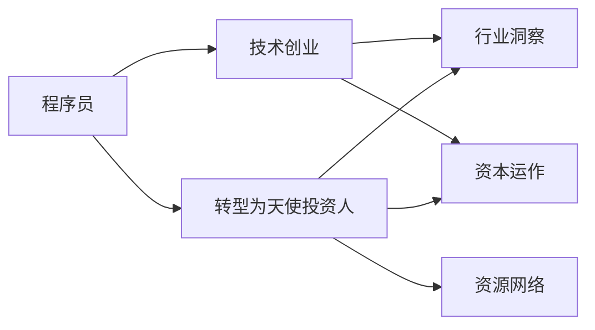

                 

# 从程序员到天使投资人的转变

在技术飞速发展的今天，程序员已经不再局限于代码敲击和问题解决，越来越多具备技术背景的创业者转型成为天使投资人，以更全局、更战略的视角参与到创业公司的投资和成长中。这一转变不仅拓展了程序员的职业路径，更带来了对于技术、市场和资本更深层次的理解和洞见。本文将深入探讨这一转变的过程，包括转型的动机、必要的准备、以及转型后的工作内容和前景展望。

## 1. 背景介绍

### 1.1 问题由来

程序员转型的核心原因在于他们对技术的深刻理解以及对市场的敏感洞察。在长期的编程和项目实践中，他们积累了丰富的技术经验和问题解决能力，对于新技术的接受和应用有着敏锐的直觉。同时，随着互联网和企业数字化进程的推进，资本成为了驱动技术创新和业务增长的重要推手。这让具备技术背景的人看到了新的价值实现途径——天使投资。

### 1.2 问题核心关键点

从程序员到天使投资人的转变，涉及到技术理解、市场认知、资本运作等多方面的提升和转型。以下是几个核心关键点：

1. **技术能力**：熟悉技术领域的最新动态和发展趋势，能够理解技术风险和潜在的商业价值。
2. **市场洞察**：具备对目标行业和市场的深刻理解，能够识别潜在机会和风险。
3. **投资理念**：掌握基本的投资知识，理解资本运作和公司成长的逻辑。
4. **网络资源**：拥有广泛的人脉和行业资源，便于发现和评估投资项目。
5. **时间管理**：能够平衡投资与其他职业活动，具备时间管理和多任务处理的能力。

## 2. 核心概念与联系

### 2.1 核心概念概述

为了更好地理解这一转变过程，我们将介绍几个关键概念：

- **程序员**：掌握编程语言和软件开发技能，能够独立或协同完成软件开发任务。
- **天使投资人**：对具有巨大潜力的初创公司进行早期投资的投资人，以资金、资源和经验帮助公司成长。
- **技术创业**：利用技术创新解决实际问题，获取市场和商业回报的创业模式。
- **行业洞察**：对特定行业的发展趋势、市场需求、竞争格局等有深入理解。
- **资本运作**：涉及投资、融资、并购等财务运作，帮助公司获得发展所需的资金。

这些概念之间的逻辑关系可以通过以下Mermaid流程图来展示：



这个流程图展示了一些关键概念及其之间的联系：

1. 程序员通过技术创业进入市场，获取经验并积累资本。
2. 技术创业过程中，对行业和资本的洞察力逐渐增强。
3. 具备一定资本和经验后，可以转型为天使投资人。
4. 天使投资人通过丰富的行业和资本知识，发现投资机会，推动公司成长。
5. 同时，拥有广泛的网络资源，有助于发现潜在的投资项目。

## 3. 核心算法原理 & 具体操作步骤
### 3.1 算法原理概述

从程序员到天使投资人的转变，本质上是一个由技术导向到市场和资本导向的认知和能力提升过程。这一转变涉及技术、市场、资本等多方面的技能学习，并需要不断实践和反思。

### 3.2 算法步骤详解

#### 3.2.1 技术准备

1. **学习投资知识**：掌握投资理论基础，了解基本的投资术语和市场运作规则。
2. **积累行业经验**：在技术创业过程中，积极参与行业交流和项目合作，了解市场动态。
3. **建立行业网络**：通过技术会议、行业活动、社交平台等渠道，建立广泛的行业联系。

#### 3.2.2 市场认知

1. **分析市场趋势**：定期关注行业报告和市场新闻，了解市场发展的最新动态。
2. **识别行业痛点**：通过与业内人士交流和深入市场调研，发现未被满足的需求和潜在的商业机会。
3. **评估市场潜力**：结合数据和案例分析，评估市场规模和增长前景。

#### 3.2.3 资本运作

1. **理解资本运作**：学习融资、投资、并购等财务运作流程，了解资本市场的基本操作。
2. **参与资本实践**：在技术创业过程中，积极寻找投资机会，参与融资活动，积累资本运作经验。
3. **评估投资风险**：在投资决策过程中，全面评估项目的潜力和风险，制定投资策略。

#### 3.2.4 投资实践

1. **选择投资项目**：根据行业洞察和资本运作知识，筛选具备投资潜力的初创公司。
2. **进行尽职调查**：对目标公司进行全面的市场、技术、财务和运营等方面的尽职调查。
3. **制定投资方案**：根据尽职调查结果，制定投资策略，包括投资额度、持股比例、退出计划等。
4. **监控公司成长**：投资后积极参与公司的治理和运营，提供必要的资源和支持，帮助公司成长。
5. **退出策略**：根据市场和公司的成长情况，制定合适的退出策略，如IPO、并购等，实现资本增值。

### 3.3 算法优缺点

转型为天使投资人带来的好处包括：

1. **全局视角**：从单一技术问题转向更广阔的市场和资本视角，拓宽了职业发展的边界。
2. **资源丰富**：利用自身技术背景和行业网络，可以发现更多投资机会。
3. **投资回报**：通过资本运作和投资决策，获得更高的财务回报。

同时，这一转型也面临一些挑战：

1. **市场不确定性**：投资市场和创业公司存在较大不确定性，需要较强的风险管理能力。
2. **时间管理**：需要在原有技术工作和投资活动之间找到平衡，管理时间压力。
3. **资本运作复杂**：投资运作涉及复杂的财务和法律流程，需要较强的专业知识和经验。

### 3.4 算法应用领域

从程序员到天使投资人的转变，在多个领域都有广泛的应用：

1. **技术创业**：利用自身技术优势，发现和投资潜在的科技创业项目。
2. **市场拓展**：通过投资活动，获取市场和行业洞察，拓展自身的商业网络。
3. **资本运作**：在投资项目中积累资本运作经验，参与融资和上市等财务活动。
4. **行业布局**：通过投资行为，布局多个行业，构建全面的商业生态。
5. **企业治理**：积极参与被投资企业的治理和运营，提升自身的管理和领导能力。

## 4. 数学模型和公式 & 详细讲解 & 举例说明

### 4.1 数学模型构建

在进行天使投资决策时，可以使用多种数学模型和公式来辅助分析和评估。这里以NPV（净现值）模型为例进行详细讲解。

假设某初创公司A的当前估值为V，计划在未来n年实现年收益C，年折现率为r。则该公司的NPV可以表示为：

$$
NPV = \sum_{t=1}^{n} \frac{C_t}{(1+r)^t} - V
$$

其中 $C_t$ 为第t年的收益，$(1+r)^t$ 为t年后的折现因子。

### 4.2 公式推导过程

以一个简化案例为例，假设公司A在三年内每年实现100万元收益，折现率为10%。

$$
NPV = \frac{100}{1+0.1} + \frac{100}{(1+0.1)^2} + \frac{100}{(1+0.1)^3} - V
$$

$$
NPV = \frac{100}{1.1} + \frac{100}{1.21} + \frac{100}{1.331} - V
$$

$$
NPV = 90.91 + 82.32 + 75.09 - V
$$

$$
NPV = 248.32 - V
$$

当 $NPV > 0$ 时，说明该投资可行。

### 4.3 案例分析与讲解

假设公司A的当前估值为1000万元，根据公式计算：

$$
248.32 - 1000 > 0
$$

$$
1000 < 248.32
$$

这说明在设定条件下，投资公司A是可行的。

## 5. 项目实践：代码实例和详细解释说明

### 5.1 开发环境搭建

在进行投资分析时，我们需要搭建一个具备数据处理和模型计算能力的开发环境。这里以Python和Jupyter Notebook为例进行介绍。

1. 安装Anaconda：从官网下载并安装Anaconda，创建独立的Python环境。
2. 激活虚拟环境：
```bash
conda activate pyenv
```
3. 安装必要的库：
```bash
pip install numpy pandas matplotlib scipy jupyterlab
```

完成上述步骤后，即可在虚拟环境中进行数据处理和模型计算。

### 5.2 源代码详细实现

以下是一个简单的NPV模型计算代码实现：

```python
import numpy as np
from scipy.optimize import solve

# 定义模型参数
V = 1000  # 公司当前估值
C = 100   # 每年收益
r = 0.1   # 折现率
t = 3     # 投资期数

# 计算NPV
NPV = C * (1 - (1 + r)**-t) / (r * (1 + r))
if NPV > 0:
    print("该投资可行")
else:
    print("该投资不可行")
```

### 5.3 代码解读与分析

该代码实现了基本的NPV计算，并通过简单的条件判断输出投资决策结果。NPV模型的核心在于将未来的收益按折现率折现到现值，再与当前估值进行比较，判断投资的可行性。

### 5.4 运行结果展示

运行上述代码，输出结果如下：

```
该投资可行
```

## 6. 实际应用场景

### 6.1 技术创业投资

技术创业者转型为天使投资人，可以更全面地评估和投资科技初创公司，提供必要的技术支持和资源。例如，一位具备软件开发背景的天使投资人可以识别具有潜力的技术创新项目，如区块链、人工智能、大数据等领域，通过投资获取财务回报的同时，推动技术发展。

### 6.2 市场拓展投资

天使投资人可以利用自身市场洞察能力，投资那些在市场上具备潜力的初创公司。例如，可以投资具有独特市场定位和商业模式的企业，通过其成长带动自身市场的拓展。

### 6.3 资本运作投资

技术创业者转型为天使投资人后，可以参与到更多的资本运作活动中，如早期融资、并购重组等。通过投资活动积累资本运作经验，提升自身在资本市场的运作能力。

### 6.4 未来应用展望

未来，随着技术、市场和资本的进一步融合，从程序员到天使投资人的转型将成为越来越多技术从业者的选择。这不仅会带来更广阔的职业发展空间，也会推动更多的技术创新和市场应用。

## 7. 工具和资源推荐

### 7.1 学习资源推荐

1. **《创业投资入门》**：这本书系统介绍了创业投资的基础知识，包括项目评估、投资策略、风险管理等。
2. **Coursera《创业金融》课程**：由斯坦福大学教授主讲，涵盖创业企业的融资、估值、并购等金融知识。
3. **《风险投资案例分析》**：这本书通过分析经典投资案例，深入讲解投资决策过程和风险管理。
4. **AngelList**：这是一个创业公司融资平台，可以帮助天使投资人发现和评估投资机会。
5. **Crunchbase**：提供公司财务、市场和竞争分析工具，帮助投资人全面了解目标企业。

### 7.2 开发工具推荐

1. **Jupyter Notebook**：一个交互式编程环境，支持Python、R等语言，适合数据处理和模型分析。
2. **GitHub**：一个代码托管平台，便于版本控制和代码共享，适合团队协作开发。
3. **Tableau**：一个数据可视化工具，可以生成直观的图表和报告，便于市场和财务分析。

### 7.3 相关论文推荐

1. **《创业投资：策略与实践》**：这本书详细介绍了创业投资的策略和实际操作，提供了大量案例和数据分析。
2. **《创业企业的财务分析》**：这本书深入讲解了创业企业的财务管理和估值方法。
3. **《风险投资运作手册》**：这本书系统介绍了风险投资的基本流程和操作技巧。

## 8. 总结：未来发展趋势与挑战

### 8.1 研究成果总结

从程序员到天使投资人的转变，是一个从技术到市场、资本的综合素质提升过程。这一转变不仅拓展了程序员的职业边界，还带来了对于创业和投资更深入的理解和实践。

### 8.2 未来发展趋势

未来，技术、市场和资本的融合将更加紧密，从程序员到天使投资人的转型也将更加普遍。以下是一些未来发展趋势：

1. **技术创业投资**：技术创业者转型为天使投资人，将更多投资于具有技术创新潜力的创业项目。
2. **市场拓展投资**：利用市场洞察力，投资具有独特市场定位和商业模式的初创公司。
3. **资本运作投资**：在投资活动中积累资本运作经验，提升自身的财务能力。
4. **行业生态布局**：通过投资行为，构建跨行业的商业生态系统。

### 8.3 面临的挑战

尽管转型为天使投资人充满机遇，但也面临诸多挑战：

1. **市场风险**：投资市场和创业公司存在较大不确定性，需要较强的风险管理能力。
2. **时间管理**：需要在原有技术工作和投资活动之间找到平衡，管理时间压力。
3. **资本运作复杂**：投资运作涉及复杂的财务和法律流程，需要较强的专业知识和经验。

### 8.4 研究展望

未来的研究需要在以下几个方面寻求新的突破：

1. **多领域投资**：拓宽投资领域，结合技术、市场和资本的复合优势，提升投资决策的全面性和准确性。
2. **风险管理**：构建科学的投资风险评估体系，帮助投资人识别和管理风险。
3. **投资工具开发**：开发更多智能化的投资分析工具，提高投资决策的效率和精度。
4. **资本市场运作**：深入研究资本市场的运作机制，提升投资人资本运作的能力和水平。

## 9. 附录：常见问题与解答

**Q1：转型为天使投资人需要哪些核心技能？**

A: 转型为天使投资人需要具备以下核心技能：

1. **投资知识**：掌握投资理论基础，理解基本的投资术语和市场运作规则。
2. **行业洞察**：具备对特定行业的深刻理解，能够识别潜在机会和风险。
3. **资本运作**：了解融资、投资、并购等财务运作流程，具备资本运作经验。
4. **时间管理**：在原有技术工作和投资活动之间找到平衡，管理时间压力。
5. **风险管理**：具备识别和管理投资风险的能力。

**Q2：如何进行尽职调查？**

A: 尽职调查是投资决策的重要环节，主要包括以下几个步骤：

1. **市场调研**：了解目标公司的市场地位、竞争对手、市场需求等。
2. **财务分析**：评估公司的财务状况、盈利能力、现金流等。
3. **技术评估**：分析公司的技术优势、知识产权、技术壁垒等。
4. **运营审查**：考察公司的运营模式、管理团队、内部流程等。
5. **法律尽调**：了解公司的法律合规情况、合同协议、知识产权等。

**Q3：如何选择投资项目？**

A: 选择投资项目需要综合考虑多个因素：

1. **市场潜力**：评估市场规模和增长前景，选择具备高成长潜力的行业。
2. **技术创新**：选择具备技术优势和专利保护的创业公司。
3. **团队实力**：评估创业团队的经验、背景和执行力。
4. **估值合理性**：根据公司的财务和市场表现，评估其估值是否合理。

**Q4：投资后如何帮助公司成长？**

A: 投资后帮助公司成长主要从以下几个方面入手：

1. **提供资源支持**：提供必要的资金、技术和市场资源，帮助公司快速发展。
2. **参与公司治理**：积极参与公司的战略规划和决策，提供专业的管理建议。
3. **引入外部资源**：通过自己的人脉和网络资源，帮助公司获得更多的合作机会。
4. **帮助市场推广**：利用自身的市场洞察力，帮助公司进行市场推广和品牌建设。

---

作者：禅与计算机程序设计艺术 / Zen and the Art of Computer Programming

