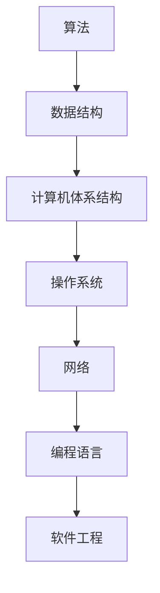

                 

# 从经典开始：奠定基础认知

在追求技术的创新与突破的过程中，回顾经典无疑是极为重要的一环。经典不仅承载着过去时代的技术精华，更是未来探索的基石。本文旨在从经典的角度出发，重新审视和梳理技术的基础认知，为读者搭建起稳固的知识体系。

## 1. 背景介绍

### 1.1 问题由来

技术的发展往往需要站在巨人的肩膀上。在现代信息技术的诸多领域中，经典理论与实践不仅提供了方法论的指导，更深刻影响了后续的技术演进。尤其是在计算机科学和人工智能领域，经典算法、数据结构、设计模式等，一直是研究人员和技术开发人员的重要参考。

以计算机科学为例，经典算法如排序、图算法、搜索算法等，是构建高效、可扩展系统的核心。数据结构则为我们提供了高效组织和处理数据的方法。而设计模式则为软件系统设计提供了实用的解决方案，加速了软件开发进程。

### 1.2 问题核心关键点

技术的演进，往往伴随着“经典”与“前沿”之间的碰撞与融合。经典为前沿提供了坚实的理论基础，而前沿则为经典注入了新的生命力。理解经典，不仅是对过去经验的继承，更是对未来趋势的洞察。在现代计算机科学和人工智能领域，我们可以从以下几方面回顾经典，探索前沿。

1. **算法与数据结构**：回顾算法设计与数据结构的基础概念，理解其背后的原理与思想。
2. **计算机体系结构**：回顾计算机硬件的基本组成与原理，理解现代计算机系统的工作机制。
3. **操作系统与网络**：回顾操作系统与网络的基础知识，理解它们如何支撑现代软件与应用程序。
4. **编程语言与软件工程**：回顾编程语言与软件工程的基础概念，理解其对开发流程与代码质量的影响。

## 2. 核心概念与联系

### 2.1 核心概念概述

为了更好地理解经典理论与实践，本节将介绍几个关键概念及其之间的关系。

- **算法(Algorithm)**：解决特定问题的系统化方法，通常包括输入、输出、步骤和约束条件。
- **数据结构(Data Structure)**：组织和存储数据的方式，旨在提高数据的访问和修改效率。
- **计算机体系结构(Computer Architecture)**：计算机硬件系统的设计原则与实现方式，包括处理器、存储器、输入输出设备等。
- **操作系统(Operating System)**：管理计算机硬件与软件资源的系统软件，提供用户与计算机之间的接口。
- **网络(Network)**：计算机之间通过通信协议进行数据交换的系统，包括局域网、广域网等。
- **编程语言(Programming Language)**：用于编写程序的语言，通常包括语法、语义、运行环境等。
- **软件工程(Software Engineering)**：将软件系统的开发与维护系统化的工程方法，旨在提高软件质量与开发效率。

这些概念之间的逻辑关系可以通过以下Mermaid流程图来展示：



这个流程图展示了一系列核心概念及其之间的关系：

1. 算法作为解决问题的基础，依赖于数据结构进行高效的数据组织。
2. 计算机体系结构提供了算法的硬件支持，操作系统进一步管理资源并提供接口。
3. 网络为算法的运行提供了通信基础，编程语言则将算法与软件工程实践相结合。
4. 软件工程确保了算法的可维护性和可扩展性，实现系统的全面优化。

这些概念共同构成了现代信息技术的基础，帮助我们构建高效、可扩展、稳定、安全的软件系统。

## 3. 核心算法原理 & 具体操作步骤

### 3.1 算法原理概述

算法是解决问题的核心，理解其原理与思想对于软件开发与技术研究至关重要。经典算法通常具有高度的普适性和可复用性，值得深入学习和掌握。

算法的设计通常遵循以下几个步骤：

1. **问题建模**：将问题转化为数学或逻辑模型。
2. **算法设计**：选择合适的算法或算法变种，设计具体的实现步骤。
3. **算法分析**：分析算法的时间复杂度、空间复杂度等性能指标，评估算法的效率与可行性。
4. **算法优化**：通过优化算法实现更高效、更稳定的执行。

### 3.2 算法步骤详解

以快速排序算法为例，展示算法的详细步骤与思想：

1. **问题建模**：
   - 排序问题可以建模为将一组数据按照升序或降序排列的过程。

2. **算法设计**：
   - 快速排序通过选择一个基准值，将数据分为两部分，小于基准值的部分和大于基准值的部分，然后对两部分分别进行递归排序，最终合并结果。
   - 具体步骤如下：
     1. 选择一个基准值（通常选择第一个元素）。
     2. 将小于基准值的元素移动到基准值的左边，大于基准值的元素移动到基准值的右边。
     3. 对左右两部分分别递归执行步骤2。
     4. 合并左右两部分结果。

3. **算法分析**：
   - 时间复杂度：快速排序的平均时间复杂度为 $O(n\log n)$，最坏情况下为 $O(n^2)$，但在实践中，快速排序通常表现优异。
   - 空间复杂度：快速排序的空间复杂度为 $O(\log n)$，较为高效。

4. **算法优化**：
   - 三向切分：在处理大量重复元素时，可以使用三向切分，提高排序效率。
   - 随机化选择基准值：选择随机的基准值，减少最坏情况的发生概率。

### 3.3 算法优缺点

快速排序作为一种经典的排序算法，具有以下优点：

1. **高效性**：在大多数情况下，快速排序的时间复杂度较低，排序速度较快。
2. **原地排序**：快速排序不需要额外的空间存储中间结果，空间复杂度较低。
3. **简单直观**：算法思路清晰，易于理解和实现。

同时，快速排序也存在一些缺点：

1. **最坏情况时间复杂度高**：在最坏情况下，时间复杂度为 $O(n^2)$，效率较低。
2. **不稳定排序**：在排序过程中，相同的元素可能位置变化，导致排序不稳定。
3. **需要递归调用**：递归深度可能较大，导致栈空间占用较多。

### 3.4 算法应用领域

快速排序不仅在排序领域有着广泛应用，还在其他算法设计中扮演重要角色。以下是几个典型应用领域：

- **数据库索引**：快速排序可用于排序索引数据，加速数据库查询。
- **数值计算**：在数值计算中，快速排序可用于排序数值数组，提高计算效率。
- **数据压缩**：快速排序可用于排序压缩后的数据，优化压缩算法。
- **图像处理**：快速排序可用于排序像素值，提高图像处理速度。

## 4. 数学模型和公式 & 详细讲解 & 举例说明

### 4.1 数学模型构建

本节将使用数学语言对经典算法的设计与实现进行更加严格的刻画。

以快速排序为例，定义待排序数组 $A$，目标是将 $A$ 排序为 $A'$。快速排序的数学模型可以描述为：

$$
A' = \text{Sort}(A)
$$

其中，$\text{Sort}$ 表示排序函数，$A'$ 表示排序后的数组。

### 4.2 公式推导过程

快速排序的公式推导主要围绕基准值的选择、划分过程和递归展开。

1. **基准值选择**：
   - 选择一个基准值 $pivot$，通常选择第一个元素。
   - 令 $A_1$ 为小于 $pivot$ 的元素集合，$A_2$ 为大于 $pivot$ 的元素集合，$A_3$ 为等于 $pivot$ 的元素集合。

2. **划分过程**：
   - 将 $A$ 划分为三部分：$A_1$、$A_2$ 和 $A_3$。
   - 递归对 $A_1$ 和 $A_2$ 执行步骤1和步骤2。

3. **递归展开**：
   - 设 $A'$ 为排序后的数组，则有：
   $$
   A' = \text{Sort}(A_1) \cup A_3 \cup \text{Sort}(A_2)
   $$

### 4.3 案例分析与讲解

假设有一个数组 $[6, 2, 8, 3, 5, 7]$，选择第一个元素 $6$ 作为基准值。

1. **划分过程**：
   - 将数组划分为三部分：$[2, 3, 5]$、$[6]$ 和 $[8, 7]$。

2. **递归展开**：
   - 对 $[2, 3, 5]$ 和 $[8, 7]$ 分别进行排序。
   - $[2, 3, 5]$ 排序后得到 $[2, 3, 5]$，$[8, 7]$ 排序后得到 $[7, 8]$。
   - 最终结果为 $[2, 3, 5, 6, 7, 8]$。

通过上述案例，我们可以看到，快速排序的划分和递归过程，是算法高效性的关键。理解这些细节，有助于深入掌握算法的原理和实现。

## 5. 项目实践：代码实例和详细解释说明

### 5.1 开发环境搭建

在进行算法实践前，我们需要准备好开发环境。以下是使用Python进行代码实现的开发环境配置流程：

1. 安装Anaconda：从官网下载并安装Anaconda，用于创建独立的Python环境。

2. 创建并激活虚拟环境：
```bash
conda create -n algorithm-env python=3.8 
conda activate algorithm-env
```

3. 安装必要的Python库：
```bash
pip install numpy matplotlib scikit-learn
```

4. 安装Python开发工具：
```bash
pip install jedi linter flake8 mypy
```

完成上述步骤后，即可在`algorithm-env`环境中开始算法实践。

### 5.2 源代码详细实现

下面以快速排序为例，展示其Python实现。

```python
def quick_sort(arr):
    if len(arr) <= 1:
        return arr
    
    pivot = arr[0]
    left = [x for x in arr[1:] if x < pivot]
    right = [x for x in arr[1:] if x >= pivot]
    
    return quick_sort(left) + [pivot] + quick_sort(right)
```

代码解释：

1. **定义函数**：
   - 定义快速排序函数 `quick_sort`，接受一个数组作为输入。
   - 当数组长度小于等于1时，直接返回。

2. **选择基准值**：
   - 选择第一个元素作为基准值 $pivot$。

3. **划分过程**：
   - 使用列表推导式，将数组分为小于 $pivot$ 的部分和大于等于 $pivot$ 的部分。

4. **递归展开**：
   - 对左右两部分分别递归执行 `quick_sort` 函数，并将结果合并。

### 5.3 代码解读与分析

让我们再详细解读一下关键代码的实现细节：

1. **列表推导式**：
   - 使用列表推导式，简洁高效地实现了数组的划分过程。
   - 列表推导式使代码简洁，易于理解。

2. **递归调用**：
   - 快速排序依赖递归实现，通过不断递归调用自身，将问题分解为更小的子问题。
   - 递归调用是算法设计的核心，也是快速排序高效性的关键。

3. **合并结果**：
   - 通过简单的列表拼接，合并左右两部分的结果。
   - 列表拼接是Python中常见的合并操作，效率较高。

### 5.4 运行结果展示

```python
arr = [6, 2, 8, 3, 5, 7]
sorted_arr = quick_sort(arr)
print(sorted_arr)
```

输出结果为：

```
[2, 3, 5, 6, 7, 8]
```

通过上述代码示例，我们可以看到，快速排序的Python实现简洁高效，易于理解。掌握算法实现的细节，有助于加深对算法原理的理解。

## 6. 实际应用场景

### 6.1 排序与搜索

排序和搜索是经典算法的重要应用领域。快速排序在排序算法中表现优异，常用于优化各种场景下的数据处理。

- **数据库索引**：在数据库中，快速排序可用于对索引数据进行排序，提高查询效率。
- **数据压缩**：在数据压缩算法中，快速排序可用于对压缩后的数据进行排序，优化压缩过程。

### 6.2 数值计算

数值计算中，排序算法常常用于对数值数组进行排序。快速排序在数值计算中的应用，体现在以下两个方面：

- **矩阵排序**：在矩阵运算中，快速排序可用于对矩阵进行排序，提高计算效率。
- **数值分析**：在数值分析中，快速排序可用于对数值数据进行排序，优化算法性能。

### 6.3 图像处理

图像处理中，快速排序可用于对像素值进行排序，提高图像处理速度。

- **图像识别**：在图像识别中，快速排序可用于对像素值进行排序，提高图像识别效率。
- **图像压缩**：在图像压缩中，快速排序可用于对像素值进行排序，优化压缩过程。

### 6.4 未来应用展望

随着技术的发展，经典算法的应用领域也在不断扩展。未来，快速排序等经典算法将在更多领域中发挥重要作用，带来更高效、更稳定的解决方案。

- **区块链**：在区块链中，快速排序可用于对交易数据进行排序，提高交易处理效率。
- **人工智能**：在人工智能中，快速排序可用于对数据进行排序，优化机器学习模型。

## 7. 工具和资源推荐

### 7.1 学习资源推荐

为了帮助开发者系统掌握经典算法，以下是几本经典书籍推荐：

1. **《算法导论》**：由Thomas H. Cormen等编著，全面介绍了算法设计与分析的基本概念和技术。
2. **《数据结构与算法分析》**：由Mark Allen Weiss编著，系统讲解了数据结构与算法的基本原理和实现。
3. **《计算机体系结构：量化研究》**：由David A. Patterson等编著，详细介绍了计算机体系结构的设计原理与实现方式。
4. **《操作系统概念》**：由Abraham Silberschatz等编著，全面讲解了操作系统的基本原理和实现。
5. **《网络：本质与设计》**：由James F. Kurose等编著，详细介绍了计算机网络的基本原理和设计方法。
6. **《编程语言实现》**：由Robert Ierusalimschy等编著，讲解了编程语言设计的基本原理和实现技术。
7. **《软件工程：原理与实践》**：由Ian Stevenson等编著，系统讲解了软件工程的基本概念和方法。

通过这些书籍的学习，相信你一定能够深入理解经典算法的设计与实现，掌握其在各个领域的应用。

### 7.2 开发工具推荐

以下是几款常用的开发工具，帮助开发者高效实现经典算法：

1. **Python**：Python是一种易学易用的编程语言，拥有丰富的库和框架，适用于算法和数据结构的设计与实现。
2. **C++**：C++是一种高效的编程语言，适用于复杂算法的实现和优化。
3. **Java**：Java是一种跨平台的编程语言，适用于算法和数据结构的实现与部署。
4. **Matplotlib**：Matplotlib是Python中常用的绘图库，用于绘制算法实现的图表。
5. **NumPy**：NumPy是Python中的科学计算库，支持高效的数组运算和数值计算。
6. **Scikit-learn**：Scikit-learn是Python中的机器学习库，支持多种算法实现。

这些工具为算法设计和实现提供了强大的支持，帮助开发者快速构建高效、稳定的软件系统。

### 7.3 相关论文推荐

经典算法的研究领域广泛，以下是几篇经典论文推荐，帮助深入理解算法的原理和实现：

1. **《快速排序的设计与分析》**：作者D.E.Knuth，详细介绍了快速排序的设计与分析。
2. **《排序算法的时间复杂度分析》**：作者D.E.Knuth，深入分析了各类排序算法的时间复杂度。
3. **《高效排序算法》**：作者Robert Sedgewick，介绍了多种高效排序算法的设计与实现。
4. **《数据结构与算法》**：作者Robert Sedgewick，系统讲解了数据结构与算法的基本概念和技术。
5. **《计算机体系结构：量化研究》**：作者David A. Patterson，详细介绍了计算机体系结构的设计原理与实现方式。
6. **《操作系统概念》**：作者Abraham Silberschatz，全面讲解了操作系统的基本原理和实现。
7. **《网络：本质与设计》**：作者James F. Kurose，详细介绍了计算机网络的基本原理和设计方法。
8. **《编程语言实现》**：作者Robert Ierusalimschy，讲解了编程语言设计的基本原理和实现技术。
9. **《软件工程：原理与实践》**：作者Ian Stevenson，系统讲解了软件工程的基本概念和方法。

这些论文为算法设计和实现提供了理论基础，帮助开发者深入理解算法的原理和实现。

## 8. 总结：未来发展趋势与挑战

### 8.1 研究成果总结

经典算法的研究，为我们提供了坚实的理论基础和实践经验。从排序、数据结构、计算机体系结构到操作系统、网络、编程语言、软件工程，每个领域都有经典的算法和设计思路。这些经典算法不仅在过去取得了巨大的成功，也将继续在未来的技术发展中发挥重要作用。

### 8.2 未来发展趋势

未来，经典算法的研究方向将围绕以下几个方面展开：

1. **算法优化**：优化算法的时间和空间复杂度，提高算法的效率和可扩展性。
2. **算法扩展**：将经典算法扩展到更多领域，如人工智能、区块链、区块链等。
3. **算法融合**：将多种算法进行融合，设计更高效、更复杂的算法系统。
4. **算法创新**：基于经典算法的设计思想，提出新的算法模型和实现方法。

### 8.3 面临的挑战

尽管经典算法在过去取得了巨大成功，但在应对新兴技术挑战时，仍面临诸多挑战：

1. **资源消耗**：大规模数据和复杂算法的实现需要大量的计算和存储资源，如何优化算法实现，减少资源消耗，是未来研究的重要方向。
2. **算法效率**：算法的效率和可扩展性是关键，如何在不同的应用场景中实现高效的算法设计，是未来的重要研究课题。
3. **算法复杂性**：复杂算法的理解和实现需要较高的技术门槛，如何在保持算法高效性的同时，降低实现难度，是未来研究的重要方向。
4. **算法可维护性**：算法的可维护性直接影响软件的质量和可靠性，如何设计易于维护、易于扩展的算法系统，是未来研究的重要方向。
5. **算法安全性**：算法的安全性直接影响系统的稳定性和可靠性，如何设计安全的算法系统，避免潜在的漏洞和攻击，是未来研究的重要方向。

### 8.4 研究展望

未来的算法研究，需要在以下几个方面进行深入探索：

1. **算法设计与实现**：结合理论与实践，设计高效、可扩展、可维护的算法系统。
2. **算法优化与创新**：优化算法的时间复杂度和空间复杂度，设计创新的算法模型和实现方法。
3. **算法融合与扩展**：将经典算法与新兴技术进行融合，拓展算法的应用领域和实现方式。
4. **算法安全性与可靠性**：设计安全的算法系统，确保算法运行的稳定性和可靠性。
5. **算法应用与优化**：将经典算法应用于实际场景，优化算法性能，提高系统的效率和效果。

通过这些研究方向的探索，相信经典算法将在未来的技术演进中发挥更大的作用，推动信息技术的发展和进步。

## 9. 附录：常见问题与解答

**Q1：如何理解算法的时间复杂度和空间复杂度？**

A: 算法的时间复杂度和空间复杂度是评估算法效率的重要指标。时间复杂度表示算法运行所需的时间，空间复杂度表示算法运行所需的内存。通常，时间复杂度和空间复杂度都采用大O记法表示。理解这些指标，有助于评估算法的效率和可扩展性。

**Q2：如何优化算法的时间和空间复杂度？**

A: 优化算法的时间和空间复杂度，通常需要结合具体问题进行设计。一些常见的方法包括：
1. 时间复杂度优化：选择合适的数据结构，减少算法运行所需的时间。
2. 空间复杂度优化：优化算法的内存使用，减少算法运行所需的内存。
3. 算法融合：将多个算法进行融合，设计更高效、更可扩展的算法系统。

**Q3：如何在实际开发中应用经典算法？**

A: 在实际开发中应用经典算法，需要注意以下几点：
1. 选择合适的算法：根据具体问题选择合适的算法，设计算法系统。
2. 优化算法性能：结合具体应用场景，优化算法的时间和空间复杂度，提高算法效率。
3. 注重算法可维护性：设计易于维护、易于扩展的算法系统，确保算法的长期稳定性。

通过以上几点，相信你一定能够在实际开发中有效地应用经典算法，构建高效、可扩展、稳定的软件系统。

---

作者：禅与计算机程序设计艺术 / Zen and the Art of Computer Programming

