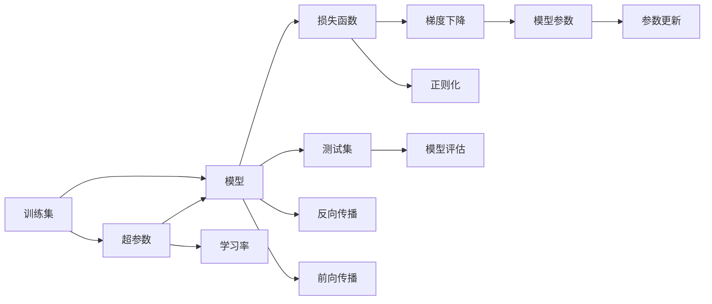

                 

# 从经典开始：奠定基础认知

> 关键词：经典模型,机器学习,深度学习,算法原理,编程实践

## 1. 背景介绍

### 1.1 问题由来
在计算机科学和人工智能领域，机器学习和深度学习是两个最为核心和基础的技术分支。理解机器学习和深度学习的经典算法与实践方法，是每个从业者必备的基础。然而，由于这两大领域的知识体系庞杂、概念抽象，很多初学者在入门阶段往往感到无从下手。

本文将从经典算法入手，系统地介绍机器学习和深度学习的核心概念、算法原理与实践方法，旨在为读者奠定坚实的基础认知。通过深入浅出的讲解，帮助读者理解机器学习与深度学习的基本原理，掌握编程实践技巧，从而更高效地开展相关研究工作。

### 1.2 问题核心关键点
理解机器学习和深度学习的经典算法与实践方法，是每个从业者必备的基础。本文的核心关键点包括：
- 经典算法：决策树、支持向量机、K近邻、神经网络、卷积神经网络、循环神经网络等
- 算法原理：梯度下降、交叉验证、正则化、随机森林、集成学习、深度学习框架、自动微分等
- 编程实践：TensorFlow、PyTorch、Scikit-Learn、Keras、模型保存与加载、数据预处理、模型评估与调参等

## 2. 核心概念与联系

### 2.1 核心概念概述

在深入介绍机器学习和深度学习的核心算法与实践方法之前，首先需要理解一些关键的概念和术语，如训练集、测试集、损失函数、超参数、过拟合、欠拟合、正则化、卷积核、池化、激活函数、反向传播、前向传播、梯度下降等。

以下是对这些核心概念的简单概述：

- **训练集**：用于模型训练的数据集，通常包含大量的标注样本。
- **测试集**：用于模型测试和评估的数据集，不参与模型的训练。
- **损失函数**：用于衡量模型预测结果与真实标签之间的差距，优化目标。
- **超参数**：模型训练过程中需要手动设置的参数，如学习率、批大小、正则化系数等。
- **过拟合**：模型在训练集上表现良好，但在测试集上表现不佳，泛化能力差。
- **欠拟合**：模型在训练集和测试集上表现均不佳，未能充分学习数据的特征。
- **正则化**：通过引入惩罚项，避免过拟合现象，如L1正则、L2正则等。
- **卷积核**：卷积神经网络中的核心组件，用于提取局部特征。
- **池化**：减少卷积核输出的维度，提高模型计算效率。
- **激活函数**：在神经网络中引入非线性映射，增强模型的表达能力。
- **反向传播**：通过链式法则，计算损失函数对模型参数的梯度，进行参数更新。
- **前向传播**：将输入数据通过模型计算，得到预测结果。
- **梯度下降**：优化算法的核心，通过不断调整参数，最小化损失函数。

### 2.2 核心概念联系
以上概念通过以下Mermaid流程图进行展示：



这个流程图展示了机器学习模型从数据输入到参数更新的全过程，其中各个核心概念之间的联系清晰可见：

1. 训练集通过模型计算预测结果。
2. 预测结果与真实标签之间的差距通过损失函数计算。
3. 损失函数对模型参数的梯度通过反向传播计算。
4. 梯度值用于模型参数的更新，更新后的模型再次进行前向传播和损失函数计算。
5. 超参数和正则化影响模型训练过程。
6. 测试集用于模型评估和参数调优。

## 3. 核心算法原理 & 具体操作步骤
### 3.1 算法原理概述

机器学习和深度学习的核心算法包括监督学习、无监督学习、强化学习等，本文将重点介绍监督学习中的经典算法。

监督学习是指模型在带有标签的数据上进行训练，以学习输入与输出之间的映射关系。其核心思想是通过学习数据的特征，构建一个能够将输入映射到输出的函数，从而实现对新数据的预测。

### 3.2 算法步骤详解

以下以决策树算法为例，详细介绍机器学习算法的具体操作步骤：

**Step 1: 数据准备**
- 收集标注数据集，将数据分为训练集和测试集。
- 对数据进行清洗和预处理，如去除缺失值、处理异常值等。

**Step 2: 模型选择**
- 选择决策树算法作为模型，并进行参数设置，如树的深度、分裂策略等。

**Step 3: 模型训练**
- 使用训练集数据，通过决策树的构建算法（如ID3、C4.5、CART等），构建决策树模型。
- 对模型进行剪枝，防止过拟合。

**Step 4: 模型评估**
- 使用测试集数据，对模型进行评估，计算准确率、召回率、F1值等指标。
- 根据评估结果调整模型参数，进行模型调优。

**Step 5: 模型应用**
- 对新数据进行预测，应用决策树模型进行分类或回归。

### 3.3 算法优缺点

决策树算法具有以下优点：
- 易于理解和使用，适合解释性要求较高的场景。
- 模型简单，计算速度快，适用于大规模数据集。

同时，决策树算法也存在一些缺点：
- 容易过拟合，需要采取一些正则化措施。
- 对噪声和异常值敏感，需要进行数据预处理。
- 不支持连续型数据的处理，需要进行离散化。

### 3.4 算法应用领域

决策树算法广泛应用于各个领域，如金融风险评估、医疗诊断、网络安全检测、自然语言处理等。其强大的分类和回归能力，使其在解决实际问题时具有广泛的适用性。

## 4. 数学模型和公式 & 详细讲解 & 举例说明

### 4.1 数学模型构建

以下以线性回归模型为例，介绍机器学习模型的数学模型构建。

假设数据集包含$N$个样本，每个样本$x_i$有$m$个特征，模型输出为$y_i$。线性回归模型表示为：

$$
y_i = w^T x_i + b
$$

其中$w$为模型权重向量，$b$为偏置项，$x_i$为特征向量。

### 4.2 公式推导过程

线性回归模型的损失函数通常采用均方误差（MSE），表示为：

$$
L = \frac{1}{N} \sum_{i=1}^N (y_i - \hat{y_i})^2
$$

其中$\hat{y_i}$为模型预测值，$y_i$为真实标签值。

通过反向传播算法，计算损失函数对模型参数的梯度：

$$
\frac{\partial L}{\partial w} = \frac{2}{N} \sum_{i=1}^N (y_i - \hat{y_i}) x_i
$$

$$
\frac{\partial L}{\partial b} = \frac{2}{N} \sum_{i=1}^N (y_i - \hat{y_i})
$$

### 4.3 案例分析与讲解

以下以波士顿房价预测为例，详细介绍线性回归模型的构建和应用：

假设数据集包含$n=506$个样本，每个样本有$13$个特征，模型输出为房价。使用最小二乘法对模型进行求解，得到权重向量$w$和偏置项$b$。

```python
from sklearn.datasets import load_boston
from sklearn.linear_model import LinearRegression
import numpy as np

# 加载数据集
boston = load_boston()
X = boston.data
y = boston.target

# 建立线性回归模型
model = LinearRegression()

# 拟合模型
model.fit(X, y)

# 预测房价
X_new = np.array([[3.0, 2.0, 4.0, 0.0, 0.0, 6.0, 2.0, 10.0, 10.0, 4.0, 1.0, 2.0, 3.0, 5.0])
y_pred = model.predict(X_new)

print(y_pred)
```

## 5. 项目实践：代码实例和详细解释说明

### 5.1 开发环境搭建

在进行机器学习算法实践前，首先需要搭建开发环境。以下是使用Python进行Scikit-Learn开发的配置流程：

1. 安装Anaconda：从官网下载并安装Anaconda，用于创建独立的Python环境。

2. 创建并激活虚拟环境：
```bash
conda create -n sklearn-env python=3.8 
conda activate sklearn-env
```

3. 安装Scikit-Learn及其依赖包：
```bash
conda install scikit-learn matplotlib numpy pandas joblib threadpoolctl scipy cython
```

4. 安装TensorFlow和Keras（可选）：
```bash
conda install tensorflow keras
```

5. 安装相关工具包：
```bash
pip install jupyter notebook ipython
```

完成上述步骤后，即可在`sklearn-env`环境中开始实践。

### 5.2 源代码详细实现

以下以K近邻算法为例，给出使用Scikit-Learn库进行机器学习任务开发的Python代码实现。

首先，定义数据集和标签：

```python
from sklearn.datasets import load_iris
from sklearn.model_selection import train_test_split

# 加载数据集
iris = load_iris()

# 划分数据集
X_train, X_test, y_train, y_test = train_test_split(iris.data, iris.target, test_size=0.3, random_state=42)

# 显示数据集形状
print("训练集形状：", X_train.shape)
print("测试集形状：", X_test.shape)
```

然后，定义模型并训练：

```python
from sklearn.neighbors import KNeighborsClassifier

# 建立K近邻模型
knn = KNeighborsClassifier(n_neighbors=3)

# 训练模型
knn.fit(X_train, y_train)
```

接着，进行模型评估：

```python
from sklearn.metrics import accuracy_score

# 对测试集进行预测
y_pred = knn.predict(X_test)

# 计算准确率
accuracy = accuracy_score(y_test, y_pred)
print("模型准确率：", accuracy)
```

最后，可视化结果：

```python
import matplotlib.pyplot as plt

# 绘制ROC曲线
from sklearn.metrics import roc_curve, auc

y_proba = knn.predict_proba(X_test)[:, 1]
fpr, tpr, thresholds = roc_curve(y_test, y_proba)
roc_auc = auc(fpr, tpr)

plt.figure()
plt.plot(fpr, tpr, color='darkorange', lw=2, label='ROC curve (area = %0.2f)' % roc_auc)
plt.plot([0, 1], [0, 1], color='navy', lw=2, linestyle='--')
plt.xlim([0.0, 1.0])
plt.ylim([0.0, 1.05])
plt.xlabel('False Positive Rate')
plt.ylabel('True Positive Rate')
plt.title('Receiver Operating Characteristic')
plt.legend(loc="lower right")
plt.show()
```

以上就是使用Scikit-Learn库对K近邻算法进行机器学习任务开发的完整代码实现。可以看到，Scikit-Learn库提供了丰富的机器学习算法和工具，开发者只需关注算法实现，大大简化了开发过程。

### 5.3 代码解读与分析

让我们再详细解读一下关键代码的实现细节：

**加载数据集和划分数据集**：
- 使用Scikit-Learn的`load_iris`函数加载鸢尾花数据集。
- 使用`train_test_split`函数将数据集划分为训练集和测试集。

**建立模型和训练**：
- 使用`KNeighborsClassifier`类建立K近邻模型，设置近邻数$k$为3。
- 使用`fit`方法对模型进行训练。

**模型评估**：
- 使用Scikit-Learn的`accuracy_score`函数计算模型在测试集上的准确率。
- 使用`predict_proba`方法获取模型对测试集的预测概率，用于绘制ROC曲线。

**可视化结果**：
- 使用Matplotlib库绘制ROC曲线，可视化模型性能。

可以看到，Scikit-Learn库的封装使得机器学习任务的开发过程变得简洁高效。开发者只需关注算法实现，而无需过多关注底层实现细节。

当然，在实际应用中，还需要考虑更多因素，如数据预处理、特征工程、模型选择等。但核心的机器学习算法开发基本与此类似。

## 6. 实际应用场景

### 6.1 金融风险评估

金融领域中的信用风险评估任务，可以通过机器学习算法进行建模。金融机构可以收集客户的财务数据、信用历史等，使用机器学习模型预测客户的违约概率。

在具体实现中，可以使用决策树、支持向量机、随机森林等算法进行建模。通过在历史数据上进行训练，模型可以学习到客户的财务特征与违约概率之间的映射关系，从而实现对新客户的信用风险评估。

### 6.2 自然语言处理

自然语言处理（NLP）是机器学习在文本处理领域的重要应用。NLP任务包括文本分类、情感分析、命名实体识别、机器翻译等。

以情感分析为例，可以使用支持向量机、朴素贝叶斯、深度学习等算法进行建模。通过对标注数据集进行训练，模型可以学习到文本情感与标签之间的映射关系，从而实现对新文本的情感分类。

### 6.3 医疗诊断

医疗领域中的疾病诊断任务，也可以通过机器学习算法进行建模。医院可以收集患者的病历数据、实验室检查结果等，使用机器学习模型预测患者的疾病风险。

在具体实现中，可以使用决策树、支持向量机、神经网络等算法进行建模。通过在历史数据上进行训练，模型可以学习到患者的特征与疾病风险之间的映射关系，从而实现对新患者的疾病诊断。

## 7. 工具和资源推荐

### 7.1 学习资源推荐

为了帮助开发者系统掌握机器学习和深度学习的理论基础和实践技巧，这里推荐一些优质的学习资源：

1. 《机器学习》（周志华）：机器学习领域最为经典和全面的教材，涵盖各类经典算法和实际应用案例。

2. 《深度学习》（Ian Goodfellow）：深度学习领域的经典教材，涵盖深度神经网络、卷积神经网络、循环神经网络等。

3. Coursera《机器学习》课程：斯坦福大学Andrew Ng教授开设的机器学习入门课程，内容丰富、讲解详尽，适合初学者学习。

4. Kaggle平台：数据科学竞赛平台，提供大量经典竞赛数据集和模型实现，适合实战训练。

5. GitHub代码库：开源社区的代码库，提供各类机器学习和深度学习项目的代码实现，适合学习借鉴。

通过对这些资源的学习实践，相信你一定能够快速掌握机器学习和深度学习的精髓，并用于解决实际的业务问题。

### 7.2 开发工具推荐

高效的开发离不开优秀的工具支持。以下是几款用于机器学习和深度学习开发的常用工具：

1. Jupyter Notebook：交互式开发环境，适合代码编写、数据可视化、模型调试等。

2. PyCharm：Python IDE，提供强大的代码补全、调试和测试功能，适合开发复杂项目。

3. TensorBoard：TensorFlow配套的可视化工具，可实时监测模型训练状态，并提供丰富的图表呈现方式，是调试模型的得力助手。

4. Weights & Biases：模型训练的实验跟踪工具，可以记录和可视化模型训练过程中的各项指标，方便对比和调优。

5. PyTorch和TensorFlow：主流的深度学习框架，提供丰富的模型和算法实现，适合大规模工程应用。

6. Scikit-Learn：Python开源机器学习库，提供各类经典算法实现，适合快速原型开发。

合理利用这些工具，可以显著提升机器学习和深度学习任务的开发效率，加快创新迭代的步伐。

### 7.3 相关论文推荐

机器学习和深度学习领域的研究进展迅速，以下是几篇奠基性的相关论文，推荐阅读：

1. "A Tutorial on Support Vector Machines for Pattern Recognition"：SVM算法的经典论文，介绍了SVM算法的原理和应用。

2. "Deep Learning"：Ian Goodfellow等人编写的深度学习领域经典教材，涵盖各类深度学习算法和实际应用。

3. "ImageNet Classification with Deep Convolutional Neural Networks"：深度卷积神经网络在图像识别领域的突破性论文，展示了CNN算法的强大能力。

4. "A Tutorial on Deep Learning for Natural Language Processing"：自然语言处理领域深度学习算法的经典论文，介绍了各类深度学习模型和应用。

5. "Attention is All You Need"：Transformer算法的经典论文，介绍了注意力机制在神经网络中的应用。

这些论文代表了大数据和深度学习领域的发展脉络。通过学习这些前沿成果，可以帮助研究者把握学科前进方向，激发更多的创新灵感。

## 8. 总结：未来发展趋势与挑战

### 8.1 总结

本文从经典算法入手，系统地介绍了机器学习和深度学习的核心概念、算法原理与实践方法，旨在为读者奠定坚实的基础认知。通过深入浅出的讲解，帮助读者理解机器学习与深度学习的基本原理，掌握编程实践技巧，从而更高效地开展相关研究工作。

### 8.2 未来发展趋势

展望未来，机器学习和深度学习领域将呈现以下几个发展趋势：

1. 自动化和智能化。自动化机器学习（AutoML）和智能化的模型调优方法将进一步提升模型的性能和可解释性。

2. 跨模态学习。跨模态数据融合方法将使机器学习模型能够更好地处理多模态数据，提升模型对复杂任务的建模能力。

3. 元学习。元学习方法将使机器学习模型具备更强的泛化能力，能够在未见过的数据上快速学习。

4. 深度强化学习。深度强化学习方法的不断发展，将使机器学习模型在复杂环境中的决策能力进一步提升。

5. 大数据和分布式计算。大数据和分布式计算技术的应用，将使机器学习模型能够处理更大规模的数据，提升模型的训练和推理效率。

6. 多模态数据融合。多模态数据融合方法将使机器学习模型能够更好地处理不同类型的数据，提升模型的建模能力。

以上趋势凸显了机器学习和深度学习领域的广阔前景。这些方向的探索发展，必将进一步提升模型的性能和应用范围，为解决复杂问题提供新的思路和方法。

### 8.3 面临的挑战

尽管机器学习和深度学习领域已经取得了瞩目成就，但在迈向更加智能化、普适化应用的过程中，仍面临诸多挑战：

1. 数据质量和多样性。高质量、多样化的数据集是机器学习和深度学习模型性能的关键，但数据获取和处理仍然存在诸多困难。

2. 模型可解释性。当前机器学习和深度学习模型通常被视为"黑盒"，难以解释其内部工作机制和决策逻辑。如何在保证模型性能的同时，提高其可解释性，将是重要的研究方向。

3. 模型泛化能力。机器学习和深度学习模型在实际应用中常常面临过拟合和泛化能力不足的问题。如何提高模型的泛化能力，是亟待解决的问题。

4. 模型鲁棒性。机器学习和深度学习模型在实际应用中常常面临数据分布变化和攻击的风险。如何提高模型的鲁棒性，确保其在各种场景下都能稳定运行，将是重要的研究方向。

5. 计算资源限制。当前机器学习和深度学习模型通常需要高性能计算资源，如何在资源受限的情况下，优化模型训练和推理效率，是重要的研究方向。

6. 伦理和隐私问题。机器学习和深度学习模型的应用过程中，常常涉及数据隐私和伦理问题。如何在模型设计和应用过程中，确保数据隐私和伦理合规，将是重要的研究方向。

这些挑战凸显了机器学习和深度学习领域的研究难点和应用瓶颈。解决这些挑战需要多学科交叉合作，进一步提升模型性能和应用范围。

### 8.4 研究展望

面对机器学习和深度学习领域所面临的诸多挑战，未来的研究需要在以下几个方面寻求新的突破：

1. 数据增强和生成。通过数据增强和生成方法，提升数据集的多样性和质量，进一步提升模型性能。

2. 模型压缩和优化。通过模型压缩和优化技术，提升模型的计算效率和存储效率，进一步降低计算成本。

3. 多模态融合。通过多模态数据融合方法，提升模型对不同类型数据的处理能力，进一步提升模型的建模能力。

4. 自动化机器学习。通过自动化机器学习方法，提升模型的调优效率和可解释性，进一步提升模型的性能和应用范围。

5. 元学习和自适应学习。通过元学习和自适应学习方法，提升模型的泛化能力和适应能力，进一步提升模型的性能和应用范围。

6. 多任务学习和迁移学习。通过多任务学习和迁移学习方法，提升模型的跨领域适应能力，进一步提升模型的应用范围。

这些研究方向将推动机器学习和深度学习领域的技术进步，为解决复杂问题提供新的思路和方法。未来，伴随着技术的不断突破，机器学习和深度学习将在更多领域得到广泛应用，深刻影响人类社会的各个方面。

## 9. 附录：常见问题与解答

**Q1：机器学习和深度学习的区别是什么？**

A: 机器学习是指在已有标注数据集上进行模型训练，通过学习数据的特征，构建能够将输入映射到输出的函数。深度学习是机器学习的一个分支，通过多层次的非线性映射，实现对复杂非线性数据的建模。

**Q2：机器学习算法的核心思想是什么？**

A: 机器学习算法的核心思想是通过学习数据的特征，构建能够将输入映射到输出的函数，从而实现对新数据的预测。

**Q3：什么是过拟合和欠拟合？**

A: 过拟合指模型在训练集上表现良好，但在测试集上表现不佳，泛化能力差。欠拟合指模型在训练集和测试集上表现均不佳，未能充分学习数据的特征。

**Q4：机器学习中常用的正则化方法有哪些？**

A: 机器学习中常用的正则化方法包括L1正则、L2正则、Dropout等，通过引入惩罚项，避免过拟合现象。

**Q5：深度学习中的激活函数有哪些？**

A: 深度学习中的激活函数包括Sigmoid、Tanh、ReLU、Leaky ReLU、ELU等，通过引入非线性映射，增强模型的表达能力。

这些常见问题及其解答，将帮助读者更深入地理解机器学习和深度学习的核心概念与算法原理，为未来的学习与实践奠定坚实基础。

