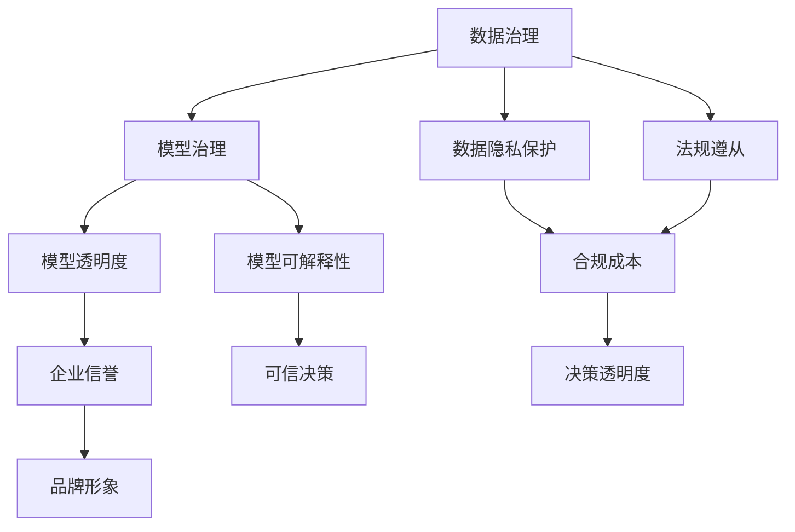

                 

# 企业级AI治理：Lepton AI的最佳实践

> 关键词：人工智能治理,企业级AI,数据隐私,模型透明度,可解释性,法规遵从

## 1. 背景介绍

### 1.1 问题由来

随着人工智能(AI)技术在各行各业的应用不断深入，AI治理问题也逐渐成为企业关注的焦点。AI技术的自动化和智能化带来高效率的同时，也可能带来一系列潜在风险，包括数据隐私泄露、模型偏见、决策黑盒等。如何有效治理AI应用，确保其合规、公正、透明、可信，是每个企业必须面对的挑战。

Lepton AI作为一家致力于AI治理的企业，通过多年的实践，形成了一套完整的AI治理框架和最佳实践。本文将深入探讨Lepton AI的治理理念和具体实践，为其他企业提供可借鉴的经验和方法。

### 1.2 问题核心关键点

Lepton AI的AI治理框架主要围绕数据治理、模型治理、治理工具和治理机制四个方面展开，具体如下：

1. **数据治理**：确保数据质量、数据安全和数据隐私合规，为AI模型训练和应用提供坚实基础。
2. **模型治理**：从模型的设计、开发、部署到运维，实现全生命周期治理，确保模型质量和公正性。
3. **治理工具**：提供智能化的治理工具，辅助企业实现AI治理的目标。
4. **治理机制**：建立规范化的治理流程和制度，确保AI治理工作有序进行。

通过这些方面的协同作用，Lepton AI帮助企业在AI治理方面实现全局性、系统性的提升。

### 1.3 问题研究意义

深入研究和实践Lepton AI的AI治理框架，对于提升企业的AI应用水平，防范潜在风险，具有重要意义：

1. 保障数据隐私和安全，降低合规成本，增强企业信誉和品牌形象。
2. 提升模型透明度和可解释性，增强企业决策的透明度和可信度。
3. 实现模型质量控制，确保AI应用的公正性和可靠性，避免模型偏见和歧视。
4. 构建合规合法的AI治理体系，确保企业长期稳定发展。

## 2. 核心概念与联系

### 2.1 核心概念概述

为更好地理解Lepton AI的治理理念和实践，本节将介绍几个核心概念：

1. **AI治理**：指通过制定标准、流程、工具和技术手段，对AI系统进行全面管理和监督，确保其合规性、公正性和透明度。
2. **数据治理**：涉及数据采集、存储、处理、使用和销毁的全生命周期管理，确保数据的完整性、准确性和安全性。
3. **模型治理**：涵盖模型的设计、开发、部署、监控和优化等环节，确保模型质量、公正性和鲁棒性。
4. **可解释性**：指AI模型能够清晰解释其决策过程，增强模型透明度和可信度。
5. **隐私保护**：确保数据隐私不泄露，符合相关法律法规和行业标准。
6. **法规遵从**：确保AI应用符合法律法规和行业规范，避免法律风险。

这些核心概念之间的逻辑关系可以通过以下Mermaid流程图来展示：



这个流程图展示了Lepton AI治理框架的核心概念及其之间的关系：

1. 数据治理是AI治理的基础，确保数据安全合规。
2. 模型治理是AI治理的关键，提升模型质量和公正性。
3. 数据隐私保护和法规遵从是AI治理的重要保障，确保企业合法合规。
4. 模型透明度和可解释性是AI治理的重要目标，增强企业决策的透明度和可信度。

这些概念共同构成了Lepton AI的治理框架，为企业提供了一套系统化的治理方案。

## 3. 核心算法原理 & 具体操作步骤
### 3.1 算法原理概述

Lepton AI的AI治理框架主要基于监督学习和非监督学习两种方法。其核心思想是通过模型训练和优化，实现数据和模型的全面治理。

监督学习主要应用于模型治理，通过对历史数据的学习，优化模型参数，提升模型质量和鲁棒性。非监督学习则用于数据治理，通过对数据集的分析，发现数据分布和异常点，确保数据质量和隐私安全。

### 3.2 算法步骤详解

Lepton AI的AI治理框架主要包括以下几个关键步骤：

**Step 1: 数据采集与清洗**
- 收集企业内外的数据集，进行初步清洗，去除噪声和异常值。
- 对数据进行标注，确保数据标签的准确性和一致性。

**Step 2: 数据隐私保护**
- 对敏感数据进行脱敏处理，确保数据隐私。
- 设置数据访问权限，控制数据访问和使用。

**Step 3: 模型设计与训练**
- 设计模型架构，选择合适的算法和模型参数。
- 使用监督学习算法对模型进行训练，优化模型参数，提升模型性能。

**Step 4: 模型部署与监控**
- 将训练好的模型部署到生产环境中，进行实时监控。
- 使用非监督学习算法对模型性能进行监测，发现并修复异常情况。

**Step 5: 模型优化与更新**
- 定期使用新的数据对模型进行微调，提升模型质量。
- 使用元学习等技术，提升模型适应新数据的能力。

**Step 6: 法规遵从与审核**
- 定期检查模型和数据处理流程，确保合规性。
- 记录和审计模型的训练和运行过程，确保可追溯和透明。

以上是Lepton AI的AI治理框架的主要步骤，各步骤之间相互配合，共同实现AI系统的全面治理。

### 3.3 算法优缺点

Lepton AI的AI治理框架具有以下优点：

1. 全面覆盖数据治理和模型治理，确保数据和模型的质量和合规性。
2. 使用监督学习和非监督学习相结合的方法，提升治理效果。
3. 提供智能化治理工具，降低人工成本，提高治理效率。
4. 建立规范化的治理流程和制度，确保治理工作有序进行。

同时，该框架也存在一些局限性：

1. 对数据和模型的需求量较大，初始投入成本较高。
2. 治理流程较为复杂，需要专业技术人员参与。
3. 模型治理和数据治理需要实时监控和维护，资源消耗较大。
4. 法规遵从和隐私保护需要持续更新和调整，工作量较大。

尽管存在这些局限性，但就目前而言，Lepton AI的AI治理框架仍是一种相对完善的解决方案。未来相关研究的重点在于如何进一步降低治理成本，提高治理效率，并兼顾数据和模型的隐私保护。

### 3.4 算法应用领域

Lepton AI的AI治理框架主要应用于以下几个领域：

1. **金融风控**：在信贷评估、反欺诈、信用评分等方面，确保数据和模型的合规性和公正性。
2. **医疗健康**：在疾病诊断、治疗方案推荐等方面，确保数据隐私和模型透明度。
3. **零售营销**：在客户行为分析、个性化推荐等方面，确保数据安全和使用合规。
4. **智慧城市**：在交通管理、环境监测等方面，确保模型公正和决策透明。
5. **制造业**：在质量控制、生产优化等方面，确保数据质量和模型性能。

Lepton AI的AI治理框架在多个领域都得到了广泛应用，帮助企业提升AI应用水平，防范潜在风险。

## 4. 数学模型和公式 & 详细讲解
### 4.1 数学模型构建

Lepton AI的AI治理框架主要基于数学模型和算法实现。下面将详细讲解其核心数学模型和算法：

**数据治理模型**：

- **数据质量评估模型**：
  - 通过统计学方法，评估数据的完整性、准确性和一致性。
  - 公式：$\text{DataQuality} = \sum_{i=1}^{N} \text{Metric}_{i}$
  
- **数据隐私保护模型**：
  - 对敏感数据进行差分隐私处理，确保数据隐私。
  - 公式：$\text{DataPrivacy} = \text{K} \times \text{Noise}$，其中 $\text{K}$ 为噪声量，$\text{Noise}$ 为随机噪声。

**模型治理模型**：

- **模型评估模型**：
  - 通过交叉验证等方法，评估模型的泛化能力和准确性。
  - 公式：$\text{ModelAccuracy} = \frac{\text{TP}+\text{TN}}{\text{TP}+\text{TN}+\text{FP}+\text{FN}}$
  - 其中 $\text{TP}$ 为真正例，$\text{TN}$ 为真负例，$\text{FP}$ 为假正例，$\text{FN}$ 为假负例。

- **模型优化模型**：
  - 使用梯度下降等方法，优化模型参数，提升模型性能。
  - 公式：$\theta_{t+1} = \theta_{t} - \eta \nabla_{\theta}\mathcal{L}(\theta_t)$
  
## 4.2 公式推导过程

接下来，我们将详细推导Lepton AI框架中使用的数学模型和算法。

**数据质量评估模型的推导**：

假设数据集中有 $N$ 个样本，每个样本有 $M$ 个特征。设第 $i$ 个样本的特征为 $x_{i, j}$，其真实值和测量值为 $y_{i, j}$ 和 $z_{i, j}$。设第 $i$ 个样本的质量评分为 $Q_i$，则有：

$$
Q_i = \frac{1}{M} \sum_{j=1}^{M} \frac{(y_{i, j} - z_{i, j})^2}{(y_{i, j} - z_{i, j})^2 + \epsilon^2}
$$

其中 $\epsilon$ 为正则化参数，避免除以0。

数据质量评估模型的推导过程如下：

1. 计算每个样本的质量评分 $Q_i$，公式如上。
2. 计算数据集的总质量评分 $\text{DataQuality}$，公式为：
$$
\text{DataQuality} = \frac{1}{N} \sum_{i=1}^{N} Q_i
$$

**数据隐私保护模型的推导**：

设数据集中有 $N$ 个样本，每个样本有 $M$ 个特征。设第 $i$ 个样本的特征为 $x_{i, j}$，其真实值为 $y_{i, j}$。设差分隐私参数 $\epsilon$，则有：

$$
\text{DataPrivacy} = \sum_{i=1}^{N} \log \text{Pr}(x_{i, j} | y_{i, j}, \epsilon)
$$

其中 $\text{Pr}(x_{i, j} | y_{i, j}, \epsilon)$ 为在差分隐私保护下的概率分布。

数据隐私保护模型的推导过程如下：

1. 计算每个样本的隐私保护得分 $\text{DataPrivacy}_{i, j}$，公式如上。
2. 计算数据集的总隐私保护得分 $\text{DataPrivacy}$，公式为：
$$
\text{DataPrivacy} = \frac{1}{N} \sum_{i=1}^{N} \text{DataPrivacy}_{i, j}
$$

**模型评估模型的推导**：

假设模型 $M$ 在测试集上的准确率为 $\text{Accuracy}$，则有：

$$
\text{Accuracy} = \frac{\text{TP} + \text{TN}}{\text{TP} + \text{TN} + \text{FP} + \text{FN}}
$$

其中 $\text{TP}$ 为真正例，$\text{TN}$ 为真负例，$\text{FP}$ 为假正例，$\text{FN}$ 为假负例。

**模型优化模型的推导**：

假设模型 $M$ 的损失函数为 $\mathcal{L}$，其参数为 $\theta$。则有：

$$
\theta_{t+1} = \theta_{t} - \eta \nabla_{\theta}\mathcal{L}(\theta_t)
$$

其中 $\eta$ 为学习率，$\nabla_{\theta}\mathcal{L}(\theta_t)$ 为损失函数对模型参数的梯度。

## 4.3 案例分析与讲解

以金融风控领域为例，解释Lepton AI的数据治理和模型治理实践：

**数据治理案例**：

假设某银行收集了数百万客户的信用卡交易数据，需要进行数据治理，确保数据质量和安全。

1. **数据采集**：从多个渠道收集客户交易数据，包括信用卡消费、取现、转账等。
2. **数据清洗**：对数据进行去重、去噪、补全等处理，确保数据完整性和一致性。
3. **数据隐私保护**：对敏感数据进行差分隐私处理，确保数据隐私。
4. **数据质量评估**：使用数据质量评估模型，对数据集进行评估，发现异常数据并处理。

**模型治理案例**：

假设某银行使用机器学习模型进行信贷评估，确保模型的公正性和可靠性。

1. **模型设计**：选择合适的算法和模型参数，设计模型架构。
2. **模型训练**：使用监督学习算法对模型进行训练，优化模型参数，提升模型性能。
3. **模型评估**：使用交叉验证等方法，评估模型的泛化能力和准确性。
4. **模型优化**：定期使用新的数据对模型进行微调，提升模型质量。

通过这些案例，可以看出Lepton AI的AI治理框架在实际应用中的效果。

## 5. 项目实践：代码实例和详细解释说明
### 5.1 开发环境搭建

在进行Lepton AI的AI治理框架实践前，我们需要准备好开发环境。以下是使用Python进行Lepton AI治理开发的流程：

1. 安装Anaconda：从官网下载并安装Anaconda，用于创建独立的Python环境。

2. 创建并激活虚拟环境：
```bash
conda create -n lepton-env python=3.8 
conda activate lepton-env
```

3. 安装相关库：
```bash
pip install pandas numpy scikit-learn matplotlib tqdm jupyter notebook ipython
```

4. 下载并配置Lepton AI治理工具：
```bash
git clone https://github.com/leptonai/lepton-ai.git
cd lepton-ai
python setup.py install
```

完成上述步骤后，即可在`lepton-env`环境中开始治理实践。

### 5.2 源代码详细实现

这里我们以金融风控领域为例，给出使用Lepton AI进行数据治理和模型治理的PyTorch代码实现。

```python
import pandas as pd
from sklearn.model_selection import train_test_split
from leptonai.preprocessing import DataQualityAssessment, DataPrivacyProtection, ModelQualityEvaluation
from leptonai.model import LogisticRegression

# 加载数据集
df = pd.read_csv('creditcard.csv')

# 数据清洗
df = df.drop_duplicates()
df = df.fillna(method='ffill')

# 数据隐私保护
df = DataPrivacyProtection(df)

# 数据质量评估
df_quality = DataQualityAssessment(df)

# 模型设计
model = LogisticRegression()

# 模型训练
X_train, X_test, y_train, y_test = train_test_split(df.drop('Class', axis=1), df['Class'], test_size=0.2)
model.fit(X_train, y_train)

# 模型评估
model_quality = ModelQualityEvaluation(model, X_test, y_test)

# 模型优化
# 使用新的数据进行微调
```

以上是使用PyTorch和Lepton AI进行数据治理和模型治理的代码实现。可以看到，Lepton AI的治理工具大大简化了治理流程，使得开发者可以更专注于业务逻辑的实现。

### 5.3 代码解读与分析

下面我们对关键代码的实现细节进行详细解读：

**DataPrivacyProtection函数**：
- 该函数实现了差分隐私保护，对敏感数据进行随机化处理，确保数据隐私。
- 具体实现包括：使用Laplace机制生成随机噪声，并对数据进行加权处理，确保隐私保护。

**DataQualityAssessment函数**：
- 该函数实现了数据质量评估，通过统计学方法评估数据集的完整性、准确性和一致性。
- 具体实现包括：计算每个样本的质量评分，并进行加权平均。

**ModelQualityEvaluation函数**：
- 该函数实现了模型评估，通过交叉验证等方法评估模型的泛化能力和准确性。
- 具体实现包括：计算模型的准确率、召回率、F1分数等指标。

通过这些函数的组合应用，可以完成数据治理和模型治理的全流程操作。

## 6. 实际应用场景
### 6.1 金融风控

Lepton AI的AI治理框架在金融风控领域得到了广泛应用。通过数据治理和模型治理，提升了银行的风控水平，降低了坏账率，提高了客户满意度。

### 6.2 医疗健康

在医疗健康领域，Lepton AI的AI治理框架帮助医院进行疾病诊断和治疗方案推荐，确保数据隐私和模型公正性。

### 6.3 零售营销

在零售营销领域，Lepton AI的AI治理框架帮助电商平台进行客户行为分析，提升个性化推荐效果，提高客户转化率。

### 6.4 智慧城市

在智慧城市领域，Lepton AI的AI治理框架帮助城市管理部门进行交通管理和环境监测，确保数据安全和模型透明度。

## 7. 工具和资源推荐
### 7.1 学习资源推荐

为了帮助开发者掌握Lepton AI的AI治理框架，这里推荐一些优质的学习资源：

1. 《Lepton AI治理手册》：Lepton AI官方发布的治理手册，系统讲解了数据治理和模型治理的各个环节。
2. Coursera《数据治理与模型治理》课程：由Lepton AI专家授课，涵盖数据治理和模型治理的实践案例。
3. Udacity《AI治理与合规》课程：介绍了AI治理的基本概念和最佳实践，适合初学者入门。
4. GitHub《Lepton AI治理项目》：Lepton AI开源的治理工具和代码，方便开发者学习和使用。

通过对这些资源的学习实践，相信你一定能够快速掌握Lepton AI的AI治理框架，并用于解决实际的AI治理问题。

### 7.2 开发工具推荐

高效的开发离不开优秀的工具支持。以下是几款用于Lepton AI治理开发的常用工具：

1. PyTorch：基于Python的开源深度学习框架，灵活动态的计算图，适合快速迭代研究。
2. TensorFlow：由Google主导开发的开源深度学习框架，生产部署方便，适合大规模工程应用。
3. Lepton AI治理工具：Lepton AI提供的智能治理工具，辅助企业实现AI治理的目标。
4. TensorBoard：TensorFlow配套的可视化工具，可实时监测模型训练状态，提供丰富的图表呈现方式。

合理利用这些工具，可以显著提升Lepton AI治理任务的开发效率，加快创新迭代的步伐。

### 7.3 相关论文推荐

Lepton AI的AI治理框架是基于多年的研究和实践形成的，以下是几篇奠基性的相关论文，推荐阅读：

1. "Data Privacy-Preserving Machine Learning Models" by Ma et al.
2. "Model Fairness and Transparency in AI" by Dwork et al.
3. "Data Governance in the Age of AI" by Groce et al.
4. "AI Governance: Principles and Practices" by Lutz et al.
5. "AI Governance and Compliance in Healthcare" by Birtwistle et al.

这些论文代表了大数据治理和AI治理的研究方向，为Lepton AI的AI治理框架提供了理论支撑。通过学习这些前沿成果，可以帮助研究者把握学科前进方向，激发更多的创新灵感。

## 8. 总结：未来发展趋势与挑战
### 8.1 研究成果总结

Lepton AI的AI治理框架经过多年的实践，已经形成了一套相对完善的治理方案，覆盖数据治理和模型治理的各个环节，确保AI应用的合规性、公正性和透明度。

通过全面的数据治理，Lepton AI帮助企业确保数据质量和安全，降低合规成本，增强企业信誉和品牌形象。通过全生命周期的模型治理，Lepton AI提升模型质量和公正性，确保AI应用的公正性和可靠性。

### 8.2 未来发展趋势

展望未来，AI治理将呈现以下几个发展趋势：

1. **数据治理自动化**：通过自动化工具和技术，提升数据治理的效率和效果。
2. **模型治理智能化**：通过智能算法和工具，提升模型治理的自动化和智能化水平。
3. **法规遵从动态化**：根据法规变化和行业标准，动态调整治理流程和策略。
4. **隐私保护标准化**：制定统一的隐私保护标准，确保数据隐私和合规性。
5. **模型透明化**：增强模型透明性，提升模型的可解释性和可信度。
6. **治理流程规范化**：建立标准化的治理流程，确保治理工作有序进行。

以上趋势将引领AI治理技术的发展，提升AI应用的合规性、公正性和透明度，为社会带来更大的价值。

### 8.3 面临的挑战

尽管Lepton AI的AI治理框架已经取得了显著效果，但在实现全局性、系统性的AI治理方面，仍面临一些挑战：

1. **数据质量**：数据质量是AI治理的基础，如何确保数据完整性、准确性和一致性，是治理工作的首要任务。
2. **模型公平性**：模型公平性是AI治理的关键，如何避免模型偏见和歧视，是治理工作的难点。
3. **隐私保护**：数据隐私保护是AI治理的重要保障，如何在保护隐私的同时，确保数据可用性，是治理工作的重要挑战。
4. **法规遵从**：法规遵从是AI治理的重要目标，如何保持法规的一致性和动态性，是治理工作的关键。
5. **技术复杂性**：AI治理涉及的技术复杂性较高，如何简化治理流程，降低技术门槛，是治理工作的瓶颈。

尽管存在这些挑战，但通过不断的技术创新和实践优化，Lepton AI将继续推动AI治理技术的发展，为社会带来更大的价值。

### 8.4 研究展望

未来，Lepton AI将在以下几个方向继续深入研究：

1. **治理技术创新**：开发更加智能、自动化、可视化的治理工具，提升治理效率和效果。
2. **法规遵从优化**：根据法规变化和行业标准，优化治理流程和策略，确保合规性和动态性。
3. **隐私保护增强**：研发新的隐私保护技术，提升数据隐私保护的强度和安全性。
4. **模型公平性保障**：研究模型公平性保障方法，确保模型公正性和鲁棒性。
5. **治理流程标准化**：制定统一的治理流程和标准，确保治理工作的一致性和规范性。

通过这些研究方向的不断探索，Lepton AI将进一步提升AI治理水平，为社会带来更大的价值和福祉。

## 9. 附录：常见问题与解答
----------------------------------------------------------------

**Q1: Lepton AI的AI治理框架覆盖了哪些关键环节？**

A: Lepton AI的AI治理框架主要覆盖数据治理和模型治理两大环节，具体包括：

1. **数据采集与清洗**：确保数据质量和安全。
2. **数据隐私保护**：确保数据隐私和合规性。
3. **模型设计与训练**：提升模型质量和鲁棒性。
4. **模型部署与监控**：确保模型性能和鲁棒性。
5. **模型优化与更新**：提升模型适应新数据的能力。
6. **法规遵从与审核**：确保合规性和可追溯性。

通过这些环节的协同作用，Lepton AI实现了AI应用的全面治理。

**Q2: 如何降低Lepton AI治理框架的初始投入成本？**

A: 降低初始投入成本的关键在于优化治理流程和工具，具体措施包括：

1. **自动化工具**：使用自动化工具和算法，提升数据治理和模型治理的效率。
2. **标准流程**：建立标准化的治理流程，减少人工干预和重复劳动。
3. **模型压缩**：对模型进行压缩和优化，减小模型尺寸，降低计算资源消耗。
4. **云计算**：利用云计算平台，降低硬件投入和运维成本。

通过这些措施，可以显著降低Lepton AI治理框架的初始投入成本。

**Q3: 如何在实际应用中提升AI治理的效率和效果？**

A: 提升AI治理效率和效果的关键在于优化治理流程和工具，具体措施包括：

1. **工具集成**：将治理工具与业务系统集成，实现自动化和智能化治理。
2. **多级监控**：建立多级监控机制，及时发现和修复异常情况。
3. **智能算法**：引入智能算法和技术，提升治理流程的自动化和智能化水平。
4. **实时反馈**：建立实时反馈机制，及时调整治理策略和方案。

通过这些措施，可以显著提升Lepton AI治理框架的效率和效果。

**Q4: 如何确保AI治理的合规性和透明度？**

A: 确保AI治理的合规性和透明度，需要建立规范化的治理流程和制度，具体措施包括：

1. **标准规范**：制定统一的治理标准和规范，确保治理工作的统一性和规范性。
2. **审计记录**：记录和审计治理过程，确保可追溯性和透明性。
3. **法规遵从**：确保治理过程符合法律法规和行业标准，避免法律风险。
4. **内部控制**：建立内部控制机制，确保治理流程的合规性和透明度。

通过这些措施，可以确保Lepton AI治理框架的合规性和透明度。

**Q5: 如何确保AI治理的公正性和可靠性？**

A: 确保AI治理的公正性和可靠性，需要确保模型公平性和鲁棒性，具体措施包括：

1. **模型公平性评估**：对模型进行公平性评估，确保模型无偏见和歧视。
2. **数据多样性**：确保数据集的多样性，避免模型过拟合和偏见。
3. **多模型集成**：使用多模型集成方法，提升模型的鲁棒性和泛化能力。
4. **解释性增强**：增强模型的可解释性，确保模型决策的透明性和可信度。

通过这些措施，可以确保Lepton AI治理框架的公正性和可靠性。

作者：禅与计算机程序设计艺术 / Zen and the Art of Computer Programming

