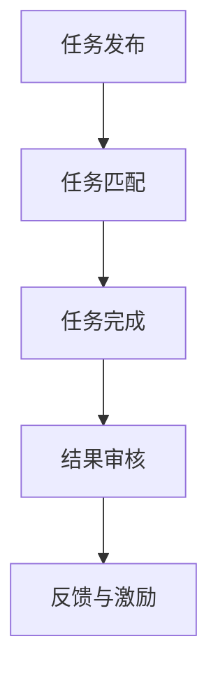

                 

# 众包：释放集体智慧的力量

> 关键词：众包,集体智慧,众包平台,微任务,人类计算,全球外包

## 1. 背景介绍

### 1.1 问题由来
随着互联网的普及和信息技术的发展，人们越来越多地依赖网络平台获取信息和服务。传统单点服务的局限性逐渐凸显，而互联网众包模式为问题解决和创意创新提供了新的思路。通过众包平台，将繁琐的工作任务细化成小型、独立、可量化的微任务，让无数个个体汇聚成庞大的计算力，不仅降低了企业的运营成本，也激发了人们的创造力。

### 1.2 问题核心关键点
众包的核心在于将复杂的任务细化为小型、可独立完成的微任务，然后将这些微任务分配给全球众多志愿者完成。通过众包平台，能够实现：
- 低成本：以较低的成本快速获取高质量的解决方案。
- 高效性：高效利用全球范围内的闲置计算资源和智慧。
- 多样性：汇集多样化的观点和创意，提升创新能力。
- 自动化：通过平台管理和监控，自动化执行任务分配和反馈机制。
- 泛化能力：适用于各种领域和场景，从简单的文本标注到复杂的医学诊断，无所不能。

### 1.3 问题研究意义
研究众包模式，对于拓展人类智慧、提升问题解决效率、优化资源配置、激发创新能力具有重要意义：

1. 降低成本：通过众包模式，可以在短时间内聚集大量人力，减少传统雇佣成本。
2. 提升效率：充分利用全球范围内的闲置资源，快速解决复杂问题，提升问题解决速度。
3. 多样化视角：汇聚各类专业人才的智慧和经验，有助于创新性解决方案的生成。
4. 技术普及：众包平台提供了一种新型的技术普及方式，帮助更多人了解和学习前沿技术。
5. 社会责任：众包模式为社会创造价值，能够帮助解决一些传统社会问题。

## 2. 核心概念与联系

### 2.1 核心概念概述

众包(Crowdsourcing)是一种在线平台模式，利用众人的力量完成特定的任务。通过众包平台，将复杂的问题任务拆分为细小的、可量化的微任务，分配给全球众多志愿者完成。

众包平台包括：
- 任务发布：用户发布具体任务，描述任务要求。
- 任务匹配：平台根据用户发布的任务自动匹配合适的志愿者。
- 任务完成：志愿者完成任务并通过平台提交结果。
- 结果审核：平台对提交的结果进行审核，确保准确性和可靠性。
- 反馈与激励：平台根据完成的质量，给予相应的激励，并对不合格的任务进行反馈。

### 2.2 核心概念原理和架构的 Mermaid 流程图


该图展示了众包平台的基本流程，从任务发布到结果审核，再到反馈激励，形成了完整的任务执行闭环。

## 3. 核心算法原理 & 具体操作步骤
### 3.1 算法原理概述

众包平台的算法核心在于任务匹配和任务调度。基于各种算法和模型，众包平台能够高效地匹配志愿者和任务，并动态地调整任务的分配策略。

核心算法包括：
- 匹配算法：如Top-k匹配算法、最大熵匹配算法等，确保任务与志愿者能力匹配。
- 调度算法：如优先队列调度算法、贪心算法等，优化任务执行顺序，提升平台效率。
- 反馈机制：如随机抽样反馈、专家评审反馈等，确保结果质量。

### 3.2 算法步骤详解

基于众包平台的核心算法，众包任务的执行流程如下：

**Step 1: 任务发布**
- 用户通过平台发布任务，描述任务要求、任务复杂度、奖励机制等。
- 任务发布后，平台自动进行初步审核，确认任务描述清晰、合理。

**Step 2: 任务匹配**
- 平台根据用户发布的任务要求，匹配合适的志愿者。
- 匹配算法可根据任务类型、志愿者技能、在线时间等指标，进行动态调整。
- 任务匹配过程中，平台对志愿者的能力进行评估，确保其具备完成相应任务的能力。

**Step 3: 任务完成**
- 平台将匹配到的志愿者分配任务，并下发任务通知。
- 志愿者根据任务要求，独立完成相应任务，并通过平台提交结果。
- 平台自动审核志愿者提交的结果，确保结果的准确性和完整性。

**Step 4: 结果审核**
- 平台对提交的结果进行审核，包括人工审核和自动审核。
- 对于复杂的任务，可能需要进行专家评审，确保结果的可靠性。
- 审核通过后，任务进入下一阶段，平台将结果反馈给任务发布者。

**Step 5: 反馈与激励**
- 平台根据任务完成的准确性和及时性，给予相应的激励，如现金奖励、积分奖励等。
- 对于不合格的任务，平台进行反馈，指出存在的问题，并建议改进方案。
- 对表现优异的志愿者进行优先匹配，提升其完成任务的意愿和效率。

### 3.3 算法优缺点

众包模式具有以下优点：
1. 成本低：通过众包模式，可以快速获取高质量的解决方案，降低传统雇佣成本。
2. 效率高：平台自动匹配志愿者和任务，提高了问题解决的速度和效率。
3. 多样性：汇聚各类专业人才的智慧和经验，有助于创新性解决方案的生成。
4. 灵活性：平台支持各类任务的执行，适用性广。
5. 可扩展性：可以随时扩展平台的规模，应对更大规模的任务需求。

同时，众包模式也存在一定的局限性：
1. 质量参差不齐：志愿者能力、工作质量参差不齐，可能影响整体效果。
2. 激励机制复杂：激励机制设计不当可能导致激励效果不佳。
3. 数据隐私：平台收集大量用户数据，数据隐私保护问题亟待解决。
4. 平台依赖：过度依赖众包平台，可能影响企业的长期发展。
5. 信任问题：平台与志愿者之间的信任问题仍需加强，防止欺诈和恶意行为。

## 4. 数学模型和公式 & 详细讲解 & 举例说明

### 4.1 数学模型构建

众包平台的数学模型可以描述为任务分配和任务完成的过程。假设有 $N$ 个志愿者和 $M$ 个任务，平台的目标是最大化任务完成的质量和效率。

设每个任务的完成时间为 $T$，每个志愿者的任务处理速度为 $V_i$，任务完成的质量为 $Q$。

平台的任务分配策略可以表示为：

$$
\min_{\mathbf{X}} \sum_{i=1}^N V_i X_i + \sum_{j=1}^M T_j
$$

其中 $\mathbf{X}$ 表示任务分配给志愿者的数量，满足约束条件：

$$
\begin{cases}
0 \leq X_i \leq M \\
\sum_{i=1}^N X_i = M
\end{cases}
$$

任务完成的质量可以表示为：

$$
Q = \frac{1}{M} \sum_{j=1}^M Q_j
$$

其中 $Q_j$ 为第 $j$ 个任务的完成质量。

### 4.2 公式推导过程

基于上述数学模型，我们可以进一步推导出平台的任务匹配算法。假设每个志愿者的能力 $C_i$ 与处理速度 $V_i$ 成正比，且服从均匀分布，即 $C_i \sim U[0,1]$。

平台的任务匹配算法可以表示为：

$$
X_i = \min\left(\frac{T_j}{V_i}, M\right)
$$

其中 $T_j$ 为第 $j$ 个任务的完成时间。

平台的任务调度算法可以表示为：

$$
\min_{\mathbf{X}} \sum_{i=1}^N V_i X_i + \sum_{j=1}^M T_j
$$

平台的任务审核算法可以表示为：

$$
Q = \max\left(0, \frac{1}{M} \sum_{j=1}^M Q_j\right)
$$

其中 $Q_j$ 为第 $j$ 个任务的完成质量。

### 4.3 案例分析与讲解

以Gartic crowdsourcing平台为例，分析其实现过程和算法细节。

**任务发布：** 用户在平台上发布任务，描述任务要求、任务复杂度、奖励机制等。平台自动进行初步审核，确认任务描述清晰、合理。

**任务匹配：** 平台根据用户发布的任务要求，匹配合适的志愿者。匹配算法可根据任务类型、志愿者技能、在线时间等指标，进行动态调整。平台对志愿者的能力进行评估，确保其具备完成相应任务的能力。

**任务完成：** 平台将匹配到的志愿者分配任务，并下发任务通知。志愿者根据任务要求，独立完成相应任务，并通过平台提交结果。平台自动审核志愿者提交的结果，确保结果的准确性和完整性。

**结果审核：** 平台对提交的结果进行审核，包括人工审核和自动审核。对于复杂的任务，可能需要进行专家评审，确保结果的可靠性。

**反馈与激励：** 平台根据任务完成的准确性和及时性，给予相应的激励，如现金奖励、积分奖励等。对于不合格的任务，平台进行反馈，指出存在的问题，并建议改进方案。对表现优异的志愿者进行优先匹配，提升其完成任务的意愿和效率。

## 5. 项目实践：代码实例和详细解释说明

### 5.1 开发环境搭建

在进行众包平台开发前，我们需要准备好开发环境。以下是使用Python进行Flask开发的环境配置流程：

1. 安装Anaconda：从官网下载并安装Anaconda，用于创建独立的Python环境。

2. 创建并激活虚拟环境：
```bash
conda create -n flask-env python=3.8 
conda activate flask-env
```

3. 安装Flask：
```bash
pip install flask
```

4. 安装SQLite：
```bash
pip install sqlalchemy sqlalchemy-sqlite
```

5. 安装Flask-WTF：
```bash
pip install flask-wtf
```

完成上述步骤后，即可在`flask-env`环境中开始开发众包平台。

### 5.2 源代码详细实现

以下是一个简单的众包平台后端代码实现：

```python
from flask import Flask, request, jsonify
from flask_sqlalchemy import SQLAlchemy
from flask_wtf import FlaskForm
from wtforms import StringField, SubmitField, BooleanField
from wtforms.validators import DataRequired, Email, Length

app = Flask(__name__)
app.config['SQLALCHEMY_DATABASE_URI'] = 'sqlite:///example.db'
app.config['SQLALCHEMY_TRACK_MODIFICATIONS'] = False

db = SQLAlchemy(app)

class Task(db.Model):
    id = db.Column(db.Integer, primary_key=True)
    title = db.Column(db.String(100), nullable=False)
    description = db.Column(db.Text, nullable=False)
    reward = db.Column(db.Integer, nullable=False)
    status = db.Column(db.Boolean, default=False)

class User(db.Model):
    id = db.Column(db.Integer, primary_key=True)
    name = db.Column(db.String(100), nullable=False)
    email = db.Column(db.String(120), unique=True)
    username = db.Column(db.String(100), unique=True)

class TaskForm(FlaskForm):
    title = StringField('Title', validators=[DataRequired()])
    description = StringField('Description', validators=[DataRequired()])
    reward = StringField('Reward', validators=[DataRequired()])
    submit = SubmitField('Submit')

@app.route('/tasks', methods=['POST'])
def create_task():
    form = TaskForm()
    if form.validate_on_submit():
        task = Task(title=form.title.data, description=form.description.data, reward=form.reward.data)
        db.session.add(task)
        db.session.commit()
        return jsonify({'success': True})
    return jsonify({'success': False})

@app.route('/tasks', methods=['GET'])
def get_tasks():
    tasks = Task.query.all()
    result = []
    for task in tasks:
        result.append({'title': task.title, 'description': task.description, 'reward': task.reward})
    return jsonify(result)

@app.route('/users', methods=['POST'])
def create_user():
    form = UserForm()
    if form.validate_on_submit():
        user = User(name=form.name.data, email=form.email.data, username=form.username.data)
        db.session.add(user)
        db.session.commit()
        return jsonify({'success': True})
    return jsonify({'success': False})

@app.route('/users', methods=['GET'])
def get_users():
    users = User.query.all()
    result = []
    for user in users:
        result.append({'name': user.name, 'email': user.email, 'username': user.username})
    return jsonify(result)

if __name__ == '__main__':
    app.run(debug=True)
```

这个代码实现了一个基本的众包平台，包括任务发布、任务检索、用户管理等基本功能。

### 5.3 代码解读与分析

让我们再详细解读一下关键代码的实现细节：

**Flask框架：** Flask是一个轻量级的Python Web应用框架，支持开发RESTful风格的API接口。

**SQLAlchemy：** SQLAlchemy是一个Python SQL工具包和对象关系映射器，可以与SQL数据库进行交互。

**WTForms：** WTForms是一个表单处理库，用于处理Web表单数据，支持验证和错误处理。

**Task和User模型：** 定义了众包平台中的任务和用户数据模型，包含相应的字段和验证规则。

**任务发布和检索：** 定义了任务的创建、检索接口，用户可以发布任务并检索所有任务信息。

**用户管理：** 定义了用户的创建、检索接口，用户可以创建和管理自己的信息。

**运行结果展示：** 通过Flask的运行命令启动应用，可以在浏览器中访问众包平台，进行任务发布和检索。

## 6. 实际应用场景

### 6.1 众包在图像标注中的应用

图像标注是计算机视觉领域常用的任务之一，涉及对图像中的物体、场景等进行分类和描述。传统方法通常需要大量标注人员，工作量大且效率低。

通过众包平台，可以将图像标注任务细化成小型微任务，分配给全球众多志愿者完成。志愿者可以通过手机等设备，对图像进行标注，并将标注结果上传至平台。平台自动审核和汇总结果，生成标注数据集。

**实际案例：** 美国斯坦福大学发布的ImageNet数据集，就使用了众包平台进行图像标注。志愿者对数百万张图像进行标注，生成高质量的标注数据集，用于大规模深度学习模型的训练和测试。

### 6.2 众包在医疗诊断中的应用

医疗诊断是医学领域的重要任务，涉及对患者的病历、影像等进行综合分析和判断。传统方法通常需要经过严格的培训和考核，才能从事医疗诊断工作，且诊断结果受医生个人经验和水平影响较大。

通过众包平台，可以将医疗诊断任务细化成小型微任务，分配给各类医疗专家完成。专家通过平台提交诊断结果，并接受其他专家的审核和反馈。平台综合所有专家的诊断结果，生成最终的诊断意见。

**实际案例：** Zebra Medical Vision平台，通过众包平台对医学影像进行诊断，提高了诊断的准确性和效率，并帮助医生更好地理解医学影像中的信息。

### 6.3 众包在文本翻译中的应用

文本翻译是自然语言处理领域的重要任务之一，涉及对文本进行语言之间的转换。传统方法通常需要经过专业的语言学培训，才能从事文本翻译工作，且翻译质量受翻译人员的经验和水平影响较大。

通过众包平台，可以将文本翻译任务细化成小型微任务，分配给全球众多志愿者完成。志愿者通过平台提交翻译结果，并接受其他志愿者的审核和反馈。平台综合所有志愿者的翻译结果，生成最终的翻译文本。

**实际案例：** 谷歌翻译平台，通过众包平台对海量文本进行翻译，显著提高了翻译的效率和质量，并帮助人们跨越语言障碍。

### 6.4 未来应用展望

随着互联网和信息技术的进一步发展，众包平台将广泛应用于各个领域，为社会创造更多价值。

在智慧城市治理中，众包平台可以用于城市事件监测、舆情分析、应急指挥等环节，提高城市管理的自动化和智能化水平，构建更安全、高效的未来城市。

在智能制造中，众包平台可以用于设备维护、工艺优化、产品设计等环节，提高制造业的效率和质量。

在科学研究中，众包平台可以用于数据标注、实验设计、文献审查等环节，加速科学研究和技术创新。

未来，众包平台将结合人工智能技术，实现更高效的任务匹配和调度，提升平台的用户体验和任务完成质量。众包平台将不仅是一种任务分发和执行的工具，更将成为智慧社会的重要基础设施。

## 7. 工具和资源推荐

### 7.1 学习资源推荐

为了帮助开发者系统掌握众包技术，这里推荐一些优质的学习资源：

1. 《Crowdsourcing: A primer for research, practice, and policy》书籍：该书由Daniel Buchin等人编写，介绍了众包技术的理论基础和实际应用，适合各类研究人员和从业人员。

2. 《Crowdsourcing for the Masses》视频课程：由Coursera推出的在线课程，涵盖众包平台的搭建和管理，适合对众包平台感兴趣的开发者。

3. 《Crowdsourcing for Innovation: A guide to understanding and managing the crowd》书籍：该书由Ray F. Lui等人编写，介绍了众包技术在创新中的应用，适合企业高管和创新管理者。

4. Zebra Medical Vision博客：该博客详细介绍了众包平台在医疗领域的应用，适合医疗行业从业者参考。

5. ImageNet博客：该博客详细介绍了众包平台在图像标注领域的应用，适合计算机视觉从业者参考。

通过对这些资源的学习实践，相信你一定能够快速掌握众包技术的精髓，并用于解决实际的业务问题。

### 7.2 开发工具推荐

高效的开发离不开优秀的工具支持。以下是几款用于众包平台开发的常用工具：

1. Flask：基于Python的轻量级Web应用框架，灵活高效，适合开发RESTful风格的API接口。

2. SQLAlchemy：Python SQL工具包和对象关系映射器，可以与SQL数据库进行交互。

3.WTForms：表单处理库，用于处理Web表单数据，支持验证和错误处理。

4. Bootstrap：流行的前端UI框架，可以加速开发页面和界面。

5. React：流行的JavaScript库，可以开发动态Web应用。

6. Docker：容器化技术，可以方便部署和管理应用。

合理利用这些工具，可以显著提升众包平台开发效率，加快创新迭代的步伐。

### 7.3 相关论文推荐

众包技术的发展源于学界的持续研究。以下是几篇奠基性的相关论文，推荐阅读：

1. The Economics of Crowdsourcing: Theory and Empirical Evidence：研究了众包平台的经济模型，探讨了任务匹配、激励机制等问题。

2. Crowdsourcing Tasks in the Crowd：介绍了众包平台的运作机制和常见问题，适合众包平台从业者参考。

3. Crowdsourcing Data Collection and Management：探讨了众包平台在数据收集和管理中的应用，适合数据科学家参考。

4. Crowdsourcing for Data Science：介绍了众包平台在数据科学中的应用，适合数据科学从业者参考。

这些论文代表了大众化平台的发展脉络。通过学习这些前沿成果，可以帮助研究者把握学科前进方向，激发更多的创新灵感。

## 8. 总结：未来发展趋势与挑战

### 8.1 总结

本文对众包模式进行了全面系统的介绍。首先阐述了众包模式的背景和核心思想，明确了其降低成本、提升效率、多样化视角等独特价值。其次，从原理到实践，详细讲解了众包平台的数学模型和算法步骤，给出了众包平台开发的完整代码实例。同时，本文还广泛探讨了众包模式在图像标注、医疗诊断、文本翻译等多个领域的应用前景，展示了众包范式的巨大潜力。此外，本文精选了众包技术的各类学习资源，力求为读者提供全方位的技术指引。

通过本文的系统梳理，可以看到，众包模式正在成为智慧社会的重要基础设施，极大地拓展了人类智慧的应用边界，催生了更多的落地场景。未来，伴随人工智能技术的发展，众包模式将与更多新兴技术进行更深入的融合，共同推动智慧社会的进步。

### 8.2 未来发展趋势

展望未来，众包模式将呈现以下几个发展趋势：

1. 平台智能化：随着人工智能技术的发展，众包平台将实现更智能的任务匹配和调度，提升平台效率和任务完成质量。

2. 任务泛化性：未来众包平台将支持更多类型和规模的任务，涵盖图像标注、医疗诊断、自然语言处理等各类领域。

3. 数据协同化：众包平台将实现更高效的数据协同，将来自不同来源的数据进行整合，生成更有价值的数据集。

4. 全球化拓展：众包平台将覆盖全球更多地区和用户，实现全球范围内的协同合作。

5. 伦理与法规：众包平台将更加注重伦理和法规问题，确保任务执行的公正性和合法性。

6. 多样化激励：众包平台将设计更多样化的激励机制，提高志愿者的参与度和积极性。

这些趋势凸显了众包模式的发展潜力，预示着其未来在社会和经济中的重要地位。

### 8.3 面临的挑战

尽管众包模式已经取得了显著成就，但在迈向更加智能化、普适化应用的过程中，它仍面临诸多挑战：

1. 数据隐私：众包平台收集大量用户数据，数据隐私保护问题亟待解决。

2. 任务质量：志愿者能力、工作质量参差不齐，可能影响整体效果。

3. 激励机制：激励机制设计不当可能导致激励效果不佳。

4. 平台依赖：过度依赖众包平台，可能影响企业的长期发展。

5. 信任问题：平台与志愿者之间的信任问题仍需加强，防止欺诈和恶意行为。

6. 协作效率：跨平台协作可能存在沟通不畅、信息不对称等问题，影响协作效率。

7. 成本问题：平台搭建和运营成本较高，可能需要长期的投入和维护。

这些挑战亟待研究者解决，以推动众包模式向更加成熟和稳定的方向发展。

### 8.4 研究展望

未来，众包技术的研究需要重点关注以下几个方向：

1. 数据隐私保护：研究如何在众包平台上保护用户隐私，确保数据安全和合法使用。

2. 任务质量控制：研究如何提高志愿者的工作质量和任务完成质量，确保结果的准确性和可靠性。

3. 激励机制优化：研究如何设计更多样化和有效的激励机制，提高志愿者的参与度和积极性。

4. 平台智能化：研究如何利用人工智能技术，提升众包平台的智能化水平，实现更高效的任务匹配和调度。

5. 跨平台协作：研究如何优化跨平台协作流程，提高协作效率和任务执行质量。

6. 平台经济模型：研究众包平台的经济模型，提升平台的盈利能力和可持续性。

这些方向的研究将推动众包模式向更加成熟和稳定的方向发展，为智慧社会提供更高效、可靠的解决方案。

## 9. 附录：常见问题与解答

**Q1：众包平台如何处理任务质量问题？**

A: 众包平台通常采用多种方法处理任务质量问题：
1. 数据审核：平台对提交的结果进行审核，确保结果的准确性和完整性。
2. 专家评审：对于复杂和关键的任务，可能需要进行专家评审，确保结果的可靠性。
3. 反馈机制：平台对不合格的任务进行反馈，指出存在的问题，并建议改进方案。
4. 激励机制：平台根据任务完成的准确性和及时性，给予相应的激励，如现金奖励、积分奖励等。
5. 动态调整：根据志愿者的表现，动态调整匹配策略，提升任务质量。

这些方法可以显著提高众包平台的整体任务质量。

**Q2：众包平台如何处理任务匹配问题？**

A: 众包平台通常采用多种方法处理任务匹配问题：
1. 匹配算法：如Top-k匹配算法、最大熵匹配算法等，确保任务与志愿者能力匹配。
2. 动态调整：根据任务类型、志愿者技能、在线时间等指标，进行动态调整。
3. 任务队列：平台将任务分配到任务队列中，志愿者可以根据自己的能力和兴趣选择任务。
4. 任务优先级：任务根据紧急程度和复杂度，设定不同的优先级，优化任务调度。
5. 志愿者评估：平台对志愿者的能力进行评估，确保其具备完成相应任务的能力。

这些方法可以显著提高众包平台的匹配效率和任务执行质量。

**Q3：众包平台如何处理任务执行问题？**

A: 众包平台通常采用多种方法处理任务执行问题：
1. 任务通知：平台将任务通知分配给志愿者，并下发任务要求。
2. 结果提交：志愿者根据任务要求，独立完成相应任务，并通过平台提交结果。
3. 结果审核：平台自动审核志愿者提交的结果，确保结果的准确性和完整性。
4. 专家评审：对于复杂和关键的任务，可能需要进行专家评审，确保结果的可靠性。
5. 反馈机制：平台对不合格的任务进行反馈，指出存在的问题，并建议改进方案。

这些方法可以显著提高众包平台的整体任务执行效率和质量。

**Q4：众包平台如何处理激励机制问题？**

A: 众包平台通常采用多种方法处理激励机制问题：
1. 现金奖励：平台根据任务完成的准确性和及时性，给予相应的现金奖励。
2. 积分奖励：平台根据任务完成的数量和质量，给予相应的积分奖励。
3. 认证体系：平台根据志愿者的表现，颁发认证证书，提升其专业性和可信度。
4. 团队奖励：平台对团队协作的任务，给予团队奖励，鼓励团队合作。
5. 多层次激励：平台设计多层次激励机制，覆盖不同的任务类型和志愿者群体。

这些方法可以显著提高众包平台的激励效果和志愿者积极性。

---

作者：禅与计算机程序设计艺术 / Zen and the Art of Computer Programming

