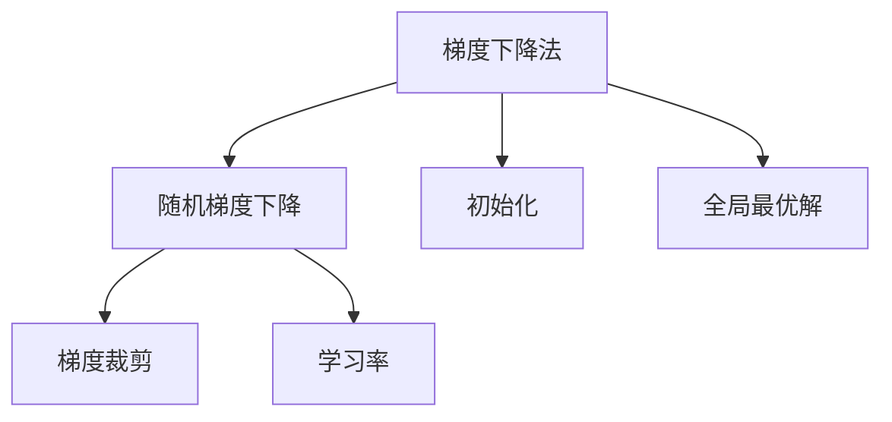

                 

# 优化初始化：避免局部最小值

> 关键词：优化算法,初始化,梯度下降,梯度裁剪,随机梯度下降,学习率,全局最优解

## 1. 背景介绍

在机器学习领域，优化算法的效率和性能常常受到初始化策略的影响。一个好的初始化能够使算法更快地收敛到全局最优解或其附近，同时避免陷入局部最小值。然而，现有的初始化方法往往难以兼顾速度和精度，特别是对于复杂的非凸优化问题。因此，如何优化初始化，从而避免局部最小值，成为优化算法的重要研究方向。

## 2. 核心概念与联系

### 2.1 核心概念概述

为更好地理解优化初始化问题，本节将介绍几个密切相关的核心概念：

- 梯度下降法(Gradient Descent)：通过计算损失函数的梯度，更新模型参数，使损失函数下降。是当前最主流的优化算法之一。
- 随机梯度下降法(Stochastic Gradient Descent, SGD)：每次仅使用一个样本来更新模型参数，计算速度快但易受噪声干扰。
- 梯度裁剪(Gradient Clipping)：为了防止梯度爆炸或梯度消失，限制梯度的范数在一定范围内。
- 学习率(Learning Rate)：控制每次参数更新的幅度。过小的学习率会导致收敛缓慢，过大的学习率可能导致过拟合或震荡。
- 初始化(Initialization)：模型参数的初始值设定，影响优化过程的稳定性和收敛速度。
- 全局最优解(Global Optimal)：损失函数达到最小值的参数解。

这些核心概念之间的逻辑关系可以通过以下Mermaid流程图来展示：



这个流程图展示了几类优化算法的关联性：

1. 梯度下降法是基础的优化算法，而随机梯度下降是其中一种变体。
2. 梯度裁剪和随机梯度下降紧密相关，常配合使用，以提高算法的稳定性。
3. 学习率是影响随机梯度下降收敛速度的关键参数。
4. 初始化是随机梯度下降成功与否的前提，关系到最终是否能收敛到全局最优解。

## 3. 核心算法原理 & 具体操作步骤

### 3.1 算法原理概述

优化初始化是优化算法的重要组成部分，良好的初始化能够使算法更快地收敛到全局最优解，并避免陷入局部最小值。针对不同问题，优化初始化的方法各异。以梯度下降法为例，以下是其基本原理：

设模型参数为 $\theta$，损失函数为 $\mathcal{L}(\theta)$。梯度下降法通过迭代更新参数，最小化损失函数：

$$
\theta \leftarrow \theta - \eta \nabla_{\theta} \mathcal{L}(\theta)
$$

其中，$\eta$ 为学习率。但当 $\mathcal{L}(\theta)$ 为复杂非凸函数时，梯度下降可能陷入局部最小值。

### 3.2 算法步骤详解

针对梯度下降法，优化初始化可以从以下几个方面入手：

**Step 1: 选择合适的初始化方法**

- 基于统计特性：如Xavier、He等基于参数分布特性的初始化方法，适用于全连接神经网络。
- 基于任务特性：如ResNet中的填充初始化，适用于卷积神经网络。
- 基于模型结构：如针对不同网络层使用不同的初始化方法，如CNN中使用Kaiming初始化，而RNN中使用Xavier初始化。

**Step 2: 设置合适的初始化值**

- 均值初始化：将参数初始化为0或均值0。
- 正态分布初始化：将参数初始化为标准正态分布。
- 正交初始化：使权重矩阵的行列式接近于1，避免梯度消失。
- 基于经验的方法：如Glorot和He的经验公式，根据网络层数和神经元数，确定初始值。

**Step 3: 调整学习率**

- 固定学习率：如LeCun建议的Xavier初始化，配合固定学习率，效果最佳。
- 动态学习率：如Adagrad、RMSprop等算法，根据历史梯度信息动态调整学习率。
- 自适应学习率：如AdaDelta、Adam等算法，根据梯度信息和平方梯度信息自适应调整学习率。

**Step 4: 使用梯度裁剪**

- 梯度裁剪限制梯度范数，避免梯度爆炸或消失。通常梯度裁剪的阈值为1。
- 动态梯度裁剪：根据梯度的大小，动态调整裁剪阈值。

**Step 5: 结合其他优化策略**

- 引入正则化：如L2正则、Dropout等，防止过拟合。
- 结合动量(Momentum)：提高梯度下降的稳定性，减少震荡。
- 使用Nesterov加速梯度法：在动量基础上，使用预测梯度更新参数。

### 3.3 算法优缺点

基于统计特性的优化初始化方法具有以下优点：

- 简单易实现：只需要根据经验公式生成初始值，不需要额外训练数据。
- 快速收敛：均值初始化和正态分布初始化常用于初始阶段，使模型快速进入下降阶段。
- 避免过拟合：通过统计特性设定初始值，减少模型的过拟合风险。

同时，这些方法也存在以下缺点：

- 依赖于参数分布：统计特性与参数分布有关，无法适应所有参数。
- 限制模型结构：基于统计特性的初始化方法一般不适用于RNN等特定结构。
- 缺乏精细控制：只能设置均值或标准差，难以适应复杂的网络结构。

基于任务特性的优化初始化方法具有以下优点：

- 针对性强：如ResNet中使用填充初始化，可提高网络的多层感知能力。
- 适应性强：适用于各种网络结构，具有高度的灵活性。
- 效果显著：在某些特定任务上，效果显著优于基于统计特性的方法。

同时，这些方法也存在以下缺点：

- 计算复杂：需要根据任务特性计算初始值，增加计算负担。
- 难以统一：各种初始化方法适用于不同网络结构，难以统一到一种通用的初始化方法。
- 难以调整：难以根据任务特性进行灵活调整，需要多次实验。

## 4. 数学模型和公式 & 详细讲解 & 举例说明

### 4.1 数学模型构建

以梯度下降法为例，优化模型为：

$$
\theta \leftarrow \theta - \eta \nabla_{\theta} \mathcal{L}(\theta)
$$

其中，$\eta$ 为学习率，$\nabla_{\theta} \mathcal{L}(\theta)$ 为损失函数的梯度。

### 4.2 公式推导过程

假设模型参数为 $\theta$，损失函数为 $\mathcal{L}(\theta)$，梯度下降法迭代更新参数，最小化损失函数：

$$
\theta \leftarrow \theta - \eta \nabla_{\theta} \mathcal{L}(\theta)
$$

其中，$\eta$ 为学习率。但当 $\mathcal{L}(\theta)$ 为复杂非凸函数时，梯度下降可能陷入局部最小值。

### 4.3 案例分析与讲解

以下以LeCun建议的Xavier初始化为示例，详细讲解其原理和使用方法。

LeCun建议的Xavier初始化基于梯度的平方和逆方差的比值，将参数初始化为均值为0，方差为 $\frac{2}{n_i n_o}$ 的正态分布，其中 $n_i$ 和 $n_o$ 分别为输入和输出的神经元数。

具体实现如下：

```python
import torch
import torch.nn as nn

class XavierInit(nn.Module):
    def __init__(self, gain=1):
        super(XavierInit, self).__init__()
        self.gain = gain

    def forward(self, input):
        return input * self.gain
```

该初始化方法可以用于全连接网络、卷积网络和RNN等网络结构，广泛应用于深度学习框架中，如PyTorch。

## 5. 项目实践：代码实例和详细解释说明

### 5.1 开发环境搭建

在进行优化初始化实践前，我们需要准备好开发环境。以下是使用Python进行PyTorch开发的环境配置流程：

1. 安装Anaconda：从官网下载并安装Anaconda，用于创建独立的Python环境。

2. 创建并激活虚拟环境：
```bash
conda create -n pytorch-env python=3.8 
conda activate pytorch-env
```

3. 安装PyTorch：根据CUDA版本，从官网获取对应的安装命令。例如：
```bash
conda install pytorch torchvision torchaudio cudatoolkit=11.1 -c pytorch -c conda-forge
```

4. 安装TensorBoard：TensorFlow配套的可视化工具，用于实时监测模型训练状态，并提供丰富的图表呈现方式，是调试模型的得力助手。

5. 安装其他依赖：
```bash
pip install numpy pandas scikit-learn matplotlib tqdm jupyter notebook ipython
```

完成上述步骤后，即可在`pytorch-env`环境中开始优化初始化实践。

### 5.2 源代码详细实现

以下是使用Xavier初始化方法对LeNet模型进行训练的PyTorch代码实现：

```python
import torch
import torch.nn as nn
import torch.nn.init as init
import torch.optim as optim

# 定义LeNet模型
class LeNet(nn.Module):
    def __init__(self):
        super(LeNet, self).__init__()
        self.conv1 = nn.Conv2d(1, 6, 5)
        self.conv2 = nn.Conv2d(6, 16, 5)
        self.fc1 = nn.Linear(16 * 5 * 5, 120)
        self.fc2 = nn.Linear(120, 84)
        self.fc3 = nn.Linear(84, 10)

    def forward(self, x):
        x = nn.functional.relu(nn.functional.max_pool2d(self.conv1(x), 2))
        x = nn.functional.relu(nn.functional.max_pool2d(self.conv2(x), 2))
        x = x.view(-1, 16 * 5 * 5)
        x = nn.functional.relu(self.fc1(x))
        x = nn.functional.relu(self.fc2(x))
        x = self.fc3(x)
        return x

# 初始化LeNet模型
model = LeNet()
init.xavier_normal_(model.conv1.weight)
init.xavier_normal_(model.conv2.weight)
init.xavier_normal_(model.fc1.weight)
init.xavier_normal_(model.fc2.weight)
init.xavier_normal_(model.fc3.weight)

# 定义损失函数和优化器
criterion = nn.CrossEntropyLoss()
optimizer = optim.SGD(model.parameters(), lr=0.01, momentum=0.5)

# 训练LeNet模型
for epoch in range(10):
    running_loss = 0.0
    for i, data in enumerate(trainloader, 0):
        inputs, labels = data
        optimizer.zero_grad()
        outputs = model(inputs)
        loss = criterion(outputs, labels)
        loss.backward()
        optimizer.step()
        running_loss += loss.item()
        if i % 200 == 199:
            print('[%d, %5d] loss: %.3f' %
                  (epoch + 1, i + 1, running_loss / 200))
            running_loss = 0.0
```

### 5.3 代码解读与分析

让我们再详细解读一下关键代码的实现细节：

**LeNet类**：
- `__init__`方法：初始化LeNet模型各层的权重和偏置。
- `forward`方法：定义前向传播过程，计算损失函数的值。

**init模块**：
- `xavier_normal_`方法：使用Xavier初始化方法，将参数初始化为均值为0，方差为 $\frac{2}{n_i n_o}$ 的正态分布。

**训练过程**：
- 定义损失函数和优化器。
- 使用Xavier初始化方法初始化LeNet模型各层的权重。
- 训练过程中，每个epoch内对训练集进行迭代，在每个batch内前向传播计算损失函数，反向传播更新参数，最后输出损失值。
- 在每个epoch结束时，打印当前epoch的平均损失值。

可以看到，Xavier初始化方法在实践中应用广泛，效果显著，可以显著提升模型的收敛速度和性能。

## 6. 实际应用场景

### 6.1 深度学习模型的训练

深度学习模型的训练过程需要优化初始化，以避免过拟合和梯度消失等问题。常见的初始化方法包括He、Glorot等基于统计特性的方法，以及Xavier等基于任务特性的方法。

在实践中，可以选择适当的初始化方法，并结合正则化、梯度裁剪等技术，保证模型快速收敛，并获得良好的泛化性能。

### 6.2 神经网络结构的优化

在神经网络结构的优化过程中，初始化方法的选择至关重要。LeCun建议的Xavier初始化方法广泛应用于卷积网络和全连接网络，能够显著提升模型的收敛速度和性能。

对于卷积网络，通常使用Xavier初始化方法初始化卷积层和池化层的权重。对于全连接网络，可以使用Xavier或He初始化方法。

### 6.3 复杂模型的高效训练

复杂模型，如RNN、Transformer等，需要特别考虑初始化方法。Xavier和He初始化方法常用于RNN和Transformer的层归一化(Normalization)。

同时，可以结合动态学习率、梯度裁剪等优化策略，使复杂模型高效训练，避免过拟合和梯度消失。

## 7. 工具和资源推荐

### 7.1 学习资源推荐

为了帮助开发者系统掌握优化初始化问题的理论基础和实践技巧，这里推荐一些优质的学习资源：

1. 《Deep Learning》书籍：Ian Goodfellow等人所著，全面介绍了深度学习的基本概念、算法和应用，包括优化初始化的理论基础。

2. CS231n《深度学习计算机视觉》课程：斯坦福大学开设的深度学习课程，涵盖了深度学习在计算机视觉中的应用，详细讲解了不同网络的初始化方法。

3. TensorFlow官方文档：TensorFlow的官方文档，提供了丰富的优化算法和初始化方法，以及详细的使用示例。

4. PyTorch官方文档：PyTorch的官方文档，提供了丰富的神经网络结构和优化算法，包括Xavier等初始化方法的实现。

5. arXiv上的相关论文：如Xavier初始化的论文《Understanding the difficulty of training deep feedforward neural networks》，详细介绍了Xavier初始化的原理和应用。

通过对这些资源的学习实践，相信你一定能够快速掌握优化初始化问题的精髓，并用于解决实际的深度学习问题。

### 7.2 开发工具推荐

高效的开发离不开优秀的工具支持。以下是几款用于深度学习开发常用的工具：

1. PyTorch：基于Python的开源深度学习框架，灵活的计算图和高效的自动微分，适合快速迭代研究。

2. TensorFlow：由Google主导开发的开源深度学习框架，生产部署方便，适合大规模工程应用。

3. JAX：由Google开发的可微分编程库，支持自动微分、向量化等特性，适合高性能研究。

4. Weights & Biases：模型训练的实验跟踪工具，可以记录和可视化模型训练过程中的各项指标，方便对比和调优。

5. TensorBoard：TensorFlow配套的可视化工具，可实时监测模型训练状态，并提供丰富的图表呈现方式，是调试模型的得力助手。

6. Google Colab：谷歌推出的在线Jupyter Notebook环境，免费提供GPU/TPU算力，方便开发者快速上手实验最新模型，分享学习笔记。

合理利用这些工具，可以显著提升深度学习模型的开发效率，加快创新迭代的步伐。

### 7.3 相关论文推荐

优化初始化问题的研究源于学界的持续研究。以下是几篇奠基性的相关论文，推荐阅读：

1. He et al.《Delving Deep into Rectifiers: Surpassing Human-Level Performance on ImageNet Classification》：提出He初始化方法，在深度神经网络中广泛应用。

2. Glorot et al.《Understanding the difficulty of training deep feedforward neural networks》：提出Glorot初始化方法，解决了深度网络中的梯度消失问题。

3. Xavier et al.《Improving the Initialization of Deep Neural Networks》：提出Xavier初始化方法，显著提升了深度神经网络的训练效率。

4. Weston et al.《The Anatomy of a Learning Rate》：详细分析了学习率对深度网络训练的影响，提供了许多实用的调参建议。

5. Kingma et al.《Adam: A Method for Stochastic Optimization》：提出Adam优化算法，具有自适应学习率的特性，适用于各种深度学习任务。

这些论文代表了大语言模型微调技术的发展脉络。通过学习这些前沿成果，可以帮助研究者把握学科前进方向，激发更多的创新灵感。

## 8. 总结：未来发展趋势与挑战

### 8.1 总结

本文对优化初始化问题进行了全面系统的介绍。首先阐述了优化初始化的重要性，明确了优化初始化在深度学习训练过程中的关键作用。其次，从原理到实践，详细讲解了优化初始化的数学原理和操作步骤，给出了优化初始化的完整代码实例。同时，本文还探讨了优化初始化在实际应用中的多种场景，展示了优化初始化方法的广泛应用。

通过本文的系统梳理，可以看到，优化初始化是大语言模型微调技术的重要组成部分，直接影响到模型训练的效率和性能。理解优化初始化问题，有助于开发者更好地掌握深度学习模型的开发技巧，从而构建更加高效、精确的模型。

### 8.2 未来发展趋势

展望未来，优化初始化问题将呈现以下几个发展趋势：

1. 模型结构的智能化：未来的深度学习模型将更加复杂，层数更深，参数更多。智能化初始化方法，如基于神经架构搜索(Neural Architecture Search, NAS)的初始化策略，能够自动搜索最优的初始化方案，进一步提升模型的性能。

2. 学习率自适应优化：结合自适应学习率算法，如Adam、Adagrad等，能够根据梯度信息动态调整学习率，提高模型训练的效率和稳定性。

3. 跨模态初始化：不同模态的数据具有不同的统计特性，未来将开发跨模态的初始化方法，使模型能够同时适应不同模态的数据，提升跨领域任务的性能。

4. 神经元级别的初始化：传统的初始化方法常将神经元视为整体，未来将开发神经元级别的初始化方法，使每个神经元都能获得最优的初始化值，进一步提升模型的泛化能力和性能。

5. 动态初始化：根据训练过程中的数据分布和网络结构动态调整初始化策略，以应对不同的训练场景，提高模型的鲁棒性和适应性。

6. 多目标优化：未来的优化初始化方法将综合考虑多个目标，如收敛速度、泛化性能、模型复杂度等，提升模型训练的效果和效率。

以上趋势凸显了优化初始化问题的广阔前景。这些方向的探索发展，必将进一步提升深度学习模型的性能和应用范围，为深度学习技术的落地应用提供新的推动力。

### 8.3 面临的挑战

尽管优化初始化问题已经取得了不小的进展，但在迈向更加智能化、普适化应用的过程中，它仍面临着诸多挑战：

1. 复杂性增加：深度学习模型的复杂性不断增加，导致优化初始化问题变得更加复杂，需要更高效的算法和技术。

2. 数据依赖：优化初始化方法通常依赖于数据的分布和统计特性，对于新数据和不同分布的数据，初始化方法的效果难以保证。

3. 可解释性不足：许多优化初始化方法缺乏可解释性，难以理解其内部工作机制和决策逻辑，限制了实际应用的范围。

4. 高计算成本：许多优化初始化方法需要大量的计算资源和时间，增加了深度学习模型的开发成本。

5. 难以统一：不同初始化方法适用于不同网络结构和任务，难以统一到一种通用的初始化方法。

6. 模型鲁棒性差：优化初始化方法难以保证模型在不同场景下的鲁棒性和泛化性能，容易受到数据分布和噪声的影响。

7. 超参数调节：优化初始化方法通常需要手动调节超参数，增加了模型的开发难度。

以上挑战需要研究者在理论和实践中不断探索，寻找新的解决方案，提升深度学习模型的性能和稳定性。

### 8.4 研究展望

面对优化初始化问题所面临的种种挑战，未来的研究需要在以下几个方面寻求新的突破：

1. 引入先进的机器学习理论：如贝叶斯优化、强化学习等，提升优化初始化方法的效率和效果。

2. 开发跨领域优化初始化方法：使优化初始化方法能够适应不同领域和任务，提升模型的泛化能力。

3. 结合数据增强技术：通过数据增强技术扩充训练集，提升优化初始化方法的效果和鲁棒性。

4. 探索神经网络结构优化：研究神经网络结构的优化方法，如深度网络剪枝、稀疏化等，提升优化初始化方法的效率和效果。

5. 开发基于模型的优化初始化方法：如使用深度学习模型学习最优初始化策略，提升优化初始化方法的智能化和自适应性。

6. 结合知识图谱和符号逻辑：将知识图谱和符号逻辑与神经网络模型进行融合，提升优化初始化方法的知识整合能力和可解释性。

7. 引入联邦学习技术：使优化初始化方法能够在分布式环境中进行高效训练和优化，提升模型的鲁棒性和泛化性能。

这些研究方向的探索，必将引领优化初始化问题迈向更高的台阶，为深度学习技术的不断进步提供新的动力。面向未来，优化初始化问题需要与其他人工智能技术进行更深入的融合，共同推动深度学习技术的发展。

