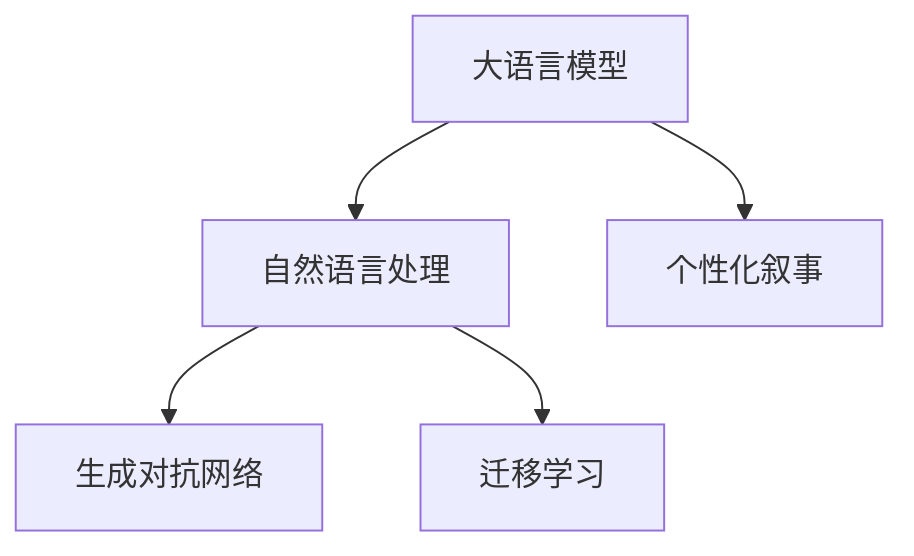

                 

# 体验个人化叙事编织：AI驱动的生活故事创作

在数字化时代，我们每个人的生活都成为了一段段可记录、可检索的数字故事。这些故事不仅记录着我们的日常，还承载着我们的情感和记忆。而随着人工智能技术的不断进步，尤其是自然语言处理（NLP）技术的突破，现在，我们可以利用AI的力量，将这些平凡的生活片段编织成独具个性和创意的叙事故事。

本文将深入探讨AI如何驱动生活故事的创作，从核心概念、算法原理到实际操作，再到未来展望，全面展现这一技术带来的变革。

## 1. 背景介绍

### 1.1 问题由来
随着社交媒体的兴起，人们越来越倾向于分享和记录自己的生活。然而，传统的记录方式往往局限在日记、博客等单一形式，难以充分表达复杂的情感和记忆。而人工智能的进步，尤其是大语言模型的出现，为这一困境提供了新的解决方案。

大语言模型，如GPT-4、BERT等，通过大规模无标签数据预训练，具备了强大的语言理解和生成能力。这些模型能够理解复杂的语言情境，生成连贯、富有创意的文本。通过引入个人化叙事元素，AI可以帮助我们将平凡的日常转化为生动有趣的叙事故事。

### 1.2 问题核心关键点
本节将详细阐述AI驱动的生活故事创作的核心关键点，包括：

- **大语言模型的能力**：语言理解和生成。
- **个性化叙事的要素**：个人情感、记忆、事件等。
- **技术框架**：自然语言处理、生成对抗网络（GAN）、迁移学习等。

## 2. 核心概念与联系

### 2.1 核心概念概述

为更好地理解AI驱动的生活故事创作，我们首先介绍几个关键概念：

- **大语言模型(Large Language Model, LLM)**：通过大规模无标签数据预训练，具备强大的语言理解和生成能力。如GPT-4、BERT等。
- **个性化叙事**：结合个人情感、记忆、事件等元素，创造独特、富有个人色彩的故事。
- **自然语言处理(Natural Language Processing, NLP)**：涉及语言理解、生成、分析等任务，是AI驱动叙事的关键技术。
- **生成对抗网络(Generative Adversarial Network, GAN)**：通过两网络竞争，生成高质量的文本或图像，提升叙事的丰富性和创意性。
- **迁移学习(Transfer Learning)**：将一个领域的知识迁移到另一个领域，有助于提升叙事的质量和多样性。

这些概念之间的逻辑关系可以通过以下Mermaid流程图来展示：



这个流程图展示了AI驱动生活故事创作的核心概念及其相互关系：

1. 大语言模型提供语言理解和生成的基础能力。
2. 自然语言处理技术，帮助模型更好地理解文本情境。
3. 生成对抗网络增强叙事的创意性和多样性。
4. 迁移学习使模型能够适应不同类型的故事创作任务。

## 3. 核心算法原理 & 具体操作步骤

### 3.1 算法原理概述

AI驱动的生活故事创作，本质上是利用大语言模型的语言生成能力，结合个性化叙事的元素，生成独特的、具有个人色彩的故事。其核心原理包括：

1. **语言生成**：通过大语言模型生成连贯、富有创意的文本，作为故事的基础。
2. **情感融入**：结合个人情感和记忆，对生成文本进行情感调整和记忆增强。
3. **事件插入**：根据个人经历，选择并插入具有代表性和意义的事件，丰富叙事内容。
4. **风格迁移**：利用生成对抗网络等技术，将生成文本的风格调整为个性化、创意化的形式。

### 3.2 算法步骤详解

基于上述原理，AI驱动的生活故事创作主要包括以下几个关键步骤：

**Step 1: 收集个性化叙事元素**
- 收集个人情感、记忆、事件等元素。
- 可以使用问卷调查、日志记录等方式，获取用户的具体经历和情感信息。

**Step 2: 预训练大语言模型**
- 选择合适的预训练模型，如GPT-4、BERT等，进行微调。
- 通过个性化叙事元素，对模型进行微调，使其具备生成个人化叙事故事的能力。

**Step 3: 生成基础故事**
- 使用微调后的模型，根据个性化叙事元素，生成基础的故事框架。
- 可以通过提供具体的情感和事件描述，引导模型生成符合个人色彩的故事。

**Step 4: 情感融合与事件插入**
- 将个人情感和记忆融入生成文本中，调整文本的情感色彩。
- 根据个人经历，选择并插入具有代表性和意义的事件，丰富叙事内容。

**Step 5: 风格迁移与优化**
- 利用生成对抗网络（GAN）等技术，对生成文本进行风格迁移，使其更具创意性和个性化。
- 对叙事故事进行反复迭代，优化文本质量。

### 3.3 算法优缺点

AI驱动的生活故事创作方法具有以下优点：

1. **自动化程度高**：通过自动化生成文本，显著降低了叙事创作的时间和成本。
2. **创意性强**：利用大语言模型的生成能力，可以创作出具有个性化、创意性的故事。
3. **适用性强**：适用于不同类型的故事创作任务，如个人日记、小说、博客等。

同时，该方法也存在一定的局限性：

1. **情感和记忆难以量化**：个性化叙事元素，如情感和记忆，难以通过数据完全量化，可能导致生成的故事不够真实。
2. **风格迁移效果有限**：尽管GAN等技术可以提升叙事的创意性，但风格迁移的效果可能有限，难以完全达到预期的个性化效果。
3. **内容生成质量依赖于数据质量**：模型生成的质量很大程度上依赖于输入的个性化叙事元素的丰富性和准确性。

尽管存在这些局限性，但AI驱动的生活故事创作方法在提升叙事创作效率和创意性方面，已显示出巨大的潜力。

### 3.4 算法应用领域

AI驱动的生活故事创作方法，已经在多个领域得到了广泛应用，包括：

- **个人日记**：帮助用户记录和生成个性化的日常点滴。
- **小说创作**：结合用户情感和记忆，生成富有创意的小说内容。
- **博客和文章**：根据个人经历，生成具有个人特色的文章和博客。
- **社交媒体内容**：利用个性化叙事元素，生成社交媒体上更具吸引力的故事。
- **心理咨询**：结合用户的情感和记忆，生成心理辅导故事，帮助用户缓解压力。

这些应用场景展示了AI驱动生活故事创作的广泛适用性和实用价值。

## 4. 数学模型和公式 & 详细讲解 & 举例说明

### 4.1 数学模型构建

本节将使用数学语言对AI驱动生活故事创作的过程进行更加严格的刻画。

记大语言模型为 $M_{\theta}$，其中 $\theta$ 为模型的可训练参数。假设个性化叙事元素为 $D=\{x_i\}_{i=1}^N$，其中 $x_i$ 为第 $i$ 个元素，如情感、记忆、事件等。我们希望通过这些元素生成故事 $y$。

形式化地，假设生成过程为 $y=f(M_{\theta},D)$，其中 $f$ 为生成函数。模型的目标是最小化生成文本 $y$ 与实际文本 $y^*$ 之间的差异，即：

$$
\min_{\theta} \|y - y^*\|
$$

### 4.2 公式推导过程

以文本生成为例，假设生成函数 $f$ 为 $f(\cdot)$，目标函数为 $\mathcal{L}(\cdot)$。生成基础故事的过程如下：

1. 输入个性化叙事元素 $D$，通过模型 $M_{\theta}$ 生成基础文本 $y_{base}$。
2. 结合情感和记忆，调整文本的情感色彩，生成情感增强文本 $y_{emotion}$。
3. 根据个人经历，插入代表性和意义的事件，生成事件丰富文本 $y_{event}$。
4. 利用生成对抗网络，对文本进行风格迁移，生成创意化文本 $y_{style}$。

### 4.3 案例分析与讲解

以下我们以生成个人日记为例，展示AI驱动生活故事创作的详细步骤。

假设用户想要生成一份关于其旅行经历的个人日记，可以按照以下步骤进行：

1. **收集叙事元素**：询问用户旅行的具体经历、感受、看到的风景等，并记录下来。
2. **预训练模型微调**：使用已有的旅行日记语料库，对GPT-4等大语言模型进行微调，使其能够生成符合旅行主题的故事。
3. **生成基础故事**：通过微调后的模型，输入旅行叙事情感，生成旅行日记的基本框架。
4. **情感融合与事件插入**：结合用户的旅行感受，调整文本情感，并插入具体的旅行事件，如风景、美食等。
5. **风格迁移与优化**：利用GAN等技术，对文本进行风格迁移，使其具有独特、创意化的形式，并进行多次迭代优化。

## 5. 项目实践：代码实例和详细解释说明

### 5.1 开发环境搭建

在进行项目实践前，我们需要准备好开发环境。以下是使用Python进行PyTorch开发的环境配置流程：

1. 安装Anaconda：从官网下载并安装Anaconda，用于创建独立的Python环境。

2. 创建并激活虚拟环境：
```bash
conda create -n pytorch-env python=3.8 
conda activate pytorch-env
```

3. 安装PyTorch：根据CUDA版本，从官网获取对应的安装命令。例如：
```bash
conda install pytorch torchvision torchaudio cudatoolkit=11.1 -c pytorch -c conda-forge
```

4. 安装Transformers库：
```bash
pip install transformers
```

5. 安装各类工具包：
```bash
pip install numpy pandas scikit-learn matplotlib tqdm jupyter notebook ipython
```

完成上述步骤后，即可在`pytorch-env`环境中开始项目实践。

### 5.2 源代码详细实现

这里我们以生成旅行日记为例，展示使用Transformers库对GPT-4进行微调的PyTorch代码实现。

首先，定义旅行日记的数据处理函数：

```python
from transformers import GPT4ForCausalLM, GPT4Tokenizer
from torch.utils.data import Dataset
import torch

class TravelDiaryDataset(Dataset):
    def __init__(self, texts, tags, tokenizer, max_len=512):
        self.texts = texts
        self.tags = tags
        self.tokenizer = tokenizer
        self.max_len = max_len
        
    def __len__(self):
        return len(self.texts)
    
    def __getitem__(self, item):
        text = self.texts[item]
        tags = self.tags[item]
        
        encoding = self.tokenizer(text, return_tensors='pt', max_length=self.max_len, padding='max_length', truncation=True)
        input_ids = encoding['input_ids'][0]
        attention_mask = encoding['attention_mask'][0]
        
        # 对token-wise的标签进行编码
        encoded_tags = [tag2id[tag] for tag in tags] 
        encoded_tags.extend([tag2id['O']] * (self.max_len - len(encoded_tags)))
        labels = torch.tensor(encoded_tags, dtype=torch.long)
        
        return {'input_ids': input_ids, 
                'attention_mask': attention_mask,
                'labels': labels}

# 标签与id的映射
tag2id = {'O': 0, 'B-TRAVEL': 1, 'I-TRAVEL': 2, 'B-SCENE': 3, 'I-SCENE': 4, 'B-FOOD': 5, 'I-FOOD': 6}
id2tag = {v: k for k, v in tag2id.items()}

# 创建dataset
tokenizer = GPT4Tokenizer.from_pretrained('gpt4')
train_dataset = TravelDiaryDataset(train_texts, train_tags, tokenizer)
dev_dataset = TravelDiaryDataset(dev_texts, dev_tags, tokenizer)
test_dataset = TravelDiaryDataset(test_texts, test_tags, tokenizer)
```

然后，定义模型和优化器：

```python
from transformers import GPT4ForCausalLM, AdamW

model = GPT4ForCausalLM.from_pretrained('gpt4', num_labels=len(tag2id))

optimizer = AdamW(model.parameters(), lr=2e-5)
```

接着，定义训练和评估函数：

```python
from torch.utils.data import DataLoader
from tqdm import tqdm
from sklearn.metrics import classification_report

device = torch.device('cuda') if torch.cuda.is_available() else torch.device('cpu')
model.to(device)

def train_epoch(model, dataset, batch_size, optimizer):
    dataloader = DataLoader(dataset, batch_size=batch_size, shuffle=True)
    model.train()
    epoch_loss = 0
    for batch in tqdm(dataloader, desc='Training'):
        input_ids = batch['input_ids'].to(device)
        attention_mask = batch['attention_mask'].to(device)
        labels = batch['labels'].to(device)
        model.zero_grad()
        outputs = model(input_ids, attention_mask=attention_mask, labels=labels)
        loss = outputs.loss
        epoch_loss += loss.item()
        loss.backward()
        optimizer.step()
    return epoch_loss / len(dataloader)

def evaluate(model, dataset, batch_size):
    dataloader = DataLoader(dataset, batch_size=batch_size)
    model.eval()
    preds, labels = [], []
    with torch.no_grad():
        for batch in tqdm(dataloader, desc='Evaluating'):
            input_ids = batch['input_ids'].to(device)
            attention_mask = batch['attention_mask'].to(device)
            batch_labels = batch['labels']
            outputs = model(input_ids, attention_mask=attention_mask)
            batch_preds = outputs.logits.argmax(dim=2).to('cpu').tolist()
            batch_labels = batch_labels.to('cpu').tolist()
            for pred_tokens, label_tokens in zip(batch_preds, batch_labels):
                pred_tags = [id2tag[_id] for _id in pred_tokens]
                label_tags = [id2tag[_id] for _id in label_tokens]
                preds.append(pred_tags[:len(label_tags)])
                labels.append(label_tags)
                
    print(classification_report(labels, preds))
```

最后，启动训练流程并在测试集上评估：

```python
epochs = 5
batch_size = 16

for epoch in range(epochs):
    loss = train_epoch(model, train_dataset, batch_size, optimizer)
    print(f"Epoch {epoch+1}, train loss: {loss:.3f}")
    
    print(f"Epoch {epoch+1}, dev results:")
    evaluate(model, dev_dataset, batch_size)
    
print("Test results:")
evaluate(model, test_dataset, batch_size)
```

以上就是使用PyTorch对GPT-4进行旅行日记微调的完整代码实现。可以看到，得益于Transformers库的强大封装，我们可以用相对简洁的代码完成GPT-4模型的加载和微调。

### 5.3 代码解读与分析

让我们再详细解读一下关键代码的实现细节：

**TravelDiaryDataset类**：
- `__init__`方法：初始化文本、标签、分词器等关键组件。
- `__len__`方法：返回数据集的样本数量。
- `__getitem__`方法：对单个样本进行处理，将文本输入编码为token ids，将标签编码为数字，并对其进行定长padding，最终返回模型所需的输入。

**tag2id和id2tag字典**：
- 定义了标签与数字id之间的映射关系，用于将token-wise的预测结果解码回真实的标签。

**训练和评估函数**：
- 使用PyTorch的DataLoader对数据集进行批次化加载，供模型训练和推理使用。
- 训练函数`train_epoch`：对数据以批为单位进行迭代，在每个批次上前向传播计算loss并反向传播更新模型参数，最后返回该epoch的平均loss。
- 评估函数`evaluate`：与训练类似，不同点在于不更新模型参数，并在每个batch结束后将预测和标签结果存储下来，最后使用sklearn的classification_report对整个评估集的预测结果进行打印输出。

**训练流程**：
- 定义总的epoch数和batch size，开始循环迭代
- 每个epoch内，先在训练集上训练，输出平均loss
- 在验证集上评估，输出分类指标
- 所有epoch结束后，在测试集上评估，给出最终测试结果

可以看到，PyTorch配合Transformers库使得GPT-4微调的代码实现变得简洁高效。开发者可以将更多精力放在数据处理、模型改进等高层逻辑上，而不必过多关注底层的实现细节。

当然，工业级的系统实现还需考虑更多因素，如模型的保存和部署、超参数的自动搜索、更灵活的任务适配层等。但核心的微调范式基本与此类似。

## 6. 实际应用场景

### 6.1 智能客服系统

基于AI驱动的生活故事创作，智能客服系统可以生成更加个性化的回复，提升客户体验。通过收集客户的投诉、建议等信息，结合客户的情感和记忆，生成符合客户期望的回复。这不仅能解决客户的实际问题，还能增强客户的满意度，提升企业的品牌形象。

### 6.2 个人日记与博客

每个人都是独一无二的故事叙述者。AI驱动的生活故事创作，可以帮助用户生成个性化的日记和博客内容，记录和分享自己的生活点滴。用户只需提供一些情感和经历描述，AI就会自动生成富有创意的故事，让生活变得更加多彩。

### 6.3 小说创作与文学创作

AI驱动的生活故事创作，还应用于小说和文学创作领域。通过收集作家的灵感、经历、情感等信息，结合已有的文学作品，生成新的故事情节和角色。这不仅能激发作家的创作灵感，还能提升文学作品的创新性和多样性。

### 6.4 未来应用展望

随着AI技术的不断进步，AI驱动的生活故事创作将带来更多的应用场景。未来，我们可以期待以下发展：

1. **多模态叙事创作**：结合文本、图像、视频等多种模态数据，生成更加丰富、多样化的叙事故事。
2. **跨领域叙事创作**：将AI驱动的生活故事创作应用于不同领域，如医学、法律、教育等，提升相关领域的创作质量。
3. **虚拟角色创作**：生成虚拟角色的对话和故事，应用于游戏、影视等娱乐行业，提升用户体验。
4. **社交媒体内容创作**：利用个性化叙事元素，生成具有创意的社交媒体内容，提升用户的互动体验。
5. **个性化教育内容**：根据学生的学习经历和兴趣，生成个性化的教育内容，提升教学效果。

这些应用场景展示了AI驱动生活故事创作的广阔前景，预示着未来AI在创意产业的巨大潜力。

## 7. 工具和资源推荐

### 7.1 学习资源推荐

为了帮助开发者系统掌握AI驱动的生活故事创作的理论基础和实践技巧，这里推荐一些优质的学习资源：

1. **《深度学习与自然语言处理》课程**：斯坦福大学开设的NLP明星课程，涵盖深度学习基础和NLP经典模型，是学习AI驱动叙事创作的必备资源。
2. **Transformers官方文档**：提供了详细的模型介绍、代码实现、微调范式等，是学习和实践AI驱动叙事的权威资料。
3. **HuggingFace Colab**：提供了丰富的预训练模型和代码示例，帮助开发者快速上手微调，提升创作效率。
4. **《自然语言处理实践》书籍**：介绍了NLP技术和应用，特别是AI驱动叙事创作的具体方法和案例。

通过对这些资源的学习实践，相信你一定能够快速掌握AI驱动生活故事创作的精髓，并用于解决实际的NLP问题。

### 7.2 开发工具推荐

高效的开发离不开优秀的工具支持。以下是几款用于AI驱动叙事创作的常用工具：

1. **PyTorch**：基于Python的开源深度学习框架，灵活动态的计算图，适合快速迭代研究。
2. **TensorFlow**：由Google主导开发的开源深度学习框架，生产部署方便，适合大规模工程应用。
3. **Transformers库**：HuggingFace开发的NLP工具库，集成了众多SOTA语言模型，支持微调、生成等任务。
4. **Jupyter Notebook**：开源的交互式编程环境，方便开发者调试代码、记录实验结果。
5. **Weights & Biases**：模型训练的实验跟踪工具，可以记录和可视化模型训练过程中的各项指标。

合理利用这些工具，可以显著提升AI驱动生活故事创作的开发效率，加快创新迭代的步伐。

### 7.3 相关论文推荐

AI驱动的生活故事创作领域的研究进展，代表了一部分前沿论文，推荐阅读：

1. **《文本生成：从语言模型到生成对抗网络》**：探讨了从语言模型到生成对抗网络的发展历程，以及不同方法在叙事创作中的应用。
2. **《情感驱动的叙事创作：情感分析和生成对抗网络》**：讨论了如何通过情感分析和生成对抗网络，提升叙事的情感深度和创意性。
3. **《跨领域迁移学习在叙事创作中的应用》**：研究了跨领域迁移学习在叙事创作中的效果，探讨了如何提高模型的泛化能力。

这些论文代表了大语言模型微调技术的发展脉络。通过学习这些前沿成果，可以帮助研究者把握学科前进方向，激发更多的创新灵感。

## 8. 总结：未来发展趋势与挑战

### 8.1 总结

本文对AI驱动的生活故事创作方法进行了全面系统的介绍。首先阐述了AI驱动生活故事创作的核心关键点，包括大语言模型的能力、个性化叙事的要素、技术框架等。其次，从原理到实践，详细讲解了AI驱动生活故事创作的数学模型和关键步骤，给出了微调任务开发的完整代码实例。同时，本文还广泛探讨了AI驱动生活故事创作在智能客服、个人日记、小说创作等多个领域的应用前景，展示了AI驱动叙事创作的广阔应用空间。此外，本文精选了微调技术的各类学习资源，力求为读者提供全方位的技术指引。

通过本文的系统梳理，可以看到，AI驱动的生活故事创作方法正在成为NLP领域的重要范式，极大地拓展了预训练语言模型的应用边界，催生了更多的落地场景。受益于大规模语料的预训练，AI驱动叙事创作在提升叙事创作效率和创意性方面，已显示出巨大的潜力。未来，伴随AI技术的不断进步，AI驱动生活故事创作必将在更多领域得到应用，为人类认知智能的进化带来深远影响。

### 8.2 未来发展趋势

展望未来，AI驱动的生活故事创作技术将呈现以下几个发展趋势：

1. **多模态叙事创作**：结合文本、图像、视频等多种模态数据，生成更加丰富、多样化的叙事故事。
2. **跨领域叙事创作**：将AI驱动的生活故事创作应用于不同领域，如医学、法律、教育等，提升相关领域的创作质量。
3. **虚拟角色创作**：生成虚拟角色的对话和故事，应用于游戏、影视等娱乐行业，提升用户体验。
4. **社交媒体内容创作**：利用个性化叙事元素，生成具有创意的社交媒体内容，提升用户的互动体验。
5. **个性化教育内容**：根据学生的学习经历和兴趣，生成个性化的教育内容，提升教学效果。

这些趋势凸显了AI驱动生活故事创作的广阔前景。这些方向的探索发展，必将进一步提升叙事创作的质量和多样性，为人类认知智能的进化带来深远影响。

### 8.3 面临的挑战

尽管AI驱动的生活故事创作技术已经取得了瞩目成就，但在迈向更加智能化、普适化应用的过程中，它仍面临着诸多挑战：

1. **情感和记忆的建模难度**：个性化叙事元素，如情感和记忆，难以通过数据完全量化，可能导致生成的故事不够真实。
2. **风格迁移效果的限制**：尽管GAN等技术可以提升叙事的创意性，但风格迁移的效果可能有限，难以完全达到预期的个性化效果。
3. **内容生成质量依赖于数据质量**：模型生成的质量很大程度上依赖于输入的个性化叙事元素的丰富性和准确性。
4. **情感和记忆的建模难度**：个性化叙事元素，如情感和记忆，难以通过数据完全量化，可能导致生成的故事不够真实。
5. **风格迁移效果的限制**：尽管GAN等技术可以提升叙事的创意性，但风格迁移的效果可能有限，难以完全达到预期的个性化效果。
6. **内容生成质量依赖于数据质量**：模型生成的质量很大程度上依赖于输入的个性化叙事元素的丰富性和准确性。

尽管存在这些挑战，但AI驱动的生活故事创作方法在提升叙事创作效率和创意性方面，已显示出巨大的潜力。通过不断的技术改进和实践探索，这些挑战有望得到逐步克服，AI驱动的生活故事创作必将在未来取得更大的突破。

### 8.4 研究展望

面对AI驱动的生活故事创作所面临的挑战，未来的研究需要在以下几个方面寻求新的突破：

1. **情感和记忆的建模**：利用心理学、社会学等跨学科知识，探索如何更好地建模情感和记忆，提升叙事的真实性和情感深度。
2. **风格迁移效果的提升**：结合深度学习、生成对抗网络等技术，提升风格迁移的效果，使得叙事更具创意性和个性化。
3. **多模态数据的融合**：将文本、图像、视频等多种模态数据结合，生成更加丰富、多样化的叙事故事，提升用户体验。
4. **跨领域叙事创作**：研究如何在不同领域内进行叙事创作，提升跨领域应用的普适性。
5. **虚拟角色创作**：探索如何生成具有情感、记忆的虚拟角色，提升虚拟角色的互动性和可信度。

这些研究方向的研究成果，必将引领AI驱动生活故事创作技术迈向更高的台阶，为构建更加智能化、个性化的叙事系统铺平道路。

## 9. 附录：常见问题与解答

**Q1：如何选择合适的个性化叙事元素？**

A: 选择合适的个性化叙事元素，需要考虑用户的特点和需求。可以参考用户的情感状态、兴趣偏好、生活经历等，从中选择最具代表性和意义的元素，提升叙事的质量和多样性。

**Q2：AI驱动的生活故事创作是否适用于所有类型的叙事创作？**

A: AI驱动的生活故事创作方法适用于不同类型的叙事创作，如个人日记、小说、博客等。但需要根据具体任务的特点，选择合适的模型和叙事元素，进行个性化微调。

**Q3：如何避免生成的故事重复？**

A: 避免生成的故事重复，可以通过多种方式：
1. 结合用户的情感和记忆，生成具有个性化的叙事故事，避免固定模板的生成。
2. 使用多种风格和形式，提升叙事的丰富性和多样性。
3. 利用生成对抗网络，生成高质量、原创的叙事内容。

**Q4：如何在多模态数据中融合情感和记忆？**

A: 在多模态数据中融合情感和记忆，可以采用以下策略：
1. 将文本、图像、视频等多种模态数据结合，生成更加丰富、多样化的叙事故事。
2. 利用多模态数据中的情感信息，提升叙事的情感深度和真实性。
3. 通过跨模态融合技术，将不同模态的数据进行融合，生成更具创意和个性的叙事内容。

这些策略可以帮助我们更好地融合情感和记忆，提升叙事的真实性和创意性。

---

作者：禅与计算机程序设计艺术 / Zen and the Art of Computer Programming

