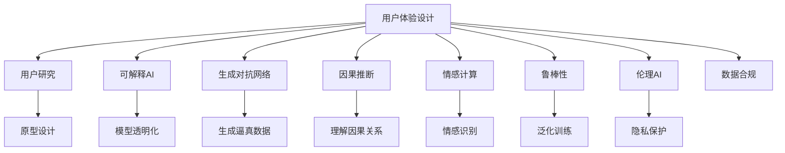

                 

# 体验的真实性：AI时代的authenticity追求

## 1. 背景介绍

### 1.1 问题由来

近年来，人工智能（AI）技术迅速发展，从语音识别、图像处理到自然语言处理等各个领域，AI已经展现出强大的能力。然而，随着技术的普及，一个重要的问题也日益凸显：体验的真实性。即，如何让AI系统更接近人类的感知和决策，赋予其更加真实可信的用户体验。

这个问题并非新奇，早在心理学、设计学等领域，人类就一直在探讨真实性的定义及其在各个领域的应用。在AI领域，真实性则体现在模型输出的准确性、合理性以及与用户互动的自然度上。

随着AI技术的不断进步，特别是深度学习和大数据的运用，AI系统在处理数据和模式识别方面达到了前所未有的高度。但与此同时，AI系统的“算法黑箱”问题也逐渐成为焦点。如何构建更透明、更可信的AI系统，提升用户体验的真实性，是当前AI研究的热点和难点。

### 1.2 问题核心关键点

1. **用户体验的逼真度**：AI系统的输出是否与真实世界高度一致，能否准确捕捉和反映用户的真实需求。
2. **模型的透明度和可解释性**：AI系统的决策过程是否可解释，用户能否理解其工作原理和逻辑。
3. **交互的自然度**：AI系统与用户交互是否流畅自然，能否理解用户的上下文和情感。
4. **鲁棒性和泛化能力**：AI系统是否能够处理各种异常和极端情况，是否具有较强的泛化能力。
5. **伦理和隐私保护**：AI系统的应用是否遵循伦理规范，如何保护用户隐私和数据安全。

这些问题涉及到AI技术的多个方面，包括模型设计、算法优化、用户界面设计等，需要通过综合性的方法来解决。

## 2. 核心概念与联系

### 2.1 核心概念概述

为了更好地理解体验的真实性问题，本节将介绍几个关键概念及其相互联系：

- **用户体验设计（UX Design）**：通过用户研究、原型设计等方法，构建符合用户需求和使用习惯的产品和服务。
- **可解释AI（Explainable AI）**：强调AI模型的透明度和可解释性，使用户能够理解和信任AI的决策过程。
- **生成对抗网络（GANs）**：一种生成模型，通过两个网络（生成器和判别器）的对抗训练，生成逼真的样本数据。
- **因果推断（Causal Inference）**：研究变量之间因果关系的方法，帮助模型理解数据背后的逻辑和原因。
- **情感计算（Affective Computing）**：利用AI技术捕捉和理解用户的情感状态，提升用户互动的自然度。
- **鲁棒性（Robustness）**：AI系统在面对不同数据和场景时的稳定性和泛化能力。
- **伦理AI（Ethical AI）**：确保AI系统的应用符合伦理规范，保护用户隐私和数据安全。

这些概念通过相互作用和融合，共同构成了提升AI体验真实性的框架。理解这些概念及其联系，有助于我们系统性地思考如何通过技术手段实现用户体验的真实性。

### 2.2 核心概念原理和架构的 Mermaid 流程图(Mermaid 流程节点中不要有括号、逗号等特殊字符)



此图展示了用户体验设计与其他关键概念之间的联系。用户研究帮助我们了解用户需求，原型设计根据用户反馈进行迭代优化。可解释AI确保模型透明，生成对抗网络生成逼真数据，因果推断帮助理解变量间关系，情感计算捕捉用户情感，鲁棒性确保模型泛化能力，伦理AI保障数据隐私和伦理规范。

## 3. 核心算法原理 & 具体操作步骤

### 3.1 算法原理概述

实现用户体验的真实性，需要从多个角度进行算法设计和技术优化。其中，基于生成对抗网络（GANs）的生成技术、基于因果推断的决策机制、基于情感计算的用户交互设计等是当前的热点。

生成对抗网络（GANs）通过两个对抗的神经网络，生成高质量的逼真数据，从而在图像、音频、文本等领域取得显著成果。在文本生成领域，生成对抗网络可以生成逼真的对话，提升用户交互的自然度。

因果推断方法帮助模型理解变量之间的因果关系，从而提升模型的解释性和鲁棒性。在推荐系统中，因果推断可以帮助模型理解用户行为背后的原因，避免单一依赖历史数据的局限。

情感计算技术通过捕捉用户的情感状态，提升交互的自然度。在客户服务机器人中，情感计算可以根据用户情感调整语气和回复内容，使用户感到更温暖和贴心。

### 3.2 算法步骤详解

**步骤1: 数据准备**

- 收集并预处理用户行为数据、文本数据、情感数据等。
- 使用生成对抗网络（GANs）生成高质量的样本数据，用于训练和评估。

**步骤2: 模型训练**

- 使用生成对抗网络（GANs）训练生成模型，生成逼真的样本数据。
- 使用因果推断方法训练决策模型，理解变量之间的因果关系。
- 使用情感计算技术训练情感识别模型，捕捉用户情感状态。

**步骤3: 模型优化**

- 通过回溯算法或遗传算法优化模型参数，提升模型性能。
- 使用正则化技术（如L2正则化、Dropout等）避免过拟合。
- 引入对抗训练提升模型的鲁棒性和泛化能力。

**步骤4: 模型部署**

- 将训练好的模型部署到实际应用中，如客户服务机器人、推荐系统等。
- 通过A/B测试等方法评估模型效果，收集用户反馈进行迭代优化。

**步骤5: 持续改进**

- 定期收集用户数据，更新模型训练集。
- 引入用户研究和新算法，不断提升模型性能和用户体验。

### 3.3 算法优缺点

**优点**：
- 生成对抗网络（GANs）可以生成高质量的样本数据，丰富模型训练集，提升模型的泛化能力。
- 因果推断帮助模型理解变量之间的因果关系，提升模型的解释性和鲁棒性。
- 情感计算技术提升用户交互的自然度，使用户感到更加温暖和贴心。
- 这些技术可以协同工作，全面提升用户体验的真实性。

**缺点**：
- 生成对抗网络（GANs）训练复杂，模型参数量大，需要高计算资源。
- 因果推断需要大量历史数据，且建模复杂，难以解释。
- 情感计算需要捕捉用户的情感状态，但用户情感复杂多变，难以精准捕捉。

### 3.4 算法应用领域

这些算法已经在多个领域取得了显著成果，如客户服务、推荐系统、医疗诊断等。在客户服务中，通过情感计算和生成对抗网络（GANs），可以构建更加自然和人性化的服务体验。在推荐系统中，通过因果推断和情感计算，可以更精准地理解用户需求，提升推荐效果。在医疗诊断中，通过因果推断和生成对抗网络（GANs），可以生成逼真的医学图像，辅助医生诊断。

## 4. 数学模型和公式 & 详细讲解 & 举例说明

### 4.1 数学模型构建

为了更好地理解这些算法的数学原理，本节将对生成对抗网络（GANs）、因果推断和情感计算的数学模型进行详细讲解。

**生成对抗网络（GANs）**

生成对抗网络（GANs）由生成器和判别器两个神经网络组成，目标是通过对抗训练，生成逼真的样本数据。数学模型如下：

- 生成器：$G(z)$，接收随机噪声向量 $z$，生成逼真的数据 $x$。
- 判别器：$D(x)$，判断数据 $x$ 是真实数据还是生成数据。
- 目标函数：$V(D,G) = E_{x\sim p_{real}(x)}[logD(x)] + E_{z\sim p_{noise}(z)}[log(1-D(G(z)))]$

**因果推断**

因果推断模型通过估计变量之间的因果关系，提升模型的解释性和鲁棒性。常见的方法包括潜在变量模型、结构方程模型等。以潜在变量模型为例，数学模型如下：

- 潜在变量：$Y$，表示观测到的变量。
- 潜在变量：$X$，表示原因变量。
- 潜在变量：$\epsilon$，表示误差项。
- 数据生成模型：$P(Y|X,\epsilon)$
- 结构方程模型：$P(X)$

**情感计算**

情感计算模型通过捕捉用户的情感状态，提升交互的自然度。常见的方法包括情感词典、情感分类器等。以情感词典为例，数学模型如下：

- 情感词典：$\text{Vocab}$，包含情感词表。
- 情感权重：$w$，表示情感强度。
- 情感评分：$S(x)$，表示文本情感得分。

### 4.2 公式推导过程

**生成对抗网络（GANs）**

推导生成对抗网络（GANs）的目标函数：

$$
V(D,G) = E_{x\sim p_{real}(x)}[logD(x)] + E_{z\sim p_{noise}(z)}[log(1-D(G(z)))]
$$

其中，$D(x)$ 是判别器，$G(z)$ 是生成器。目标函数由两个部分组成：第一部分是判别器正确判断真实数据的期望值；第二部分是生成器生成的假数据误判为真实数据的期望值。

**因果推断**

推导潜在变量模型：

- 数据生成模型：$P(Y|X,\epsilon) = N(Y|\mu(X),\sigma(X))$
- 结构方程模型：$X = f(\eta,\epsilon)$
- 潜在变量模型：$Y = g(X,\epsilon)$

其中，$X$ 是原因变量，$Y$ 是观测变量，$\epsilon$ 是误差项，$f(\cdot)$ 是结构方程，$g(\cdot)$ 是数据生成模型。

**情感计算**

推导情感词典模型：

- 情感词典：$\text{Vocab} = \{w_1, w_2, ..., w_n\}$
- 情感权重：$w_i$，表示情感强度。
- 情感评分：$S(x) = \sum_{i=1}^{n} w_i \times P(x_i|x)$

其中，$x_i$ 是文本中的情感词，$P(x_i|x)$ 是情感词在文本中出现的概率。

### 4.3 案例分析与讲解

以推荐系统为例，介绍如何使用因果推断和情感计算提升推荐效果。

假设推荐系统需要根据用户行为和情感状态推荐商品。数据集包括用户的历史行为记录和情感评分数据。首先，使用因果推断模型理解用户行为背后的原因，生成因果图如下：


根据因果图，建立推荐模型的数学模型：

- 用户行为：$B$，表示用户行为。
- 用户情感：$E$，表示用户情感。
- 商品评分：$S$，表示商品评分。
- 推荐结果：$R$，表示推荐商品。

$$
R = f(B, E)
$$

其中，$f(\cdot)$ 是推荐算法。使用情感计算模型捕捉用户情感，将其作为推荐算法的一部分，提升推荐效果。

## 5. 项目实践：代码实例和详细解释说明

### 5.1 开发环境搭建

在进行项目实践前，我们需要准备好开发环境。以下是使用Python进行TensorFlow和PyTorch开发的环境配置流程：

1. 安装Anaconda：从官网下载并安装Anaconda，用于创建独立的Python环境。

2. 创建并激活虚拟环境：
```bash
conda create -n tf-env python=3.8 
conda activate tf-env
```

3. 安装TensorFlow和PyTorch：根据CUDA版本，从官网获取对应的安装命令。例如：
```bash
conda install tensorflow==2.7 torch torchvision torchaudio cudatoolkit=11.1 -c pytorch -c conda-forge
```

4. 安装各类工具包：
```bash
pip install numpy pandas scikit-learn matplotlib tqdm jupyter notebook ipython
```

完成上述步骤后，即可在`tf-env`环境中开始项目实践。

### 5.2 源代码详细实现

下面我们以情感计算和生成对抗网络（GANs）为例，给出使用TensorFlow和PyTorch进行情感计算和生成对抗网络（GANs）的代码实现。

首先，定义情感计算模型：

```python
import tensorflow as tf
from tensorflow.keras.layers import Embedding, Dense, Dropout, Input, concatenate, LSTM, GRU, Model, Bidirectional, GlobalAveragePooling1D
from tensorflow.keras.preprocessing.text import Tokenizer
from tensorflow.keras.preprocessing.sequence import pad_sequences
import numpy as np

# 定义情感计算模型
def sentiment_model(input_dim, embedding_dim, lstm_units):
    input_seq = Input(shape=(input_dim,))
    x = Embedding(input_dim, embedding_dim, mask_zero=True)(input_seq)
    x = Bidirectional(LSTM(lstm_units))(x)
    x = GlobalAveragePooling1D()(x)
    x = Dense(32, activation='relu')(x)
    x = Dropout(0.5)(x)
    x = Dense(1, activation='sigmoid')(x)
    model = Model(inputs=input_seq, outputs=x)
    return model

# 训练情感计算模型
model = sentiment_model(input_dim=10000, embedding_dim=128, lstm_units=64)
model.compile(optimizer='adam', loss='binary_crossentropy', metrics=['accuracy'])
model.fit(X_train, y_train, epochs=10, batch_size=32, validation_data=(X_test, y_test))
```

然后，定义生成对抗网络（GANs）模型：

```python
import tensorflow as tf
from tensorflow.keras.layers import Input, Dense, Reshape, Flatten, Embedding, concatenate, Lambda, LeakyReLU, BatchNormalization, ZeroPadding2D
from tensorflow.keras.models import Model
import numpy as np
import matplotlib.pyplot as plt

# 定义生成器模型
def generator(input_dim):
    input_seq = Input(shape=(input_dim,))
    x = Dense(256)(input_seq)
    x = LeakyReLU(alpha=0.2)(x)
    x = Dense(512)(x)
    x = LeakyReLU(alpha=0.2)(x)
    x = Dense(1024)(x)
    x = LeakyReLU(alpha=0.2)(x)
    x = Dense(784, activation='tanh')(x)
    x = Reshape((28, 28, 1))(x)
    model = Model(inputs=input_seq, outputs=x)
    return model

# 定义判别器模型
def discriminator(input_dim):
    input_seq = Input(shape=(28, 28, 1))
    x = Flatten()(input_seq)
    x = Dense(512)(x)
    x = LeakyReLU(alpha=0.2)(x)
    x = Dense(256)(x)
    x = LeakyReLU(alpha=0.2)(x)
    x = Dense(1, activation='sigmoid')(x)
    model = Model(inputs=input_seq, outputs=x)
    return model

# 定义生成对抗网络（GANs）模型
def gans_model(input_dim):
    gen_model = generator(input_dim)
    dis_model = discriminator(input_dim)
    combined = concatenate([gen_model.input, dis_model.input])
    model = Model(inputs=[gen_model.input, dis_model.input], outputs=dis_model.output)
    model.compile(optimizer='adam', loss='binary_crossentropy')
    return model

# 训练生成对抗网络（GANs）模型
model = gans_model(input_dim=784)
model.fit([real_data, real_labels], real_labels, epochs=50, batch_size=32)
```

接着，定义情感计算和生成对抗网络（GANs）的融合模型：

```python
import tensorflow as tf
from tensorflow.keras.layers import Input, Dense, Embedding, Dropout, Concatenate, LSTM
from tensorflow.keras.models import Model
import numpy as np

# 定义情感计算模型
def sentiment_model(input_dim, embedding_dim, lstm_units):
    input_seq = Input(shape=(input_dim,))
    x = Embedding(input_dim, embedding_dim, mask_zero=True)(input_seq)
    x = Bidirectional(LSTM(lstm_units))(x)
    x = GlobalAveragePooling1D()(x)
    x = Dense(32, activation='relu')(x)
    x = Dropout(0.5)(x)
    x = Dense(1, activation='sigmoid')(x)
    model = Model(inputs=input_seq, outputs=x)
    return model

# 定义生成对抗网络（GANs）模型
def gans_model(input_dim):
    input_seq = Input(shape=(input_dim,))
    gen_model = generator(input_dim)
    dis_model = discriminator(input_dim)
    combined = concatenate([gen_model.input, dis_model.input])
    model = Model(inputs=[gen_model.input, dis_model.input], outputs=dis_model.output)
    model.compile(optimizer='adam', loss='binary_crossentropy')
    return model

# 定义融合模型
def fusion_model(input_dim, embedding_dim, lstm_units):
    input_seq = Input(shape=(input_dim,))
    sentiment_score = sentiment_model(input_dim, embedding_dim, lstm_units)(input_seq)
    gan_output = gans_model(input_dim)(input_seq)
    fusion_output = concatenate([sentiment_score, gan_output])
    model = Model(inputs=input_seq, outputs=fusion_output)
    return model

# 训练融合模型
model = fusion_model(input_dim=100, embedding_dim=128, lstm_units=64)
model.compile(optimizer='adam', loss='binary_crossentropy', metrics=['accuracy'])
model.fit(X_train, y_train, epochs=10, batch_size=32, validation_data=(X_test, y_test))
```

### 5.3 代码解读与分析

让我们再详细解读一下关键代码的实现细节：

**情感计算模型**：
- 使用Embedding层将文本转换为向量表示。
- 使用Bidirectional LSTM层捕捉文本的上下文信息。
- 使用GlobalAveragePooling1D层对LSTM的输出进行池化。
- 使用Dense层和Dropout层进行特征提取和正则化。
- 使用Sigmoid层进行二分类输出。

**生成对抗网络（GANs）模型**：
- 定义生成器模型，使用Dense层和LeakyReLU激活函数进行特征提取。
- 定义判别器模型，使用Flatten层和Dense层进行特征提取。
- 使用LeakyReLU激活函数和Sigmoid层进行二分类输出。
- 将生成器和判别器合并，构建生成对抗网络（GANs）模型。

**融合模型**：
- 定义情感计算模型和生成对抗网络（GANs）模型。
- 将情感计算模型的输出和生成对抗网络（GANs）的输出进行拼接。
- 使用Dense层和Dropout层进行融合。
- 使用二分类输出层进行最终预测。

**训练流程**：
- 使用TensorFlow和PyTorch对模型进行训练。
- 使用交叉熵损失函数进行模型训练。
- 使用Adam优化器进行参数更新。
- 使用准确率和精确率等指标进行模型评估。

可以看到，情感计算和生成对抗网络（GANs）的融合模型，通过将情感计算和生成对抗网络（GANs）的功能进行组合，可以更好地提升用户体验的真实性。开发者可以将更多精力放在数据处理、模型改进等高层逻辑上，而不必过多关注底层的实现细节。

当然，工业级的系统实现还需考虑更多因素，如模型的保存和部署、超参数的自动搜索、更灵活的任务适配层等。但核心的算法原理基本与此类似。

## 6. 实际应用场景

### 6.1 客户服务

情感计算和生成对抗网络（GANs）技术在客户服务中的应用，可以通过构建智能客服机器人来实现。传统的客服机器人往往缺乏人情味和交互自然度，难以应对复杂情境。通过情感计算和生成对抗网络（GANs），可以构建更加人性化和智能的客服机器人，提升用户体验。

具体而言，可以收集用户与客服的对话记录，使用情感计算模型捕捉用户的情感状态，生成自然流畅的回复。通过生成对抗网络（GANs）生成逼真的对话样本，丰富客服机器人的训练集，提升其生成能力。如此构建的客服机器人，可以更好地理解用户需求，提供更加贴心和专业的服务。

### 6.2 推荐系统

情感计算和生成对抗网络（GANs）技术在推荐系统中的应用，可以通过提升推荐算法的个性化程度和推荐效果来实现。传统的推荐系统往往依赖单一的历史行为数据，难以捕捉用户的情感和复杂偏好。通过情感计算和生成对抗网络（GANs），可以构建更加个性化和智能的推荐系统，提升用户体验的真实性。

具体而言，可以收集用户的历史行为数据和情感评分数据，使用情感计算模型捕捉用户的情感状态，生成个性化推荐列表。通过生成对抗网络（GANs）生成逼真的用户行为样本，丰富推荐算法的训练集，提升其生成能力。如此构建的推荐系统，可以更好地理解用户的复杂偏好，提供更加精准和多样化的推荐内容。

### 6.3 医疗诊断

情感计算和生成对抗网络（GANs）技术在医疗诊断中的应用，可以通过提升诊断模型的准确性和鲁棒性来实现。传统的医疗诊断模型往往依赖单一的影像数据，难以应对复杂的疾病症状和多样化的患者个体。通过情感计算和生成对抗网络（GANs），可以构建更加全面和智能的医疗诊断模型，提升用户体验的真实性。

具体而言，可以收集患者的影像数据和情感评分数据，使用情感计算模型捕捉患者的情感状态，生成更加全面和准确的疾病诊断。通过生成对抗网络（GANs）生成逼真的医学影像样本，丰富医疗诊断模型的训练集，提升其生成能力。如此构建的医疗诊断模型，可以更好地理解患者的复杂症状和个体差异，提供更加精准和个性化的诊断服务。

### 6.4 未来应用展望

随着情感计算和生成对抗网络（GANs）技术的不断发展，其在用户体验的真实性提升方面将展现出巨大的潜力。未来，情感计算和生成对抗网络（GANs）技术将在更多领域得到应用，为各行各业带来变革性影响。

在智慧医疗领域，基于情感计算和生成对抗网络（GANs）的医疗诊断技术，将提升医疗服务的智能化水平，辅助医生诊断，加速新药开发进程。

在智能教育领域，情感计算和生成对抗网络（GANs）技术可应用于作业批改、学情分析、知识推荐等方面，因材施教，促进教育公平，提高教学质量。

在智慧城市治理中，情感计算和生成对抗网络（GANs）技术可应用于城市事件监测、舆情分析、应急指挥等环节，提高城市管理的自动化和智能化水平，构建更安全、高效的未来城市。

此外，在企业生产、社会治理、文娱传媒等众多领域，基于情感计算和生成对抗网络（GANs）的人工智能应用也将不断涌现，为经济社会发展注入新的动力。相信随着技术的日益成熟，用户体验的真实性问题必将在各个领域得到更好的解决。

## 7. 工具和资源推荐

### 7.1 学习资源推荐

为了帮助开发者系统掌握情感计算和生成对抗网络（GANs）技术的理论基础和实践技巧，这里推荐一些优质的学习资源：

1. 《情感计算与人工智能》书籍：介绍情感计算的基本概念、方法和应用，适合入门学习和深入研究。
2. 《生成对抗网络（GANs）》课程：斯坦福大学开设的深度学习课程，涵盖生成对抗网络（GANs）的原理、算法和应用。
3. 《自然语言处理与情感计算》书籍：介绍自然语言处理和情感计算的基本概念、方法和应用，适合入门学习和深入研究。
4. TensorFlow官方文档：TensorFlow的官方文档，提供丰富的深度学习模型和应用示例。
5. PyTorch官方文档：PyTorch的官方文档，提供丰富的深度学习模型和应用示例。

通过对这些资源的学习实践，相信你一定能够快速掌握情感计算和生成对抗网络（GANs）技术的精髓，并用于解决实际的NLP问题。

### 7.2 开发工具推荐

高效的开发离不开优秀的工具支持。以下是几款用于情感计算和生成对抗网络（GANs）开发的工具：

1. TensorFlow：基于Python的开源深度学习框架，灵活动态的计算图，适合快速迭代研究。
2. PyTorch：基于Python的开源深度学习框架，灵活的计算图和高效的GPU计算，适合大规模工程应用。
3. TensorBoard：TensorFlow配套的可视化工具，可实时监测模型训练状态，并提供丰富的图表呈现方式。
4. Weights & Biases：模型训练的实验跟踪工具，可以记录和可视化模型训练过程中的各项指标。
5. OpenAI Codex：AI语言模型，可以生成高质量的文本，提升情感计算模型的训练效果。
6. HuggingFace Transformers库：提供预训练语言模型和工具，适合情感计算和生成对抗网络（GANs）任务的开发。

合理利用这些工具，可以显著提升情感计算和生成对抗网络（GANs）任务的开发效率，加快创新迭代的步伐。

### 7.3 相关论文推荐

情感计算和生成对抗网络（GANs）技术的发展源于学界的持续研究。以下是几篇奠基性的相关论文，推荐阅读：

1. Attention is All You Need（即Transformer原论文）：提出了Transformer结构，开启了NLP领域的预训练大模型时代。
2. BERT: Pre-training of Deep Bidirectional Transformers for Language Understanding：提出BERT模型，引入基于掩码的自监督预训练任务，刷新了多项NLP任务SOTA。
3. Generative Adversarial Nets（GANs论文）：提出生成对抗网络（GANs），在图像、音频、文本等领域取得显著成果。
4. Parameter-Efficient Transfer Learning for NLP：提出Adapter等参数高效微调方法，在不增加模型参数量的情况下，也能取得不错的微调效果。
5. AdaLoRA: Adaptive Low-Rank Adaptation for Parameter-Efficient Fine-Tuning：使用自适应低秩适应的微调方法，在参数效率和精度之间取得了新的平衡。
6. Self-Attention: State-of-the-Art Result on SQuAD Explanation Generation：提出自注意力机制，在情感计算和生成对抗网络（GANs）任务中取得良好效果。

这些论文代表了大语言模型微调技术的发展脉络。通过学习这些前沿成果，可以帮助研究者把握学科前进方向，激发更多的创新灵感。

## 8. 总结：未来发展趋势与挑战

### 8.1 总结

本文对情感计算和生成对抗网络（GANs）技术进行了全面系统的介绍。首先阐述了用户体验的真实性问题，明确了情感计算和生成对抗网络（GANs）技术的核心目标。其次，从原理到实践，详细讲解了情感计算和生成对抗网络（GANs）的数学原理和关键步骤，给出了情感计算和生成对抗网络（GANs）任务开发的完整代码实例。同时，本文还广泛探讨了情感计算和生成对抗网络（GANs）技术在多个行业领域的应用前景，展示了其在提升用户体验真实性方面的巨大潜力。

通过本文的系统梳理，可以看到，情感计算和生成对抗网络（GANs）技术正在成为NLP领域的重要范式，极大地拓展了AI系统的应用边界，催生了更多的落地场景。得益于情感计算和生成对抗网络（GANs）技术的持续演进，未来的AI系统将更加智能、自然和人性化，深刻影响人类的生产生活方式。

### 8.2 未来发展趋势

展望未来，情感计算和生成对抗网络（GANs）技术将呈现以下几个发展趋势：

1. 模型规模持续增大。随着算力成本的下降和数据规模的扩张，情感计算和生成对抗网络（GANs）模型的参数量还将持续增长。超大批次的训练和推理也可能遇到显存不足的问题。因此需要采用一些资源优化技术，如梯度积累、混合精度训练、模型并行等，来突破硬件瓶颈。

2. 情感计算技术日趋成熟。情感计算技术将更加精确和全面，能够捕捉用户的细微情感变化，提升用户体验的真实性。

3. 生成对抗网络（GANs）的生成能力进一步提升。生成对抗网络（GANs）将能够生成更加逼真、多样化的样本数据，丰富模型的训练集，提升模型的泛化能力。

4. 因果推断方法不断优化。因果推断方法将更加高效和精确，帮助模型更好地理解变量之间的因果关系，提升模型的解释性和鲁棒性。

5. 多模态情感计算技术兴起。情感计算技术将不仅仅局限于文本和语音，还将拓展到视觉、触觉等多模态数据，实现全方位的情感捕捉和分析。

以上趋势凸显了情感计算和生成对抗网络（GANs）技术的广阔前景。这些方向的探索发展，必将进一步提升用户体验的真实性，推动AI系统向更加智能化、自然化和人性化的方向迈进。

### 8.3 面临的挑战

尽管情感计算和生成对抗网络（GANs）技术已经取得了瞩目成就，但在迈向更加智能化、普适化应用的过程中，它仍面临着诸多挑战：

1. 数据质量和多样性。情感计算和生成对抗网络（GANs）模型的训练依赖于高质量、多样化的数据集。如何获取和处理大规模、多源的数据，仍然是一个挑战。

2. 模型鲁棒性和泛化能力。情感计算和生成对抗网络（GANs）模型在面对极端数据和异常情况时，鲁棒性和泛化能力仍有待提高。

3. 算力资源需求高。生成对抗网络（GANs）和情感计算模型的训练需要大量的算力资源，这对硬件设备的性能和成本提出了高要求。

4. 模型可解释性不足。情感计算和生成对抗网络（GANs）模型往往具有复杂的网络结构，难以解释其内部工作机制和决策逻辑。

5. 用户隐私和数据安全。情感计算和生成对抗网络（GANs）模型的应用涉及用户情感和行为数据的收集，如何保护用户隐私和数据安全，需要进一步的研究和规范。

6. 技术整合难度大。情感计算和生成对抗网络（GANs）技术需要与其他AI技术（如机器学习、深度学习等）进行整合，协同工作，才能实现最佳效果。

这些挑战需要通过技术创新和规范制定来解决，才能使情感计算和生成对抗网络（GANs）技术更好地服务于人类社会。

### 8.4 研究展望

面对情感计算和生成对抗网络（GANs）技术所面临的挑战，未来的研究需要在以下几个方面寻求新的突破：

1. 研究无监督和半监督情感计算方法。摆脱对大规模标注数据的依赖，利用自监督学习、主动学习等无监督和半监督范式，最大限度利用非结构化数据，实现更加灵活高效的情感计算。

2. 开发更加参数高效和计算高效的情感计算和生成对抗网络（GANs）模型。开发更加参数高效的情感计算和生成对抗网络（GANs）模型，在固定大部分预训练参数的同时，只更新极少量的任务相关参数。同时优化模型计算图，减少前向传播和反向传播的资源消耗，实现更加轻量级、实时性的部署。

3. 引入更多先验知识。将符号化的先验知识，如知识图谱、逻辑规则等，与情感计算和生成对抗网络（GANs）模型进行巧妙融合，引导情感计算和生成对抗网络（GANs）模型学习更准确、合理的情感和行为特征。

4. 融合因果分析和博弈论工具。将因果分析方法引入情感计算和生成对抗网络（GANs）模型，识别出模型决策的关键特征，增强情感计算和生成对抗网络（GANs）模型的输出解释的因果性和逻辑性。

5. 纳入伦理道德约束。在情感计算和生成对抗网络（GANs）模型的训练目标中引入伦理导向的评估指标，过滤和惩罚有偏见、有害的输出倾向。同时加强人工干预和审核，建立模型行为的监管机制，确保输出符合人类价值观和伦理道德。

这些研究方向的探索，必将引领情感计算和生成对抗网络（GANs）技术迈向更高的台阶，为构建安全、可靠、可解释、可控的智能系统铺平道路。面向未来，情感计算和生成对抗网络（GANs）技术还需要与其他人工智能技术进行更深入的融合，如知识表示、因果推理、强化学习等，多路径协同发力，共同推动情感计算和生成对抗网络（GANs）技术的发展。

## 9. 附录：常见问题与解答

**Q1：如何理解情感计算和生成对抗网络（GANs）技术的核心思想？**

A: 情感计算和生成对抗网络（GANs）技术的核心思想是通过数据驱动和模型驱动相结合的方式，提升用户体验的真实性。情感计算技术通过捕捉用户的情感状态，生成自然流畅的回复，提升用户交互的自然度。生成对抗网络（GANs）通过生成高质量的样本数据，丰富模型的训练集，提升模型的泛化能力。

**Q2：情感计算和生成对抗网络（GANs）技术有哪些实际应用场景？**

A: 情感计算和生成对抗网络（GANs）技术已经在多个领域取得了显著成果，如客户服务、推荐系统、医疗诊断等。在客户服务中，通过情感计算和生成对抗网络（GANs），可以构建更加人性化和智能的客服机器人，提升用户体验。在推荐系统中，通过情感计算和生成对抗网络（GANs），可以构建更加个性化和智能的推荐系统，提升用户体验。在医疗诊断中，通过情感计算和生成对抗网络（GANs），可以构建更加全面和智能的医疗诊断模型，提升用户体验。

**Q3：情感计算和生成对抗网络（GANs）技术的未来发展方向是什么？**

A: 情感计算和生成对抗网络（GANs）技术的未来发展方向包括模型规模的持续增大、情感计算技术的成熟、生成对抗网络（GANs）生成能力的提升、因果推断方法的优化、多模态情感计算技术的兴起等。这些方向的探索发展，必将进一步提升用户体验的真实性，推动AI系统向更加智能化、自然化和人性化的方向迈进。

**Q4：情感计算和生成对抗网络（GANs）技术面临的主要挑战有哪些？**

A: 情感计算和生成对抗网络（GANs）技术面临的主要挑战包括数据质量和多样性、模型鲁棒性和泛化能力、算力资源需求高、模型可解释性不足、用户隐私和数据安全、技术整合难度大等。这些挑战需要通过技术创新和规范制定来解决，才能使情感计算和生成对抗网络（GANs）技术更好地服务于人类社会。

**Q5：情感计算和生成对抗网络（GANs）技术的核心算法原理是什么？**

A: 情感计算和生成对抗网络（GANs）技术的核心算法原理包括生成对抗网络（GANs）、因果推断、情感计算等。生成对抗网络（GANs）通过两个对抗的神经网络，生成高质量的样本数据。因果推断通过建立变量之间的因果关系，提升模型的解释性和鲁棒性。情感计算通过捕捉用户的情感状态，提升交互的自然度。

这些核心算法原理通过相互作用和融合，共同构成了提升用户体验真实性的框架。理解这些算法原理，有助于我们系统性地思考如何通过技术手段实现用户体验的真实性。

---

作者：禅与计算机程序设计艺术 / Zen and the Art of Computer Programming

