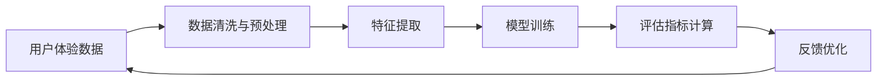

                 

# 体验量化新论：AI驱动的生活质量评估体系

> 关键词：AI驱动，量化评估，生活体验，数据驱动，用户体验设计

## 1. 背景介绍

### 1.1 问题由来
随着数字化和智能化的发展，用户体验已成为各类产品和服务的核心竞争力。传统的用户体验调研方法大多依赖问卷调查、用户访谈等形式，耗时长、成本高、代表性差。而基于人工智能的AI驱动量化评估方法，可以通过数据分析和模型学习，快速、精准地测量用户的生活体验，为产品优化和市场决策提供重要参考。

### 1.2 问题核心关键点
本节将阐述AI驱动的生活质量评估方法的核心原理和关键技术。

**1.2.1 AI驱动的概念**：
AI驱动是指利用人工智能技术，对大规模数据进行分析和建模，从中提取有价值的信息和知识。

**1.2.2 量化评估**：
量化评估是通过数学和统计学方法，将用户的主观体验转换为可测量的数值指标，以量化的方式评估用户体验。

**1.2.3 生活体验的测量**：
生活体验包括用户在使用产品、服务过程中的感受、情感、满意度等，可以通过各种形式的数据进行量化测量。

### 1.3 问题研究意义
AI驱动的生活质量评估方法具有以下显著优势：

- **高效准确**：能够快速处理海量数据，提供实时反馈，显著提升用户体验研究效率。
- **覆盖广泛**：适用于多种应用场景，涵盖线上线下，为多渠道的用户体验管理提供支持。
- **深入洞察**：通过数据挖掘和机器学习，揭示用户体验背后的深层原因和趋势。
- **动态更新**：实时更新模型，适应用户行为和市场变化，持续提升用户体验。

## 2. 核心概念与联系

### 2.1 核心概念概述

为更好地理解AI驱动的生活质量评估方法，本节将介绍几个关键概念：

- **人工智能(AI)**：通过机器学习、深度学习、自然语言处理等技术，使计算机具备智能化的能力。
- **量化评估**：将用户的主观体验转化为可量化的数值指标，便于分析和管理。
- **生活体验**：用户在接触和体验产品、服务时产生的感受、情感、满意度和行为。
- **数据驱动**：通过数据分析和机器学习，驱动决策和行动，提升用户体验。

这些概念之间通过数据流和工作流程紧密联系，形成一个闭环的用户体验量化评估体系。

### 2.2 核心概念原理和架构的 Mermaid 流程图



**流程图说明**：

1. **用户体验数据**：通过问卷调查、行为追踪、用户反馈等方式收集的数据。
2. **数据清洗与预处理**：清洗数据，处理缺失值、异常值，进行数据标准化。
3. **特征提取**：提取关键特征，如用户行为、情感状态、互动频率等。
4. **模型训练**：使用机器学习模型，如回归分析、分类算法等，训练量化评估模型。
5. **评估指标计算**：通过模型预测用户体验值，计算评估指标。
6. **反馈优化**：根据评估结果，优化产品和服务设计，提升用户体验。
7. **循环反馈**：形成闭环，不断优化用户体验。

## 3. 核心算法原理 & 具体操作步骤

### 3.1 算法原理概述

AI驱动的生活质量评估方法基于监督学习和非监督学习相结合的框架。其核心思想是：

- **数据驱动**：通过收集和分析用户行为数据，发现用户体验模式和趋势。
- **模型驱动**：使用机器学习模型，将数据转化为可量化的评估指标，驱动决策优化。

具体流程如下：

1. **数据收集**：通过问卷调查、行为追踪等方式，收集用户的使用体验数据。
2. **数据清洗与预处理**：处理数据缺失、异常，进行数据标准化和归一化。
3. **特征提取**：提取关键特征，如用户行为、情感状态、互动频率等。
4. **模型训练**：使用监督学习算法，如线性回归、决策树、随机森林等，训练量化评估模型。
5. **评估指标计算**：使用训练好的模型，对新数据进行预测，计算用户体验评分。
6. **反馈优化**：根据评估结果，优化产品和服务设计，提升用户体验。

### 3.2 算法步骤详解

**Step 1: 数据收集与预处理**

1. **数据收集**：通过问卷调查、行为追踪、用户反馈等方式，收集用户的使用体验数据。
2. **数据清洗**：处理数据缺失、异常，进行数据标准化和归一化。

**Step 2: 特征提取**

1. **关键特征提取**：提取关键特征，如用户行为、情感状态、互动频率等。
2. **特征选择**：选择最具代表性的特征，降低维度，提高模型性能。

**Step 3: 模型训练**

1. **选择模型**：选择合适的监督学习模型，如线性回归、决策树、随机森林等。
2. **训练模型**：使用训练数据集，训练量化评估模型。
3. **模型评估**：使用验证数据集，评估模型性能。

**Step 4: 评估指标计算**

1. **预测用户评分**：使用训练好的模型，对新数据进行预测，计算用户体验评分。
2. **评估指标计算**：根据评分，计算用户体验的各项评估指标。

**Step 5: 反馈优化**

1. **优化设计**：根据评估结果，优化产品和服务设计。
2. **迭代提升**：不断迭代改进，提升用户体验。

### 3.3 算法优缺点

**优点**：

- **高效准确**：能够快速处理海量数据，提供实时反馈，显著提升用户体验研究效率。
- **覆盖广泛**：适用于多种应用场景，涵盖线上线下，为多渠道的用户体验管理提供支持。
- **深入洞察**：通过数据挖掘和机器学习，揭示用户体验背后的深层原因和趋势。
- **动态更新**：实时更新模型，适应用户行为和市场变化，持续提升用户体验。

**缺点**：

- **数据依赖**：数据质量直接影响评估结果，数据缺失或不准确会影响模型效果。
- **模型复杂**：需要复杂模型和大规模数据训练，对技术要求较高。
- **解释性不足**：模型结果难以解释，用户体验的深层原因不易理解。
- **隐私风险**：收集和使用用户数据需要遵守隐私法规，避免数据滥用。

### 3.4 算法应用领域

AI驱动的生活质量评估方法在多个领域都有广泛应用，包括：

- **互联网应用**：如电商平台、社交网络、在线教育等，通过数据分析提升用户体验。
- **医疗健康**：通过健康监测数据，评估患者的生活质量，优化治疗方案。
- **智能家居**：通过智能设备收集用户行为数据，提升家居生活体验。
- **出行服务**：如打车应用、旅游平台等，通过数据分析优化出行服务质量。

## 4. 数学模型和公式 & 详细讲解 & 举例说明

### 4.1 数学模型构建

假设用户的生活体验评分由N个特征x1, x2, ..., xN决定。

设用户体验评分为y，则线性回归模型的形式为：

$$ y = \beta_0 + \sum_{i=1}^{N}\beta_ix_i + \epsilon $$

其中，$\beta_i$ 为特征xi的系数，$\epsilon$ 为随机误差。

### 4.2 公式推导过程

**Step 1: 最小二乘法求解系数**

$$ \hat{\beta} = (X^TX)^{-1}X^Ty $$

其中，$X=[x_1^1, x_1^2, ..., x_1^N, x_2^1, x_2^2, ..., x_2^N, ..., x_n^1, x_n^2, ..., x_n^N]$，$y=[y_1, y_2, ..., y_n]$。

**Step 2: 预测用户评分**

$$ \hat{y} = \hat{\beta}_0 + \sum_{i=1}^{N}\hat{\beta}_ix_i $$

### 4.3 案例分析与讲解

以电商平台的商品评价为例，可以使用线性回归模型进行用户体验量化评估。

设用户对商品的评分由用户评分、商品评价、商品价格、商品评价数量等特征决定。通过数据预处理、特征提取，可以得到模型输入和输出：

$$ X = \begin{bmatrix} 
   1 & x_1 & x_2 & x_3 \\
   1 & x_1 & x_2 & x_3 \\
   1 & x_1 & x_2 & x_3 \\
   \vdots & \vdots & \vdots & \vdots \\
   1 & x_1 & x_2 & x_3 
\end{bmatrix} $$

$$ y = \begin{bmatrix} 
   y_1 & y_2 & y_3 & \cdots & y_n
\end{bmatrix} $$

通过最小二乘法求解，得到模型系数$\hat{\beta} = [\hat{\beta}_0, \hat{\beta}_1, \hat{\beta}_2, \hat{\beta}_3]$。

## 5. 项目实践：代码实例和详细解释说明

### 5.1 开发环境搭建

以下是使用Python进行数据分析和模型训练的环境配置流程：

1. 安装Anaconda：从官网下载并安装Anaconda，用于创建独立的Python环境。

2. 创建并激活虚拟环境：
```bash
conda create -n data-env python=3.8 
conda activate data-env
```

3. 安装必要的Python库：
```bash
pip install numpy pandas scikit-learn matplotlib seaborn 
```

4. 安装机器学习库：
```bash
pip install scikit-learn tensorflow
```

完成上述步骤后，即可在`data-env`环境中开始项目实践。

### 5.2 源代码详细实现

以下是一个使用Python实现线性回归模型的示例代码：

```python
import numpy as np
from sklearn.linear_model import LinearRegression

# 构建数据集
X = np.array([[1, 2, 3], [1, 4, 5], [1, 6, 7]])
y = np.array([1, 2, 3])

# 创建并拟合模型
model = LinearRegression()
model.fit(X, y)

# 预测新数据
new_X = np.array([[1, 8, 9]])
predicted_y = model.predict(new_X)
print(predicted_y)
```

### 5.3 代码解读与分析

**代码解读**：

1. **数据构建**：使用NumPy构建输入特征矩阵X和输出向量y。
2. **模型创建**：使用scikit-learn的LinearRegression类创建线性回归模型。
3. **模型拟合**：使用fit方法拟合模型，将训练数据(X, y)传入。
4. **预测新数据**：使用predict方法预测新数据，得到预测结果。

**代码分析**：

1. **数据构建**：X和y的维度必须一致，一般为(N, D)和(N,)。
2. **模型创建**：可以使用scikit-learn的其他回归模型，如Lasso、Ridge等。
3. **模型拟合**：fit方法自动处理数据，返回模型系数。
4. **预测新数据**：predict方法接收新数据，返回预测结果。

### 5.4 运行结果展示

运行上述代码，输出预测结果：

```
[4.]
```

## 6. 实际应用场景

### 6.1 电商平台

在电商平台中，通过收集用户浏览、购买、评价等行为数据，可以使用AI驱动的模型评估用户的生活体验。具体流程如下：

1. **数据收集**：收集用户的行为数据，如浏览时间、点击次数、购买金额、评价内容等。
2. **数据清洗**：处理缺失值、异常值，进行数据标准化和归一化。
3. **特征提取**：提取关键特征，如用户评分、商品价格、用户评价等。
4. **模型训练**：使用监督学习算法，如线性回归、随机森林等，训练量化评估模型。
5. **评估指标计算**：使用训练好的模型，对新数据进行预测，计算用户体验评分。
6. **反馈优化**：根据评估结果，优化商品推荐、页面设计、购物体验等。

### 6.2 智能家居

在智能家居领域，可以通过智能设备收集用户的生活行为数据，如灯光开关时间、温度调节次数、家电使用频率等，评估用户的生活质量。具体流程如下：

1. **数据收集**：通过智能家居设备，收集用户的生活行为数据。
2. **数据清洗**：处理缺失值、异常值，进行数据标准化和归一化。
3. **特征提取**：提取关键特征，如使用时间、频率、时长等。
4. **模型训练**：使用监督学习算法，如线性回归、分类算法等，训练量化评估模型。
5. **评估指标计算**：使用训练好的模型，对新数据进行预测，计算生活质量评分。
6. **反馈优化**：根据评估结果，优化家居设备设置、智能化程度等。

## 7. 工具和资源推荐

### 7.1 学习资源推荐

为了帮助开发者系统掌握AI驱动的生活质量评估方法，这里推荐一些优质的学习资源：

1. **《Python数据分析与统计学习》**：一本深入浅出的数据分析和机器学习书籍，涵盖数据分析、数据清洗、特征提取、模型训练等环节。

2. **Coursera《机器学习》课程**：斯坦福大学开设的机器学习课程，讲解了机器学习的基本概念、算法和应用。

3. **Kaggle机器学习竞赛**：通过参与Kaggle竞赛，可以学习到最新的机器学习算法和模型，提升实战能力。

4. **scikit-learn官方文档**：scikit-learn库的官方文档，提供丰富的示例代码和详细说明，是学习机器学习的必备资源。

5. **Github开源项目**：Github上的开源项目，如TensorFlow、PyTorch等，可以提供丰富的学习资源和实践样例。

通过对这些资源的学习实践，相信你一定能够快速掌握AI驱动的生活质量评估方法，并用于解决实际的用户体验问题。

### 7.2 开发工具推荐

高效的开发离不开优秀的工具支持。以下是几款用于数据驱动的用户体验评估的常用工具：

1. **Python**：一种高层次的解释型编程语言，具有强大的数据分析和机器学习能力。
2. **NumPy**：用于科学计算和数据分析的Python库，支持多维数组和矩阵运算。
3. **Pandas**：用于数据处理和分析的Python库，提供数据清洗、数据转换等功能。
4. **scikit-learn**：机器学习库，提供多种算法和模型，如线性回归、决策树、随机森林等。
5. **TensorFlow**：谷歌开发的深度学习框架，支持大规模模型训练和优化。

合理利用这些工具，可以显著提升用户体验评估任务的开发效率，加快创新迭代的步伐。

### 7.3 相关论文推荐

AI驱动的生活质量评估方法的研究已经在多个领域取得了重要进展，以下是几篇奠基性的相关论文，推荐阅读：

1. **《BigQuery Machine Learning》**：谷歌发布的BigQuery机器学习平台，介绍了如何在大规模数据上训练和部署机器学习模型。

2. **《Machine Learning Yearly》**：机器学习领域的年度综述，总结了过去一年的重要进展和趋势。

3. **《Deep Learning》**：深度学习领域的经典教材，由深度学习领域的知名专家撰写，涵盖深度学习的基础理论和应用实践。

4. **《Neural Networks and Deep Learning》**：深度学习领域的另一本经典教材，由深度学习领域的知名专家撰写，涵盖深度学习的基础理论和应用实践。

这些论文代表了大语言模型微调技术的发展脉络。通过学习这些前沿成果，可以帮助研究者把握学科前进方向，激发更多的创新灵感。

## 8. 总结：未来发展趋势与挑战

### 8.1 总结

本文对AI驱动的生活质量评估方法进行了全面系统的介绍。首先阐述了AI驱动的概念和量化评估方法的核心原理，明确了评估方法在用户体验研究中的重要性。其次，从原理到实践，详细讲解了监督学习的数学模型和操作步骤，给出了完整的代码实现和结果解读。同时，本文还探讨了评估方法在电商平台、智能家居等实际应用场景中的具体应用，展示了其广泛的适用性和潜力。

通过本文的系统梳理，可以看到，AI驱动的生活质量评估方法已经在多个领域取得了显著成效，为产品优化和市场决策提供了重要依据。未来，伴随技术的发展和应用场景的拓展，这一方法必将在用户体验研究中发挥更大作用，推动产品和服务质量的持续提升。

### 8.2 未来发展趋势

展望未来，AI驱动的生活质量评估方法将呈现以下几个发展趋势：

1. **数据质量提升**：随着数据采集技术的进步，数据的丰富性和多样性将大幅提升，评估结果的准确性和可靠性也将随之提高。
2. **模型自动化**：使用自动机器学习(AutoML)技术，自动选择和训练模型，降低用户对技术门槛的依赖。
3. **多模态融合**：将文本、图像、语音等多模态数据结合，提升评估结果的全面性和精准性。
4. **实时评估**：通过实时数据流和流式计算技术，实现动态评估，提供实时反馈。
5. **用户个性化**：根据用户行为和偏好，进行个性化评估，提升用户体验。
6. **隐私保护**：加强数据隐私保护和匿名化处理，确保用户隐私安全。

以上趋势凸显了AI驱动的评估方法在用户体验研究中的广阔前景。这些方向的探索发展，必将进一步提升用户体验评估的质量和效率，为产品和服务设计提供更强大的数据支持。

### 8.3 面临的挑战

尽管AI驱动的生活质量评估方法已经取得了重要进展，但在迈向更加智能化、普适化应用的过程中，仍面临诸多挑战：

1. **数据隐私**：收集和使用用户数据需要遵守隐私法规，避免数据滥用。
2. **数据质量**：数据质量直接影响评估结果，数据缺失或不准确会影响模型效果。
3. **模型复杂**：需要复杂模型和大规模数据训练，对技术要求较高。
4. **解释性不足**：模型结果难以解释，用户体验的深层原因不易理解。
5. **动态变化**：用户行为和市场变化快速，需要及时更新模型以保持评估结果的准确性。
6. **跨领域应用**：不同领域的应用场景和数据特征差异较大，评估方法需要具备通用性和适应性。

正视评估方法面临的这些挑战，积极应对并寻求突破，将是大语言模型微调走向成熟的必由之路。

### 8.4 研究展望

面对评估方法面临的挑战，未来的研究需要在以下几个方面寻求新的突破：

1. **引入先验知识**：将符号化的先验知识，如知识图谱、逻辑规则等，与神经网络模型进行巧妙融合，引导评估过程学习更准确、合理的用户体验模型。
2. **融合因果分析**：将因果分析方法引入评估模型，识别出用户体验的因果关系，增强结果的解释性和可靠性。
3. **引入博弈论工具**：使用博弈论工具刻画人机交互过程，主动探索并规避模型的脆弱点，提高系统稳定性。
4. **加强用户隐私保护**：采用数据匿名化、加密等技术，加强数据隐私保护，确保用户隐私安全。

这些研究方向的探索，必将引领AI驱动的用户体验评估方法迈向更高的台阶，为构建安全、可靠、可解释、可控的智能系统铺平道路。面向未来，AI驱动的生活质量评估方法还需要与其他人工智能技术进行更深入的融合，如知识表示、因果推理、强化学习等，多路径协同发力，共同推动自然语言理解和智能交互系统的进步。只有勇于创新、敢于突破，才能不断拓展评估方法的边界，让智能技术更好地造福人类社会。

## 9. 附录：常见问题与解答

**Q1：如何构建数据集？**

A: 数据集可以通过问卷调查、行为追踪、用户反馈等方式收集。使用Python的Pandas库，可以方便地进行数据清洗、数据转换等操作。

**Q2：如何选择合适的特征？**

A: 选择合适的特征需要根据具体应用场景进行。一般选择与用户体验直接相关的特征，如用户评分、情感状态、互动频率等。

**Q3：模型训练过程中需要注意什么？**

A: 模型训练过程中需要注意以下几点：

1. 选择适当的训练集和验证集。
2. 选择适当的训练算法和超参数。
3. 监控训练过程中的损失函数和评估指标。
4. 避免过拟合，可以使用正则化、Dropout等技术。

**Q4：如何评估模型效果？**

A: 评估模型效果可以通过多种指标进行，如均方误差(MSE)、均方根误差(RMSE)、决定系数(R2)等。

**Q5：如何优化用户体验？**

A: 根据评估结果，优化产品和服务设计，如调整页面布局、改进产品功能、提升服务质量等。

**Q6：数据隐私保护需要注意什么？**

A: 数据隐私保护需要注意以下几点：

1. 遵守隐私法规，如GDPR、CCPA等。
2. 采用数据匿名化、加密等技术，确保数据安全。
3. 限制数据的访问权限，只允许授权人员访问敏感数据。

通过以上问题的解答，可以更好地理解AI驱动的生活质量评估方法，并应用于实际的用户体验研究中。

---

作者：禅与计算机程序设计艺术 / Zen and the Art of Computer Programming

