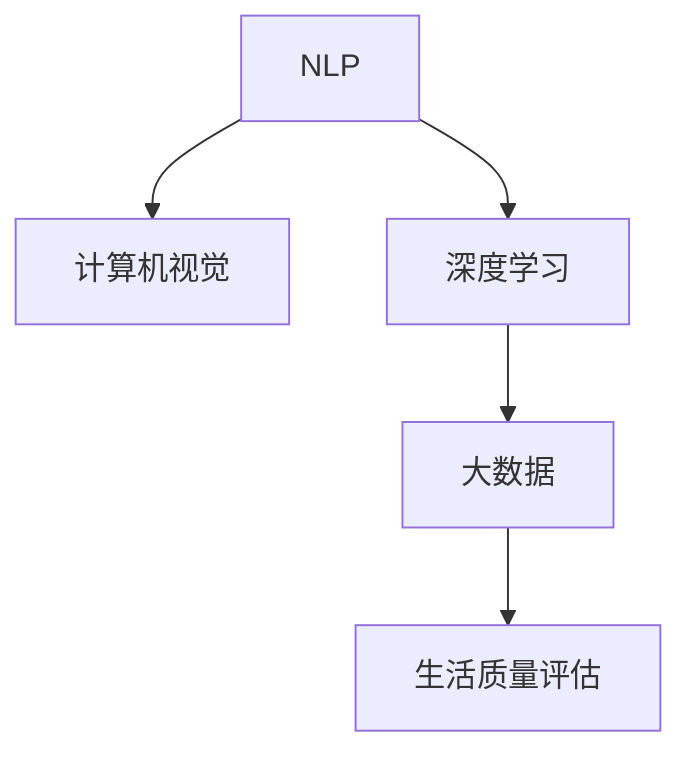

                 

# 体验量化革命：AI驱动的生活质量评估

> 关键词：量化革命, 生活质量评估, 人工智能, 机器学习, 自然语言处理(NLP), 深度学习, 计算机视觉, 大数据

## 1. 背景介绍

### 1.1 问题由来

随着社会经济的发展和人民生活水平的提高，人们对生活质量的关注日益增强。然而，如何准确、全面地量化生活质量，一直是一个复杂且具有挑战性的问题。传统的人工统计方式往往耗费大量的人力物力，且难以全面覆盖各个方面的生活需求。因此，需要借助AI技术，特别是人工智能和机器学习，来驱动生活质量评估的量化革命。

### 1.2 问题核心关键点

生活质量评估的本质是通过收集和分析各种生活相关数据，通过量化手段反映人的生活质量和满意度。这一过程涉及到自然语言处理、计算机视觉、深度学习和大数据等多个领域。量化革命的关键在于：

1. **数据采集和处理**：构建全面的数据采集体系，包括问卷调查、社交媒体、传感器数据等。
2. **模型训练和优化**：利用机器学习算法，特别是深度学习模型，进行模型训练和优化。
3. **评估指标设计**：根据不同的生活质量维度，设计合理的评估指标和量化标准。
4. **用户交互和反馈**：建立互动机制，收集用户对评估结果的反馈，不断迭代优化模型。
5. **应用和部署**：将量化模型应用到实际的生活场景中，提供个性化的生活质量评估服务。

## 2. 核心概念与联系

### 2.1 核心概念概述

为更好地理解AI驱动的生活质量评估量化革命，本节将介绍几个关键概念及其内在联系：

- **自然语言处理(NLP)**：通过机器学习和深度学习技术，使计算机能够理解、分析和生成自然语言。
- **计算机视觉**：利用图像处理和深度学习技术，使计算机能够识别和理解图像中的内容。
- **深度学习**：一种基于神经网络的机器学习技术，通过多层次的特征提取和抽象，实现复杂的任务。
- **大数据**：指海量的、多源的、结构化的数据集，用于训练和优化机器学习模型。
- **生活质量评估**：通过数据采集、模型训练和应用部署，量化反映人们的生活满意度和幸福感。

这些概念通过机器学习和大数据技术相融合，实现了对生活质量的全面、动态、个性化的评估，为提升生活质量提供了有力支撑。

### 2.2 核心概念原理和架构的 Mermaid 流程图



这个流程图展示了NLP、计算机视觉、深度学习和大数据在生活质量评估量化革命中的相互联系和作用机制。

## 3. 核心算法原理 & 具体操作步骤

### 3.1 算法原理概述

基于AI的生活质量评估量化革命，其核心算法原理主要包括：

1. **自然语言处理**：通过文本挖掘技术，从社交媒体、问卷调查等文本数据中提取有用信息。
2. **计算机视觉**：通过图像识别技术，从图片和视频中提取生活场景的特征。
3. **深度学习模型**：利用神经网络模型，对提取的数据进行特征学习和表示。
4. **评估指标设计**：根据生活质量的多个维度（如经济、健康、安全、环境等），设计合理的评估指标。
5. **评估模型训练**：利用标注数据集，训练深度学习模型，优化评估指标。

### 3.2 算法步骤详解

**Step 1: 数据采集和预处理**

- 收集各类生活数据，包括问卷调查、社交媒体帖子、传感器数据等。
- 对数据进行清洗和预处理，去除噪声和异常值。

**Step 2: 特征提取**

- 利用NLP技术，从文本中提取关键词、情感、话题等特征。
- 利用计算机视觉技术，从图片中提取场景、活动、物体等特征。

**Step 3: 模型训练**

- 设计深度学习模型架构，如RNN、CNN、LSTM等。
- 使用标注数据集训练模型，调整参数，优化损失函数。

**Step 4: 模型评估**

- 在测试数据集上评估模型性能，使用准确率、召回率、F1分数等指标。
- 根据评估结果调整模型参数，进一步优化模型。

**Step 5: 应用部署**

- 将优化后的模型应用到实际的生活场景中，提供生活质量评估服务。
- 收集用户反馈，不断迭代模型，提升评估精度和适用性。

### 3.3 算法优缺点

基于AI的生活质量评估量化革命，其优点主要包括：

- **全面覆盖**：能够覆盖生活中的各个方面，提供全面、多维度的评估。
- **实时动态**：通过实时数据采集和处理，能够动态反映生活质量变化。
- **个性化定制**：根据用户需求和偏好，提供个性化评估结果和建议。
- **高效便捷**：利用AI技术，实现自动化评估，节省人力物力。

同时，也存在一些缺点：

- **数据质量问题**：数据采集和处理过程中，可能存在噪声和偏差。
- **模型复杂性**：深度学习模型复杂，训练和优化需要大量计算资源。
- **隐私保护**：收集和使用个人数据时，需考虑隐私保护和数据安全问题。
- **应用场景局限**：目前主要应用于特定领域，推广到更多场景需要进一步优化。

### 3.4 算法应用领域

基于AI的生活质量评估量化革命，已经在多个领域得到了应用，例如：

- **城市规划**：通过收集居民反馈，评估城市基础设施和生活便利性，指导城市规划和建设。
- **健康管理**：利用传感器数据和问卷调查，评估居民健康状况和生活质量，提供健康管理建议。
- **环境保护**：通过分析环境数据，评估空气质量、水质等环境因素，指导环境保护措施。
- **社会福利**：收集居民满意度数据，评估社会福利政策的效果，优化政策制定和实施。
- **企业人力资源管理**：通过员工满意度调查，评估企业内部管理和生活质量，提升员工福利和生产力。

## 4. 数学模型和公式 & 详细讲解

### 4.1 数学模型构建

基于AI的生活质量评估量化革命，其数学模型主要包括以下几个部分：

- **文本数据模型**：用于处理和分析文本数据，包括TF-IDF模型、情感分析模型等。
- **图像数据模型**：用于处理和分析图像数据，包括卷积神经网络(CNN)、循环神经网络(LSTM)等。
- **评估指标模型**：用于设计和生活质量相关的评估指标，包括经济指标、健康指标、安全指标等。
- **综合评估模型**：将不同维度的评估指标进行综合，得到整体生活质量评估结果。

### 4.2 公式推导过程

以情感分析模型为例，其公式推导过程如下：

假设文本数据为$D=\{x_i\}_{i=1}^N$，每个文本的情感标签为$y_i \in \{1, -1\}$，其中1表示正面情感，-1表示负面情感。情感分析模型的目标是通过训练，找到一个最优的权重向量$\theta$，使得模型在测试集上的预测准确率最大化。

设文本数据经过向量化处理后，每个文本表示为向量$\boldsymbol{x}_i \in \mathbb{R}^d$，情感标签向量为$\boldsymbol{y}_i \in \mathbb{R}^2$，则情感分析模型的目标函数为：

$$
\min_{\theta} \frac{1}{N} \sum_{i=1}^N \ell(y_i, \hat{y}_i)
$$

其中，$\ell$为损失函数，通常使用交叉熵损失函数，$\hat{y}_i$为模型对文本情感的预测。

模型训练过程如下：

1. 初始化权重向量$\theta$。
2. 对于每个训练样本$(x_i, y_i)$，计算预测值$\hat{y}_i$。
3. 计算损失函数$\ell(y_i, \hat{y}_i)$。
4. 更新权重向量$\theta$，最小化损失函数。

### 4.3 案例分析与讲解

以情感分析模型在城市生活质量评估中的应用为例：

假设收集了10000条社交媒体帖子，其中正面情感的帖子有3000条，负面情感的帖子有7000条。将帖子向量化，训练一个情感分析模型，其权重向量$\theta$通过以下公式求解：

$$
\theta = \mathop{\arg\min}_{\theta} \frac{1}{10000} \sum_{i=1}^{10000} -y_i \log \hat{y}_i
$$

训练完成后，使用测试集验证模型的性能。假设测试集中，有5000条正面情感的帖子，5000条负面情感的帖子，模型对测试集上的预测准确率为：

$$
\text{Accuracy} = \frac{1}{5000} \sum_{i=1}^{5000} \mathbb{I}(y_i = \hat{y}_i)
$$

## 5. 项目实践：代码实例和详细解释说明

### 5.1 开发环境搭建

在进行生活质量评估量化革命的实践时，需要准备相应的开发环境。以下是使用Python进行项目开发的配置步骤：

1. 安装Python：从官网下载并安装最新版本的Python。
2. 安装相关库：安装Numpy、Pandas、Scikit-learn、TensorFlow等必要的库。
3. 安装GPU驱动：如果计算机配备GPU，需安装相应的NVIDIA GPU驱动。
4. 配置虚拟环境：使用virtualenv或conda创建虚拟环境，避免库冲突。
5. 安装可视化工具：安装TensorBoard等可视化工具，用于监控模型训练过程。

### 5.2 源代码详细实现

以下是一个基于TensorFlow实现情感分析模型的代码示例：

```python
import tensorflow as tf
from tensorflow.keras import layers

# 定义情感分析模型
model = tf.keras.Sequential([
    layers.Embedding(input_dim=10000, output_dim=16),
    layers.LSTM(64),
    layers.Dense(1, activation='sigmoid')
])

# 定义损失函数和优化器
loss_fn = tf.keras.losses.BinaryCrossentropy()
optimizer = tf.keras.optimizers.Adam(learning_rate=0.001)

# 定义训练过程
@tf.function
def train_step(inputs, targets):
    with tf.GradientTape() as tape:
        predictions = model(inputs)
        loss = loss_fn(targets, predictions)
    gradients = tape.gradient(loss, model.trainable_variables)
    optimizer.apply_gradients(zip(gradients, model.trainable_variables))
    return loss

# 训练模型
for epoch in range(10):
    for batch in train_dataset:
        inputs, targets = batch
        loss = train_step(inputs, targets)
        print("Epoch %d, Loss: %f" % (epoch+1, loss.numpy()))
```

### 5.3 代码解读与分析

让我们进一步解读上述代码的实现细节：

- **模型定义**：使用TensorFlow的Sequential模型，包含嵌入层、LSTM层和全连接层。嵌入层将文本向量化，LSTM层用于特征提取，全连接层输出情感预测结果。
- **损失函数和优化器**：使用二元交叉熵作为损失函数，Adam优化器进行参数更新。
- **训练过程**：定义train_step函数，用于每个批次上的模型训练。使用tf.GradientTape自动计算梯度，并使用Adam优化器更新模型参数。
- **训练循环**：循环训练模型，打印每个epoch的损失值。

### 5.4 运行结果展示

训练完成后，使用测试集对模型进行评估：

```python
# 定义测试过程
@tf.function
def test_step(inputs, targets):
    predictions = model(inputs)
    return predictions

# 测试模型
test_loss = 0
test_corrects = 0
for batch in test_dataset:
    inputs, targets = batch
    predictions = test_step(inputs)
    loss = loss_fn(targets, predictions)
    test_loss += loss.numpy()
    test_corrects += tf.reduce_sum(tf.cast(tf.equal(targets, predictions), tf.int32)).numpy()
print("Test Loss: %f, Accuracy: %f" % (test_loss / len(test_dataset), test_corrects / len(test_dataset)))
```

通过上述代码，可以得到测试集上的损失值和准确率，评估模型的性能。

## 6. 实际应用场景

### 6.1 智能城市治理

在智能城市治理中，基于AI的生活质量评估量化革命能够帮助城市管理者更好地理解居民的需求和满意度，优化城市规划和建设。通过收集城市基础设施、公共服务、环境质量等方面的数据，结合居民的反馈，可以动态评估城市的生活质量，提供决策支持。

### 6.2 健康管理和医疗服务

在健康管理和医疗服务中，基于AI的生活质量评估量化革命可以帮助医疗机构更好地了解患者的健康状况和生活需求，提供个性化的健康管理方案。通过分析患者的健康数据和生活质量评估结果，可以为患者制定针对性的治疗和康复计划，提升医疗服务的质量和效率。

### 6.3 环境保护和可持续发展

在环境保护和可持续发展中，基于AI的生活质量评估量化革命可以帮助政府和企业更好地评估环境质量对居民生活质量的影响，指导环境保护和资源利用。通过分析空气质量、水质、噪声等环境指标，可以评估环境对居民健康和幸福的影响，提出改进措施。

### 6.4 未来应用展望

未来，基于AI的生活质量评估量化革命将进一步扩展到更多领域，例如：

- **教育领域**：通过收集学生反馈和表现数据，评估教育质量和生活满意度，优化教学方法和课程设置。
- **金融领域**：通过分析消费者行为和生活质量评估结果，优化金融产品和服务的质量，提升客户满意度。
- **农业领域**：通过分析农民的生活质量评估结果，优化农业生产和管理，提高农业产出和农民收入。

## 7. 工具和资源推荐

### 7.1 学习资源推荐

为了帮助开发者系统掌握基于AI的生活质量评估量化革命的理论基础和实践技巧，这里推荐一些优质的学习资源：

1. **《深度学习》课程**：由斯坦福大学开设，全面介绍了深度学习的基本原理和算法。
2. **《Python数据科学手册》**：详细介绍了Python在数据科学和机器学习中的应用，包括NLP和计算机视觉。
3. **《TensorFlow官方文档》**：TensorFlow的官方文档，提供了丰富的教程和样例代码，是学习深度学习的重要资源。
4. **Kaggle竞赛**：参与Kaggle的机器学习竞赛，实践和优化各类生活数据的质量评估模型。
5. **GitHub开源项目**：GitHub上包含大量高质量的机器学习项目，可以学习他人的代码实现和算法优化。

### 7.2 开发工具推荐

高效的开发离不开优秀的工具支持。以下是几款用于生活质量评估量化革命开发的常用工具：

1. **TensorFlow**：由Google主导开发的深度学习框架，功能强大，支持分布式计算。
2. **PyTorch**：Facebook开发的深度学习框架，灵活高效，适合研究和原型开发。
3. **Jupyter Notebook**：用于编写和分享Python代码的交互式笔记本，支持多种库和语言。
4. **TensorBoard**：TensorFlow配套的可视化工具，可以实时监测模型训练过程和指标变化。
5. **Google Colab**：谷歌提供的免费Jupyter Notebook环境，支持GPU和TPU计算资源。

### 7.3 相关论文推荐

基于AI的生活质量评估量化革命得益于学界的持续研究。以下是几篇奠基性的相关论文，推荐阅读：

1. **《情感分析的深度学习方法》**：提出了深度学习在情感分析中的应用，并介绍了各种情感分析模型。
2. **《使用深度学习进行城市生活质量评估》**：研究了使用深度学习评估城市生活质量的方法和效果。
3. **《基于大数据的生活质量评估模型》**：探讨了利用大数据进行生活质量评估的算法和优化方法。

## 8. 总结：未来发展趋势与挑战

### 8.1 研究成果总结

基于AI的生活质量评估量化革命已经取得了显著的进展，主要体现在以下几个方面：

1. **数据采集和处理**：构建了全面的数据采集体系，覆盖了各类生活数据。
2. **模型训练和优化**：开发了多种深度学习模型，提高了评估精度和速度。
3. **评估指标设计**：设计了多维度的评估指标，全面反映生活质量。
4. **应用和部署**：将模型应用到实际生活场景中，提供了个性化服务。

### 8.2 未来发展趋势

展望未来，基于AI的生活质量评估量化革命将呈现以下几个发展趋势：

1. **多模态数据融合**：将文本、图像、声音等多种数据类型融合，全面评估生活质量。
2. **实时动态评估**：通过实时数据采集和处理，实现动态评估生活质量的变化。
3. **个性化服务优化**：根据用户需求和偏好，提供个性化的评估结果和建议。
4. **联邦学习和隐私保护**：通过联邦学习等技术，保护用户隐私和数据安全。
5. **跨领域应用扩展**：将量化模型应用到更多领域，提升生活质量评估的普适性。

### 8.3 面临的挑战

尽管基于AI的生活质量评估量化革命取得了许多进展，但仍面临一些挑战：

1. **数据质量和隐私**：数据采集和处理过程中，可能存在噪声和隐私泄露问题。
2. **模型复杂性**：深度学习模型复杂，训练和优化需要大量计算资源。
3. **应用场景局限**：目前主要应用于特定领域，推广到更多场景需要进一步优化。
4. **用户交互设计**：评估结果需要与用户有效交互，收集反馈，不断迭代优化。

### 8.4 研究展望

未来研究需要在以下几个方面寻求新的突破：

1. **数据增强技术**：开发更高效的数据增强方法，提升数据质量和多样性。
2. **模型压缩和优化**：开发更轻量级的模型架构，提升计算效率和推理速度。
3. **联邦学习与隐私保护**：研究联邦学习等技术，保护用户隐私和数据安全。
4. **跨领域知识融合**：将不同领域的知识融合，提升评估模型的综合能力。
5. **动态评估和实时反馈**：实现动态评估和实时反馈机制，提升评估模型的适应性。

## 9. 附录：常见问题与解答

**Q1：如何构建高质量的生活质量评估数据集？**

A: 高质量的生活质量评估数据集需要广泛覆盖不同生活场景和人群，包括以下步骤：

1. **数据来源**：选择可信的数据来源，如问卷调查、社交媒体、传感器数据等。
2. **数据清洗**：去除噪声和异常值，确保数据质量。
3. **数据标注**：对数据进行标注，标记每个样本的情感、满意度等指标。
4. **数据增强**：通过回译、近义替换等方式，扩充训练集，增加数据多样性。

**Q2：如何优化深度学习模型的训练过程？**

A: 深度学习模型训练过程的优化方法包括：

1. **数据增强**：使用数据增强技术，如回译、旋转、缩放等，扩充训练集。
2. **正则化**：使用L2正则、Dropout等方法，防止过拟合。
3. **学习率调度**：使用warmup策略，逐步调整学习率。
4. **模型并行**：采用模型并行技术，提高计算效率。
5. **混合精度训练**：使用混合精度训练，提升计算效率和模型精度。

**Q3：如何保护用户隐私和数据安全？**

A: 保护用户隐私和数据安全的方法包括：

1. **数据匿名化**：对数据进行匿名化处理，去除个人信息。
2. **联邦学习**：通过联邦学习技术，在本地训练模型，不传输数据。
3. **差分隐私**：使用差分隐私技术，保护用户数据隐私。
4. **安全计算**：使用安全计算技术，确保数据传输和处理的安全性。

**Q4：如何选择适合的评估指标？**

A: 选择适合的评估指标需要考虑以下因素：

1. **数据类型**：根据数据的类型选择合适的指标，如情感分析、满意度调查等。
2. **评估维度**：根据评估维度选择合适的指标，如经济、健康、安全等。
3. **数据分布**：根据数据的分布选择合适的指标，如均值、中位数等。
4. **目标导向**：根据评估目标选择合适的指标，如提升生活质量、优化政策等。

**Q5：如何将评估结果应用于实际生活场景？**

A: 将评估结果应用于实际生活场景的方法包括：

1. **交互设计**：设计用户友好的交互界面，收集用户反馈。
2. **个性化推荐**：根据评估结果，提供个性化的服务和建议。
3. **持续优化**：根据用户反馈，持续优化评估模型和应用。
4. **多渠道应用**：将评估结果应用到多个渠道，如APP、网页、手机等。

---

作者：禅与计算机程序设计艺术 / Zen and the Art of Computer Programming

