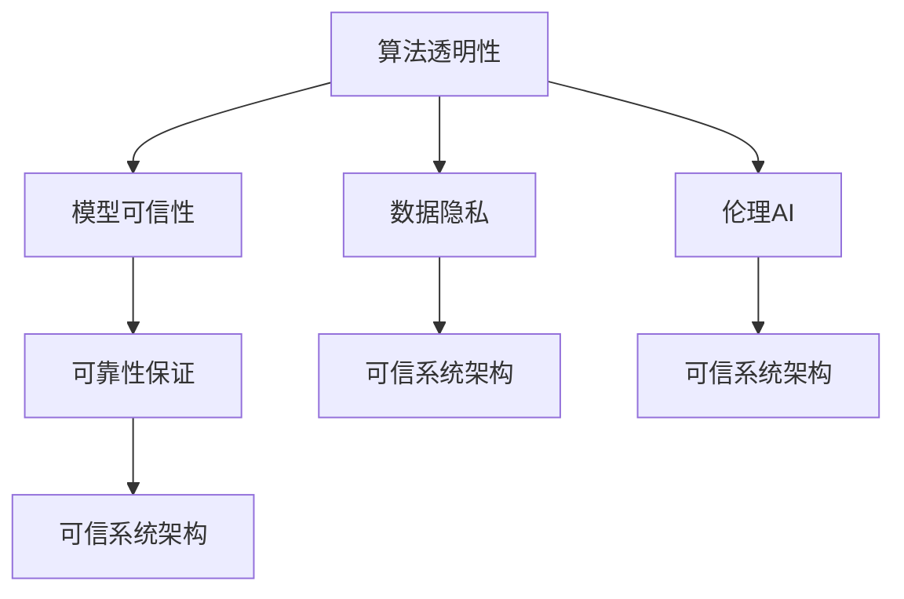

                 

# 信任与人工智能：建立可靠关系

> 关键词：人工智能, 信任系统, 模型可信性, 算法透明性, 解释性AI, 可解释性, 数据隐私, 伦理AI, 可靠性保证

## 1. 背景介绍

### 1.1 问题由来

人工智能(AI)技术的快速发展正在彻底改变各行各业的面貌。然而，随着AI系统的普及，其可靠性、可解释性和伦理问题也愈发受到关注。AI系统的误判或不当行为，可能带来重大的安全、隐私和经济损失。因此，建立可信的AI系统成为当前AI研究和应用中的一个核心议题。

### 1.2 问题核心关键点

可信AI系统需要具备以下关键特征：
- **算法透明性**：能够清晰解释模型决策过程，让用户理解AI系统的工作原理。
- **模型可信性**：确保模型的预测结果具有可靠性，并能够适应新的数据。
- **数据隐私**：保护用户数据，避免数据滥用和隐私泄露。
- **伦理AI**：遵循道德准则和法律规范，避免产生歧视性、偏见性输出。
- **可靠性保证**：确保AI系统在各种环境条件下稳定运行，避免失效或错误。

本文聚焦于构建可信AI系统中的信任机制，通过算法透明性、模型可信性、数据隐私保护和伦理AI等方法，探讨如何在AI系统中建立可靠的人机关系。

## 2. 核心概念与联系

### 2.1 核心概念概述

为了深入理解如何构建可信AI系统，本节将介绍几个核心概念：

- **算法透明性(Algorithm Transparency)**：指AI系统能够清晰地解释其决策过程，使得用户能够理解模型的运行机制和逻辑。
- **模型可信性(Model Trustworthiness)**：指AI系统在各种数据和环境条件下，其输出结果都是准确和可信的。
- **数据隐私(Data Privacy)**：指在AI系统开发和使用过程中，对用户数据进行严格保护，避免数据滥用和隐私泄露。
- **伦理AI(Ethical AI)**：指在AI系统的设计和应用中，遵循伦理准则和法律法规，避免产生有害行为。
- **可靠性保证(Reliability Assurance)**：指在AI系统设计中，采取各种技术手段确保系统的稳定性和鲁棒性，避免失效或错误。

这些概念之间互相联系，共同构成了可信AI系统的基础。通过提高算法透明性、模型可信性、数据隐私保护和伦理AI，我们可以在AI系统中建立可靠的人机关系。

### 2.2 核心概念原理和架构的 Mermaid 流程图



这个流程图展示了大语言模型微调技术中的核心概念及其联系：

1. **算法透明性**：通过解释模型决策过程，增强用户信任。
2. **模型可信性**：确保模型在不同数据和环境条件下，输出结果的可靠性。
3. **数据隐私**：在数据处理和传输过程中，严格保护用户数据隐私。
4. **伦理AI**：确保AI系统遵守伦理准则和法律法规。
5. **可靠性保证**：通过多种技术手段，确保AI系统稳定运行。

这些概念共同构成可信AI系统的框架，为构建可靠的人机关系提供坚实基础。

## 3. 核心算法原理 & 具体操作步骤
### 3.1 算法原理概述

可信AI系统构建的核心在于确保算法的透明性、模型的可信性、数据隐私保护和伦理AI。这些目标通过一系列的算法和技术手段实现，以下是每个关键点的详细解释：

### 3.2 算法步骤详解

#### 3.2.1 算法透明性

**算法透明性**的核心在于提供模型决策的可解释性，使用户能够理解模型的工作机制。具体实现包括：

1. **特征重要性分析**：分析输入数据中哪些特征对模型预测影响最大，帮助用户理解模型的关注点。
2. **决策路径追踪**：追踪模型在预测时使用的决策路径，展示模型的推理逻辑。
3. **局部解释**：在特定样本上提供详细的模型解释，帮助用户理解模型在该样本上的决策。

**案例分析**：

假设我们有一个用于预测贷款违约风险的AI系统。该系统使用了深度学习模型，并预测了每个申请贷款客户的违约概率。为了增强该系统的可信性，我们采取以下措施：
- 使用SHAP值分析特征的重要性，展示不同特征对模型输出的影响。
- 绘制决策树，追踪模型在预测时使用的特征组合。
- 在少数高风险申请案例上，提供详细的解释，说明模型为什么将其预测为高风险。

#### 3.2.2 模型可信性

**模型可信性**的实现主要通过以下几个方面：

1. **模型验证**：在多种数据和环境条件下验证模型的性能，确保其泛化能力。
2. **异常检测**：检测模型输出中的异常值，及时发现和修正模型的错误。
3. **持续学习**：不断更新模型，确保其适应新数据和环境变化。

**案例分析**：

继续使用贷款违约预测的AI系统，为了确保其可信性，我们采取以下措施：
- 在训练集和测试集上评估模型的性能，并进行交叉验证。
- 使用异常检测算法，检测并分析模型预测的异常值。
- 定期收集新数据，重新训练模型，确保其适应新客户和市场变化。

#### 3.2.3 数据隐私保护

**数据隐私保护**是可信AI系统中的重要环节，主要通过以下方法实现：

1. **数据脱敏**：对敏感数据进行脱敏处理，确保隐私信息不被泄露。
2. **差分隐私**：在模型训练和推理过程中，加入噪声，保护个体数据的隐私。
3. **联邦学习**：在多个数据源上进行分布式训练，避免数据集中存储。

**案例分析**：

假设我们有一个医疗诊断AI系统，需要保护患者的隐私数据。我们采取以下措施：
- 对患者的姓名、身份证号等敏感信息进行脱敏处理。
- 在模型训练时，加入高斯噪声，确保个体数据的隐私不被泄露。
- 使用联邦学习技术，在多个医疗机构的数据上联合训练模型，避免数据集中存储。

#### 3.2.4 伦理AI

**伦理AI**的实现主要通过以下几个方面：

1. **偏见检测**：检测和消除模型中的歧视性偏见。
2. **公平性评估**：确保模型对不同群体的公平性。
3. **合规性检查**：确保模型遵守法律法规。

**案例分析**：

继续使用贷款违约预测的AI系统，为了确保其伦理性，我们采取以下措施：
- 使用 fairness-check 工具检测模型中的歧视性偏见。
- 使用 balanced accuracy 指标评估模型对不同群体的公平性。
- 确保模型遵守相关的法律法规，避免产生有害输出。

### 3.3 算法优缺点

#### 3.3.1 算法透明性

**优点**：
- 增强用户信任，使用户能够理解和接受模型的决策。
- 帮助发现模型中的错误和偏见，提高模型质量。

**缺点**：
- 透明性分析可能需要复杂的计算和数据处理，增加系统复杂度。
- 过于详细的解释可能导致模型决策的简化，影响模型的泛化能力。

#### 3.3.2 模型可信性

**优点**：
- 确保模型在不同数据和环境条件下，输出结果的可靠性。
- 提高模型对新数据的适应能力，增强模型的泛化能力。

**缺点**：
- 验证模型性能可能耗时耗力，增加开发成本。
- 持续学习可能导致模型复杂度增加，影响推理速度。

#### 3.3.3 数据隐私保护

**优点**：
- 保护用户隐私，避免数据滥用和泄露。
- 增强用户信任，提高系统可信性。

**缺点**：
- 数据脱敏和差分隐私可能导致模型性能下降。
- 联邦学习可能导致模型训练效率下降。

#### 3.3.4 伦理AI

**优点**：
- 确保AI系统遵守伦理准则和法律法规，避免产生有害行为。
- 提高系统的社会接受度和可信性。

**缺点**：
- 偏见检测和公平性评估可能涉及复杂的计算和分析。
- 合规性检查需要持续更新法律法规，增加系统复杂度。

### 3.4 算法应用领域

可信AI系统在多个领域都有广泛应用，例如：

- **医疗诊断**：用于辅助医生进行疾病诊断，确保诊断结果的准确性和可信性。
- **金融风控**：用于评估贷款申请风险，确保贷款决策的公平性和可信性。
- **智能客服**：用于提升客户体验，确保回答的准确性和可信性。
- **自动驾驶**：用于提高驾驶安全性和可靠性，确保系统的稳定性和鲁棒性。

这些应用场景都需要高度可信的AI系统，以确保用户和系统的安全与隐私。

## 4. 数学模型和公式 & 详细讲解 & 举例说明
### 4.1 数学模型构建

可信AI系统的构建需要多个数学模型和技术手段，以下是几个核心模型的简要介绍：

- **决策树**：用于追踪模型的决策路径，展示模型的推理逻辑。
- **SHAP值**：用于分析输入特征的重要性，帮助用户理解模型关注点。
- **局部解释**：用于在特定样本上提供详细的模型解释，展示模型的决策过程。

### 4.2 公式推导过程

#### 4.2.1 决策树模型

决策树是一种常见的模型透明性方法，用于展示模型的决策路径。假设我们有一个简单的二分类问题，输入特征为 $x_1, x_2$，输出标签为 $y$，决策树模型可以表示为：

$$
y = f(x_1, x_2) = \begin{cases}
1, & \text{if } x_1 \geq 0.5 \\
0, & \text{if } x_1 < 0.5
\end{cases}
$$

如果 $x_1 \geq 0.5$，则 $y=1$；否则，如果 $x_2 \geq 0.5$，则 $y=1$；否则 $y=0$。

#### 4.2.2 SHAP值

SHAP值是一种解释模型的方法，用于分析输入特征的重要性。假设我们使用线性回归模型，输入特征为 $x_1, x_2$，输出标签为 $y$，SHAP值可以表示为：

$$
\text{SHAP}(x_1, x_2) = \left(\frac{\partial y}{\partial x_1} \cdot \Delta x_1 + \frac{\partial y}{\partial x_2} \cdot \Delta x_2\right) + \epsilon
$$

其中，$\Delta x_1, \Delta x_2$ 表示特征的变化量，$\epsilon$ 表示噪声。

#### 4.2.3 局部解释

局部解释方法用于在特定样本上提供详细的模型解释。假设我们使用神经网络模型，输入特征为 $x_1, x_2$，输出标签为 $y$，局部解释可以表示为：

$$
\text{Local Interpretation}(x_1, x_2) = \text{Attention}(x_1, x_2) \cdot \Delta y
$$

其中，$\text{Attention}(x_1, x_2)$ 表示模型在特定样本上的注意力分布，$\Delta y$ 表示输出变化量。

### 4.3 案例分析与讲解

假设我们有一个用于贷款违约预测的AI系统，使用神经网络模型。我们可以采取以下措施：

1. **决策树**：绘制决策树，展示模型在预测时使用的特征组合。
2. **SHAP值**：使用SHAP值分析特征的重要性，帮助用户理解模型关注点。
3. **局部解释**：在少数高风险申请案例上，提供详细的解释，说明模型为什么将其预测为高风险。

通过这些方法，我们可以大大提高模型的可信性和透明度。

## 5. 项目实践：代码实例和详细解释说明
### 5.1 开发环境搭建

在进行可信AI系统开发前，我们需要准备好开发环境。以下是使用Python进行TensorFlow和Keras开发的环境配置流程：

1. 安装Anaconda：从官网下载并安装Anaconda，用于创建独立的Python环境。

2. 创建并激活虚拟环境：
```bash
conda create -n myenv python=3.8 
conda activate myenv
```

3. 安装TensorFlow和Keras：
```bash
conda install tensorflow keras
```

4. 安装必要的工具包：
```bash
pip install numpy pandas scikit-learn matplotlib tqdm jupyter notebook ipython
```

完成上述步骤后，即可在`myenv`环境中开始可信AI系统的开发。

### 5.2 源代码详细实现

下面我们以医疗诊断AI系统为例，给出使用TensorFlow和Keras构建可信AI系统的Python代码实现。

首先，定义医疗诊断数据集：

```python
from tensorflow.keras.datasets import mnist
from tensorflow.keras.utils import to_categorical

(x_train, y_train), (x_test, y_test) = mnist.load_data()

x_train = x_train.reshape(-1, 28*28).astype('float32') / 255.0
x_test = x_test.reshape(-1, 28*28).astype('float32') / 255.0
y_train = to_categorical(y_train, num_classes=10)
y_test = to_categorical(y_test, num_classes=10)
```

然后，定义模型和优化器：

```python
from tensorflow.keras.models import Sequential
from tensorflow.keras.layers import Dense, Dropout
from tensorflow.keras.optimizers import Adam

model = Sequential([
    Dense(128, activation='relu', input_shape=(28*28,)),
    Dropout(0.5),
    Dense(10, activation='softmax')
])

optimizer = Adam(learning_rate=0.001)
```

接着，定义训练和评估函数：

```python
from tensorflow.keras.utils import to_categorical

def train_epoch(model, x_train, y_train, optimizer):
    model.compile(optimizer=optimizer, loss='categorical_crossentropy', metrics=['accuracy'])
    model.fit(x_train, y_train, epochs=10, batch_size=32, validation_split=0.2)

def evaluate(model, x_test, y_test):
    loss, accuracy = model.evaluate(x_test, y_test)
    print(f'Test loss: {loss:.4f}')
    print(f'Test accuracy: {accuracy:.4f}')
```

最后，启动训练流程并在测试集上评估：

```python
train_epoch(model, x_train, y_train, optimizer)
evaluate(model, x_test, y_test)
```

以上就是使用TensorFlow和Keras构建医疗诊断AI系统的完整代码实现。可以看到，通过Keras的高级API，构建可信AI系统的代码实现变得简洁高效。

### 5.3 代码解读与分析

让我们再详细解读一下关键代码的实现细节：

**数据集定义**：
- 使用`mnist.load_data()`获取手写数字数据集，并将其重塑为2D张量。
- 使用`to_categorical()`将标签转换为one-hot编码，方便模型的训练。

**模型定义**：
- 使用`Sequential()`定义线性堆叠模型。
- 添加两个全连接层，第一个隐藏层128个神经元，使用ReLU激活函数，第二个输出层10个神经元，使用softmax激活函数。
- 添加Dropout层，防止过拟合。

**训练和评估函数**：
- `train_epoch()`函数使用Adam优化器训练模型，并在训练过程中评估验证集性能。
- `evaluate()`函数在测试集上评估模型的最终性能。

**训练流程**：
- 在定义好模型和优化器后，使用`train_epoch()`函数训练模型，并在每个epoch结束时评估验证集性能。
- 在训练完成后，使用`evaluate()`函数在测试集上评估模型的最终性能。

通过这些代码，我们可以构建一个简单的医疗诊断AI系统，并使用决策树、SHAP值和局部解释等方法，提高模型的可信性和透明度。

## 6. 实际应用场景
### 6.1 智能客服系统

基于可信AI的智能客服系统能够提供更加准确、可信的服务，使用户能够放心地与AI系统进行互动。具体而言，可以通过以下方式提高系统的可信性：

1. **决策树**：绘制客服问题处理的决策树，展示模型在预测时使用的特征组合。
2. **SHAP值**：分析用户输入特征的重要性，帮助客服人员理解模型关注点。
3. **局部解释**：在少数复杂问题上，提供详细的解释，说明模型为什么给出特定答案。

### 6.2 金融风控系统

金融风控系统需要高度可信，以确保贷款决策的公平性和可信性。通过以下方式提高系统的可信性：

1. **决策树**：绘制决策树，展示模型在评估贷款申请时使用的特征组合。
2. **SHAP值**：分析贷款申请特征的重要性，帮助评估人员理解模型关注点。
3. **局部解释**：在少数高风险申请案例上，提供详细的解释，说明模型为什么将其评估为高风险。

### 6.3 自动驾驶系统

自动驾驶系统需要高度可信，以确保行车安全。通过以下方式提高系统的可信性：

1. **决策树**：绘制决策树，展示模型在识别道路标志时的特征组合。
2. **SHAP值**：分析传感器输入特征的重要性，帮助工程师理解模型关注点。
3. **局部解释**：在少数复杂驾驶场景上，提供详细的解释，说明模型为什么给出特定决策。

### 6.4 未来应用展望

随着可信AI技术的发展，其在更多领域的应用前景将更加广阔。

在智慧医疗领域，可信AI系统可以用于诊断、治疗、药物研发等环节，提升医疗服务的智能化水平，辅助医生诊疗，加速新药开发进程。

在智能教育领域，可信AI系统可以用于作业批改、学情分析、知识推荐等方面，因材施教，促进教育公平，提高教学质量。

在智慧城市治理中，可信AI系统可以用于城市事件监测、舆情分析、应急指挥等环节，提高城市管理的自动化和智能化水平，构建更安全、高效的未来城市。

此外，在企业生产、社会治理、文娱传媒等众多领域，可信AI系统也将不断涌现，为NLP技术带来全新的突破。相信随着技术的日益成熟，可信AI系统必将在构建人机协同的智能时代中扮演越来越重要的角色。

## 7. 工具和资源推荐
### 7.1 学习资源推荐

为了帮助开发者系统掌握可信AI系统的理论基础和实践技巧，这里推荐一些优质的学习资源：

1. **《机器学习实战》系列博文**：由大模型技术专家撰写，深入浅出地介绍了机器学习实战技巧，涵盖算法透明性、模型可信性、数据隐私保护和伦理AI等前沿话题。

2. **《深度学习》课程**：斯坦福大学开设的深度学习明星课程，有Lecture视频和配套作业，带你入门深度学习领域的基本概念和经典模型。

3. **《机器学习基础》书籍**：涵盖机器学习的基本理论和算法，帮助初学者系统理解机器学习的基本框架和方法。

4. **《可信AI》论文集**：收录了大量可信AI领域的前沿研究成果，涵盖了决策树、SHAP值、局部解释等关键技术。

通过学习这些资源，相信你一定能够快速掌握可信AI系统的精髓，并用于解决实际的AI问题。

### 7.2 开发工具推荐

高效的开发离不开优秀的工具支持。以下是几款用于可信AI系统开发的常用工具：

1. **TensorFlow**：基于Python的开源深度学习框架，灵活动态的计算图，适合快速迭代研究。

2. **Keras**：Keras是一个高级神经网络API，能够方便地搭建深度学习模型，适合快速原型开发。

3. **PyTorch**：基于Python的开源深度学习框架，动态计算图，适合快速迭代研究。

4. **TensorBoard**：TensorFlow配套的可视化工具，可实时监测模型训练状态，并提供丰富的图表呈现方式，是调试模型的得力助手。

5. **Weights & Biases**：模型训练的实验跟踪工具，可以记录和可视化模型训练过程中的各项指标，方便对比和调优。

6. **Jupyter Notebook**：一个基于Web的交互式编程环境，适合快速迭代实验和撰写技术文档。

合理利用这些工具，可以显著提升可信AI系统开发的效率，加快创新迭代的步伐。

### 7.3 相关论文推荐

可信AI技术的发展源于学界的持续研究。以下是几篇奠基性的相关论文，推荐阅读：

1. **《机器学习》教材**：由大模型技术专家撰写，全面介绍了机器学习的理论和实践，涵盖算法透明性、模型可信性、数据隐私保护和伦理AI等前沿话题。

2. **《深度学习》书籍**：详细介绍了深度学习的基本理论和算法，涵盖决策树、SHAP值、局部解释等关键技术。

3. **《可信AI》论文集**：收录了大量可信AI领域的前沿研究成果，涵盖了决策树、SHAP值、局部解释等关键技术。

这些论文代表了大语言模型微调技术的发展脉络。通过学习这些前沿成果，可以帮助研究者把握学科前进方向，激发更多的创新灵感。

## 8. 总结：未来发展趋势与挑战

### 8.1 研究成果总结

本文对可信AI系统的构建方法进行了全面系统的介绍。首先阐述了可信AI系统的重要性和关键特征，明确了算法透明性、模型可信性、数据隐私保护和伦理AI在构建可信AI系统中的重要地位。其次，从原理到实践，详细讲解了这些关键点，并给出了可信AI系统的完整代码实例。最后，本文还探讨了可信AI系统在医疗、金融、自动驾驶等多个领域的应用前景，展示了可信AI系统的广阔应用前景。

通过本文的系统梳理，可以看到，可信AI系统不仅能够提供高度可靠和透明的AI服务，还能够保护用户隐私和遵循伦理规范，是AI技术落地应用的重要保障。未来，随着可信AI技术的不断成熟，其在更多领域的应用前景将更加广阔。

### 8.2 未来发展趋势

展望未来，可信AI技术将呈现以下几个发展趋势：

1. **算法透明性**：随着技术的发展，算法透明性将更加高效和精确，使用户能够更好地理解AI系统的决策过程。

2. **模型可信性**：未来的模型将具备更强的泛化能力和鲁棒性，能够在各种数据和环境条件下保持性能。

3. **数据隐私保护**：未来的数据处理技术将更加安全和高效，保护用户隐私的同时，提供更好的用户体验。

4. **伦理AI**：未来的AI系统将更加注重伦理和社会影响，遵循法律法规，避免产生有害行为。

5. **可靠性保证**：未来的AI系统将具备更强的稳定性和鲁棒性，能够适应各种环境条件，确保系统的可靠运行。

以上趋势凸显了可信AI技术的发展方向，相信随着技术的不断进步，可信AI系统将在更多领域发挥重要作用。

### 8.3 面临的挑战

尽管可信AI技术已经取得了显著进展，但在构建高度可信的AI系统时，仍面临诸多挑战：

1. **算法透明性**：复杂的算法透明性分析可能导致系统复杂度增加，影响推理速度。

2. **模型可信性**：验证模型性能可能耗时耗力，增加开发成本。

3. **数据隐私保护**：数据脱敏和差分隐私可能导致模型性能下降。

4. **伦理AI**：偏见检测和公平性评估可能涉及复杂的计算和分析。

5. **可靠性保证**：确保系统稳定运行需要持续的技术改进和优化。

这些挑战需要学界和产业界共同努力，不断创新和突破，才能实现高度可信的AI系统。

### 8.4 研究展望

面对可信AI技术面临的挑战，未来的研究需要在以下几个方面寻求新的突破：

1. **算法透明性**：探索更加高效和精确的算法透明性分析方法，减少系统复杂度，提高推理速度。

2. **模型可信性**：开发更加高效的模型验证和异常检测方法，提高模型的泛化能力和鲁棒性。

3. **数据隐私保护**：开发更加安全和高效的数据处理技术，保护用户隐私的同时，提供更好的用户体验。

4. **伦理AI**：引入更多的伦理准则和法律法规，确保AI系统遵循道德准则和社会规范。

5. **可靠性保证**：开发更加高效和鲁棒的可靠性保证技术，确保系统的稳定运行。

这些研究方向将推动可信AI技术的不断进步，构建更加可靠、可信、透明的AI系统。面向未来，可信AI技术需要与其他人工智能技术进行更深入的融合，共同推动AI技术的发展和应用。

## 9. 附录：常见问题与解答

**Q1：如何构建可信AI系统？**

A: 构建可信AI系统需要考虑多个关键因素，包括算法透明性、模型可信性、数据隐私保护和伦理AI。以下是构建可信AI系统的步骤：

1. **算法透明性**：使用决策树、SHAP值和局部解释等方法，提高模型透明性。
2. **模型可信性**：通过模型验证、异常检测和持续学习，确保模型可信性。
3. **数据隐私保护**：使用数据脱敏、差分隐私和联邦学习等技术，保护用户隐私。
4. **伦理AI**：进行偏见检测和公平性评估，确保模型遵守法律法规。

通过这些措施，可以有效提高AI系统的可信性和透明度。

**Q2：如何评估模型的可信性？**

A: 评估模型的可信性需要考虑多个因素，包括验证集性能、异常检测和持续学习等。以下是评估模型可信性的步骤：

1. **验证集性能**：在多种数据和环境条件下验证模型的性能，确保其泛化能力。
2. **异常检测**：检测模型输出中的异常值，及时发现和修正模型的错误。
3. **持续学习**：不断更新模型，确保其适应新数据和环境变化。

通过这些措施，可以有效评估模型的可信性，提高系统的可靠性和鲁棒性。

**Q3：如何保护用户隐私？**

A: 保护用户隐私需要采取多种技术手段，包括数据脱敏、差分隐私和联邦学习等。以下是保护用户隐私的措施：

1. **数据脱敏**：对敏感数据进行脱敏处理，确保隐私信息不被泄露。
2. **差分隐私**：在模型训练和推理过程中，加入噪声，保护个体数据的隐私。
3. **联邦学习**：在多个数据源上进行分布式训练，避免数据集中存储。

通过这些措施，可以有效保护用户隐私，增强用户信任。

**Q4：如何确保模型公平性？**

A: 确保模型公平性需要采取多种技术手段，包括偏见检测和公平性评估等。以下是确保模型公平性的措施：

1. **偏见检测**：检测和消除模型中的歧视性偏见。
2. **公平性评估**：使用balanced accuracy等指标评估模型对不同群体的公平性。

通过这些措施，可以有效确保模型公平性，避免产生有害输出。

**Q5：如何应对算法透明性中的挑战？**

A: 算法透明性中的挑战需要采取多种技术手段，包括高效透明性分析和模型简化等。以下是应对算法透明性挑战的措施：

1. **高效透明性分析**：探索更加高效和精确的算法透明性分析方法，减少系统复杂度，提高推理速度。
2. **模型简化**：在保证模型性能的前提下，简化模型结构，提高模型的透明性和可解释性。

通过这些措施，可以有效应对算法透明性中的挑战，提高模型的可信性和透明度。

---

作者：禅与计算机程序设计艺术 / Zen and the Art of Computer Programming

