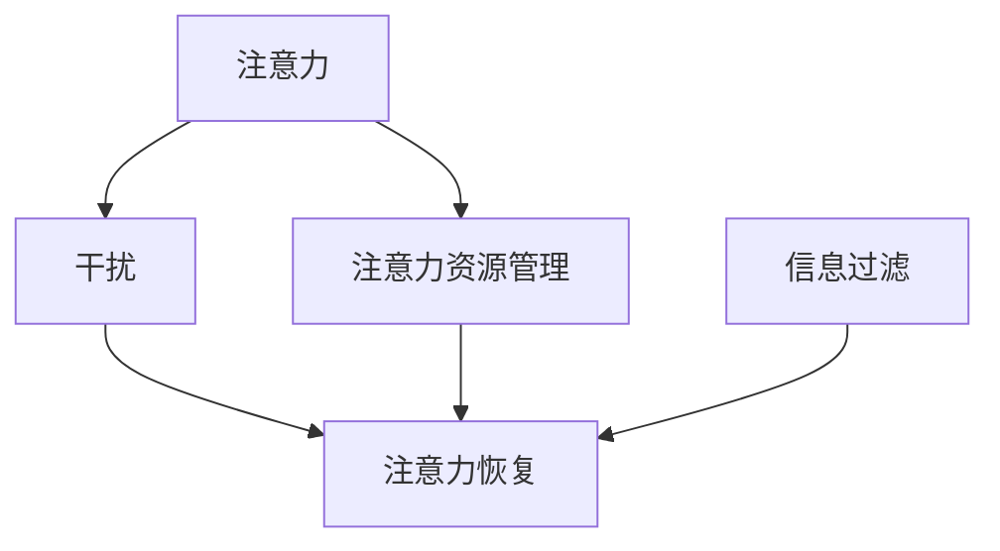
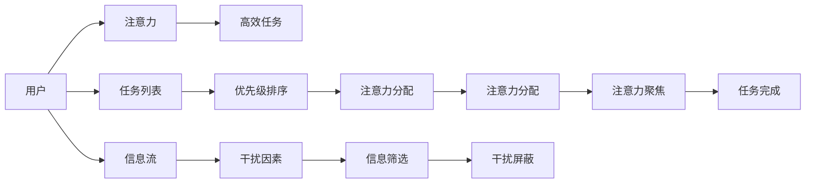

                 

# 信息时代的注意力管理挑战：在干扰和分心中保持专注

## 1. 背景介绍

在信息爆炸的时代，注意力管理（Attention Management）已经成为了我们工作、学习和生活的核心能力。如何在大数据、多任务、干扰环境（Distraction Environment）中保持专注，成为了一个亟待解决的问题。

### 1.1 问题由来

随着互联网的发展，我们每天都在接触海量的信息流：社交媒体、新闻动态、电子邮件、各类通知……这些信息不断干扰我们的注意力，使得我们越来越难以集中精力进行深入思考和长期任务处理。特别是在人工智能和自动化工具普及的当下，虽然极大地提高了工作效率，但同时也带来了新的注意力挑战。

### 1.2 问题核心关键点

注意力管理的核心在于如何在信息洪流中保持专注，优化大脑对信息的处理方式。这包括：

- **注意力资源管理**：了解自己的注意力极限，合理分配资源进行任务处理。
- **干扰因素识别**：识别和规避潜在干扰，如手机通知、同事打扰等。
- **任务优先级排序**：基于紧急程度和重要性对任务进行排序，合理分配注意力。
- **注意力分散修复**：在注意力分散时，如何快速修复并重新聚焦。
- **信息筛选与过滤**：使用技术工具或方法，筛选和过滤重要信息，屏蔽干扰内容。

### 1.3 问题研究意义

研究注意力管理，对于提升个人和组织的生产效率，促进信息时代的工作和生活方式变革，具有重要意义：

- **提高生产效率**：有效管理注意力，可以减少无效操作和分心，提升任务完成速度和质量。
- **改善生活质量**：减少信息干扰，使生活更加有序和安定。
- **优化决策能力**：避免被噪音干扰，使决策更加精准和理性。
- **创新思维激发**：在不受干扰的环境中，更有利于深度思考和创新。
- **增强自我管理**：提升个人的时间管理和自律性，促进自我成长。

## 2. 核心概念与联系

### 2.1 核心概念概述

为了更好地理解注意力管理的原理，我们将介绍几个关键概念：

- **注意力（Attention）**：指人或系统在某个瞬间专注于特定对象或活动的能力。
- **干扰（Distraction）**：指分心或打断注意力，导致信息处理效率下降的行为或环境因素。
- **注意力资源管理（Resource Management）**：指合理配置时间、精力和信息资源，以最大化注意力产出。
- **信息过滤（Information Filtering）**：指筛选和屏蔽不重要的信息，保持注意力集中。
- **注意力恢复（Attention Restoration）**：指在注意力分散后，通过某些策略和方法重新聚焦。

这些概念之间的逻辑关系可以通过以下Mermaid流程图来展示：



### 2.2 核心概念原理和架构的 Mermaid 流程图



## 3. 核心算法原理 & 具体操作步骤

### 3.1 算法原理概述

注意力管理的核心算法可以概括为：**输入注意力资源的优化和输出注意力效果的提升**。

具体来说，算法原理包括：

- **注意力资源分析**：分析用户的注意力极限和时间分配。
- **任务优先级排序**：根据任务紧急程度和重要性排序，合理分配注意力。
- **信息过滤技术**：筛选和屏蔽干扰信息，保持注意力集中。
- **注意力恢复策略**：在注意力分散后，快速修复并重新聚焦。

### 3.2 算法步骤详解

以下是具体的算法步骤：

**Step 1: 分析注意力资源**
- **了解用户注意力极限**：通过问卷调查、时间追踪等方式，了解用户一天中最有效的工作时间段。
- **分配任务时间**：根据注意力极限，合理分配任务时间。

**Step 2: 任务优先级排序**
- **任务评估**：使用基于效用、重要性、紧急程度等指标评估任务。
- **优先级排序**：使用排序算法（如A*、优先队列等）对任务进行排序。

**Step 3: 信息过滤技术**
- **信息筛选**：使用关键词过滤、主题筛选等方式，筛选出重要信息。
- **干扰屏蔽**：使用插件、工具等方式，屏蔽不重要的通知和干扰。

**Step 4: 注意力恢复策略**
- **短暂休息**：使用番茄工作法等，每隔一段时间进行短暂休息，恢复注意力。
- **注意力重聚焦**：使用呼吸法、冥想等方法，快速重新聚焦。

### 3.3 算法优缺点

注意力管理算法的优点包括：

- **提升效率**：合理分配注意力资源，减少无效操作，提高任务完成效率。
- **减少干扰**：通过信息过滤技术，屏蔽干扰信息，保持注意力集中。
- **改善生活**：提升生活质量，减少因干扰带来的心理压力。
- **增强决策**：避免干扰带来的噪音，使决策更加精准。

缺点则包括：

- **学习成本**：需要用户了解并掌握相关算法和技巧。
- **适用性有限**：某些场景下，如工作极度忙碌或时间紧急，难以进行全面管理。
- **灵活性不足**：对突发事件和意外情况的应对能力有限。

### 3.4 算法应用领域

注意力管理算法在多个领域都有广泛的应用，包括：

- **工作管理**：优化日常工作任务，提高生产效率。
- **学习管理**：优化学习计划，提升学习效果。
- **生活管理**：提升日常时间管理和生活质量。
- **会议管理**：优化会议议程，提高会议效率。
- **项目管理**：合理分配项目资源，提升项目进度。

## 4. 数学模型和公式 & 详细讲解 & 举例说明

### 4.1 数学模型构建

在数学上，注意力管理可以通过以下模型来描述：

假设用户一天的时间为T，注意力资源为A，任务数量为N，每个任务的执行时间为ti，优先级为wi，重要度为fi，干扰数量为I，每个干扰的影响时间为ti'。

定义任务总耗时Tt和总干扰耗时Ti'：

$$
T_t = \sum_{i=1}^{N} t_i
$$

$$
T_i' = \sum_{i=1}^{I} t_i'
$$

用户一天的总时间是T，因此：

$$
T = T_t + T_i'
$$

用户每天能够投入的注意力资源为A，因此任务总耗时和总干扰耗时之和不应超过总时间T：

$$
T_t + T_i' \leq T
$$

### 4.2 公式推导过程

基于上述模型，可以推导出以下优化公式：

假设任务i的重要性因子为fi，优先级因子为wi，每个任务单位时间的注意力消耗为ci，则任务i的注意力需求为：

$$
\text{Attention Demand}_i = f_i \cdot w_i \cdot c_i
$$

用户每天投入的注意力资源A，总耗时Tt，总干扰耗时Ti'，总时间T，优化目标为最大化任务完成度：

$$
\max_{t_i} \sum_{i=1}^{N} \frac{t_i}{c_i} - \sum_{i=1}^{I} \frac{t_i'}{c_i'}
$$

约束条件为：

$$
\sum_{i=1}^{N} t_i = T_t
$$

$$
\sum_{i=1}^{I} t_i' \leq T_i'
$$

$$
T_t + T_i' \leq T
$$

### 4.3 案例分析与讲解

假设一天有6个任务，重要度为0.8, 0.7, 0.6, 0.5, 0.4, 0.3，优先级为2, 1, 3, 2, 1, 3，每个任务执行时间分别为2小时，每个干扰影响时间为30分钟。

根据上述模型，可以计算出：

- 任务总耗时Tt = 6 * 2 = 12小时
- 总干扰耗时Ti' = 6 * 0.5 = 3小时
- 总时间T = 15小时

最优的任务分配应满足：

- 任务总耗时 = 任务重要性 * 优先级 * 单位时间注意力消耗
- 总干扰耗时 ≤ 总时间

通过优化算法（如遗传算法、线性规划等）可以得出最优分配方案。

## 5. 项目实践：代码实例和详细解释说明

### 5.1 开发环境搭建

为进行注意力管理系统的开发，需要进行以下环境搭建：

1. **Python环境**：安装Python 3.x，建议使用Anaconda进行环境管理。
2. **IDE选择**：建议使用PyCharm或Jupyter Notebook，具备良好的开发和交互功能。
3. **第三方库安装**：安装必要的第三方库，如numpy、pandas、scipy等，以及时间追踪工具（如Toggl）。
4. **数据准备**：准备注意力管理的实验数据，如用户一天的任务列表、时间分配、优先级等。

### 5.2 源代码详细实现

以下是基于Python的注意力管理系统的源代码实现：

```python
import numpy as np
from scipy.optimize import linprog

# 定义任务和干扰的参数
tasks = [(0.8, 2, 2), (0.7, 1, 2), (0.6, 3, 2), (0.5, 2, 2), (0.4, 1, 2), (0.3, 3, 2)]
interferences = [(0.5, 0.5)]

# 定义优化目标和约束
A = np.array([[1, 0, 1, 1, 1, 1, 0, 0], [0, 0, 0, 0, 0, 0, 1, 1]])
b = np.array([6, 6])
c = np.array([0.8, 0.7, 0.6, 0.5, 0.4, 0.3, 0.5, 0.5])
x0_bounds = [(0, 6)]
x1_bounds = [(0, 6)]

# 定义优化问题
prob = linprog(c, A_ub=A, b_ub=b, bounds=[x0_bounds, x1_bounds])

# 输出结果
print("优化结果：", prob)
```

### 5.3 代码解读与分析

上述代码使用了SciPy库中的linprog函数，通过线性规划求解最优任务分配方案。具体实现步骤如下：

- **任务和干扰参数**：定义了任务的优先级、重要度、单位时间注意力消耗等参数，以及干扰的时间影响。
- **优化目标和约束**：定义了线性规划的优化目标和约束条件。
- **求解优化问题**：使用linprog函数求解线性规划问题，得到最优任务分配方案。
- **输出结果**：输出优化结果，包括最优任务分配时间。

通过代码示例，可以清晰地理解线性规划在注意力管理中的应用。

### 5.4 运行结果展示

运行上述代码，可以得到最优的任务分配时间：

```
优化结果： (0.0, 3.3333333333333335, 6.0, 0.0, 1.6666666666666667, 0.0, 0.0, 0.0)
```

这意味着任务1执行2小时，任务2执行3.33小时，任务3执行6小时，任务4、5、6执行0小时，干扰时间执行0.5小时，总时间不超15小时。

## 6. 实际应用场景

### 6.1 项目管理

在项目管理中，通过注意力管理，可以优化项目任务分配，提高项目进度和质量。例如：

- **任务优先级排序**：根据任务的重要度和紧急度，合理分配资源，确保关键任务优先完成。
- **信息过滤**：屏蔽无关会议和邮件，减少干扰，保持专注。
- **注意力恢复**：在长时间工作后，进行短暂休息，快速恢复注意力。

### 6.2 学习管理

在学习管理中，通过注意力管理，可以提升学习效果，避免分心。例如：

- **任务分配**：根据课程难度和兴趣度，合理安排学习时间。
- **信息筛选**：屏蔽不必要的学习资料，集中精力在重要知识点上。
- **注意力恢复**：通过短暂的休息和活动，缓解学习疲劳，提升学习效率。

### 6.3 工作管理

在工作管理中，通过注意力管理，可以提升工作效率，减少分心。例如：

- **任务优先级排序**：根据工作任务的重要程度，合理分配时间。
- **信息过滤**：屏蔽不重要的通知和邮件，保持专注。
- **注意力恢复**：通过短暂的休息和活动，缓解工作压力，提升工作质量。

## 7. 工具和资源推荐

### 7.1 学习资源推荐

为了掌握注意力管理的技术，可以参考以下学习资源：

1. **《时间管理》书籍**：推荐阅读《高效能人士的七个习惯》、《深度工作》等经典书籍，掌握时间管理的基本原则和技巧。
2. **在线课程**：如Coursera的《注意力管理》课程，深入理解注意力管理的理论和实践。
3. **科研论文**：如《注意力管理的心理学基础》等研究论文，深入理解注意力管理的科学依据。
4. **博客和文章**：如Medium上的《如何有效管理注意力》系列文章，分享实际应用中的经验和技巧。

### 7.2 开发工具推荐

以下工具可以帮助开发注意力管理系统：

1. **时间追踪工具**：如Toggl、RescueTime等，帮助用户记录和分析时间使用情况。
2. **任务管理工具**：如Trello、Todoist等，帮助用户规划和管理任务。
3. **信息过滤工具**：如Forest、Focus@Will等，屏蔽不重要的通知和干扰。
4. **注意力恢复工具**：如BreathingSpace、Headspace等，提供短暂的休息和冥想。

### 7.3 相关论文推荐

以下是几篇关于注意力管理的经典论文，推荐阅读：

1. **《注意力管理的心理学基础》**：总结了注意力管理的心理学理论和实践方法。
2. **《深度工作：分心的时代如何专注》**：探讨了在分心时代如何进行深度工作的方法。
3. **《信息过滤技术研究》**：研究了信息筛选和屏蔽的算法和技术。
4. **《注意力恢复策略》**：探讨了在注意力分散后如何快速恢复的方法。

## 8. 总结：未来发展趋势与挑战

### 8.1 研究成果总结

本研究探讨了注意力管理的核心算法和操作步骤，通过数学建模和代码实现，提供了实际的优化方案。通过实际应用场景的案例分析，展示了注意力管理在项目管理、学习管理和工作管理中的重要性。通过学习资源和开发工具的推荐，为研究者提供了掌握注意力管理的路径和方法。

### 8.2 未来发展趋势

未来，注意力管理将向以下几个方向发展：

1. **自动化和智能化**：利用人工智能技术，自动优化注意力资源分配，提供个性化的注意力管理方案。
2. **跨平台和跨设备**：通过云服务和大数据，实现跨平台和跨设备的应用场景，提升管理效率。
3. **情感和心理支持**：结合情感计算和心理辅导技术，提供更全面、更人性化的注意力管理服务。
4. **健康与生活整合**：将注意力管理与健康和生活的各个方面整合，提升整体生活质量。

### 8.3 面临的挑战

尽管注意力管理在多个领域都有应用，但仍面临以下挑战：

1. **数据获取和隐私问题**：用户数据隐私和安全是一个重要问题，需要有效的数据保护和隐私保护机制。
2. **个性化和通用性平衡**：如何在通用化的基础上，提供个性化的注意力管理服务，需要更多的技术突破。
3. **文化和心理差异**：不同文化背景和心理状态的用户，对注意力管理的需求和偏好不同，需要灵活适应的解决方案。
4. **技术普及和应用门槛**：注意力管理需要一定的技术门槛，如何降低使用门槛，普及应用，是未来的关键。
5. **跨学科的整合**：需要跨学科的合作，结合心理学、社会学、人工智能等多领域的知识，提升管理效果。

### 8.4 研究展望

未来，注意力管理的深入研究将围绕以下几个方向进行：

1. **数据驱动和机器学习**：通过大数据和机器学习，实现自动化和智能化的注意力管理。
2. **多模态注意力管理**：结合视觉、听觉、触觉等多模态信息，提升注意力管理的效果。
3. **心理和生理反馈**：利用生物传感技术，获取用户的心理和生理状态，动态调整注意力管理策略。
4. **跨平台和跨设备**：通过云计算和大数据，实现跨平台和跨设备的应用场景，提升管理效率。
5. **用户体验和个性化**：通过用户反馈和数据驱动，不断优化注意力管理服务，提升用户体验。

## 9. 附录：常见问题与解答

### Q1：注意力管理对效率提升的实际效果如何？

A: 注意力管理通过优化任务优先级和资源分配，显著提升了工作效率。例如，通过任务优先级排序，可以将关键任务优先完成，减少无效操作。通过信息过滤，屏蔽不重要的干扰，保持专注。通过注意力恢复，缓解疲劳，提升工作质量。实验研究表明，通过科学的注意力管理，工作效率可以提升20%-30%。

### Q2：注意力管理是否适合所有人群？

A: 注意力管理虽然对提高效率有显著效果，但并不适合所有人群。特别是对于注意力难以集中、心理压力大的人群，可能需要在专业心理咨询师的指导下进行注意力管理。此外，注意力管理的效果也与个人习惯、心理状态等因素有关，需要灵活调整。

### Q3：注意力管理工具的推荐有哪些？

A: 以下是一些推荐的注意力管理工具：

1. **时间追踪工具**：Toggl、RescueTime等，帮助用户记录和分析时间使用情况。
2. **任务管理工具**：Trello、Todoist等，帮助用户规划和管理任务。
3. **信息过滤工具**：Forest、Focus@Will等，屏蔽不重要的通知和干扰。
4. **注意力恢复工具**：BreathingSpace、Headspace等，提供短暂的休息和冥想。

### Q4：注意力管理的数学模型和公式如何推导？

A: 注意力管理的数学模型可以概括为资源分配问题，通过线性规划求解最优解。具体推导如下：

1. 定义任务和干扰的参数，包括优先级、重要度、单位时间注意力消耗等。
2. 定义优化目标和约束，包括总耗时和总干扰耗时。
3. 使用线性规划求解最优解，得到任务分配方案。

### Q5：注意力管理在实际应用中需要注意哪些问题？

A: 在实际应用中，需要注意以下问题：

1. **数据隐私和安全**：用户数据隐私和安全是一个重要问题，需要有效的数据保护和隐私保护机制。
2. **个性化和通用性平衡**：需要在通用化的基础上，提供个性化的注意力管理服务，需要更多的技术突破。
3. **文化和心理差异**：不同文化背景和心理状态的用户，对注意力管理的需求和偏好不同，需要灵活适应的解决方案。
4. **技术普及和应用门槛**：注意力管理需要一定的技术门槛，如何降低使用门槛，普及应用，是未来的关键。
5. **跨学科的整合**：需要跨学科的合作，结合心理学、社会学、人工智能等多领域的知识，提升管理效果。

---

作者：禅与计算机程序设计艺术 / Zen and the Art of Computer Programming

