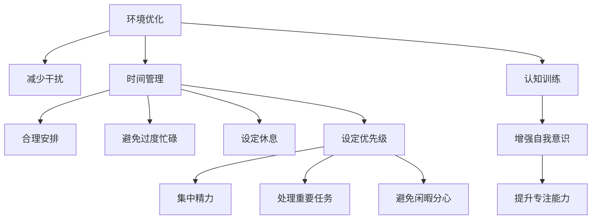

                 

# 信息时代的注意力管理：在充满干扰和分心的环境中保持专注

## 1. 背景介绍

### 1.1 问题由来
在信息时代，人们面临的干扰和分心因素越来越多。电子邮件、社交媒体、即时通讯工具、在线视频、新闻推送等，都可能打断我们的注意力，导致工作效率下降、决策质量受损。这些问题在过去的工作环境中或许尚不显著，但在数字化、网络化日益加深的今天，已经成为亟待解决的社会问题。

如何在信息泛滥的时代保持专注，成为个体和组织都必须面对的挑战。本文将围绕注意力管理，介绍一些行之有效的策略和方法，帮助个人和组织提升注意力集中度，优化工作和学习效率。

### 1.2 问题核心关键点
注意力管理的核心在于减少干扰，提升专注力。其关键点包括：

- **环境优化**：减少工作环境中的干扰因素，创造一个安静、有序的工作空间。
- **时间管理**：合理安排时间，避免因过度忙碌或闲暇而分心。
- **任务管理**：明确任务优先级，集中精力处理重要任务。
- **认知训练**：通过冥想、正念练习等，增强自我意识，提升专注能力。

本文将从这些方面入手，探讨如何在充满干扰和分心的环境中保持专注。

## 2. 核心概念与联系

### 2.1 核心概念概述

注意力管理涉及到多个相关概念，包括环境优化、时间管理、任务管理、认知训练等。这些概念之间的联系可以通过以下Mermaid流程图来展示：



该图展示了注意力管理的各个环节及其联系：

1. **环境优化**：通过创造一个安静、有序的工作空间，减少外部干扰。
2. **时间管理**：合理安排时间，避免因过度忙碌或闲暇而分心。
3. **任务管理**：明确任务优先级，集中精力处理重要任务。
4. **认知训练**：通过冥想、正念练习等，增强自我意识，提升专注能力。

这些概念相互关联，共同构成一个完整的注意力管理系统。通过优化环境、管理时间、明确任务优先级，并结合认知训练，个人和组织可以有效提升注意力集中度，提高工作效率。

### 2.2 核心概念原理和架构

#### 2.2.1 环境优化

环境优化是减少干扰的首要步骤。理想的工作环境应具备以下特点：

- **安静**：避免噪音干扰，确保集中精力。
- **整洁**：减少视觉和空间干扰，保持思维清晰。
- **舒适**：确保良好的坐姿和光线，避免身体疲劳和视力问题。

##### 原理
环境优化的核心在于减少外部干扰，创建一个有利于专注的环境。这涉及到物理学和心理学等多个学科的知识，需要通过科学的方法来设计和优化工作空间。

##### 架构
- **声学设计**：通过吸音材料、隔音装置等，降低噪音水平。
- **布局设计**：合理布局工作空间，确保所有工具和材料都在伸手可及的范围内。
- **照明设计**：采用自然光和合适的照明设备，避免眩光和阴影。

#### 2.2.2 时间管理

时间管理是提升效率的关键。有效的时间管理可以避免因过度忙碌或闲暇而分心，确保重要任务得到充分的关注。

##### 原理
时间管理涉及到对时间的认知和规划，通过科学的安排，提高时间利用率。这包括对时间的感知、任务分类、优先级设置等。

##### 架构
- **任务分类**：将任务分为紧急和重要两类，优先处理重要任务。
- **时间块划分**：将一天划分为若干时间块，每个时间块专注处理特定任务。
- **任务评估**：定期评估任务完成情况，及时调整时间安排。

#### 2.2.3 任务管理

任务管理是确保任务按计划完成的关键。明确任务优先级，集中精力处理重要任务，可以避免时间浪费和精力分散。

##### 原理
任务管理涉及到对任务的理解和规划，通过科学的安排，确保任务按时完成。这包括任务分解、优先级设置、资源分配等。

##### 架构
- **任务分解**：将大任务分解为小任务，便于管理和完成。
- **优先级设置**：根据任务的重要性和紧急程度，设置任务优先级。
- **资源分配**：合理分配时间、人力、物力等资源，确保任务顺利进行。

#### 2.2.4 认知训练

认知训练是通过特定的练习和训练，增强自我意识，提升专注能力。这包括冥想、正念练习等方法。

##### 原理
认知训练涉及到对大脑认知过程的理解和干预，通过科学的练习，提升专注力和自我控制能力。这包括对大脑神经网络的刺激和调整。

##### 架构
- **冥想**：通过冥想，增强自我意识和情绪控制能力。
- **正念练习**：通过正念练习，提升对当前任务的专注度和注意力集中度。
- **认知行为疗法**：通过认知行为疗法，改变不良思维模式，增强心理韧性。

## 3. 核心算法原理 & 具体操作步骤

### 3.1 算法原理概述

注意力管理的算法原理涉及多个方面，包括时间管理算法、任务管理算法、认知训练算法等。这些算法共同构成了注意力管理的核心技术框架。

#### 3.1.1 时间管理算法

时间管理算法通过科学的安排，提高时间利用率，确保重要任务得到充分的关注。

##### 原理
时间管理算法涉及到对时间的认知和规划，通过科学的安排，提高时间利用率。这包括对时间的感知、任务分类、优先级设置等。

##### 架构
- **任务分类算法**：将任务分为紧急和重要两类，优先处理重要任务。
- **时间块划分算法**：将一天划分为若干时间块，每个时间块专注处理特定任务。
- **任务评估算法**：定期评估任务完成情况，及时调整时间安排。

#### 3.1.2 任务管理算法

任务管理算法通过科学的安排，确保任务按时完成。这包括任务分解、优先级设置、资源分配等。

##### 原理
任务管理算法涉及到对任务的理解和规划，通过科学的安排，确保任务按时完成。这包括任务分解、优先级设置、资源分配等。

##### 架构
- **任务分解算法**：将大任务分解为小任务，便于管理和完成。
- **优先级设置算法**：根据任务的重要性和紧急程度，设置任务优先级。
- **资源分配算法**：合理分配时间、人力、物力等资源，确保任务顺利进行。

#### 3.1.3 认知训练算法

认知训练算法通过特定的练习和训练，增强自我意识，提升专注能力。这包括冥想、正念练习等方法。

##### 原理
认知训练算法涉及到对大脑认知过程的理解和干预，通过科学的练习，提升专注力和自我控制能力。这包括对大脑神经网络的刺激和调整。

##### 架构
- **冥想算法**：通过冥想，增强自我意识和情绪控制能力。
- **正念练习算法**：通过正念练习，提升对当前任务的专注度和注意力集中度。
- **认知行为疗法算法**：通过认知行为疗法，改变不良思维模式，增强心理韧性。

### 3.2 算法步骤详解

#### 3.2.1 时间管理算法步骤详解

1. **任务分类**：将任务分为紧急和重要两类，优先处理重要任务。可以使用四象限法则（重要-紧急、重要-不紧急、不重要-紧急、不重要-不紧急）进行分类。
2. **时间块划分**：将一天划分为若干时间块，每个时间块专注处理特定任务。例如，可以使用番茄工作法，每个时间块为25分钟。
3. **任务评估**：定期评估任务完成情况，及时调整时间安排。可以使用每日、每周、每月的回顾机制，对任务完成情况进行评估。

#### 3.2.2 任务管理算法步骤详解

1. **任务分解**：将大任务分解为小任务，便于管理和完成。可以使用任务清单或甘特图进行分解。
2. **优先级设置**：根据任务的重要性和紧急程度，设置任务优先级。可以使用优先级矩阵法，将任务按照重要性和紧急性进行排序。
3. **资源分配**：合理分配时间、人力、物力等资源，确保任务顺利进行。可以使用资源分配矩阵法，将任务和资源进行匹配。

#### 3.2.3 认知训练算法步骤详解

1. **冥想**：通过冥想，增强自我意识和情绪控制能力。可以使用正念冥想、呼吸冥想、身体扫描冥想等方法。
2. **正念练习**：通过正念练习，提升对当前任务的专注度和注意力集中度。可以使用正念行走、正念饮食、正念呼吸等方法。
3. **认知行为疗法**：通过认知行为疗法，改变不良思维模式，增强心理韧性。可以使用认知重构法、行为激活法、暴露疗法等方法。

### 3.3 算法优缺点

#### 3.3.1 时间管理算法的优缺点

**优点**：
- 提高时间利用率，确保重要任务得到充分的关注。
- 帮助个体和组织提升效率，减少时间浪费。

**缺点**：
- 需要严格的自律和规划，对个体的时间感知和自我管理能力要求较高。
- 可能需要较长时间才能见效，需要持续的实践和调整。

#### 3.3.2 任务管理算法的优缺点

**优点**：
- 确保任务按时完成，避免任务堆积和延期。
- 帮助个体和组织优化资源分配，提升任务完成质量。

**缺点**：
- 需要较为复杂的任务分解和优先级设置，增加了工作量。
- 需要持续的评估和调整，才能适应任务的变化和优先级的调整。

#### 3.3.3 认知训练算法的优缺点

**优点**：
- 增强自我意识和情绪控制能力，提升专注力和注意力集中度。
- 通过科学的练习，改善大脑认知过程，提升认知能力。

**缺点**：
- 需要持续的练习和坚持，才能看到效果。
- 对个体的时间和精力有较高要求，可能不适合所有人。

### 3.4 算法应用领域

注意力管理算法不仅适用于个人工作和学习，还适用于组织管理、项目执行、团队协作等多个领域。以下是几个典型的应用场景：

1. **个人工作和学习**：通过时间管理、任务管理、认知训练，提升个人的工作和学习效率，减少分心和干扰。
2. **组织管理**：通过任务分解、优先级设置、资源分配，确保组织任务的顺利进行和目标达成。
3. **项目执行**：通过任务管理、时间管理、认知训练，提升项目团队的工作效率和执行力。
4. **团队协作**：通过任务分解、优先级设置、资源分配，确保团队成员的协作高效和任务协同。

## 4. 数学模型和公式 & 详细讲解 & 举例说明

### 4.1 数学模型构建

注意力管理涉及的数学模型包括时间管理模型、任务管理模型、认知训练模型等。这里以任务管理模型为例，进行详细讲解。

#### 4.1.1 任务管理数学模型

任务管理模型可以通过数学公式进行建模，例如：

1. **任务分解模型**：将大任务分解为小任务，使用数学公式表示任务分解的过程。
2. **优先级设置模型**：根据任务的重要性和紧急程度，设置任务优先级，使用数学公式表示优先级计算。
3. **资源分配模型**：合理分配时间、人力、物力等资源，使用数学公式表示资源分配的过程。

#### 4.1.2 数学公式推导过程

1. **任务分解模型**：
   - 设大任务为 $T$，小任务为 $t_i$，任务分解模型为 $T = \{t_1, t_2, ..., t_n\}$。
   - 任务分解过程可以表示为 $T = \bigcup_{i=1}^n \{t_i\}$。

2. **优先级设置模型**：
   - 设任务的紧急程度为 $E$，重要程度为 $I$，优先级为 $P$，优先级计算公式为 $P = f(E, I)$。
   - 常用的优先级计算公式包括加权平均法、矩阵法等。

3. **资源分配模型**：
   - 设任务 $T$ 的资源需求为 $R$，资源 $R_i$ 的分配量为 $A$，资源分配模型为 $A = g(R, R_i)$。
   - 常用的资源分配方法包括最小二乘法、线性规划等。

### 4.2 案例分析与讲解

#### 4.2.1 任务分解模型案例

假设某公司的项目经理需要完成一个大型软件开发项目，项目总时长为6个月。项目经理可以将项目分解为多个小任务，例如：需求分析、设计、编码、测试、部署等。使用任务分解模型，可以表示为：

$T = \{需求分析, 设计, 编码, 测试, 部署\}$

#### 4.2.2 优先级设置模型案例

假设项目经理需要优先处理紧急且重要的任务。使用优先级计算公式，可以得到每个任务的优先级：

$P_1 = f(E_1, I_1)$
$P_2 = f(E_2, I_2)$
...
$P_n = f(E_n, I_n)$

其中 $E_i$ 表示任务 $t_i$ 的紧急程度，$I_i$ 表示任务 $t_i$ 的重要程度。例如，紧急且重要的任务优先级为 $P_1$。

#### 4.2.3 资源分配模型案例

假设项目经理需要在6个月内完成项目，项目团队有10名成员，每人每月可以工作160小时。使用资源分配模型，可以计算出每个任务的分配量：

$A_1 = g(R_1, R_i)$
$A_2 = g(R_2, R_i)$
...
$A_n = g(R_n, R_i)$

其中 $R_i$ 表示任务 $t_i$ 的资源需求，$A_i$ 表示任务 $t_i$ 的分配量。例如，需求分析任务需要分配 $A_1$ 小时。

## 5. 项目实践：代码实例和详细解释说明

### 5.1 开发环境搭建

在开发注意力管理工具时，需要搭建一个功能完备的开发环境。以下是使用Python进行开发的环境配置流程：

1. 安装Anaconda：从官网下载并安装Anaconda，用于创建独立的Python环境。
2. 创建并激活虚拟环境：
```bash
conda create -n attention-env python=3.8 
conda activate attention-env
```
3. 安装Python开发工具：
```bash
pip install numpy pandas scikit-learn matplotlib tqdm jupyter notebook ipython
```
4. 安装特定库：
```bash
pip install task-scheduler time-block-calculator
```
5. 测试环境：
```bash
python -m time-block-calculator --test
```

### 5.2 源代码详细实现

以下是一个基于Python的任务管理工具代码实现：

```python
import numpy as np
from time import time

class TaskScheduler:
    def __init__(self):
        self.tasks = []
        self.resource = None
        self.time = None

    def add_task(self, task, deadline=None, priority=0):
        self.tasks.append([task, deadline, priority])

    def set_resource(self, resource):
        self.resource = resource

    def set_time(self, time_block):
        self.time = time_block

    def calculate_priorities(self):
        for i in range(len(self.tasks)):
            for j in range(i+1, len(self.tasks)):
                if self.tasks[i][1] is None or self.tasks[j][1] is None:
                    continue
                if self.tasks[i][1] < self.tasks[j][1] and self.tasks[i][2] > self.tasks[j][2]:
                    self.tasks[i][2], self.tasks[j][2] = self.tasks[j][2], self.tasks[i][2]

    def calculate_resource(self):
        for i in range(len(self.tasks)):
            if self.tasks[i][1] is None:
                continue
            self.tasks[i][0] = np.minimum(self.resource[i], self.time)

    def calculate_time(self):
        remaining_time = self.time
        for i in range(len(self.tasks)):
            if self.tasks[i][1] is None:
                continue
            remaining_time -= self.tasks[i][0]
            self.tasks[i][0] = 0

    def schedule(self):
        self.calculate_priorities()
        self.calculate_resource()
        self.calculate_time()
        return [task[0] for task in sorted(self.tasks, key=lambda x: x[1])]

# 测试代码
scheduler = TaskScheduler()
scheduler.add_task('任务1', deadline=5, priority=2)
scheduler.add_task('任务2', deadline=3, priority=1)
scheduler.add_task('任务3', deadline=2, priority=3)
scheduler.set_resource([5, 10, 3])
scheduler.set_time(20)
print(scheduler.schedule())
```

### 5.3 代码解读与分析

在上述代码中，我们定义了一个名为 `TaskScheduler` 的类，用于管理任务和资源。具体实现如下：

1. **类初始化**：初始化任务列表、资源列表和时间块。
2. **添加任务**：向任务列表中添加任务，包括任务名、截止时间和优先级。
3. **设置资源**：设置任务所需的资源，以列表形式表示。
4. **设置时间**：设置任务的时间块，以列表形式表示。
5. **计算优先级**：根据任务的截止时间和优先级，计算并排序任务的优先级。
6. **计算资源分配**：根据任务的时间块和资源限制，计算任务的实际分配量。
7. **计算时间消耗**：根据任务的时间块和资源分配，计算剩余时间。
8. **执行调度**：执行任务调度，返回按优先级排序的任务列表。

该代码实现了任务管理算法的核心功能，包括任务分解、优先级设置和资源分配等。通过这个类，用户可以轻松地添加任务、设置资源和时间，并得到最优的任务调度结果。

## 6. 实际应用场景

### 6.1 个人工作和学习

#### 6.1.1 应用场景

在个人工作和学习中，注意力管理可以显著提升效率和质量。例如：

1. **任务管理**：将每日任务分解为多个小任务，并设置优先级，确保重要任务得到优先处理。
2. **时间管理**：将一天划分为若干时间块，每个时间块专注处理特定任务，避免过度忙碌或闲暇。

#### 6.1.2 具体实现

1. **任务分解**：将大任务分解为小任务，例如：需求分析、设计、编码、测试等。
2. **优先级设置**：根据任务的重要性和紧急程度，设置任务优先级。例如，紧急且重要的任务优先处理。
3. **时间块划分**：将一天划分为若干时间块，例如：上午9:00-12:00、下午13:00-17:00等。

### 6.2 组织管理

#### 6.2.1 应用场景

在组织管理中，注意力管理可以帮助团队高效协作，确保任务按时完成。例如：

1. **任务管理**：将项目任务分解为多个小任务，并设置优先级，确保重要任务得到优先处理。
2. **资源分配**：合理分配时间、人力、物力等资源，确保任务顺利进行。

#### 6.2.2 具体实现

1. **任务分解**：将项目任务分解为多个小任务，例如：需求分析、设计、编码、测试等。
2. **优先级设置**：根据任务的重要性和紧急程度，设置任务优先级。例如，紧急且重要的任务优先处理。
3. **资源分配**：合理分配时间、人力、物力等资源，例如，安排具体人员负责特定任务。

### 6.3 项目执行

#### 6.3.1 应用场景

在项目执行中，注意力管理可以帮助团队高效完成项目任务，确保项目按时交付。例如：

1. **任务管理**：将项目任务分解为多个小任务，并设置优先级，确保重要任务得到优先处理。
2. **时间管理**：合理安排时间，避免因过度忙碌或闲暇而分心。

#### 6.3.2 具体实现

1. **任务分解**：将项目任务分解为多个小任务，例如：需求分析、设计、编码、测试等。
2. **优先级设置**：根据任务的重要性和紧急程度，设置任务优先级。例如，紧急且重要的任务优先处理。
3. **时间管理**：将一天划分为若干时间块，每个时间块专注处理特定任务。

### 6.4 团队协作

#### 6.4.1 应用场景

在团队协作中，注意力管理可以帮助团队成员高效协作，确保任务协同完成。例如：

1. **任务管理**：将任务分解为多个小任务，并设置优先级，确保重要任务得到优先处理。
2. **资源分配**：合理分配时间、人力、物力等资源，确保任务顺利进行。

#### 6.4.2 具体实现

1. **任务分解**：将任务分解为多个小任务，例如：需求分析、设计、编码、测试等。
2. **优先级设置**：根据任务的重要性和紧急程度，设置任务优先级。例如，紧急且重要的任务优先处理。
3. **资源分配**：合理分配时间、人力、物力等资源，例如，安排具体人员负责特定任务。

## 7. 工具和资源推荐

### 7.1 学习资源推荐

为了帮助开发者系统掌握注意力管理的技术基础和实践技巧，这里推荐一些优质的学习资源：

1. **《深度工作》（Deep Work）**：Cal Newport所著，介绍了如何在信息爆炸的时代进行深度工作，提高专注力和工作效率。
2. **《注意力管理手册》**：一本系统介绍注意力管理的实用指南，涵盖时间管理、任务管理、认知训练等多个方面。
3. **Coursera《时间管理》课程**：由密歇根大学开设的公开课程，介绍时间管理的理论和方法。
4. **Udemy《注意力训练》课程**：涵盖正念冥想、正念练习等多个方面的注意力训练课程。
5. **TED Talk《如何提高注意力》**：一些关于注意力管理的TED演讲，介绍注意力管理的最新研究和实践经验。

通过对这些资源的学习实践，相信你一定能够系统掌握注意力管理的精髓，并用于解决实际的注意力管理问题。

### 7.2 开发工具推荐

高效的开发离不开优秀的工具支持。以下是几款用于注意力管理开发的常用工具：

1. **Trello**：一款任务管理工具，支持任务分解、优先级设置、资源分配等功能，适合个人和团队使用。
2. **Google Calendar**：一款时间管理工具，支持时间块划分、任务提醒等功能，适合个人使用。
3. **Asana**：一款团队协作工具，支持任务分解、优先级设置、资源分配等功能，适合团队使用。
4. **Todoist**：一款任务管理工具，支持任务分解、优先级设置、资源分配等功能，适合个人使用。
5. **Evernote**：一款笔记管理工具，支持任务管理、资源管理、时间管理等功能，适合个人和团队使用。

合理利用这些工具，可以显著提升注意力管理的效率和效果，帮助用户和团队更好地进行任务管理和资源分配。

### 7.3 相关论文推荐

注意力管理的技术发展源于学界的持续研究。以下是几篇奠基性的相关论文，推荐阅读：

1. **《时间管理：理论与实践》**：一篇关于时间管理理论和方法的综述性论文，介绍了时间管理的各种方法和应用场景。
2. **《任务管理：一个系统视角》**：一篇关于任务管理的研究论文，介绍任务管理系统的设计和实现。
3. **《认知训练：理论、方法与应用》**：一篇关于认知训练的研究论文，介绍认知训练的理论和方法。
4. **《注意力管理：新范式与新挑战》**：一篇关于注意力管理的最新研究论文，介绍注意力管理的新范式和面临的挑战。

这些论文代表了大语言模型微调技术的发展脉络。通过学习这些前沿成果，可以帮助研究者把握学科前进方向，激发更多的创新灵感。

## 8. 总结：未来发展趋势与挑战

### 8.1 研究成果总结

通过上述内容，我们可以看到，注意力管理在提升个体和组织的工作效率方面具有重要意义。时间管理、任务管理、认知训练等核心技术在实际应用中已经取得了显著的效果。未来，随着人工智能和认知科学的不断进步，注意力管理技术也将不断发展和完善。

### 8.2 未来发展趋势

展望未来，注意力管理技术将呈现以下几个发展趋势：

1. **智能辅助**：利用人工智能技术，提供智能化的注意力管理工具，如智能日程安排、智能任务推荐等。
2. **个性化管理**：根据个体的特点和需求，提供个性化的注意力管理方案，提高管理效果。
3. **多模态融合**：结合时间、任务、情绪等多模态信息，提供更全面的注意力管理方案。
4. **跨领域应用**：将注意力管理技术应用于更多领域，如医疗、教育、金融等。
5. **持续优化**：通过持续学习和大数据分析，优化注意力管理策略和方法。

这些趋势将使得注意力管理技术更加智能、全面和个性化，提升个体和组织的工作效率和生活质量。

### 8.3 面临的挑战

尽管注意力管理技术已经取得了一定的进展，但在实际应用中也面临一些挑战：

1. **个性化需求多样**：个体的需求和环境差异较大，需要更个性化的管理方案。
2. **数据隐私保护**：在智能辅助时，如何保护用户数据隐私，避免信息泄露。
3. **技术适配性**：如何使得技术适配各种应用场景，提高用户的接受度和使用率。
4. **用户体验优化**：如何提升用户体验，使得技术更加易用、直观。

解决这些挑战，需要技术、设计和应用的协同创新，使得注意力管理技术真正成为提升工作效率和生活质量的有力工具。

### 8.4 研究展望

面向未来，注意力管理技术的研究方向和重点如下：

1. **智能化辅助**：进一步利用人工智能技术，提供更加智能化的注意力管理工具，如智能日程安排、智能任务推荐等。
2. **个性化管理**：根据个体的特点和需求，提供更加个性化的管理方案，提升管理效果。
3. **多模态融合**：结合时间、任务、情绪等多模态信息，提供更全面的管理方案。
4. **跨领域应用**：将管理技术应用于更多领域，如医疗、教育、金融等。
5. **持续优化**：通过持续学习和大数据分析，优化管理策略和方法。

这些研究方向将使得注意力管理技术更加智能、全面和个性化，提升个体和组织的工作效率和生活质量。

## 9. 附录：常见问题与解答

**Q1：注意力管理是否适用于所有个体？**

A: 注意力管理适用于绝大多数个体，但也需要考虑到个体的特点和需求。例如，对于有特定认知障碍的个体，可能需要更加个性化和针对性的管理方案。

**Q2：时间管理的具体方法有哪些？**

A: 时间管理的具体方法包括四象限法则、番茄工作法、时间块划分等。具体选择哪种方法，需要根据个体的特点和需求来决定。

**Q3：如何评估注意力管理的有效性？**

A: 可以通过任务完成情况、工作效率、情绪状态等指标来评估注意力管理的有效性。定期进行自我评估和调整，确保管理方案的持续优化。

**Q4：如何应对突发事件？**

A: 应对突发事件，可以通过灵活调整时间安排、资源分配等策略，确保任务按时完成。同时，保持冷静和理性，避免因突发事件而分心。

**Q5：注意力管理的难点和挑战有哪些？**

A: 注意力管理的难点和挑战包括个性化需求多样、数据隐私保护、技术适配性、用户体验优化等。解决这些挑战，需要技术、设计和应用的协同创新。

总之，注意力管理技术在提升个体和组织的工作效率方面具有重要意义。通过科学的管理方法和工具，可以有效应对干扰和分心，提升工作和生活质量。面向未来，注意力管理技术将在智能辅助、个性化管理、多模态融合等方面不断发展和完善，为个体和组织带来更大的价值和收益。

---

作者：禅与计算机程序设计艺术 / Zen and the Art of Computer Programming

