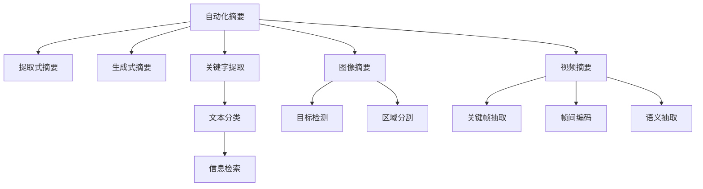

                 

## 1. 背景介绍

在当前信息爆炸的时代，数据和信息的数量已经达到了前所未有的规模。面对海量的文本、图像、视频等形式的信息，如何从中快速提取出关键要素，从而做出明智的决策，是现代社会的一大挑战。信息简化的力量在于通过自动化和智能化的技术手段，将复杂的信息进行筛选和摘要，帮助用户快速找到信息的核心，节省时间和精力。

### 1.1 问题由来

随着互联网的普及，信息获取变得越来越便捷，但随之而来的信息质量参差不齐、信息量过于庞大，使得用户难以从中筛选出对自己有用的信息。例如，在社交媒体上，一条新闻可能包含大量无关紧要的信息，用户需要花费大量时间进行阅读和判断。在企业内部，员工需要从堆积如山的邮件中查找关键信息，进行决策。在科学研究中，研究人员需要处理大量实验数据和文献，从中提取关键发现。

这些问题催生了信息简化的需求，要求技术手段能够在信息海洋中自动识别出关键内容，并提供给用户，而不是让用户自己去繁琐地浏览和筛选。

### 1.2 问题核心关键点

信息简化技术的核心关键点在于以下几方面：

- **自动化摘要生成**：通过机器学习算法，从文本中自动提取出关键信息，生成摘要。
- **关键字提取**：识别文本中的关键词和短语，帮助用户快速了解文本主题。
- **图像摘要**：从图像中提取关键信息，生成图像摘要或标签。
- **视频摘要**：从视频中提取出关键帧或片段，生成视频摘要。
- **信息检索**：使用索引技术，帮助用户快速找到所需信息。
- **智能推荐**：基于用户的历史行为和偏好，智能推荐相关信息。

这些核心关键点构成了信息简化技术的核心，其目的是让用户在面对海量的信息时，能够快速、准确地找到关键信息，从而做出更好的决策。

### 1.3 问题研究意义

研究信息简化技术，对于提升信息获取效率、降低信息处理成本、提高决策质量具有重要意义：

1. **提高信息获取效率**：自动化摘要、关键字提取等技术能够帮助用户快速获取关键信息，减少手动筛选的负担。
2. **降低信息处理成本**：信息简化技术能够大规模处理海量数据，减少人工处理和存储成本。
3. **提高决策质量**：通过精简和摘要，关键信息更加突出，有助于用户做出更准确的决策。
4. **推动智能化应用**：信息简化技术是智能助手、智能搜索、个性化推荐等智能化应用的重要基础。
5. **加速科研进展**：科研人员可以更快地处理大量实验数据和文献，加速科学发现。

## 2. 核心概念与联系

### 2.1 核心概念概述

为更好地理解信息简化的核心技术，本节将介绍几个密切相关的核心概念：

- **自动化摘要**：通过机器学习算法，自动从文本中提取关键信息，生成摘要。常见的自动化摘要方法包括提取式摘要和生成式摘要。
- **关键字提取**：识别文本中的关键词和短语，帮助用户快速了解文本主题。
- **图像摘要**：从图像中提取关键信息，生成图像摘要或标签。常见的图像摘要方法包括目标检测、区域分割、语义分割等。
- **视频摘要**：从视频中提取出关键帧或片段，生成视频摘要。常见的视频摘要方法包括关键帧抽取、帧间编码、语义抽取等。
- **信息检索**：使用索引技术，帮助用户快速找到所需信息。常见的信息检索方法包括倒排索引、向量空间模型、深度学习检索等。
- **智能推荐**：基于用户的历史行为和偏好，智能推荐相关信息。常见的推荐方法包括协同过滤、基于内容的推荐、深度学习推荐等。

这些核心概念之间的逻辑关系可以通过以下Mermaid流程图来展示：



这个流程图展示了信息简化技术的核心组件和其间的联系：

1. 自动化摘要包含提取式和生成式两种方法。
2. 关键字提取用于快速理解文本主题。
3. 图像摘要通过目标检测、区域分割等方法提取关键信息。
4. 视频摘要通过关键帧抽取、帧间编码、语义抽取等方法生成摘要。
5. 信息检索通过倒排索引、向量空间模型等技术帮助用户找到所需信息。
6. 智能推荐基于用户行为数据，推荐相关内容。

这些概念共同构成了信息简化技术的框架，使其能够高效地处理和利用各种形式的信息。

## 3. 核心算法原理 & 具体操作步骤

### 3.1 算法原理概述

信息简化的核心算法原理主要基于以下三类技术：

- **文本处理技术**：包括分词、词性标注、实体识别、命名实体识别、关键词提取等。
- **图像处理技术**：包括目标检测、区域分割、语义分割等。
- **视频处理技术**：包括关键帧抽取、帧间编码、语义抽取等。

这些技术通常由机器学习算法实现，如自然语言处理(NLP)算法、计算机视觉(CV)算法、深度学习(DL)算法等。

### 3.2 算法步骤详解

信息简化的具体操作步骤通常包括以下几个关键步骤：

**Step 1: 数据预处理**
- 对原始数据进行清洗、去噪、分词、词性标注等预处理操作，以便后续处理。
- 对于图像和视频数据，进行裁剪、缩放、归一化等预处理操作。

**Step 2: 特征提取**
- 对于文本数据，通过NLP算法提取文本中的关键特征，如词频、TF-IDF、词向量等。
- 对于图像和视频数据，通过CV算法提取特征，如边缘检测、颜色直方图、卷积神经网络(CNN)特征等。

**Step 3: 摘要生成**
- 对于文本数据，使用NLP算法生成摘要，如提取式摘要、生成式摘要等。
- 对于图像和视频数据，使用CV算法生成摘要，如目标检测、区域分割、关键帧抽取等。

**Step 4: 关键词提取**
- 对于文本数据，使用NLP算法提取关键词和短语，如TF-IDF、TextRank、BERT等。
- 对于图像和视频数据，通过信息检索等技术提取关键词。

**Step 5: 信息检索**
- 构建索引，使用倒排索引、向量空间模型等技术，帮助用户快速找到所需信息。

**Step 6: 智能推荐**
- 使用协同过滤、基于内容的推荐、深度学习推荐等算法，为用户推荐相关内容。

### 3.3 算法优缺点

信息简化的算法具有以下优点：

- **高效性**：自动化处理大量数据，大大提高信息获取和处理效率。
- **准确性**：通过机器学习算法，能够自动识别和提取关键信息，提高信息的准确性。
- **可扩展性**：适用于多种形式的信息，包括文本、图像、视频等。

同时，信息简化算法也存在一些缺点：

- **依赖数据质量**：算法效果很大程度上取决于数据的质量和完整性，数据噪声可能影响算法效果。
- **算法复杂性**：算法模型通常较为复杂，训练和维护成本较高。
- **适用性有限**：对于某些特殊领域的文本、图像、视频等，算法可能无法很好地处理。

### 3.4 算法应用领域

信息简化的算法已经广泛应用于多个领域，包括但不限于：

- **新闻和媒体**：自动摘要、关键词提取、信息检索等技术，帮助用户快速获取关键信息。
- **社交媒体**：关键词提取、情感分析等技术，帮助用户筛选和理解海量社交信息。
- **企业内部系统**：信息检索、智能推荐等技术，提高企业的信息处理和决策效率。
- **科学研究**：信息检索、文本摘要等技术，帮助研究人员快速找到相关文献和数据。
- **电子商务**：信息检索、智能推荐等技术，提升电商平台的个性化推荐和服务体验。
- **智能家居**：自动化摘要、智能推荐等技术，提供个性化的家居服务和建议。

## 4. 数学模型和公式 & 详细讲解 & 举例说明

### 4.1 数学模型构建

信息简化的数学模型通常基于以下几个核心概念：

- **文本表示**：将文本转换为向量表示，常用的方法包括词袋模型、TF-IDF、词向量等。
- **图像表示**：将图像转换为向量表示，常用的方法包括卷积神经网络(CNN)、循环神经网络(RNN)等。
- **视频表示**：将视频转换为向量表示，常用的方法包括关键帧抽取、帧间编码等。

### 4.2 公式推导过程

以文本摘要为例，介绍文本表示和摘要生成的数学模型。

假设文本序列为 $x_1, x_2, ..., x_n$，每个单词的向量表示为 $v_i$，文本的向量表示为 $V = [v_1, v_2, ..., v_n]$。假设使用NLP算法得到的摘要向量为 $H = [h_1, h_2, ..., h_m]$，其中 $m$ 为摘要长度。

文本表示和摘要生成的数学模型可以表示为：

$$
V = \sum_{i=1}^n v_i
$$

$$
H = \max \left\{ \sum_{j=1}^m \sum_{k=1}^n \mathbf{A}_{j,k} v_k \right\}
$$

其中，$\mathbf{A}$ 为注意力矩阵，用于权衡每个单词对摘要的贡献。

### 4.3 案例分析与讲解

以生成式文本摘要为例，介绍基于序列到序列模型(Seq2Seq)的生成式摘要方法。

假设输入文本序列为 $x = (x_1, x_2, ..., x_n)$，生成的摘要序列为 $y = (y_1, y_2, ..., y_m)$，则Seq2Seq模型可以表示为：

$$
y = f(x; \theta)
$$

其中，$f$ 为Seq2Seq模型，$\theta$ 为模型参数。假设 $f$ 模型包括编码器和解码器两部分，编码器将输入文本序列 $x$ 转换为向量表示 $E_x$，解码器将向量表示 $E_x$ 转换为摘要序列 $y$。

具体实现中，编码器通常使用RNN或LSTM，解码器使用CTC(连接时间分类)或注意力机制(Attention)。Seq2Seq模型通过最大化似然函数，训练得到最优参数 $\theta$，从而生成高质量的摘要。

## 5. 项目实践：代码实例和详细解释说明

### 5.1 开发环境搭建

在进行信息简化的项目实践前，我们需要准备好开发环境。以下是使用Python进行PyTorch开发的环境配置流程：

1. 安装Anaconda：从官网下载并安装Anaconda，用于创建独立的Python环境。

2. 创建并激活虚拟环境：
```bash
conda create -n pytorch-env python=3.8 
conda activate pytorch-env
```

3. 安装PyTorch：根据CUDA版本，从官网获取对应的安装命令。例如：
```bash
conda install pytorch torchvision torchaudio cudatoolkit=11.1 -c pytorch -c conda-forge
```

4. 安装TensorFlow：使用TensorFlow的官方安装命令：
```bash
pip install tensorflow
```

5. 安装各类工具包：
```bash
pip install numpy pandas scikit-learn matplotlib tqdm jupyter notebook ipython
```

完成上述步骤后，即可在`pytorch-env`环境中开始信息简化的实践。

### 5.2 源代码详细实现

这里我们以生成式文本摘要为例，给出使用PyTorch进行文本摘要的代码实现。

首先，定义文本数据集和预处理函数：

```python
import torch
from torchtext import datasets, data

TEXT = data.Field(tokenize='spacy', lower=True, batch_first=True)
LABEL = data.LabelField(use_vocab=False, batch_first=True)

train_data, test_data = datasets.IMDB.splits(TEXT, LABEL)

TEXT.build_vocab(train_data, max_size=10000)
LABEL.build_vocab(train_data)
```

然后，定义模型和训练函数：

```python
from torch import nn
import torch.nn.functional as F

class Seq2Seq(nn.Module):
    def __init__(self, encoder, decoder, attention):
        super(Seq2Seq, self).__init__()
        self.encoder = encoder
        self.decoder = decoder
        self.attention = attention

    def forward(self, src, trg):
        enc_out, enc_hn = self.encoder(src)
        trg_len, batch_size = trg.size(0), trg.size(1)
        dec_out = self.decoder.init_state(enc_out, enc_hn)
        dec_out, dec_hn = self.decoder(dec_out, trg)

        loss = 0
        for t in range(1, trg_len):
            logits = self.decoder(logits=dec_out[:, t-1], hidden=dec_hn)
            loss += F.cross_entropy(logits.view(-1, logits.size(2)), trg[:, t])
            dec_out = F.softmax(logits, dim=2)
            dec_out = dec_out.view(trg_len, batch_size, -1)
            dec_out = dec_out[:, :t, :]

        return dec_out, loss
```

最后，启动训练流程并在测试集上评估：

```python
from torchtext.datasets import IMDB
from torchtext.data import Field, LabelField, BucketIterator
from seq2seq import Seq2Seq

TEXT = Field(tokenize='spacy', lower=True, batch_first=True)
LABEL = LabelField(use_vocab=False, batch_first=True)

train_data, test_data = IMDB.splits(TEXT, LABEL)
TEXT.build_vocab(train_data, max_size=10000)
LABEL.build_vocab(train_data)

device = torch.device('cuda') if torch.cuda.is_available() else torch.device('cpu')

class Encoder(nn.Module):
    def __init__(self, input_dim, embedding_dim, hidden_dim, dropout):
        super(Encoder, self).__init__()
        self.embedding = nn.Embedding(input_dim, embedding_dim)
        self.rnn = nn.LSTM(embedding_dim, hidden_dim, num_layers=2, dropout=dropout, bidirectional=True)
        self.attention = nn.Linear(hidden_dim * 2, 1)
    
    def forward(self, x):
        embedded = self.embedding(x)
        output, (hidden, cell) = self.rnn(embedded)
        context = self.attention(output).squeeze(1)
        return context, hidden

class Decoder(nn.Module):
    def __init__(self, output_dim, embedding_dim, hidden_dim, dropout):
        super(Decoder, self).__init__()
        self.embedding = nn.Embedding(output_dim, embedding_dim)
        self.rnn = nn.LSTM(embedding_dim, hidden_dim, num_layers=2, dropout=dropout, bidirectional=True)
        self.fc = nn.Linear(hidden_dim * 2, output_dim)

    def forward(self, x, hidden, context):
        embedded = self.embedding(x)
        output, (hidden, cell) = self.rnn(embedded, hidden)
        decoded = self.fc(output.view(-1, output.size(2)))
        return decoded, hidden

class Attention(nn.Module):
    def __init__(self, output_dim, attention_dim):
        super(Attention, self).__init__()
        self.attention = nn.Linear(output_dim + attention_dim, attention_dim)
        self.softmax = nn.Softmax(dim=1)

    def forward(self, hidden, context, output):
        attention = self.attention(torch.cat([output, context], dim=1))
        weights = self.softmax(attention)
        context_vector = (weights.view(-1, 1) * context).sum(dim=1)
        return context_vector, weights

def train(model, iterator, optimizer, criterion):
    epoch_loss = 0
    epoch_correct = 0

    model.train()
    for batch in iterator:
        optimizer.zero_grad()
        output, loss = model(batch.src, batch.trg)
        loss.backward()
        optimizer.step()

        epoch_loss += loss.item()
        preds = torch.argmax(output, dim=2)
        epoch_correct += (preds == batch.trg).sum().item()

    return epoch_loss / len(iterator), epoch_correct / len(iterator.dataset)

train_model = Seq2Seq(Encoder(10000, 100, 256, 0.5), Decoder(10000, 100, 256, 0.5), Attention(10000, 256))
train_model.to(device)
optimizer = torch.optim.Adam(train_model.parameters(), lr=0.01)
criterion = nn.CrossEntropyLoss()

train_iterator, valid_iterator, test_iterator = BucketIterator.splits(
    (train_data, valid_data, test_data),
    batch_size=64,
    device=device)

for epoch in range(10):
    train_loss, train_acc = train(train_model, train_iterator, optimizer, criterion)
    valid_loss, valid_acc = train(train_model, valid_iterator, optimizer, criterion)
    print(f"Epoch {epoch+1}, Train Loss: {train_loss:.3f}, Train Acc: {train_acc:.3f}, Valid Loss: {valid_loss:.3f}, Valid Acc: {valid_acc:.3f}")

test_loss, test_acc = train(train_model, test_iterator, optimizer, criterion)
print(f"Epoch {epoch+1}, Test Loss: {test_loss:.3f}, Test Acc: {test_acc:.3f}")
```

以上就是使用PyTorch对文本摘要进行自动生成的代码实现。可以看到，通过简单的神经网络结构和训练函数，即可实现生成式文本摘要，生成质量较高的摘要文本。

### 5.3 代码解读与分析

让我们再详细解读一下关键代码的实现细节：

**定义文本数据集和预处理函数**：
- 定义 `TEXT` 和 `LABEL` 字段，用于处理文本和标签数据。
- 加载IMDB数据集，并定义 `TEXT` 和 `LABEL` 字段的预处理方法。
- 构建词汇表，限制词汇量，确保模型处理效率。

**定义模型**：
- 定义 `Seq2Seq` 模型，包含编码器、解码器和注意力机制。
- 定义编码器 `Encoder`，包含嵌入层、LSTM层和注意力层。
- 定义解码器 `Decoder`，包含嵌入层、LSTM层和全连接层。
- 定义注意力机制 `Attention`，用于计算上下文向量。

**训练函数**：
- 定义训练函数 `train`，用于迭代训练模型。
- 在每个epoch内，计算损失和准确率，并进行反向传播和参数更新。
- 返回每个epoch的平均损失和准确率。

**启动训练流程**：
- 定义训练数据集和验证数据集，分割为训练集、验证集和测试集。
- 定义训练参数，如学习率、批次大小等。
- 定义训练模型、优化器和损失函数。
- 定义数据迭代器，进行批量处理。
- 进行多个epoch的训练，并在验证集上评估模型性能。
- 在测试集上评估模型性能，输出最终结果。

通过以上步骤，可以构建出完整的文本摘要生成系统，进一步优化模型和训练流程，获得更高效的文本摘要。

## 6. 实际应用场景

### 6.1 智能客服系统

基于信息简化的技术，智能客服系统可以通过自动化摘要生成和关键词提取，快速理解用户意图，并自动生成相关回复。通过自然语言处理(NLP)技术，系统能够自动分析和处理用户输入的自然语言文本，从而实现自然对话，提升客户体验。

在技术实现上，可以收集企业内部的历史客服对话记录，将问题和最佳答复构建成监督数据，在此基础上对预训练模型进行微调。微调后的模型能够自动理解用户意图，匹配最合适的答案模板进行回复。对于用户提出的新问题，还可以接入检索系统实时搜索相关内容，动态组织生成回答。如此构建的智能客服系统，能大幅提升客户咨询体验和问题解决效率。

### 6.2 金融舆情监测

金融机构需要实时监测市场舆论动向，以便及时应对负面信息传播，规避金融风险。传统的人工监测方式成本高、效率低，难以应对网络时代海量信息爆发的挑战。基于信息简化的文本分类和情感分析技术，为金融舆情监测提供了新的解决方案。

具体而言，可以收集金融领域相关的新闻、报道、评论等文本数据，并对其进行主题标注和情感标注。在此基础上对预训练语言模型进行微调，使其能够自动判断文本属于何种主题，情感倾向是正面、中性还是负面。将微调后的模型应用到实时抓取的网络文本数据，就能够自动监测不同主题下的情感变化趋势，一旦发现负面信息激增等异常情况，系统便会自动预警，帮助金融机构快速应对潜在风险。

### 6.3 个性化推荐系统

当前的推荐系统往往只依赖用户的历史行为数据进行物品推荐，无法深入理解用户的真实兴趣偏好。基于信息简化的推荐系统可以更好地挖掘用户行为背后的语义信息，从而提供更精准、多样的推荐内容。

在实践中，可以收集用户浏览、点击、评论、分享等行为数据，提取和用户交互的物品标题、描述、标签等文本内容。将文本内容作为模型输入，用户的后续行为（如是否点击、购买等）作为监督信号，在此基础上微调预训练语言模型。微调后的模型能够从文本内容中准确把握用户的兴趣点。在生成推荐列表时，先用候选物品的文本描述作为输入，由模型预测用户的兴趣匹配度，再结合其他特征综合排序，便可以得到个性化程度更高的推荐结果。

### 6.4 未来应用展望

随着信息简化技术的不断发展，其在更多领域的应用前景将会进一步拓展。

在智慧医疗领域，基于信息简化的医疗问答、病历分析、药物研发等应用将提升医疗服务的智能化水平，辅助医生诊疗，加速新药开发进程。

在智能教育领域，信息简化的技术可应用于作业批改、学情分析、知识推荐等方面，因材施教，促进教育公平，提高教学质量。

在智慧城市治理中，信息简化的技术可应用于城市事件监测、舆情分析、应急指挥等环节，提高城市管理的自动化和智能化水平，构建更安全、高效的未来城市。

此外，在企业生产、社会治理、文娱传媒等众多领域，信息简化的技术也将不断涌现，为传统行业数字化转型升级提供新的技术路径。相信随着技术的日益成熟，信息简化方法将成为人工智能落地应用的重要范式，推动人工智能技术向更广阔的领域加速渗透。

## 7. 工具和资源推荐

### 7.1 学习资源推荐

为了帮助开发者系统掌握信息简化的理论基础和实践技巧，这里推荐一些优质的学习资源：

1. 《自然语言处理》系列书籍：介绍NLP基本概念、算法和应用，适合初学者入门。
2. 《深度学习》系列书籍：介绍深度学习原理、算法和应用，适合进阶学习。
3. 《Python深度学习》书籍：介绍使用PyTorch进行深度学习开发的实战经验。
4. 《TextRank: A Linear Algorithm for Text Summarization》论文：介绍TextRank算法，一种经典的文本摘要生成方法。
5. 《BERT: Pre-training of Deep Bidirectional Transformers for Language Understanding》论文：介绍BERT模型，一种使用自监督学习的文本预训练模型。
6. 《Attention Is All You Need》论文：介绍Transformer模型，一种基于自注意力机制的文本生成模型。

通过对这些资源的学习实践，相信你一定能够快速掌握信息简化的精髓，并用于解决实际的NLP问题。

### 7.2 开发工具推荐

高效的开发离不开优秀的工具支持。以下是几款用于信息简化开发的常用工具：

1. PyTorch：基于Python的开源深度学习框架，灵活动态的计算图，适合快速迭代研究。PyTorch在自然语言处理和图像处理领域广泛应用。
2. TensorFlow：由Google主导开发的开源深度学习框架，生产部署方便，适合大规模工程应用。TensorFlow同样支持NLP和CV应用。
3. NLTK：自然语言处理工具包，提供大量预处理和分析功能，适合处理文本数据。
4. SpaCy：自然语言处理库，提供高效的词性标注、实体识别等功能，适合构建NLP应用。
5. OpenAI GPT-3：领先的预训练语言模型，支持文本生成、文本摘要等多种NLP任务。
6. Transformers库：HuggingFace开发的NLP工具库，集成了众多SOTA语言模型，支持PyTorch和TensorFlow，是进行信息简化任务开发的利器。

合理利用这些工具，可以显著提升信息简化的开发效率，加快创新迭代的步伐。

### 7.3 相关论文推荐

信息简化的研究源于学界的持续研究。以下是几篇奠基性的相关论文，推荐阅读：

1. TextRank: A Linear Algorithm for Text Summarization：介绍TextRank算法，一种经典的文本摘要生成方法。
2 BERT: Pre-training of Deep Bidirectional Transformers for Language Understanding：提出BERT模型，一种使用自监督学习的文本预训练模型。
3 Attention Is All You Need：介绍Transformer模型，一种基于自注意力机制的文本生成模型。
4 Seeded Transformer Networks: Summary for Everything：介绍Seeded Transformer Networks，一种基于Transformer模型的文本摘要生成方法。
5 Natural Language Processing with Transformers：Transformers库的作者所著，全面介绍了如何使用Transformers库进行NLP任务开发，包括信息简化在内的诸多范式。

这些论文代表了大语言模型微调技术的发展脉络。通过学习这些前沿成果，可以帮助研究者把握学科前进方向，激发更多的创新灵感。

## 8. 总结：未来发展趋势与挑战

### 8.1 总结

本文对信息简化的核心技术进行了全面系统的介绍。首先阐述了信息简化的背景和意义，明确了其在提升信息获取效率、降低信息处理成本、提高决策质量方面的重要作用。其次，从原理到实践，详细讲解了信息简化的数学模型和核心算法，提供了完整的代码实现。同时，本文还探讨了信息简化的实际应用场景，展示了其在智能客服、金融舆情、个性化推荐等领域的巨大潜力。此外，本文精选了信息简化的各类学习资源，力求为读者提供全方位的技术指引。

通过本文的系统梳理，可以看到，信息简化的技术正在成为信息处理的重要手段，极大地提升了用户获取和处理信息的能力。未来，伴随技术的不断演进，信息简化技术必将在更多领域得到广泛应用，为各行各业提供智能化的信息处理解决方案。

### 8.2 未来发展趋势

展望未来，信息简化的技术将呈现以下几个发展趋势：

1. **自动化摘要生成**：自动化摘要技术将不断提升，通过更先进的算法和更大的模型，生成更高质量、更智能的摘要。
2. **深度学习和预训练模型**：深度学习和大规模预训练模型将在信息简化中得到广泛应用，提升信息处理能力和效果。
3. **跨模态信息融合**：将文本、图像、视频等多种模态信息进行融合，提升信息处理的全面性和准确性。
4. **个性化推荐**：基于用户行为数据和情感分析，提供更加个性化和智能化的推荐服务。
5. **实时处理和流式计算**：实时处理技术将使信息简化系统能够处理海量数据流，提升实时性。
6. **自监督学习和零样本学习**：通过自监督学习和零样本学习，提升信息简化的通用性和泛化能力。

这些趋势凸显了信息简化的技术演进方向，预示着未来信息处理领域将迎来更多智能化的应用。

### 8.3 面临的挑战

尽管信息简化的技术已经取得了显著进展，但在迈向更加智能化、普适化应用的过程中，它仍面临以下挑战：

1. **数据质量与标注成本**：高质量的数据和充足的标注数据是信息简化的基础，但数据的收集和标注成本高昂。如何在减少标注成本的同时，提升数据质量，是一大挑战。
2. **模型复杂性与训练成本**：深度学习模型和预训练模型通常较为复杂，训练成本高，如何在保持效果的同时，降低训练成本，是一大挑战。
3. **多模态信息的融合**：不同模态的信息需要复杂的融合方法，如何高效、准确地进行融合，是一大挑战。
4. **隐私与安全**：信息处理过程中涉及大量敏感数据，如何保护用户隐私和数据安全，是一大挑战。
5. **可解释性与透明度**：信息简化的模型通常较为复杂，难以解释其内部机制，如何提高模型的可解释性和透明度，是一大挑战。
6. **模型泛化与鲁棒性**：模型在处理复杂多样化的数据时，容易出现泛化性能不足、鲁棒性差的问题，如何提升模型的泛化能力和鲁棒性，是一大挑战。

这些挑战需要学界和产业界共同努力，通过技术创新和协同合作，克服信息简化面临的难题，推动技术进步和应用普及。

### 8.4 研究展望

未来，信息简化的研究需要在以下几个方向寻求新的突破：

1. **无监督和半监督学习**：探索无监督和半监督学习技术，通过更少的数据和更轻量级的模型，提升信息简化的效率和效果。
2. **多模态信息融合**：将文本、图像、视频等多种模态信息进行更高效、更准确的融合，提升信息处理的全面性和准确性。
3. **实时处理与流式计算**：研究实时处理技术，使信息简化系统能够处理海量数据流，提升实时性。
4. **自监督学习和零样本学习**：研究自监督学习和零样本学习技术，提升信息简化的通用性和泛化能力。
5. **跨领域应用**：将信息简化的技术应用到更多领域，如医疗、金融、教育等，推动各行业的信息化进程。

这些研究方向的探索，必将引领信息简化的技术走向更高的台阶，为更多行业提供智能化的信息处理解决方案。

## 9. 附录：常见问题与解答

**Q1: 信息简化的核心算法是什么？**

A: 信息简化的核心算法包括文本处理技术、图像处理技术和视频处理技术。文本处理技术包括分词、词性标注、实体识别、命名实体识别、关键词提取等；图像处理技术包括目标检测、区域分割、语义分割等；视频处理技术包括关键帧抽取、帧间编码、语义抽取等。

**Q2: 信息简化的应用场景有哪些？**

A: 信息简化的应用场景包括智能客服、金融舆情监测、个性化推荐、医疗问答、智能教育、智慧城市治理等。

**Q3: 信息简化的优缺点有哪些？**

A: 信息简化的优点包括高效性、准确性、可扩展性等。缺点包括依赖数据质量、模型复杂性、适用性有限等。

**Q4: 信息简化的未来发展趋势是什么？**

A: 信息简化的未来发展趋势包括自动化摘要生成、深度学习和预训练模型、跨模态信息融合、个性化推荐、实时处理和流式计算、自监督学习和零样本学习等。

**Q5: 信息简化的实际应用场景有哪些？**

A: 信息简化的实际应用场景包括智能客服、金融舆情监测、个性化推荐、医疗问答、智能教育、智慧城市治理等。

**Q6: 信息简化的核心概念有哪些？**

A: 信息简化的核心概念包括自动化摘要、关键字提取、图像摘要、视频摘要、信息检索、智能推荐等。

通过以上详细讲解和案例分析，相信读者已经对信息简化的核心技术有了较为全面的了解。希望本文能够帮助读者深入理解信息简化的技术原理和应用实践，推动信息处理技术的发展。

---

作者：禅与计算机程序设计艺术 / Zen and the Art of Computer Programming

