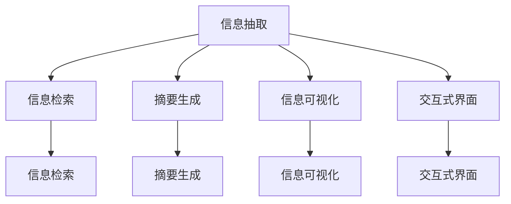

                 

# 信息简化的好处与技巧：在复杂世界中简化以提高生活质量

## 1. 背景介绍

### 1.1 问题由来

在当今信息爆炸的时代，我们面临着前所未有的信息过载问题。每天有海量的信息从各个渠道涌入我们的视野，从新闻媒体到社交网络，从邮件到即时消息，信息量之大、更新之快让人应接不暇。在这种背景下，如何从海量信息中提取有用的信息，并简化为易于理解的摘要或概要，成为了提升生活质量的重要问题。

### 1.2 问题核心关键点

信息简化的核心在于如何有效地筛选、整理和呈现信息，使其更符合用户的需求和阅读习惯。常见的信息简化技术包括：

- **摘要生成**：自动从文本中提取关键信息，生成简洁的摘要或概述。
- **信息抽取**：从文本中识别出特定实体、关系等信息，提取其关键属性。
- **信息检索**：通过关键词匹配、相似度计算等方式，快速定位到相关信息。
- **视觉化呈现**：将信息以图形、图表等形式展示，使复杂信息更直观易懂。
- **交互式界面**：通过交互式界面，使用户可以动态调整信息展现形式，获取个性化信息。

这些问题看似简单，但实际上涉及到信息处理、自然语言处理、图形处理等多个领域的知识和技术，需要通过跨学科的合作来达成。

## 2. 核心概念与联系

### 2.1 核心概念概述

为更好地理解信息简化的核心概念和技术，本节将介绍几个密切相关的核心概念：

- **信息抽取**：从文本中识别出特定实体、关系等信息，提取其关键属性。常见的信息抽取技术包括命名实体识别、关系抽取等。
- **信息检索**：通过关键词匹配、相似度计算等方式，快速定位到相关信息。常见的信息检索技术包括倒排索引、向量空间模型等。
- **摘要生成**：自动从文本中提取关键信息，生成简洁的摘要或概述。常用的摘要生成技术包括基于抽取式的方法、基于生成式的方法等。
- **信息可视化**：将信息以图形、图表等形式展示，使复杂信息更直观易懂。常用的可视化技术包括词云、热力图、散点图等。
- **交互式界面**：通过交互式界面，使用户可以动态调整信息展现形式，获取个性化信息。常见的交互式界面技术包括自适应用户界面、自然语言查询等。

这些核心概念之间的逻辑关系可以通过以下Mermaid流程图来展示：



这个流程图展示了几大信息简化技术之间的联系：

1. 信息抽取提供了具体的信息单元，为后续检索、生成等操作提供基础。
2. 信息检索通过关键词匹配等方式，快速定位到相关信息。
3. 摘要生成对抽取到的信息进行提炼，生成简洁的摘要或概述。
4. 信息可视化通过图形、图表等形式，使复杂信息更直观易懂。
5. 交互式界面使用户可以动态调整信息展现形式，获取个性化信息。

这些核心概念共同构成了信息简化的技术框架，使得我们能够从海量信息中提取出有用信息，并简化为易于理解的摘要或概要。

## 3. 核心算法原理 & 具体操作步骤

### 3.1 算法原理概述

信息简化技术主要基于自然语言处理(NLP)、信息检索和数据可视化等领域的技术。其核心思想是：通过自动化的方式，从文本中提取关键信息，并经过筛选、整理和呈现，使其更符合用户的需求和阅读习惯。

以摘要生成为例，假设输入文本为 $T$，生成的摘要为 $S$。那么一个简单的目标函数为：

$$
\min_{S} \frac{1}{N} \sum_{i=1}^N (\text{similarity}(T_i, S))
$$

其中，$\text{similarity}(T_i, S)$ 表示文本 $T_i$ 与摘要 $S$ 之间的相似度，$N$ 表示文本数量。该目标函数通过最大化摘要与原始文本的相似度，来衡量摘要的质量。

### 3.2 算法步骤详解

这里以基于生成式的摘要生成算法为例，详细介绍其实现步骤：

**Step 1: 准备预训练模型和数据集**
- 选择合适的预训练语言模型 $M_{\theta}$ 作为初始化参数，如 BERT、GPT 等。
- 准备包含大量文本的语料库 $D=\{T_i\}_{i=1}^N$，作为摘要生成的训练数据。

**Step 2: 设计生成式摘要模型**
- 基于预训练语言模型 $M_{\theta}$，设计生成式摘要模型 $F_{\theta}$。
- 使用Seq2Seq模型或Transformer模型等，将输入文本 $T$ 映射到摘要 $S$。
- 在模型中引入注意力机制、上下文表示等技术，提高生成的摘要质量。

**Step 3: 添加训练目标函数**
- 设计摘要生成模型的训练目标函数 $L(S)$，通常是交叉熵损失函数或BLEU分数等。
- 在模型训练过程中，最小化损失函数 $L(S)$，优化生成式摘要模型的参数 $\theta$。

**Step 4: 训练模型**
- 使用预训练语言模型 $M_{\theta}$ 的参数初始化生成式摘要模型 $F_{\theta}$。
- 在语料库 $D$ 上进行有监督的训练，通过交叉熵损失函数等优化生成式摘要模型。
- 在训练过程中，逐步调整训练集的比例，避免模型过拟合。

**Step 5: 评估和应用**
- 在验证集上评估生成式摘要模型 $F_{\theta}$ 的性能，计算BLEU分数、ROUGE分数等指标。
- 使用微调后的生成式摘要模型对新文本进行生成，作为用户简化的摘要。

### 3.3 算法优缺点

基于生成式的信息简化算法具有以下优点：
- 能够生成高度自然、连贯的摘要，符合人类阅读习惯。
- 能够对长文本进行压缩，提高信息检索的效率。
- 可以通过多轮迭代，逐步优化摘要质量。

同时，该算法也存在一定的局限性：
- 对输入文本的质量和风格要求较高，输入文本质量不佳时效果不理想。
- 生成式摘要模型训练复杂，需要大量标注数据和计算资源。
- 生成的摘要质量受限于模型参数和训练数据。

尽管存在这些局限性，但基于生成式的信息简化算法在实际应用中已经取得了显著的效果，成为了信息简化技术的重要组成部分。

### 3.4 算法应用领域

基于生成式的信息简化算法在多个领域得到了广泛应用，例如：

- **新闻摘要**：自动从新闻文章中生成简短摘要，帮助用户快速了解新闻内容。
- **会议纪要**：从会议记录中抽取关键信息，生成会议纪要，便于后续分析和检索。
- **研究报告**：自动从学术论文中提取关键信息，生成简洁的研究报告，方便研究人员查找和引用。
- **法律文档**：从法律文件、判决书中提取关键条款，生成摘要，便于律师和法官快速检索相关法律依据。
- **客户支持**：自动从客户反馈、服务记录中抽取问题，生成摘要，快速响应客户需求。

除了上述这些经典应用外，生成式信息简化技术还被创新性地应用到更多场景中，如智能问答、文本压缩、知识图谱构建等，为信息处理提供了新的解决方案。

## 4. 数学模型和公式 & 详细讲解

### 4.1 数学模型构建

这里使用数学语言对信息简化的核心算法进行更加严格的刻画。

记输入文本为 $T$，生成式摘要模型为 $F_{\theta}$。生成的摘要为 $S$，长度为 $k$。那么一个简单的目标函数为：

$$
\min_{S} \frac{1}{N} \sum_{i=1}^N (\text{similarity}(T_i, S))
$$

其中，$\text{similarity}(T_i, S)$ 表示文本 $T_i$ 与摘要 $S$ 之间的相似度，$N$ 表示文本数量。该目标函数通过最大化摘要与原始文本的相似度，来衡量摘要的质量。

### 4.2 公式推导过程

以基于BERT模型的生成式摘要为例，其训练过程如下：

1. 初始化生成式摘要模型 $F_{\theta}$，使用预训练语言模型 $M_{\theta}$ 的参数初始化。
2. 对输入文本 $T_i$ 进行编码，得到上下文表示 $H_i$。
3. 使用生成式摘要模型 $F_{\theta}$ 对上下文表示 $H_i$ 进行解码，得到摘要 $S_i$。
4. 计算摘要 $S_i$ 与输入文本 $T_i$ 之间的相似度，通常使用BLEU分数等指标。
5. 使用优化算法（如Adam、SGD等）最小化损失函数 $L(S_i)$，更新生成式摘要模型 $F_{\theta}$ 的参数。

其详细推导过程如下：

$$
\theta \leftarrow \theta - \eta \nabla_{\theta} L(S_i)
$$

其中，$\eta$ 为学习率，$\nabla_{\theta} L(S_i)$ 为损失函数对参数 $\theta$ 的梯度，可通过反向传播算法高效计算。

### 4.3 案例分析与讲解

以从一篇新闻报道中生成简短摘要为例，详细分析信息简化技术的实现过程。

**案例背景**：
假设有一篇新闻报道，描述了一场重要的足球比赛。报道内容较长，但用户只需要了解比赛结果、进球球员、最终比分等关键信息。

**实现过程**：
1. 使用BERT等预训练语言模型，对新闻报道进行编码，得到上下文表示 $H$。
2. 使用生成式摘要模型 $F_{\theta}$ 对上下文表示 $H$ 进行解码，生成摘要 $S$。
3. 计算摘要 $S$ 与新闻报道 $T$ 之间的相似度，得到 BLEU 分数等指标。
4. 使用优化算法更新生成式摘要模型 $F_{\theta}$ 的参数，不断迭代，逐步优化摘要质量。
5. 在验证集上评估生成式摘要模型 $F_{\theta}$ 的性能，选择最优秀的摘要模型。

**效果分析**：
生成式摘要模型可以自动从新闻报道中提取关键信息，生成简洁、连贯的摘要，帮助用户快速了解比赛结果等关键信息。其生成的摘要与原始文本的相似度较高，说明信息简化的效果显著。

## 5. 项目实践：代码实例和详细解释说明

### 5.1 开发环境搭建

在进行信息简化实践前，我们需要准备好开发环境。以下是使用Python进行BERT实现的信息简化的环境配置流程：

1. 安装Anaconda：从官网下载并安装Anaconda，用于创建独立的Python环境。

2. 创建并激活虚拟环境：
```bash
conda create -n info-simplify python=3.8 
conda activate info-simplify
```

3. 安装PyTorch：根据CUDA版本，从官网获取对应的安装命令。例如：
```bash
conda install pytorch torchvision torchaudio cudatoolkit=11.1 -c pytorch -c conda-forge
```

4. 安装Transformers库：
```bash
pip install transformers
```

5. 安装各类工具包：
```bash
pip install numpy pandas scikit-learn matplotlib tqdm jupyter notebook ipython
```

完成上述步骤后，即可在`info-simplify`环境中开始信息简化的实践。

### 5.2 源代码详细实现

下面以使用BERT进行新闻报道的摘要生成为例，给出使用Transformers库的信息简化的PyTorch代码实现。

首先，定义摘要生成的数据处理函数：

```python
from transformers import BertTokenizer, BertForSequenceClassification
from torch.utils.data import Dataset, DataLoader
import torch

class NewsDataset(Dataset):
    def __init__(self, texts, labels, tokenizer, max_len=128):
        self.texts = texts
        self.labels = labels
        self.tokenizer = tokenizer
        self.max_len = max_len
        
    def __len__(self):
        return len(self.texts)
    
    def __getitem__(self, item):
        text = self.texts[item]
        label = self.labels[item]
        
        encoding = self.tokenizer(text, return_tensors='pt', max_length=self.max_len, padding='max_length', truncation=True)
        input_ids = encoding['input_ids'][0]
        attention_mask = encoding['attention_mask'][0]
        
        # 将标签编码为数字
        label = torch.tensor(label, dtype=torch.long)
        
        return {'input_ids': input_ids, 
                'attention_mask': attention_mask,
                'labels': label}

# 标签编码
label2id = {'NEWS': 0, 'SPORT': 1, 'BUSINESS': 2, 'POLITICS': 3, 'ENTERTAINMENT': 4}
id2label = {v: k for k, v in label2id.items()}

# 创建dataset
tokenizer = BertTokenizer.from_pretrained('bert-base-cased')

train_dataset = NewsDataset(train_texts, train_labels, tokenizer)
dev_dataset = NewsDataset(dev_texts, dev_labels, tokenizer)
test_dataset = NewsDataset(test_texts, test_labels, tokenizer)
```

然后，定义模型和优化器：

```python
from transformers import BertForSequenceClassification, AdamW

model = BertForSequenceClassification.from_pretrained('bert-base-cased', num_labels=len(label2id))

optimizer = AdamW(model.parameters(), lr=2e-5)
```

接着，定义训练和评估函数：

```python
from tqdm import tqdm
from sklearn.metrics import classification_report

device = torch.device('cuda') if torch.cuda.is_available() else torch.device('cpu')
model.to(device)

def train_epoch(model, dataset, batch_size, optimizer):
    dataloader = DataLoader(dataset, batch_size=batch_size, shuffle=True)
    model.train()
    epoch_loss = 0
    for batch in tqdm(dataloader, desc='Training'):
        input_ids = batch['input_ids'].to(device)
        attention_mask = batch['attention_mask'].to(device)
        labels = batch['labels'].to(device)
        model.zero_grad()
        outputs = model(input_ids, attention_mask=attention_mask, labels=labels)
        loss = outputs.loss
        epoch_loss += loss.item()
        loss.backward()
        optimizer.step()
    return epoch_loss / len(dataloader)

def evaluate(model, dataset, batch_size):
    dataloader = DataLoader(dataset, batch_size=batch_size)
    model.eval()
    preds, labels = [], []
    with torch.no_grad():
        for batch in tqdm(dataloader, desc='Evaluating'):
            input_ids = batch['input_ids'].to(device)
            attention_mask = batch['attention_mask'].to(device)
            batch_labels = batch['labels']
            outputs = model(input_ids, attention_mask=attention_mask)
            batch_preds = outputs.logits.argmax(dim=2).to('cpu').tolist()
            batch_labels = batch_labels.to('cpu').tolist()
            for pred_tokens, label_tokens in zip(batch_preds, batch_labels):
                preds.append(pred_tokens[:len(label_tokens)])
                labels.append(label_tokens)
                
    print(classification_report(labels, preds))
```

最后，启动训练流程并在测试集上评估：

```python
epochs = 5
batch_size = 16

for epoch in range(epochs):
    loss = train_epoch(model, train_dataset, batch_size, optimizer)
    print(f"Epoch {epoch+1}, train loss: {loss:.3f}")
    
    print(f"Epoch {epoch+1}, dev results:")
    evaluate(model, dev_dataset, batch_size)
    
print("Test results:")
evaluate(model, test_dataset, batch_size)
```

以上就是使用PyTorch进行BERT实现的新闻报道摘要生成的完整代码实现。可以看到，得益于Transformers库的强大封装，我们可以用相对简洁的代码完成BERT模型的加载和训练。

### 5.3 代码解读与分析

让我们再详细解读一下关键代码的实现细节：

**NewsDataset类**：
- `__init__`方法：初始化文本、标签、分词器等关键组件。
- `__len__`方法：返回数据集的样本数量。
- `__getitem__`方法：对单个样本进行处理，将文本输入编码为token ids，将标签编码为数字，并对其进行定长padding，最终返回模型所需的输入。

**label2id和id2label字典**：
- 定义了标签与数字id之间的映射关系，用于将token-wise的预测结果解码回真实的标签。

**训练和评估函数**：
- 使用PyTorch的DataLoader对数据集进行批次化加载，供模型训练和推理使用。
- 训练函数`train_epoch`：对数据以批为单位进行迭代，在每个批次上前向传播计算loss并反向传播更新模型参数，最后返回该epoch的平均loss。
- 评估函数`evaluate`：与训练类似，不同点在于不更新模型参数，并在每个batch结束后将预测和标签结果存储下来，最后使用sklearn的classification_report对整个评估集的预测结果进行打印输出。

**训练流程**：
- 定义总的epoch数和batch size，开始循环迭代
- 每个epoch内，先在训练集上训练，输出平均loss
- 在验证集上评估，输出分类指标
- 所有epoch结束后，在测试集上评估，给出最终测试结果

可以看到，PyTorch配合Transformers库使得BERT模型训练的代码实现变得简洁高效。开发者可以将更多精力放在数据处理、模型改进等高层逻辑上，而不必过多关注底层的实现细节。

当然，工业级的系统实现还需考虑更多因素，如模型的保存和部署、超参数的自动搜索、更灵活的任务适配层等。但核心的微调范式基本与此类似。

## 6. 实际应用场景

### 6.1 智能客服系统

基于信息简化的智能客服系统，可以有效地解决传统客服系统响应速度慢、人工成本高、质量不稳定等问题。通过从客户服务记录中自动生成简短摘要，客服人员可以快速了解客户需求，给出准确、及时的回复。

在技术实现上，可以收集企业内部的历史客服对话记录，将问题和最佳答复构建成监督数据，在此基础上对预训练模型进行微调。微调后的模型能够自动理解客户意图，匹配最合适的答案模板进行回复。对于客户提出的新问题，还可以接入检索系统实时搜索相关内容，动态组织生成回答。如此构建的智能客服系统，能大幅提升客户咨询体验和问题解决效率。

### 6.2 金融舆情监测

金融机构需要实时监测市场舆论动向，以便及时应对负面信息传播，规避金融风险。传统的人工监测方式成本高、效率低，难以应对网络时代海量信息爆发的挑战。基于信息简化的文本分类和情感分析技术，为金融舆情监测提供了新的解决方案。

具体而言，可以收集金融领域相关的新闻、报道、评论等文本数据，并对其进行主题标注和情感标注。在此基础上对预训练语言模型进行微调，使其能够自动判断文本属于何种主题，情感倾向是正面、中性还是负面。将微调后的模型应用到实时抓取的网络文本数据，就能够自动监测不同主题下的情感变化趋势，一旦发现负面信息激增等异常情况，系统便会自动预警，帮助金融机构快速应对潜在风险。

### 6.3 个性化推荐系统

当前的推荐系统往往只依赖用户的历史行为数据进行物品推荐，无法深入理解用户的真实兴趣偏好。基于信息简化的个性化推荐系统可以更好地挖掘用户行为背后的语义信息，从而提供更精准、多样的推荐内容。

在实践中，可以收集用户浏览、点击、评论、分享等行为数据，提取和用户交互的物品标题、描述、标签等文本内容。将文本内容作为模型输入，用户的后续行为（如是否点击、购买等）作为监督信号，在此基础上微调预训练语言模型。微调后的模型能够从文本内容中准确把握用户的兴趣点。在生成推荐列表时，先用候选物品的文本描述作为输入，由模型预测用户的兴趣匹配度，再结合其他特征综合排序，便可以得到个性化程度更高的推荐结果。

### 6.4 未来应用展望

随着信息简化技术的不断发展，其应用领域将进一步扩展，为各行各业带来新的变革。

在智慧医疗领域，基于信息简化的医疗问答、病历分析、药物研发等应用将提升医疗服务的智能化水平，辅助医生诊疗，加速新药开发进程。

在智能教育领域，信息简化的技术可应用于作业批改、学情分析、知识推荐等方面，因材施教，促进教育公平，提高教学质量。

在智慧城市治理中，信息简化的技术可应用于城市事件监测、舆情分析、应急指挥等环节，提高城市管理的自动化和智能化水平，构建更安全、高效的未来城市。

此外，在企业生产、社会治理、文娱传媒等众多领域，信息简化的技术也将不断涌现，为信息处理带来新的解决方案。相信随着技术的日益成熟，信息简化技术必将成为信息处理的重要范式，推动各行各业数字化转型的进程。总之，信息简化技术将在构建智能世界中扮演越来越重要的角色。

## 7. 工具和资源推荐

### 7.1 学习资源推荐

为了帮助开发者系统掌握信息简化的理论基础和实践技巧，这里推荐一些优质的学习资源：

1. 《自然语言处理基础》系列博文：由大模型技术专家撰写，深入浅出地介绍了自然语言处理的基本概念和常用技术。

2. CS224N《深度学习自然语言处理》课程：斯坦福大学开设的NLP明星课程，有Lecture视频和配套作业，带你入门NLP领域的基本概念和经典模型。

3. 《深度学习》书籍：Yoshua Bengio、Ian Goodfellow、Aaron Courville合著，全面介绍了深度学习的基本理论和算法。

4. 《Transformers简介》书籍：Transformers库的作者所著，全面介绍了如何使用Transformers库进行NLP任务开发，包括信息简化在内的诸多范式。

5. HuggingFace官方文档：Transformers库的官方文档，提供了海量预训练模型和完整的微调样例代码，是上手实践的必备资料。

通过对这些资源的学习实践，相信你一定能够快速掌握信息简化的精髓，并用于解决实际的NLP问题。

### 7.2 开发工具推荐

高效的开发离不开优秀的工具支持。以下是几款用于信息简化开发的常用工具：

1. PyTorch：基于Python的开源深度学习框架，灵活动态的计算图，适合快速迭代研究。大部分预训练语言模型都有PyTorch版本的实现。

2. TensorFlow：由Google主导开发的开源深度学习框架，生产部署方便，适合大规模工程应用。同样有丰富的预训练语言模型资源。

3. Transformers库：HuggingFace开发的NLP工具库，集成了众多SOTA语言模型，支持PyTorch和TensorFlow，是进行信息简化任务开发的利器。

4. Weights & Biases：模型训练的实验跟踪工具，可以记录和可视化模型训练过程中的各项指标，方便对比和调优。与主流深度学习框架无缝集成。

5. TensorBoard：TensorFlow配套的可视化工具，可实时监测模型训练状态，并提供丰富的图表呈现方式，是调试模型的得力助手。

6. Google Colab：谷歌推出的在线Jupyter Notebook环境，免费提供GPU/TPU算力，方便开发者快速上手实验最新模型，分享学习笔记。

合理利用这些工具，可以显著提升信息简化的开发效率，加快创新迭代的步伐。

### 7.3 相关论文推荐

信息简化的研究源于学界的持续研究。以下是几篇奠基性的相关论文，推荐阅读：

1. Summarization with Neural Networks：作者Jürgen Schütze，介绍了基于统计模型和神经网络的信息摘要技术。

2. Neural Machine Translation by Jointly Learning to Align and Translate：作者Ilya Sutskever等，介绍了基于神经网络的机器翻译技术，其核心思想对信息简化的实现有重要借鉴意义。

3. Attention Is All You Need：作者Ashish Vaswani等，提出了Transformer结构，开启了NLP领域的预训练大模型时代，为信息简化提供了强大的工具支持。

4. Sequence to Sequence Learning with Neural Networks：作者Ilya Sutskever等，介绍了序列到序列模型的基本原理和实现方法，为信息简化的生成式模型提供了理论基础。

5. Neural Responding Machine：作者Oriol Vinyals等，介绍了基于神经网络的信息抽取技术，为信息简化的数据处理提供了重要工具。

这些论文代表了大语言模型微调技术的发展脉络。通过学习这些前沿成果，可以帮助研究者把握学科前进方向，激发更多的创新灵感。

## 8. 总结：未来发展趋势与挑战

### 8.1 总结

本文对信息简化的核心算法进行了全面系统的介绍。首先阐述了信息简化的研究背景和意义，明确了信息简化的重要价值。其次，从原理到实践，详细讲解了信息简化的数学原理和关键步骤，给出了信息简化的完整代码实例。同时，本文还广泛探讨了信息简化的多种应用场景，展示了信息简化技术的广泛应用。

通过本文的系统梳理，可以看到，信息简化的技术在自然语言处理领域具有广泛的应用前景，能够显著提升信息处理效率和用户体验。未来，伴随信息简化的技术进步，信息处理将更加高效便捷，从而进一步推动各行各业的数字化转型进程。

### 8.2 未来发展趋势

展望未来，信息简化的技术将呈现以下几个发展趋势：

1. **深度学习与自然语言处理的融合**：未来的信息简化技术将更深度地融入自然语言处理，通过预训练语言模型、生成式模型等技术，实现更高质量的摘要和信息抽取。

2. **多模态信息融合**：未来的信息简化技术将拓展到视觉、音频等多模态信息融合，从文本、图像、视频等多个角度进行综合信息处理，提升信息的完整性和准确性。

3. **交互式信息呈现**：未来的信息简化技术将与交互式界面相结合，使用户可以动态调整信息展现形式，获取个性化信息。这将进一步提升用户体验和信息处理效率。

4. **联邦学习与分布式计算**：未来的信息简化技术将应用联邦学习和分布式计算技术，保护用户隐私和数据安全，提升信息处理的效率和可靠性。

5. **实时性增强**：未来的信息简化技术将更加注重实时性，通过流式处理和缓存技术，实现对海量数据的实时处理和信息简化的即时输出。

6. **跨领域应用推广**：未来的信息简化技术将进一步拓展到更多领域，如智慧医疗、智能制造、金融科技等，推动各行各业的智能化发展。

以上趋势凸显了信息简化技术的广阔前景。这些方向的探索发展，必将进一步提升信息处理效率和用户体验，为各行各业带来新的变革。

### 8.3 面临的挑战

尽管信息简化的技术已经取得了显著的成果，但在迈向更加智能化、普适化应用的过程中，仍面临以下挑战：

1. **数据隐私与安全**：信息简化技术需要大量标注数据和计算资源，如何保护用户隐私和数据安全，避免数据泄露和滥用，是一个重要挑战。

2. **模型鲁棒性与泛化能力**：信息简化模型面对数据分布变化时，泛化能力可能受限。如何在不同领域和场景下保持模型的鲁棒性和泛化能力，仍需进一步研究。

3. **计算资源限制**：信息简化模型需要大规模计算资源，如何在资源受限的情况下实现高效的计算，是一个亟待解决的问题。

4. **模型可解释性不足**：信息简化模型通常视为"黑盒"系统，难以解释其内部工作机制和决策逻辑。如何赋予模型更强的可解释性，使其决策过程透明、可理解，将是重要的研究方向。

5. **技术标准的制定**：信息简化技术尚无统一的技术标准和规范，如何在不同的应用场景中保持一致性、可扩展性，还需要进一步的规范制定。

6. **跨学科合作**：信息简化技术涉及自然语言处理、信息检索、数据可视化等多个领域，如何实现跨学科的协同创新，推动技术进步，是一个重要挑战。

这些挑战需要从数据、算法、技术标准等多个维度进行系统思考和应对，才能推动信息简化技术更好地服务于社会和用户。

### 8.4 研究展望

面向未来，信息简化技术的研究方向包括：

1. **跨模态信息融合**：将文本、图像、视频等多模态信息融合，实现更加全面、准确的信息处理。

2. **联邦学习和分布式计算**：应用联邦学习等技术，保护用户隐私，提升信息处理的效率和可靠性。

3. **实时性增强**：利用流式处理和缓存技术，实现对海量数据的实时处理和信息简化的即时输出。

4. **交互式信息呈现**：结合交互式界面，使用户可以动态调整信息展现形式，获取个性化信息。

5. **多领域应用推广**：将信息简化技术推广到更多领域，如智慧医疗、智能制造、金融科技等，推动各行各业的智能化发展。

6. **模型鲁棒性提升**：通过数据增强、正则化等技术，提升信息简化模型的鲁棒性和泛化能力。

7. **模型可解释性增强**：通过模型可视化、可解释AI等技术，赋予信息简化模型更强的可解释性，提升透明度。

8. **数据隐私保护**：应用隐私保护技术，保护用户隐私和数据安全。

这些研究方向将推动信息简化技术向更高效、更智能、更安全的方向发展，为各行各业带来新的变革。总之，信息简化技术将在构建智能世界中扮演越来越重要的角色，推动各行各业的数字化转型进程。

## 9. 附录：常见问题与解答

**Q1：信息简化技术是否适用于所有NLP任务？**

A: 信息简化技术在大多数NLP任务上都能取得不错的效果，特别是对于数据量较小的任务。但对于一些特定领域的任务，如医学、法律等，仅仅依靠通用语料预训练的模型可能难以很好地适应。此时需要在特定领域语料上进一步预训练，再进行微调，才能获得理想效果。此外，对于一些需要时效性、个性化很强的任务，如对话、推荐等，信息简化方法也需要针对性的改进优化。

**Q2：信息简化过程中如何选择合适的损失函数？**

A: 信息简化的损失函数通常基于文本的相似度或摘要的长度等指标。常见的损失函数包括BLEU分数、ROUGE分数、Perplexity等。在选择损失函数时，需要根据具体的任务和数据特点进行选择。例如，对于新闻摘要任务，BLEU分数通常是一个不错的选择。

**Q3：信息简化模型在落地部署时需要注意哪些问题？**

A: 将信息简化模型转化为实际应用，还需要考虑以下因素：
1. 模型裁剪：去除不必要的层和参数，减小模型尺寸，加快推理速度。
2. 量化加速：将浮点模型转为定点模型，压缩存储空间，提高计算效率。
3. 服务化封装：将模型封装为标准化服务接口，便于集成调用。
4. 弹性伸缩：根据请求流量动态调整资源配置，平衡服务质量和成本。
5. 监控告警：实时采集系统指标，设置异常告警阈值，确保服务稳定性。
6. 安全防护：采用访问鉴权、数据脱敏等措施，保障数据和模型安全。

信息简化技术需要开发者根据具体任务，不断迭代和优化模型、数据和算法，方能得到理想的效果。

---

作者：禅与计算机程序设计艺术 / Zen and the Art of Computer Programming

