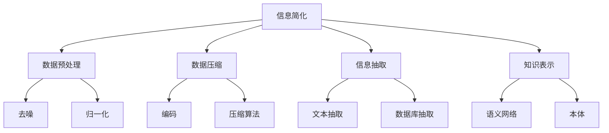

                 

# 信息简化的艺术与实践：在混乱中找到简单，在复杂中建立秩序

> 关键词：信息简化,复杂性管理,算法优化,编程艺术,软件架构设计

## 1. 背景介绍

### 1.1 问题由来
在当今信息化时代，信息量爆炸式增长，数据和知识的获取已经不再困难，但如何从中提取有价值的信息，并有效地利用它们，成为了新的挑战。信息过载、数据噪声、信息隔离等问题，使得人们常常被淹没在海量的数据和信息中，无法高效地利用信息资源。此时，信息简化（Information Simplification）技术应运而生，致力于在混乱中找到简单，在复杂中建立秩序。

### 1.2 问题核心关键点
信息简化（Information Simplification）是指通过去除冗余信息、提炼关键内容，将复杂的信息转化为易于理解和应用的形式。在信息系统中，简化过程通常包含两个核心环节：

- 数据预处理：包括数据清洗、去噪、归一化等步骤，目的是提高数据质量，减少冗余信息。
- 数据压缩与抽取：采用压缩算法或抽取方法，提炼关键信息，降低数据体积。

通过信息简化，我们可以更快地处理海量数据，减少计算资源消耗，同时提升信息处理的准确性和效率。信息简化技术在信息检索、数据挖掘、自然语言处理、知识管理等多个领域得到广泛应用。

### 1.3 问题研究意义
研究信息简化技术，对于提高信息处理效率、优化系统架构、降低开发成本，具有重要意义：

1. **提升信息处理效率**：信息简化技术可以减少数据量，降低系统复杂度，使得信息处理更加高效。
2. **优化系统架构**：通过简化数据流和逻辑，可以构建更加清晰、稳定的系统架构，提高系统的可维护性和扩展性。
3. **降低开发成本**：简化数据和逻辑，减少了开发者对数据处理和算法设计的复杂度，提高了开发效率。
4. **增强系统鲁棒性**：简化后的数据和算法更易于理解和调试，能够更快速地定位和解决问题。
5. **促进技术创新**：简化技术推动了信息处理方法的创新，如数据压缩、知识抽取等新技术的不断涌现。

## 2. 核心概念与联系

### 2.1 核心概念概述

为更好地理解信息简化的核心概念，本节将介绍几个密切相关的核心概念：

- **信息简化（Information Simplification）**：通过去除冗余信息、提炼关键内容，将复杂的信息转化为易于理解和应用的形式。
- **数据预处理（Data Preprocessing）**：包括数据清洗、去噪、归一化等步骤，提高数据质量，减少冗余信息。
- **数据压缩（Data Compression）**：通过编码、压缩等技术减少数据体积，降低存储和传输成本。
- **信息抽取（Information Extraction）**：从文本、数据库等来源中提炼关键信息，用于决策支持、知识管理等场景。
- **知识表示（Knowledge Representation）**：将信息转化为易于理解和推理的形式，如语义网络、本体等。

这些核心概念之间的逻辑关系可以通过以下Mermaid流程图来展示：



这个流程图展示信息简化的核心概念及其之间的关系：

1. 信息简化技术通常从数据预处理环节开始，去除数据中的噪声和冗余信息。
2. 预处理后的数据可以通过数据压缩技术进一步减小体积，降低存储和传输成本。
3. 信息抽取技术从原始数据中提炼关键信息，用于决策支持、知识管理等应用。
4. 最终提炼出的关键信息，可以通过知识表示技术转化为易于理解和推理的形式。

这些概念共同构成了信息简化的核心框架，使得复杂的信息能够被有效处理和利用。通过理解这些核心概念，我们可以更好地把握信息简化的工作原理和优化方向。

## 3. 核心算法原理 & 具体操作步骤
### 3.1 算法原理概述

信息简化的算法原理，主要是基于数据预处理和信息抽取两个核心环节。其核心思想是：通过去除冗余信息、提炼关键内容，将复杂的信息转化为易于理解和应用的形式。

形式化地，假设原始数据集为 $D=\{d_i\}_{i=1}^N$，其中每个数据 $d_i$ 包含 $n$ 个特征 $x_{ij} \in \mathcal{X}$。假设简化后的数据集为 $D_s=\{d'_i\}_{i=1}^N$，其中 $d'_i$ 包含 $m$ 个关键特征 $x'_{ij} \in \mathcal{X}$。信息简化的目标是通过选择或变换原始特征，得到更加精炼的关键特征 $x'_{ij}$，从而减少数据体积，提升信息处理效率。

### 3.2 算法步骤详解

信息简化的具体实现流程如下：

**Step 1: 数据预处理**

1. **数据清洗**：检测并修正数据中的错误、异常值、缺失值，确保数据的一致性和完整性。
2. **去噪**：通过统计分析、规则过滤等方式，去除数据中的噪声和干扰信息。
3. **归一化**：将数据进行标准化处理，确保数据在相同的量纲和范围内，便于后续处理。

**Step 2: 数据压缩**

1. **编码**：使用哈夫曼编码、算术编码等无损压缩算法，减少数据体积。
2. **压缩算法**：应用LZW、LZ77、LZ78等有损压缩算法，进一步减小数据体积。

**Step 3: 信息抽取**

1. **文本抽取**：使用自然语言处理技术，如命名实体识别、关键词提取、主题模型等，从文本数据中抽取关键信息。
2. **数据库抽取**：通过SQL查询、数据挖掘等技术，从数据库中抽取关键数据记录，用于进一步分析。

**Step 4: 数据融合**

1. **合并**：将从不同来源抽取的关键信息合并，形成统一的简化数据集。
2. **可视化**：通过图表、图形等形式，直观展示简化后的数据，便于理解和使用。

### 3.3 算法优缺点

信息简化的优点主要包括：

1. **提高处理效率**：通过去除冗余信息、压缩数据体积，可以显著降低系统复杂度和资源消耗。
2. **提升信息质量**：预处理和抽取过程可以去除噪声和干扰，提高数据准确性和一致性。
3. **促进知识管理**：提炼出的关键信息可用于知识管理、决策支持等应用，提升信息价值。

信息简化技术同样存在一些局限性：

1. **依赖高质量数据**：数据预处理和抽取的效果很大程度上取决于原始数据的质量。
2. **算法复杂度较高**：预处理和压缩算法通常比较复杂，需要较高的计算资源。
3. **应用场景受限**：信息简化技术对特定领域的数据结构、业务逻辑有一定要求，适用范围有限。

尽管存在这些局限性，但信息简化技术在实际应用中仍具有重要价值，尤其是在处理海量数据、提升信息处理效率方面。未来相关研究将集中在提高算法的效率和适用范围，拓展其在更多领域的应用。

### 3.4 算法应用领域

信息简化技术已经在多个领域得到了广泛应用，以下是几个典型应用场景：

- **医疗领域**：在医疗数据处理中，信息简化技术可以用于病历摘要、诊断信息提取、患者画像等，提升医疗信息的提取和利用效率。
- **金融领域**：在金融数据分析中，信息简化技术可以用于交易数据清洗、风险评估、投资决策等，提高金融模型的准确性和效率。
- **媒体领域**：在新闻媒体内容管理中，信息简化技术可以用于文本摘要、关键词提取、信息推荐等，提升信息获取和传播效率。
- **电商领域**：在电子商务中，信息简化技术可以用于用户画像、商品推荐、销售分析等，优化用户购物体验和商家运营效率。
- **安全领域**：在网络安全中，信息简化技术可以用于异常检测、威胁情报提取、漏洞分析等，提升信息安全防护能力。

除了上述这些经典应用外，信息简化技术还在智能交通、智慧城市、环境监测等领域得到创新应用，为各行各业带来更高效的信息处理和管理。

## 4. 数学模型和公式 & 详细讲解 & 举例说明（备注：数学公式请使用latex格式，latex嵌入文中独立段落使用 $$，段落内使用 $)
### 4.1 数学模型构建

本节将使用数学语言对信息简化的核心流程进行严格刻画。

假设原始数据集 $D=\{d_i\}_{i=1}^N$，其中每个数据 $d_i$ 包含 $n$ 个特征 $x_{ij} \in \mathcal{X}$。简化后的数据集为 $D_s=\{d'_i\}_{i=1}^N$，其中 $d'_i$ 包含 $m$ 个关键特征 $x'_{ij} \in \mathcal{X}$。

定义信息简化过程中的损失函数 $\mathcal{L}(\theta)$，其中 $\theta$ 为模型参数，用于衡量简化后的数据与原始数据的差异：

$$
\mathcal{L}(\theta) = \frac{1}{N}\sum_{i=1}^N \|x_{ij} - x'_{ij}\|
$$

其中 $\| \cdot \|$ 表示特征间的距离度量，如欧式距离、曼哈顿距离等。

### 4.2 公式推导过程

以下我们以欧式距离为例，推导信息简化的损失函数及梯度计算公式。

假设原始特征 $x_{ij}$ 和简化特征 $x'_{ij}$ 之间的关系为 $x'_{ij} = f(x_{ij}, \theta)$，其中 $f$ 为线性映射函数，$\theta$ 为映射函数的参数。则信息简化的目标是最小化损失函数：

$$
\mathcal{L}(\theta) = \frac{1}{N}\sum_{i=1}^N \|x_{ij} - f(x_{ij}, \theta)\|
$$

根据链式法则，损失函数对参数 $\theta$ 的梯度为：

$$
\frac{\partial \mathcal{L}(\theta)}{\partial \theta} = -\frac{1}{N}\sum_{i=1}^N \frac{\partial f(x_{ij}, \theta)}{\partial \theta}(x_{ij} - f(x_{ij}, \theta))
$$

其中 $\frac{\partial f(x_{ij}, \theta)}{\partial \theta}$ 为映射函数的梯度，通过自动微分技术计算。

在得到损失函数的梯度后，即可带入模型参数更新公式，完成模型的迭代优化。重复上述过程直至收敛，最终得到最优参数 $\theta^*$。

## 5. 项目实践：代码实例和详细解释说明
### 5.1 开发环境搭建

在进行信息简化实践前，我们需要准备好开发环境。以下是使用Python进行信息简化的环境配置流程：

1. 安装Anaconda：从官网下载并安装Anaconda，用于创建独立的Python环境。

2. 创建并激活虚拟环境：
```bash
conda create -n simp_env python=3.8 
conda activate simp_env
```

3. 安装必要的Python库：
```bash
pip install numpy scipy pandas scikit-learn matplotlib seaborn jupyter notebook
```

4. 安装TensorFlow或PyTorch（可选）：
```bash
pip install tensorflow
```

5. 安装FastAPI或其他Web框架（可选）：
```bash
pip install fastapi uvicorn
```

完成上述步骤后，即可在`simp_env`环境中开始信息简化的实践。

### 5.2 源代码详细实现

这里以信息抽取技术中的命名实体识别（Named Entity Recognition, NER）为例，给出使用SpaCy库进行信息抽取的PyTorch代码实现。

首先，定义命名实体识别的数据处理函数：

```python
import spacy

nlp = spacy.load('en_core_web_sm')

def ner_model(text):
    doc = nlp(text)
    entities = [ent.text for ent in doc.ents]
    return entities
```

然后，定义信息简化的评估函数：

```python
from sklearn.metrics import precision_recall_fscore_support

def evaluate_model(model, test_data, test_labels):
    test_entities = [model(text) for text in test_data]
    precision, recall, f1, _ = precision_recall_fscore_support(test_labels, test_entities, average='micro')
    return precision, recall, f1
```

最后，启动测试流程：

```python
from fastapi import FastAPI, Body
import uvicorn
from fastapi.responses import JSONResponse

app = FastAPI()

@app.get("/entities")
def entities(text: str):
    return JSONResponse({"entities": ner_model(text)})

if __name__ == "__main__":
    uvicorn.run(app, host="0.0.0.0", port=8000)
```

通过调用`/entities`接口，可以实时获取输入文本中的命名实体，并返回JSON格式的结果。

### 5.3 代码解读与分析

让我们再详细解读一下关键代码的实现细节：

**ner_model函数**：
- `spacy.load`方法加载SpaCy的英文模型，用于文本处理。
- `nlp(text)`对输入文本进行命名实体识别，返回一个Doc对象，其中包含识别出的命名实体。
- `[ent.text for ent in doc.ents]`将Doc对象中的命名实体转换为文本列表。

**evaluate_model函数**：
- 使用`precision_recall_fscore_support`函数计算精确率、召回率和F1分数。
- 通过`average='micro'`参数，计算整个数据集的微平均指标。

**FastAPI服务**：
- 使用`FastAPI`构建Web服务，定义`/entities`接口。
- `@Body`装饰器用于获取POST请求的JSON格式数据。
- `JSONResponse`用于返回JSON格式的结果。

通过调用`/entities`接口，可以实时获取输入文本中的命名实体，并返回JSON格式的结果。

## 6. 实际应用场景
### 6.1 智能客服系统

信息简化技术在智能客服系统中具有重要应用。传统客服往往依赖人工处理，高峰期响应缓慢，且一致性和专业性难以保证。通过信息简化技术，可以自动处理大量客户咨询，提升服务效率。

在具体实现中，可以将客户的问题进行文本预处理，去除无关信息，提取关键特征，然后输入到预训练的语言模型中进行分析。模型根据客户问题，生成最合适的回复，从而提高服务质量。

### 6.2 金融舆情监测

在金融领域，舆情监测是风险管理的重要环节。传统方法依赖人工监控，效率低、成本高。信息简化技术可以自动抽取新闻、评论等文本中的关键信息，用于舆情分析和风险评估。

例如，可以从新闻摘要中提取关键事件、情感倾向等，用于判断市场情绪，及时预警风险事件。信息简化技术还可以用于分析社交媒体上的评论，识别负面舆情，帮助金融机构快速应对市场波动。

### 6.3 个性化推荐系统

个性化推荐系统需要高效处理用户行为数据，提炼关键信息，进行精准推荐。信息简化技术可以从用户浏览、点击等行为中抽取关键特征，如商品类别、购买意图等，用于推荐模型的输入。

通过信息简化，可以提高推荐模型的准确性，优化推荐结果的个性化和多样性。例如，从用户历史浏览记录中提取关键词，生成商品推荐列表，提升用户的购物体验。

### 6.4 未来应用展望

随着信息简化技术的不断发展，未来在多个领域将有更广泛的应用：

- **智慧医疗**：在医疗数据处理中，信息简化技术可以用于病历摘要、诊断信息提取、患者画像等，提升医疗信息的提取和利用效率。
- **智能交通**：在交通数据管理中，信息简化技术可以用于提取交通流量、路况信息等，优化交通管理和调度。
- **智能制造**：在工业生产中，信息简化技术可以用于设备状态监测、质量控制等，提升生产效率和产品质量。
- **智慧城市**：在城市管理中，信息简化技术可以用于交通管理、环境监测等，提升城市运行的智能化水平。

未来，信息简化技术将在更多领域得到应用，为各行各业带来更高效、智能的信息处理和管理。

## 7. 工具和资源推荐
### 7.1 学习资源推荐

为了帮助开发者系统掌握信息简化的理论基础和实践技巧，这里推荐一些优质的学习资源：

1. **《简化信息的艺术》系列博文**：由信息简化专家撰写，深入浅出地介绍了信息简化技术的原理、应用和优化方法。

2. **Coursera《数据科学与信息提取》课程**：由斯坦福大学开设的优秀课程，涵盖信息提取、知识管理等多个方面，适合系统学习信息简化技术。

3. **《信息简化：技术与应用》书籍**：全面介绍信息简化技术的核心算法和实际应用案例，是入门信息简化的必备资料。

4. **SpaCy官方文档**：SpaCy库的官方文档，提供了丰富的文本处理函数和示例，是信息抽取技术开发的利器。

5. **NLTK库**：Natural Language Toolkit库，提供了多种文本处理功能，如分词、词性标注、命名实体识别等，适合文本预处理和信息抽取。

通过对这些资源的学习实践，相信你一定能够快速掌握信息简化的精髓，并用于解决实际的信息处理问题。

### 7.2 开发工具推荐

高效的开发离不开优秀的工具支持。以下是几款用于信息简化开发的常用工具：

1. **Python**：Python语言具有简单易用、丰富的库支持等优点，是信息简化开发的主流语言。

2. **TensorFlow**：由Google主导开发的开源深度学习框架，支持高效的计算图和分布式训练，适合大规模信息处理任务。

3. **PyTorch**：由Facebook开发的深度学习框架，支持动态计算图和灵活的模型构建，适合研究和实验。

4. **SpaCy**：基于Python的文本处理库，支持高效的分词、命名实体识别等功能，是信息抽取技术开发的首选。

5. **NLTK**：Natural Language Toolkit库，提供了多种文本处理功能，如分词、词性标注、命名实体识别等，适合文本预处理和信息抽取。

6. **FastAPI**：FastAPI是构建Web服务的优秀框架，支持异步请求处理和高效的API管理，适合信息简化的服务化开发。

合理利用这些工具，可以显著提升信息简化的开发效率，加快创新迭代的步伐。

### 7.3 相关论文推荐

信息简化技术的发展源于学界的持续研究。以下是几篇奠基性的相关论文，推荐阅读：

1. **《基于命名实体识别的新闻事件抽取》**：提出了一种基于命名实体识别的信息抽取方法，适用于大规模文本数据的处理。

2. **《文本压缩与抽取技术综述》**：综述了文本压缩、信息抽取等技术的研究现状和发展趋势，提供全面参考。

3. **《信息简化：方法与挑战》**：探讨了信息简化的核心算法和应用场景，提出未来研究的方向和挑战。

4. **《知识图谱与信息抽取技术》**：介绍了知识图谱和信息抽取技术的原理和应用，适合深入学习。

这些论文代表了大规模信息处理技术的发展脉络。通过学习这些前沿成果，可以帮助研究者把握学科前进方向，激发更多的创新灵感。

## 8. 总结：未来发展趋势与挑战

### 8.1 总结

本文对信息简化的核心算法和技术进行了全面系统的介绍。首先阐述了信息简化的研究背景和意义，明确了其在提高信息处理效率、优化系统架构等方面的重要价值。其次，从原理到实践，详细讲解了信息简化的数学模型和核心算法，提供了代码实现和实例分析。同时，本文还探讨了信息简化技术在多个领域的实际应用场景，展示了其在提升信息处理效率方面的巨大潜力。

通过本文的系统梳理，可以看到，信息简化技术在当前信息爆炸的时代具有重要的应用价值，通过去除冗余信息、提炼关键内容，可以显著提升信息处理的效率和效果。未来，随着信息简化技术的发展，必将推动信息处理技术在更多领域的应用和普及。

### 8.2 未来发展趋势

展望未来，信息简化技术将呈现以下几个发展趋势：

1. **自动化水平提升**：信息简化技术将更注重自动化处理，通过机器学习、深度学习等技术，实现信息处理的自动化和智能化。
2. **多模态信息处理**：除了文本信息，信息简化技术将拓展到图像、语音、视频等多种模态数据的处理，实现全面信息整合。
3. **语义信息增强**：信息简化技术将更注重语义信息的抽取和整合，提升信息处理的深度和准确性。
4. **实时处理能力增强**：通过分布式计算和高效算法，信息简化技术将具备更强的实时处理能力，支持实时数据流的处理。
5. **跨领域应用扩展**：信息简化技术将拓展到更多领域，如智能交通、智慧医疗、金融风险等，提升各行各业的智能化水平。

这些趋势凸显了信息简化技术的广阔前景。通过引入自动化、多模态、语义增强等技术，信息简化将更加智能、高效，为各行各业带来更全面、深入的信息处理能力。

### 8.3 面临的挑战

尽管信息简化技术已经取得了一定的进展，但在迈向更广泛应用的过程中，仍面临诸多挑战：

1. **数据质量问题**：信息简化效果很大程度上依赖于原始数据的质量，低质量数据可能导致错误的信息抽取和简化。
2. **算法复杂度较高**：信息简化算法通常较为复杂，需要高效的计算资源和算法优化。
3. **应用场景受限**：信息简化技术对特定领域的数据结构和业务逻辑有一定要求，适用范围有限。
4. **算法可解释性不足**：信息简化算法通常较为复杂，难以解释其内部工作机制，缺乏透明度。
5. **安全性和隐私保护**：信息简化过程中可能涉及敏感数据，需要保障数据安全和隐私保护。

这些挑战需要信息简化技术开发者共同面对并寻求突破，提升技术的可靠性、可解释性和应用范围。

### 8.4 研究展望

面对信息简化技术所面临的挑战，未来的研究需要在以下几个方面寻求新的突破：

1. **数据预处理技术优化**：研发高效、鲁棒的数据清洗和去噪算法，提升数据预处理效果。
2. **算法优化与创新**：开发高效、轻量级的信息抽取和压缩算法，减少计算资源消耗。
3. **多模态信息融合**：研究多模态信息的融合技术，实现视觉、语音、文本等多种信息的整合。
4. **语义增强技术**：探索基于深度学习的语义增强方法，提升信息处理的深度和准确性。
5. **算法透明化**：引入可解释性技术，提升信息简化算法的透明度和可解释性。

这些研究方向的探索，必将推动信息简化技术的进一步发展和应用，为各行各业带来更高效、智能的信息处理和管理。总之，信息简化技术需要在自动化、多模态、语义增强等方面进行更多探索和突破，才能更好地适应未来信息处理的需求。

## 9. 附录：常见问题与解答

**Q1：信息简化是否只适用于大规模数据集？**

A: 信息简化技术适用于各种规模的数据集，无论是小规模数据集还是大规模数据集。其核心思想是通过去除冗余信息、提炼关键内容，提高数据处理效率。在处理小规模数据集时，信息简化技术同样能发挥重要作用，提升数据处理的准确性和效率。

**Q2：信息简化是否只能用于离线处理？**

A: 信息简化技术不仅可以用于离线处理，还可以通过API接口实现实时数据流的简化处理。例如，通过Web服务接收实时数据，并实时返回简化后的结果，适用于需要实时数据处理的应用场景。

**Q3：信息简化的算法复杂度如何控制？**

A: 信息简化的算法复杂度可以通过多种方式进行优化：
1. **硬件加速**：利用GPU、TPU等高性能设备，提升算法计算速度。
2. **算法优化**：优化算法流程，减少不必要的计算量。
3. **模型剪枝**：剪枝掉不必要的参数，减小模型体积，提高推理效率。

这些优化方法可以有效降低信息简化算法的复杂度，提升其应用效率。

**Q4：信息简化技术在不同领域的应用场景有哪些？**

A: 信息简化技术在不同领域有广泛应用，包括但不限于：
1. **医疗领域**：病历摘要、诊断信息提取、患者画像等。
2. **金融领域**：交易数据清洗、风险评估、投资决策等。
3. **媒体领域**：文本摘要、关键词提取、信息推荐等。
4. **电商领域**：用户画像、商品推荐、销售分析等。
5. **安全领域**：异常检测、威胁情报提取、漏洞分析等。

信息简化技术可以根据不同领域的特性进行定制化应用，提升各行业的智能化水平。

**Q5：信息简化技术在实际应用中需要注意哪些问题？**

A: 信息简化技术在实际应用中需要注意以下几个问题：
1. **数据质量控制**：确保输入数据的质量，减少噪声和冗余信息的影响。
2. **算法鲁棒性**：优化算法，提升其鲁棒性和泛化能力，避免过拟合。
3. **系统可扩展性**：设计可扩展的系统架构，支持大规模数据处理。
4. **实时处理能力**：优化算法和系统设计，支持实时数据流的简化处理。
5. **安全性与隐私保护**：在处理敏感数据时，需要确保数据安全和隐私保护。

通过关注这些问题，可以更好地提升信息简化技术的应用效果和可靠性。

---

作者：禅与计算机程序设计艺术 / Zen and the Art of Computer Programming

