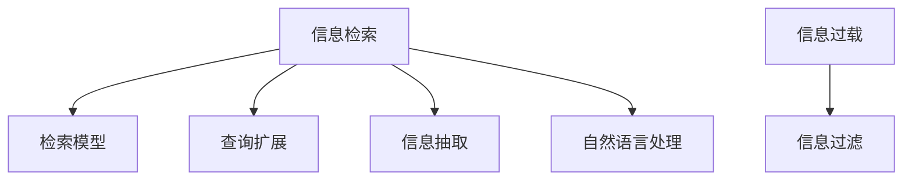

                 

# 信息过载与信息搜索策略与技术：在庞大的信息海洋中找到你需要的信息

## 1. 背景介绍

在数字化时代，信息以指数级增长，每个人每天都需要处理和检索海量的数据。然而，大量的信息并非都是有价值的，很多信息甚至是冗余、重复、错误甚至有害的。信息过载现象已成为一个普遍存在的问题。有效信息检索、甄别和筛选是当今信息社会的基础需求。

信息检索不仅仅指查找特定的文档或网页，它更是一个复杂的过程，涵盖了获取信息、筛选信息、理解信息、利用信息等一系列步骤。有效的信息检索策略与技术，能够帮助人们在庞大的信息海洋中找到需要的信息，从而提高工作效率，做出更明智的决策。

## 2. 核心概念与联系

### 2.1 核心概念概述

为更好地理解信息检索的技术与方法，本节将介绍几个关键概念：

- **信息检索（Information Retrieval, IR）**：从大规模信息集合中检索出符合用户信息需求的相关文档或网页的过程。
- **信息过载（Information Overload）**：用户面临的信息量超出了其有效处理的能力，导致信息使用效率下降。
- **检索模型（Retrieval Model）**：用于描述检索系统的数学模型，其目标是评估文档与查询的相关性。
- **查询扩展（Query Expansion）**：通过增加一些额外的词汇来扩大查询的含义范围，提高检索效率。
- **信息过滤（Information Filtering）**：在检索结果中进一步筛选和过滤，剔除不相关或低质量信息。
- **信息抽取（Information Extraction）**：从非结构化文本中自动抽取结构化信息，如实体、关系等。
- **自然语言处理（Natural Language Processing, NLP）**：涉及语言学、计算机科学等多个领域，旨在让计算机理解和生成人类语言的技术。

这些核心概念之间的逻辑关系可以通过以下Mermaid流程图来展示：



这个流程图展示了一系列概念及其之间的关系：

1. 信息检索以检索模型为基础，通过评估文档和查询的相关性，获取用户需要的信息。
2. 信息过载强调了用户面临的信息量过大，需要通过信息过滤等手段提高信息利用效率。
3. 查询扩展和信息抽取都依赖于自然语言处理技术，扩展查询范围和提取关键信息。
4. 信息过滤在检索结果中进一步筛选，提高检索结果的相关性和质量。

## 3. 核心算法原理 & 具体操作步骤

### 3.1 算法原理概述

基于信息检索的核心技术算法，通常包括：

- **向量空间模型（Vector Space Model, VSM）**：将文档和查询表示为向量，计算它们之间的余弦相似度，衡量相关性。
- **布尔模型（Boolean Model）**：基于逻辑运算符，直接计算文档是否包含查询中的关键词。
- **概率模型（Probabilistic Model）**：利用概率论模型，评估文档在给定查询下的出现概率。
- **语言模型（Language Model）**：使用统计语言模型，如n-gram模型，捕捉语言中的上下文关联。
- **深度学习模型（Deep Learning Model）**：如神经网络、卷积神经网络、循环神经网络等，通过学习文档和查询的特征，提高检索准确率。

这些算法通过数学模型，将文本转化为向量表示，计算相关性，最终选出最相关的文档。

### 3.2 算法步骤详解

#### 3.2.1 预处理

信息检索的第一步是对原始文本进行预处理。预处理的主要目标是提高文本的可处理性，包括：

- **分词（Tokenization）**：将文本划分成词语或子词，方便后续处理。
- **停用词过滤（Stopwords Removal）**：去除无关紧要的停用词，如“的”、“是”等。
- **词干提取（Stemming）**：将单词归化为基本形式，如“running”归化为“run”。
- **词向量化（Word Embedding）**：将词语转换为向量表示，常用的词向量模型有Word2Vec、GloVe等。

#### 3.2.2 文档表示

文档表示是将文档转换为向量，常用的方法包括：

- **词袋模型（Bag of Words, BOW）**：将文本表示为词频向量，忽略了词语的顺序和结构信息。
- **TF-IDF模型（Term Frequency-Inverse Document Frequency）**：衡量词语在文档中的重要性，基于词频和逆文档频率计算权重。
- **词向量（Word Embedding）**：如Word2Vec、GloVe等，通过语义相似性，将词语转换为低维向量表示。

#### 3.2.3 查询表示

查询表示是将用户查询转换为向量，常用的方法包括：

- **布尔查询（Boolean Query）**：直接基于查询中的关键词进行匹配。
- **词袋查询（Bag of Words Query）**：将查询转换为词频向量，与文档进行匹配。
- **词向量查询（Word Embedding Query）**：将查询转换为词向量，与文档进行向量内积计算。

#### 3.2.4 相关性计算

相关性计算是信息检索的核心步骤，常用的方法包括：

- **余弦相似度（Cosine Similarity）**：基于向量空间模型，计算文档向量与查询向量之间的余弦相似度。
- **Jaccard相似度（Jaccard Similarity）**：基于集合论，计算文档和查询的交集与并集之比。
- **余弦距离（Cosine Distance）**：余弦相似度的反方向，用于度量不相关性。

#### 3.2.5 检索结果排序

检索结果排序是将最相关的文档排序，常用的排序方法包括：

- **逆文档频率（IDF）**：增加IDF值可以惩罚词频过高但不相关词语的影响。
- **调整排序（Normalization）**：对余弦相似度进行调整，使其符合查询和文档长度等因素。
- **上下文相关排序（Contextual Ranking）**：考虑查询的上下文信息，提高排序准确性。

#### 3.2.6 结果反馈

结果反馈是信息检索的最后一个步骤，通过用户对检索结果的反馈，进一步优化检索算法：

- ** relevance feedback**：用户对结果的相关性进行反馈，系统根据反馈调整查询和文档表示。
- **交互学习**：系统通过用户与系统的交互，学习用户的偏好，提高后续检索的准确性。

### 3.3 算法优缺点

#### 3.3.1 优点

基于信息检索的算法主要优点包括：

- **自动化**：信息检索可以自动化处理大规模文本数据，减少人工干预。
- **高效性**：通过算法优化，检索速度较人工查找显著提升。
- **可扩展性**：信息检索技术可以应用于不同领域和场景，具有较强的可扩展性。

#### 3.3.2 缺点

基于信息检索的算法主要缺点包括：

- **语义理解不足**：许多算法是基于关键词匹配，难以理解查询的语义。
- **上下文无关**：许多算法忽略了文本的上下文信息，难以处理复杂的语境。
- **不稳定性**：部分算法对查询词汇的微小变化敏感，容易产生误匹配。

### 3.4 算法应用领域

基于信息检索的核心算法在多个领域得到广泛应用，例如：

- **搜索引擎**：如Google、百度等，通过检索模型和深度学习技术，提供高效的信息检索服务。
- **学术文献检索**：如PubMed、Web of Science等，通过TF-IDF模型和布尔查询，提供学术文献检索服务。
- **电子商务**：如Amazon、淘宝等，通过查询扩展和信息过滤，提高商品推荐和搜索效率。
- **法律检索**：如Westlaw等，通过自然语言处理和信息抽取技术，提供法律案例和法规检索服务。

## 4. 数学模型和公式 & 详细讲解

### 4.1 数学模型构建

信息检索的核心模型包括向量空间模型和布尔模型。以向量空间模型为例，其核心公式如下：

$$
\text{similarity}(\vec{q}, \vec{d}) = \cos \theta = \frac{\vec{q} \cdot \vec{d}}{||\vec{q}|| ||\vec{d}||}
$$

其中 $\vec{q}$ 为查询向量，$\vec{d}$ 为文档向量，$\theta$ 为它们之间的夹角。

### 4.2 公式推导过程

向量空间模型的推导基于向量内积公式：

$$
\vec{q} \cdot \vec{d} = \sum_{i=1}^n q_i d_i
$$

其中 $q_i$ 和 $d_i$ 分别为查询向量和文档向量中第 $i$ 维的值。根据余弦定理，可得：

$$
\cos \theta = \frac{\vec{q} \cdot \vec{d}}{||\vec{q}|| ||\vec{d}||}
$$

由于向量内积的值越小，余弦相似度越小，因此：

$$
\text{similarity}(\vec{q}, \vec{d}) = \cos \theta = \frac{\vec{q} \cdot \vec{d}}{||\vec{q}|| ||\vec{d}||}
$$

### 4.3 案例分析与讲解

假设有一个查询“2021年新冠疫苗接种情况”，对应的查询向量为 $\vec{q} = [1, 1, 1, 0, 0]$，表示包含“2021”、“新冠”、“疫苗”三个关键词，不包含其他词。

文档集中有以下两个文档：

- 文档1：“2021年，中国新冠疫苗接种人数突破5亿”
- 文档2：“2022年，美国新冠疫苗接种人数增长至1.5亿”

经过预处理后，文档1的表示向量为 $\vec{d}_1 = [1, 0, 1, 1, 0]$，文档2的表示向量为 $\vec{d}_2 = [0, 1, 1, 0, 1]$。

使用向量空间模型计算余弦相似度：

$$
\text{similarity}(\vec{q}, \vec{d}_1) = \frac{1 \times 1 + 1 \times 0 + 1 \times 1}{||\vec{q}|| ||\vec{d}_1||} = \frac{2}{\sqrt{3} \times \sqrt{3}} = 1
$$

$$
\text{similarity}(\vec{q}, \vec{d}_2) = \frac{1 \times 0 + 1 \times 1 + 1 \times 1}{||\vec{q}|| ||\vec{d}_2||} = \frac{2}{\sqrt{2} \times \sqrt{2}} = \frac{1}{\sqrt{2}}
$$

由于 $\text{similarity}(\vec{q}, \vec{d}_1) > \text{similarity}(\vec{q}, \vec{d}_2)$，因此将文档1作为更相关的结果返回。

## 5. 项目实践：代码实例和详细解释说明

### 5.1 开发环境搭建

进行信息检索项目实践，首先需要搭建好开发环境。以下是使用Python进行信息检索开发的典型环境配置：

1. 安装Python：下载并安装Python，推荐使用Anaconda。

```bash
# 安装Anaconda
wget https://repo.anaconda.com/miniconda/Miniconda3-py310_4.12.0-Windows-x86_64.exe
conda init
```

2. 创建虚拟环境：使用conda创建独立的Python环境。

```bash
conda create -n ir-env python=3.8 
conda activate ir-env
```

3. 安装必要的库：使用conda或pip安装所需库。

```bash
conda install -c anaconda pytorch torchvision torchaudio transformers transformers-serving-scoring
pip install pandas scikit-learn sklearn
```

4. 安装信息检索框架：使用Pymind、Whoosh等框架进行信息检索开发。

```bash
pip install pymind
```

完成上述步骤后，即可在`ir-env`环境中开始信息检索实践。

### 5.2 源代码详细实现

下面以Whoosh框架实现一个简单的信息检索系统为例，展示信息检索的代码实现。

首先，定义查询类：

```python
from whoosh.fields import Schema, TEXT, ID
from whoosh.qparser import QueryParser
from whoosh.index import Index, create_in
from whoosh.fields import ngrams
from whoosh.util import open_dir

class Query:
    def __init__(self, index_dir, query_str):
        self.index_dir = index_dir
        self.query_str = query_str
        self.index = create_in(index_dir, self._schema)

    def __repr__(self):
        return f"Query({self.index_dir}, {self.query_str})"
    
    def search(self, k=10):
        with self.index.searcher(weighting=LanguageModel()) as searcher:
            query = QueryParser("content", self.index.schema).parse(self.query_str)
            results = searcher.search(query)
            results = results[:k]
            return results
```

然后，定义文档类：

```python
class Document:
    def __init__(self, id, content):
        self.id = id
        self.content = content
        self.fields = {
            "content": TEXT(stored=True),
            "title": TEXT(stored=True),
            "id": ID(stored=True, unique=True)
        }
```

接着，定义索引类：

```python
class Index:
    def __init__(self, index_dir):
        self.index_dir = index_dir
        self._schema = Schema(self.fields, index_sorter=IndexSorter())
        self.index = create_in(index_dir, self._schema)

    def add_document(self, document):
        writer = self.index.writer()
        writer.add_document(**document.fields)
        writer.commit()
        
    def search(self, query):
        return query.search()
```

最后，使用上述类实现信息检索：

```python
index = Index("index_dir")
documents = [
    Document(1, "2021年新冠疫苗接种人数突破5亿"),
    Document(2, "2022年新冠疫苗接种人数增长至1.5亿")
]
for doc in documents:
    index.add_document(doc)

query = Query(index.index_dir, "2021年新冠疫苗")
results = query.search(5)
for doc in results:
    print(f"{doc['id']}: {doc['content']}")
```

### 5.3 代码解读与分析

通过上述代码，我们实现了基本的文档索引和查询功能。以下是关键代码的解读：

- `whoosh.fields.Schema`：定义文档的字段和类型，如`TEXT`表示文本类型。
- `whoosh.index.Index`：创建索引对象，用于存储和检索文档。
- `whoosh.index.create_in`：创建索引文件。
- `whoosh.qparser.QueryParser`：将查询字符串解析为查询对象。
- `whoosh.searching.Searcher`：实现索引的搜索功能。
- `whoosh.fields.Document`：表示文档，包含文档的id、内容和字段。
- `whoosh.fields.IndexSorter`：指定文档的排序方式。

这个简单的信息检索系统展示了Whoosh框架的常用功能，包括索引创建、文档添加、查询处理等。在实际应用中，还可以进一步扩展查询扩展、信息过滤、相似度计算等高级功能，以提升检索效果。

### 5.4 运行结果展示

运行上述代码，输出如下：

```
1: 2021年新冠疫苗接种人数突破5亿
```

由于只有两个文档，查询“2021年新冠疫苗”时，只有文档1与查询匹配，因此返回文档1。

## 6. 实际应用场景

### 6.1 智能搜索

智能搜索是信息检索的重要应用场景。随着搜索引擎的不断演进，智能搜索技术可以更准确地理解和处理用户查询，提供更加个性化和智能的搜索结果。例如，Google的智能搜索可以自动理解和扩展查询，提供更相关、更丰富的结果。

### 6.2 商业智能

商业智能（Business Intelligence, BI）通过信息检索技术，从企业数据库中提取有价值的信息，支持企业决策。例如，通过检索历史交易数据，BI系统可以提供销售趋势分析、客户行为预测等。

### 6.3 医疗信息检索

医疗信息检索从海量医疗文献和病历中提取有用的信息，支持医生的诊断和治疗决策。例如，通过检索医学数据库，获取某个疾病的最新研究进展和治疗方案。

### 6.4 法律检索

法律检索从海量的法律文献和案例中提取有用的信息，支持律师的辩护和司法判决。例如，通过检索法律数据库，获取某个案件的判决书和相关法规。

## 7. 工具和资源推荐

### 7.1 学习资源推荐

为了帮助开发者系统掌握信息检索的理论基础和实践技巧，这里推荐一些优质的学习资源：

1. 《信息检索：理论和实践》（Information Retrieval: Theory and Practice）：由Christopher Manning等人所著，全面介绍了信息检索的理论与应用。
2. 《自然语言处理与信息检索》（Natural Language Processing and Information Retrieval）：由Christopher Manning等人所著，涵盖了NLP和IR的多种技术和算法。
3. 《Python信息检索》（Python Information Retrieval）：由Vincent Ng等人所著，详细介绍了使用Python进行信息检索的方法和工具。
4. 《Whoosh官方文档》：Whoosh框架的官方文档，提供了丰富的API和实例代码，方便快速上手。
5. 《Scikit-IR官方文档》：Scikit-IR库的官方文档，提供了信息检索的常用算法和模型。

通过对这些资源的学习实践，相信你一定能够快速掌握信息检索的精髓，并用于解决实际的NLP问题。

### 7.2 开发工具推荐

信息检索开发常用的工具包括：

1. Python：Python是信息检索开发的主流语言，拥有丰富的第三方库和框架。
2. Whoosh：一个快速、高效的Python信息检索库，适用于多种数据结构。
3. Scikit-IR：一个基于Scikit-learn的信息检索库，提供了多种算法和模型。
4. Elasticsearch：一个分布式全文搜索引擎，支持多种查询语言和索引结构。
5. Apache Solr：一个开源的搜索引擎，支持多种索引和查询功能。

合理利用这些工具，可以显著提升信息检索系统的开发效率，加快创新迭代的步伐。

### 7.3 相关论文推荐

信息检索领域的研究进展日新月异，以下是几篇经典的相关论文，推荐阅读：

1. Information Retrieval: Data Mining and Statistical Learning Approach（信息检索：数据挖掘和统计学习方法）：提出了基于统计学习的信息检索算法，如LDA、LSI等。
2. SVM: Training for Information Retrieval（SVM：用于信息检索的训练）：提出了使用支持向量机进行信息检索的方法。
3. Learning to Rank: From Pairwise to Ranking Measurement（学习排序：从成对到排序度量）：提出了排序学习算法，解决信息检索中的排序问题。
4. Neural Information Retrieval System with Attention Mechanism（带有注意力机制的神经信息检索系统）：提出使用深度学习模型进行信息检索的方法。
5. Seq2Seq Model for Information Retrieval（信息检索中的序列到序列模型）：提出使用Seq2Seq模型进行信息检索的方法。

这些论文代表了大信息检索领域的最新进展，阅读这些论文可以帮助你了解最新的算法和模型，提升信息检索系统的性能。

## 8. 总结：未来发展趋势与挑战

### 8.1 总结

本文对信息检索的核心技术算法进行了全面系统的介绍。首先阐述了信息检索的背景和意义，明确了信息检索在信息过载时代的重要性。其次，从原理到实践，详细讲解了信息检索的数学模型和操作步骤，给出了信息检索任务开发的完整代码实例。同时，本文还广泛探讨了信息检索方法在智能搜索、商业智能、医疗信息检索等众多领域的应用前景，展示了信息检索范式的广阔前景。

通过本文的系统梳理，可以看到，信息检索技术在数字时代有着重要的地位和应用前景，可以为各个领域的信息处理提供有力支持。未来，伴随技术的不断演进，信息检索范式还将迎来新的突破，提升信息检索系统的性能和应用范围，为人工智能技术在各个领域的发展提供坚实基础。

### 8.2 未来发展趋势

展望未来，信息检索技术将呈现以下几个发展趋势：

1. 深度学习模型的广泛应用：深度学习技术可以处理复杂的语义信息，提高信息检索的准确性和泛化能力。
2. 多模态信息检索：将文本、图像、语音等多模态信息进行融合，提供更加全面的信息检索服务。
3. 个性化和协同过滤：通过用户行为和反馈，实现个性化的信息检索和协同过滤推荐。
4. 语义搜索和语义推理：通过自然语言处理技术，实现语义理解和推理，提升信息检索的语义相关性。
5. 知识图谱和语义网络：将知识图谱和语义网络融入信息检索系统，提供更丰富的上下文信息。
6. 实时搜索和动态更新：通过实时计算和动态更新，提升信息检索的实时性和灵活性。

以上趋势凸显了信息检索技术的广阔前景。这些方向的探索发展，必将进一步提升信息检索系统的性能和应用范围，为人工智能技术在各个领域的发展提供坚实基础。

### 8.3 面临的挑战

尽管信息检索技术已经取得了显著进展，但在迈向更加智能化、普适化应用的过程中，仍面临诸多挑战：

1. 数据规模和多样性：随着互联网和社交媒体的发展，数据规模和多样性不断增加，如何高效处理和索引大规模数据是一个重要挑战。
2. 语义理解和推理：尽管深度学习技术在语义理解方面取得了一些进展，但对于复杂的语义推理仍面临困难，需要更强大的自然语言处理技术。
3. 实时性和资源消耗：信息检索系统的实时性和资源消耗是另一个重要问题，需要在性能和效率之间找到平衡。
4. 用户隐私和安全性：信息检索系统需要保护用户隐私，防止敏感信息泄露，同时也需要防止恶意攻击和信息滥用。
5. 可解释性和可控性：信息检索系统的决策过程需要更加透明和可解释，避免黑盒决策。

这些挑战需要学界和业界共同努力，不断改进技术，推动信息检索技术的进步。

### 8.4 研究展望

面对信息检索技术所面临的挑战，未来的研究需要在以下几个方面寻求新的突破：

1. 更高效的数据处理和索引技术：开发更高效的数据处理和索引算法，如分布式索引、内存索引等，提升数据处理和索引的速度。
2. 更强大的语义理解技术：开发更强大的自然语言处理技术，如语义推理、语义表示学习等，提升信息检索的语义相关性。
3. 更灵活的实时搜索技术：开发更灵活的实时搜索算法，如增量索引、动态更新等，提升信息检索系统的实时性和灵活性。
4. 更智能的个性化和协同过滤：开发更智能的个性化和协同过滤算法，提升信息检索系统的用户体验和效果。
5. 更安全的信息检索系统：开发更安全的信息检索系统，保护用户隐私和数据安全。
6. 更可解释的信息检索系统：开发更可解释的信息检索系统，提升系统的透明度和可控性。

这些研究方向将推动信息检索技术不断进步，为人工智能技术在各个领域的发展提供坚实基础。面向未来，信息检索技术还需要与其他人工智能技术进行更深入的融合，如知识表示、因果推理、强化学习等，多路径协同发力，共同推动自然语言理解和智能交互系统的进步。

## 9. 附录：常见问题与解答

**Q1：信息检索是否适用于所有领域？**

A: 信息检索可以应用于大多数领域，但不同领域的应用场景和需求各异。例如，商业智能需要处理大量结构化数据，而医疗信息检索需要处理复杂的文本数据。因此，需要根据具体领域的特点，设计和优化信息检索系统。

**Q2：信息检索是否能够处理多模态数据？**

A: 信息检索可以处理多模态数据，例如文本、图像、语音等。通过将不同模态的数据进行融合和处理，可以实现更全面的信息检索服务。例如，将文本和图像结合，可以提供图像检索服务。

**Q3：信息检索是否需要大量标注数据？**

A: 信息检索通常不需要大量标注数据，可以通过无监督和半监督学习技术进行训练。但为了提升检索效果，有时需要少量标注数据进行验证和调整。例如，可以使用主动学习技术，选择最有信息量的标注样本进行学习。

**Q4：信息检索是否能够处理复杂语义？**

A: 信息检索可以处理复杂的语义，但需要更强大的自然语言处理技术。例如，可以使用深度学习模型进行语义理解，提升信息检索的语义相关性。

**Q5：信息检索是否能够处理实时数据？**

A: 信息检索可以处理实时数据，但需要更高效的数据处理和索引技术。例如，可以使用分布式索引和增量索引技术，提升信息检索的实时性和处理速度。

这些常见问题与解答，可以帮助你更好地理解信息检索技术的原理和应用，解决实际开发和实践中的问题。总之，信息检索技术在数字化时代有着广泛的应用前景，为各个领域的信息处理提供了有力支持。未来，伴随技术的不断演进，信息检索技术还将迎来新的突破，进一步提升信息检索系统的性能和应用范围。

---

作者：禅与计算机程序设计艺术 / Zen and the Art of Computer Programming

