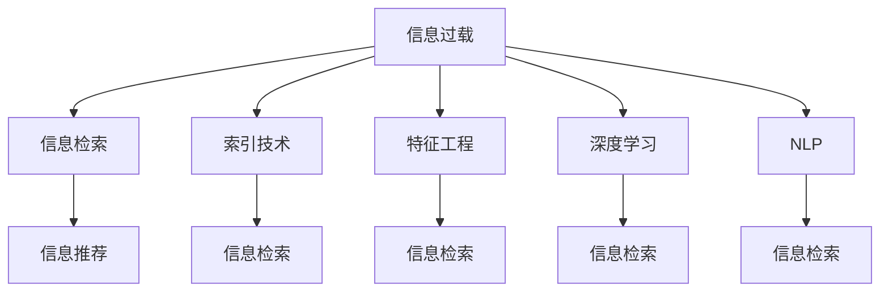

                 

# 信息过载与信息搜索策略与技术：在庞大的信息海洋中找到所需信息

> 关键词：信息过载, 信息搜索, 智能推荐, 信息检索, 深度学习, 自然语言处理(NLP), 信息检索算法, 索引技术, 特征工程

## 1. 背景介绍

在互联网时代，信息如同海洋般浩瀚无垠，人类每天需要处理和吸收的信息量急剧增长，面临信息过载的挑战。信息过载不仅降低了人们的工作效率，也影响着决策的质量。为了解决这一问题，信息搜索技术应运而生，旨在从海量的信息中高效、准确地获取所需的信息。

### 1.1 问题由来

随着数字技术的进步，信息获取变得前所未有的简单。搜索引擎、社交媒体、在线文档等成为了信息搜索的主要渠道。然而，这些渠道也带来了新的问题：信息过载。面对爆炸式的信息增长，如何从中快速找到有用的信息，成为一项重要的技术挑战。

### 1.2 问题核心关键点

信息搜索技术的核心在于处理和组织信息，使其可以被快速检索。主要包括以下几个方面：

- **数据预处理**：清洗、转换和整合原始数据，使其适合搜索算法处理。
- **索引技术**：建立有效的索引，以便快速定位和检索信息。
- **信息检索算法**：选择合适的算法，根据用户的查询进行信息的检索和排序。
- **特征工程**：提取和构建有意义的特征，提升检索结果的相关性和准确性。

## 2. 核心概念与联系

### 2.1 核心概念概述

为更好地理解信息搜索技术的核心，本节将介绍几个关键概念及其相互关系：

- **信息过载(Information Overload)**：指人们在获取信息时所面临的信息量超过其处理能力的现象。
- **信息检索(Information Retrieval)**：指从信息集合中获取相关信息的自动化过程，包括查询、索引、检索等步骤。
- **信息推荐(Information Recommendation)**：通过算法推荐用户感兴趣的信息，减轻信息过载的影响。
- **索引技术(Indexing)**：构建索引结构，支持高效的数据检索。
- **特征工程(Feature Engineering)**：提取和构建有意义的特征，提升检索效果。
- **深度学习(Deep Learning)**：利用神经网络模型进行复杂的数据处理和分析，提升信息检索和推荐的精度。
- **自然语言处理(NLP)**：处理和理解自然语言文本，支持更自然的信息查询和反馈。

这些概念通过以下Mermaid流程图进行展示，展示了它们之间的相互联系：



这个流程图展示了信息过载问题以及与之相关的核心技术：

1. 信息过载通过信息检索技术解决，旨在从海量的信息中快速找到有用的内容。
2. 信息推荐进一步减轻信息过载，推荐系统通过算法推荐用户感兴趣的信息。
3. 索引技术和特征工程是信息检索的核心组成部分，帮助构建高效的检索模型。
4. 深度学习和NLP技术为信息检索和推荐提供了更强大的数据分析能力，提升了算法的准确性和效率。

## 3. 核心算法原理 & 具体操作步骤

### 3.1 算法原理概述

信息搜索技术的核心算法包括信息检索和推荐算法，其中信息检索算法尤为关键。本节将介绍几种常用的信息检索算法及其基本原理。

#### 3.1.1 向量空间模型(Vector Space Model, VSM)

向量空间模型是一种基于向量表示的信息检索方法，将文档和查询表示为高维空间中的向量，通过计算向量之间的相似度来进行检索。其基本流程如下：

1. **文本向量化**：将文档和查询转化为向量形式，通常使用TF-IDF等方法计算词频和逆文档频率，构建文档向量和查询向量。
2. **相似度计算**：计算文档向量与查询向量之间的余弦相似度，评估文档与查询的相关性。
3. **排序**：根据相似度对文档进行排序，返回与查询最相关的文档。

向量空间模型的核心在于将文本信息转化为高维向量，便于计算机进行处理和比较。然而，该方法对于查询词义变化和文档词序变化较为敏感，可能导致误匹配。

#### 3.1.2 BM25算法

BM25算法是对向量空间模型的一种改进，旨在提高检索的精度和召回率。其核心在于对文本向量的加权和长度归一化，使得检索结果更加准确和相关。

BM25算法的基本流程如下：

1. **文档预处理**：对文档进行分词、去停用词等预处理，构建词袋模型。
2. **查询处理**：对查询进行分词和预处理，构建查询向量。
3. **文档加权**：根据词频、文档长度、词项频率等因素计算文档向量的权重。
4. **相似度计算**：计算加权后的文档向量与查询向量之间的余弦相似度，评估文档与查询的相关性。
5. **排序**：根据相似度对文档进行排序，返回与查询最相关的文档。

BM25算法通过加权和长度归一化，使得检索结果更加准确和相关，适用于大规模文本数据的检索。

#### 3.1.3 TF-IDF算法

TF-IDF算法是一种基于词频和逆文档频率的文本表示方法，广泛用于信息检索和推荐系统。其核心在于对词频进行加权，减少常见词汇的影响，提高关键词的权重。

TF-IDF算法的基本流程如下：

1. **文档预处理**：对文档进行分词、去停用词等预处理，构建词袋模型。
2. **文档向量化**：计算每个词在文档中的词频，并将其转化为TF-IDF向量。
3. **查询处理**：对查询进行分词和预处理，构建查询向量。
4. **相似度计算**：计算文档向量与查询向量之间的余弦相似度，评估文档与查询的相关性。
5. **排序**：根据相似度对文档进行排序，返回与查询最相关的文档。

TF-IDF算法通过加权词频和逆文档频率，提升关键词的相关性，适用于中小规模文本数据的检索。

### 3.2 算法步骤详解

以BM25算法为例，详细讲解其在实际应用中的具体操作步骤：

1. **数据准备**：收集和预处理需要检索的数据集，包括文本分词、去除停用词等预处理。
2. **索引构建**：构建文档向量和查询向量，计算每个词的词频和逆文档频率，构建BM25索引。
3. **查询处理**：对用户输入的查询进行分词和预处理，构建查询向量。
4. **文档加权**：根据BM25算法计算文档向量的权重，并归一化。
5. **相似度计算**：计算加权后的文档向量与查询向量之间的余弦相似度，评估文档与查询的相关性。
6. **排序和返回**：根据相似度对文档进行排序，返回与查询最相关的文档。

### 3.3 算法优缺点

信息检索算法的主要优缺点如下：

**优点：**

- **高效性**：通过构建索引和加权方法，可以快速定位和检索信息。
- **可扩展性**：适用于大规模文本数据的检索，具有良好的扩展性。
- **灵活性**：可以根据不同的检索需求调整算法参数，适应不同的应用场景。

**缺点：**

- **数据稀疏性**：对于长尾词汇和罕见文档，检索效果可能较差。
- **算法复杂性**：构建索引和加权方法较为复杂，需要额外的计算资源。
- **词义歧义**：对于同义词和近义词的处理，可能导致误匹配。

### 3.4 算法应用领域

信息检索技术在多个领域得到了广泛应用，包括但不限于：

- **搜索引擎**：如Google、百度等，通过索引和检索技术快速定位信息。
- **学术搜索**：如Google Scholar、PubMed等，帮助用户快速找到相关文献和研究报告。
- **图书馆管理系统**：如图书馆的图书检索系统，方便用户查找书籍。
- **企业知识管理**：如企业文档管理系统，帮助员工快速找到所需信息。
- **智能推荐系统**：如Netflix、Amazon等，通过用户行为推荐相关内容。

## 4. 数学模型和公式 & 详细讲解 & 举例说明

### 4.1 数学模型构建

信息检索算法通常使用向量空间模型来进行数学建模。以下以TF-IDF算法为例，介绍其数学模型的构建过程。

设文本集合为 $D=\{d_1, d_2, ..., d_m\}$，其中 $d_i$ 表示第 $i$ 个文档。设查询为 $q$。假设每个文档和查询都由 $n$ 个词汇组成，分别为 $t_{ij}$ 和 $t_{ik}$。

**TF-IDF向量化**：

- 文本 $d_i$ 的词频-逆文档频率向量为 $v_i = (t_{i1}, t_{i2}, ..., t_{in})$。
- 查询 $q$ 的词频-逆文档频率向量为 $v_q = (t_{q1}, t_{q2}, ..., t_{qn})$。

**相似度计算**：

- 文档向量 $v_i$ 和查询向量 $v_q$ 的余弦相似度为：

$$
\cos(v_i, v_q) = \frac{v_i \cdot v_q}{\|v_i\|\|v_q\|}
$$

其中 $\cdot$ 表示向量的点积，$\|\cdot\|$ 表示向量的模长。

**排序和返回**：

- 根据余弦相似度对文档进行排序，返回与查询最相关的文档。

### 4.2 公式推导过程

以TF-IDF算法为例，推导其核心公式的推导过程。

**词频(Term Frequency, TF)**：

- 文档 $d_i$ 中词汇 $t_{ij}$ 的词频为：

$$
TF_{ij} = \frac{f_{ij}}{n_i}
$$

其中 $f_{ij}$ 表示词汇 $t_{ij}$ 在文档 $d_i$ 中出现的次数，$n_i$ 表示文档 $d_i$ 的总词汇数。

**逆文档频率(Inverse Document Frequency, IDF)**：

- 词汇 $t_{ij}$ 的逆文档频率为：

$$
IDF(t_{ij}) = \log \frac{N}{df(t_{ij})}
$$

其中 $N$ 表示文本集合中文档的总数量，$df(t_{ij})$ 表示包含词汇 $t_{ij}$ 的文档数量。

**TF-IDF加权**：

- 文档 $d_i$ 中词汇 $t_{ij}$ 的TF-IDF加权为：

$$
TF-IDF_{ij} = TF_{ij} \cdot IDF(t_{ij})
$$

**余弦相似度**：

- 文档向量 $v_i$ 和查询向量 $v_q$ 的余弦相似度为：

$$
\cos(v_i, v_q) = \frac{\sum_{j=1}^{n} TF-IDF_{ij} \cdot TF-IDF_{qj}}{\sqrt{\sum_{j=1}^{n} (TF-IDF_{ij})^2} \sqrt{\sum_{j=1}^{n} (TF-IDF_{qj})^2}}
$$

### 4.3 案例分析与讲解

假设有一个包含10篇文档的集合 $D$，其中文档1包含词汇 "apple" 和 "banana"，文档2包含 "apple" 和 "orange"，文档3包含 "banana" 和 "grape"。查询 $q$ 包含词汇 "apple" 和 "grape"。

首先，构建文档和查询的TF-IDF向量：

- 文档向量 $v_1 = (1, 0)$，文档向量 $v_2 = (1, 1)$，文档向量 $v_3 = (0, 1)$。
- 查询向量 $v_q = (1, 1)$。

计算余弦相似度：

- $\cos(v_1, v_q) = 1 / \sqrt{1} \sqrt{1} = 1$
- $\cos(v_2, v_q) = 1 / \sqrt{2} \sqrt{1} = 1 / \sqrt{2}$
- $\cos(v_3, v_q) = 0 / \sqrt{1} \sqrt{1} = 0$

根据相似度排序，返回与查询最相关的文档为 $d_1$ 和 $d_2$。

## 5. 项目实践：代码实例和详细解释说明

### 5.1 开发环境搭建

在进行信息搜索项目开发前，我们需要准备好开发环境。以下是使用Python进行自然语言处理(NLP)开发的环境配置流程：

1. 安装Anaconda：从官网下载并安装Anaconda，用于创建独立的Python环境。

2. 创建并激活虚拟环境：
```bash
conda create -n nlp-env python=3.8 
conda activate nlp-env
```

3. 安装必要的Python库：
```bash
pip install numpy scipy pandas sklearn scikit-learn spacy transformers
```

4. 安装深度学习框架：
```bash
pip install torch torchvision torchaudio
```

5. 安装自然语言处理库：
```bash
pip install spacy
```

6. 安装Transformers库：
```bash
pip install transformers
```

完成上述步骤后，即可在`nlp-env`环境中开始信息搜索项目的开发。

### 5.2 源代码详细实现

以下是一个基于TF-IDF算法实现的信息检索系统的Python代码示例：

```python
import numpy as np
from sklearn.feature_extraction.text import TfidfVectorizer
from sklearn.metrics.pairwise import cosine_similarity

# 假设有以下10篇文档
documents = [
    "I love apples",
    "I like bananas",
    "Oranges are tasty",
    "Grapes are good",
    "Apples and bananas",
    "Oranges and bananas",
    "Bananas and grapes",
    "Grapes and oranges",
    "I like grapes",
    "I love apples and grapes"
]

# 查询
query = "apple and grapes"

# 使用TfidfVectorizer构建索引
vectorizer = TfidfVectorizer()
vectors = vectorizer.fit_transform(documents)
query_vector = vectorizer.transform([query])

# 计算余弦相似度
similarity_scores = cosine_similarity(query_vector, vectors)

# 排序并返回最相关的文档
top_documents = np.argsort(similarity_scores[0])[::-1].tolist()[:5]
```

在这个代码示例中，我们使用了Scikit-learn的TfidfVectorizer构建文档向量和查询向量，计算余弦相似度，并返回最相关的文档。

### 5.3 代码解读与分析

让我们再详细解读一下关键代码的实现细节：

**TfidfVectorizer**：
- 使用Scikit-learn的TfidfVectorizer将文档和查询转化为TF-IDF向量。
- 通过fit_transform方法，构建文档向量和查询向量，并计算词频和逆文档频率。

**cosine_similarity**：
- 使用Scikit-learn的cosine_similarity计算文档向量与查询向量之间的余弦相似度。

**top_documents**：
- 通过argsort方法，获取余弦相似度的排序索引，并返回最相关的文档。

可以看到，Scikit-learn的TfidfVectorizer和cosine_similarity方法使得TF-IDF算法的实现变得简洁高效。开发者可以将更多精力放在数据处理、模型改进等高层逻辑上，而不必过多关注底层的实现细节。

## 6. 实际应用场景

### 6.1 搜索引擎

搜索引擎是信息搜索技术最为典型的应用场景。通过索引和检索技术，搜索引擎可以快速定位和返回用户所需的信息。例如，Google、百度等搜索引擎通过TF-IDF算法和BM25算法，对海量网页进行索引和检索，返回最相关的搜索结果。

### 6.2 学术搜索

学术搜索系统如Google Scholar、PubMed等，利用信息检索技术帮助用户快速找到相关文献和研究报告。例如，Google Scholar通过TF-IDF算法和BM25算法，对学术论文进行索引和检索，返回与用户查询最相关的文献。

### 6.3 图书馆管理系统

图书馆管理系统通过索引和检索技术，帮助用户快速查找图书和文献。例如，图书馆的OPAC系统，通过构建图书向量和查询向量，快速定位和返回相关书籍。

### 6.4 智能推荐系统

智能推荐系统如Netflix、Amazon等，通过用户行为和历史数据，利用推荐算法推荐用户感兴趣的内容。例如，Netflix通过用户观影历史和评分数据，构建用户向量和影片向量，利用余弦相似度计算推荐结果。

## 7. 工具和资源推荐

### 7.1 学习资源推荐

为了帮助开发者系统掌握信息搜索技术的基础知识和实践技巧，这里推荐一些优质的学习资源：

1. **自然语言处理(第2版) - Jurafsky & Martin**：经典教材，涵盖了信息检索和推荐系统的基础理论和算法。
2. **信息检索导论 - Manning & Raghavan & Schütze**：权威教材，详细介绍了信息检索算法和技术。
3. **深度学习入门：基于TensorFlow的理论与实践**：通俗易懂的技术入门书籍，介绍了深度学习在信息检索和推荐系统中的应用。
4. **自然语言处理实战**：基于PyTorch的深度学习项目实践，包括信息检索和推荐系统的代码实现。
5. **Coursera上的“Introduction to Information Retrieval”课程**：斯坦福大学开设的信息检索导论课程，提供系统的理论讲解和案例分析。

通过对这些资源的学习实践，相信你一定能够快速掌握信息搜索技术的精髓，并用于解决实际的NLP问题。

### 7.2 开发工具推荐

高效的开发离不开优秀的工具支持。以下是几款用于信息搜索开发的常用工具：

1. **Scikit-learn**：基于Python的机器学习库，提供了丰富的向量空间模型和特征工程工具。
2. **TensorFlow**：谷歌开发的深度学习框架，支持大规模数据处理和模型训练。
3. **PyTorch**：Facebook开发的深度学习框架，提供了灵活的模型构建和训练接口。
4. **NLTK**：Python的自然语言处理库，提供了文本处理和特征提取工具。
5. **Gensim**：Python的文本处理库，支持主题模型和词向量建模。

合理利用这些工具，可以显著提升信息搜索系统的开发效率，加快创新迭代的步伐。

### 7.3 相关论文推荐

信息搜索技术的发展离不开学界的持续研究。以下是几篇奠基性的相关论文，推荐阅读：

1. **"Information Retrieval" by Christopher D. Manning & Prabhakar Raghavan & Hinrich Schütze**：经典教材，详细介绍了信息检索的理论和算法。
2. **"T towards Infinity: The Long Tail of the Distribution of Information Search" by Henry S. Borkowf**：研究信息检索的长尾问题，提出了Rocchio算法。
3. **"Learning to Rank: A Decade Review" by Erik Nijkamp & J. Foster**：综述论文，介绍了排名学习的理论和技术。
4. **"Supervised Sequence Labeling with Recurrent Neural Networks" by Hua Xu, Ming Zhou & Sheng Zhang**：介绍使用RNN进行序列标注的深度学习算法。
5. **"Semantic Representations from Tree-Structured Long Short-Term Memory Networks for Natural Language Processing" by Ilya Sutskever**：介绍使用LSTM进行序列建模的深度学习算法。

这些论文代表了大规模信息检索技术的发展脉络。通过学习这些前沿成果，可以帮助研究者把握学科前进方向，激发更多的创新灵感。

## 8. 总结：未来发展趋势与挑战

### 8.1 研究成果总结

本文对信息搜索技术进行了全面系统的介绍。首先阐述了信息过载问题以及信息检索技术的核心原理，明确了信息搜索在应对信息过载方面的重要价值。其次，从原理到实践，详细讲解了TF-IDF算法和BM25算法的数学模型和操作步骤，给出了信息检索任务开发的完整代码实例。同时，本文还广泛探讨了信息搜索技术在搜索引擎、学术搜索、图书馆管理系统、智能推荐系统等多个领域的应用前景，展示了信息搜索技术的巨大潜力。此外，本文精选了信息搜索技术的各类学习资源，力求为读者提供全方位的技术指引。

通过本文的系统梳理，可以看到，信息搜索技术在互联网时代具有重要的应用价值，帮助用户从海量的信息中快速找到所需的信息。未来的研究需要在以下几个方面进一步探索：

### 8.2 未来发展趋势

展望未来，信息搜索技术将呈现以下几个发展趋势：

1. **深度学习与自然语言处理结合**：结合深度学习和大规模语料预训练，提升信息检索和推荐的精度和效率。
2. **跨模态信息检索**：结合图像、音频等多模态数据，提升信息检索的全面性和准确性。
3. **个性化推荐系统**：利用用户行为和历史记录，实现更精准的信息推荐。
4. **实时信息检索**：通过流数据处理和分布式计算技术，实现实时信息检索和推荐。
5. **智能问答系统**：结合自然语言理解和智能推荐技术，构建智能问答系统。

以上趋势凸显了信息搜索技术的广阔前景，其未来的发展将极大地提升信息检索和推荐的精度和效率，帮助用户更好地获取所需的信息。

### 8.3 面临的挑战

尽管信息搜索技术已经取得了瞩目成就，但在迈向更加智能化、普适化应用的过程中，它仍面临着诸多挑战：

1. **数据稀疏性**：对于长尾词汇和罕见文档，检索效果可能较差。
2. **算法复杂性**：构建索引和加权方法较为复杂，需要额外的计算资源。
3. **词义歧义**：对于同义词和近义词的处理，可能导致误匹配。
4. **隐私保护**：用户隐私保护问题，需要设计合理的数据匿名化和隐私保护机制。
5. **资源消耗**：大规模数据处理和模型训练需要大量计算资源，如何高效利用资源是关键。

### 8.4 研究展望

面对信息搜索技术面临的挑战，未来的研究需要在以下几个方面寻求新的突破：

1. **优化索引结构**：优化索引结构，提升长尾词汇和罕见文档的检索效果。
2. **融合多模态数据**：结合图像、音频等多模态数据，提升信息检索的全面性和准确性。
3. **增强算法复杂性**：通过优化算法，提升检索和推荐的效率和精度。
4. **设计隐私保护机制**：设计合理的隐私保护机制，确保用户隐私安全。
5. **优化资源利用**：优化资源利用，提升大规模数据处理和模型训练的效率。

这些研究方向将引领信息搜索技术迈向更高的台阶，为构建更加智能化、普适化的信息检索系统提供新的思路和解决方案。

## 9. 附录：常见问题与解答

**Q1：信息检索算法适用于所有类型的信息吗？**

A: 信息检索算法主要适用于文本信息的检索和推荐。对于图像、音频、视频等多模态信息，需要结合不同的检索算法和技术进行处理。

**Q2：信息检索算法的核心是什么？**

A: 信息检索算法的核心在于构建索引和计算相似度，通过索引快速定位和检索信息。

**Q3：如何提高信息检索的召回率和准确率？**

A: 可以通过优化索引结构、结合多模态数据、使用深度学习等方法，提升信息检索的召回率和准确率。

**Q4：信息检索算法是否需要大量标注数据？**

A: 信息检索算法主要依赖于数据预处理和索引构建，不需要大量标注数据。

**Q5：信息检索算法的扩展性如何？**

A: 信息检索算法具有较好的扩展性，适用于大规模数据集的检索和推荐。

**Q6：信息检索算法是否适用于实时数据处理？**

A: 信息检索算法可以通过流数据处理和分布式计算技术，实现实时信息检索和推荐。

综上所述，信息搜索技术在互联网时代具有重要的应用价值，帮助用户从海量的信息中快速找到所需的信息。未来的研究需要在深度学习、多模态数据融合、个性化推荐等方面进行更多探索，推动信息搜索技术的进一步发展。

