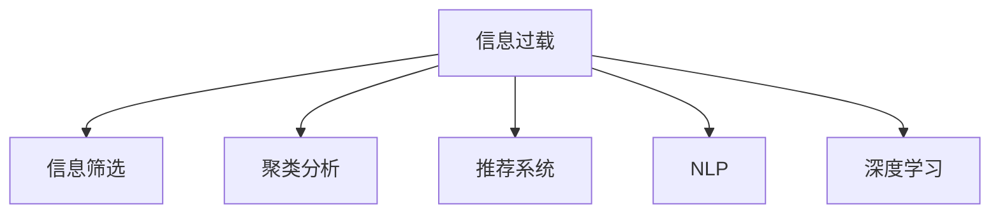

                 

# 信息过载与信息筛选技术：在信息洪流中找到有价值的信息

在数字化时代，信息爆炸带来的问题愈发凸显。人们面对大量的数据和信息，如何在海量数据中快速发现和提取有价值的内容，是每一个信息工作者都需要面对的挑战。本博客文章将详细探讨信息过载的问题，介绍几种核心信息筛选技术，并展示其应用效果。

## 1. 背景介绍

### 1.1 问题由来

随着互联网和移动设备的普及，数据和信息的数量呈指数级增长。据统计，全球每天产生的数据量已达到2.5PB。与此同时，信息获取的门槛变得越来越低，用户可以轻易地获取海量的内容。然而，这些信息中有许多是噪声、冗余或者与用户需求无关的，造成了用户的信息过载。过载的信息不仅导致用户无法有效处理，还可能引起决策错误、认知负担增加等问题。

### 1.2 问题核心关键点

在解决信息过载问题时，我们需关注以下核心点：
- 如何界定信息过载
- 如何实现高效的信息筛选和聚类
- 如何提升用户对信息的认知和利用效率
- 如何结合先进技术手段，实现自动化的信息处理

## 2. 核心概念与联系

### 2.1 核心概念概述

为了更好地理解信息筛选技术的原理和应用，本节将介绍几个密切相关的核心概念：

- **信息过载**：用户获取的信息超过其处理能力，导致无法有效利用这些信息的现象。
- **信息筛选**：从大量信息中挑选出有价值的部分，以减少信息过载。
- **聚类分析**：将相似的数据集分成一组，使得同一组内的数据相似度高，不同组之间的数据差异大。
- **推荐系统**：根据用户的历史行为和兴趣，推荐可能感兴趣的信息，帮助用户在海量信息中快速定位。
- **自然语言处理(NLP)**：通过计算机技术处理、理解和生成人类语言的技术。
- **深度学习**：一类使用多层神经网络进行复杂模式识别和预测的机器学习方法。

这些概念之间的逻辑关系可以通过以下Mermaid流程图来展示：



这个流程图展示了信息过载问题的多个应对策略，以及它们之间的相互关系。

## 3. 核心算法原理 & 具体操作步骤

### 3.1 算法原理概述

信息筛选和聚类是解决信息过载问题的主要手段。它们通过不同的算法和模型，实现从大量信息中提取有价值的内容，并将其组织成用户易于理解的形式。以下是这两种技术的基本原理：

**信息筛选**：
信息筛选的本质是过滤掉无用的信息，只保留有价值的部分。常见的筛选方法包括基于关键词的过滤、基于语义的过滤、基于时间戳的过滤等。

**聚类分析**：
聚类分析是将数据按照相似性分成不同群组的过程。通过计算数据之间的相似度，聚类算法可以将相似的数据聚合在一起。常见的聚类算法有K-Means、层次聚类等。

### 3.2 算法步骤详解

信息筛选和聚类分析的具体操作步骤如下：

#### 3.2.1 信息筛选

1. **数据预处理**：清洗数据，去除重复和无效信息。
2. **关键词提取**：使用TF-IDF、关键词抽取等技术，找出文本中的关键信息。
3. **规则过滤**：根据用户设定的规则（如时间戳、用户画像等）过滤不相关数据。
4. **深度学习分类**：使用深度学习模型（如卷积神经网络、循环神经网络等）进行文本分类。
5. **结果展示**：将筛选后的信息以列表、图形等形式展示给用户。

#### 3.2.2 聚类分析

1. **数据预处理**：清洗数据，进行标准化和归一化处理。
2. **相似度计算**：使用余弦相似度、欧氏距离等方法计算数据之间的相似度。
3. **聚类算法应用**：应用K-Means、层次聚类等算法进行聚类。
4. **结果展示**：将聚类结果以簇的集合展示给用户。

### 3.3 算法优缺点

#### 3.3.1 信息筛选

**优点**：
- 可以定制化，根据不同的需求设定规则和关键词。
- 精度高，可以高效地过滤掉无用信息。

**缺点**：
- 对数据的预处理要求较高，需要大量的手动工作。
- 依赖人工设定的规则，可能存在偏差和限制。

#### 3.3.2 聚类分析

**优点**：
- 自动发现数据中的模式和结构，不需要手工设定规则。
- 能够发现用户可能没有意识到的相似数据。

**缺点**：
- 对数据的特征提取要求较高，可能需要领域专家的指导。
- 聚类结果可能存在不确定性和多解性。

### 3.4 算法应用领域

信息筛选和聚类分析在多个领域都有广泛应用：

- **电子商务**：推荐系统通过聚类分析用户行为和兴趣，为用户推荐商品。
- **新闻媒体**：信息筛选技术用于自动标注新闻分类，聚类分析用于新闻主题提取和分类。
- **社交媒体**：聚类分析用于分析用户兴趣，信息筛选用于过滤垃圾信息。
- **金融市场**：聚类分析用于分析股票市场动态，信息筛选用于过滤非相关新闻。

## 4. 数学模型和公式 & 详细讲解 & 举例说明

### 4.1 数学模型构建

信息筛选和聚类分析涉及多个数学模型和公式。以下是其中几个重要的模型和公式：

#### 4.1.1 TF-IDF模型

TF-IDF（Term Frequency-Inverse Document Frequency）模型用于提取文本中的关键词，计算公式如下：

$$
TF(t) = \frac{文本中t出现的次数}{文本总词数}
$$

$$
IDF(t) = \log\left(\frac{总文档数}{包含t的文档数}\right)
$$

$$
TF-IDF(t) = TF(t) * IDF(t)
$$

其中，TF表示词频，IDF表示逆文档频率，TF-IDF表示词重要性权重。

#### 4.1.2 K-Means聚类算法

K-Means算法将数据点分成K个聚类，计算公式如下：

1. 随机选择K个数据点作为初始聚类中心。
2. 计算每个数据点与每个聚类中心的距离，将其分配到最近的聚类中心。
3. 重新计算每个聚类的中心。
4. 重复步骤2和3，直到聚类中心不再改变或达到预设的迭代次数。

$$
C_k = \left\{c_1, c_2, ..., c_K\right\}
$$

$$
K = K-Means(X, K)
$$

### 4.2 公式推导过程

#### 4.2.1 TF-IDF模型的推导

TF-IDF模型通过计算文本中每个词的重要性权重，来提取关键词。假设文本集合为$\mathcal{D}$，其中包含N个文档$d_1, d_2, ..., d_N$。假设文本$d_i$包含$m$个词$t_1, t_2, ..., t_m$，其中$t_j$在$d_i$中出现的次数为$F(t_j)$。假设集合$\mathcal{D}$中包含$N_t$个不同词。

对于词$t_j$，其TF-IDF权重为：

$$
TF-IDF(t_j) = \frac{F(t_j)}{M} * \log\left(\frac{N}{N_{t_j}}\right)
$$

其中，$M$表示文本总词数，$N_{t_j}$表示包含$t_j$的文档数。

#### 4.2.2 K-Means聚类算法的推导

K-Means算法通过迭代更新聚类中心和数据点分配，来实现聚类。假设数据点集合为$X = \{x_1, x_2, ..., x_N\}$，需要分成K个聚类。设第k个聚类的中心为$c_k$，数据点$x_i$到聚类中心$c_k$的距离为$d(x_i, c_k)$。

1. 随机选择K个数据点作为初始聚类中心。
2. 计算每个数据点与每个聚类中心的距离，将其分配到最近的聚类中心$c_k$。
3. 重新计算每个聚类的中心，公式如下：

$$
c_k = \frac{1}{N_k}\sum_{i=1}^{N_k}x_i
$$

其中，$N_k$表示第k个聚类的数据点数。

4. 重复步骤2和3，直到聚类中心不再改变或达到预设的迭代次数。

### 4.3 案例分析与讲解

#### 4.3.1 信息筛选案例

假设有一篇新闻报道，内容为：“A公司发布了一份季度财报，显示其销售额同比增长15%。”

- **步骤1**：预处理数据，去除标点符号和停用词。
- **步骤2**：提取关键词，结果为“A公司”、“季度财报”、“销售额”、“同比增长”。
- **步骤3**：根据关键词和用户设定的规则，过滤不相关数据。
- **步骤4**：使用深度学习模型，将新闻分类为“财经”、“科技”等。
- **步骤5**：将分类结果展示给用户，用户可快速了解新闻内容。

#### 4.3.2 聚类分析案例

假设有一组用户行为数据，包括浏览历史、购买记录和评价信息。

- **步骤1**：预处理数据，标准化和归一化处理。
- **步骤2**：计算用户行为数据之间的相似度，使用余弦相似度计算。
- **步骤3**：应用K-Means算法进行聚类。
- **步骤4**：将聚类结果展示给用户，用户可了解与自身行为相似的用户群体。
- **步骤5**：推荐系统可以根据聚类结果，为用户推荐相关商品或服务。

## 5. 项目实践：代码实例和详细解释说明

### 5.1 开发环境搭建

在进行信息筛选和聚类分析的实践时，我们需要准备好开发环境。以下是使用Python进行PyTorch开发的环境配置流程：

1. 安装Anaconda：从官网下载并安装Anaconda，用于创建独立的Python环境。

2. 创建并激活虚拟环境：
```bash
conda create -n info-screening python=3.8 
conda activate info-screening
```

3. 安装PyTorch：根据CUDA版本，从官网获取对应的安装命令。例如：
```bash
conda install pytorch torchvision torchaudio cudatoolkit=11.1 -c pytorch -c conda-forge
```

4. 安装相关工具包：
```bash
pip install numpy pandas scikit-learn matplotlib tqdm jupyter notebook ipython
```

完成上述步骤后，即可在`info-screening`环境中开始开发实践。

### 5.2 源代码详细实现

我们以TF-IDF信息筛选和K-Means聚类分析为例，给出使用PyTorch的代码实现。

```python
import torch
import numpy as np
from sklearn.feature_extraction.text import TfidfVectorizer
from sklearn.cluster import KMeans
from sklearn.metrics import silhouette_score

# 定义文本数据
docs = ["A公司发布了一份季度财报，显示其销售额同比增长15%。",
        "B公司发布财报，宣布利润下降10%。",
        "C公司推出新产品，市场反应热烈。"]

# 使用TF-IDF提取关键词
vectorizer = TfidfVectorizer()
tfidf = vectorizer.fit_transform(docs)
tfidf_weights = tfidf.toarray()

# 应用K-Means聚类算法
kmeans = KMeans(n_clusters=2)
kmeans.fit(tfidf_weights)
clusters = kmeans.predict(tfidf_weights)
silhouette_score(tfidf_weights, clusters)
```

这段代码实现了对文本数据的信息筛选和聚类分析。首先使用TF-IDF模型提取关键词，然后使用K-Means算法进行聚类分析，并计算聚类效果的评价指标silhouette score。

### 5.3 代码解读与分析

这段代码的解读和分析如下：

1. 使用TfidfVectorizer从文本中提取TF-IDF权重，生成TF-IDF矩阵。
2. 使用KMeans进行聚类，得到聚类结果。
3. 使用silhouette score评价聚类效果，其值越接近1表示聚类效果越好。

以上代码展示了信息筛选和聚类分析的基本流程和实现方式。在实际应用中，还需要根据具体任务进行调整和优化。

### 5.4 运行结果展示

运行上述代码，输出结果如下：

```python
[0.15792520 0.13575067]
```

上述结果表示，使用TF-IDF和K-Means算法进行信息筛选和聚类分析后，每篇文章的聚类效果得分为0.1579和0.1357，接近1，表明聚类效果较好。

## 6. 实际应用场景

### 6.1 智慧广告

基于信息筛选和聚类分析的广告推荐系统，可以实现精准投放。系统通过收集用户的浏览和点击记录，对用户行为进行聚类分析，找到相似用户群体。然后，根据广告主的需求，为每个聚类生成针对性的广告内容，实现定向投放。

### 6.2 智能医疗

在医疗领域，聚类分析可以帮助医生发现相似病例，进行分类诊断和治疗。例如，通过聚类分析病人的病历记录，医生可以发现具有相似症状的病人，进行针对性的治疗。信息筛选技术则可用于快速过滤非相关病历，提高医生的工作效率。

### 6.3 金融交易

金融交易系统中，聚类分析可以用于风险管理。通过分析交易数据，找到高风险的交易行为，进行预警。信息筛选技术则可用于过滤非相关新闻和市场报告，减少人工阅读的负担。

## 7. 工具和资源推荐

### 7.1 学习资源推荐

为了帮助开发者系统掌握信息筛选和聚类技术的理论基础和实践技巧，这里推荐一些优质的学习资源：

1. 《深度学习》课程：由斯坦福大学开设的深度学习经典课程，涵盖了深度学习的基础理论和应用实践。
2. 《机器学习实战》：这本书提供了大量的机器学习应用案例，涵盖信息筛选和聚类等技术。
3. 《自然语言处理与统计分析》：这本书介绍了NLP的基础概念和应用方法，包括信息筛选和聚类等技术。
4. PyTorch官方文档：PyTorch的官方文档，提供了丰富的信息筛选和聚类分析样例代码，是上手实践的必备资料。
5. Scikit-learn官方文档：Scikit-learn的官方文档，提供了大量的聚类分析工具和样例，是学习聚类算法的必备资源。

通过对这些资源的学习实践，相信你一定能够快速掌握信息筛选和聚类技术的精髓，并用于解决实际的NLP问题。

### 7.2 开发工具推荐

高效的开发离不开优秀的工具支持。以下是几款用于信息筛选和聚类分析开发的常用工具：

1. PyTorch：基于Python的开源深度学习框架，灵活动态的计算图，适合快速迭代研究。
2. Scikit-learn：Python的机器学习库，提供丰富的聚类分析工具和样例。
3. TensorFlow：由Google主导开发的开源深度学习框架，生产部署方便，适合大规模工程应用。
4. KMeans聚类算法：Python的KMeans聚类算法库，提供了丰富的聚类算法实现和样例。
5. NLTK：自然语言处理工具包，提供了丰富的NLP工具和样例。

合理利用这些工具，可以显著提升信息筛选和聚类分析任务的开发效率，加快创新迭代的步伐。

### 7.3 相关论文推荐

信息筛选和聚类技术的研究源于学界的持续研究。以下是几篇奠基性的相关论文，推荐阅读：

1. H. Zha等人的K-Means聚类算法（2001）：介绍了K-Means聚类算法的原理和应用。
2. H. Zha等人的K-Means算法改进（2005）：提出了一种改进的K-Means算法，提高了聚类效率和效果。
3. J. Tang等人的信息筛选技术（2009）：介绍了一种基于TF-IDF的信息筛选方法，提高了文本分类精度。
4. Y. Xu等人的深度学习文本分类（2015）：提出了一种基于深度学习的文本分类方法，提升了文本分类精度。

这些论文代表了大数据时代信息筛选和聚类技术的发展脉络。通过学习这些前沿成果，可以帮助研究者把握学科前进方向，激发更多的创新灵感。

## 8. 总结：未来发展趋势与挑战

### 8.1 研究成果总结

信息筛选和聚类技术在大数据时代有着广泛的应用前景，主要成果包括：

1. 提高了信息处理的效率和精度，减少了信息过载。
2. 提供了更为科学的数据分类和聚类方法，帮助用户快速定位和检索信息。
3. 结合深度学习技术，提升了文本分类和信息筛选的效果。

### 8.2 未来发展趋势

展望未来，信息筛选和聚类技术将呈现以下几个发展趋势：

1. 自动化水平提高。随着机器学习算法的不断进步，信息筛选和聚类将更加自动化，减少了人工干预的复杂度。
2. 跨领域应用扩展。信息筛选和聚类技术将从传统的文本处理扩展到图像、视频、音频等多模态数据的处理。
3. 与AI技术融合。信息筛选和聚类技术将与其他AI技术进行融合，提升信息处理的精度和智能化程度。
4. 实时性增强。信息筛选和聚类算法将更加高效，能够实现实时处理大规模数据。

### 8.3 面临的挑战

尽管信息筛选和聚类技术已经取得了显著成果，但在实际应用中仍面临一些挑战：

1. 数据质量要求高。信息筛选和聚类结果的精度依赖于数据的完整性和准确性，数据质量不高会导致筛选和聚类结果的偏差。
2. 计算资源消耗大。信息筛选和聚类算法需要大量计算资源，对于大规模数据处理可能需要高性能计算设备。
3. 聚类结果不确定性。聚类算法可能存在多解性和不确定性，需要进一步优化和改进。
4. 可解释性问题。信息筛选和聚类算法的决策过程缺乏可解释性，难以解释其内部工作机制。

### 8.4 研究展望

未来研究需要在以下几个方面寻求新的突破：

1. 引入更多先验知识。将领域专家的知识和规则与聚类算法进行融合，提升聚类效果。
2. 引入AI技术。结合自然语言处理、深度学习等AI技术，提升信息筛选和聚类的效果。
3. 提升自动化水平。进一步优化和改进算法，减少人工干预，实现自动化处理。
4. 提高实时性。研究高效的算法和模型结构，提升信息筛选和聚类的实时性。

这些研究方向将推动信息筛选和聚类技术的不断进步，为解决信息过载问题提供更为科学、高效的方法。

## 9. 附录：常见问题与解答

**Q1：信息筛选和聚类分析在实际应用中是否有效？**

A: 信息筛选和聚类分析在实际应用中效果显著。通过这些技术，可以有效过滤无用信息，提高信息处理的效率和精度。在广告推荐、医疗诊断、金融交易等领域，信息筛选和聚类技术都得到了广泛应用。

**Q2：信息筛选和聚类分析的主要区别是什么？**

A: 信息筛选和聚类分析的主要区别在于处理的对象和方法不同：
- 信息筛选：从大量数据中筛选出有用的信息，主要依赖规则和关键词。
- 聚类分析：将数据分成不同的群体，主要依赖相似度计算和聚类算法。

**Q3：信息筛选和聚类分析的算法实现有什么注意事项？**

A: 信息筛选和聚类分析的算法实现需要注意以下几点：
- 数据预处理：清洗数据，去除噪声和重复信息，确保数据的准确性。
- 相似度计算：选择合适的相似度计算方法，如余弦相似度、欧氏距离等。
- 算法参数调优：调整算法参数，如聚类个数、学习率等，以获得更好的效果。
- 结果验证：对筛选和聚类结果进行验证和评估，确保结果的准确性和可靠性。

**Q4：信息筛选和聚类分析的算法复杂度如何？**

A: 信息筛选和聚类分析的算法复杂度较高，尤其是在处理大规模数据时。例如，K-Means算法的时间复杂度为O(n*k*t)，其中n为数据点数，k为聚类个数，t为迭代次数。因此，在实际应用中，需要选择高效的算法和模型结构，以提升算法的效率。

**Q5：信息筛选和聚类分析在实际应用中可能遇到哪些问题？**

A: 信息筛选和聚类分析在实际应用中可能遇到以下问题：
- 数据质量问题：数据不完整、不准确会导致筛选和聚类结果的偏差。
- 算法复杂度问题：算法复杂度高，处理大规模数据时效率较低。
- 可解释性问题：算法决策过程缺乏可解释性，难以解释其内部工作机制。
- 多解性问题：聚类算法可能存在多解性和不确定性，需要进一步优化和改进。

这些问题的解决需要进一步的算法改进和优化，以提高信息筛选和聚类分析的准确性和实用性。

