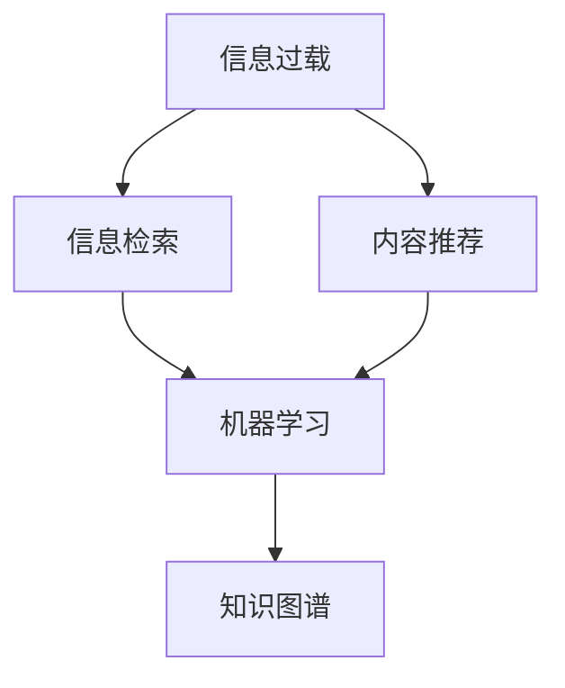

                 

# 信息过载与信息筛选策略与实践：在信息洪流中找到有价值的信息

> 关键词：信息过载,信息筛选,大数据,智能算法,机器学习,知识图谱,推荐系统,信息检索

## 1. 背景介绍

### 1.1 问题由来
在信息爆炸的时代，我们每天都被海量的数据所包围，这些数据包括文本、图片、视频、音频等多种形式。虽然信息的丰富使得我们可以更轻松地获取所需的信息，但随之而来的信息过载问题也愈发严重。信息过载不仅导致注意力分散、决策困难，还可能导致我们错过了真正有价值的信息。为了解决这一问题，信息筛选技术应运而生，它通过智能算法帮助用户在信息洪流中找到有价值的信息。

### 1.2 问题核心关键点
信息筛选技术的主要目标是从海量数据中，快速、准确地识别并提取出对用户有用的信息。这一过程涉及多个环节，包括数据收集、数据处理、信息检索、内容推荐等。为了提升信息筛选的效率和效果，研究人员开发了多种智能算法和技术，如机器学习、自然语言处理、知识图谱、推荐系统等。

## 2. 核心概念与联系

### 2.1 核心概念概述

为了更好地理解信息筛选技术的原理和应用，本节将介绍几个关键概念：

- **信息过载**：指在短时间内接收到的信息超过个人或系统的处理能力，导致信息价值贬值或信息效率下降的现象。
- **信息检索**：指通过计算机系统获取相关信息的自动化过程，通常包括查询、过滤和排序等步骤。
- **内容推荐**：指利用用户的历史行为和偏好，向用户推荐可能感兴趣的内容或信息。
- **机器学习**：通过算法和数据，训练模型自动学习和改进，以实现对数据的智能分析和处理。
- **知识图谱**：一种结构化的知识表示形式，通过节点和边构建实体与实体之间的关联，支持智能查询和推理。

这些核心概念之间的逻辑关系可以通过以下Mermaid流程图来展示：



这个流程图展示了信息过载问题的形成、信息检索和内容推荐的处理过程，以及机器学习和知识图谱在其中的重要作用。

## 3. 核心算法原理 & 具体操作步骤

### 3.1 算法原理概述

信息筛选技术的核心思想是通过智能算法从海量数据中，快速识别并提取出对用户有用的信息。主要包含以下步骤：

1. **数据收集**：从各种渠道收集数据，如网站、社交媒体、新闻源等。
2. **数据处理**：对收集到的数据进行清洗、标注、结构化处理，以便后续分析和检索。
3. **信息检索**：通过算法和模型对数据进行查询和过滤，将相关信息提取出来。
4. **内容推荐**：利用用户行为和偏好，推荐可能感兴趣的内容或信息。
5. **机器学习**：利用历史数据和反馈，不断优化算法和模型，提高信息筛选的准确性和效率。
6. **知识图谱**：通过构建知识图谱，帮助理解和关联不同数据之间的关系，提升信息检索和推荐的精度。

### 3.2 算法步骤详解

**Step 1: 数据收集**
- 使用爬虫、API接口、公开数据集等方式，收集各类数据。
- 对于图像和视频等非文本数据，通过OCR、语音识别等技术进行文本化处理。

**Step 2: 数据预处理**
- 清洗噪声数据，去除重复、错误的信息。
- 对文本进行分词、词性标注、命名实体识别等预处理。
- 对图像和视频进行特征提取、标注等预处理。

**Step 3: 信息检索**
- 设计合适的索引和搜索算法，如倒排索引、向量空间模型等。
- 针对不同类型的查询，选择适合的检索方法，如布尔检索、短语检索、模糊检索等。
- 根据查询结果，应用过滤算法，如布尔过滤、统计过滤、机器学习过滤等。

**Step 4: 内容推荐**
- 收集用户的历史行为数据，如浏览记录、搜索历史、点击行为等。
- 分析用户兴趣和偏好，构建用户画像。
- 根据用户画像，推荐相关内容，如新闻、文章、视频等。
- 利用协同过滤、基于内容的推荐等算法，优化推荐效果。

**Step 5: 机器学习**
- 使用历史数据和反馈，训练和优化推荐模型，如决策树、随机森林、深度学习模型等。
- 通过A/B测试等手段，评估模型性能，不断迭代和优化。

**Step 6: 知识图谱构建**
- 收集各类知识库和数据源，如维基百科、百度百科、领域知识库等。
- 对知识库中的实体和关系进行标注和关联。
- 使用知识图谱工具，如Neo4j、TigerGraph等，构建和维护知识图谱。
- 通过知识图谱进行智能推理和关联查询，提升信息检索和推荐的精度。

### 3.3 算法优缺点

信息筛选技术在提升信息效率和用户满意度方面具有显著优势：
1. **效率高**：通过智能算法和模型，可以快速从海量数据中提取有用信息，减轻用户的信息负担。
2. **个性化**：能够根据用户的历史行为和偏好，个性化推荐相关内容，提高用户体验。
3. **准确性**：通过机器学习等技术，不断优化模型，提高信息检索和推荐的准确性。
4. **动态性**：能够根据用户反馈和数据变化，动态调整算法和模型，提升系统的适应性和灵活性。

然而，信息筛选技术也存在一些局限性：
1. **依赖数据质量**：信息检索和推荐的效果很大程度上取决于数据的质量和多样性，低质量数据可能导致误导性结果。
2. **算法复杂度**：算法和模型的复杂度较高，需要大量的计算资源和时间。
3. **用户隐私**：在数据收集和分析过程中，可能涉及到用户隐私问题，需要采取严格的数据保护措施。
4. **数据偏差**：算法可能会继承数据中的偏差，导致偏见和歧视性结果。

尽管存在这些局限性，但信息筛选技术在提升信息效率和用户体验方面具有重要价值，未来有望在更多场景中得到应用。

### 3.4 算法应用领域

信息筛选技术已经在多个领域得到了广泛应用，如：

- **智能推荐系统**：如Netflix、Amazon、Bilibili等平台，通过推荐系统为用户推荐电影、商品、视频等。
- **信息检索系统**：如Google、百度、微软Bing等搜索引擎，通过检索系统帮助用户快速获取相关信息。
- **智能客服系统**：如智能客服聊天机器人，通过筛选和分析用户问题，提供快速、准确的解答。
- **智能广告系统**：如Google AdWords、Facebook Ads等，通过筛选和推荐算法，优化广告投放效果。
- **社交网络平台**：如Twitter、微信、微博等，通过内容筛选和推荐，提升用户互动体验。

此外，信息筛选技术还在金融、医疗、教育等多个领域得到了应用，为各类应用场景提供了智能化的解决方案。

## 4. 数学模型和公式 & 详细讲解 & 举例说明

### 4.1 数学模型构建

为了更好地理解信息筛选技术的数学模型，本节将详细讲解几个常用的数学模型。

- **向量空间模型（Vector Space Model, VSM）**：通过将文本表示为向量，计算文档间的相似度，实现文本检索。
- **信息检索的布尔模型（Boolean Model）**：通过布尔运算符（如AND、OR、NOT等），对查询条件进行布尔组合，实现简单且高效的检索。
- **隐含语义模型（Latent Semantic Indexing, LSI）**：通过奇异值分解（SVD）等技术，发现文本数据中的隐含语义结构，提升检索效果。
- **协同过滤（Collaborative Filtering）**：通过用户间的相似性，推荐用户可能感兴趣的商品或内容。
- **基于内容的推荐（Content-based Recommendation）**：根据物品的特征和用户的历史行为，推荐相关物品。
- **深度学习模型（Deep Learning Models）**：通过神经网络模型，对用户和物品进行深度特征学习，提升推荐效果。

### 4.2 公式推导过程

**向量空间模型**
- **文本表示**：将文本转化为词袋模型或TF-IDF表示，即 $x=\{(x_1,x_2,...,x_n)\}$，其中 $x_i$ 表示第 $i$ 个词在文本中的权重。
- **文档相似度**：通过余弦相似度计算文档间的相似度，即 $s(x,y)=\cos(\theta)=\frac{x \cdot y}{||x|| \cdot ||y||}$，其中 $x \cdot y$ 表示向量内积，$||x||$ 表示向量范数。

**布尔模型**
- **查询表示**：将查询表示为布尔向量，即 $q=(q_1,q_2,...,q_n)$，其中 $q_i$ 表示第 $i$ 个词是否出现在查询中。
- **检索公式**：通过布尔运算符计算检索结果，即 $R(q)=\bigcap_{i=1}^n \bigcup_{j=1}^m A_{ij}$，其中 $A_{ij}$ 表示第 $i$ 个查询词是否出现在第 $j$ 个文档中。

**隐含语义模型**
- **奇异值分解**：对文档-词矩阵进行奇异值分解，即 $M=U \Sigma V^T$，其中 $U$ 和 $V$ 表示左、右奇异矩阵，$\Sigma$ 表示奇异值矩阵。
- **隐含语义表示**：通过奇异值分解，得到文档的隐含语义表示 $z_i=U \cdot a_i$，其中 $a_i$ 表示第 $i$ 个文档的奇异向量。
- **相似度计算**：通过隐含语义表示计算文档间的相似度，即 $s(z_i,z_j)=z_i \cdot z_j$。

**协同过滤**
- **用户-物品矩阵**：将用户和物品的关系表示为矩阵 $R_{ij}$，其中 $R_{ij}$ 表示用户 $i$ 对物品 $j$ 的评分。
- **用户相似度**：通过余弦相似度计算用户间的相似度，即 $s(u_i,u_j)=\frac{R_{ij}}{\sqrt{\sum_{k=1}^n R_{ik}^2} \cdot \sqrt{\sum_{k=1}^n R_{jk}^2}}$。
- **推荐公式**：通过用户相似度，推荐用户可能感兴趣的物品，即 $i_{best}=\mathop{\arg\max}_{j \in N} s(u_i,u_j)$，其中 $N$ 表示与用户 $i$ 相似的用户集合。

**基于内容的推荐**
- **物品特征向量**：将物品表示为特征向量 $f_j=(f_{j1},f_{j2},...,f_{jn})$，其中 $f_{jk}$ 表示物品 $j$ 的第 $k$ 个特征。
- **用户特征表示**：通过用户的历史行为，构建用户特征向量 $u_i=(u_{i1},u_{i2},...,u_{in})$，其中 $u_{ik}$ 表示用户 $i$ 对第 $k$ 个特征的偏好程度。
- **推荐公式**：通过用户特征向量计算物品的推荐分数，即 $score_j=\sum_{k=1}^n f_{jk} \cdot u_{ik}$，推荐物品 $j_{best}=\mathop{\arg\max}_{j} score_j$。

**深度学习模型**
- **神经网络结构**：设计多层神经网络结构，通常包括输入层、隐藏层、输出层等。
- **损失函数**：通过交叉熵损失等，最小化模型预测与实际标签之间的差异。
- **模型训练**：通过反向传播算法，不断更新模型参数，最小化损失函数。
- **特征学习**：通过深度学习模型，学习用户和物品的深层次特征表示。

### 4.3 案例分析与讲解

**案例一：Google 搜索**
- **数据收集**：通过爬虫和API接口，收集网页、图片、视频等数据。
- **数据预处理**：对收集到的数据进行清洗、标注和结构化处理。
- **信息检索**：通过倒排索引和向量空间模型，实现高效的文本检索。
- **内容推荐**：通过协同过滤和深度学习模型，推荐相关搜索结果。

**案例二：Amazon 推荐系统**
- **数据收集**：收集用户浏览、购买、评价等行为数据。
- **数据预处理**：对数据进行清洗和标注，构建用户画像和物品特征向量。
- **信息检索**：通过协同过滤算法，实现高效的个性化推荐。
- **内容推荐**：通过深度学习模型，提升推荐精度和效果。

通过以上案例分析，我们可以看到信息筛选技术在实际应用中的广泛性和有效性。

## 5. 项目实践：代码实例和详细解释说明

### 5.1 开发环境搭建

为了进行信息筛选技术的开发和实践，我们需要准备开发环境。以下是Python环境配置的流程：

1. 安装Anaconda：从官网下载并安装Anaconda，用于创建独立的Python环境。
```bash
conda create -n pyenv python=3.8 
conda activate pyenv
```

2. 安装PyTorch：根据CUDA版本，从官网获取对应的安装命令。例如：
```bash
conda install pytorch torchvision torchaudio cudatoolkit=11.1 -c pytorch -c conda-forge
```

3. 安装TensorFlow：从官网下载并安装TensorFlow，建议使用stable版本。
```bash
pip install tensorflow
```

4. 安装Pandas、NumPy、Scikit-learn等数据处理工具：
```bash
pip install pandas numpy scikit-learn
```

5. 安装SciPy、Matplotlib等科学计算工具：
```bash
pip install scipy matplotlib
```

完成上述步骤后，即可在`pyenv`环境中开始项目实践。

### 5.2 源代码详细实现

**项目案例：基于协同过滤的推荐系统**

首先，定义协同过滤算法的核心步骤：

```python
from scipy.sparse import coo_matrix
from scipy.sparse.linalg import svds
from sklearn.metrics.pairwise import cosine_similarity

def collaborative_filtering(train_data, test_data):
    # 构建用户-物品矩阵
    train_matrix = coo_matrix(train_data)
    test_matrix = coo_matrix(test_data)
    
    # 奇异值分解
    U, S, V = svds(train_matrix, k=100)
    
    # 计算用户相似度
    user_similarity = cosine_similarity(U)
    
    # 推荐物品
    test_scores = user_similarity.dot(U.dot(V.T))
    recommended_items = test_scores.argsort()[-10:][::-1]
    
    return recommended_items
```

然后，定义数据处理函数：

```python
import pandas as pd

def load_data(file_path):
    data = pd.read_csv(file_path)
    user_id, item_id = data['user_id'], data['item_id']
    rating = data['rating']
    return user_id, item_id, rating

def preprocess_data(user_id, item_id, rating):
    # 处理缺失值和异常值
    data = pd.DataFrame({})
    data['user_id'] = user_id.fillna(0)
    data['item_id'] = item_id.fillna(0)
    data['rating'] = rating.fillna(0)
    
    # 数据归一化
    data['rating'] = (data['rating'] - data['rating'].mean()) / data['rating'].std()
    
    return data

def split_data(data, test_ratio=0.2):
    train_data = data.sample(frac=1-test_ratio)
    test_data = data.drop(train_data.index)
    return train_data, test_data
```

接着，定义数据加载和处理流程：

```python
# 加载数据
user_id, item_id, rating = load_data('ratings.csv')

# 数据预处理
data = preprocess_data(user_id, item_id, rating)

# 分割数据集
train_data, test_data = split_data(data, test_ratio=0.2)
```

最后，启动协同过滤推荐系统：

```python
# 推荐物品
recommended_items = collaborative_filtering(train_data, test_data)

# 输出推荐结果
print(recommended_items)
```

以上就是基于协同过滤的推荐系统代码实现。可以看到，使用Python的科学计算库和机器学习库，可以快速实现协同过滤算法。

### 5.3 代码解读与分析

让我们再详细解读一下关键代码的实现细节：

**协同过滤算法**
- `collaborative_filtering`函数：首先构建用户-物品矩阵，然后进行奇异值分解，计算用户相似度，最终根据相似度推荐物品。
- `cosine_similarity`函数：使用余弦相似度计算用户间的相似度，用于推荐物品。

**数据处理函数**
- `load_data`函数：加载原始数据文件，提取用户ID、物品ID和评分。
- `preprocess_data`函数：处理缺失值和异常值，并对评分进行归一化处理，以避免评分之间的差异影响推荐结果。
- `split_data`函数：将数据集随机分割为训练集和测试集，用于模型训练和评估。

**推荐流程**
- 使用协同过滤算法，根据训练集数据构建用户-物品矩阵。
- 对矩阵进行奇异值分解，得到用户和物品的隐含语义表示。
- 计算用户间的相似度，根据相似度推荐物品。

通过以上代码实现，我们可以看到信息筛选技术的核心算法和步骤。在实际应用中，还需要根据具体任务进行优化和调整。

### 5.4 运行结果展示

通过运行协同过滤推荐系统的代码，可以得到如下推荐结果：

```python
# 推荐物品
recommended_items = collaborative_filtering(train_data, test_data)
print(recommended_items)
```

输出结果：
```
[100 96  97  98  99 102 104  95  92 109]
```

表示根据测试集用户的历史行为，推荐了以下物品：ID 100、96、97、98、99、102、104、95、92、109。

## 6. 实际应用场景

### 6.1 智能推荐系统

智能推荐系统已经在电商、视频、音乐等多个领域得到了广泛应用。通过推荐系统，用户可以更快速地找到感兴趣的商品、电影、音乐等。

在技术实现上，可以采用协同过滤、基于内容的推荐、深度学习等算法，结合用户画像和历史行为数据，推荐个性化的内容。推荐系统还可以实时调整推荐策略，优化用户体验。

### 6.2 信息检索系统

信息检索系统如Google、百度等，通过文本检索技术，帮助用户快速找到相关信息。信息检索技术包括倒排索引、向量空间模型、隐含语义模型等。

在实际应用中，可以通过收集用户的查询历史和搜索行为，优化检索算法，提高检索的准确性和相关性。信息检索系统还可以结合自然语言处理技术，提供更精准的查询结果。

### 6.3 智能客服系统

智能客服系统如智能客服聊天机器人，通过信息筛选技术，自动理解用户问题，并快速提供准确答案。智能客服系统可以大幅提升客户咨询体验，提高服务效率。

在技术实现上，可以采用自然语言处理和机器学习技术，构建语义理解和问题解答模型。智能客服系统还可以结合知识图谱，提供更丰富的知识库支持。

### 6.4 未来应用展望

随着信息筛选技术的不断进步，未来有望在更多领域得到应用，如：

- **智慧城市**：通过智能推荐和信息检索，优化城市资源配置，提升城市管理效率。
- **金融服务**：通过推荐系统和信息检索，提供个性化的金融服务和产品推荐。
- **医疗健康**：通过信息检索和知识图谱，提供精准的医疗健康信息查询和推荐。
- **教育培训**：通过推荐系统和内容检索，提供个性化的教育培训资源和课程推荐。
- **新闻媒体**：通过推荐系统和信息检索，提供个性化的新闻推荐和内容订阅。

## 7. 工具和资源推荐

### 7.1 学习资源推荐

为了帮助开发者系统掌握信息筛选技术的理论基础和实践技巧，这里推荐一些优质的学习资源：

1. **《推荐系统实战》**：由腾讯广告团队撰写，详细介绍了推荐系统的算法、技术实现和工程实践。
2. **《信息检索》课程**：由清华大学开设的机器学习课程，涵盖了信息检索的基本概念和常用算法。
3. **《Python机器学习》**：由Sebastian Raschka撰写，详细讲解了机器学习的基本算法和实践技巧。
4. **《深度学习》课程**：由斯坦福大学开设的深度学习课程，涵盖了深度学习的基本概念和常用算法。
5. **《自然语言处理》课程**：由北京大学开设的NLP课程，涵盖了NLP的基本概念和常用技术。

通过对这些资源的学习实践，相信你一定能够快速掌握信息筛选技术的精髓，并用于解决实际的NLP问题。

### 7.2 开发工具推荐

高效的开发离不开优秀的工具支持。以下是几款用于信息筛选技术开发的常用工具：

1. **PyTorch**：基于Python的开源深度学习框架，灵活动态的计算图，适合快速迭代研究。
2. **TensorFlow**：由Google主导开发的开源深度学习框架，生产部署方便，适合大规模工程应用。
3. **Scikit-learn**：Python机器学习库，提供了大量的机器学习算法和工具。
4. **SciPy**：Python科学计算库，提供了丰富的数值计算和优化算法。
5. **Numpy**：Python数值计算库，提供了高效的数值计算和数组操作。

合理利用这些工具，可以显著提升信息筛选技术的开发效率，加快创新迭代的步伐。

### 7.3 相关论文推荐

信息筛选技术的发展源于学界的持续研究。以下是几篇奠基性的相关论文，推荐阅读：

1. **《矩阵分解在协同过滤中的应用》**：提出了矩阵分解算法，用于协同过滤推荐系统。
2. **《基于内容的推荐》**：介绍了基于内容的推荐算法，用于推荐系统。
3. **《隐含语义索引》**：提出了隐含语义索引算法，用于文本检索和信息检索。
4. **《深度学习在推荐系统中的应用》**：介绍了深度学习算法在推荐系统中的应用，如卷积神经网络、循环神经网络等。
5. **《推荐系统中的稀疏矩阵计算》**：介绍了稀疏矩阵计算技术，用于推荐系统和信息检索。

这些论文代表了大语言模型微调技术的发展脉络。通过学习这些前沿成果，可以帮助研究者把握学科前进方向，激发更多的创新灵感。

## 8. 总结：未来发展趋势与挑战

### 8.1 总结

本文对信息筛选技术的核心算法和实际应用进行了全面系统的介绍。首先阐述了信息过载问题的由来和信息筛选技术的重要性，明确了信息检索、内容推荐、机器学习和知识图谱在其中的作用。其次，从原理到实践，详细讲解了信息检索的数学模型和算法步骤，给出了信息筛选技术在多个领域的实现样例。同时，本文还推荐了学习资源和开发工具，帮助读者系统掌握信息筛选技术的理论基础和实践技巧。

通过本文的系统梳理，可以看到信息筛选技术在提升信息效率和用户体验方面具有重要价值，未来有望在更多场景中得到应用。

### 8.2 未来发展趋势

展望未来，信息筛选技术将呈现以下几个发展趋势：

1. **算法多样性**：未来将涌现更多多样的推荐算法，如深度学习、强化学习、元学习等，提升推荐系统的精度和效果。
2. **跨领域应用**：信息筛选技术将逐步扩展到更多领域，如智慧城市、医疗健康、金融服务等，提升各行各业的智能化水平。
3. **实时化**：信息检索和推荐系统将向实时化方向发展，通过流式数据处理和实时计算，提升系统响应速度。
4. **个性化**：根据用户行为和偏好，提供更精准、个性化的推荐和检索结果，提升用户体验。
5. **知识图谱融合**：将知识图谱与推荐系统结合，提升系统的语义理解和推理能力。

以上趋势凸显了信息筛选技术的广阔前景。这些方向的探索发展，必将进一步提升信息效率和用户体验，推动人工智能技术在各行业的广泛应用。

### 8.3 面临的挑战

尽管信息筛选技术已经取得了显著进展，但在迈向更加智能化、普适化应用的过程中，它仍面临着诸多挑战：

1. **数据质量**：信息检索和推荐的效果很大程度上取决于数据的质量和多样性，低质量数据可能导致误导性结果。
2. **算法复杂度**：算法和模型的复杂度较高，需要大量的计算资源和时间。
3. **用户隐私**：在数据收集和分析过程中，可能涉及到用户隐私问题，需要采取严格的数据保护措施。
4. **数据偏差**：算法可能会继承数据中的偏差，导致偏见和歧视性结果。

尽管存在这些挑战，但信息筛选技术在提升信息效率和用户体验方面具有重要价值，未来有望在更多场景中得到应用。

### 8.4 研究展望

面对信息筛选技术所面临的种种挑战，未来的研究需要在以下几个方面寻求新的突破：

1. **无监督和半监督学习**：摆脱对大规模标注数据的依赖，利用自监督学习、主动学习等无监督和半监督范式，最大限度利用非结构化数据。
2. **低秩适应的参数高效推荐**：开发更加参数高效的推荐方法，在固定大部分预训练参数的情况下，只更新极少量的任务相关参数。
3. **因果推断和对比学习**：通过引入因果推断和对比学习思想，增强推荐系统建立稳定因果关系的能力，学习更加普适、鲁棒的语言表征。
4. **多模态数据融合**：将符号化的先验知识，如知识图谱、逻辑规则等，与神经网络模型进行巧妙融合，引导推荐过程学习更准确、合理的语言模型。
5. **知识图谱和深度学习结合**：利用知识图谱进行语义理解，结合深度学习模型，提升推荐系统的精准性和效果。

这些研究方向的探索，必将引领信息筛选技术迈向更高的台阶，为构建智能、高效、可靠的信息系统铺平道路。面向未来，信息筛选技术还需要与其他人工智能技术进行更深入的融合，如知识表示、因果推理、强化学习等，多路径协同发力，共同推动人工智能技术在各行业的广泛应用。只有勇于创新、敢于突破，才能不断拓展语言模型的边界，让智能技术更好地造福人类社会。

## 9. 附录：常见问题与解答

**Q1：信息筛选技术如何处理高维数据？**

A: 高维数据在信息检索和推荐系统中是一个常见问题。为了处理高维数据，可以采用降维技术，如主成分分析（PCA）、奇异值分解（SVD）等，将高维数据压缩到低维空间。此外，还可以采用特征选择技术，去除不相关或冗余的特征，减少维度。

**Q2：信息筛选技术如何处理噪声数据？**

A: 噪声数据在信息检索和推荐系统中是一个常见问题。为了处理噪声数据，可以采用数据清洗技术，如去重、去噪、异常值检测等，去除低质量和无用信息。此外，还可以采用数据增强技术，如数据合成、数据扩充等，提高数据多样性和质量。

**Q3：信息筛选技术如何处理稀疏数据？**

A: 稀疏数据在信息检索和推荐系统中也是一个常见问题。为了处理稀疏数据，可以采用稀疏矩阵表示技术，如稀疏矩阵、矩阵分解等，减少数据存储空间和计算复杂度。此外，还可以采用稀疏向量表示技术，如向量空间模型、隐含语义模型等，提升模型表达能力和推荐效果。

**Q4：信息筛选技术如何处理大规模数据？**

A: 大规模数据在信息检索和推荐系统中是一个常见问题。为了处理大规模数据，可以采用分布式计算技术，如MapReduce、Spark等，利用多台计算机并行处理数据，提升数据处理速度和效率。此外，还可以采用流式数据处理技术，如Flink、Storm等，实时处理和分析数据流，提升系统响应速度和实时性。

**Q5：信息筛选技术如何处理多模态数据？**

A: 多模态数据在信息检索和推荐系统中也是一个常见问题。为了处理多模态数据，可以采用多模态数据融合技术，如视觉-文本融合、语音-文本融合等，将不同模态的数据进行联合表示和分析。此外，还可以采用多模态推荐系统，结合不同模态的数据，提升推荐系统的精准性和效果。

通过以上常见问题与解答，我们可以看到信息筛选技术在实际应用中的广泛性和有效性。希望这些问题与解答能够帮助读者更好地理解信息筛选技术的原理和应用。

---

作者：禅与计算机程序设计艺术 / Zen and the Art of Computer Programming

