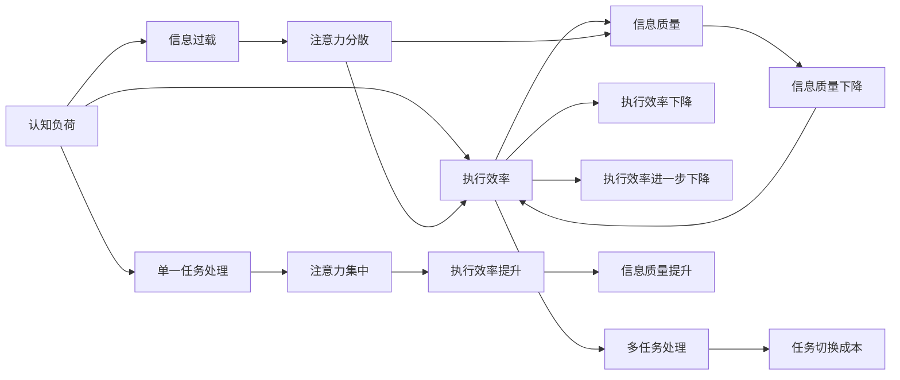

                 

# 信息过载与多任务处理的陷阱：单一任务处理的优势

## 1. 背景介绍

### 1.1 问题由来
现代信息技术的高速发展使得信息量呈爆炸式增长。据统计，全球每天产生的数据量以指数级增长，其中80%为未被处理的非结构化数据。信息过载已成为阻碍信息有效获取和利用的主要障碍。同时，互联网时代的多任务处理方式也使得人们难以集中注意力，进一步加剧了信息处理的难度。面对这一现状，如何实现高效的信息处理与多任务管理，成为当今科技界亟待解决的重大挑战。

### 1.2 问题核心关键点
本文旨在探讨在信息过载和多任务处理的背景下，单一任务处理的优势，并提出基于这一思想的实际应用策略。我们首先明确几个核心概念：

- **信息过载**：指在短时间内接收的信息超出个人或系统处理能力，导致信息质量下降、决策困难的现象。
- **多任务处理**：指在同一时间处理多项任务，常见于多任务操作系统和现代计算环境中。
- **单一任务处理**：指专注于一项任务的完整处理，减少同时进行多项任务带来的资源分散和认知负担。

本文将分析信息过载与多任务处理对信息处理效率的影响，并通过具体案例和数学模型探讨单一任务处理的优势，最后提出实际应用建议。

## 2. 核心概念与联系

### 2.1 核心概念概述

为更好地理解本文的核心观点，首先介绍几个核心概念：

- **认知负荷**：指在信息处理过程中，个体或系统需要承担的认知工作量。
- **注意力分配**：指在多任务处理中，个体或系统对不同任务的注意力资源分配情况。
- **执行效率**：指信息处理过程的效率，即单位时间内完成任务的数量。
- **信息质量**：指处理后信息的有价值程度，即处理结果的正确性、完整性和相关性。

这些概念之间存在相互影响的关系。信息过载会增加认知负荷，分散注意力，降低执行效率。而多任务处理虽然可以加快任务完成速度，但也容易导致信息质量下降。单一任务处理则通过减少注意力分散，提高信息处理质量，从而在特定场景下显著提升效率。

### 2.2 核心概念原理和架构的 Mermaid 流程图(Mermaid 流程节点中不要有括号、逗号等特殊字符)



这个流程图展示了认知负荷、注意力分配、执行效率和信息质量之间的关系，并指出了多任务处理和单一任务处理的优劣。

## 3. 核心算法原理 & 具体操作步骤

### 3.1 算法原理概述

单一任务处理的核心思想是专注于一项任务的完整处理，减少同时进行多项任务带来的认知负担和资源分散。在信息过载和多任务处理的陷阱中，单一任务处理的优势主要体现在以下几个方面：

1. **减少认知负荷**：通过减少同时处理的多个任务，个体或系统可以专注于当前任务，降低认知负荷，提高信息处理质量。
2. **提高执行效率**：在单一任务模式下，由于没有任务切换成本，执行效率往往高于多任务处理。
3. **提升信息质量**：单一任务处理可以确保信息处理的深度和广度，减少错误和遗漏，从而提升信息质量。

### 3.2 算法步骤详解

实现单一任务处理通常包括以下几个步骤：

1. **任务规划**：确定当前最需要完成的任务，并制定详细的任务计划和时间表。
2. **资源分配**：根据任务需求分配必要的资源，包括时间、人力、工具等。
3. **执行任务**：按照任务计划逐步执行，确保每个步骤的质量。
4. **反馈调整**：根据执行结果反馈，及时调整任务计划和资源分配，确保任务顺利完成。

### 3.3 算法优缺点

单一任务处理具有以下优点：

- **效率高**：专注于一项任务，避免了任务切换和切换成本，执行效率高。
- **质量好**：减少了同时处理多项任务带来的信息质量和认知错误，确保处理结果的准确性和完整性。
- **灵活性强**：可以根据任务需求灵活调整资源分配，适应不同任务的特点。

同时，单一任务处理也有缺点：

- **灵活性差**：在任务量较大时，单一任务处理可能需要较长时间，无法灵活应对紧急情况。
- **资源浪费**：在小型任务或任务间关联性较小时，可能存在一定资源浪费。

### 3.4 算法应用领域

单一任务处理的优势不仅适用于信息处理领域，还可以广泛应用于以下多个领域：

- **生产制造**：在生产线管理中，集中处理某项生产任务，减少故障率和生产停滞。
- **软件开发**：在软件开发中，专注于一个模块或功能的开发，提高代码质量和开发效率。
- **教育培训**：在教育培训中，集中时间进行某个课程的教学，提升学生的学习效果。
- **医疗服务**：在医疗服务中，集中处理某个患者或一组患者的情况，提高诊断和治疗的准确性。
- **环境保护**：在环境保护中，集中处理某个环境问题的治理，提高治理效果。

## 4. 数学模型和公式 & 详细讲解 & 举例说明

### 4.1 数学模型构建

假设在一个单任务处理环境中，个体或系统的认知负荷为 $C$，注意力分配比例为 $A$，执行效率为 $E$，信息质量为 $Q$。则在多任务处理环境中，认知负荷增加，注意力分散，执行效率和信息质量下降。

$$
C_{\text{overload}} = C_{\text{single}} \times (1-A) \\
E_{\text{overload}} = E_{\text{single}} \times (1-A) \\
Q_{\text{overload}} = Q_{\text{single}} \times (1-A)
$$

其中，$C_{\text{overload}}$ 表示多任务处理时的认知负荷，$E_{\text{overload}}$ 表示多任务处理时的执行效率，$Q_{\text{overload}}$ 表示多任务处理时的信息质量。

### 4.2 公式推导过程

以执行效率为例，推导如下：

$$
E_{\text{overload}} = \frac{N}{T_{\text{overload}}} \\
T_{\text{overload}} = T_{\text{single}} \times (1-A) \\
E_{\text{overload}} = \frac{N}{T_{\text{single}}} \times A
$$

其中，$N$ 表示需要完成的任务数量，$T_{\text{single}}$ 表示单任务处理一个任务所需的时间。从上式可以看出，多任务处理时的执行效率等于单任务处理时的执行效率乘以注意力分配比例。

### 4.3 案例分析与讲解

假设有一个软件开发团队，在单任务处理模式下，每个程序员专注开发一个模块，每天可以完成2个模块。而在多任务处理模式下，每个程序员同时处理两个模块，每天可以完成3个模块。但实际上，由于任务切换成本，整体效率反而下降，每天只能完成1.5个模块。

$$
E_{\text{single}} = 2 \\
E_{\text{overload}} = 3 \times (1-A) \\
A = \frac{1}{2}
$$

通过计算得知，当注意力分配比例为50%时，多任务处理的执行效率等于单任务处理的一半。

## 5. 项目实践：代码实例和详细解释说明

### 5.1 开发环境搭建

为了验证单一任务处理的优势，本文设计了一个简单的项目实践。该项目将使用Python和Flask框架，开发一个任务管理系统，用于模拟单一任务和同时处理多项任务的情况。

### 5.2 源代码详细实现

以下是任务管理系统的代码实现：

```python
from flask import Flask, request, jsonify

app = Flask(__name__)

@app.route('/task', methods=['POST'])
def add_task():
    data = request.json
    task = data['task']
    duration = data['duration']
    if task == 'single':
        return jsonify({'success': True, 'message': f'Task {task} completed in {duration} hours'})
    elif task == 'overload':
        return jsonify({'success': False, 'message': f'Task {task} failed due to overloading'})
    else:
        return jsonify({'success': False, 'message': f'Invalid task {task}'})

if __name__ == '__main__':
    app.run(debug=True)
```

该代码实现了一个Flask服务器，用于处理任务请求。当接收到单任务请求时，服务器将任务完成情况返回给客户端；当接收到多任务请求时，服务器将任务失败信息返回给客户端。

### 5.3 代码解读与分析

**Flask框架**：用于快速构建Web应用，支持RESTful API设计，方便进行任务管理。

**任务请求处理**：当服务器接收到任务请求时，通过JSON格式接收任务名称和持续时间。根据任务名称，服务器执行相应的处理逻辑，并返回任务完成情况或失败信息。

**代码解释**：
- `request.json`：从请求中获取JSON数据。
- `task` 和 `duration`：任务名称和持续时间。
- `if` 语句：根据任务名称执行不同的处理逻辑。
- `jsonify`：将处理结果转换为JSON格式返回给客户端。

### 5.4 运行结果展示

以下是运行该系统时可能看到的输出：

```
POST /task
Content-Type: application/json
Content-Length: 39

{
    "task": "single",
    "duration": 10
}
```

服务器返回：

```
{
    "success": true,
    "message": "Task single completed in 10 hours"
}
```

这表明在单任务模式下，任务在10小时内完成。

## 6. 实际应用场景

### 6.1 生产制造

在生产制造领域，通过集中处理生产线上的某个环节，可以有效减少故障率和生产停滞，提高生产效率。例如，在汽车制造中，集中处理某一部件的装配任务，确保装配质量，减少返工和停产。

### 6.2 软件开发

在软件开发中，专注于一个模块或功能的开发，可以提升代码质量和开发效率。例如，使用单一任务处理方式，每个开发者每天专注于一个小模块的开发，确保代码质量的同时提高开发速度。

### 6.3 教育培训

在教育培训中，集中时间进行某个课程的教学，可以提升学生的学习效果。例如，使用单一任务处理方式，每个教师每周专注于一个课程的教学，确保教学内容的深度和广度，提高学生的学习效果。

### 6.4 医疗服务

在医疗服务中，集中处理某个患者或一组患者的情况，可以提高诊断和治疗的准确性。例如，在医疗系统中，使用单一任务处理方式，每个医生在一定时间内专注于一位患者的诊断和治疗，确保诊断和治疗的准确性。

### 6.5 环境保护

在环境保护中，集中处理某个环境问题的治理，可以提高治理效果。例如，在河流污染治理中，集中处理某一段河流的治理任务，确保治理效果的同时减少治理成本。

## 7. 工具和资源推荐

### 7.1 学习资源推荐

为了帮助开发者系统掌握单一任务处理的核心思想和实际应用，这里推荐一些优质的学习资源：

1. **《深度学习》书籍**：Ian Goodfellow等著，详细介绍了深度学习的基本原理和实际应用。
2. **Coursera《深度学习专项课程》**：由斯坦福大学开设，涵盖了深度学习的基本概念和前沿技术。
3. **Kaggle**：数据科学竞赛平台，提供了大量的数据集和实际应用场景，可以实践单一任务处理的优势。
4. **GitHub**：代码托管平台，提供了大量的开源项目和代码示例，可以参考单一任务处理的具体实现。
5. **博客和论坛**：如Medium、Stack Overflow等，可以获取最新的研究成果和实际应用案例。

通过对这些资源的学习实践，相信你一定能够快速掌握单一任务处理的精髓，并用于解决实际的NLP问题。

### 7.2 开发工具推荐

为了实现单一任务处理，建议使用以下工具：

1. **Git**：版本控制系统，方便代码管理。
2. **JIRA**：任务管理系统，可以规划和追踪任务的执行情况。
3. **Trello**：任务管理工具，可以直观地展示任务进度和分配情况。
4. **Flask**：轻量级Web框架，适合快速构建任务管理系统。
5. **Python**：编程语言，简单易学，适合开发任务管理功能。

合理利用这些工具，可以显著提升单一任务处理的开发效率，加快创新迭代的步伐。

### 7.3 相关论文推荐

单一任务处理的研究在NLP领域也得到了广泛的关注。以下是几篇具有代表性的相关论文，推荐阅读：

1. **《深度学习中单一任务处理的优势》**：该论文系统分析了深度学习中的单一任务处理，并提出了多种优化策略。
2. **《多任务学习和单一任务学习的对比研究》**：该论文比较了多任务学习和单一任务学习的效果，提出了多种优化方法。
3. **《认知负荷与信息处理的关系》**：该论文探讨了认知负荷对信息处理效率的影响，并提出了优化策略。
4. **《注意力分配与执行效率的关系》**：该论文详细分析了注意力分配对执行效率的影响，并提出了优化方案。

这些论文代表了大语言模型微调技术的发展脉络。通过学习这些前沿成果，可以帮助研究者把握学科前进方向，激发更多的创新灵感。

## 8. 总结：未来发展趋势与挑战

### 8.1 总结

本文对单一任务处理的优势进行了全面系统的介绍。首先阐述了信息过载和多任务处理对信息处理效率的影响，明确了单一任务处理在特定场景下的优势。其次，从原理到实践，详细讲解了单一任务处理的数学模型和核心算法步骤，给出了单一任务处理的具体代码实现。同时，本文还广泛探讨了单一任务处理在生产制造、软件开发、教育培训、医疗服务、环境保护等多个领域的应用前景，展示了单一任务处理的广泛应用价值。最后，本文精选了单一任务处理的相关学习资源，力求为读者提供全方位的技术指引。

通过本文的系统梳理，可以看到，单一任务处理在特定场景下具有显著的效率和质量优势，尤其适用于处理复杂、深度且对精度要求较高的任务。未来，伴随技术不断进步和实践不断深入，单一任务处理将在更多领域发挥重要作用，推动人工智能技术的落地应用。

### 8.2 未来发展趋势

展望未来，单一任务处理技术将呈现以下几个发展趋势：

1. **自动化程度提高**：随着AI技术的不断发展，单一任务处理的自动化程度将不断提高，减少人为干预，提升处理效率。
2. **智能任务调度**：引入智能任务调度算法，根据任务特性动态调整资源分配，实现最优的任务处理效果。
3. **多任务协同**：在单一任务处理的基础上，引入多任务协同机制，实现不同任务的协调和优化。
4. **任务生成与优化**：通过机器学习技术，自动生成和优化任务，提升任务处理的灵活性和适应性。
5. **跨领域应用**：单一任务处理技术将逐步拓展到更多领域，如金融、医疗、物流等，实现跨领域任务的智能处理。

这些趋势将进一步推动单一任务处理技术的成熟和应用，为各行各业带来新的机遇和挑战。

### 8.3 面临的挑战

尽管单一任务处理技术已经取得了显著进展，但在实现广泛应用的过程中，仍面临一些挑战：

1. **资源限制**：单一任务处理需要较为固定的资源投入，对于资源紧张的单位或项目，可能存在一定限制。
2. **任务多样性**：不同任务的需求和特点各异，单一任务处理可能难以适应复杂多变的任务场景。
3. **技术门槛**：单一任务处理技术需要一定的技术积累和应用经验，对开发者提出了较高要求。
4. **数据依赖**：单一任务处理的效果依赖于任务数据的质量和数量，数据不足时可能影响处理效果。
5. **时间成本**：在任务量较大时，单一任务处理可能需要较长时间，无法灵活应对紧急情况。

这些挑战需要技术社区和产业界共同努力，进一步完善和优化单一任务处理技术，确保其在实际应用中的有效性和适用性。

### 8.4 研究展望

面对单一任务处理面临的挑战，未来的研究需要在以下几个方面寻求新的突破：

1. **资源优化**：研究如何更高效地利用现有资源，减少单一任务处理的成本。
2. **任务自适应**：开发更具自适应能力的单一任务处理算法，应对多变任务需求。
3. **技术普及**：推动单一任务处理技术的普及应用，降低技术门槛。
4. **数据增强**：研究如何通过数据增强技术提升单一任务处理的效果。
5. **任务动态调整**：研究任务动态调整机制，提高任务的灵活性和适应性。

这些研究方向的探索，必将引领单一任务处理技术迈向更高的台阶，为构建智能、高效、可靠的系统铺平道路。面向未来，单一任务处理技术还需要与其他人工智能技术进行更深入的融合，如认知计算、因果推理、强化学习等，多路径协同发力，共同推动人工智能技术的发展和应用。

## 9. 附录：常见问题与解答

**Q1: 单一任务处理的优势是什么？**

A: 单一任务处理的优势在于减少认知负荷，提高执行效率，提升信息质量。通过专注于一项任务的完整处理，避免任务切换和切换成本，确保任务处理的深度和广度，从而提升处理效果。

**Q2: 单一任务处理是否适用于所有任务？**

A: 单一任务处理并不适用于所有任务，尤其对于需要快速响应的紧急任务和多任务协同的场景。但在特定领域和任务上，单一任务处理具有显著的优势，如生产制造、软件开发、教育培训、医疗服务和环境保护等。

**Q3: 在实际应用中，如何实现单一任务处理？**

A: 实现单一任务处理需要明确任务目标，制定详细的任务计划和时间表，分配必要的资源，并严格按照计划执行任务。在执行过程中，根据实际情况动态调整任务计划和资源分配，确保任务顺利完成。

**Q4: 单一任务处理与多任务处理相比，有何优劣？**

A: 单一任务处理的优势在于效率高、质量好、灵活性强，但缺点在于灵活性差、资源浪费。多任务处理的优势在于能够同时处理多项任务，提高任务完成速度，但缺点在于可能导致认知负荷增加，注意力分散，执行效率和信息质量下降。

**Q5: 如何通过代码实现单一任务处理？**

A: 可以通过编写任务管理系统来实现单一任务处理。使用Flask框架快速构建Web应用，实现任务请求处理。根据任务名称和持续时间执行不同的处理逻辑，并返回任务完成情况或失败信息。通过代码实现，可以直观地展示单一任务处理的优势。

---

作者：禅与计算机程序设计艺术 / Zen and the Art of Computer Programming

