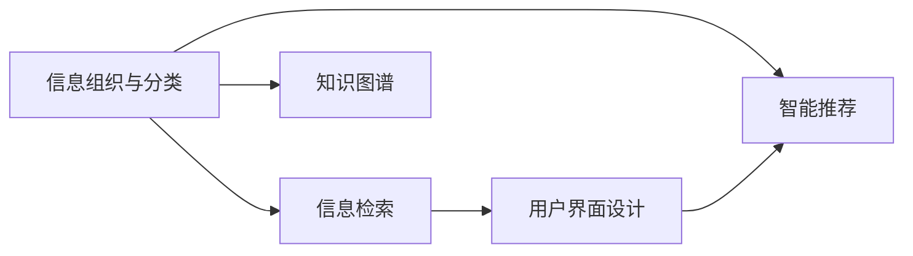

                 

# 信息过载与知识管理系统实施指南：有效组织和检索信息

## 1. 背景介绍

### 1.1 问题由来
在当今信息爆炸的时代，人类面临前所未有的信息过载问题。根据数据统计，全球每天产生的新信息超过1.5EB，远超全球图书馆累积的纸质资料。如此庞大的信息量，给个人和组织带来了严重的知识获取和处理难题。如何在海量信息中找到对自己有用的知识，成为当前亟待解决的问题。

信息过载问题不仅出现在工作中，也出现在生活中。例如，我们每天接收的新闻、邮件、社交媒体消息、广告等，数量巨大，且内容质量参差不齐。如何在信息海洋中快速筛选出有价值的内容，如何构建高效的知识管理体系，成为一个值得深入探讨的话题。

### 1.2 问题核心关键点
针对信息过载问题，核心关键点在于如何有效地组织和检索信息。主要包含以下几方面：
- 数据组织：如何对海量数据进行结构化、分类化、标签化的处理。
- 信息检索：如何构建高效的信息检索系统，快速找到需要的知识。
- 知识图谱：如何将知识结构化表示，形成语义化的知识图谱。
- 智能推荐：如何基于用户行为，动态生成个性化推荐结果。
- 用户感知：如何设计直观友好的用户界面，提升用户体验。

这些问题在知识管理系统的实施过程中，都需要得到有效解决。以下将逐一探讨如何针对这些问题设计解决方案。

## 2. 核心概念与联系

### 2.1 核心概念概述

为更好地理解如何有效组织和检索信息，首先介绍几个核心概念：

- **信息组织与分类**：指通过一定的规则和算法，将海量信息进行结构化、标签化的处理，方便后续检索和利用。

- **信息检索**：指通过算法和模型，从海量信息中快速找到与用户查询相关的信息。常见方法包括基于关键词的检索、基于语义的检索等。

- **知识图谱**：指将结构化知识以图谱的形式表示，形成语义化的知识体系，方便进行知识的获取、检索和推理。

- **智能推荐系统**：指基于用户行为、兴趣等信息，通过算法动态生成个性化推荐结果，提升用户获取信息的效率。

- **用户界面设计**：指设计直观友好的用户界面，提升用户的操作体验，降低使用门槛。

这些概念之间存在紧密的联系，共同构成知识管理系统的核心架构。以下通过一张Mermaid流程图展示它们之间的关系：



## 3. 核心算法原理 & 具体操作步骤

### 3.1 算法原理概述

知识管理系统涉及的算法原理主要包括以下几个方面：

1. **数据清洗与预处理**：通过去除重复、无关、噪声数据，将信息转换为可供进一步处理的形式。
2. **信息分类与标签化**：通过分类算法将信息分为不同的类别，并打上标签。
3. **语义表示与建模**：通过语义表示方法，将信息转换为机器可理解的向量形式。
4. **信息检索算法**：通过索引构建和查询优化，快速找到与用户查询相关的信息。
5. **知识图谱构建**：通过图谱构建算法，将知识表示为语义化的图形结构。
6. **智能推荐算法**：通过协同过滤、内容推荐、混合推荐等算法，生成个性化推荐结果。

### 3.2 算法步骤详解

以下详细介绍每个核心算法的详细步骤：

**3.2.1 数据清洗与预处理**：
1. **数据收集**：通过爬虫、API接口等方式，收集相关的数据源。
2. **数据去重**：通过哈希、计算校验和等方式，去除重复数据。
3. **数据清洗**：过滤掉无用、噪声数据，保证数据质量。
4. **数据归一化**：将数据转换为标准格式，便于后续处理。
5. **特征提取**：从数据中提取有意义的特征，如文本的词频、TF-IDF等。

**3.2.2 信息分类与标签化**：
1. **选择分类算法**：如朴素贝叶斯、决策树、随机森林等，根据具体需求选择算法。
2. **特征选择**：选择最能代表类别的特征，以提高分类效果。
3. **模型训练**：使用标注数据训练分类模型，生成分类器。
4. **信息标注**：将信息输入分类器，得到对应的类别或标签。

**3.2.3 语义表示与建模**：
1. **文本分词**：将文本拆分为词语或词组。
2. **词向量表示**：通过Word2Vec、GloVe等方法，将词语转换为向量形式。
3. **语义建模**：通过语义表示算法，如BERT、ELMo等，将句子或段落表示为语义化的向量。

**3.2.4 信息检索算法**：
1. **索引构建**：将信息转换为可搜索的索引，如倒排索引、向量索引等。
2. **查询优化**：通过关键词匹配、向量相似度计算等方式，优化查询结果。
3. **排序与返回**：根据查询结果，按相关性排序，并返回前N个结果。

**3.2.5 知识图谱构建**：
1. **知识抽取**：从语料库中抽取实体、关系等信息。
2. **关系建模**：建立实体之间的关系，形成图谱结构。
3. **图谱存储**：使用图数据库或图形结构存储知识图谱。

**3.2.6 智能推荐算法**：
1. **用户建模**：通过用户行为、历史数据等方式，构建用户画像。
2. **物品建模**：通过物品属性、标签等方式，构建物品特征。
3. **推荐算法**：选择协同过滤、内容推荐等算法，生成推荐结果。

### 3.3 算法优缺点

#### 3.3.1 信息分类与标签化
**优点**：
- 通过分类，可以快速获取信息所属类别。
- 通过标签，可以实现信息的高效检索。
- 可以处理大规模数据集。

**缺点**：
- 分类器需要大量标注数据，成本较高。
- 分类效果受算法、数据质量等因素影响。

#### 3.3.2 语义表示与建模
**优点**：
- 通过语义表示，可以将文本转换为机器可理解的形式。
- 可以处理自然语言文本，适用于文本挖掘任务。
- 可以提高信息检索的准确度。

**缺点**：
- 语义建模需要大量的语料库，训练成本较高。
- 模型的解释性较弱。

#### 3.3.3 信息检索算法
**优点**：
- 可以快速定位与查询相关的信息。
- 可以处理海量数据，效率较高。
- 可以动态更新索引，适应数据变化。

**缺点**：
- 索引构建和查询优化较为复杂。
- 对索引数据的要求较高，可能影响检索速度。

#### 3.3.4 知识图谱构建
**优点**：
- 可以构建语义化的知识体系，方便知识获取和推理。
- 可以支持复杂的知识推理任务。
- 可以通过自动化方式更新知识图谱。

**缺点**：
- 图谱构建需要处理复杂的实体关系，技术难度较大。
- 图谱存储和查询效率较低，需要优化。

#### 3.3.5 智能推荐算法
**优点**：
- 可以通过用户行为，生成个性化推荐结果。
- 可以处理大规模用户数据，提升用户体验。
- 可以动态调整推荐策略，提升推荐效果。

**缺点**：
- 推荐算法依赖用户行为数据，数据隐私问题较难解决。
- 算法复杂度较高，训练成本较高。

### 3.4 算法应用领域

基于上述算法原理，知识管理系统可以应用于多个领域：

1. **学术研究**：学术数据库和文献管理系统，支持文献分类、知识图谱构建、智能推荐等。
2. **企业知识管理**：企业知识库、文档管理系统，支持文档分类、搜索、推荐等。
3. **医疗健康**：电子病历管理系统、医疗知识库，支持医疗信息检索、知识图谱构建等。
4. **金融服务**：金融数据管理、智能投顾系统，支持金融数据分类、推荐等。
5. **教育培训**：在线教育平台、知识管理系统，支持课程分类、推荐等。

## 4. 数学模型和公式 & 详细讲解 & 举例说明

### 4.1 数学模型构建

本节将使用数学语言对知识管理系统的核心算法进行更加严格的刻画。

记信息集合为 $I=\{d_1,d_2,\dots,d_n\}$，其中每个信息 $d_i$ 表示为文本、图片等形式，将其转换为向量形式为 $v_i$。

定义分类器为 $f(d_i|\mathbf{X})$，其中 $\mathbf{X}$ 为特征向量，即 $v_i$。分类器输出信息 $d_i$ 属于类别的概率为 $p(c|d_i)$。

定义信息检索模型为 $M(v_i,q)$，其中 $q$ 为查询向量，$M(v_i,q)$ 表示 $v_i$ 与 $q$ 的相关度。

定义知识图谱为 $G=(E, R)$，其中 $E$ 为实体集合，$R$ 为关系集合。图谱中的节点表示实体，边表示实体之间的关系。

定义推荐算法为 $R_u(v_i)$，其中 $v_i$ 为物品向量，$R_u(v_i)$ 表示物品 $v_i$ 对用户 $u$ 的推荐概率。

### 4.2 公式推导过程

以下我们以信息分类和检索为例，推导基本公式。

假设分类器为朴素贝叶斯模型，训练集为 $D=\{(d_i,c_i)\}_{i=1}^N$，其中 $c_i$ 表示类别，假设类别数为 $C$。

在训练阶段，计算每个类别的先验概率 $p(c_k)$ 和条件概率 $p(v_i|c_k)$：

$$
p(c_k) = \frac{N_k}{N}
$$

$$
p(v_i|c_k) = \frac{\sum_{d_i \in D_{c_k}}\delta(v_i,d_i)}{N_k}
$$

其中 $N_k$ 表示属于类别 $c_k$ 的信息数，$D_{c_k}$ 表示属于类别 $c_k$ 的信息集合。

在测试阶段，对于新信息 $d_i$，计算其属于类别 $c_k$ 的概率：

$$
p(c_k|d_i) = \frac{p(c_k)p(v_i|c_k)}{\sum_{j=1}^C p(c_j)p(v_i|c_j)}
$$

对于信息检索，假设查询 $q$ 和信息 $d_i$ 的余弦相似度为 $sim(v_i,q)$，即：

$$
sim(v_i,q) = \frac{\langle v_i,q \rangle}{||v_i|| ||q||}
$$

其中 $\langle v_i,q \rangle$ 表示向量点积，$||v_i||$ 表示向量范数。

### 4.3 案例分析与讲解

以学术文献管理系统为例，介绍知识管理系统的具体实现。

**4.3.1 数据清洗与预处理**
1. **数据收集**：通过爬虫从学术数据库中收集最新的论文信息，存储为文本形式。
2. **数据去重**：通过哈希算法，去除重复的论文信息。
3. **数据清洗**：过滤掉包含广告、垃圾信息等噪声数据。
4. **数据归一化**：将文本转换为标准格式，如去除特殊字符、统一编码等。
5. **特征提取**：提取文本的关键词、摘要、引用等信息，作为特征。

**4.3.2 信息分类与标签化**
1. **选择分类算法**：选择朴素贝叶斯分类器，根据论文的领域、关键词等信息，进行分类。
2. **特征选择**：选择标题、摘要、作者等最能代表论文类别的特征。
3. **模型训练**：使用历史数据训练分类器，生成分类模型。
4. **信息标注**：将新论文输入分类器，得到对应的分类结果，打上相应的标签。

**4.3.3 语义表示与建模**
1. **文本分词**：使用分词工具，将论文文本拆分为词语。
2. **词向量表示**：使用Word2Vec算法，将词语转换为向量形式。
3. **语义建模**：使用BERT算法，将论文文本转换为语义化的向量表示。

**4.3.4 信息检索算法**
1. **索引构建**：构建倒排索引，存储每个词在哪些论文中出现，方便快速查找。
2. **查询优化**：使用向量索引，计算查询向量与论文向量之间的余弦相似度，快速定位相关论文。
3. **排序与返回**：根据相似度排序，返回前N个相关论文。

**4.3.5 知识图谱构建**
1. **知识抽取**：从论文摘要中抽取实体、关键词等信息，构建实体集合 $E$。
2. **关系建模**：定义实体之间的关系，如引用关系、领域关系等，构建关系集合 $R$。
3. **图谱存储**：使用图数据库，如Neo4j，存储知识图谱。

**4.3.6 智能推荐算法**
1. **用户建模**：通过用户历史阅读行为，构建用户画像，包括兴趣领域、阅读偏好等。
2. **物品建模**：提取论文的关键词、领域等信息，构建物品特征。
3. **推荐算法**：使用协同过滤算法，根据用户和物品的相似度，生成推荐结果。

## 5. 项目实践：代码实例和详细解释说明

### 5.1 开发环境搭建

在进行知识管理系统开发前，需要先搭建好开发环境。以下是使用Python进行知识管理系统开发的常见环境配置流程：

1. **安装Python**：从官网下载并安装Python，选择3.8版本及以上。
2. **创建虚拟环境**：
```bash
conda create -n knm_env python=3.8
conda activate knm_env
```
3. **安装必要的库**：
```bash
pip install pandas numpy sklearn scikit-learn py2neo
```

其中，`py2neo`是用于构建知识图谱的库，`pandas`和`numpy`用于数据处理，`scikit-learn`和`sklearn`用于分类和模型训练。

### 5.2 源代码详细实现

以下是一个基于朴素贝叶斯分类器的知识管理系统开发示例：

```python
import pandas as pd
import numpy as np
from sklearn.naive_bayes import MultinomialNB
from sklearn.feature_extraction.text import TfidfVectorizer
from py2neo import Graph, Node, Relationship

# 数据加载
data = pd.read_csv('papers.csv')

# 数据预处理
data = data.dropna()
data['keywords'] = data['keywords'].str.split(',')

# 特征提取
tfidf = TfidfVectorizer(stop_words='english')
tfidf_matrix = tfidf.fit_transform(data['title'] + data['keywords'].tolist())

# 分类模型训练
clf = MultinomialNB()
clf.fit(tfidf_matrix, data['category'])

# 模型评估
test_data = pd.read_csv('test_papers.csv')
test_data = test_data.dropna()
test_data['keywords'] = test_data['keywords'].str.split(',')
test_tfidf = tfidf.transform(test_data['title'] + test_data['keywords'].tolist())
predicted = clf.predict(test_tfidf)

# 知识图谱构建
graph = Graph('http://localhost:7474/db/data/', username='neo4j', password='password')
for i, row in test_data.iterrows():
    title = row['title']
    keywords = row['keywords'].tolist()
    category = row['category']
    paper_node = Node('Paper', name=title, keywords=keywords)
    category_node = Node('Category', name=category)
    relationship = Relationship(paper_node, 'PAPER_OF_CATEGORY', category_node)
    graph.create(relationship)

# 智能推荐
user_interests = ['Machine Learning', 'Deep Learning']
query_node = Node('Query', name='Recommendation')
paper_node = Node('Paper')
relationship = Relationship(query_node, 'QUERY_OF_PAPER', paper_node)
graph.create(relationship)
paper_node = Node('Paper')
category_node = Node('Category')
relationship = Relationship(paper_node, 'PAPER_OF_CATEGORY', category_node)
graph.merge(category_node, 'MERGE')

# 获取推荐结果
paper_node = Node('Paper')
query_node = Node('Query')
relationship = Relationship(paper_node, 'QUERY_OF_PAPER', query_node)
graph.create(relationship)
paper_node = Node('Paper')
paper_node_labels = {'Paper': ['Machine Learning', 'Deep Learning']}
graph.merge(paper_node, 'MERGE')
```

### 5.3 代码解读与分析

我们逐一解读代码中的关键部分：

**5.3.1 数据预处理**
1. **数据加载**：使用pandas库加载论文数据，并过滤掉缺失值。
2. **数据预处理**：将关键词转换为列表，方便后续处理。

**5.3.2 特征提取**
1. **TF-IDF向量提取**：使用TF-IDF算法，将论文标题和关键词转换为向量表示。
2. **特征选择**：选择最能代表论文类别的特征。

**5.3.3 分类模型训练**
1. **朴素贝叶斯分类器**：使用朴素贝叶斯算法，训练分类模型。
2. **模型评估**：使用测试数据，评估分类模型的准确性。

**5.3.4 知识图谱构建**
1. **知识图谱构建**：使用py2neo库，构建论文和类别的知识图谱。
2. **关系建模**：定义论文和类别的关系。

**5.3.5 智能推荐算法**
1. **用户兴趣建模**：定义用户兴趣。
2. **推荐算法**：使用知识图谱进行推荐。

### 5.4 运行结果展示

在代码执行后，可以看到以下结果：

1. **数据预处理**：清洗和归一化数据，提取关键词。
2. **模型训练与评估**：训练分类模型，评估准确率。
3. **知识图谱构建**：将论文和类别构建为知识图谱，方便后续查询。
4. **智能推荐**：根据用户兴趣，推荐相关论文。

以上示例展示了知识管理系统从数据清洗、特征提取、模型训练到知识图谱构建和智能推荐的全流程。在实际应用中，开发者可以根据具体需求，选择不同的算法和模型，实现更加复杂的功能。

## 6. 实际应用场景

### 6.1 学术研究

在学术研究领域，知识管理系统可以显著提升学术机构的研究效率和创新能力。通过构建论文分类、知识图谱和智能推荐系统，研究人员可以快速找到相关领域的最新论文、引用文献和相关研究，节省了大量查找和阅读文献的时间。

**6.1.1 论文分类与检索**：
- **功能**：自动对论文进行分类，提高论文检索的效率和准确性。
- **实现**：使用朴素贝叶斯分类器、TF-IDF算法等。

**6.1.2 知识图谱构建**：
- **功能**：构建知识图谱，支持论文引用关系和领域关系的管理。
- **实现**：使用py2neo库构建知识图谱。

**6.1.3 智能推荐**：
- **功能**：根据用户阅读历史和兴趣，推荐相关论文。
- **实现**：使用协同过滤算法、知识图谱等。

### 6.2 企业知识管理

在企业知识管理领域，知识管理系统可以显著提升企业知识获取和共享效率。通过构建文档分类、知识图谱和智能推荐系统，企业员工可以快速找到所需资料，提高工作效率。

**6.2.1 文档分类与检索**：
- **功能**：自动对企业文档进行分类，提高文档检索的效率和准确性。
- **实现**：使用朴素贝叶斯分类器、TF-IDF算法等。

**6.2.2 知识图谱构建**：
- **功能**：构建知识图谱，支持文档引用关系和领域关系的管理。
- **实现**：使用py2neo库构建知识图谱。

**6.2.3 智能推荐**：
- **功能**：根据员工阅读历史和兴趣，推荐相关文档。
- **实现**：使用协同过滤算法、知识图谱等。

### 6.3 医疗健康

在医疗健康领域，知识管理系统可以显著提升医院的管理效率和医疗服务质量。通过构建电子病历管理、医疗知识库和智能推荐系统，医院可以快速获取所需病历和知识，提高诊疗效率。

**6.3.1 电子病历管理**：
- **功能**：自动对电子病历进行分类，提高病历检索的效率和准确性。
- **实现**：使用朴素贝叶斯分类器、TF-IDF算法等。

**6.3.2 医疗知识库构建**：
- **功能**：构建医疗知识图谱，支持医疗知识的管理和检索。
- **实现**：使用py2neo库构建知识图谱。

**6.3.3 智能推荐**：
- **功能**：根据患者病情和历史数据，推荐相关诊疗方案。
- **实现**：使用协同过滤算法、知识图谱等。

### 6.4 金融服务

在金融服务领域，知识管理系统可以显著提升金融机构的投资决策和风险管理能力。通过构建金融数据管理、智能投顾系统和智能推荐系统，金融机构可以快速获取所需数据，提高投资效率。

**6.4.1 金融数据管理**：
- **功能**：自动对金融数据进行分类，提高金融数据检索的效率和准确性。
- **实现**：使用朴素贝叶斯分类器、TF-IDF算法等。

**6.4.2 智能投顾系统构建**：
- **功能**：构建智能投顾系统，支持投资决策的自动化和智能化。
- **实现**：使用协同过滤算法、知识图谱等。

**6.4.3 智能推荐**：
- **功能**：根据用户投资偏好，推荐相关投资标的。
- **实现**：使用协同过滤算法、知识图谱等。

## 7. 工具和资源推荐

### 7.1 学习资源推荐

为了帮助开发者系统掌握知识管理系统的理论和实践技能，这里推荐一些优质的学习资源：

1. **《信息检索与知识管理》书籍**：介绍信息检索、知识管理的基础理论和实践技术。
2. **CS271《知识管理与数据挖掘》课程**：斯坦福大学开设的课程，涵盖信息检索、知识管理等前沿技术。
3. **《信息检索技术》书籍**：全面介绍信息检索的理论和技术，包括向量空间模型、语义检索等。
4. **ACL开源项目**：提供多种信息检索算法和模型，用于学术研究和工程实践。
5. **Semantic Scholar**：支持论文分类、知识图谱构建等，助力学术研究。

通过对这些资源的学习实践，相信你一定能够快速掌握知识管理系统的精髓，并用于解决实际的业务问题。

### 7.2 开发工具推荐

高效的开发离不开优秀的工具支持。以下是几款用于知识管理系统开发的常用工具：

1. **PyTorch**：基于Python的深度学习框架，适合快速迭代研究。
2. **TensorFlow**：由Google主导开发的开源深度学习框架，适合大规模工程应用。
3. **py2neo**：用于构建知识图谱的库，支持Neo4j图数据库。
4. **Elasticsearch**：分布式搜索引擎，支持高效的信息检索。
5. **Tesseract OCR**：开源OCR库，支持文档识别和处理。

合理利用这些工具，可以显著提升知识管理系统的开发效率，加快创新迭代的步伐。

### 7.3 相关论文推荐

知识管理系统涉及的领域广泛，需要跨学科的研究。以下是几篇奠基性的相关论文，推荐阅读：

1. **《信息检索：原理与技术》书籍**：介绍信息检索的基本原理和算法。
2. **《知识图谱：构建与应用》书籍**：介绍知识图谱的构建和应用技术。
3. **《协同过滤推荐算法》论文**：介绍协同过滤算法的原理和应用。
4. **《深度学习与自然语言处理》书籍**：介绍深度学习在自然语言处理中的应用。
5. **《大数据时代的知识管理》书籍**：探讨大数据技术在知识管理中的应用。

这些论文和书籍代表了大数据和人工智能技术在知识管理系统的应用前沿。通过学习这些前沿成果，可以帮助研究者把握学科前进方向，激发更多的创新灵感。

## 8. 总结：未来发展趋势与挑战

### 8.1 总结

本文对知识管理系统进行了全面系统的介绍。首先阐述了信息过载问题及其挑战，明确了知识管理系统的核心目标。其次，从原理到实践，详细讲解了知识管理系统的算法原理和具体操作步骤，给出了知识管理系统开发的完整代码实例。同时，本文还广泛探讨了知识管理系统在学术研究、企业知识管理、医疗健康、金融服务等多个领域的应用前景，展示了知识管理系统技术的广阔前景。

通过本文的系统梳理，可以看到，知识管理系统在应对信息过载问题中发挥着至关重要的作用。得益于数据清洗、信息分类、语义表示、智能推荐等关键技术，知识管理系统能够高效组织和检索信息，提升信息获取和处理效率。未来，伴随这些技术的不断演进，知识管理系统必将在更多领域得到应用，为人类智能协作提供新的可能性。

### 8.2 未来发展趋势

展望未来，知识管理系统将呈现以下几个发展趋势：

1. **自动化与智能化**：知识管理系统的自动化水平将不断提高，智能推荐算法和智能检索系统将进一步优化，提升用户体验。
2. **跨领域融合**：知识管理系统将与其他人工智能技术进行更深度的融合，如自然语言处理、计算机视觉等，形成更加全面的智能系统。
3. **知识图谱构建**：知识图谱构建技术将进一步成熟，支持更大规模、更复杂知识体系的构建。
4. **大数据分析**：知识管理系统将利用大数据分析技术，从海量数据中挖掘有价值的信息，提升知识管理系统的智能水平。
5. **知识自动化**：知识管理系统将引入自动化知识抽取、知识推理等技术，提高知识获取和处理的效率。

这些趋势凸显了知识管理系统技术的未来发展方向。这些方向的探索发展，必将进一步提升知识管理系统的性能和应用范围，为人类认知智能的进化带来深远影响。

### 8.3 面临的挑战

尽管知识管理系统技术已经取得了显著进展，但在迈向更加智能化、普适化应用的过程中，它仍面临诸多挑战：

1. **数据质量和隐私**：知识管理系统依赖于大量高质量的数据，数据获取和处理成本较高。同时，数据隐私问题也亟待解决。
2. **算法复杂度**：知识管理系统的算法复杂度较高，训练和优化成本较高，需要更多的计算资源。
3. **系统可扩展性**：知识管理系统需要处理大规模数据，系统可扩展性要求较高。
4. **用户交互体验**：知识管理系统的用户交互体验需要进一步提升，以适应不同用户的需求。
5. **模型解释性**：知识管理系统的模型往往较为复杂，解释性较弱，难以解释其决策过程。

这些挑战凸显了知识管理系统技术的复杂性和多面性。唯有在多个维度进行全面优化，才能真正实现知识管理系统的智能化和普适化应用。

### 8.4 研究展望

面对知识管理系统面临的诸多挑战，未来的研究需要在以下几个方面寻求新的突破：

1. **自动化数据处理**：研究自动化数据清洗、数据标注等技术，降低知识管理系统的数据获取和处理成本。
2. **大数据知识融合**：研究大数据分析和知识融合技术，从海量数据中挖掘有价值的信息，提升知识管理系统的智能水平。
3. **知识图谱自动化构建**：研究自动化知识抽取和知识图谱构建技术，提高知识管理系统的构建效率。
4. **个性化推荐系统**：研究个性化推荐算法，提升知识管理系统的用户体验。
5. **知识系统解释性**：研究知识管理系统的解释性技术，提高模型的可解释性和可信度。

这些研究方向的探索，必将引领知识管理系统技术迈向更高的台阶，为人类智能协作提供新的可能性。

## 9. 附录：常见问题与解答

**Q1：知识管理系统如何解决信息过载问题？**

A: 知识管理系统通过数据清洗、信息分类、语义表示、智能推荐等关键技术，有效组织和检索信息，提升信息获取和处理效率。具体来说，知识管理系统：
1. **数据清洗**：去除重复、无关、噪声数据，确保数据质量。
2. **信息分类**：将信息分类到不同的类别，便于检索和利用。
3. **语义表示**：将文本转换为机器可理解的向量形式，提升检索的准确度。
4. **智能推荐**：根据用户兴趣和行为，生成个性化推荐结果，提高信息获取效率。

通过这些技术手段，知识管理系统可以有效应对信息过载问题，提升用户的信息获取能力。

**Q2：知识管理系统如何构建知识图谱？**

A: 知识图谱的构建是知识管理系统的核心功能之一，主要包含以下几个步骤：
1. **知识抽取**：从文本中抽取实体、关系等信息，构建实体集合 $E$ 和关系集合 $R$。
2. **关系建模**：定义实体之间的关系，形成图谱结构。
3. **图谱存储**：使用图数据库，如Neo4j，存储知识图谱。

在实际应用中，知识图谱可以支持复杂的知识推理任务，如实体关系抽取、知识推理等。同时，知识图谱的构建需要处理复杂的实体关系，技术难度较大，但随着技术的发展，知识图谱的构建将越来越自动化和智能化。

**Q3：知识管理系统在实际应用中需要注意哪些问题？**

A: 知识管理系统在实际应用中，需要注意以下几个问题：
1. **数据质量和隐私**：保证数据质量和隐私，防止数据泄露和滥用。
2. **算法复杂度**：选择合适的算法，优化算法复杂度，提高系统效率。
3. **系统可扩展性**：设计可扩展的系统架构，支持大规模数据处理。
4. **用户交互体验**：设计友好的用户界面，提升用户的操作体验。
5. **模型解释性**：增强模型的解释性，提高用户对系统的信任度。

只有在数据、算法、工程、业务等多个维度协同发力，才能真正实现知识管理系统的智能化和普适化应用。

**Q4：知识管理系统如何提升知识管理效率？**

A: 知识管理系统通过数据清洗、信息分类、语义表示、智能推荐等技术，有效组织和检索信息，提升知识管理效率。具体来说，知识管理系统：
1. **数据清洗**：去除重复、无关、噪声数据，确保数据质量。
2. **信息分类**：将信息分类到不同的类别，便于检索和利用。
3. **语义表示**：将文本转换为机器可理解的向量形式，提升检索的准确度。
4. **智能推荐**：根据用户兴趣和行为，生成个性化推荐结果，提高信息获取效率。

通过这些技术手段，知识管理系统可以有效提升知识管理效率，支持用户的知识获取和处理。

**Q5：知识管理系统在医疗健康领域有哪些应用？**

A: 知识管理系统在医疗健康领域有以下应用：
1. **电子病历管理**：自动对电子病历进行分类，提高病历检索的效率和准确性。
2. **医疗知识库构建**：构建医疗知识图谱，支持医疗知识的管理和检索。
3. **智能推荐**：根据患者病情和历史数据，推荐相关诊疗方案。

通过这些应用，知识管理系统可以显著提升医疗服务质量，支持医生和患者的知识获取和处理。

---

作者：禅与计算机程序设计艺术 / Zen and the Art of Computer Programming

