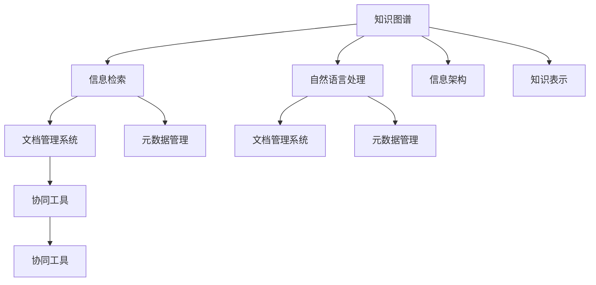

                 

# 信息过载与知识管理系统实施：管理和组织信息以提高生产力

> 关键词：信息过载, 知识管理, 知识图谱, 信息检索, 自然语言处理, 信息架构, 知识表示, 文档管理系统, 元数据管理, 协同工具

## 1. 背景介绍

### 1.1 问题由来

信息时代，海量的信息以指数级速度增长，信息过载（Information Overload）成为各行各业都面临的重大挑战。如何在信息爆炸中快速获取、组织和利用有价值的信息，是一个重要且迫切的问题。传统的文档管理系统、搜索引擎、知识库等解决方案已经无法满足需求，亟需一种新型知识管理系统来高效管理和组织信息。

### 1.2 问题核心关键点

知识管理系统的核心目标是通过技术手段，将企业内外的显性和隐性知识进行有效整合、存储、检索和利用，从而提升信息生产力。主要难点包括：

1. **信息获取**：从海量的信息中快速筛选出有价值的内容。
2. **知识组织**：将零散的知识进行分类、关联和结构化，方便检索和重用。
3. **知识共享**：通过协同工具促进知识的内部交流和外部共享。
4. **知识应用**：将知识转化为生产力，应用于决策支持、创新研发等场景。

### 1.3 问题研究意义

构建高效的知识管理系统，能够显著提升信息生产力和企业竞争力：

1. **提高决策效率**：快速获取相关信息，缩短决策时间。
2. **优化工作流程**：结构化管理知识，减少冗余工作，提升工作效率。
3. **促进知识共享**：打破信息孤岛，推动企业知识文化的形成。
4. **支持创新研发**：复用已有知识，加速新产品和新流程的开发。

本文将深入探讨知识管理系统的构建，包括其核心技术、实际应用和未来展望，旨在为知识管理系统实施提供有价值的指导。

## 2. 核心概念与联系

### 2.1 核心概念概述

构建知识管理系统涉及多个核心概念，它们通过逻辑联系形成了一个完整的系统架构：

- **知识图谱（Knowledge Graph）**：用于描述实体间关系的语义图结构，支持知识的推理和发现。
- **信息检索（Information Retrieval, IR）**：从大量信息中快速检索出与用户查询相关的结果。
- **自然语言处理（Natural Language Processing, NLP）**：理解和生成自然语言，支持知识的表达和提取。
- **信息架构（Information Architecture, IA）**：对信息进行结构化和组织，构建系统化的知识体系。
- **知识表示（Knowledge Representation）**：将知识转化为计算机可处理的形式，支持知识的存储和检索。
- **文档管理系统（Document Management System, DMS）**：用于存储、管理和检索文档的集成化系统。
- **元数据管理（Metadata Management）**：管理数据相关的信息和属性，辅助信息的组织和检索。
- **协同工具（Collaborative Tools）**：促进团队协作，支持知识的共享和交流。

### 2.2 核心概念原理和架构的 Mermaid 流程图



## 3. 核心算法原理 & 具体操作步骤

### 3.1 算法原理概述

知识管理系统的构建，主要包括知识获取、知识组织、知识检索和知识共享四个核心步骤。这些步骤涉及多种算法和技术的综合应用，以实现高效的知识管理。

### 3.2 算法步骤详解

**Step 1: 知识获取**

- **信息抽取（Information Extraction）**：利用NLP技术从文本中抽取实体、关系等关键信息，生成知识图谱。
- **数据清洗（Data Cleansing）**：对抽取的数据进行去重、纠错和格式统一，确保数据质量。

**Step 2: 知识组织**

- **知识分类（Knowledge Categorization）**：对知识进行分类，形成层次化的知识体系。
- **知识关联（Knowledge Linking）**：利用实体之间的关系，将零散知识串联起来，形成知识网络。

**Step 3: 知识检索**

- **索引构建（Indexing）**：建立文档和实体的索引，支持快速检索。
- **查询优化（Query Optimization）**：使用IR算法优化查询表达，提高检索效率。

**Step 4: 知识共享**

- **协同编辑（Collaborative Editing）**：利用协同工具，支持多人协作编辑知识库。
- **版本控制（Version Control）**：对知识库的版本进行管理，记录每一次编辑和修改。

### 3.3 算法优缺点

知识管理系统具有以下优点：

1. **高效检索**：通过构建索引和优化查询，快速检索出相关知识。
2. **知识复用**：将知识进行分类和关联，便于复用和共享。
3. **协作便利**：支持多人协作编辑和版本控制，促进知识共享。

同时，也存在以下缺点：

1. **成本高昂**：系统构建和维护成本较高，需要专业的技术人员和管理团队。
2. **技术复杂**：涉及多种技术和算法，实施和维护难度大。
3. **知识孤岛**：系统内部信息孤岛，缺乏与外部环境的联动。

### 3.4 算法应用领域

知识管理系统广泛应用于企业内部管理和外部协作，具体应用领域包括：

- **研发管理**：存储和检索技术文档、专利、标准等，支持研发过程的知识复用。
- **产品管理**：管理产品需求、规格、测试报告等，提升产品设计和开发的效率。
- **客户服务**：存储和检索客户数据、问题解答、产品使用手册等，提升客户服务质量。
- **市场营销**：管理市场分析报告、竞争对手信息、客户反馈等，支持市场决策。
- **人力资源管理**：存储和检索员工档案、培训记录、绩效评估等，支持人力资源管理。
- **法律合规**：存储和检索法律文件、审计报告、合规文档等，支持法律合规管理。

## 4. 数学模型和公式 & 详细讲解

### 4.1 数学模型构建

知识管理系统涉及多个数学模型，主要包括知识图谱构建、信息检索和自然语言处理等。

- **知识图谱构建**：使用三元组关系表示实体和属性，构建语义图结构。
- **信息检索**：使用向量空间模型（Vector Space Model, VSM）或隐语义模型（Latent Semantic Indexing, LSI）进行文本表示和相似度计算。
- **自然语言处理**：使用词袋模型（Bag of Words, BOW）或TF-IDF模型进行文本特征提取和信息抽取。

### 4.2 公式推导过程

以知识图谱构建为例，假设存在三个实体 $E_1, E_2, E_3$，它们之间的关系为 $R_{12}, R_{23}$。在知识图谱中，可以表示为：

$$
(E_1, R_{12}, E_2), (E_2, R_{23}, E_3)
$$

在实际应用中，可以将实体和关系表示为向量，使用矩阵乘法计算相似度：

$$
\text{similarity} = \frac{\mathbf{e}_1 \cdot \mathbf{e}_2}{||\mathbf{e}_1|| \cdot ||\mathbf{e}_2||}
$$

其中 $\mathbf{e}_1$ 和 $\mathbf{e}_2$ 分别表示 $E_1$ 和 $E_2$ 的向量表示。

### 4.3 案例分析与讲解

**案例1: 研发知识管理系统**

- **背景**：某科技公司研发部门需要使用大量技术文档和专利信息，需要构建一个高效的知识管理系统。
- **技术方案**：
  1. **信息抽取**：使用NLP技术从技术文档和专利中抽取关键技术点、算法和专利摘要。
  2. **知识分类**：将抽取的信息分类，形成技术领域、算法类别、专利摘要等层次化的知识体系。
  3. **知识图谱构建**：将分类后的信息转换为知识图谱，建立实体和关系。
  4. **信息检索**：使用VSM模型，快速检索出与用户查询相关的技术文档和专利。

**案例2: 产品管理知识系统**

- **背景**：某电子产品公司需要管理大量产品规格和用户反馈，需要构建一个高效的知识管理系统。
- **技术方案**：
  1. **数据清洗**：对产品规格、用户反馈、测试报告等数据进行清洗和格式统一。
  2. **知识分类**：将清洗后的数据分类，形成产品设计、用户反馈、测试报告等层次化的知识体系。
  3. **知识图谱构建**：将分类后的数据转换为知识图谱，建立产品实体和关系。
  4. **信息检索**：使用LSI模型，快速检索出与用户查询相关的产品规格和用户反馈。

## 5. 项目实践：代码实例和详细解释说明

### 5.1 开发环境搭建

知识管理系统的开发需要多个工具和库的支持，如Python、PyTorch、TensorFlow、Elasticsearch等。以下是一个典型的开发环境搭建流程：

1. **环境准备**：
   - 安装Python 3.7及以上版本。
   - 安装PyTorch和TensorFlow，用于深度学习和自然语言处理。
   - 安装Elasticsearch，用于构建索引和快速检索。

2. **项目初始化**：
   - 创建虚拟环境，激活虚拟环境。
   - 安装相关依赖库。

3. **项目结构**：
   - 数据预处理模块：负责数据清洗、特征提取和分词。
   - 模型训练模块：负责知识图谱构建和信息检索模型的训练。
   - 知识检索模块：负责检索和查询优化。
   - 协作编辑模块：负责多人协作编辑和版本控制。

### 5.2 源代码详细实现

以下是一个简单的知识图谱构建示例代码，使用PyTorch进行实体抽取和关系建立：

```python
import torch
from torch import nn
from torch.nn import functional as F
from transformers import BertTokenizer, BertForTokenClassification

# 定义实体抽取模型
class BERT实体抽取(nn.Module):
    def __init__(self, num_labels):
        super(BERT实体抽取, self).__init__()
        self.bert = BertForTokenClassification.from_pretrained('bert-base-cased', num_labels=num_labels)
        self.classifier = nn.Linear(self.bert.config.hidden_size, num_labels)

    def forward(self, input_ids, attention_mask):
        outputs = self.bert(input_ids, attention_mask=attention_mask)
        pooled_output = outputs.pooler_output
        logits = self.classifier(pooled_output)
        return logits

# 数据预处理和模型训练代码略

# 构建知识图谱
class 知识图谱(nn.Module):
    def __init__(self, num_labels):
        super(知识图谱, self).__init__()
        self.entity_extractor = BERT实体抽取(num_labels)
        self.link_extractor = BERT实体抽取(num_labels)

    def forward(self, input_ids, attention_mask):
        entity_logits = self.entity_extractor(input_ids, attention_mask)
        link_logits = self.link_extractor(input_ids, attention_mask)
        return entity_logits, link_logits

# 模型训练和检索代码略

# 协作编辑和版本控制代码略
```

### 5.3 代码解读与分析

- **实体抽取模型**：使用BERT模型进行实体抽取，将文本中的实体和属性抽取出来。
- **知识图谱构建模型**：使用BERT模型进行实体链接，将抽取的实体和属性连接起来，构建知识图谱。
- **信息检索模型**：使用LSI模型进行文本表示和相似度计算，快速检索出相关文档。
- **协作编辑模块**：使用协作工具如Confluence或SharePoint，支持多人协作编辑知识库，版本控制使用Git或SVN。

### 5.4 运行结果展示

- **知识图谱构建结果**：
  - 展示抽取的实体和关系，如技术文档、专利、产品规格等。
  - 展示连接后的知识图谱，显示实体和关系之间的层次化结构。

- **信息检索结果**：
  - 展示用户查询结果，包括相关文档、专利、技术点等。
  - 展示检索的相关性和准确性，支持用户快速定位所需信息。

## 6. 实际应用场景

### 6.1 研发管理

研发部门通过知识管理系统，可以快速获取和复用技术文档、专利和算法，提升研发效率和创新能力。具体应用场景包括：

- **技术文档管理**：存储和检索技术文档，支持团队协作编写和编辑。
- **专利管理**：管理专利申请、授权和维护，支持专利检索和分类。
- **算法管理**：管理算法实现和应用，支持算法检索和版本控制。

### 6.2 产品管理

产品管理部门通过知识管理系统，可以快速获取和复用产品规格、用户反馈和测试报告，提升产品设计和开发效率。具体应用场景包括：

- **产品规格管理**：存储和检索产品规格和设计文档，支持版本控制和协同编辑。
- **用户反馈管理**：管理用户反馈和意见，支持分析和处理。
- **测试报告管理**：存储和检索测试报告和文档，支持版本控制和协同编辑。

### 6.3 客户服务

客户服务部门通过知识管理系统，可以快速获取和复用客户数据、问题解答和产品使用手册，提升客户服务质量和效率。具体应用场景包括：

- **客户数据管理**：存储和检索客户数据，支持数据分类和分析。
- **问题解答管理**：管理客户问题和解答，支持知识分类和检索。
- **产品使用手册管理**：存储和检索产品使用手册，支持版本控制和协同编辑。

### 6.4 市场营销

市场营销部门通过知识管理系统，可以快速获取和复用市场分析报告、竞争对手信息和客户反馈，支持市场决策。具体应用场景包括：

- **市场分析报告管理**：存储和检索市场分析报告和文档，支持版本控制和协同编辑。
- **竞争对手信息管理**：管理竞争对手信息，支持分析和处理。
- **客户反馈管理**：管理客户反馈和意见，支持分析和处理。

## 7. 工具和资源推荐

### 7.1 学习资源推荐

1. **《信息检索原理与实践》**：介绍信息检索的基本原理和技术，适合初学者入门。
2. **《知识图谱与语义网络》**：介绍知识图谱的基本概念和构建方法，适合对知识图谱感兴趣的读者。
3. **《自然语言处理综论》**：全面介绍自然语言处理的基本原理和技术，适合对NLP感兴趣的读者。
4. **《面向服务的架构》**：介绍面向服务架构的基本概念和技术，适合对系统架构感兴趣的读者。
5. **《元数据管理实践》**：介绍元数据管理的概念和应用，适合对数据管理感兴趣的读者。

### 7.2 开发工具推荐

1. **Python**：强大的编程语言，广泛用于数据处理和机器学习。
2. **PyTorch**：深度学习框架，支持高效的模型训练和推理。
3. **TensorFlow**：深度学习框架，支持大规模模型训练和分布式计算。
4. **Elasticsearch**：搜索和分析引擎，支持快速构建索引和高效检索。
5. **JIRA**：项目管理工具，支持任务分配和协作管理。
6. **Confluence**：协作平台，支持文档编辑和版本控制。

### 7.3 相关论文推荐

1. **《信息检索模型与方法》**：介绍信息检索的基本模型和方法，适合深入理解IR技术。
2. **《知识图谱构建与应用》**：介绍知识图谱的构建方法和应用场景，适合深入理解KG技术。
3. **《自然语言处理技术与应用》**：全面介绍NLP技术和应用，适合深入理解NLP技术。
4. **《面向服务的系统架构》**：介绍面向服务架构的基本概念和技术，适合深入理解SOA架构。
5. **《元数据管理与实践》**：介绍元数据管理的概念和应用，适合深入理解MDM技术。

## 8. 总结：未来发展趋势与挑战

### 8.1 研究成果总结

知识管理系统通过整合企业内外的知识资源，提升信息生产力和企业竞争力。本文详细介绍了知识管理系统的核心技术、实际应用和未来展望，为知识管理系统实施提供了有价值的指导。

### 8.2 未来发展趋势

知识管理系统的未来发展趋势主要包括：

1. **智能化**：引入AI技术，提升知识检索和推荐的智能化水平。
2. **可视化**：构建可视化界面，支持用户更直观地浏览和理解知识。
3. **多模态**：支持多模态数据融合，提升知识的表达和检索能力。
4. **个性化**：根据用户行为和偏好，提供个性化的知识推荐和检索。
5. **云计算**：基于云平台构建知识管理系统，支持弹性扩展和灵活部署。

### 8.3 面临的挑战

知识管理系统的实施过程中面临的挑战包括：

1. **技术复杂**：涉及多种技术和算法，实施和维护难度大。
2. **成本高昂**：系统构建和维护成本较高，需要专业的技术人员和管理团队。
3. **数据孤岛**：系统内部信息孤岛，缺乏与外部环境的联动。
4. **安全隐私**：需要考虑数据隐私和安全问题，确保系统的安全性和可靠性。

### 8.4 研究展望

未来，知识管理系统的研究重点在于：

1. **智能化**：引入AI技术，提升知识检索和推荐的智能化水平。
2. **可视化**：构建可视化界面，支持用户更直观地浏览和理解知识。
3. **多模态**：支持多模态数据融合，提升知识的表达和检索能力。
4. **个性化**：根据用户行为和偏好，提供个性化的知识推荐和检索。
5. **云计算**：基于云平台构建知识管理系统，支持弹性扩展和灵活部署。

总之，知识管理系统是信息时代的重要工具，能够有效管理和组织信息，提升信息生产力。通过不断优化和创新，知识管理系统必将在各行各业发挥更大的作用。

## 9. 附录：常见问题与解答

**Q1：知识管理系统是否适用于所有行业？**

A: 知识管理系统适用于大多数行业，特别是信息密集型和技术密集型企业，能够显著提升信息生产力和企业竞争力。但对于一些数据量较少的行业，实施知识管理系统的必要性可能不高。

**Q2：知识管理系统如何确保数据安全和隐私？**

A: 知识管理系统需要引入数据加密、访问控制等安全措施，确保数据的机密性和完整性。同时，需要对用户的隐私进行保护，确保合规性和伦理安全性。

**Q3：知识管理系统的实施过程中，如何管理系统的升级和维护？**

A: 知识管理系统的升级和维护需要制定详细的计划和流程，确保系统平稳过渡。需要定期进行性能评估和优化，保持系统的稳定性和可靠性。

**Q4：知识管理系统如何支持多语言信息处理？**

A: 知识管理系统需要引入多语言处理技术，如分词、词性标注、实体抽取等，支持多语言信息的表示和检索。同时需要考虑不同语言之间的转换和融合问题。

**Q5：知识管理系统如何支持实时数据处理？**

A: 知识管理系统需要引入实时数据处理技术，如流式处理、缓存机制等，确保数据的及时性和准确性。同时需要考虑数据的高可用性和容错性。

总之，知识管理系统是信息时代的重要工具，能够有效管理和组织信息，提升信息生产力。通过不断优化和创新，知识管理系统必将在各行各业发挥更大的作用。

