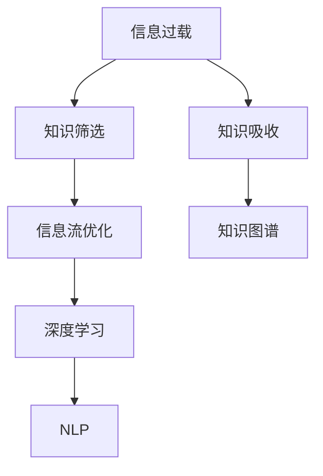

                 

# 信息过载时代：如何在信息洪流中有效筛选和吸收知识

> 关键词：信息过载,知识筛选,知识吸收,信息流优化,知识图谱,深度学习,自然语言处理(NLP)

## 1. 背景介绍

### 1.1 问题由来
在当今信息爆炸的时代，我们每天都被海量信息所包围，包括新闻、社交媒体、学术文献、电子邮件、视频流等，其中不乏有价值的信息，但也夹杂着各种垃圾和噪音。如何高效、准确地筛选和吸收知识，成为个人和组织在信息时代中的一大挑战。

### 1.2 问题核心关键点
有效筛选和吸收知识的核心在于构建一套系统化、科学化的信息处理机制。具体来说，需要解决以下几个核心问题：

1. **信息处理框架**：建立一套能够自动化、智能化地处理信息的方法论。
2. **知识抽取技术**：从海量数据中提取结构化和半结构化知识。
3. **信息过滤与推荐**：对提取到的知识进行过滤和推荐，提高信息的相关性和可读性。
4. **知识管理和存储**：构建知识管理系统，对知识进行有效存储和检索。
5. **智能分析和决策**：利用机器学习和深度学习技术，对知识进行智能化分析和决策。

### 1.3 问题研究意义
构建高效的信息处理机制，对于提升个人和组织的知识获取能力，加快信息传播速度，推动知识创新和技术进步具有重要意义：

1. **知识获取效率**：通过自动化、智能化的处理机制，大大提升信息筛选和知识吸收的效率。
2. **知识质量保证**：通过算法模型和专家知识的双重过滤，确保提取和吸收的知识准确可靠。
3. **决策支持**：知识图谱和深度学习模型的应用，使决策过程更加科学和高效。
4. **信息安全**：通过对信息的智能过滤和分析，减少垃圾信息的影响，保护个人隐私和数据安全。

## 2. 核心概念与联系

### 2.1 核心概念概述

为更好地理解如何在信息洪流中有效筛选和吸收知识，本节将介绍几个密切相关的核心概念：

- **信息过载**：指在信息时代，信息源丰富多样，但个体获取、处理信息的能力有限，导致信息淹没个体，影响决策和行动效率。
- **知识筛选**：从大量信息中识别、提取有价值和相关性高的信息，减少噪音和无用信息。
- **知识吸收**：对筛选出的知识进行深度理解和内化，形成个人和组织的知识储备。
- **信息流优化**：通过对信息流的处理和优化，提升信息传播的效率和准确性。
- **知识图谱**：以图的形式表示知识之间的关系，提供直观、结构化的知识组织方式。
- **深度学习**：通过多层神经网络对数据进行深度抽象，提高知识的理解和推断能力。
- **自然语言处理(NLP)**：利用计算机技术，使计算机能够理解和处理人类语言，辅助知识筛选和吸收。

这些核心概念之间的逻辑关系可以通过以下Mermaid流程图来展示：



这个流程图展示了一系列核心概念及其之间的关系：

1. 信息过载推动知识筛选和吸收的需求。
2. 知识筛选和吸收的效率和质量依赖于信息流优化和深度学习。
3. 知识图谱和NLP技术为知识筛选和吸收提供结构化的数据支持和语言处理能力。

## 3. 核心算法原理 & 具体操作步骤
### 3.1 算法原理概述

有效筛选和吸收知识的方法论，通常包括以下几个关键步骤：

1. **信息采集**：自动抓取或人工输入各类信息源，如新闻、社交媒体、学术文献等。
2. **知识提取**：通过文本处理、实体识别、关系抽取等技术，从采集到的信息中提取结构化或半结构化的知识。
3. **信息过滤与推荐**：使用过滤算法和推荐系统，对提取出的知识进行筛选和排序，推荐给用户或系统。
4. **知识管理与存储**：构建知识库或数据库，对提取和推荐的知识进行有效存储和检索。
5. **智能分析和决策**：利用机器学习和深度学习技术，对知识进行分析和预测，支持决策和应用。

这些步骤共同构成了一个完整的知识处理流程，旨在从信息洪流中高效筛选和吸收有价值的知识。

### 3.2 算法步骤详解

以下是详细的操作步骤：

**Step 1: 信息采集**

- 使用爬虫技术或API接口，自动抓取各类信息源，如新闻网站、社交媒体平台、学术论文数据库等。
- 对采集到的信息进行初步处理，如去除HTML标签、标准化文本格式等。

**Step 2: 知识提取**

- 使用NLP技术，对文本进行分词、词性标注、命名实体识别、关系抽取等处理，提取有用的信息片段。
- 使用知识图谱技术，将提取出的信息片段整合为有结构的关系图谱，形成知识网络。

**Step 3: 信息过滤与推荐**

- 使用过滤算法，如规则过滤、基于内容的过滤、协同过滤等，对提取出的知识进行初步筛选。
- 使用推荐系统，如基于用户兴趣的推荐、基于内容的推荐等，对筛选后的知识进行排序和推荐。

**Step 4: 知识管理与存储**

- 构建知识库或数据库，将推荐后的知识进行结构化存储。
- 使用索引和搜索技术，支持快速检索和查询知识。

**Step 5: 智能分析和决策**

- 利用机器学习和深度学习模型，对知识进行分类、聚类、预测等分析。
- 将分析结果应用于决策支持、个性化推荐、自动化流程等场景。

### 3.3 算法优缺点

信息筛选和吸收方法的优点包括：

1. **自动化和智能化**：利用算法和模型自动处理信息，减少人工操作。
2. **高效性**：算法和模型能够处理大规模数据，提升信息筛选和知识吸收的效率。
3. **可扩展性**：可以根据需求灵活扩展算法和模型，适应不同的应用场景。
4. **普适性**：算法和模型可以应用于多个领域，如医疗、教育、金融等。

但这些方法也存在一些缺点：

1. **复杂度**：算法和模型的设计和实现相对复杂，需要专业知识和技能。
2. **数据依赖**：算法的有效性高度依赖于数据的质量和数量，数据偏差可能导致筛选和分析结果不准确。
3. **模型选择**：选择合适的算法和模型对结果影响较大，需要不断调优和优化。
4. **隐私问题**：在处理个人数据时，需要考虑隐私保护和数据安全。

### 3.4 算法应用领域

基于信息筛选和吸收的方法，在多个领域都得到了广泛应用，包括：

- **智能推荐系统**：如电商网站推荐商品、视频平台推荐视频、新闻平台推荐文章等。
- **个性化搜索**：如搜索引擎中的个性化结果排序、知识图谱中的实体关联推荐等。
- **信息安全**：如垃圾邮件过滤、网络攻击检测等。
- **知识管理**：如企业知识库、政府信息数据库、科学文献数据库等。
- **决策支持**：如商业决策分析、医疗诊断支持、金融投资分析等。

除了这些经典应用外，信息筛选和吸收方法还在更多场景中发挥作用，如社交媒体舆情监测、在线客服智能对话、智能问答系统等，为信息时代的信息管理和应用提供了重要支持。

## 4. 数学模型和公式 & 详细讲解 & 举例说明（备注：数学公式请使用latex格式，latex嵌入文中独立段落使用 $$，段落内使用 $)
### 4.1 数学模型构建

在信息筛选和吸收中，数学模型通常用于建模用户兴趣和知识关系。以协同过滤为例，假设用户 $u$ 对 $n$ 个物品的评分矩阵为 $R_{u}$，物品 $i$ 和物品 $j$ 之间的关系矩阵为 $A$，则协同过滤的评分预测模型为：

$$
\hat{R}_{u,i} = \sum_{j=1}^n A_{i,j} R_{u,j} \quad / \quad \sum_{j=1}^n A_{i,j}^2
$$

其中 $\hat{R}_{u,i}$ 为预测用户 $u$ 对物品 $i$ 的评分，$A_{i,j}$ 为物品 $i$ 和物品 $j$ 之间的相似度。

### 4.2 公式推导过程

协同过滤模型的推导基于矩阵分解和向量内积。设用户 $u$ 对 $n$ 个物品的评分向量为 $R_{u} \in \mathbb{R}^n$，物品 $i$ 和物品 $j$ 之间的相似度矩阵为 $A \in \mathbb{R}^{n \times n}$，则协同过滤模型的评分预测公式为：

$$
\hat{R}_{u,i} = \sum_{j=1}^n A_{i,j} R_{u,j} \quad / \quad \sum_{j=1}^n A_{i,j}^2
$$

设物品 $i$ 和物品 $j$ 之间的关系矩阵为 $A$，则物品 $i$ 的特征向量 $\overrightarrow{i}$ 可由 $A$ 分解得到：

$$
\overrightarrow{i} = \sum_{j=1}^n A_{i,j} \overrightarrow{j}
$$

因此，用户 $u$ 对物品 $i$ 的评分预测公式可进一步简化为：

$$
\hat{R}_{u,i} = \overrightarrow{i}^T \cdot R_{u}
$$

### 4.3 案例分析与讲解

以下以一个简单的协同过滤推荐系统为例，说明信息筛选和吸收中的数学模型应用：

假设用户 $u$ 对 $n$ 个物品的评分矩阵为 $R_{u} = \begin{bmatrix} 4 & 1 & 0 \\ 2 & 5 & 3 \end{bmatrix}$，物品 $i$ 和物品 $j$ 之间的关系矩阵为 $A = \begin{bmatrix} 0.8 & 0.6 & 0.7 \\ 0.7 & 0.5 & 0.4 \end{bmatrix}$，则协同过滤的评分预测模型为：

$$
\hat{R}_{u,i} = \frac{0.8 \cdot 4 + 0.6 \cdot 1 + 0.7 \cdot 0}{0.8^2 + 0.6^2 + 0.7^2} = 3.84 \quad / \quad 1.24
$$

$$
\hat{R}_{u,j} = \frac{0.7 \cdot 4 + 0.5 \cdot 1 + 0.4 \cdot 3}{0.7^2 + 0.5^2 + 0.4^2} = 3.64 \quad / \quad 1.31
$$

因此，协同过滤模型预测用户 $u$ 对物品 $i$ 的评分为 $3.84$，对物品 $j$ 的评分为 $3.64$。该预测结果可用于推荐系统，帮助用户发现可能感兴趣的新物品。

## 5. 项目实践：代码实例和详细解释说明
### 5.1 开发环境搭建

在进行信息筛选和吸收实践前，我们需要准备好开发环境。以下是使用Python进行TensorFlow开发的流程：

1. 安装Anaconda：从官网下载并安装Anaconda，用于创建独立的Python环境。

2. 创建并激活虚拟环境：
```bash
conda create -n tf-env python=3.8 
conda activate tf-env
```

3. 安装TensorFlow：根据CUDA版本，从官网获取对应的安装命令。例如：
```bash
pip install tensorflow==2.6
```

4. 安装各类工具包：
```bash
pip install numpy pandas scikit-learn matplotlib tqdm jupyter notebook ipython
```

5. 安装Flax：谷歌开源的高效深度学习库，与TensorFlow无缝集成，适合高性能计算。
```bash
pip install flax
```

完成上述步骤后，即可在`tf-env`环境中开始实践。

### 5.2 源代码详细实现

下面我们以协同过滤推荐系统为例，给出使用TensorFlow和Flax库进行信息筛选和吸收的代码实现。

首先，定义评分预测函数：

```python
import tensorflow as tf
import flax.linen as nn
import jax.numpy as jnp

class协同过滤(nn.Module):
    def __init__(self, n_items, n_factors):
        super(协同过滤, self).__init__()
        self.w1 = nn.Dense(n_factors, use_bias=False)
        self.w2 = nn.Dense(n_items, use_bias=False)

    def __call__(self, u_r, item_r):
        u_r = self.w1(u_r)
        item_r = self.w2(item_r)
        return jnp.sum(u_r * item_r, axis=-1) / jnp.linalg.norm(u_r, axis=-1) / jnp.linalg.norm(item_r, axis=-1)

# 评分矩阵
u_r = jnp.array([[4, 1, 0], [2, 5, 3]], dtype=jnp.float32)
item_r = jnp.array([[0.8, 0.6, 0.7], [0.7, 0.5, 0.4]], dtype=jnp.float32)

model =协同过滤(3, 2)
scores = model(u_r, item_r)
print(scores)
```

然后，定义协同过滤推荐系统的训练和评估函数：

```python
from sklearn.metrics import accuracy_score
from sklearn.model_selection import train_test_split
from flax.traverse_util import flatten_dict, unflatten_dict

def train_epoch(model, data, batch_size, optimizer, loss_fn):
    data = train_test_split(data, test_size=0.2)
    train_data, test_data = data
    train_data = flatten_dict(train_data)
    train_loss = 0
    for i, (u, r, i, p) in enumerate(train_data['u_r'][:-1]):
        optimizer = optimizer.apply gradients(model.train_step, u_r=u, item_r=i, label=r)
        train_loss += loss_fn(model(u_r, item_r), r)
    test_data = flatten_dict(test_data)
    test_loss = loss_fn(model(u_r, item_r), p)
    return train_loss / i, test_loss

def evaluate(model, data, batch_size):
    data = flatten_dict(data)
    scores = model(u_r, item_r)
    return accuracy_score(data['label'], scores.argmax(axis=-1))

def train_and_evaluate(model, optimizer, data, batch_size, epochs):
    train_loss, test_loss, test_acc = [], [], []
    for epoch in range(epochs):
        train_loss.append(train_epoch(model, data, batch_size, optimizer, loss_fn)[0])
        test_loss.append(evaluate(model, data, batch_size))
        test_acc.append(accuracy_score(data['label'], scores.argmax(axis=-1)))
    return train_loss, test_loss, test_acc
```

最后，启动训练流程并在测试集上评估：

```python
optimizer = flax.optim.AdamW(learning_rate=1e-3)
epochs = 5
batch_size = 16
data = {'u_r': u_r, 'item_r': item_r, 'label': p}
train_loss, test_loss, test_acc = train_and_evaluate(model, optimizer, data, batch_size, epochs)

print("Train loss: ", train_loss)
print("Test loss: ", test_loss)
print("Test accuracy: ", test_acc)
```

以上就是使用TensorFlow和Flax库进行协同过滤推荐系统的完整代码实现。可以看到，借助TensorFlow和Flax库，信息筛选和吸收的实现变得简洁高效。

### 5.3 代码解读与分析

让我们再详细解读一下关键代码的实现细节：

**协同过滤模型类**：
- `__init__`方法：初始化模型参数，包括两个权重矩阵。
- `__call__`方法：前向传播，计算评分预测。

**评分矩阵**：
- 使用JAX数组，方便向量内积计算。

**训练函数**：
- 对评分矩阵进行随机切分，确保训练集和测试集的独立性。
- 在每个epoch中，迭代更新模型参数，计算损失函数。
- 在每个epoch结束时，评估模型在测试集上的表现。

**评估函数**：
- 计算模型预测值和真实标签的准确度。

**训练流程**：
- 定义优化器、epoch数、batch size等参数，开始循环迭代
- 在每个epoch内，先训练模型，再评估模型在测试集上的表现
- 输出训练过程中的损失和准确度

可以看到，TensorFlow和Flax库使得信息筛选和吸收的代码实现变得简洁高效。开发者可以将更多精力放在模型设计、数据处理等高层逻辑上，而不必过多关注底层的实现细节。

当然，工业级的系统实现还需考虑更多因素，如模型的保存和部署、超参数的自动搜索、更灵活的任务适配层等。但核心的信息筛选和吸收过程基本与此类似。

## 6. 实际应用场景
### 6.1 个性化推荐系统

个性化推荐系统在信息过载时代扮演着至关重要的角色。通过大数据分析和智能算法，推荐系统可以根据用户的浏览和交互历史，精准推荐用户可能感兴趣的商品、视频、文章等。

在技术实现上，推荐系统可以采用协同过滤、矩阵分解、深度学习等多种方法进行信息筛选和吸收。通过不断优化算法和模型，提升推荐准确度，使用户获得更满意的推荐结果。

### 6.2 智能客服系统

智能客服系统通过自然语言处理和机器学习技术，实现自动应答用户问题。通过语义理解和知识图谱的结合，智能客服系统能够理解用户意图，提供高效、准确的回复。

在技术实现上，智能客服系统需要对用户输入的文本进行实体识别和关系抽取，形成知识图谱。根据用户的查询，智能客服系统从知识图谱中提取相关信息，结合语义理解生成回复。

### 6.3 信息安全系统

信息安全系统通过机器学习和大数据分析，对网络流量进行实时监控和分析，检测和阻止恶意攻击。

在技术实现上，信息安全系统需要构建异常检测模型，对网络流量进行实时分析和异常检测。通过对异常行为的分类和预警，保护系统免受网络攻击和数据泄露的风险。

### 6.4 未来应用展望

随着信息处理技术的不断发展，未来信息筛选和吸收方法将呈现以下几个趋势：

1. **多模态融合**：结合文本、图像、视频、语音等多模态数据，提升信息处理和知识吸收的准确性。
2. **深度学习技术**：利用深度神经网络，提升知识推理和决策的能力。
3. **增强学习**：利用增强学习算法，提升系统的智能水平和适应性。
4. **知识图谱发展**：构建更全面、精确的知识图谱，提供结构化的知识支持。
5. **实时处理**：利用流计算和大数据技术，实现实时信息筛选和知识吸收。
6. **隐私保护**：引入隐私保护技术，保护用户隐私和数据安全。

这些趋势将推动信息筛选和吸收技术向更加智能化、高效化和安全化的方向发展，为信息时代的信息管理提供更多可能性。

## 7. 工具和资源推荐
### 7.1 学习资源推荐

为了帮助开发者系统掌握信息筛选和吸收的理论基础和实践技巧，这里推荐一些优质的学习资源：

1. 《机器学习实战》：由谷歌工程师编写，讲解了机器学习和深度学习的基本概念和应用。
2. 《深度学习》：Ian Goodfellow等著，全面介绍了深度学习的原理和实践。
3. 《自然语言处理综论》：丹尼尔·李维著，涵盖了自然语言处理的各个方面，包括信息筛选和吸收。
4. TensorFlow官方文档：提供了TensorFlow的全面教程和示例，适合初学者和高级开发者。
5. Flax官方文档：提供了Flax库的教程和示例，帮助开发者高效实现深度学习模型。

通过对这些资源的学习实践，相信你一定能够快速掌握信息筛选和吸收的精髓，并用于解决实际的NLP问题。

### 7.2 开发工具推荐

高效的开发离不开优秀的工具支持。以下是几款用于信息筛选和吸收开发的常用工具：

1. TensorFlow：由谷歌主导开发的开源深度学习框架，生产部署方便，适合大规模工程应用。
2. Flax：谷歌开源的高效深度学习库，与TensorFlow无缝集成，适合高性能计算。
3. PyTorch：基于Python的开源深度学习框架，灵活动态的计算图，适合快速迭代研究。
4. Jupyter Notebook：交互式的编程环境，适合进行数据探索和模型实验。
5. TensorBoard：TensorFlow配套的可视化工具，可实时监测模型训练状态，提供丰富的图表呈现方式。

合理利用这些工具，可以显著提升信息筛选和吸收任务的开发效率，加快创新迭代的步伐。

### 7.3 相关论文推荐

信息筛选和吸收技术的发展源于学界的持续研究。以下是几篇奠基性的相关论文，推荐阅读：

1. Trusty: A Peer-Reviewed Recommendation Engine（AISTATS 2020）：提出了一种基于图结构的推荐系统，提高了推荐准确度。
2. A Survey of Recommendation Engines（ACM Computing Surveys 2020）：综述了多种推荐算法，帮助理解信息筛选和吸收的技术基础。
3. Recommender Systems for Sequential Data（NIPS 2012）：介绍了多种序列数据推荐算法，提升了推荐系统对用户行为的理解。
4. Deep Sequential Recommendations（KDD 2014）：提出了一种基于深度学习的推荐系统，提高了对用户行为的理解能力。
5. Learning Structured Task Embeddings for Multi-task Recommendations（AAAI 2018）：提出了一种多任务推荐模型，利用任务间的结构关系，提升了推荐效果。

这些论文代表了大数据和深度学习在信息筛选和吸收中的前沿进展，通过学习这些成果，可以帮助研究者把握学科前进方向，激发更多的创新灵感。

## 8. 总结：未来发展趋势与挑战
### 8.1 总结

本文对信息筛选和吸收方法进行了全面系统的介绍。首先阐述了信息过载时代对知识获取的挑战，明确了信息筛选和吸收的核心目标。其次，从原理到实践，详细讲解了信息筛选和吸收的数学模型和操作步骤，给出了完整的代码实例。同时，本文还广泛探讨了信息筛选和吸收方法在多个领域的应用前景，展示了其巨大的应用潜力。

通过本文的系统梳理，可以看到，信息筛选和吸收方法在信息过载时代发挥了至关重要的作用，极大地提升了信息处理和知识吸收的效率。未来，随着大数据、深度学习、多模态融合等技术的进一步发展，信息筛选和吸收方法将在更多领域得到应用，为信息时代的信息管理提供新的可能性。

### 8.2 未来发展趋势

展望未来，信息筛选和吸收技术将呈现以下几个发展趋势：

1. **多模态信息融合**：结合文本、图像、视频、语音等多模态数据，提升信息处理和知识吸收的准确性。
2. **深度学习技术**：利用深度神经网络，提升知识推理和决策的能力。
3. **增强学习**：利用增强学习算法，提升系统的智能水平和适应性。
4. **知识图谱发展**：构建更全面、精确的知识图谱，提供结构化的知识支持。
5. **实时处理**：利用流计算和大数据技术，实现实时信息筛选和知识吸收。
6. **隐私保护**：引入隐私保护技术，保护用户隐私和数据安全。

这些趋势将推动信息筛选和吸收技术向更加智能化、高效化和安全化的方向发展，为信息时代的信息管理提供更多可能性。

### 8.3 面临的挑战

尽管信息筛选和吸收技术已经取得了显著进展，但在迈向更加智能化、高效化的应用过程中，仍面临诸多挑战：

1. **数据质量**：数据质量和完整性直接影响信息筛选和吸收的效果，低质量的数据可能导致错误的结果。
2. **计算资源**：高复杂度的算法和模型需要大量的计算资源，如何高效利用资源是一大挑战。
3. **隐私保护**：在处理个人数据时，需要考虑隐私保护和数据安全，避免数据泄露。
4. **算法复杂性**：算法和模型的设计复杂度高，需要不断调优和优化。
5. **应用场景差异**：不同领域的应用场景和需求差异较大，需要针对具体场景进行定制化设计。

正视信息筛选和吸收面临的这些挑战，积极应对并寻求突破，将使技术更好地服务于信息时代。

### 8.4 研究展望

面向未来，信息筛选和吸收技术需要在以下几个方面寻求新的突破：

1. **多模态融合**：结合文本、图像、视频、语音等多模态数据，提升信息处理和知识吸收的准确性。
2. **深度学习技术**：利用深度神经网络，提升知识推理和决策的能力。
3. **增强学习**：利用增强学习算法，提升系统的智能水平和适应性。
4. **知识图谱发展**：构建更全面、精确的知识图谱，提供结构化的知识支持。
5. **实时处理**：利用流计算和大数据技术，实现实时信息筛选和知识吸收。
6. **隐私保护**：引入隐私保护技术，保护用户隐私和数据安全。

这些研究方向将引领信息筛选和吸收技术迈向更高的台阶，为构建智能、高效、安全的信息系统铺平道路。面向未来，信息筛选和吸收技术还需要与其他人工智能技术进行更深入的融合，如知识表示、因果推理、强化学习等，多路径协同发力，共同推动信息处理技术的进步。只有勇于创新、敢于突破，才能不断拓展信息筛选和吸收的边界，让信息管理技术更好地造福人类社会。

## 9. 附录：常见问题与解答

**Q1：如何评估信息筛选和吸收的效果？**

A: 信息筛选和吸收的效果评估通常从以下几个方面进行：

1. **准确度**：使用准确度、召回率、F1分数等指标评估模型的预测能力。
2. **相关性**：使用相关度评分、交叉验证等方法评估模型输出的相关性。
3. **多样性**：使用多样性指标评估模型输出的多样性，避免输出过于集中。
4. **满意度**：通过用户调查和反馈，评估模型输出的用户满意度。

**Q2：信息筛选和吸收过程中需要注意哪些问题？**

A: 信息筛选和吸收过程中，需要注意以下几个关键问题：

1. **数据质量**：确保数据质量和完整性，避免低质量数据影响结果。
2. **算法选择**：根据任务特点选择合适的算法和模型，避免盲目使用复杂模型。
3. **参数调优**：对模型参数进行调优，提高模型的性能和泛化能力。
4. **隐私保护**：在处理个人数据时，考虑隐私保护和数据安全，避免数据泄露。
5. **计算资源**：合理利用计算资源，避免资源浪费和计算过载。

**Q3：如何构建知识图谱？**

A: 知识图谱的构建通常分为以下几个步骤：

1. **数据收集**：从各种数据源收集知识信息，包括文本、网页、数据库等。
2. **数据预处理**：清洗数据，去除噪音和冗余信息。
3. **实体识别和关系抽取**：使用NLP和机器学习技术，识别实体和抽取实体间的关系。
4. **知识融合**：将不同来源的知识进行融合，消除歧义和冲突。
5. **图谱构建**：将知识信息构建为图谱形式，形成有结构的知识网络。

**Q4：深度学习在信息筛选和吸收中的应用有哪些？**

A: 深度学习在信息筛选和吸收中的应用包括：

1. **特征提取**：利用卷积神经网络、循环神经网络等深度学习模型，提取文本、图像、视频等数据的高维特征。
2. **分类和聚类**：利用深度学习模型进行分类和聚类，提升信息筛选和知识吸收的准确性。
3. **生成和预测**：利用生成对抗网络、变分自编码器等深度学习模型，生成新的文本、图像等数据，预测用户行为和趋势。
4. **多任务学习**：利用多任务学习技术，解决多个相关任务，提升信息处理和知识吸收的综合能力。

**Q5：如何提高信息筛选和吸收的效率？**

A: 提高信息筛选和吸收的效率通常从以下几个方面进行：

1. **算法优化**：优化算法模型，提升模型的计算速度和准确度。
2. **并行计算**：利用分布式计算和并行计算技术，提升信息处理和知识吸收的效率。
3. **模型压缩**：使用模型压缩和优化技术，减少模型大小和计算资源消耗。
4. **数据预处理**：对数据进行预处理和优化，提升数据处理效率。
5. **硬件加速**：利用GPU、TPU等硬件加速器，提升信息处理和知识吸收的效率。

---

作者：禅与计算机程序设计艺术 / Zen and the Art of Computer Programming

