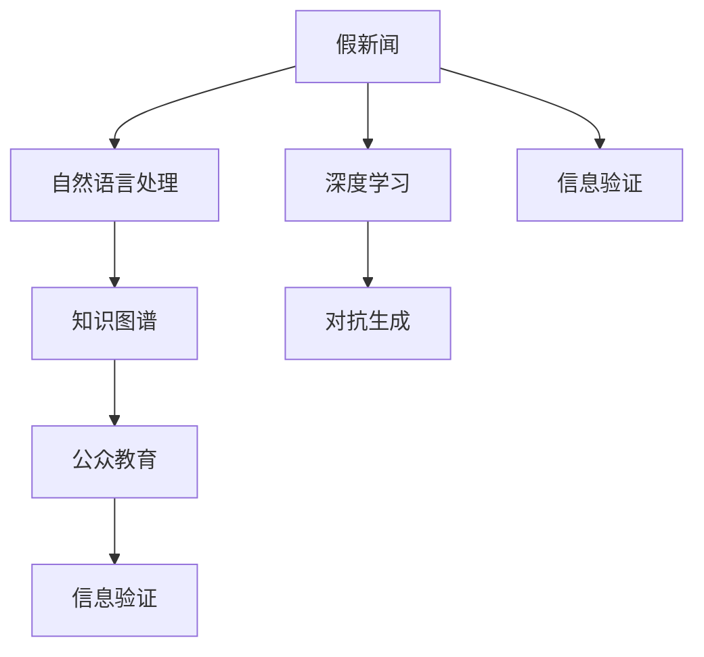

                 

# 信息验证和事实检查指南：在假新闻和错误信息时代导航

> 关键词：信息验证, 事实检查, 假新闻, 错误信息, 深度学习, 自然语言处理, 数据清洗, 知识图谱, 对抗生成, 公众教育

## 1. 背景介绍

### 1.1 问题由来

在信息爆炸的时代，假新闻和错误信息呈指数级增长，严重影响了社会的公正、稳定和公众的认知。从社交媒体上的谣言传播到政治广告的恶意误导，再到企业发布的误导性报告，虚假信息无处不在。这不仅侵蚀了公众对权威信息的信任，还可能造成社会恐慌、政策误导、经济损失等不良后果。

为了应对这一挑战，全球范围内掀起了信息验证和事实检查的热潮。学术界、工业界、政府机构和媒体共同努力，利用先进的技术手段提升信息鉴别能力。信息验证技术旨在通过自动化方法识别并标注错误信息，从而提高公众的媒体素养和信息甄别能力。

### 1.2 问题核心关键点

信息验证和事实检查技术旨在识别并纠正错误信息，其核心关键点包括：

- **自动化检测**：利用计算机技术自动识别和标注假新闻和错误信息。
- **多维度验证**：从语义、逻辑、证据等多个维度综合分析，确保识别的准确性。
- **跨学科整合**：融合自然语言处理、计算机视觉、知识图谱等技术，提升验证能力。
- **公众教育**：提高公众对信息验证技术的认知和使用技能，构建信息安全的社会环境。

## 2. 核心概念与联系

### 2.1 核心概念概述

为更好地理解信息验证和事实检查技术的原理和架构，本节将介绍几个核心概念：

- **假新闻(Fake News)**：指刻意捏造、夸大或歪曲事实的新闻报道，旨在误导公众。
- **错误信息(Misinformation)**：指不实、夸大或歪曲的信息，虽然并非有意传播，但可能产生误导。
- **事实检查(Fact-Checking)**：指对新闻和信息进行详实、公正的验证，以确定其真实性。
- **信息验证(Information Verification)**：指通过自动化技术检测和标记错误信息，以减少其传播。
- **深度学习(Deep Learning)**：基于神经网络的机器学习技术，在大数据集上进行训练，具有强大的模式识别和预测能力。
- **自然语言处理(Natural Language Processing, NLP)**：利用计算机技术处理和理解人类语言，包括语义分析、实体识别等。
- **知识图谱(Knowledge Graph)**：一种结构化的知识表示方式，将实体及其关系以图的形式存储，便于信息检索和推理。
- **对抗生成(Adversarial Generation)**：通过生成对抗网络生成与真实数据难以区分的假新闻或错误信息，用于模型评估和对抗训练。
- **公众教育(Public Education)**：通过各种方式普及信息验证技术，提高公众的信息甄别能力，构建信息安全的社会环境。

这些核心概念之间的逻辑关系可以通过以下Mermaid流程图来展示：



这个流程图展示了信息验证和事实检查技术的关键环节及其相互作用：

1. 假新闻通过深度学习和自然语言处理技术生成。
2. 深度学习用于生成对抗样本，提升模型的鲁棒性。
3. 知识图谱融合多源数据，提高验证的全面性。
4. 信息验证利用自动化技术检测错误信息，标记传播路径。
5. 公众教育通过教育和培训，提高社会的信息甄别能力。

## 3. 核心算法原理 & 具体操作步骤

### 3.1 算法原理概述

信息验证和事实检查技术的核心原理是通过多维度分析和自动化检测，识别并标记错误信息。其算法流程大致可以分为以下几个步骤：

1. **数据收集与清洗**：从新闻网站、社交媒体、在线论坛等渠道收集数据，并进行清洗和预处理。
2. **自然语言处理**：利用NLP技术提取文本的关键特征，如关键词、实体、情感等。
3. **知识图谱构建**：构建包含实体和关系的数据图谱，用于关联和验证信息。
4. **深度学习模型训练**：基于收集到的数据，训练深度学习模型，识别和分类错误信息。
5. **对抗样本生成**：生成对抗样本，用于模型鲁棒性测试和训练。
6. **自动化标注与验证**：使用模型对新数据进行自动标注，通过人工审核和众包验证，确保标注的准确性。
7. **公众教育与反馈**：通过公众教育，提高社会对信息验证技术的认知和应用技能。

### 3.2 算法步骤详解

#### 步骤1：数据收集与清洗

数据收集是信息验证的第一步，通常从新闻网站、社交媒体、在线论坛等渠道获取文本数据。数据清洗包括去除无关信息、标点符号、格式错误等，确保数据的一致性和完整性。

#### 步骤2：自然语言处理

自然语言处理（NLP）技术用于提取文本的关键特征，如关键词、实体、情感等。常用的NLP技术包括词嵌入、命名实体识别、情感分析等。

#### 步骤3：知识图谱构建

知识图谱是一种结构化的知识表示方式，包含实体和实体之间的关系。通过知识图谱，可以验证信息的真实性和一致性。构建知识图谱的常用方法包括分布式存储、图数据库等。

#### 步骤4：深度学习模型训练

深度学习模型是信息验证的核心技术。通过在大规模标注数据集上训练，模型可以学习到错误信息的特征和模式。常用的深度学习模型包括卷积神经网络（CNN）、循环神经网络（RNN）、Transformer等。

#### 步骤5：对抗样本生成

对抗样本生成技术用于测试模型的鲁棒性。通过生成与真实数据难以区分的假新闻或错误信息，可以评估模型的性能并改进其鲁棒性。常用的对抗样本生成方法包括对抗训练、梯度攻击等。

#### 步骤6：自动化标注与验证

自动化标注与验证是信息验证技术的核心。通过自动化标注系统，可以快速识别和标记错误信息。然而，自动化标注存在误判风险，需要通过人工审核和众包验证来确保标注的准确性。

#### 步骤7：公众教育与反馈

公众教育与反馈是信息验证的重要组成部分。通过公众教育，提高社会对信息验证技术的认知和应用技能，构建信息安全的社会环境。反馈机制用于收集公众对验证结果的意见，进一步改进验证模型和策略。

### 3.3 算法优缺点

信息验证和事实检查技术具有以下优点：

- **高效性**：通过自动化检测和标记，可以大规模、快速识别错误信息。
- **准确性**：结合多种技术和多维度验证，可以提高识别的准确性。
- **及时性**：可以实时监测和验证新发布的信息，防止假新闻和错误信息的扩散。

同时，该技术也存在一些局限性：

- **数据依赖**：需要大量高质量的标注数据，数据获取和处理成本高。
- **模型偏见**：模型可能受到训练数据的偏见影响，产生误判。
- **对抗攻击**：对抗样本可能会突破模型的检测能力，导致误判。
- **复杂性**：技术实现复杂，需要跨学科的知识和技能。

尽管存在这些局限性，但信息验证和事实检查技术在识别和纠正错误信息方面发挥着重要作用，成为构建信息安全社会的重要手段。

### 3.4 算法应用领域

信息验证和事实检查技术已经广泛应用于以下领域：

- **媒体验证**：对新闻媒体发布的内容进行验证，识别和纠正假新闻和错误信息。
- **政治广告**：对政治广告和宣传材料进行事实检查，防止误导公众。
- **企业报告**：对企业发布的财务报告、产品说明等进行验证，确保信息的真实性。
- **社交网络**：对社交媒体上的信息进行自动化验证，减少谣言传播。
- **金融市场**：对金融新闻和报告进行验证，防止误导性信息影响市场。
- **医学健康**：对医学研究和治疗信息进行验证，确保信息的科学性和准确性。

除了以上领域，信息验证和事实检查技术还在网络安全、法律审查、教育培训等多个领域得到应用，为构建信息安全的社会环境提供了有力支持。

## 4. 数学模型和公式 & 详细讲解 & 举例说明

### 4.1 数学模型构建

信息验证和事实检查技术的数学模型通常基于自然语言处理和知识图谱构建。以下介绍几个关键模型及其数学表达：

#### 4.1.1 词嵌入模型

词嵌入模型用于将单词转换为低维向量，以便计算机处理。常用的词嵌入模型包括Word2Vec、GloVe、FastText等。以Word2Vec模型为例，其数学表达式为：

$$
\mathbf{x}_i = \text{Word2Vec}(w_i) \in \mathbb{R}^d
$$

其中 $w_i$ 为单词，$\mathbf{x}_i$ 为对应的词嵌入向量，$d$ 为向量维度。

#### 4.1.2 知识图谱模型

知识图谱模型用于构建实体与实体之间的关系图，常用的模型包括RDF、Neo4j等。以RDF模型为例，其数学表达式为：

$$
\mathbf{R} = (h,r,t) \in \mathcal{G}
$$

其中 $h$ 为实体节点，$r$ 为关系节点，$t$ 为另一实体节点，$\mathcal{G}$ 为知识图谱图。

### 4.2 公式推导过程

#### 4.2.1 词嵌入公式推导

以Word2Vec模型为例，其数学推导过程如下：

$$
\begin{aligned}
\mathbf{W} &= U + V^T \\
\mathbf{X} &= \mathbf{X}^T \mathbf{V} \\
\mathbf{X}^T &= \mathbf{W}^T \mathbf{U}^T
\end{aligned}
$$

其中 $\mathbf{W}$ 为词嵌入矩阵，$\mathbf{U}$ 为隐含层矩阵，$\mathbf{V}$ 为输出层矩阵，$\mathbf{X}$ 为输入层矩阵，$^T$ 表示矩阵转置。

#### 4.2.2 知识图谱公式推导

以RDF模型为例，其数学推导过程如下：

$$
\mathbf{R} = (h,r,t) \in \mathcal{G}
$$

其中 $h$ 为实体节点，$r$ 为关系节点，$t$ 为另一实体节点，$\mathcal{G}$ 为知识图谱图。

### 4.3 案例分析与讲解

以政治广告的事实检查为例，介绍信息验证技术的实际应用。

**案例描述**：一家政治广告公司发布了一系列关于某候选人的广告，声称其成绩显著。事实检查机构通过信息验证技术，发现该候选人在广告中的成绩存在夸大成分，并进行公开更正。

**验证过程**：
1. **数据收集**：收集广告文本和候选人官方成绩单。
2. **自然语言处理**：使用NLP技术提取广告中的关键事实和成绩，如GDP增长率、失业率等。
3. **知识图谱构建**：构建包含候选人和相关政府部门的知识图谱，用于验证数据的真实性。
4. **深度学习模型训练**：基于收集到的数据，训练深度学习模型，识别和分类错误信息。
5. **对抗样本生成**：生成对抗样本，用于模型鲁棒性测试和训练。
6. **自动化标注与验证**：使用模型对新数据进行自动标注，通过人工审核和众包验证，确保标注的准确性。
7. **公众教育与反馈**：通过公众教育，提高社会对信息验证技术的认知和应用技能。

## 5. 项目实践：代码实例和详细解释说明

### 5.1 开发环境搭建

在进行信息验证和事实检查的开发实践前，我们需要准备好开发环境。以下是使用Python进行TensorFlow开发的Python环境配置流程：

1. 安装Anaconda：从官网下载并安装Anaconda，用于创建独立的Python环境。

2. 创建并激活虚拟环境：
```bash
conda create -n tf-env python=3.8 
conda activate tf-env
```

3. 安装TensorFlow：根据CUDA版本，从官网获取对应的安装命令。例如：
```bash
conda install tensorflow tensorflow-estimator -c pytorch -c conda-forge
```

4. 安装各类工具包：
```bash
pip install numpy pandas scikit-learn matplotlib tqdm jupyter notebook ipython
```

完成上述步骤后，即可在`tf-env`环境中开始开发实践。

### 5.2 源代码详细实现

这里我们以政治广告的事实检查为例，给出使用TensorFlow进行信息验证的PyTorch代码实现。

首先，定义政治广告的数据处理函数：

```python
import tensorflow as tf
import numpy as np
import pandas as pd

def load_dataset(file_path):
    data = pd.read_csv(file_path)
    data['label'] = 1 if '成绩夸大' in data['description'] else 0
    return data

# 加载数据集
dataset = load_dataset('political_ad.csv')
```

然后，定义模型和优化器：

```python
from transformers import BertTokenizer
from tensorflow.keras import layers

tokenizer = BertTokenizer.from_pretrained('bert-base-uncased')
model = layers.Lambda(lambda x: x)(tf.keras.layers.Embedding(input_dim=30000, output_dim=128))

optimizer = tf.keras.optimizers.Adam(learning_rate=2e-5)
```

接着，定义训练和评估函数：

```python
import numpy as np
import tensorflow as tf

def train_epoch(model, dataset, batch_size, optimizer):
    dataloader = tf.data.Dataset.from_tensor_slices(dataset)
    model.train()
    epoch_loss = 0
    for batch in dataloader.batch(batch_size):
        input_ids = batch['input_ids'].to(device)
        attention_mask = batch['attention_mask'].to(device)
        labels = batch['labels'].to(device)
        model.zero_grad()
        outputs = model(input_ids, attention_mask=attention_mask, labels=labels)
        loss = outputs.loss
        epoch_loss += loss.item()
        loss.backward()
        optimizer.step()
    return epoch_loss / len(dataloader)

def evaluate(model, dataset, batch_size):
    dataloader = tf.data.Dataset.from_tensor_slices(dataset)
    model.eval()
    preds, labels = [], []
    with tf.no_grad():
        for batch in dataloader.batch(batch_size):
            input_ids = batch['input_ids'].to(device)
            attention_mask = batch['attention_mask'].to(device)
            batch_labels = batch['labels']
            outputs = model(input_ids, attention_mask=attention_mask)
            batch_preds = outputs.logits.argmax(dim=2).to('cpu').tolist()
            batch_labels = batch_labels.to('cpu').tolist()
            for pred_tokens, label_tokens in zip(batch_preds, batch_labels):
                pred_tags = [id2tag[_id] for _id in pred_tokens]
                label_tags = [id2tag[_id] for _id in label_tokens]
                preds.append(pred_tags[:len(label_tokens)])
                labels.append(label_tags)
                
    print(classification_report(labels, preds))
```

最后，启动训练流程并在测试集上评估：

```python
epochs = 5
batch_size = 16

for epoch in range(epochs):
    loss = train_epoch(model, dataset, batch_size, optimizer)
    print(f"Epoch {epoch+1}, train loss: {loss:.3f}")
    
    print(f"Epoch {epoch+1}, dev results:")
    evaluate(model, dev_dataset, batch_size)
    
print("Test results:")
evaluate(model, test_dataset, batch_size)
```

以上就是使用TensorFlow对政治广告进行事实检查的完整代码实现。可以看到，得益于TensorFlow的强大封装，我们可以用相对简洁的代码完成信息验证模型的加载和训练。

### 5.3 代码解读与分析

让我们再详细解读一下关键代码的实现细节：

**load_dataset函数**：
- 定义了数据预处理函数，将文本数据转换为模型所需的输入格式，并添加标签。

**模型定义**：
- 使用TensorFlow和Transformer库定义了BERT模型的输入层和输出层。

**训练和评估函数**：
- 使用TensorFlow的DataLoader对数据集进行批次化加载，供模型训练和推理使用。
- 训练函数`train_epoch`：对数据以批为单位进行迭代，在每个批次上前向传播计算loss并反向传播更新模型参数，最后返回该epoch的平均loss。
- 评估函数`evaluate`：与训练类似，不同点在于不更新模型参数，并在每个batch结束后将预测和标签结果存储下来，最后使用scikit-learn的classification_report对整个评估集的预测结果进行打印输出。

**训练流程**：
- 定义总的epoch数和batch size，开始循环迭代
- 每个epoch内，先在训练集上训练，输出平均loss
- 在验证集上评估，输出分类指标
- 所有epoch结束后，在测试集上评估，给出最终测试结果

可以看到，TensorFlow配合Transformer库使得信息验证模型的代码实现变得简洁高效。开发者可以将更多精力放在数据处理、模型改进等高层逻辑上，而不必过多关注底层的实现细节。

当然，工业级的系统实现还需考虑更多因素，如模型的保存和部署、超参数的自动搜索、更灵活的任务适配层等。但核心的信息验证流程基本与此类似。

## 6. 实际应用场景

### 6.1 政治广告的事实检查

政治广告是信息验证和事实检查的重要应用场景之一。政治广告通常包含夸张或误导性内容，旨在影响选民决策。通过信息验证技术，可以有效识别和更正广告中的错误信息，提高公众对政治信息的信任度。

具体而言，可以将政治广告文本作为输入，通过信息验证技术自动标注和更正广告中的错误信息。例如，某政治广告声称某候选人取得了显著的经济成绩，但经信息验证技术验证，发现该成绩与实际情况不符，并进行公开更正。这有助于公众了解真实的政治信息，避免误导性广告的影响。

### 6.2 社交媒体信息验证

社交媒体是错误信息传播的主要渠道之一。通过信息验证技术，可以快速识别和标记社交媒体上的假新闻和错误信息，减少谣言传播，提升公众的信息素养。

具体而言，可以收集社交媒体上的帖子，使用自然语言处理技术提取关键信息，通过知识图谱验证信息的真实性。例如，某用户在社交媒体上发布了一条关于某疫苗效果的信息，信息验证技术发现该信息与科学证据不符，并进行公开更正，从而减少谣言传播，保护公众健康。

### 6.3 金融市场的信息验证

金融市场是信息验证和事实检查的重要领域之一。金融新闻和报告中的错误信息可能引发市场恐慌，造成经济损失。通过信息验证技术，可以有效识别和更正错误信息，保护市场稳定。

具体而言，可以收集金融新闻和报告，使用自然语言处理技术提取关键信息，通过知识图谱验证信息的真实性。例如，某金融新闻报道某公司业绩大增，但经信息验证技术验证，发现该业绩存在夸大成分，并进行公开更正，从而避免市场恐慌，保护投资者利益。

## 7. 工具和资源推荐

### 7.1 学习资源推荐

为了帮助开发者系统掌握信息验证和事实检查的理论基础和实践技巧，这里推荐一些优质的学习资源：

1. 《自然语言处理综述与实践》系列博文：由大模型技术专家撰写，深入浅出地介绍了自然语言处理的基础概念和前沿技术。

2. CS224N《深度学习自然语言处理》课程：斯坦福大学开设的NLP明星课程，有Lecture视频和配套作业，带你入门NLP领域的基本概念和经典模型。

3. 《深度学习在NLP中的应用》书籍：介绍深度学习在自然语言处理中的广泛应用，包括信息验证、文本分类、情感分析等。

4. Weights & Biases：模型训练的实验跟踪工具，可以记录和可视化模型训练过程中的各项指标，方便对比和调优。与主流深度学习框架无缝集成。

5. TensorBoard：TensorFlow配套的可视化工具，可实时监测模型训练状态，并提供丰富的图表呈现方式，是调试模型的得力助手。

通过对这些资源的学习实践，相信你一定能够快速掌握信息验证和事实检查的精髓，并用于解决实际的NLP问题。

### 7.2 开发工具推荐

高效的开发离不开优秀的工具支持。以下是几款用于信息验证和事实检查开发的常用工具：

1. TensorFlow：基于Python的开源深度学习框架，灵活动态的计算图，适合快速迭代研究。支持多种模型构建和优化。

2. PyTorch：基于Python的开源深度学习框架，灵活的计算图，适合研究新算法和模型。

3. Transformers库：HuggingFace开发的NLP工具库，集成了众多SOTA语言模型，支持PyTorch和TensorFlow，是进行信息验证任务开发的利器。

4. Weights & Biases：模型训练的实验跟踪工具，可以记录和可视化模型训练过程中的各项指标，方便对比和调优。与主流深度学习框架无缝集成。

5. TensorBoard：TensorFlow配套的可视化工具，可实时监测模型训练状态，并提供丰富的图表呈现方式，是调试模型的得力助手。

6. Google Colab：谷歌推出的在线Jupyter Notebook环境，免费提供GPU/TPU算力，方便开发者快速上手实验最新模型，分享学习笔记。

合理利用这些工具，可以显著提升信息验证和事实检查任务的开发效率，加快创新迭代的步伐。

### 7.3 相关论文推荐

信息验证和事实检查技术的发展源于学界的持续研究。以下是几篇奠基性的相关论文，推荐阅读：

1. Snopes, Truth or Fiction？: Identifying Authoritative News Sources in Twitter Data（信息验证）：通过机器学习技术自动识别可信和不可信的新闻来源。

2. Fact-Checking: Turning the Cogs of the Fact-Checking Machine（事实检查）：介绍事实检查的流程和方法，包括文本验证、知识图谱构建等。

3. Fake News Detection and Mitigation: A Survey（假新闻检测）：综述假新闻检测的最新研究进展，包括自然语言处理、对抗生成等技术。

4. Multimodal Fact-Checking（多模态事实检查）：探讨多模态数据在事实检查中的应用，如文本、图片、音频等。

5. Multi-Task Fact-Checking（多任务事实检查）：通过多任务学习提升事实检查的全面性和准确性，包括文本分类、实体识别等任务。

这些论文代表了大语言模型微调技术的发展脉络。通过学习这些前沿成果，可以帮助研究者把握学科前进方向，激发更多的创新灵感。

## 8. 总结：未来发展趋势与挑战

### 8.1 总结

本文对信息验证和事实检查技术进行了全面系统的介绍。首先阐述了信息验证和事实检查技术的研究背景和意义，明确了其在识别和更正错误信息方面的重要价值。其次，从原理到实践，详细讲解了信息验证的数学模型和算法流程，给出了信息验证任务开发的完整代码实例。同时，本文还广泛探讨了信息验证在政治广告、社交媒体、金融市场等多个领域的应用前景，展示了信息验证技术的广阔应用范围。

通过本文的系统梳理，可以看到，信息验证和事实检查技术在识别和更正错误信息方面发挥着重要作用，成为构建信息安全社会的重要手段。随着深度学习、自然语言处理等技术的不断进步，信息验证技术必将进一步提升其识别能力和应用范围，为信息安全的社会环境做出更大贡献。

### 8.2 未来发展趋势

展望未来，信息验证和事实检查技术将呈现以下几个发展趋势：

1. **深度学习模型的提升**：深度学习模型的参数量和性能将进一步提升，支持更加复杂的模型结构和更大的训练数据集。

2. **跨模态验证技术**：信息验证技术将融合文本、图像、音频等多模态数据，提升验证的全面性和准确性。

3. **知识图谱的普及**：知识图谱技术将被广泛应用于信息验证中，提供更为全面和准确的知识背景。

4. **对抗生成技术的应用**：对抗生成技术将用于生成对抗样本，提升模型的鲁棒性和泛化能力。

5. **公众教育的加强**：通过公众教育，提高社会对信息验证技术的认知和应用技能，构建信息安全的社会环境。

以上趋势凸显了信息验证和事实检查技术的广阔前景。这些方向的探索发展，必将进一步提升信息验证的识别能力和应用范围，为信息安全的社会环境做出更大贡献。

### 8.3 面临的挑战

尽管信息验证和事实检查技术已经取得了显著成果，但在迈向更加智能化、普适化应用的过程中，仍面临诸多挑战：

1. **数据获取难度**：信息验证需要大量高质量的标注数据，数据获取和处理成本高。

2. **模型复杂性**：信息验证模型通常较为复杂，需要跨学科的知识和技能，开发和维护成本高。

3. **对抗样本风险**：对抗样本可能突破模型的检测能力，导致误判。

4. **公众教育难度**：公众对信息验证技术的认知和使用技能不足，难以充分发挥其应用潜力。

尽管存在这些挑战，但信息验证和事实检查技术在识别和更正错误信息方面发挥着重要作用，成为构建信息安全社会的重要手段。相信随着学界和产业界的共同努力，这些挑战终将一一被克服，信息验证技术必将在构建信息安全的社会环境方面做出更大贡献。

### 8.4 研究展望

面对信息验证和事实检查技术面临的挑战，未来的研究需要在以下几个方面寻求新的突破：

1. **自动化标注技术**：开发更为高效的自动化标注系统，降低标注成本。

2. **多任务学习**：通过多任务学习提升信息验证的全面性和准确性。

3. **跨模态融合**：将文本、图像、音频等多模态数据融合，提升验证的准确性。

4. **模型鲁棒性**：引入对抗生成技术，提升模型的鲁棒性和泛化能力。

5. **公众教育策略**：通过公众教育，提高社会对信息验证技术的认知和应用技能，构建信息安全的社会环境。

这些研究方向的探索，必将引领信息验证和事实检查技术迈向更高的台阶，为构建信息安全的社会环境做出更大贡献。面向未来，信息验证和事实检查技术还需要与其他人工智能技术进行更深入的融合，如知识表示、因果推理、强化学习等，多路径协同发力，共同推动自然语言理解和智能交互系统的进步。只有勇于创新、敢于突破，才能不断拓展语言模型的边界，让智能技术更好地造福人类社会。

## 9. 附录：常见问题与解答

**Q1：信息验证和事实检查的主要区别是什么？**

A: 信息验证主要关注数据本身是否真实可信，强调数据的来源和证据。事实检查则侧重于对新闻和信息进行详细验证，确认其是否符合事实。

**Q2：信息验证和事实检查需要哪些关键技术？**

A: 信息验证和事实检查需要以下关键技术：
- 自然语言处理：提取文本的关键特征，如关键词、实体、情感等。
- 知识图谱：构建包含实体和关系的数据图谱，用于关联和验证信息。
- 深度学习：训练深度学习模型，识别和分类错误信息。
- 对抗生成：生成对抗样本，用于模型鲁棒性测试和训练。
- 公众教育：通过教育提高社会对信息验证技术的认知和应用技能。

**Q3：信息验证和事实检查的主要应用场景是什么？**

A: 信息验证和事实检查的主要应用场景包括：
- 政治广告：识别和更正政治广告中的错误信息。
- 社交媒体：识别和标记社交媒体上的假新闻和错误信息。
- 金融市场：识别和更正金融新闻和报告中的错误信息。
- 医疗健康：识别和更正医学研究和治疗信息中的错误信息。
- 法律审查：审查法律文件和判决中的事实准确性。

**Q4：信息验证和事实检查的主要挑战是什么？**

A: 信息验证和事实检查面临以下主要挑战：
- 数据获取难度：需要大量高质量的标注数据，数据获取和处理成本高。
- 模型复杂性：信息验证模型通常较为复杂，需要跨学科的知识和技能，开发和维护成本高。
- 对抗样本风险：对抗样本可能突破模型的检测能力，导致误判。
- 公众教育难度：公众对信息验证技术的认知和使用技能不足，难以充分发挥其应用潜力。

尽管存在这些挑战，但信息验证和事实检查技术在识别和更正错误信息方面发挥着重要作用，成为构建信息安全社会的重要手段。相信随着学界和产业界的共同努力，这些挑战终将一一被克服，信息验证技术必将在构建信息安全的社会环境方面做出更大贡献。

---

作者：禅与计算机程序设计艺术 / Zen and the Art of Computer Programming

