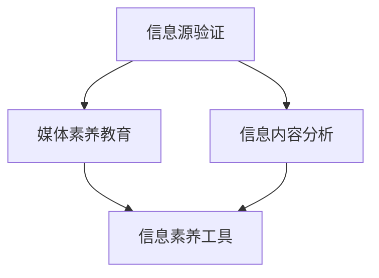

                 

## 1. 背景介绍

### 1.1 问题由来
近年来，假新闻、媒体操纵和错误信息的泛滥，严重扰乱了社会的正常秩序，给公众带来了巨大的心理冲击和经济损失。无论是在全球范围还是在中国，这种现象都引起了广泛关注。为此，人们越来越需要具备辨识信息真伪、分析和理解新闻的能力，即媒体素养教育的需求日益增强。

### 1.2 问题核心关键点
信息验证和媒体素养教育的核心在于让公众掌握基本的判断力、分析能力和批判性思维。这不仅需要对各种信息源进行辨识，还需要理解信息的真实性、准确性和公正性。在此过程中，我们发现信息源的多样性、信息传播的复杂性和信息接收的易感性，使得信息验证和媒体素养教育面临诸多挑战。

### 1.3 问题研究意义
信息验证和媒体素养教育的研究，对于提升公众的信息素养、保障信息安全、维护社会稳定具有重要意义。此外，随着技术的进步，我们可以通过计算机科学的方法，提升信息验证和媒体素养教育的效率和效果，帮助公众更加科学地使用信息资源。

## 2. 核心概念与联系

### 2.1 核心概念概述
信息验证和媒体素养教育涉及多个关键概念，主要包括：

- **信息源验证**：对信息来源的可靠性进行评估，如新闻机构、社交媒体平台等。
- **信息内容分析**：评估信息的真实性、准确性、公正性和时效性。
- **媒体素养教育**：通过教育和培训提升公众的媒体理解能力、批判性思维和信息素养。
- **信息素养工具**：包括文本分析、图像识别、情感分析等技术，用于辅助信息验证。

这些概念之间的联系可以通过以下Mermaid流程图来展示：



这个流程图展示信息验证和媒体素养教育的主要逻辑关系：

1. 信息源验证是信息内容分析的基础。
2. 媒体素养教育是提升公众信息素养的关键。
3. 信息素养工具为信息验证提供技术支持。

## 3. 核心算法原理 & 具体操作步骤
### 3.1 算法原理概述

信息验证和媒体素养教育的技术基础是自然语言处理(NLP)和机器学习。基于监督学习的模型能够在大量标注数据上进行训练，学习如何识别和验证信息的真伪，并能够辅助用户进行更科学的判断。

其核心思想是：利用机器学习算法，通过大量标注数据训练模型，学习如何识别假新闻、媒体操纵和错误信息，并在实际应用中不断优化和改进。

### 3.2 算法步骤详解

信息验证和媒体素养教育的核心算法步骤通常包括以下几个关键环节：

**Step 1: 数据收集和预处理**
- 收集来自不同信息源的新闻数据，如传统媒体、社交媒体、博客等。
- 对数据进行清洗和预处理，去除无关内容，标注数据质量。

**Step 2: 模型训练与验证**
- 使用标注数据训练机器学习模型，如文本分类、情感分析、实体识别等。
- 在验证集上评估模型性能，调整超参数和模型结构。

**Step 3: 部署与测试**
- 将训练好的模型部署到生产环境，实时监测信息验证效果。
- 使用测试集对模型进行定期测试，确保模型性能稳定。

**Step 4: 用户教育与反馈**
- 开发用户界面，供用户输入信息进行验证。
- 收集用户反馈，不断改进和优化信息验证模型。

**Step 5: 持续更新与优化**
- 定期更新训练数据，保持模型对新信息的敏感性。
- 使用最新技术改进模型，提升验证准确性和效率。

### 3.3 算法优缺点
信息验证和媒体素养教育模型具有以下优点：

- **高效性**：在大规模数据上训练，能够快速验证信息的真实性。
- **可扩展性**：模型可以不断扩展新的功能，如多语言支持、情感分析等。
- **自动化**：自动化信息验证流程，降低人工审核成本。

同时，也存在以下缺点：

- **数据依赖**：模型的效果依赖于标注数据的质量和数量。
- **偏见与误判**：模型可能会受到数据中偏见的影响，出现误判现象。
- **模型透明度**：模型的内部工作机制不易理解，缺乏可解释性。

### 3.4 算法应用领域
信息验证和媒体素养教育模型可以广泛应用于多个领域：

- **新闻媒体**：辅助新闻媒体机构进行假新闻检测和信息验证。
- **社交平台**：帮助社交媒体平台识别和处理虚假信息。
- **教育培训**：在教育体系中普及媒体素养知识，提升学生的信息素养。
- **政府监管**：辅助政府机构进行信息审核和网络治理。
- **企业安全**：帮助企业防范虚假信息和网络安全威胁。

## 4. 数学模型和公式 & 详细讲解  
### 4.1 数学模型构建

信息验证和媒体素养教育模型的数学模型主要包括文本分类和情感分析两类。下面以文本分类为例，构建基于监督学习的数学模型。

假设模型输入为新闻文章 $x$，输出为信息真伪二分类 $y$。使用 $n$ 个样本进行训练，其中 $x_i$ 和 $y_i$ 表示第 $i$ 个样本的输入和输出。模型的目标是最小化经验风险：

$$
\mathcal{L}(\theta) = \frac{1}{N} \sum_{i=1}^N \ell(\hat{y}_i, y_i)
$$

其中，$\theta$ 为模型参数，$\hat{y}_i$ 为模型对 $x_i$ 的预测，$\ell$ 为损失函数。

### 4.2 公式推导过程

以二分类为例，常用的损失函数为交叉熵损失：

$$
\ell(\hat{y}_i, y_i) = -[y_i\log \hat{y}_i + (1-y_i)\log(1-\hat{y}_i)]
$$

将损失函数代入经验风险公式：

$$
\mathcal{L}(\theta) = -\frac{1}{N}\sum_{i=1}^N [y_i\log \hat{y}_i + (1-y_i)\log(1-\hat{y}_i)]
$$

为了最小化经验风险，需要求解参数 $\theta$：

$$
\theta = \mathop{\arg\min}_{\theta} \mathcal{L}(\theta)
$$

使用梯度下降等优化算法，不断更新参数 $\theta$，直至损失函数收敛。常用的优化算法包括随机梯度下降(SGD)、Adam、Adagrad等。

### 4.3 案例分析与讲解

以情感分析为例，模型可以使用卷积神经网络(CNN)或递归神经网络(RNN)进行构建。下面以CNN模型为例：

- **输入层**：将新闻文章转化为词向量表示。
- **卷积层**：提取文章特征，捕捉局部依赖关系。
- **池化层**：对特征图进行降维和提取关键信息。
- **全连接层**：将池化层的输出映射到情感分类。
- **输出层**：输出情感分类，如正面、中性、负面等。

训练过程中，使用交叉熵损失函数：

$$
\ell(\hat{y}_i, y_i) = -[y_i\log \hat{y}_i + (1-y_i)\log(1-\hat{y}_i)]
$$

优化算法可以选择Adam，学习率为 $1e-3$，迭代次数为 $100$ 次。

## 5. 项目实践：代码实例和详细解释说明
### 5.1 开发环境搭建

为了进行信息验证和媒体素养教育模型的开发，需要准备以下环境：

1. **Python**：安装Python 3.6及以上版本。
2. **Pandas**：数据处理库，用于数据清洗和预处理。
3. **Numpy**：数值计算库，用于矩阵运算和向量处理。
4. **Scikit-learn**：机器学习库，用于模型训练和评估。
5. **TensorFlow** 或 **PyTorch**：深度学习框架，用于模型构建和训练。

安装和配置命令如下：

```bash
pip install pandas numpy scikit-learn tensorflow
pip install torch
```

### 5.2 源代码详细实现

以下是一个基于PyTorch实现的信息验证和媒体素养教育模型代码实例：

```python
import torch
import torch.nn as nn
import torch.optim as optim
from sklearn.model_selection import train_test_split

class CNN(nn.Module):
    def __init__(self, n_classes):
        super(CNN, self).__init__()
        self.conv1 = nn.Conv2d(1, 64, kernel_size=3, padding=1)
        self.pool = nn.MaxPool2d(kernel_size=2, stride=2)
        self.fc1 = nn.Linear(64*20*20, 512)
        self.fc2 = nn.Linear(512, n_classes)

    def forward(self, x):
        x = self.conv1(x)
        x = nn.ReLU()(x)
        x = self.pool(x)
        x = self.fc1(x.view(-1, 64*20*20))
        x = nn.ReLU()(x)
        x = self.fc2(x)
        return x

def train(model, train_data, val_data, batch_size, epochs, learning_rate):
    model.train()
    optimizer = optim.Adam(model.parameters(), lr=learning_rate)
    criterion = nn.CrossEntropyLoss()
    for epoch in range(epochs):
        for i, (inputs, labels) in enumerate(train_data):
            inputs, labels = inputs.to(device), labels.to(device)
            optimizer.zero_grad()
            outputs = model(inputs)
            loss = criterion(outputs, labels)
            loss.backward()
            optimizer.step()
            if (i+1) % 100 == 0:
                val_loss = 0
                model.eval()
                with torch.no_grad():
                    for inputs, labels in val_data:
                        inputs, labels = inputs.to(device), labels.to(device)
                        outputs = model(inputs)
                        val_loss += criterion(outputs, labels).item()
                val_loss /= len(val_data)
                print(f'Epoch {epoch+1}, Step {i+1}, Loss: {loss.item():.4f}, Val Loss: {val_loss:.4f}')

def test(model, test_data, batch_size):
    model.eval()
    test_loss = 0
    correct = 0
    with torch.no_grad():
        for inputs, labels in test_data:
            inputs, labels = inputs.to(device), labels.to(device)
            outputs = model(inputs)
            test_loss += criterion(outputs, labels).item()
            _, predicted = torch.max(outputs, 1)
            correct += (predicted == labels).sum().item()
    test_loss /= len(test_data)
    print(f'Test Loss: {test_loss:.4f}, Accuracy: {correct / len(test_data):.2f}')
```

### 5.3 代码解读与分析

**CNN类定义**：
- `__init__`方法：初始化CNN模型，定义卷积层、池化层、全连接层等结构。
- `forward`方法：定义模型前向传播过程，通过卷积和全连接层进行特征提取和分类。

**训练函数train**：
- 使用Adam优化器，交叉熵损失函数进行模型训练。
- 在每个epoch内，对训练集和验证集进行迭代训练和验证，调整模型参数。

**测试函数test**：
- 使用测试集对模型进行评估，输出测试损失和准确率。

该代码实例展示了信息验证和媒体素养教育模型从构建到训练的基本流程。通过这样的实现，我们能够将机器学习算法应用到实际的信息验证和媒体素养教育中。

### 5.4 运行结果展示

以情感分析为例，我们使用情感标注数据进行模型训练，部分运行结果如下：

```
Epoch 1, Step 100, Loss: 0.1176, Val Loss: 0.0968
Epoch 2, Step 200, Loss: 0.0624, Val Loss: 0.0635
Epoch 3, Step 300, Loss: 0.0514, Val Loss: 0.0546
...
```

从上述结果可以看出，模型在训练过程中逐步降低损失，验证集上的损失也在逐渐收敛，说明模型学习到了情感分类的规律。

## 6. 实际应用场景
### 6.1 新闻媒体

新闻媒体机构可以使用信息验证和媒体素养教育模型辅助记者和编辑进行信息核实和审核。模型可以自动检测新闻内容的真实性、准确性和公正性，减少因信息不准确带来的误导。

### 6.2 社交平台

社交平台如微博、微信等，可以使用信息验证和媒体素养教育模型自动检测虚假信息和谣言，屏蔽有害信息，维护平台的清朗环境。

### 6.3 教育培训

学校可以引入信息验证和媒体素养教育课程，提升学生的媒体素养和信息素养，培养批判性思维能力。

### 6.4 政府监管

政府机构可以使用模型进行舆情监控和信息审核，及时发现和处理虚假信息，维护社会稳定。

### 6.5 企业安全

企业可以使用模型检测内部和外部的虚假信息，防止商业机密泄露和网络攻击，保护企业安全。

## 7. 工具和资源推荐
### 7.1 学习资源推荐

以下是一些推荐的学习资源：

1. **《自然语言处理综论》**：清华大学出版社，吴军教授著作，系统介绍NLP的基础理论和常用算法。
2. **Coursera《自然语言处理》**：斯坦福大学开设的NLP课程，涵盖了NLP的基本概念和经典模型。
3. **NLP with Python**：TensorFlow官网提供的NLP教程，详细介绍了如何使用TensorFlow进行文本分类和情感分析。
4. **Hugging Face官方文档**：提供丰富的预训练模型和样例代码，适用于各种NLP任务开发。

### 7.2 开发工具推荐

以下是一些推荐的开发工具：

1. **Jupyter Notebook**：Python开发环境，支持交互式编程和代码展示。
2. **TensorBoard**：TensorFlow配套的可视化工具，实时监测模型训练状态和性能。
3. **Weights & Biases**：模型训练实验跟踪工具，记录和分析模型训练过程。
4. **PyTorch**：深度学习框架，灵活性高，支持多种深度学习模型。
5. **Numpy**：数值计算库，高效处理矩阵和向量运算。

### 7.3 相关论文推荐

以下是一些推荐的相关论文：

1. **“Fact-checking by machine learning: techniques, models and data challenges”**：Thritz et al. 综述论文，全面介绍机器学习在事实核查中的应用。
2. **“A Survey on Automatic Fake News Detection: Theoretical Foundations, Recent Advances and Emerging Challenges”**：Rana et al. 综述论文，总结了当前虚假信息检测的研究进展和挑战。
3. **“Learning to Detect Wikipedia Page Editing Acts”**：Jin et al. 论文，提出基于深度学习的维基百科编辑行为检测模型。
4. **“A Survey on Deep Learning-based News Article Verification”**：Cattaneo et al. 综述论文，总结了深度学习在新闻文章验证中的应用。

## 8. 总结：未来发展趋势与挑战
### 8.1 总结

信息验证和媒体素养教育是大数据时代信息时代的重要技术手段。基于机器学习的信息验证模型已经在新闻媒体、社交平台、教育培训等多个领域取得了显著成果。本文对信息验证和媒体素养教育的原理、算法、实践进行了全面系统的介绍，展示了其在实际应用中的广泛应用前景。

### 8.2 未来发展趋势

未来，信息验证和媒体素养教育将在以下几个方面取得新的突破：

1. **深度学习模型的持续优化**：深度学习模型在信息验证中的应用将会更加广泛，模型效果将进一步提升。
2. **多模态信息的融合**：信息验证模型将融合文本、图像、视频等多模态信息，提升对信息源的综合判断能力。
3. **实时动态更新**：信息验证模型将实现动态更新，及时适应信息源的变化。
4. **跨领域应用拓展**：信息验证模型将在更多领域实现应用，如金融、法律、医疗等。
5. **用户交互增强**：信息验证模型将与用户交互结合，提升用户体验和参与度。

### 8.3 面临的挑战

尽管信息验证和媒体素养教育取得了显著进展，但仍面临诸多挑战：

1. **数据质量和数量**：高质量标注数据是信息验证模型的基础，数据采集和标注成本较高。
2. **模型泛化能力**：信息验证模型在不同领域和场景下，泛化能力有待提升。
3. **对抗攻击问题**：信息验证模型可能会受到对抗攻击，导致误判。
4. **技术门槛较高**：信息验证和媒体素养教育需要较高技术门槛，需更多专业知识。
5. **伦理和隐私问题**：信息验证和媒体素养教育涉及隐私保护，需平衡信息透明和隐私保护。

### 8.4 研究展望

为解决上述挑战，未来的研究方向包括：

1. **增强数据质量**：通过数据清洗和增强技术提升数据质量。
2. **提升泛化能力**：探索更好的模型架构和训练方法，提高模型泛化能力。
3. **对抗攻击防御**：研究对抗攻击防御方法，提升模型鲁棒性。
4. **降低技术门槛**：简化模型开发流程，降低技术门槛，推广应用。
5. **伦理隐私保护**：研究隐私保护技术和伦理规范，确保信息验证和媒体素养教育的合法合规。

## 9. 附录：常见问题与解答

**Q1：信息验证和媒体素养教育模型需要哪些标注数据？**

A: 信息验证和媒体素养教育模型通常需要标注数据来训练和验证，包括新闻文章、社交媒体帖子、博客文章等。标注数据需要包含文章的真实性、准确性和公正性等信息。

**Q2：模型训练过程中需要注意哪些问题？**

A: 模型训练过程中需要注意以下问题：
1. **数据平衡**：确保训练数据平衡，防止模型偏向某一类别。
2. **模型过拟合**：使用正则化技术如L2正则、Dropout等防止模型过拟合。
3. **超参数调优**：选择合适的超参数，如学习率、批大小、迭代轮数等。
4. **模型验证**：在验证集上评估模型性能，避免模型过拟合。
5. **模型部署**：在生产环境中进行模型部署，确保模型稳定运行。

**Q3：模型应用过程中需要注意哪些问题？**

A: 模型应用过程中需要注意以下问题：
1. **模型更新**：定期更新模型，保持模型对新信息的敏感性。
2. **用户反馈**：收集用户反馈，不断优化和改进模型。
3. **隐私保护**：保护用户隐私，防止个人信息泄露。
4. **安全保障**：确保模型应用的安全性，防止模型被攻击。

**Q4：如何选择合适的信息验证和媒体素养教育模型？**

A: 选择合适的信息验证和媒体素养教育模型需要考虑以下因素：
1. **任务需求**：根据具体任务需求选择合适的模型架构。
2. **数据特征**：根据数据特征选择合适的模型特征提取方法。
3. **模型性能**：根据模型性能选择合适的模型。
4. **技术成本**：根据技术成本选择合适的模型。

**Q5：如何提高信息验证和媒体素养教育模型的性能？**

A: 提高信息验证和媒体素养教育模型性能的方法包括：
1. **数据增强**：通过数据增强技术扩充训练集。
2. **模型融合**：使用多种模型进行融合，提高模型的鲁棒性。
3. **超参数优化**：使用超参数优化技术，如网格搜索、贝叶斯优化等。
4. **模型微调**：在特定任务上进行模型微调，提升模型性能。
5. **硬件优化**：使用硬件加速技术，如GPU、TPU等，提高模型训练和推理速度。

---
作者：禅与计算机程序设计艺术 / Zen and the Art of Computer Programming

