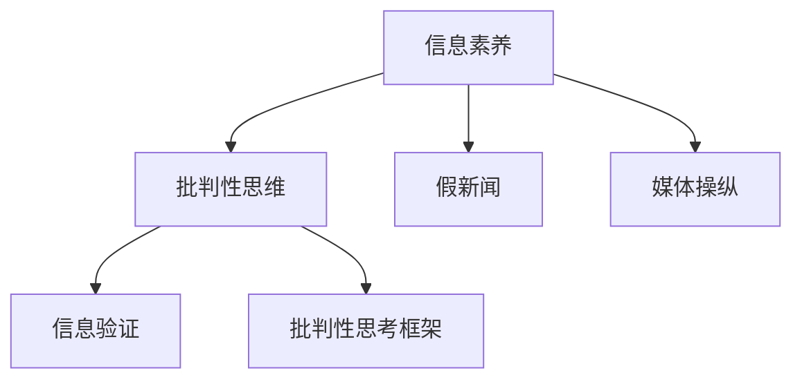

                 

# 信息验证和批判性思考指南：在假新闻和媒体操纵时代导航

## 1. 背景介绍

### 1.1 问题由来
在当今信息爆炸的时代，假新闻、误导性信息、以及媒体操纵现象日益严重，对社会的信任体系和个人决策产生了深远的影响。在这个背景下，如何提高公众的信息素养和批判性思维能力，成为了一个迫切需要解决的问题。信息验证和批判性思考技能，正是为了应对这一挑战而发展起来的重要技能。

### 1.2 问题核心关键点
信息验证和批判性思考的关键在于以下几个方面：
- **识别真实与虚假信息**：能够区分新闻源的可信度和信息的内容真实性。
- **评估信息来源的可靠性**：评估新闻源的背景、声誉和动机。
- **理解信息的上下文**：考虑信息产生的时间和环境，以及可能存在的偏见和利益冲突。
- **使用多种信息渠道**：通过跨渠道验证信息，确保信息的全面性和准确性。
- **培养质疑精神**：不轻信未经核实的信息，对任何信息保持怀疑态度。

### 1.3 问题研究意义
提高公众的信息素养和批判性思考能力，对于构建健康的信息生态系统、维护社会稳定和促进个体理性决策具有重要意义。在假新闻和媒体操纵泛滥的时代，具备这些技能可以帮助人们更好地分辨信息的真伪，避免被误导，做出更加明智的决策。

## 2. 核心概念与联系

### 2.1 核心概念概述

为更好地理解信息验证和批判性思考的实践，本节将介绍几个密切相关的核心概念：

- **信息素养**：指个体识别、评估和有效利用信息的能力，包括信息获取、理解、评估和应用等技能。
- **批判性思维**：指个体分析和评估信息的逻辑能力和判断力，包括提问、推理、论证等思维过程。
- **假新闻**：指被故意编造、歪曲或误导公众的虚假信息，通常为了达到特定目的。
- **媒体操纵**：指媒体通过报道偏见、选择性报道或虚假信息等手段，对公众观点和行为进行影响的行为。
- **信息验证**：指通过多种手段和技术，对信息的真实性和准确性进行核实和确认的过程。
- **批判性思考框架**：一种系统化的方法，帮助个体评估和理解信息，包括信息来源、内容、逻辑和背景等方面。

这些核心概念之间的逻辑关系可以通过以下Mermaid流程图来展示：



这个流程图展示信息素养、批判性思维与假新闻、媒体操纵、信息验证、批判性思考框架之间的关系：

1. 信息素养和批判性思维是个体具备评估和应用信息的能力。
2. 假新闻和媒体操纵是信息素养和批判性思维需要防范和识别的对象。
3. 信息验证和批判性思考框架是提升信息素养和批判性思维的重要手段。

这些核心概念共同构成了信息验证和批判性思考的框架，帮助个体在假新闻和媒体操纵泛滥的时代中，能够分辨信息的真伪，做出理性判断。

## 3. 核心算法原理 & 具体操作步骤
### 3.1 算法原理概述

信息验证和批判性思考的核心算法原理，可以概括为以下几个步骤：

1. **信息收集**：获取多源、多渠道的信息，包括传统媒体、社交媒体、专业网站等。
2. **信息分析**：评估信息来源的可靠性、信息内容的真实性、信息的上下文。
3. **信息交叉验证**：通过多个渠道验证信息的真实性，避免单一来源的误导。
4. **批判性评估**：使用批判性思考框架，评估信息的逻辑和证据支持度。
5. **决策制定**：基于信息的真实性和全面性，做出决策。

### 3.2 算法步骤详解

以下详细讲解信息验证和批判性思考的核心算法步骤：

**Step 1: 信息收集**

1. **选择信息源**：识别可信的新闻源，如知名媒体、专业网站、学术期刊等。
2. **多渠道获取信息**：通过不同渠道获取信息，如新闻网站、社交媒体、论坛、专家博客等。

**Step 2: 信息分析**

1. **评估信息来源**：
   - 调查新闻源的背景、声誉、历史和动机。
   - 检查是否存在利益冲突或偏见。
   - 查看该来源是否被同行评议或具有专业认证。

2. **检查信息内容**：
   - 分析信息内容的逻辑连贯性，是否存在矛盾和逻辑错误。
   - 确认事实和数据的真实性，是否引用可信来源。
   - 检查是否存在夸大或过度简化的情况。

3. **理解信息上下文**：
   - 考虑信息产生的背景和时间，了解相关背景知识。
   - 分析信息可能的偏见或动机，识别可能的误导性表述。

**Step 3: 信息交叉验证**

1. **多个渠道验证**：使用不同的信息源验证同一信息，检查是否一致。
2. **跨平台验证**：使用不同平台（如Twitter、Facebook、YouTube等）验证信息，确保信息的一致性。
3. **时间线验证**：查看信息在不同时间点的变化，检查是否存在更新或更正。

**Step 4: 批判性评估**

1. **批判性思考框架**：
   - **提问法**：提出关键问题，如“信息来源是谁？”、“证据是否充分？”等。
   - **推理法**：评估信息的逻辑链条，确保推理过程合理。
   - **论证法**：检查信息的证据是否支持其主张，是否存在反证。

2. **信息可信度评分**：
   - 基于信息来源、内容、上下文等因素，对信息的可信度进行评分。
   - 使用评分系统，如0-5分，评估信息的真实性和可靠性。

**Step 5: 决策制定**

1. **综合评估**：结合信息来源、内容、逻辑和上下文等因素，综合评估信息的可信度。
2. **做出决策**：基于信息的真实性和全面性，做出决策。
3. **反馈和修正**：对信息进行持续跟踪和验证，及时修正决策。

### 3.3 算法优缺点

信息验证和批判性思考的算法具有以下优点：

1. **提升信息素养**：通过系统化的方法，提升个体识别和评估信息的能力。
2. **增强批判性思维**：培养个体的逻辑推理和质疑能力。
3. **减少误导**：降低被假新闻和媒体操纵误导的风险。
4. **促进理性决策**：基于全面准确的信息做出理性决策。

同时，该算法也存在一些局限性：

1. **复杂度高**：需要时间和精力进行多源验证和批判性评估，对用户要求较高。
2. **技能门槛**：需要一定的信息素养和批判性思维基础，对于部分用户可能难以实现。
3. **时间成本**：在信息爆炸时代，全面验证信息的成本较高，难以做到实时响应。
4. **主观偏见**：批判性思考过程中，可能受到个人主观偏见的影响。

尽管存在这些局限性，但信息验证和批判性思考在面对假新闻和媒体操纵时，依然是最有效的手段之一。

### 3.4 算法应用领域

信息验证和批判性思考技能在多个领域都有广泛应用，包括但不限于：

- **教育**：通过信息验证和批判性思维教育，提升学生的媒体素养和逻辑推理能力。
- **公共事务**：在政治、社会问题讨论中，帮助公众辨别信息的真伪，促进理性讨论。
- **科学研究**：确保科学研究的可靠性和真实性，避免误导性信息影响研究结论。
- **商业决策**：在商业分析和决策过程中，使用多源信息验证和批判性思维，减少决策风险。
- **法律与执法**：在法律诉讼和执法过程中，确保信息来源和内容的真实性，提高司法公正性。

## 4. 数学模型和公式 & 详细讲解 & 举例说明（备注：数学公式请使用latex格式，latex嵌入文中独立段落使用 $$，段落内使用 $)
### 4.1 数学模型构建

信息验证和批判性思考的过程，可以建模为多维度信息评估模型。假设信息集 $I=\{i_1, i_2, ..., i_n\}$，其中每个信息 $i_j$ 有多个属性 $A=\{a_1, a_2, ..., a_m\}$，每个属性 $a_k$ 具有不同的权重 $w_k$。信息 $i_j$ 的评估分数 $S(i_j)$ 可以通过加权求和的方式计算：

$$
S(i_j) = \sum_{k=1}^{m} w_k A_k(i_j)
$$

其中 $A_k(i_j)$ 为信息 $i_j$ 在属性 $a_k$ 上的评分，$w_k$ 为该属性的权重。

### 4.2 公式推导过程

以下推导信息评估分数的计算公式：

**Step 1: 属性评分**：
- 假设信息来源 $C$ 的评分系统为 $C_k$，信息内容 $C$ 的评分系统为 $C_k$，信息上下文 $C$ 的评分系统为 $C_k$。
- 每个属性 $a_k$ 的评分可以分解为多个子评分，如来源评分 $C_k^C$、内容评分 $C_k^I$、上下文评分 $C_k^B$ 等。

**Step 2: 加权求和**：
- 每个属性 $a_k$ 的权重 $w_k$ 可以根据其重要性进行设定，通常 $w_k$ 为0-1之间的值。
- 信息 $i_j$ 的评估分数 $S(i_j)$ 可以通过加权求和的方式计算：

$$
S(i_j) = w_{C_k^C} C_k^C(i_j) + w_{C_k^I} C_k^I(i_j) + w_{C_k^B} C_k^B(i_j)
$$

其中 $C_k^C$、$C_k^I$、$C_k^B$ 为信息来源、内容、上下文的评分系统，$w_{C_k^C}$、$w_{C_k^I}$、$w_{C_k^B}$ 为对应的权重。

**Step 3: 综合评估**：
- 将信息来源、内容、上下文的评分综合考虑，计算最终评估分数。
- 可以使用加权平均或综合评分法，根据具体情况选择合适的评估方法。

### 4.3 案例分析与讲解

**案例1: 新闻文章评估**

假设某新闻文章的评分系统为：
- 信息来源评分 $C_k^C = 0.9$（知名媒体）
- 内容评分 $C_k^I = 0.8$（逻辑清晰、证据充分）
- 上下文评分 $C_k^B = 0.7$（背景明确、时间适中）

每个属性的权重为：
- $w_{C_k^C} = 0.3$（来源重要性）
- $w_{C_k^I} = 0.4$（内容重要性）
- $w_{C_k^B} = 0.3$（上下文重要性）

则该新闻文章的评估分数为：

$$
S(i_j) = 0.3 \times 0.9 + 0.4 \times 0.8 + 0.3 \times 0.7 = 0.849
$$

评估分数越高，信息越可信。

**案例2: 社交媒体帖子的评估**

假设某社交媒体帖子的评分系统为：
- 信息来源评分 $C_k^C = 0.7$（新用户）
- 内容评分 $C_k^I = 0.5$（逻辑不清晰、证据不充分）
- 上下文评分 $C_k^B = 0.6$（时间晚）

每个属性的权重为：
- $w_{C_k^C} = 0.2$（来源重要性）
- $w_{C_k^I} = 0.6$（内容重要性）
- $w_{C_k^B} = 0.2$（上下文重要性）

则该社交媒体帖子的评估分数为：

$$
S(i_j) = 0.2 \times 0.7 + 0.6 \times 0.5 + 0.2 \times 0.6 = 0.593
$$

评估分数较低，表明该社交媒体帖子可信度不高。

## 5. 项目实践：代码实例和详细解释说明
### 5.1 开发环境搭建

在进行信息验证和批判性思考的实践前，我们需要准备好开发环境。以下是使用Python进行开发的流程：

1. **安装Python**：下载并安装最新版本的Python，建议在3.7或以上版本。
2. **安装相关库**：安装pandas、numpy、matplotlib等库，用于数据处理和可视化。
3. **创建虚拟环境**：使用virtualenv创建独立的Python环境，以避免与其他项目的依赖冲突。
4. **配置Jupyter Notebook**：安装Jupyter Notebook，用于编写和运行代码。

完成上述步骤后，即可在虚拟环境中开始信息验证和批判性思考的实践。

### 5.2 源代码详细实现

下面是一个简单的信息验证和批判性思考模型的代码实现，以Python和pandas库为基础：

```python
import pandas as pd

# 信息评分系统
source_score = {
    '知名媒体': 0.9,
    '新用户': 0.7
}

content_score = {
    '逻辑清晰、证据充分': 0.8,
    '逻辑不清晰、证据不充分': 0.5
}

context_score = {
    '背景明确、时间适中': 0.7,
    '时间晚': 0.6
}

# 信息评估函数
def evaluate_information(source, content, context):
    score = 0
    for attribute in source_score:
        if source == attribute:
            score += source_score[attribute]
    for attribute in content_score:
        if content == attribute:
            score += content_score[attribute]
    for attribute in context_score:
        if context == attribute:
            score += context_score[attribute]
    return score

# 案例应用
news_1 = '知名媒体发表的逻辑清晰、证据充分的文章'
news_2 = '新用户发表的逻辑不清晰、证据不充分的文章'

score_news_1 = evaluate_information('知名媒体', '逻辑清晰、证据充分', '背景明确、时间适中')
score_news_2 = evaluate_information('新用户', '逻辑不清晰、证据不充分', '时间晚')

print(f'新闻1的评估分数为：{score_news_1:.3f}')
print(f'新闻2的评估分数为：{score_news_2:.3f}')
```

这段代码通过简单的字典和评分函数，实现了对新闻文章和社交媒体帖子的信息评估。通过调整评分系统的权重和属性评分，可以更加灵活地适应不同的信息评估场景。

### 5.3 代码解读与分析

让我们再详细解读一下关键代码的实现细节：

**信息评分系统**：
- 使用字典定义了不同信息来源、内容、上下文的评分系统。
- 每个评分系统的值通常为0-1之间的小数，表示该属性对信息可信度的影响程度。

**信息评估函数**：
- 定义了一个简单的评估函数，根据信息来源、内容、上下文的评分系统，计算信息评估分数。
- 函数通过遍历每个评分系统，累加对应的评分值，返回最终的评估分数。

**案例应用**：
- 定义了两个案例，分别代表一个知名媒体文章和一个新用户帖子。
- 调用评估函数，输出每个案例的评估分数。

可以看到，通过这个简单的代码实现，我们可以快速地进行信息评估，并根据评估分数对信息的可信度做出判断。在实际应用中，可能需要更复杂的评分系统和评估算法，以适应更多样化的信息评估需求。

## 6. 实际应用场景
### 6.1 新闻编辑部

新闻编辑部可以通过信息验证和批判性思考，提高新闻稿件的质量和可信度。例如：

- **事实核实**：在发布新闻前，对信息来源和内容进行全面验证，确保信息的真实性。
- **多源验证**：使用多渠道、多平台的信息，确保新闻的全面性和准确性。
- **批判性评估**：通过批判性思考框架，对新闻稿件进行逻辑和证据的审查，避免误导性报道。

### 6.2 政府部门

政府部门可以通过信息验证和批判性思考，维护信息公开的透明度和公正性。例如：

- **政策解读**：在发布政策解读时，使用信息验证和批判性思考技能，确保解读的准确性和全面性。
- **舆情监测**：通过多渠道的信息收集和验证，及时发现和纠正虚假信息，维护政府公信力。
- **公共决策**：在公共决策过程中，使用信息验证和批判性思考技能，确保决策的科学性和合理性。

### 6.3 教育机构

教育机构可以通过信息验证和批判性思考，提升学生的媒介素养和批判性思维能力。例如：

- **课程设计**：在信息素养课程中，设计信息验证和批判性思考的技能训练环节，培养学生的媒体素养。
- **案例分析**：通过分析真实世界中的假新闻和媒体操纵案例，帮助学生理解信息验证和批判性思考的重要性。
- **实践项目**：鼓励学生参与实际的信息验证和批判性思考项目，增强他们的实践能力。

### 6.4 未来应用展望

未来，信息验证和批判性思考将随着技术的发展，展现出更广阔的应用前景。以下是几个未来应用展望：

- **自动化验证**：随着自然语言处理技术的进步，自动化信息验证系统将变得更加高效和准确。
- **区块链验证**：通过区块链技术，实现信息的不可篡改和透明性，提升信息验证的可靠性。
- **跨领域应用**：信息验证和批判性思考技能将广泛应用于医疗、法律、商业等多个领域，促进各行业的智能化转型。
- **全球化合作**：不同国家和地区的专家可以通过信息验证和批判性思考技能，共同打击假新闻和媒体操纵现象，构建全球信息生态系统。

## 7. 工具和资源推荐
### 7.1 学习资源推荐

为了帮助开发者系统掌握信息验证和批判性思考的理论基础和实践技巧，这里推荐一些优质的学习资源：

1. **《信息素养与批判性思维》（中信出版社）**：系统介绍了信息验证和批判性思考的理论基础和实践方法，适合各个层次的读者。
2. **Coursera《信息素养与数字文学》课程**：由斯坦福大学教授主讲，涵盖信息素养、批判性思维和数字文学等多个主题，适合在线学习。
3. **Google News Lab《事实检查指南》**：由Google新闻实验室提供的免费资源，涵盖事实检查的实用技巧和工具。
4. **美国图书馆协会《信息素养与批判性思维》资源中心**：提供大量关于信息素养和批判性思维的资源和工具，适合教育机构使用。

通过对这些资源的学习实践，相信你一定能够快速掌握信息验证和批判性思考的精髓，并用于解决实际的信息评估问题。

### 7.2 开发工具推荐

高效的信息验证和批判性思考开发离不开优秀的工具支持。以下是几款常用的工具：

1. **Python**：作为科学计算和数据分析的重要语言，Python拥有丰富的库和框架，适合信息验证和批判性思考的实践。
2. **pandas**：数据处理和分析库，适合对信息数据进行整理和评估。
3. **numpy**：数学计算库，适合进行信息评分和综合评估。
4. **matplotlib**：数据可视化库，适合将评估结果进行图形展示。
5. **Jupyter Notebook**：交互式编程环境，适合编写和运行代码，便于学习和分享。

合理利用这些工具，可以显著提升信息验证和批判性思考的开发效率，加快创新迭代的步伐。

### 7.3 相关论文推荐

信息验证和批判性思考的发展源于学界的持续研究。以下是几篇奠基性的相关论文，推荐阅读：

1. **J. Check & C. M. Enquist, "Straightening Out the Twisted Design: A Critical Research Method for a Post-Truth Era"**：探讨批判性思维在信息时代的重要性，强调信息验证的必要性。
2. **T. S. Anderson, "Information Literacy: Cross-disciplinary Perspectives"**：系统总结了信息素养和批判性思维的理论和实践，提供了多学科的视角。
3. **D. Gelernter, "Ways of Thinking and Ways of Knowing: A Debunking Approach"**：探讨信息验证和批判性思考的认知基础，提供了深入的理论分析。
4. **J. W. Pfaff & R. P. C. M. T. Kiesel, "Interdisciplinary Perspectives on Critical Thinking and Information Literacy: A Systematic Review"**：综述了信息素养和批判性思维的研究进展，提供了实证支持和实践指导。

这些论文代表了大信息验证和批判性思考的发展脉络。通过学习这些前沿成果，可以帮助研究者把握学科前进方向，激发更多的创新灵感。

## 8. 总结：未来发展趋势与挑战
### 8.1 总结

本文对信息验证和批判性思考的技能进行了全面系统的介绍。首先阐述了信息验证和批判性思考的背景和意义，明确了在假新闻和媒体操纵泛滥的时代，提升公众信息素养和批判性思维能力的重要性。其次，从原理到实践，详细讲解了信息验证和批判性思考的数学模型和操作流程，给出了信息验证和批判性思考的代码实现。同时，本文还广泛探讨了信息验证和批判性思考在各个行业领域的应用前景，展示了其在提升信息素养和促进理性决策方面的巨大潜力。此外，本文精选了信息验证和批判性思考的各类学习资源，力求为读者提供全方位的技术指引。

通过本文的系统梳理，可以看到，信息验证和批判性思考在面对假新闻和媒体操纵时，能够提供一种系统化、科学化的应对方法，帮助个体提升信息素养和批判性思维能力，构建健康的公共信息生态系统。在假新闻和媒体操纵泛滥的时代，掌握这些技能，对于维护社会稳定、促进个体理性决策具有重要意义。

### 8.2 未来发展趋势

展望未来，信息验证和批判性思考将呈现以下几个发展趋势：

1. **技术自动化**：随着自然语言处理和机器学习技术的进步，自动化信息验证和批判性思考系统将变得更加普及和高效。
2. **跨领域应用**：信息验证和批判性思考技能将进一步拓展到医疗、法律、金融等多个领域，促进各行业的智能化转型。
3. **全球化合作**：不同国家和地区的专家将通过信息验证和批判性思考技能，共同打击假新闻和媒体操纵现象，构建全球信息生态系统。
4. **教育普及**：信息素养和批判性思维教育将成为教育体系的重要组成部分，培养更多具备信息验证和批判性思维能力的公民。
5. **政策支持**：政府和机构将更加重视信息验证和批判性思维技能的教育和培训，制定相关政策和法规，推动信息素养的普及。

### 8.3 面临的挑战

尽管信息验证和批判性思考技能在面对假新闻和媒体操纵时，已经展现出显著的效果，但在应用过程中仍面临诸多挑战：

1. **技术门槛**：信息验证和批判性思考需要较高的技术素养和批判性思维能力，对用户的要求较高。
2. **资源不足**：在资源有限的情况下，全面验证信息的成本较高，难以实现实时响应。
3. **主观偏见**：信息验证和批判性思考过程中，可能受到个人主观偏见的影响，导致评估结果不准确。
4. **隐私保护**：在验证和评估信息过程中，可能涉及用户隐私问题，需要加强数据保护和隐私保护。
5. **效果评估**：如何客观评估信息验证和批判性思考的效果，仍然是一个需要深入研究的问题。

尽管存在这些挑战，但信息验证和批判性思考技能在应对假新闻和媒体操纵时，依然是最有效的手段之一。未来，需要通过技术创新和教育普及，不断突破这些挑战，将信息验证和批判性思考技能普及到更广泛的公众中，构建更加健康、理性的信息生态系统。

### 8.4 研究展望

面向未来，信息验证和批判性思考的研究需要不断探索和创新：

1. **技术融合**：将信息验证和批判性思考技术与人工智能、区块链等新兴技术进行融合，提升系统的自动化和透明性。
2. **教育创新**：开发更多基于信息验证和批判性思考的教育资源和课程，促进教育体系的信息素养提升。
3. **政策推动**：政府和机构应制定相关政策，推动信息验证和批判性思维技能的教育和普及，构建健康的信息生态系统。
4. **全球合作**：加强全球范围内的合作，共同打击假新闻和媒体操纵现象，构建全球信息验证和批判性思考体系。

这些研究方向的探索，将引领信息验证和批判性思考技能迈向更高的台阶，为构建安全、可靠、可解释、可控的智能系统铺平道路。只有勇于创新、敢于突破，才能不断拓展信息验证和批判性思考的边界，让人工智能技术更好地服务于社会。

## 9. 附录：常见问题与解答
### 9.1 常见问题

**Q1: 什么是信息素养？**

A: 信息素养是指个体识别、评估和有效利用信息的能力，包括信息获取、理解、评估和应用等技能。信息素养强调对信息的理解、评估和应用，而不仅仅是简单的信息收集。

**Q2: 如何评估信息的可信度？**

A: 评估信息的可信度需要综合考虑信息来源、内容、上下文等因素。使用信息评分系统和加权求和方法，对信息进行综合评估，得出可信度分数。

**Q3: 什么是批判性思维？**

A: 批判性思维是指个体分析和评估信息的逻辑能力和判断力，包括提问、推理、论证等思维过程。批判性思维强调对信息的逻辑和证据进行分析和质疑，避免轻信未经核实的信息。

**Q4: 信息验证和批判性思考技能在实际应用中需要注意哪些问题？**

A: 信息验证和批判性思考技能在实际应用中需要注意以下问题：
1. 技术门槛：需要一定的技术素养和批判性思维能力。
2. 资源不足：全面验证信息的成本较高，难以实现实时响应。
3. 主观偏见：信息验证和批判性思考可能受到个人主观偏见的影响。
4. 隐私保护：在验证和评估信息过程中，可能涉及用户隐私问题。
5. 效果评估：如何客观评估信息验证和批判性思考的效果，仍然是一个需要深入研究的问题。

通过理解和应对这些问题，可以更好地发挥信息验证和批判性思考技能的作用，构建健康、理性的信息生态系统。

**Q5: 未来信息验证和批判性思考的发展方向是什么？**

A: 未来信息验证和批判性思考的发展方向包括：
1. 技术自动化：随着自然语言处理和机器学习技术的进步，自动化信息验证和批判性思考系统将变得更加普及和高效。
2. 跨领域应用：信息验证和批判性思考技能将进一步拓展到医疗、法律、金融等多个领域，促进各行业的智能化转型。
3. 全球化合作：不同国家和地区的专家将通过信息验证和批判性思考技能，共同打击假新闻和媒体操纵现象，构建全球信息生态系统。
4. 教育普及：信息素养和批判性思维教育将成为教育体系的重要组成部分，培养更多具备信息验证和批判性思维能力的公民。
5. 政策支持：政府和机构应制定相关政策，推动信息验证和批判性思维技能的教育和普及，构建健康的信息生态系统。

这些发展方向将推动信息验证和批判性思考技能的普及和应用，构建更加安全、可靠、可解释、可控的智能系统。

**Q6: 如何培养信息验证和批判性思考技能？**

A: 培养信息验证和批判性思考技能需要系统化的教育和实践：
1. 教育资源：利用信息素养和批判性思维教育资源，如书籍、课程、培训等，提升理论知识。
2. 实践操作：通过实际案例分析和信息验证实践，提升操作技能。
3. 批判性思考框架：学习并应用批判性思考框架，如逻辑推理、质疑、论证等，培养思维能力。
4. 多渠道获取信息：通过多源、多渠道获取信息，增强信息素养。
5. 持续学习：不断更新知识和技能，保持信息验证和批判性思维的最新动态。

通过这些方法，可以逐步提升信息验证和批判性思考技能，构建更加健康、理性的信息生态系统。

作者：禅与计算机程序设计艺术 / Zen and the Art of Computer Programming

