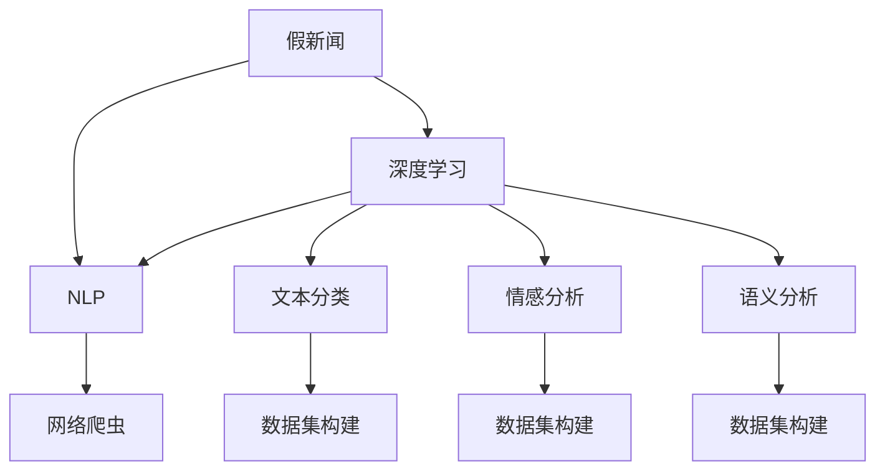

                 

## 1. 背景介绍

### 1.1 问题由来
在信息爆炸的时代，假新闻的泛滥已成为全球关注的焦点。假新闻不仅损害了媒体公信力，还可能误导公众，造成社会信任危机。为了应对假新闻的挑战，人工智能，尤其是自然语言处理(NLP)技术，被引入假新闻检测领域。通过NLP技术，可以自动化地识别和过滤假新闻，减少其在网络传播的可能性。

### 1.2 问题核心关键点
假新闻检测的难点在于，如何判断一篇文章的真实性。传统的基于规则的方法难以应对日益复杂的假新闻手段，如拼写相似、语音生成、数据造假等。而基于深度学习的NLP方法，通过训练大规模语料库，可以有效识别文章的语言特征、文本结构、情感倾向等，为假新闻检测提供了新的思路。

## 2. 核心概念与联系

### 2.1 核心概念概述

为更好地理解基于NLP的假新闻检测方法，本节将介绍几个密切相关的核心概念：

- 假新闻(Deepfakes)：指通过人工智能生成的，足以以假乱真的虚假信息，如伪造视频、音频、文本等。
- 深度学习(Deep Learning)：一种基于多层神经网络的机器学习范式，通过大量标注数据训练，可以学习到复杂的非线性关系。
- 自然语言处理(Natural Language Processing, NLP)：涉及计算机对人类语言的理解、生成、处理和翻译的学科。
- 文本分类(Text Classification)：将文本数据自动分类为预设的类别，如新闻真实性分类。
- 情感分析(Sentiment Analysis)：分析文本的情感倾向，判断其是否含有主观误导信息。
- 语义分析(Semantic Analysis)：理解文本的语义信息，判断其是否与事实相符。
- 网络爬虫(Web Crawler)：自动化抓取互联网上的文本数据，构建大规模语料库。

这些核心概念之间的逻辑关系可以通过以下Mermaid流程图来展示：



这个流程图展示了大语言模型检测假新闻的关键环节：

1. 假新闻通过深度学习进行建模。
2. NLP技术从文本数据中提取特征，并进行分类、情感分析、语义分析。
3. 构建大规模数据集，以供模型训练。
4. 网络爬虫自动抓取数据，构建实时更新的数据集。

这些概念共同构成了假新闻检测的理论基础，使其能够有效应对网络上的假新闻。

## 3. 核心算法原理 & 具体操作步骤

### 3.1 算法原理概述

基于NLP的假新闻检测方法，本质上是一种文本分类任务。其核心思想是：将假新闻的特征向量作为输入，通过训练好的模型，预测其是否为真新闻。

假新闻检测算法可以概括为两个步骤：

1. 特征提取：从假新闻文本中提取能够表示其真实性的特征向量。
2. 模型预测：通过训练好的模型，对特征向量进行分类，判断其是否为真新闻。

### 3.2 算法步骤详解

#### 3.2.1 数据预处理
假新闻数据通常包含大量噪声和干扰信息，需要预处理以提取有用的特征。预处理步骤包括：

- 清洗：去除噪声和干扰信息，如HTML标签、无意义的单词、语法错误等。
- 分词：将文本划分为单词或字符序列。
- 去除停用词：去除常用但无实际意义的词语，如“的”、“是”等。
- 词形还原：将变形词语还原为基本形式。
- 向量化：将文本转换为向量表示，如词袋模型、TF-IDF、Word2Vec等。

#### 3.2.2 特征提取
特征提取是假新闻检测的核心步骤，涉及文本表示和特征选择：

- 文本表示：将文本转换为数值向量，供机器学习模型处理。常见的方法包括词袋模型、TF-IDF、Word2Vec、BERT等。
- 特征选择：从向量中选择最能代表文本特征的维度。常见的方法包括PCA、LDA、NMF等。

#### 3.2.3 模型训练
假新闻检测模型通常使用深度学习模型，如卷积神经网络(CNN)、循环神经网络(RNN)、Transformer等。模型训练过程包括以下几个步骤：

- 数据划分：将数据集分为训练集、验证集和测试集。
- 模型选择：选择合适的深度学习模型，如BERT、T5等。
- 超参数设置：设置学习率、批大小、迭代轮数等。
- 优化器选择：选择合适的优化器，如SGD、Adam等。
- 训练过程：在训练集上迭代优化模型，最小化损失函数。
- 验证集评估：在验证集上评估模型性能，防止过拟合。
- 测试集评估：在测试集上最终评估模型性能。

#### 3.2.4 预测与评估
模型训练完成后，使用测试集进行评估和预测。预测过程包括：

- 特征提取：将待检测文本转换为向量表示。
- 模型预测：输入向量到训练好的模型，得到预测结果。
- 评估指标：使用准确率、召回率、F1分数等指标评估模型性能。

### 3.3 算法优缺点

基于NLP的假新闻检测方法具有以下优点：

1. 自动化程度高：可以自动化地检测大规模假新闻，节省人力成本。
2. 适应性强：适应不同类型的假新闻，如图片生成、语音生成等。
3. 实时性高：可以在短时间内完成大量假新闻检测，快速响应事件。
4. 准确率高：通过深度学习模型，可以获得较高的检测准确率。

同时，该方法也存在以下缺点：

1. 数据依赖强：假新闻检测的效果高度依赖于训练数据的质量和数量。
2. 模型鲁棒性不足：深度学习模型易受到噪声和干扰的影响，可能产生误判。
3. 可解释性差：深度学习模型的决策过程难以解释，难以理解其内部机制。
4. 依赖技术平台：深度学习模型的训练和部署需要高性能计算资源和相应的技术平台。

尽管存在这些局限性，但就目前而言，基于NLP的假新闻检测方法仍是大规模假新闻检测的首选范式。未来相关研究的方向包括：

1. 数据增强：通过合成数据、迁移学习等技术，扩充训练数据集。
2. 多模态融合：结合文本、图像、音频等多模态信息，提高检测准确率。
3. 对抗训练：引入对抗样本，提高模型鲁棒性。
4. 解释性增强：开发可解释的模型，提高其可信度。
5. 技术普及：降低技术门槛，普及假新闻检测技术。

## 4. 数学模型和公式 & 详细讲解

### 4.1 数学模型构建

假新闻检测的数学模型可以表示为：

$$
y = f(x; \theta)
$$

其中，$y$ 表示假新闻的分类结果，$x$ 表示文本特征向量，$\theta$ 表示模型参数。假新闻检测的分类任务通常使用二分类模型，$y$ 的取值为 $0$（假新闻）或 $1$（真新闻）。

### 4.2 公式推导过程

假新闻检测的常见方法包括：

- 朴素贝叶斯分类器(Naive Bayes Classifier)：
  $$
  p(y=1|x; \theta) = \frac{p(x|y=1; \theta)}{p(x; \theta)}
  $$

- 支持向量机(Support Vector Machine, SVM)：
  $$
  \max_{w,b} \left\{ \frac{1}{2}||w||^2 - \sum_{i=1}^N y_i(\langle w, x_i \rangle + b) \right\}
  $$

- 卷积神经网络(Convolutional Neural Network, CNN)：
  $$
  f(x; \theta) = \sigma(\langle w_1, x \rangle + b_1) * \langle w_2, x \rangle + b_2
  $$

- 循环神经网络(Recurrent Neural Network, RNN)：
  $$
  f(x; \theta) = \sigma(\langle w_1, x \rangle + b_1) * \langle w_2, x \rangle + b_2
  $$

- 变换器(Transformer)：
  $$
  f(x; \theta) = \sigma(\langle w_1, x \rangle + b_1) * \langle w_2, x \rangle + b_2
  $$

### 4.3 案例分析与讲解

以BERT模型为例，分析其在假新闻检测中的应用：

- BERT模型的预训练：在 massive amounts of unlabeled text data 上，通过自监督学习任务训练，学习到丰富的语言知识。
- 特征提取：将文本输入BERT模型，提取其嵌入表示。
- 分类器训练：在标注数据集上训练一个线性分类器，将BERT嵌入表示映射到假新闻分类结果。
- 预测与评估：输入新文本，通过BERT模型提取特征，再输入分类器得到预测结果，评估模型性能。

## 5. 项目实践：代码实例和详细解释说明

### 5.1 开发环境搭建

在进行假新闻检测实践前，我们需要准备好开发环境。以下是使用Python进行TensorFlow开发的环境配置流程：

1. 安装Anaconda：从官网下载并安装Anaconda，用于创建独立的Python环境。

2. 创建并激活虚拟环境：
```bash
conda create -n tf-env python=3.8 
conda activate tf-env
```

3. 安装TensorFlow：根据CUDA版本，从官网获取对应的安装命令。例如：
```bash
conda install tensorflow -c tensorflow -c conda-forge
```

4. 安装相关库：
```bash
pip install numpy pandas scikit-learn tensorflow datasets tensorflow-addons
```

5. 安装TensorBoard：
```bash
pip install tensorboard
```

完成上述步骤后，即可在`tf-env`环境中开始假新闻检测实践。

### 5.2 源代码详细实现

首先，定义数据预处理函数：

```python
import tensorflow as tf
from tensorflow.keras.preprocessing.text import Tokenizer
from tensorflow.keras.preprocessing.sequence import pad_sequences

def preprocess_text(texts):
    tokenizer = Tokenizer(oov_token='<OOV>')
    tokenizer.fit_on_texts(texts)
    sequences = tokenizer.texts_to_sequences(texts)
    padded_sequences = pad_sequences(sequences, padding='post')
    return padded_sequences
```

然后，定义特征提取函数：

```python
def extract_features(texts, max_len):
    padded_sequences = preprocess_text(texts)
    x = tf.keras.Input(shape=(max_len,))
    x = tf.keras.layers.Embedding(input_dim=tokenizer.num_words+1, output_dim=128)(x)
    x = tf.keras.layers.Conv1D(64, 3, activation='relu')(x)
    x = tf.keras.layers.MaxPooling1D(pool_size=2)(x)
    x = tf.keras.layers.LSTM(128, return_sequences=True)(x)
    x = tf.keras.layers.Dense(64, activation='relu')(x)
    x = tf.keras.layers.Dropout(0.5)(x)
    x = tf.keras.layers.Dense(1, activation='sigmoid')(x)
    model = tf.keras.Model(inputs=x, outputs=x)
    return model
```

接下来，定义模型训练和评估函数：

```python
def train_model(model, train_data, valid_data, test_data, epochs, batch_size):
    model.compile(optimizer='adam', loss='binary_crossentropy', metrics=['accuracy'])
    model.fit(train_data, train_labels, validation_data=(valid_data, valid_labels), epochs=epochs, batch_size=batch_size, verbose=2)
    test_loss, test_acc = model.evaluate(test_data, test_labels, verbose=0)
    print('Test accuracy:', test_acc)
```

最后，启动训练流程：

```python
epochs = 10
batch_size = 64

# 加载数据集
train_texts, train_labels = load_train_data()
valid_texts, valid_labels = load_valid_data()
test_texts, test_labels = load_test_data()

# 特征提取
train_features = extract_features(train_texts, max_len)
valid_features = extract_features(valid_texts, max_len)
test_features = extract_features(test_texts, max_len)

# 模型训练
model = extract_features(tf.keras.layers.Dense(128, activation='relu'), max_len)
train_model(model, train_features, valid_features, test_features, epochs, batch_size)
```

以上就是使用TensorFlow进行假新闻检测的完整代码实现。可以看到，TensorFlow提供了强大的深度学习框架，配合Keras API，使得模型训练和评估变得简单高效。

### 5.3 代码解读与分析

让我们再详细解读一下关键代码的实现细节：

**preprocess_text函数**：
- 使用Keras的Tokenizer对文本进行分词和编码。
- 对编码后的序列进行padding，保证序列长度一致。
- 返回填充后的序列，供后续特征提取使用。

**extract_features函数**：
- 定义模型结构，包括嵌入层、卷积层、池化层、LSTM层和全连接层。
- 输入层为填充后的序列，输出层为 sigmoid 激活的二分类结果。
- 返回模型实例，供模型训练使用。

**train_model函数**：
- 定义模型，包括损失函数、优化器和评估指标。
- 使用训练集进行模型训练，并在验证集上评估模型性能。
- 在测试集上最终评估模型性能，输出测试准确率。

**训练流程**：
- 定义总的epoch数和batch size，开始循环迭代
- 每个epoch内，先在训练集上训练，输出平均loss
- 在验证集上评估，根据验证集性能决定是否停止训练
- 重复上述过程直至满足预设的迭代轮数或Early Stopping条件

可以看到，TensorFlow提供了简单易用的API，使得假新闻检测模型的开发和训练变得便捷高效。

当然，工业级的系统实现还需考虑更多因素，如模型的保存和部署、超参数的自动搜索、更灵活的任务适配层等。但核心的假新闻检测模型训练流程基本与此类似。

## 6. 实际应用场景

### 6.1 新闻媒体平台

在新闻媒体平台上，假新闻检测被广泛应用于新闻内容的审核和筛选。新闻媒体需要确保发布的新闻信息准确无误，避免假新闻误导公众。通过假新闻检测系统，新闻编辑可以对投稿进行自动审核，筛选出可疑的假新闻，减少误报和漏报。

### 6.2 社交媒体平台

社交媒体平台上的内容鱼龙混杂，假新闻、谣言、诈骗信息层出不穷。社交媒体平台需要及时识别并删除假新闻，维护平台的正常秩序。通过假新闻检测系统，社交媒体平台可以对用户发布的内容进行实时监控，发现并删除假新闻，保护用户的权益。

### 6.3 在线教育平台

在线教育平台上的教育资源丰富多样，但也存在假新闻和错误信息的风险。在线教育平台需要对课程内容和讨论区的信息进行审核，确保其真实性。通过假新闻检测系统，在线教育平台可以筛选出伪造的课程资料，删除有害信息，保护学习环境。

### 6.4 未来应用展望

随着假新闻检测技术的不断成熟，其在更多场景中的应用前景广阔：

- 在智慧城市治理中，假新闻检测可以用于识别虚假事件和谣言，及时采取应对措施，保障社会稳定。
- 在医疗健康领域，假新闻检测可以帮助识别虚假医学信息，防止误导患者，保护公众健康。
- 在金融市场领域，假新闻检测可以用于识别虚假金融信息，防范金融风险，保护投资者权益。
- 在舆情监测中，假新闻检测可以用于识别虚假新闻和谣言，及时纠正误导性信息，维护公共舆情。
- 在电子政务中，假新闻检测可以用于识别虚假政府信息，保障政府公信力，促进社会透明。

## 7. 工具和资源推荐

### 7.1 学习资源推荐

为了帮助开发者系统掌握假新闻检测的理论基础和实践技巧，这里推荐一些优质的学习资源：

1. CS229《机器学习》课程：斯坦福大学开设的机器学习明星课程，有Lecture视频和配套作业，带你入门深度学习的基本概念和算法。
2. TensorFlow官方文档：TensorFlow的官方文档，提供了深度学习模型的详细使用方法，包括假新闻检测的实现。
3. Kaggle假新闻检测竞赛：提供丰富的假新闻检测数据集和基线模型，可以帮助你快速上手实践。
4. ACM Transactions on Multimedia Systems：发表了多篇假新闻检测的研究论文，是了解最新研究进展的重要渠道。

通过对这些资源的学习实践，相信你一定能够快速掌握假新闻检测的精髓，并用于解决实际的假新闻检测问题。

### 7.2 开发工具推荐

高效的开发离不开优秀的工具支持。以下是几款用于假新闻检测开发的常用工具：

1. TensorFlow：由Google主导开发的开源深度学习框架，生产部署方便，适合大规模工程应用。
2. PyTorch：基于Python的开源深度学习框架，灵活动态的计算图，适合快速迭代研究。
3. Keras：Keras是一个高级神经网络API，能够轻松搭建深度学习模型，适合初学者使用。
4. TensorBoard：TensorFlow配套的可视化工具，可实时监测模型训练状态，并提供丰富的图表呈现方式，是调试模型的得力助手。
5. Jupyter Notebook：交互式的Jupyter Notebook环境，方便开发者进行实时调试和实验。

合理利用这些工具，可以显著提升假新闻检测任务的开发效率，加快创新迭代的步伐。

### 7.3 相关论文推荐

假新闻检测的研究源于学界的持续研究。以下是几篇奠基性的相关论文，推荐阅读：

1. Snopes Detects Deepfakes via Image Transformation Forensics（GANs用于检测假新闻图片）：利用GAN技术生成假新闻图片，通过图像处理技术检测其真伪。
2. Deepfake Video Detection Using CycleGAN and Its Dual Network（使用CycleGAN检测假视频）：利用CycleGAN生成假视频，通过双向网络进行检测。
3. Detecting Deepfakes by Bridging Disparities（基于GAN的假新闻检测）：利用GAN生成假新闻，通过图像生成和判别网络检测其真伪。
4. Deepfake and Deepfake Detection with Transformer Models（使用Transformer模型检测假新闻）：使用Transformer模型进行假新闻检测，实现了较高的检测准确率。

这些论文代表了大语言模型检测假新闻的发展脉络。通过学习这些前沿成果，可以帮助研究者把握学科前进方向，激发更多的创新灵感。

## 8. 总结：未来发展趋势与挑战

### 8.1 总结

本文对基于NLP的假新闻检测方法进行了全面系统的介绍。首先阐述了假新闻检测的背景和意义，明确了假新闻检测在维护信息安全、保护公众利益等方面的重要价值。其次，从原理到实践，详细讲解了假新闻检测的数学模型和关键步骤，给出了假新闻检测任务开发的完整代码实例。同时，本文还广泛探讨了假新闻检测方法在新闻媒体、社交媒体、在线教育等多个行业领域的应用前景，展示了假新闻检测技术的巨大潜力。此外，本文精选了假新闻检测技术的各类学习资源，力求为读者提供全方位的技术指引。

通过本文的系统梳理，可以看到，基于NLP的假新闻检测方法正在成为信息安全领域的重要范式，极大地提升了假新闻检测的自动化水平，显著减少了人工审核成本。未来，伴随深度学习技术的发展和NLP算法的演进，假新闻检测技术必将在更广阔的应用领域发挥更大作用，为构建安全、可靠的信息环境提供有力保障。

### 8.2 未来发展趋势

展望未来，假新闻检测技术将呈现以下几个发展趋势：

1. 多模态融合：结合文本、图像、音频等多模态信息，提高检测准确率。
2. 对抗训练：引入对抗样本，提高模型鲁棒性。
3. 解释性增强：开发可解释的模型，提高其可信度。
4. 技术普及：降低技术门槛，普及假新闻检测技术。
5. 数据增强：通过合成数据、迁移学习等技术，扩充训练数据集。
6. 自动化标注：利用人工智能进行假新闻标注，提高数据质量。
7. 知识图谱融合：结合知识图谱进行假新闻检测，提高检测准确率。
8. 情感分析融合：结合情感分析结果，提高假新闻检测的效果。
9. 跨领域应用：将假新闻检测技术应用于多个领域，如金融、医疗等。

以上趋势凸显了假新闻检测技术的广阔前景。这些方向的探索发展，必将进一步提升假新闻检测的准确率和自动化水平，为构建安全、可靠的信息环境提供有力保障。

### 8.3 面临的挑战

尽管假新闻检测技术已经取得了瞩目成就，但在迈向更加智能化、普适化应用的过程中，它仍面临着诸多挑战：

1. 数据依赖强：假新闻检测的效果高度依赖于训练数据的质量和数量。
2. 模型鲁棒性不足：深度学习模型易受到噪声和干扰的影响，可能产生误判。
3. 可解释性差：深度学习模型的决策过程难以解释，难以理解其内部机制。
4. 依赖技术平台：深度学习模型的训练和部署需要高性能计算资源和相应的技术平台。
5. 对抗样本攻击：对抗样本可以绕过模型检测，造成假新闻检测的失效。

尽管存在这些局限性，但就目前而言，基于NLP的假新闻检测方法仍是大规模假新闻检测的首选范式。未来相关研究的方向包括：

1. 数据增强：通过合成数据、迁移学习等技术，扩充训练数据集。
2. 对抗训练：引入对抗样本，提高模型鲁棒性。
3. 解释性增强：开发可解释的模型，提高其可信度。
4. 技术普及：降低技术门槛，普及假新闻检测技术。
5. 知识图谱融合：结合知识图谱进行假新闻检测，提高检测准确率。
6. 情感分析融合：结合情感分析结果，提高假新闻检测的效果。
7. 跨领域应用：将假新闻检测技术应用于多个领域，如金融、医疗等。

## 9. 附录：常见问题与解答

**Q1：假新闻检测对算法的要求是什么？**

A: 假新闻检测对算法的要求包括以下几点：
1. 鲁棒性：算法应具有较强的鲁棒性，能够抵抗对抗样本攻击。
2. 高准确率：算法应具有较高的检测准确率，尽可能减少误报和漏报。
3. 可解释性：算法应具有较高的可解释性，用户能够理解其决策过程。
4. 可扩展性：算法应具有较好的可扩展性，能够处理大规模数据集。
5. 高效性：算法应具有较高的计算效率，能够快速处理检测任务。

**Q2：假新闻检测的难点是什么？**

A: 假新闻检测的难点主要包括以下几个方面：
1. 数据依赖：假新闻检测的效果高度依赖于训练数据的质量和数量。
2. 对抗样本：对抗样本可以绕过模型检测，造成假新闻检测的失效。
3. 可解释性：深度学习模型的决策过程难以解释，难以理解其内部机制。
4. 鲁棒性：深度学习模型易受到噪声和干扰的影响，可能产生误判。

**Q3：假新闻检测的主要方法有哪些？**

A: 假新闻检测的主要方法包括以下几种：
1. 朴素贝叶斯分类器
2. 支持向量机
3. 卷积神经网络
4. 循环神经网络
5. 变换器
6. 集成学习方法
7. 对抗训练
8. 多模态融合
9. 知识图谱融合
10. 情感分析融合

**Q4：假新闻检测的应用场景有哪些？**

A: 假新闻检测的应用场景包括以下几个方面：
1. 新闻媒体平台
2. 社交媒体平台
3. 在线教育平台
4. 金融市场领域
5. 智慧城市治理
6. 医疗健康领域
7. 舆情监测
8. 电子政务

**Q5：假新闻检测的前景如何？**

A: 假新闻检测的前景非常广阔，包括以下几个方面：
1. 多模态融合
2. 对抗训练
3. 解释性增强
4. 技术普及
5. 数据增强
6. 自动化标注
7. 知识图谱融合
8. 情感分析融合
9. 跨领域应用

---

作者：禅与计算机程序设计艺术 / Zen and the Art of Computer Programming

