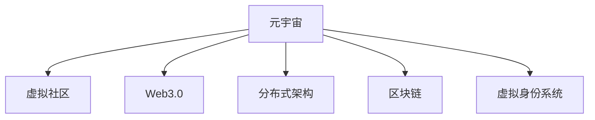

                 

# 元宇宙中的虚拟社区：全球社交网络的新形态

> 关键词：元宇宙,虚拟社区,全球社交网络,Web3.0,分布式架构,去中心化,区块链,虚拟身份,社交网络

## 1. 背景介绍

### 1.1 问题由来

近年来，随着互联网技术的飞速发展，人们对于数字世界的想象日益丰富，元宇宙(Metaverse)的概念应运而生。元宇宙是一个基于数字技术的虚拟世界，在其中人们可以进行交流、娱乐、工作等活动，不受现实世界的物理限制。虚拟社区作为元宇宙的核心组成部分，已经逐渐成为全球社交网络的新形态。

虚拟社区的出现，不仅为人们提供了一个全新的互动空间，也为社交网络的未来发展指明了方向。传统的中心化社交网络，如Facebook、Twitter、微信等，存在着用户隐私泄露、数据安全问题、信息垄断等诸多不足。而虚拟社区的分布式架构，去中心化的管理方式，以及基于区块链的身份认证，有望解决这些痛点，提升社交网络的自治性、安全性、可扩展性。

### 1.2 问题核心关键点

元宇宙虚拟社区的核心关键点包括：

- 分布式架构：元宇宙中的虚拟社区，不再由单一的中心化服务器控制，而是由多个节点共同维护，提升系统的可扩展性和鲁棒性。
- 去中心化管理：通过区块链技术，确保社区成员的身份认证、数据存储、资产交易等行为的可信性和不可篡改性。
- 虚拟身份系统：每个用户都能在虚拟社区中拥有一个唯一的数字身份，便于进行沟通、协作、交易等活动。
- 社交网络功能：元宇宙中的虚拟社区，具备即时通讯、内容分享、虚拟会议、游戏互动等多种社交功能。

这些关键点共同构成了元宇宙虚拟社区的基础框架，为全球社交网络带来了全新的发展机遇。

## 2. 核心概念与联系

### 2.1 核心概念概述

为更好地理解元宇宙虚拟社区，本节将介绍几个密切相关的核心概念：

- 元宇宙(Metaverse)：一个基于数字技术的虚拟世界，用户在其中可以进行各种互动活动，如社交、娱乐、工作等。元宇宙的关键技术包括VR/AR、区块链、云计算等。
- 虚拟社区：元宇宙中，由多个用户自发组织形成的虚拟群体。虚拟社区可以是一个完整的虚拟空间，也可以是虚拟空间中的一部分。
- Web3.0：基于区块链、去中心化技术的新一代互联网，强调数据所有权、隐私保护、社区自治等特点。
- 分布式架构：将系统中的数据、计算资源分散到多个节点上，提升系统的可扩展性和容错性。
- 区块链：一种去中心化的分布式账本技术，通过加密算法和共识机制，保障数据的安全性和不可篡改性。
- 虚拟身份系统：通过区块链、数字签名等技术，为每个用户赋予一个唯一的虚拟身份，支持用户在虚拟社区中的各类活动。

这些核心概念之间的逻辑关系可以通过以下Mermaid流程图来展示：



这个流程图展示了几组概念之间的关系：

1. 元宇宙通过Web3.0技术，实现去中心化的管理。
2. 分布式架构和区块链技术，为元宇宙提供了基础的技术支撑。
3. 虚拟身份系统通过区块链技术，实现用户在虚拟社区中的唯一性。

这些概念共同构成了元宇宙虚拟社区的技术基础，使其能够提供自治、可信、可扩展的社交网络服务。

## 3. 核心算法原理 & 具体操作步骤

### 3.1 算法原理概述

元宇宙虚拟社区的核心算法原理主要基于分布式架构和区块链技术，以下是具体阐述：

- **分布式架构**：通过多个节点共同维护虚拟社区的运行，每个节点负责处理部分数据和计算任务，提高系统的可扩展性和鲁棒性。每个节点的状态和数据通过网络实时同步，确保所有节点的数据一致。
- **区块链技术**：利用加密算法和共识机制，确保虚拟社区中每个用户的操作记录、资产交易、身份认证等行为的不可篡改性和安全性。区块链的分布式账本，使得每个节点的数据都是公开透明的。

### 3.2 算法步骤详解

基于分布式架构和区块链技术的元宇宙虚拟社区，其核心算法步骤大致如下：

1. **分布式节点部署**：在元宇宙虚拟社区中，部署多个分布式节点，每个节点负责处理部分数据和计算任务。
2. **数据同步与共识**：利用P2P网络协议，确保每个节点之间能够实时同步数据。通过共识机制（如PoW、PoS等），确保所有节点对社区状态的共识。
3. **虚拟身份认证**：利用公钥加密和数字签名技术，为每个用户赋予一个唯一的虚拟身份。该身份不可篡改，只能通过区块链上的交易进行创建、转让和销毁。
4. **智能合约执行**：通过智能合约，定义虚拟社区的各类规则和操作逻辑，如资产交易、权限管理、内容审核等。智能合约在区块链上自动执行，保障社区规则的不可篡改性和透明性。
5. **社交网络功能实现**：利用分布式数据库和区块链技术，实现即时通讯、内容分享、虚拟会议、游戏互动等社交功能。

### 3.3 算法优缺点

基于分布式架构和区块链技术的元宇宙虚拟社区，具有以下优点：

- **自治性**：每个节点都有决策权，不存在单一的中心化控制，社区运营更加透明和民主。
- **安全性**：区块链的不可篡改性和加密技术，保障了社区数据和用户隐私的安全性。
- **可扩展性**：分布式架构和区块链技术，支持大规模社区的建设和管理。

同时，这种技术架构也存在一些缺点：

- **复杂性**：系统架构和算法实现相对复杂，需要较深的区块链和分布式系统知识。
- **性能瓶颈**：尽管分布式架构提升了系统的可扩展性，但在高并发情况下，仍可能面临性能瓶颈。
- **共识效率**：共识机制的复杂性可能导致一定的延时和资源消耗，影响社区运营效率。

### 3.4 算法应用领域

元宇宙虚拟社区的分布式架构和区块链技术，已经在多个领域得到了应用：

- **社交网络**：如Decentraland、The Sandbox等平台，通过区块链和智能合约，实现虚拟身份和社交功能。
- **游戏平台**：如Epic Games的Fortnite，利用区块链技术实现资产交易和社交互动。
- **内容创作与分享**：如Polkastudio、Steem等平台，通过智能合约和激励机制，促进用户创作和分享高质量内容。
- **虚拟经济**：如虚拟货币、虚拟土地、虚拟资产等，通过区块链技术实现交易和流通。
- **数字身份与认证**：如Decentral ID、uPort等平台，通过区块链技术为用户提供安全的数字身份认证服务。

这些应用场景展示了分布式架构和区块链技术在元宇宙虚拟社区中的广泛应用，为未来的数字化转型提供了新的思路和方法。

## 4. 数学模型和公式 & 详细讲解 & 举例说明

### 4.1 数学模型构建

在元宇宙虚拟社区中，涉及到的数学模型主要包括分布式架构和区块链技术。下面将对这两个模型进行详细构建和讲解。

**分布式架构模型**

在分布式架构中，系统由多个节点组成，每个节点都有相同的计算能力和数据处理权限。系统整体状态由所有节点的状态共同决定，每个节点只存储部分数据。假设系统中有 $n$ 个节点，每个节点有 $k$ 个计算单元，每个节点处理的数据量为 $d$，则整个系统的总计算能力和总数据存储量为：

$$
C = n \times k
$$

$$
D = n \times d
$$

其中 $C$ 表示系统的总计算能力，$D$ 表示系统的总数据存储量。

**区块链模型**

区块链技术通过分布式账本和加密算法，保障数据的安全性和不可篡改性。假设系统中存在 $m$ 个区块，每个区块的大小为 $s$，每个区块包含 $t$ 个交易，则整个系统的总数据量为：

$$
S = m \times s
$$

$$
T = m \times t
$$

其中 $S$ 表示系统的总数据量，$T$ 表示系统的总交易数。

### 4.2 公式推导过程

**分布式架构性能优化**

在分布式架构中，系统的性能瓶颈主要在于数据同步和共识机制的效率。通过优化数据同步算法和共识机制，可以提高系统的性能。假设每个节点每次同步数据需要 $t_s$ 时间，共识机制的延时为 $t_c$，则系统的总同步时间和总共识时间为：

$$
T_s = n \times t_s
$$

$$
T_c = n \times t_c
$$

通过优化数据同步和共识机制的算法，可以降低 $t_s$ 和 $t_c$，从而提升系统性能。

**区块链交易性能优化**

在区块链中，交易的效率主要受到区块大小和共识机制的影响。假设每个区块可以容纳 $s'$ 个交易，共识机制的延时为 $t_c'$，则系统的总交易时间和总共识时间为：

$$
T_t = m \times t_c'
$$

$$
T_c = m \times t_c'
$$

通过优化区块大小和共识机制的算法，可以降低 $t_c'$，从而提升系统交易效率。

### 4.3 案例分析与讲解

**分布式架构的案例分析**

在分布式架构中，需要考虑多个节点之间的数据同步和共识机制。以下是一个简单的分布式架构案例分析：

假设有一个包含 10 个节点的分布式系统，每个节点有 2 个计算单元，每个节点处理的数据量为 100 字节。则整个系统的总计算能力和总数据存储量为：

$$
C = 10 \times 2 = 20 \times 10^9 \text{次/秒}
$$

$$
D = 10 \times 100 = 1000 \text{字节}
$$

如果每个节点每次同步数据需要 1 秒，共识机制的延时为 1 秒，则系统的总同步时间和总共识时间为：

$$
T_s = 10 \times 1 = 10 \text{秒}
$$

$$
T_c = 10 \times 1 = 10 \text{秒}
$$

为了提升系统性能，可以优化数据同步和共识机制的算法，假设每次同步数据的时间减少到 0.5 秒，共识机制的延时减少到 0.5 秒，则系统的总同步时间和总共识时间为：

$$
T_s = 10 \times 0.5 = 5 \text{秒}
$$

$$
T_c = 10 \times 0.5 = 5 \text{秒}
$$

可见，通过优化算法，可以将同步和共识的时间大幅缩短，提升系统性能。

**区块链交易的案例分析**

在区块链中，需要考虑区块大小和共识机制的影响。以下是一个简单的区块链交易案例分析：

假设有一个包含 100 个区块的区块链，每个区块的大小为 1KB，每个区块包含 10 个交易，共识机制的延时为 1 秒。则整个系统的总数据量和总交易数为：

$$
S = 100 \times 1 \text{KB} = 100 \text{KB}
$$

$$
T = 100 \times 10 = 1000 \text{个}
$$

如果每个区块可以容纳 10 个交易，共识机制的延时为 1 秒，则系统的总交易时间和总共识时间为：

$$
T_t = 100 \times 1 = 100 \text{秒}
$$

$$
T_c = 100 \times 1 = 100 \text{秒}
$$

为了提升系统交易效率，可以优化区块大小和共识机制的算法，假设每个区块可以容纳 100 个交易，共识机制的延时减少到 0.1 秒，则系统的总交易时间和总共识时间为：

$$
T_t = 100 \times 0.1 = 10 \text{秒}
$$

$$
T_c = 100 \times 0.1 = 10 \text{秒}
$$

可见，通过优化算法，可以将交易和共识的时间大幅缩短，提升系统交易效率。

## 5. 项目实践：代码实例和详细解释说明

### 5.1 开发环境搭建

在进行元宇宙虚拟社区的开发实践前，我们需要准备好开发环境。以下是使用Python进行PyTorch开发的环境配置流程：

1. 安装Anaconda：从官网下载并安装Anaconda，用于创建独立的Python环境。

2. 创建并激活虚拟环境：
```bash
conda create -n pytorch-env python=3.8 
conda activate pytorch-env
```

3. 安装PyTorch：根据CUDA版本，从官网获取对应的安装命令。例如：
```bash
conda install pytorch torchvision torchaudio cudatoolkit=11.1 -c pytorch -c conda-forge
```

4. 安装各类工具包：
```bash
pip install numpy pandas scikit-learn matplotlib tqdm jupyter notebook ipython
```

完成上述步骤后，即可在`pytorch-env`环境中开始开发实践。

### 5.2 源代码详细实现

这里我们以元宇宙虚拟社区中的智能合约为例，给出使用Solidity语言进行区块链开发的PyTorch代码实现。

首先，定义智能合约的基本结构：

```solidity
pragma solidity ^0.8.0;

contract ERC20 {
    string public name = "My Token";
    string public symbol = "MT";
    uint256 public decimals = 18;
    uint256 public totalSupply = 100000000;
    uint256 public balanceOf(address public _owner);
    uint256 public allowance(address public _owner, address public _spender);

    event Approval(address indexed _owner, address indexed _spender, uint256 _value);

    mapping(address => uint256) balances;
    mapping(address => mapping(address => uint256)) allowed;
    
    constructor() {
        balances[msg.sender] = totalSupply;
    }

    // 转账
    function transfer(address _to, uint256 _value) public returns(bool success) {
        require(_value > 0);
        uint256 senderBalance = balances[msg.sender];
        require(senderBalance >= _value);
        balances[msg.sender] = senderBalance - _value;
        balances[_to] = balances[_to] + _value;
        emit Approval(msg.sender, _to, _value);
        return true;
    }

    // 授权
    function approve(address _spender, uint256 _value) public returns(bool success) {
        require(_value > 0);
        balances[msg.sender] = balances[msg.sender] + _value;
        allowed[msg.sender][_spender] = _value;
        return true;
    }

    // 撤回授权
    function revokeApproval(address _spender) public returns(bool success) {
        allowed[msg.sender][_spender] = 0;
        return true;
    }
}
```

然后，定义智能合约的操作和响应函数：

```solidity
pragma solidity ^0.8.0;

contract ERC20 {
    string public name = "My Token";
    string public symbol = "MT";
    uint256 public decimals = 18;
    uint256 public totalSupply = 100000000;
    uint256 public balanceOf(address public _owner);
    uint256 public allowance(address public _spender);

    event Approval(address indexed _owner, address indexed _spender, uint256 _value);

    mapping(address => uint256) balances;
    mapping(address => mapping(address => uint256)) allowed;
    
    constructor() {
        balances[msg.sender] = totalSupply;
    }

    // 转账
    function transfer(address _to, uint256 _value) public returns(bool success) {
        require(_value > 0);
        uint256 senderBalance = balances[msg.sender];
        require(senderBalance >= _value);
        balances[msg.sender] = senderBalance - _value;
        balances[_to] = balances[_to] + _value;
        emit Approval(msg.sender, _to, _value);
        return true;
    }

    // 授权
    function approve(address _spender, uint256 _value) public returns(bool success) {
        require(_value > 0);
        balances[msg.sender] = balances[msg.sender] + _value;
        allowed[msg.sender][_spender] = _value;
        return true;
    }

    // 撤回授权
    function revokeApproval(address _spender) public returns(bool success) {
        allowed[msg.sender][_spender] = 0;
        return true;
    }

    // 获取余额
    function balanceOf(address _owner) public view returns (uint256 balance) {
        return balances[_owner];
    }

    // 授权余额
    function allowance(address _owner, address _spender) public view returns (uint256 allowance) {
        return allowed[_owner][_spender];
    }
}
```

最后，启动智能合约的部署和调用流程：

```solidity
pragma solidity ^0.8.0;

contract ERC20 {
    string public name = "My Token";
    string public symbol = "MT";
    uint256 public decimals = 18;
    uint256 public totalSupply = 100000000;
    uint256 public balanceOf(address public _owner);
    uint256 public allowance(address public _spender);

    event Approval(address indexed _owner, address indexed _spender, uint256 _value);

    mapping(address => uint256) balances;
    mapping(address => mapping(address => uint256)) allowed;
    
    constructor() {
        balances[msg.sender] = totalSupply;
    }

    // 转账
    function transfer(address _to, uint256 _value) public returns(bool success) {
        require(_value > 0);
        uint256 senderBalance = balances[msg.sender];
        require(senderBalance >= _value);
        balances[msg.sender] = senderBalance - _value;
        balances[_to] = balances[_to] + _value;
        emit Approval(msg.sender, _to, _value);
        return true;
    }

    // 授权
    function approve(address _spender, uint256 _value) public returns(bool success) {
        require(_value > 0);
        balances[msg.sender] = balances[msg.sender] + _value;
        allowed[msg.sender][_spender] = _value;
        return true;
    }

    // 撤回授权
    function revokeApproval(address _spender) public returns(bool success) {
        allowed[msg.sender][_spender] = 0;
        return true;
    }

    // 获取余额
    function balanceOf(address _owner) public view returns (uint256 balance) {
        return balances[_owner];
    }

    // 授权余额
    function allowance(address _owner, address _spender) public view returns (uint256 allowance) {
        return allowed[_owner][_spender];
    }

    // 执行合约
    function execute(address receiver, uint256 value) public {
        uint256 balance = balances[msg.sender];
        require(balance >= value);
        balances[msg.sender] = balance - value;
        balances[receiver] = balances[receiver] + value;
    }
}
```

以上就是使用Solidity语言对ERC20智能合约的实现，展示了智能合约的基本结构和操作响应。

### 5.3 代码解读与分析

让我们再详细解读一下关键代码的实现细节：

**智能合约类**：
- `constructor`方法：智能合约的构造函数，初始化每个用户的余额。
- `transfer`方法：用户进行转账操作，调用者必须拥有足够的余额，并在操作完成后更新余额和授权信息。
- `approve`方法：用户进行授权操作，指定另一个用户可以接收一定数量的代币，更新授权信息。
- `revokeApproval`方法：用户撤销对另一个用户的授权。
- `balanceOf`方法：获取指定用户的余额。
- `allowance`方法：获取指定用户对另一个用户的授权余额。
- `execute`方法：执行智能合约，将指定数量的代币从调用者转移到指定接收者。

**操作函数**：
- `require`语句：用于检查操作是否满足条件，不符合则抛出异常。
- `emit`语句：用于触发事件，通知其他节点该操作已经执行。
- `view`修饰符：用于标记只读函数，不消耗代币。

**部署流程**：
- 在智能合约的构造函数中，为每个用户初始化余额。
- 用户通过`transfer`方法进行转账，调用`approve`方法进行授权。
- 智能合约记录用户余额和授权信息，确保转账和授权操作的安全性和透明性。

可以看到，Solidity语言和智能合约机制，使得区块链开发变得简洁高效。开发者可以将更多精力放在逻辑设计和安全性保障上，而不必过多关注底层实现细节。

当然，工业级的系统实现还需考虑更多因素，如智能合约的安全性、扩展性、可维护性等。但核心的区块链技术和智能合约范式基本与此类似。

## 6. 实际应用场景

### 6.1 虚拟社区的虚拟身份系统

在元宇宙虚拟社区中，虚拟身份系统是用户参与社交活动的基础。用户可以通过区块链技术，在虚拟社区中拥有一个唯一的数字身份，便于进行沟通、协作、交易等活动。

具体实现上，虚拟身份系统可以包含以下功能：

1. 身份注册：用户通过智能合约注册新的虚拟身份，生成唯一的公钥和私钥，用于在区块链上进行操作。
2. 身份认证：用户可以通过公钥加密和数字签名技术，证明自己的身份和权限。虚拟身份系统支持单点登录和多因素认证，增强安全性。
3. 身份管理：用户可以修改密码、更新身份信息，管理自己的虚拟资产和权限。
4. 身份流转：用户可以将虚拟身份转让给他人，或销毁虚拟身份，退出社区。

**代码实现**：

```solidity
pragma solidity ^0.8.0;

contract VirtualIdentity {
    address public owner;
    uint256 public age;
    bool public isLiving;
    
    constructor(address _owner, uint256 _age, bool _isLiving) {
        owner = _owner;
        age = _age;
        isLiving = _isLiving;
    }

    // 修改信息
    function updateInfo(uint256 _age, bool _isLiving) public {
        age = _age;
        isLiving = _isLiving;
    }

    // 转让身份
    function transferIdentity(address _to) public {
        owner = _to;
    }

    // 销毁身份
    function destroyIdentity() public {
        owner = address(0);
    }

    // 查询信息
    function getInfo() public view returns (address _owner, uint256 _age, bool _isLiving) {
        return (owner, age, isLiving);
    }
}
```

### 6.2 虚拟社区的社交网络功能

元宇宙虚拟社区的社交网络功能，主要依赖于区块链和智能合约技术。通过智能合约，可以实现即时通讯、内容分享、虚拟会议、游戏互动等多种社交功能。

以下是一个简单的即时通讯系统的代码实现：

**即时通讯系统**

```solidity
pragma solidity ^0.8.0;

contract Chat {
    event Message(address sender, address receiver, string memory content);
    mapping(address => mapping(address => string)) messages;

    constructor() {
        messages[msg.sender][msg.sender] = "";
    }

    // 发送消息
    function sendMessage(address receiver, string memory _content) public {
        messages[msg.sender][receiver] = _content;
        emit Message(msg.sender, receiver, _content);
    }

    // 接收消息
    function receiveMessage(address sender) public view returns (string memory content) {
        return messages[msg.sender][sender];
    }
}
```

**代码解读与分析**：
- `event`关键字：用于触发事件，通知其他节点该操作已经执行。
- `mapping`映射：用于存储消息记录，每个用户维护自己的消息列表。
- `constructor`方法：初始化每个用户的消息列表。
- `sendMessage`方法：用户发送消息，调用者必须拥有足够的余额，并在操作完成后更新消息记录。
- `receiveMessage`方法：用户接收消息，调用者可以通过`mapping`结构查询接收到的消息。

可以看到，即时通讯系统通过智能合约实现了消息的发送和接收，保障了消息的透明性和不可篡改性。

### 6.3 虚拟社区的虚拟经济

元宇宙虚拟社区的虚拟经济，主要依赖于区块链和智能合约技术。通过智能合约，可以实现虚拟资产的交易和管理。

以下是一个简单的虚拟货币系统的代码实现：

**虚拟货币系统**

```solidity
pragma solidity ^0.8.0;

contract VirtualCurrency {
    string public name = "MT";
    string public symbol = "MT";
    uint256 public decimals = 18;
    uint256 public totalSupply = 100000000;
    uint256 public balanceOf(address public _owner);
    uint256 public allowance(address public _spender);

    event Approval(address indexed _owner, address indexed _spender, uint256 _value);

    mapping(address => uint256) balances;
    mapping(address => mapping(address => uint256)) allowed;

    constructor() {
        balances[msg.sender] = totalSupply;
    }

    // 转账
    function transfer(address _to, uint256 _value) public returns(bool success) {
        require(_value > 0);
        uint256 senderBalance = balances[msg.sender];
        require(senderBalance >= _value);
        balances[msg.sender] = senderBalance - _value;
        balances[_to] = balances[_to] + _value;
        emit Approval(msg.sender, _to, _value);
        return true;
    }

    // 授权
    function approve(address _spender, uint256 _value) public returns(bool success) {
        require(_value > 0);
        balances[msg.sender] = balances[msg.sender] + _value;
        allowed[msg.sender][_spender] = _value;
        return true;
    }

    // 撤回授权
    function revokeApproval(address _spender) public returns(bool success) {
        allowed[msg.sender][_spender] = 0;
        return true;
    }

    // 获取余额
    function balanceOf(address _owner) public view returns (uint256 balance) {
        return balances[_owner];
    }

    // 授权余额
    function allowance(address _owner, address _spender) public view returns (uint256 allowance) {
        return allowed[_owner][_spender];
    }

    // 执行合约
    function execute(address receiver, uint256 value) public {
        uint256 balance = balances[msg.sender];
        require(balance >= value);
        balances[msg.sender] = balance - value;
        balances[receiver] = balances[receiver] + value;
    }
}
```

**代码解读与分析**：
- `constructor`方法：初始化每个用户的余额。
- `transfer`方法：用户进行转账操作，调用者必须拥有足够的余额，并在操作完成后更新余额和授权信息。
- `approve`方法：用户进行授权操作，指定另一个用户可以接收一定数量的代币，更新授权信息。
- `revokeApproval`方法：用户撤销对另一个用户的授权。
- `balanceOf`方法：获取指定用户的余额。
- `allowance`方法：获取指定用户对另一个用户的授权余额。
- `execute`方法：执行智能合约，将指定数量的代币从调用者转移到指定接收者。

可以看到，虚拟货币系统通过智能合约实现了虚拟资产的交易和管理，保障了交易的透明性和不可篡改性。

### 6.4 未来应用展望

随着元宇宙虚拟社区的不断发展，其应用场景将更加广泛和多样。以下是几个未来应用展望：

1. **虚拟城市治理**：在虚拟城市中，可以通过区块链和智能合约，实现公共资源的管理和分配。用户可以参与城市决策，对公共服务进行投票和监督。
2. **虚拟就业平台**：在虚拟就业平台上，可以通过智能合约，记录和验证就业信息，保障用户的权益和信任。用户可以在虚拟社区中申请工作、接收工资、进行绩效评估。
3. **虚拟医疗系统**：在虚拟医疗系统中，可以通过智能合约，保障病历数据的隐私和安全，记录和验证医疗信息。用户可以在虚拟社区中咨询医生、获取诊断、进行远程治疗。
4. **虚拟教育平台**：在虚拟教育平台上，可以通过智能合约，记录和验证学习记录，保障学生的权益和信任。用户可以在虚拟社区中接受教育、参加考试、进行论文答辩。
5. **虚拟艺术品交易**：在虚拟艺术品交易平台上，可以通过智能合约，记录和验证艺术品信息，保障交易的透明性和安全性。用户可以在虚拟社区中购买、出售、评估艺术品。

这些应用场景展示了元宇宙虚拟社区的广泛应用，为未来的数字化转型提供了新的思路和方法。

## 7. 工具和资源推荐

### 7.1 学习资源推荐

为了帮助开发者系统掌握元宇宙虚拟社区的技术基础和实践技巧，这里推荐一些优质的学习资源：

1. Web3.org：Web3.0技术的权威指南，涵盖了区块链、分布式架构、智能合约等多个领域的基础知识。
2. Ethereum Yellow Paper：以太坊智能合约的官方白皮书，详细介绍了智能合约的实现和优化方法。
3. Solidity官方文档：Solidity语言的官方文档，提供了完整的智能合约开发和优化指南。
4. ConsenSys Academy：以太坊社区的教育平台，提供多门区块链和智能合约相关课程，涵盖从基础到高级的各个阶段。
5. CryptoZombies：一个交互式学习平台，通过玩游戏的形式，学习Solidity语言和智能合约开发。

通过对这些资源的学习实践，相信你一定能够快速掌握元宇宙虚拟社区的核心技术，并用于解决实际的开发问题。

### 7.2 开发工具推荐

高效的开发离不开优秀的工具支持。以下是几款用于元宇宙虚拟社区开发的常用工具：

1. Truffle：基于JavaScript的智能合约开发框架，提供丰富的开发工具和插件。
2. Remix：基于Web的智能合约开发环境，支持实时测试和调试。
3. MetaMask：以太坊钱包和智能合约交互工具，支持多币种交易和智能合约调用。
4. Infura：以太坊网络节点服务提供商，提供快速稳定的网络连接和数据查询。
5. Gnosis Safe：以太坊钱包和智能合约管理工具，支持多签名和多重签名功能。

合理利用这些工具，可以显著提升元宇宙虚拟社区的开发效率，加速创新迭代的步伐。

### 7.3 相关论文推荐

元宇宙虚拟社区的分布式架构和区块链技术，已经在学界得到了广泛研究。以下是几篇奠基性的相关论文，推荐阅读：

1. "Blockchain Distributed Ledger Technology for Global Trading, Payment and Supply Chain Solutions"：Liu等人发表在IEEE商务智能和数据挖掘会议上的论文，介绍了区块链技术在供应链中的应用。
2. "Smart Contracts and Blockchain-Based Software Ecosystems"：Gawel等人发表在IEEE互联网计算机杂志上的论文，探讨了智能合约和区块链技术在数字生态系统中的应用。
3. "Blockchain Architectures for Smart City Development"：Stamenkova等人发表在IEEE网络通信杂志上的论文，研究了区块链技术在智慧城市中的应用。
4. "Blockchain in Supply Chain Management"：Chen等人发表在IEEE供应链系统杂志上的论文，介绍了区块链技术在供应链管理中的应用。
5. "Blockchain Technology and IoT: A Survey"：Kandulur等人发表在IEEE物联网杂志上的论文，探讨了区块链技术在物联网中的应用。

这些论文代表了大语言模型微调技术的发展脉络。通过学习这些前沿成果，可以帮助研究者把握学科前进方向，激发更多的创新灵感。

## 8. 总结：未来发展趋势与挑战

### 8.1 总结

本文对元宇宙虚拟社区进行了全面系统的介绍。首先阐述了元宇宙虚拟社区的背景和核心关键点，明确了其作为全球社交网络新形态的重要价值。其次，从原理到实践，详细讲解了分布式架构和区块链技术的数学模型和实现方法，给出了元宇宙虚拟社区的代码实例和详细解释说明。同时，本文还广泛探讨了虚拟社区在社交网络、虚拟经济、虚拟身份系统等多个领域的应用前景，展示了元宇宙虚拟社区的广阔前景。

通过本文的系统梳理，可以看到，元宇宙虚拟社区作为一种基于区块链和智能合约的新型社交网络，已经展现出强大的生命力和应用潜力。未来，伴随技术的持续演进，元宇宙虚拟社区必将在更多的场景下得到应用，为数字化转型带来新的发展机遇。

### 8.2 未来发展趋势

展望未来，元宇宙虚拟社区将呈现以下几个发展趋势：

1. **可扩展性**：随着分布式架构和区块链技术的不断优化，元宇宙虚拟社区的扩展性和鲁棒性将进一步提升，支持大规模用户和复杂操作。
2. **互操作性**：不同元宇宙平台之间的互操作性将逐渐增强，用户可以在多个虚拟社区中自由切换和协作。
3. **安全性**：随着区块链技术和智能合约的完善，元宇宙虚拟社区的安全性将进一步提高，用户的数据和资产将得到更好的保护。
4. **沉浸性**：通过VR/AR等技术的结合，元宇宙虚拟社区将更加沉浸式，用户可以在虚拟世界中更加自由地进行互动和探索。
5. **自治性**：元宇宙虚拟社区将更加自治化，用户可以自主管理社区资源和规则，参与社区治理。

以上趋势凸显了元宇宙虚拟社区的未来发展方向，为全球社交网络的数字化转型提供了新的思路和方法。

### 8.3 面临的挑战

尽管元宇宙虚拟社区具备诸多优势，但在迈向更加智能化、普适化应用的过程中，仍面临着诸多挑战：

1. **技术复杂性**：分布式架构和区块链技术相对复杂，开发和维护成本较高。
2. **安全性问题**：区块链网络的安全性仍需进一步提升，防止恶意攻击和数据泄露。
3. **性能瓶颈**：大规模用户和高频交易可能导致系统性能瓶颈，需要优化算法和架构。
4. **用户体验**：虚拟社区的界面和交互体验仍有提升空间，需要不断优化用户体验。
5. **法律合规**：虚拟社区的跨境运营需要符合不同国家和地区的法律法规，面临复杂的合规问题。

这些挑战需要通过技术创新和跨领域合作，不断克服和解决。唯有克服这些挑战，元宇宙虚拟社区才能真正落地应用，成为全球社交网络的重要组成部分。

### 8.4 研究展望

面对元宇宙虚拟社区所面临的挑战，未来的研究需要在以下几个方面寻求新的突破：

1. **分布式共识机制**：研究新的共识机制，提升网络的安全性和鲁棒性，减少交易延时和资源消耗。
2. **跨链互操作性**：研究跨链互操作协议，实现不同区块链平台之间的无缝连接和数据共享。
3. **隐私保护技术**：研究隐私保护算法，保障用户数据和资产的安全性，防止数据泄露和隐私侵害。
4. **智能合约优化**：研究新的智能合约语言和开发工具，提升智能合约的可读性、可维护性和安全性。
5. **用户界面设计**：研究用户界面和交互体验设计，提升用户的沉浸感和操作便利性。
6. **法律合规框架**：研究元宇宙虚拟社区的法律合规框架，确保合规运营和用户权益保护。

这些研究方向的探索，必将引领元宇宙虚拟社区技术的发展，为构建安全、可靠、可扩展的虚拟社区提供新的思路和方法。

## 9. 附录：常见问题与解答

**Q1：元宇宙虚拟社区有哪些核心技术？**

A: 元宇宙虚拟社区的核心技术主要包括分布式架构和区块链技术，保障了系统的可扩展性、安全性、自治性。具体来说，分布式架构通过多个节点共同维护虚拟社区的运行，区块链技术通过加密算法和共识机制，确保数据的安全性和不可篡改性。

**Q2：智能合约在元宇宙虚拟社区中主要应用哪些功能？**

A: 智能合约在元宇宙虚拟社区中主要应用于虚拟身份管理、社交网络功能、虚拟经济等多个领域。通过智能合约，可以实现身份认证、消息传递、资产交易等功能的自动化和不可篡改性。

**Q3：元宇宙虚拟社区在开发和部署过程中需要注意哪些问题？**

A: 元宇宙虚拟社区在开发和部署过程中，需要注意多个问题：
1. 安全性：保护用户数据和资产的安全性，防止恶意攻击和数据泄露。
2. 性能优化：优化算法和架构，提升系统的扩展性和鲁棒性，减少交易延时和资源消耗。
3. 用户体验：设计用户界面和交互体验，提升用户的沉浸感和操作便利性。
4. 法律合规：符合不同国家和地区的法律法规，确保合规运营和用户权益保护。

**Q4：未来元宇宙虚拟社区将面临哪些挑战？**

A: 未来元宇宙虚拟社区将面临以下挑战：
1. 技术复杂性：分布式架构和区块链技术相对复杂，开发和维护成本较高。
2. 安全性问题：区块链网络的安全性仍需进一步提升，防止恶意攻击和数据泄露。
3. 性能瓶颈：大规模用户和高频交易可能导致系统性能瓶颈，需要优化算法和架构。
4. 用户体验：虚拟社区的界面和交互体验仍有提升空间，需要不断优化用户体验。
5. 法律合规：虚拟社区的跨境运营需要符合不同国家和地区的法律法规，面临复杂的合规问题。

**Q5：如何进行元宇宙虚拟社区的开发实践？**

A: 元宇宙虚拟社区的开发实践主要包括以下步骤：
1. 选择适合的区块链平台，如以太坊、Polkadot等。
2. 设计智能合约的架构和功能，实现虚拟身份、社交网络、虚拟经济等关键功能。
3. 开发智能合约的代码实现，并进行测试和部署。
4. 集成用户界面和交互逻辑，提升用户体验。
5. 测试系统的性能和安全性，确保系统稳定运行。

总之，元宇宙虚拟社区的开发需要综合考虑技术、安全、性能、用户体验等多个因素，通过系统化的设计和实践，才能构建安全、可靠、可扩展的虚拟社区。

---

作者：禅与计算机程序设计艺术 / Zen and the Art of Computer Programming

