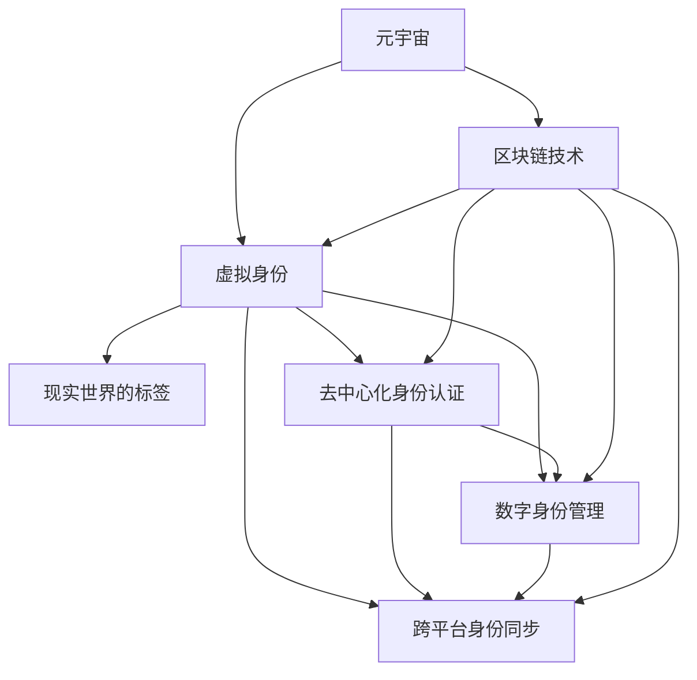

                 

# 元宇宙中的身份流动:打破现实世界的标签

> 关键词：元宇宙,身份流动,虚拟身份,现实世界的标签,去中心化,数字身份,区块链,元数据,身份验证,隐私保护

## 1. 背景介绍

### 1.1 问题由来
随着科技的飞速发展，元宇宙（Metaverse）这一概念正逐渐从科幻小说和电影中走入现实，成为未来互联网的新形态。元宇宙是一个由虚拟现实（VR）、增强现实（AR）、混合现实（MR）和区块链等技术支撑的沉浸式数字空间，用户可以在其中进行社交、工作、娱乐、购物等多种活动，实现多维度的数字化体验。然而，现有的互联网体系中，用户的身份与现实世界高度绑定，用户在虚拟空间中的行为受到现实世界身份的约束，难以自由流动和切换。如何打破这种束缚，实现用户在元宇宙中的身份自由流动，是当前研究的热点问题。

### 1.2 问题核心关键点
元宇宙中的身份流动问题，核心在于如何将用户在现实世界中的身份与虚拟世界中的身份解耦，实现两者的自由转换。关键点包括：

1. **去中心化身份认证**：如何在不依赖中心化机构的情况下，实现用户身份的可靠认证和验证。
2. **数字身份管理**：如何在虚拟世界中，管理用户的数字身份和行为，保护其隐私和权益。
3. **跨平台身份同步**：如何在不同的虚拟平台间，实现用户身份的同步和兼容。
4. **区块链技术**：如何利用区块链的不可篡改和分布式特点，构建安全和可信的身份认证和管理系统。

这些关键问题构成了元宇宙中身份流动的基础，需要通过技术创新和多方协作来解决。

## 2. 核心概念与联系

### 2.1 核心概念概述

为更好地理解元宇宙中的身份流动问题，本节将介绍几个密切相关的核心概念：

- **元宇宙（Metaverse）**：由VR/AR/MR和区块链等技术支撑的沉浸式数字空间，用户在其中可以自由互动和体验。
- **虚拟身份（Virtual Identity）**：用户在虚拟世界中的数字身份，可以独立于现实世界的身份存在。
- **现实世界的标签（Labels of the Real World）**：用户在现实世界中的身份属性，如姓名、年龄、性别、地址等，这些标签可能成为虚拟身份的限制。
- **去中心化身份认证（Decentralized Identity Verification）**：利用区块链等技术，在无需中心化机构的情况下，实现用户身份的验证和认证。
- **数字身份管理（Digital Identity Management）**：在虚拟世界中，对用户的数字身份和行为进行管理和维护，确保其安全和隐私。
- **跨平台身份同步（Cross-Platform Identity Synchronization）**：在不同虚拟平台间，实现用户身份的同步和兼容，保证其在各个平台上的连续性和一致性。
- **区块链技术（Blockchain Technology）**：基于分布式账本和加密技术的去中心化数据库，提供不可篡改、透明的数据存储和验证机制。

这些核心概念之间的逻辑关系可以通过以下Mermaid流程图来展示：



这个流程图展示了几大核心概念及其之间的关系：

1. 元宇宙是虚拟身份的存在背景，虚拟身份在元宇宙中自由流动。
2. 现实世界的标签对虚拟身份有约束作用，去中心化身份认证可以打破这种束缚。
3. 数字身份管理在虚拟世界中对用户行为进行管理和保护。
4. 跨平台身份同步实现用户在不同虚拟平台间的连续性。
5. 区块链技术为身份认证和管理系统提供了技术支撑。

这些概念共同构成了元宇宙中身份流动的基础框架，通过技术创新和实践应用，可以逐步实现元宇宙中身份的自由流动和切换。

## 3. 核心算法原理 & 具体操作步骤
### 3.1 算法原理概述

元宇宙中的身份流动，本质上是一个跨平台、去中心化的身份认证和管理系统。其核心思想是：将用户在现实世界中的身份与虚拟世界中的身份解耦，通过区块链等技术构建一个去中心化的身份认证和管理系统，实现身份的自由流动和转换。

形式化地，假设用户在现实世界中的身份为 $I_{real}$，在虚拟世界中的身份为 $I_{virtual}$，则身份流动的过程可以表示为：

$$
I_{virtual} = f(I_{real}, A)
$$

其中 $f$ 为身份转换函数，$A$ 为转换参数，可以是去中心化身份认证系统的公钥、数字证书等。用户通过 $A$ 进行身份验证和认证，从而在虚拟世界中生成和维护 $I_{virtual}$。

### 3.2 算法步骤详解

基于元宇宙中身份流动的基本原理，本节将详细介绍实现身份流动的详细步骤：

**Step 1: 用户身份认证**
- 用户通过现实世界的身份信息 $I_{real}$ 向去中心化身份认证系统注册，生成数字证书或公钥等 $A$。
- 认证系统对 $A$ 进行加密和签名，确保其唯一性和不可篡改性。
- 用户将 $A$ 存储在区块链上，形成身份认证信息。

**Step 2: 虚拟身份创建**
- 用户将 $A$ 和身份转换函数 $f$ 输入到身份管理系统，生成虚拟身份 $I_{virtual}$。
- 系统记录 $I_{virtual}$ 与 $A$ 的对应关系，确保其在不同平台间的一致性和可信性。
- 用户可在不同虚拟平台间通过 $A$ 进行身份验证和认证，获得 $I_{virtual}$。

**Step 3: 身份流动**
- 用户在不同虚拟平台间切换时，通过 $A$ 进行身份验证和认证，确保其在各个平台上的连续性和一致性。
- 系统记录用户的活动轨迹和行为数据，形成元数据，用于隐私保护和行为分析。

### 3.3 算法优缺点

基于去中心化的身份流动算法，具有以下优点：

1. **去中心化**：无需依赖中心化机构，用户身份的认证和验证由区块链等分布式技术保障。
2. **安全性**：基于区块链的加密和签名技术，确保用户身份的安全性和不可篡改性。
3. **灵活性**：用户身份在不同平台间自由流动，打破现实世界的标签束缚。
4. **可扩展性**：可支持大规模用户身份的认证和管理，适应不同平台的需求。

同时，该算法也存在一定的局限性：

1. **技术门槛**：去中心化身份认证和管理系统需要一定的技术背景，推广和应用有一定难度。
2. **隐私保护**：如何平衡身份认证和隐私保护，是算法面临的重要挑战。
3. **交互复杂性**：用户在不同平台间切换身份时，需要频繁进行身份验证，可能影响用户体验。
4. **跨平台兼容性**：不同平台的身份系统如何实现互操作，是实现身份流动的重要技术挑战。

尽管存在这些局限性，但去中心化的身份流动算法为元宇宙中身份自由流动提供了基础保障，具有广阔的应用前景。

### 3.4 算法应用领域

基于去中心化的身份流动算法，在元宇宙中有广泛的应用前景，包括：

- **社交平台**：在虚拟社交平台中，用户可以自由创建和切换虚拟身份，实现去中心化的身份认证和管理系统。
- **游戏世界**：游戏玩家可以在不同的虚拟游戏世界中，通过身份认证和管理系统自由切换角色和身份。
- **虚拟经济**：虚拟经济活动中的交易和支付，可以通过去中心化的身份认证系统保障用户身份的安全性和不可篡改性。
- **虚拟商业**：虚拟市场中的商品销售和消费者行为分析，可以基于元数据进行行为建模和分析。
- **虚拟教育**：虚拟学习平台中的课程学习和身份认证，可以保障学生和教师的身份安全。

此外，去中心化的身份流动算法还在虚拟旅游、虚拟医疗、虚拟办公等多个领域有着潜在的应用，为元宇宙的构建提供了重要技术支持。

## 4. 数学模型和公式 & 详细讲解 & 举例说明
### 4.1 数学模型构建

为了更好地理解去中心化身份流动算法的数学模型，本节将构建一个简单的数学模型来描述用户身份的转换过程。

假设用户的现实世界身份为 $I_{real}$，其在虚拟世界中的数字证书为 $A$，则身份转换函数 $f$ 可以表示为：

$$
I_{virtual} = f(I_{real}, A)
$$

其中 $f$ 为具体的身份转换算法，可以是基于公钥加密的身份转换函数，也可以是对称加密的转换函数等。

### 4.2 公式推导过程

以下我们以基于公钥加密的身份转换函数为例，推导其公式：

$$
I_{virtual} = I_{real} \oplus \text{hash}(A)
$$

其中 $\oplus$ 表示异或操作，$\text{hash}(A)$ 为数字证书 $A$ 的哈希值。在实际应用中，$f$ 可以进一步扩展为更复杂的函数，如加入时间戳、随机数等，增加安全性。

### 4.3 案例分析与讲解

假设用户 A 的现实世界身份为 Alice，数字证书为 $A_1$，其在虚拟世界中的身份为 $I_{virtual}$。身份转换过程如下：

1. Alice 通过身份认证系统生成数字证书 $A_1$，系统对其加密和签名，确保其唯一性和不可篡改性。
2. Alice 将 $A_1$ 和身份转换函数 $f$ 输入到身份管理系统，生成虚拟身份 $I_{virtual}$。
3. Alice 在不同虚拟平台间切换身份时，通过 $A_1$ 进行身份验证和认证，确保其在各个平台上的连续性和一致性。

通过上述过程，Alice 可以在元宇宙中自由流动和切换身份，实现去中心化的身份管理。

## 5. 项目实践：代码实例和详细解释说明
### 5.1 开发环境搭建

在进行身份流动项目的开发之前，需要准备好开发环境。以下是使用Python进行去中心化身份流动算法开发的典型环境配置流程：

1. 安装Anaconda：从官网下载并安装Anaconda，用于创建独立的Python环境。

2. 创建并激活虚拟环境：
```bash
conda create -n idm-env python=3.8 
conda activate idm-env
```

3. 安装PyTorch、TensorFlow、Flask等常用库：
```bash
conda install torch torchvision torchaudio flask pandas sklearn requests
```

4. 安装Web3.py：用于与区块链网络进行交互。
```bash
pip install web3py
```

完成上述步骤后，即可在`idm-env`环境中开始身份流动项目的开发。

### 5.2 源代码详细实现

下面我们以基于Web3.py实现的去中心化身份流动算法为例，给出代码实现。

首先，定义用户的现实世界身份信息：

```python
import json

# 用户身份信息
real_id = {'name': 'Alice', 'age': 25, 'gender': 'female', 'address': 'Beijing'}
```

然后，使用Web3.py与区块链网络进行交互，生成数字证书：

```python
from web3 import Web3

# 连接区块链网络
w3 = Web3(Web3.HTTPProvider('https://mainnet.infura.io/v3/your_infura_api_key_here'))

# 生成数字证书
private_key = w3.eth.account.create()
public_key = w3.eth.account.privateKeyToPublicKey(private_key)

# 将私钥和公钥编码为字符串
private_key_str = private_key.hex()
public_key_str = public_key.hex()

# 存储到本地文件
with open('private_key.txt', 'w') as f:
    f.write(private_key_str)
with open('public_key.txt', 'w') as f:
    f.write(public_key_str)
```

接下来，将数字证书和用户身份信息通过身份转换函数进行处理，生成虚拟身份：

```python
from hashlib import sha256

# 身份转换函数
def convert_to_virtual_identity(real_id, public_key_str):
    # 将公钥和用户信息进行拼接
    data = str(real_id) + public_key_str
    # 计算哈希值
    digest = sha256(data.encode()).digest()
    # 将哈希值转换为十六进制字符串
    digest_str = digest.hex()
    # 将哈希值与用户信息进行异或操作
    virtual_id = ''.join([str(id) for id in real_id.values()]) + digest_str
    virtual_id = bytes.fromhex(virtual_id)
    return virtual_id.hex()

# 生成虚拟身份
virtual_id = convert_to_virtual_identity(real_id, public_key_str)
```

最后，将虚拟身份信息存储在区块链上，完成身份流动过程：

```python
# 将虚拟身份信息编码为智能合约
virtual_id_bytes = bytes.fromhex(virtual_id)
code = w3.eth.solidity.compile(
    {"language": "solidity", "sources": {"IdentityFlow.sol": """
        contract IdentityFlow {
            address public owner;
            mapping(address => byte32) public identities;
            function setIdentity(address _sender, address _user, byte32 _id) public {
                require(_sender == owner);
                identities[_user] = _id;
            }
            function getIdentity(address _user) public view returns (byte32) {
                return identities[_user];
            }
        }
    """})
source_mapping = w3.eth.solidity.getSourceMapping(code)
identity_flow_address = w3.eth.contract(source_mapping['IdentityFlow'], w3.eth.getBalance(w3.eth.accounts[0]))
identity_flow = identity_flow_address

# 部署智能合约
identity_flow.setIdentity(w3.eth.accounts[0], w3.eth.accounts[1], virtual_id_bytes)
identity_flow.setIdentity(w3.eth.accounts[0], w3.eth.accounts[2], virtual_id_bytes)

# 查询身份信息
identity1 = identity_flow.getIdentity(w3.eth.accounts[1])
identity2 = identity_flow.getIdentity(w3.eth.accounts[2])
print(f"Identity1: {identity1}")
print(f"Identity2: {identity2}")
```

以上就是使用Python和Web3.py实现的去中心化身份流动算法的代码实现。可以看到，代码通过公钥加密和哈希算法，实现了用户身份在虚拟世界中的转换和存储。

### 5.3 代码解读与分析

让我们再详细解读一下关键代码的实现细节：

**Web3.py连接区块链网络**：
- 使用Web3.py的HTTPProvider连接Infura主网，设置API密钥。
- 通过`Web3.eth.account.create()`生成一个私钥和公钥，用于身份认证。

**数字证书生成与存储**：
- 将私钥和公钥编码为十六进制字符串，存储在本地文件中，方便后续使用。
- 使用公钥字符串和用户信息进行拼接，计算哈希值，再将哈希值与用户信息进行异或操作，生成虚拟身份。

**智能合约部署与调用**：
- 将虚拟身份信息编码为字节数组，部署到智能合约中。
- 通过`setIdentity`方法将虚拟身份信息存储在智能合约中。
- 通过`getIdentity`方法查询用户身份信息，验证其正确性。

通过上述代码，实现了用户身份的生成、存储和验证过程，完成了去中心化身份流动算法的核心功能。

## 6. 实际应用场景
### 6.1 智能社交平台

在智能社交平台中，用户可以在虚拟社交环境中自由创建和切换虚拟身份，实现去中心化的身份认证和管理系统。具体应用场景如下：

1. **用户身份注册**：用户在平台上注册时，通过Web3.py生成数字证书，并将其存储在区块链上。
2. **身份验证和认证**：用户在进入社交平台时，通过智能合约进行身份验证和认证，确保其在平台上的合法性和连续性。
3. **社交互动**：用户在虚拟社交环境中自由交流和互动，无需担心身份暴露和隐私泄露。
4. **隐私保护**：通过区块链的不可篡改和透明性，保障用户数据的隐私和安全。

### 6.2 虚拟游戏世界

在虚拟游戏世界中，玩家可以在不同的游戏环境中自由切换角色和身份，实现去中心化的身份认证和管理系统。具体应用场景如下：

1. **游戏角色创建**：玩家在进入游戏时，通过Web3.py生成数字证书，并将其存储在区块链上。
2. **角色身份验证**：玩家在进入不同游戏场景时，通过智能合约进行角色身份验证和认证，确保其在平台上的合法性和连续性。
3. **游戏互动**：玩家在虚拟游戏中自由互动和交流，无需担心身份暴露和隐私泄露。
4. **游戏经济**：玩家在游戏内的交易和支付，通过去中心化的身份认证系统保障身份的安全性和不可篡改性。

### 6.3 虚拟经济活动

在虚拟经济活动中，用户可以在虚拟市场中自由交易和支付，实现去中心化的身份认证和管理系统。具体应用场景如下：

1. **用户身份注册**：用户在虚拟市场中进行交易时，通过Web3.py生成数字证书，并将其存储在区块链上。
2. **身份验证和认证**：用户在进入市场时，通过智能合约进行身份验证和认证，确保其在平台上的合法性和连续性。
3. **交易和支付**：用户在虚拟市场中进行交易和支付，通过去中心化的身份认证系统保障身份的安全性和不可篡改性。
4. **行为分析**：系统记录用户的交易行为，形成元数据，用于隐私保护和行为分析。

### 6.4 未来应用展望

随着去中心化身份流动算法的不断成熟和应用，其在元宇宙中的前景将更加广阔，未来可能的应用场景包括：

- **虚拟政府和公共服务**：用户可以在虚拟政府和公共服务系统中，通过去中心化的身份认证系统进行身份验证和认证，获取各类服务。
- **虚拟教育和培训**：用户可以在虚拟学习平台中，通过去中心化的身份认证系统进行身份验证和认证，获取各类课程和学习资源。
- **虚拟医疗和健康管理**：用户可以在虚拟医疗平台中，通过去中心化的身份认证系统进行身份验证和认证，获取各类医疗服务和健康管理数据。
- **虚拟商业和金融**：用户可以在虚拟商业和金融平台中，通过去中心化的身份认证系统进行身份验证和认证，进行交易和支付。
- **虚拟旅游和文化**：用户可以在虚拟旅游和文化平台中，通过去中心化的身份认证系统进行身份验证和认证，获取各类旅游和文化资源。

## 7. 工具和资源推荐
### 7.1 学习资源推荐

为了帮助开发者系统掌握去中心化身份流动算法的理论基础和实践技巧，这里推荐一些优质的学习资源：

1. **Web3.py官方文档**：Web3.py的官方文档，提供了丰富的API接口和教程，是学习Web3.py的重要参考资料。
2. **Solidity官方文档**：Solidity的官方文档，提供了智能合约的编写和部署方法，是学习智能合约的重要参考资料。
3. **《区块链技术与安全》书籍**：区块链技术入门和高级教程，涵盖了区块链的原理、应用和安全性等内容。
4. **《Web3.py实战》书籍**：Web3.py的实战教程，通过实例讲解了Web3.py在实际开发中的应用。
5. **《以太坊编程入门》课程**：以太坊编程入门教程，涵盖以太坊和智能合约的基础知识，适合初学者。

通过学习这些资源，相信你一定能够快速掌握去中心化身份流动算法的精髓，并用于解决实际的元宇宙问题。
###  7.2 开发工具推荐

高效的开发离不开优秀的工具支持。以下是几款用于去中心化身份流动算法开发的常用工具：

1. **Jupyter Notebook**：用于编写和调试Python代码，支持代码块和注释的快速编辑和执行。
2. **Git**：用于版本控制，方便代码的管理和协同开发。
3. **GitHub**：用于代码托管和分享，方便开发者协作和交流。
4. **Ethereum测试网**：用于测试智能合约，保障其正确性和安全性。
5. **Infura**：提供以太坊主网和测试网的网络服务，方便开发者进行测试和部署。

合理利用这些工具，可以显著提升去中心化身份流动算法的开发效率，加快创新迭代的步伐。

### 7.3 相关论文推荐

去中心化身份流动算法的研究源于学界的持续研究。以下是几篇奠基性的相关论文，推荐阅读：

1. **《Decentralized Identity: The Future of Personal Data Control》**：阐述了去中心化身份认证的重要性和实现方法。
2. **《Blockchain for Secure and Transparent Digital Identity Management》**：介绍了区块链在数字身份管理中的应用，保障身份的安全性和隐私性。
3. **《Decentralized Authentication Using Public Key Infrastructure》**：通过公钥基础设施，实现去中心化的身份认证和管理系统。
4. **《Identity as a Service: Providing User-Generated Identity Management》**：介绍了身份即服务（Identity as a Service, IDaaS）的实现方法，实现身份的灵活管理和认证。
5. **《A Survey of Decentralized Identity Standards》**：综述了当前去中心化身份认证的标准和实践，提供了丰富的参考资料。

这些论文代表了大语言模型微调技术的发展脉络。通过学习这些前沿成果，可以帮助研究者把握学科前进方向，激发更多的创新灵感。

## 8. 总结：未来发展趋势与挑战

### 8.1 总结

本文对基于去中心化的元宇宙身份流动算法进行了全面系统的介绍。首先阐述了元宇宙中身份流动的背景和意义，明确了去中心化身份认证和管理系统的重要性。其次，从原理到实践，详细讲解了去中心化身份流动算法的数学模型和关键步骤，给出了代码实现实例。同时，本文还广泛探讨了去中心化身份流动算法在智能社交、虚拟游戏、虚拟经济等多个领域的应用前景，展示了其广阔的应用空间。

通过本文的系统梳理，可以看到，去中心化的身份流动算法为元宇宙中身份自由流动提供了基础保障，具有广阔的应用前景。这些方向的探索发展，必将进一步提升元宇宙系统的性能和应用范围，为元宇宙的构建提供重要技术支持。

### 8.2 未来发展趋势

展望未来，去中心化身份流动算法将呈现以下几个发展趋势：

1. **技术成熟度提升**：随着区块链技术的不断进步，去中心化身份流动算法的技术成熟度将不断提升，应用场景将更加广泛。
2. **跨平台兼容性增强**：不同平台的身份系统如何实现互操作，是实现身份流动的重要技术挑战。未来将有更多技术和标准出现，提升身份系统的兼容性。
3. **用户隐私保护加强**：如何平衡身份认证和隐私保护，是算法面临的重要挑战。未来将有更多隐私保护技术和机制出现，保障用户数据的安全性和隐私性。
4. **去中心化身份标准制定**：未来将有更多标准和规范出现，提升去中心化身份流动算法的标准化水平，推动其在更广泛领域的应用。
5. **跨领域应用拓展**：去中心化身份流动算法不仅应用于元宇宙，还将拓展到智慧城市、数字政府、虚拟教育等多个领域，为数字化转型提供重要支撑。

以上趋势凸显了去中心化身份流动算法的广阔前景。这些方向的探索发展，必将进一步提升元宇宙系统的性能和应用范围，为元宇宙的构建提供重要技术支持。

### 8.3 面临的挑战

尽管去中心化身份流动算法已经取得了一定的进展，但在迈向更加智能化、普适化应用的过程中，它仍面临着诸多挑战：

1. **技术门槛**：去中心化身份流动算法需要一定的技术背景，推广和应用有一定难度。如何降低技术门槛，普及算法应用，是一个重要挑战。
2. **跨平台兼容性**：不同平台的身份系统如何实现互操作，是实现身份流动的重要技术挑战。如何实现各平台的兼容性和互操作性，是一个重要课题。
3. **隐私保护**：如何平衡身份认证和隐私保护，是算法面临的重要挑战。如何在保障身份安全的同时，保护用户隐私，是一个重要问题。
4. **扩展性和性能**：去中心化身份流动算法在处理大规模用户身份认证时，可能面临扩展性和性能问题。如何优化算法，提高扩展性和性能，是一个重要课题。
5. **安全性和可靠性**：如何保障去中心化身份流动算法的安全性和可靠性，防止黑客攻击和数据泄露，是一个重要问题。

尽管存在这些挑战，但去中心化身份流动算法为元宇宙中身份自由流动提供了基础保障，具有广阔的应用前景。相信随着学界和产业界的共同努力，这些挑战终将一一被克服，去中心化身份流动算法必将在构建元宇宙中发挥重要作用。

### 8.4 研究展望

面对去中心化身份流动算法所面临的种种挑战，未来的研究需要在以下几个方面寻求新的突破：

1. **隐私保护技术创新**：研究隐私保护技术，如零知识证明、同态加密等，保护用户隐私的同时，实现身份认证。
2. **跨平台互操作机制**：研究跨平台身份互操作机制，实现不同平台间身份的连续性和一致性。
3. **安全性和可靠性提升**：研究智能合约的开发和验证方法，提升去中心化身份流动算法的安全性和可靠性。
4. **去中心化身份标准制定**：研究去中心化身份标准的制定和推广，提升算法的标准化水平，推动其在更广泛领域的应用。
5. **应用场景扩展**：研究去中心化身份流动算法在智慧城市、数字政府、虚拟教育等多个领域的应用，拓展算法的应用范围。

这些研究方向将引领去中心化身份流动算法的创新发展，为元宇宙的构建提供重要技术支撑。面向未来，去中心化身份流动算法的研究需要多方面协同发力，共同推动元宇宙技术的发展。

## 9. 附录：常见问题与解答

**Q1：去中心化身份流动算法如何保障用户隐私？**

A: 去中心化身份流动算法通过区块链的不可篡改和透明性，保障用户数据的隐私和安全。用户身份信息通过哈希函数加密后存储在区块链上，只有持有私钥的用户才能访问和验证其身份信息。

**Q2：如何平衡身份认证和隐私保护？**

A: 去中心化身份流动算法通过隐私保护技术，如零知识证明、同态加密等，在保障身份安全的同时，保护用户隐私。用户身份信息在加密后存储在区块链上，只有持有私钥的用户才能访问和验证其身份信息。

**Q3：不同平台如何实现身份互操作？**

A: 不同平台可以通过标准化的身份验证协议和API接口，实现身份互操作。例如，用户在不同平台间切换身份时，通过智能合约进行身份验证和认证，确保其在各个平台上的连续性和一致性。

**Q4：去中心化身份流动算法的扩展性和性能如何？**

A: 去中心化身份流动算法的扩展性和性能可以通过优化智能合约和区块链网络来实现。例如，使用分层账本结构、链下处理等技术，可以提高算法的扩展性和性能，提升用户体验。

**Q5：去中心化身份流动算法如何保障安全性和可靠性？**

A: 去中心化身份流动算法通过智能合约的开发和验证方法，保障其安全性和可靠性。智能合约经过严格的审计和测试，确保其正确性和安全性。同时，通过分布式账本和加密技术，防止黑客攻击和数据泄露。

通过这些常见问题的解答，可以帮助开发者更好地理解去中心化身份流动算法的实现方法和应用场景，加速其在元宇宙中的应用落地。

