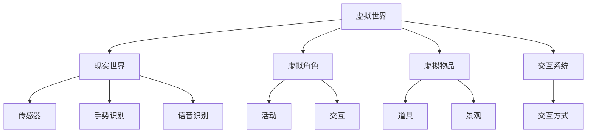

                 

# 元宇宙主题公园:虚拟与现实交织的娱乐体验

## 1. 背景介绍

随着虚拟现实(VR)和增强现实(AR)技术的成熟，元宇宙这一概念逐渐火热起来。虚拟世界和现实世界紧密交织，为人们提供了一种全新的娱乐、社交和工作方式。本文将探讨如何通过元宇宙主题公园这一独特的载体，将虚拟与现实完美融合，打造沉浸式、互动式的娱乐体验。

### 1.1 问题由来
元宇宙主题公园，也称作虚拟世界主题公园，是虚拟世界与现实世界结合的产物。相较于传统的游乐园，元宇宙主题公园提供了一个完全数字化的、自由探索的空间，使玩家能够在虚拟世界中体验各类娱乐项目、互动活动，甚至与虚拟人物互动，形成全新的娱乐体验。

近年来，由于VR、AR技术的迅速发展，以及游戏、影视、社交等领域的持续创新，元宇宙技术已经在多个领域展现出广泛的应用前景，包括但不限于医疗、教育、设计、房地产等。

## 2. 核心概念与联系

### 2.1 核心概念概述

元宇宙主题公园的核心概念包括以下几个方面：

- **虚拟世界**：通过VR、AR技术创建的数字化虚拟空间，具有高度的真实感和沉浸感。
- **现实世界**：现实物理空间，用户可以与虚拟世界进行物理互动。
- **虚拟角色**：基于计算机图形学的虚拟形象，能够在虚拟世界中活动、交互。
- **虚拟物品**：虚拟世界中可交互的元素，如游戏道具、景观建筑等。
- **交互系统**：通过传感器、手势识别、语音识别等技术，实现虚拟与现实世界的无缝交互。

这些概念之间有着紧密的联系，虚拟世界、虚拟角色和虚拟物品构成了元宇宙主题公园的基本元素，而交互系统则是实现这些元素与现实世界互动的关键。

### 2.2 核心概念原理和架构的 Mermaid 流程图



### 2.3 核心概念之间的联系

虚拟世界与现实世界的融合，需要借助于交互系统来实现。交互系统通过传感器、手势识别、语音识别等技术，将用户的物理动作转化为虚拟世界中的行为，使虚拟角色和虚拟物品能够响应。同时，虚拟世界中的物品和角色也能通过交互系统与现实世界互动，产生物理反应，如环境变化、物品掉落等。

交互系统不仅限于与虚拟世界的交互，还可以与现实世界中的物理设备（如VR头盔、手柄等）协同工作，形成完整的用户体验。

## 3. 核心算法原理 & 具体操作步骤

### 3.1 算法原理概述

元宇宙主题公园的构建需要依赖一系列算法，包括但不限于：

- 三维建模算法：用于构建虚拟世界的地形、建筑、景观等。
- 物理引擎：用于模拟虚拟世界中的物理行为，如重力、碰撞、光照等。
- 交互算法：用于处理虚拟角色与现实世界之间的物理和信息交互。
- 路径规划算法：用于优化虚拟角色的移动路径，减少计算负担。
- 渲染算法：用于提升虚拟世界的渲染效果，增强沉浸感。

### 3.2 算法步骤详解

构建元宇宙主题公园的步骤大致如下：

1. **虚拟世界设计**：首先需要设计虚拟世界的大致轮廓，包括地形、建筑、道路等。这可以通过三维建模软件（如Blender、Maya等）完成。

2. **物理模拟**：根据虚拟世界的特点，选择合适的物理引擎（如Unity的PhysX、Unreal Engine的Chaos solver）进行物理模拟，包括重力、碰撞、摩擦等。

3. **交互系统搭建**：基于传感器、手势识别、语音识别等技术，搭建交互系统，使得虚拟角色能够对现实世界中的用户动作做出响应。

4. **物品生成**：根据游戏或故事需要，生成虚拟物品，如游戏道具、装饰物等，并赋予其交互特性。

5. **渲染优化**：使用渲染算法优化虚拟世界的渲染效果，提升视觉体验。

6. **测试与迭代**：在虚拟世界中不断进行测试，发现问题并进行优化，直到满足用户需求。

### 3.3 算法优缺点

构建元宇宙主题公园的算法存在以下优缺点：

**优点：**

- **沉浸感强**：通过高质量的渲染和物理模拟，可以营造出高度沉浸的虚拟环境。
- **互动性强**：用户可以通过各种交互方式与虚拟角色和物品进行互动，提升参与感。
- **扩展性强**：可以不断扩展虚拟世界的规模和复杂度，适应不同规模的体验需求。

**缺点：**

- **计算成本高**：高质量的物理模拟和渲染需要大量计算资源，成本较高。
- **技术门槛高**：需要多学科的专家协作，包括图形学、物理学、计算机科学等。
- **用户体验依赖于硬件**：用户需要通过VR头盔、手柄等设备体验，对设备要求较高。

### 3.4 算法应用领域

元宇宙主题公园的算法可以广泛应用于以下领域：

- **游戏开发**：为虚拟游戏提供逼真的虚拟环境和角色交互。
- **影视制作**：构建虚拟场景和角色，用于电影和电视剧的拍摄。
- **教育培训**：创建虚拟实验室、历史场景等，用于教育培训和科普展示。
- **虚拟旅游**：提供虚拟世界的旅游体验，让用户在家中就能遍历世界各地。
- **社交娱乐**：构建虚拟社交平台，供用户进行互动和娱乐。

## 4. 数学模型和公式 & 详细讲解 & 举例说明

### 4.1 数学模型构建

为了更好地解释虚拟世界中的物理行为，需要构建数学模型。以下是一个简单的物理模型示例：

假设虚拟世界中的一个物体A受重力影响，在重力场中的位置随时间变化的公式为：

$$
x(t) = x_0 + v_0 t - \frac{1}{2}gt^2
$$

其中，$x(t)$ 表示物体A在时间 $t$ 时的坐标，$x_0$ 和 $v_0$ 分别为初始位置和速度，$g$ 为重力加速度，$t$ 为时间。

### 4.2 公式推导过程

推导上述公式的过程如下：

1. **初始条件**：设物体A在 $t=0$ 时的坐标为 $x_0$，速度为 $v_0$。
2. **运动方程**：物体A的运动方程为 $v(t) = v_0 - gt$，其中 $v(t)$ 表示物体A在时间 $t$ 时的速度。
3. **位置方程**：将速度方程对时间积分，得到位置方程 $x(t) = x_0 + v_0 t - \frac{1}{2}gt^2$。

### 4.3 案例分析与讲解

在实际应用中，可以通过Unity等游戏引擎，将上述公式应用于虚拟角色或物品的运动模拟中。例如，在模拟一个滑行的球体时，可以按照上述公式计算其位置，从而实现球的重力模拟效果。

## 5. 项目实践：代码实例和详细解释说明

### 5.1 开发环境搭建

构建元宇宙主题公园需要进行大量的三维建模和物理模拟，一般需要使用Unity等游戏引擎。以下是搭建开发环境的步骤：

1. **安装Unity**：从Unity官网下载并安装Unity，根据操作系统选择不同的安装版本。
2. **安装插件**：安装必要的插件，如Physics3D、Render Pipeline等，用于物理模拟和渲染。
3. **配置开发环境**：配置Visual Studio或VS Code作为开发工具，并安装Unity的集成开发环境。

### 5.2 源代码详细实现

以下是一个简单的Unity脚本示例，用于模拟一个在重力场中移动的物体：

```csharp
using UnityEngine;

public class GravitySimulation : MonoBehaviour
{
    public float gravity = 9.81f;
    public float initialX = 0f;
    public float initialV = 0f;

    private float x = initialX;
    private float v = initialV;

    void Update()
    {
        x += v * Time.deltaTime;
        v -= gravity * Time.deltaTime;
    }

    void OnDrawGizmos()
    {
        Gizmos.color = Color.red;
        Gizmos.DrawLine(new Vector3(x, 0, 0), new Vector3(x, 0, 10));
        Gizmos.color = Color.green;
        Gizmos.DrawLine(new Vector3(x, 0, 0), new Vector3(x, -10, 0));
    }
}
```

### 5.3 代码解读与分析

上述代码实现了一个简单的重力模拟器，通过Unity的`Update`方法更新物体的位置和速度。在`OnDrawGizmos`方法中，使用Gizmos库绘制物体的运动轨迹，以可视化展示物体的运动过程。

### 5.4 运行结果展示

在Unity编辑器中运行上述脚本，可以看到物体在重力场中沿斜面向下滑行，并绘制出其运动轨迹。

## 6. 实际应用场景

### 6.1 智能导览系统

在元宇宙主题公园中，智能导览系统可以为用户提供实时导航、景点介绍等功能。通过AR技术，导览系统可以在用户面前叠加虚拟信息，提供交互式体验。例如，用户可以通过手势识别与虚拟导览员互动，获取相关信息。

### 6.2 虚拟商业街

虚拟商业街可以通过虚拟角色和虚拟物品模拟现实中的购物体验。用户可以在虚拟商店中浏览商品，与虚拟店员交流，甚至进行虚拟购物。通过交互系统，用户可以在虚拟环境中自由探索，享受购物乐趣。

### 6.3 虚拟演出

虚拟演出可以提供沉浸式的演出体验。通过VR头盔，用户可以进入虚拟舞台，观看各类演出，如音乐会、话剧等。演员和舞台可以动态响应观众的互动，使演出更加生动有趣。

### 6.4 未来应用展望

未来，元宇宙主题公园将会在更多领域得到应用，例如：

- **医疗培训**：构建虚拟手术室、医院等，用于医疗培训和教学。
- **虚拟房地产**：展示虚拟房产和城市规划，提供虚拟看房体验。
- **虚拟娱乐**：创建虚拟音乐节、运动场等，满足用户的多样化娱乐需求。
- **虚拟教育**：开发虚拟实验室、科学展示等，用于教育和科普。
- **虚拟社交**：构建虚拟社交平台，供用户进行交流和互动。

## 7. 工具和资源推荐

### 7.1 学习资源推荐

为了帮助开发者掌握元宇宙主题公园的开发技术，以下是一些优质的学习资源：

1. **Unity官方文档**：Unity的官方文档提供了全面的API和插件使用指南，是学习Unity开发的最佳参考资料。
2. **虚幻引擎官方文档**：虚幻引擎的官方文档详细介绍了引擎的各项功能，包括物理模拟、渲染、交互等。
3. **3D建模教程**：如Blender的官方教程，可以帮助开发者掌握三维建模技能。
4. **物理模拟课程**：如Udemy的PhysX课程，提供了详细的物理引擎使用和优化技巧。
5. **交互系统开发指南**：如Handbook of Interactive Systems，提供了交互设计的理论基础和实践方法。

### 7.2 开发工具推荐

以下是一些用于元宇宙主题公园开发的工具：

1. **Unity**：功能强大的游戏引擎，支持3D建模、物理模拟和交互系统开发。
2. **Unreal Engine**：业内领先的3D渲染引擎，适用于高复杂度的虚拟世界构建。
3. **Blender**：免费的开源3D建模软件，功能丰富且易学易用。
4. **Vuforia**：AR开发平台，支持摄像头、手势识别等交互技术。
5. **Valve Index SDK**：VR开发工具包，支持VR头盔和手柄设备的交互。

### 7.3 相关论文推荐

以下是几篇关于元宇宙主题公园开发的经典论文，推荐阅读：

1. **Virtual Reality for the Masses**：探讨了虚拟现实技术在娱乐、教育等领域的应用。
2. **Interactive Digital Environments**：介绍了虚拟世界和现实世界的交互技术。
3. **Virtual Reality Entertainment**：分析了虚拟娱乐市场的发展趋势和应用案例。
4. **Augmented Reality in Education**：讨论了AR技术在教育中的应用和效果。
5. **Physics-based Simulation of Objects**：详细介绍了物理模拟算法，如刚体力学、碰撞检测等。

## 8. 总结：未来发展趋势与挑战

### 8.1 研究成果总结

元宇宙主题公园作为虚拟与现实结合的产物，具有广阔的发展前景。其在娱乐、教育、医疗等多个领域的应用，已经开始展现其独特的优势和潜力。

### 8.2 未来发展趋势

展望未来，元宇宙主题公园将呈现以下几个发展趋势：

1. **技术进步**：随着计算机图形学、虚拟现实、增强现实等技术的进步，元宇宙主题公园的沉浸感和交互性将进一步提升。
2. **用户体验优化**：通过多感官输入输出技术，提升用户的沉浸感和参与感。
3. **跨平台互联**：通过云平台和边缘计算，实现不同平台和设备间的无缝连接和数据同步。
4. **生态系统建设**：构建完善的元宇宙生态系统，包括游戏、社交、商业等不同功能。
5. **社会影响扩大**：元宇宙主题公园将对社会产生深远影响，如虚拟就业、社交方式等。

### 8.3 面临的挑战

元宇宙主题公园在发展过程中，也面临以下挑战：

1. **技术门槛高**：开发和维护元宇宙主题公园需要多学科的复合知识，门槛较高。
2. **成本高昂**：高质量的虚拟世界和交互体验需要大量资源投入，成本较高。
3. **用户接受度**：部分用户对虚拟现实和增强现实技术持观望态度，需要进一步推广和教育。
4. **安全问题**：虚拟世界中的安全问题，如数据隐私、网络安全等，需要重点关注。
5. **法规规范**：元宇宙主题公园的发展需要建立完善的法规规范，避免负面影响。

### 8.4 研究展望

未来的元宇宙主题公园研究需要关注以下几个方面：

1. **跨领域合作**：加强与游戏、影视、医疗等不同领域的合作，拓展应用场景。
2. **用户体验优化**：提升用户交互体验，使其更加自然和沉浸。
3. **技术优化**：优化渲染算法、物理模拟等关键技术，提升系统的性能和稳定性。
4. **伦理与安全**：确保元宇宙主题公园的安全性和伦理导向，保护用户权益。
5. **数据管理**：构建数据管理系统，确保数据的隐私和安全。

## 9. 附录：常见问题与解答

**Q1：元宇宙主题公园有哪些关键技术？**

A: 元宇宙主题公园的关键技术包括三维建模、物理模拟、交互系统、渲染算法等。三维建模技术用于构建虚拟世界的地形、建筑等；物理模拟技术用于模拟虚拟世界中的物理行为；交互系统用于处理虚拟角色与现实世界之间的物理和信息交互；渲染算法用于提升虚拟世界的渲染效果，增强沉浸感。

**Q2：构建元宇宙主题公园需要哪些开发工具？**

A: 元宇宙主题公园的构建需要使用Unity、Unreal Engine等游戏引擎，Blender等三维建模软件，以及Vuforia、Valve Index SDK等AR和VR开发工具。

**Q3：元宇宙主题公园未来的发展方向是什么？**

A: 元宇宙主题公园未来的发展方向包括技术进步、用户体验优化、跨平台互联、生态系统建设、社会影响扩大等方面。

**Q4：元宇宙主题公园面临哪些挑战？**

A: 元宇宙主题公园面临的技术门槛高、成本高昂、用户接受度低、安全问题、法规规范不完善等挑战。

---

作者：禅与计算机程序设计艺术 / Zen and the Art of Computer Programming

