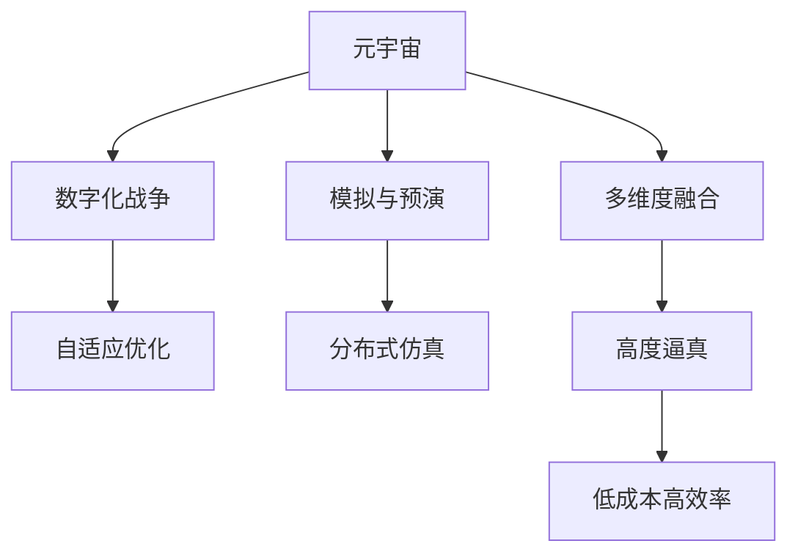

                 

# 元宇宙军事演习:数字化战争的模拟与预演

> 关键词：元宇宙,军事演习,数字化战争,模拟,预演,自适应优化

## 1. 背景介绍

### 1.1 问题由来
随着数字技术的发展，人类战争的形式正在发生深刻的变化。传统实物战场逐渐被虚拟数字战场取代，战争的数字化、智能化成为新的趋势。元宇宙作为数字时代的产物，以其高沉浸性、广连接性、开放性等特性，成为数字化战争模拟和预演的重要平台。通过构建虚拟战争场景，元宇宙能够全方位、多层次地模拟真实战争的复杂环境和动态，为军事决策提供数据支持。

### 1.2 问题核心关键点
军事演习的数字化转型，核心在于构建可实时交互、高逼真度的虚拟战场环境，并在此基础上进行模拟训练和策略预演。元宇宙技术能够通过模拟复杂的环境、兵力、装备等元素，构建高保真度的虚拟战场，为作战人员提供全方位的战场景模拟和智能决策支持。

军事演习的元宇宙化，可以带来以下优势：
- **高度逼真**：元宇宙战场能够真实还原实战场景，提高演习逼真度，增强参演人员代入感和训练效果。
- **多维度融合**：通过虚拟与现实的多模态融合，元宇宙可以支持战术、战略、心理等多维度的综合演练。
- **持续改进**：元宇宙能够实时记录和回放演习过程，支持战损评估、复盘分析，不断优化演习方案。
- **低成本高效率**：元宇宙虚拟演习减少了对物理实物的依赖，降低了成本，提高了演习的灵活性和可扩展性。
- **全局视角**：元宇宙演习可以支持大规模、跨领域的协同作战，提升全局作战能力。

### 1.3 问题研究意义
元宇宙军事演习技术的研发，对于军事演习智能化、信息化、实战化转型具有重要意义：
- **提升实战能力**：通过高仿真度的元宇宙战场，参演人员能够在低风险环境中进行实战演练，提升实战能力和决策水平。
- **优化军事决策**：通过虚拟战场的大数据分析，能够挖掘出作战模式和规律，为指挥决策提供数据支持。
- **加速军事改革**：元宇宙演习技术可以广泛应用于各级军事单位，推动军事改革，提高整体作战能力。
- **拓展演习范围**：元宇宙支持跨地域、跨时区的协同作战，能够拓展演习的地理范围和历史跨度，提升演习的复杂度和深度。
- **促进国际合作**：元宇宙演习技术可以作为国际军事交流与合作的平台，推动各国军队的协同训练和联合行动。

## 2. 核心概念与联系

### 2.1 核心概念概述

为更好地理解元宇宙军事演习的原理和技术实现，本节将介绍几个关键概念：

- **元宇宙**：一种通过虚拟现实、增强现实、区块链等技术构建的虚拟世界，具备高度逼真、高互动、开放性的特点。
- **数字化战争**：通过数字化手段构建的虚拟战场，支持虚拟兵力、装备、环境等元素的建模和交互。
- **模拟与预演**：使用虚拟技术构建的战场环境，用于模拟实战过程，并进行战术、策略的预演和优化。
- **自适应优化**：通过实时反馈和智能算法，自动调整演习参数，优化作战方案，提升训练效果。
- **分布式仿真**：通过网络协同的方式，支持大规模、分布式的联合演习，提升演习规模和复杂度。

这些概念之间的联系可以通过以下Mermaid流程图来展示：



这个流程图展示了大语言模型微调的相关概念及其联系：

1. **元宇宙**作为虚拟战争的基础平台，提供了高度逼真、高互动、开放性的环境。
2. **数字化战争**通过数字化手段模拟实际战争，支持虚拟兵力、装备、环境等元素的建模和交互。
3. **模拟与预演**在元宇宙战场上进行实战模拟，进行战术、策略的预演和优化。
4. **自适应优化**通过实时反馈和智能算法，自动调整演习参数，优化作战方案，提升训练效果。
5. **分布式仿真**通过网络协同的方式，支持大规模、分布式的联合演习，提升演习规模和复杂度。
6. **多维度融合**通过虚拟与现实的多模态融合，元宇宙支持战术、战略、心理等多维度的综合演练。
7. **高度逼真**元宇宙战场能够真实还原实战场景，提高演习逼真度，增强参演人员代入感和训练效果。
8. **低成本高效率**元宇宙演习减少了对物理实物的依赖，降低了成本，提高了演习的灵活性和可扩展性。
9. **全局视角**元宇宙演习可以支持大规模、跨领域的协同作战，提升全局作战能力。

这些概念共同构成了元宇宙军事演习的技术框架，为其发展提供了坚实的理论基础。

## 3. 核心算法原理 & 具体操作步骤
### 3.1 算法原理概述

元宇宙军事演习的数字化战场构建，其核心原理是使用虚拟现实(VR)、增强现实(AR)等技术，结合计算机图形学、物理仿真等手段，模拟真实战场的各种元素，并在元宇宙平台上进行作战模拟和策略预演。

具体来说，元宇宙军事演习包括以下几个关键步骤：

1. **战场环境建模**：使用3D建模工具，根据战场地形、装备部署、部队配置等信息，构建虚拟战场环境。
2. **虚拟兵力建模**：使用AI技术，结合历史战斗数据和现代战术理论，为虚拟部队设定行为规则和战斗技能。
3. **装备模拟**：通过物理引擎和图形渲染，模拟虚拟装备的运动、碰撞和交互效果，提升演习的真实感。
4. **战术与策略模拟**：在虚拟战场上进行战术演练和策略预演，分析不同作战方案的效果和可行性。
5. **智能决策支持**：使用AI算法，对战场数据进行实时分析，提供作战建议和决策支持。

### 3.2 算法步骤详解

**Step 1: 准备元宇宙平台**
- 选择适合的元宇宙平台，如Unity3D、Unreal Engine等。
- 配置计算资源，确保虚拟战场运行流畅。

**Step 2: 构建虚拟战场环境**
- 使用3D建模软件，如Blender、Maya等，设计战场地形、建筑、地貌等。
- 导入战场模型到元宇宙平台，进行初始化设置。

**Step 3: 虚拟兵力与装备建模**
- 使用AI算法，如强化学习、对抗学习等，为虚拟部队设定行为规则和战斗技能。
- 模拟虚拟装备的物理属性和交互效果，使用Unity3D的Physics引擎实现。

**Step 4: 战术与策略模拟**
- 定义战术规则和战斗流程，模拟不同类型的战斗场景。
- 使用多线程和分布式仿真技术，支持大规模、分布式的联合演习。

**Step 5: 智能决策支持**
- 集成AI算法，如神经网络、强化学习等，分析战场数据，提供智能决策建议。
- 设计用户交互界面，支持参演人员实时查看战场数据和作战建议。

**Step 6: 评估与优化**
- 在元宇宙平台上进行多次演习，记录战斗数据和表现。
- 使用数据分析工具，对演习结果进行评估和优化，调整战术和策略。

### 3.3 算法优缺点

元宇宙军事演习技术具有以下优点：
1. **高度逼真**：元宇宙战场能够真实还原实战场景，提高演习逼真度，增强参演人员代入感和训练效果。
2. **多维度融合**：通过虚拟与现实的多模态融合，元宇宙支持战术、战略、心理等多维度的综合演练。
3. **持续改进**：元宇宙能够实时记录和回放演习过程，支持战损评估、复盘分析，不断优化演习方案。
4. **低成本高效率**：元宇宙演习减少了对物理实物的依赖，降低了成本，提高了演习的灵活性和可扩展性。
5. **全局视角**：元宇宙演习可以支持大规模、跨领域的协同作战，提升全局作战能力。

同时，该方法也存在一定的局限性：
1. **技术门槛高**：元宇宙军事演习需要高端的3D建模和物理仿真技术，对技术要求较高。
2. **数据依赖强**：元宇宙战场需要大量的历史战斗数据和现代战术理论，数据采集和处理工作量大。
3. **成本投入高**：元宇宙平台和计算资源的投入成本较高，适用于专业军事演习单位。
4. **仿真精度有待提升**：尽管技术已经较为成熟，但仍存在仿真精度不足、对抗行为过于简单等问题，影响演习效果。
5. **交互复杂度高**：元宇宙战场涉及多维度的交互，演习设计和操作较为复杂。

尽管存在这些局限性，但就目前而言，元宇宙军事演习技术是数字化战争模拟和预演的重要方向，未来相关技术的不断演进将进一步推动军事演习的智能化、信息化、实战化进程。

### 3.4 算法应用领域

元宇宙军事演习技术已经在多个领域得到了广泛应用，包括但不限于：

- **战术训练**：通过元宇宙战场进行战术演练和对抗训练，提升官兵的实战能力。
- **策略预演**：在虚拟战场上进行战略预演，评估不同战略方案的效果和可行性。
- **军事决策支持**：通过元宇宙平台进行实战模拟和数据分析，为军事决策提供数据支持。
- **联合演习**：支持多国部队在元宇宙上进行联合军事演习，提升协同作战能力。
- **军事教育**：使用元宇宙进行军事历史教学和实战模拟，增强学生的实战体验。
- **虚拟靶场**：在元宇宙平台上建立虚拟靶场，进行武器装备和作战技能训练。
- **实战模拟**：模拟真实的军事行动，进行战场情报分析、指挥控制演练等。

除了上述这些经典应用外，元宇宙军事演习还被创新性地应用于军事模拟游戏、军事决策模拟、军事知识竞赛等领域，为军事演习带来了全新的突破。随着技术的日益成熟，元宇宙军事演习必将在更广阔的应用领域大放异彩。

## 4. 数学模型和公式 & 详细讲解  
### 4.1 数学模型构建

本节将使用数学语言对元宇宙军事演习过程进行更加严格的刻画。

记战场环境为 $E = (X, Y, Z)$，其中 $X$ 为地形坐标，$Y$ 为装备位置，$Z$ 为兵力部署。假设兵力 $T = (T_1, T_2, ..., T_n)$ 在战场上的运动轨迹为 $\gamma(t)$，装备 $W = (W_1, W_2, ..., W_m)$ 的运动轨迹为 $\omega(t)$。在元宇宙平台上，战场环境 $E$ 可以表示为：

$$
E = \{(x_i, y_i, z_i)\}_{i=1}^N
$$

其中 $x_i, y_i, z_i$ 分别为地形、装备、兵力在战场上的位置信息。

兵力 $T$ 的运动轨迹 $\gamma(t)$ 由初始位置 $(x_0, y_0, z_0)$ 和速度 $(v_{x_0}, v_{y_0}, v_{z_0})$ 以及加速度 $(a_{x_0}, a_{y_0}, a_{z_0})$ 决定，可以表示为：

$$
\gamma(t) = (x_0 + v_{x_0}t + \frac{1}{2}a_{x_0}t^2, y_0 + v_{y_0}t + \frac{1}{2}a_{y_0}t^2, z_0 + v_{z_0}t + \frac{1}{2}a_{z_0}t^2)
$$

装备 $W$ 的运动轨迹 $\omega(t)$ 由初始位置 $(x_{w_0}, y_{w_0}, z_{w_0})$ 和速度 $(v_{w_0}, v_{w_0}, v_{w_0})$ 以及加速度 $(a_{w_0}, a_{w_0}, a_{w_0})$ 决定，可以表示为：

$$
\omega(t) = (x_{w_0} + v_{w_0}t + \frac{1}{2}a_{w_0}t^2, y_{w_0} + v_{w_0}t + \frac{1}{2}a_{w_0}t^2, z_{w_0} + v_{w_0}t + \frac{1}{2}a_{w_0}t^2)
$$

在元宇宙平台上，部队的战斗行为 $B = (B_1, B_2, ..., B_n)$ 和装备的行为 $W = (W_1, W_2, ..., W_m)$ 可以通过强化学习算法 $A$ 进行模拟，可以表示为：

$$
B_i(t) = A_i(t, E_i(t), T_i(t), W_i(t))
$$

其中 $E_i(t), T_i(t), W_i(t)$ 分别为战场环境、兵力、装备在时间 $t$ 的状态信息。

元宇宙军事演习的战术与策略模拟可以表示为：

$$
S = \min \limits_{A} \sum_{t=0}^{T} f(B(t), W(t), E(t))
$$

其中 $f$ 为战场上的战斗损失函数，$T$ 为演习时间。

### 4.2 公式推导过程

以下我们以战术训练为例，推导兵力行为模拟的公式：

假设兵力 $T$ 的运动轨迹为 $\gamma(t)$，兵力在时间 $t$ 的状态为 $(X_i(t), Y_i(t), Z_i(t))$。根据上述公式，兵力的行为模拟可以表示为：

$$
B_i(t) = \min \limits_{v_{x_0}, v_{y_0}, v_{z_0}, a_{x_0}, a_{y_0}, a_{z_0}} \sum_{t=0}^{T} f(X_i(t), Y_i(t), Z_i(t))
$$

其中 $f$ 为兵力在时间 $t$ 的状态 $(x_i, y_i, z_i)$ 对应的战斗损失函数。

通过优化算法求解上述最小化问题，即可得到兵力在虚拟战场上的行为模拟结果。

## 5. 项目实践：代码实例和详细解释说明
### 5.1 开发环境搭建

在进行元宇宙军事演习开发前，我们需要准备好开发环境。以下是使用Unity3D进行元宇宙战场构建的环境配置流程：

1. 安装Unity3D：从官网下载并安装Unity3D编辑器，用于创建虚拟战场环境。

2. 安装Unity Hub：从官网下载并安装Unity Hub，用于管理Unity项目和组件。

3. 安装开发工具：安装Visual Studio Code等开发工具，用于编写脚本和调试。

4. 安装物理引擎：安装Unity Physics Engine，用于模拟虚拟装备的运动和碰撞。

完成上述步骤后，即可在Unity3D环境中开始元宇宙战场构建。

### 5.2 源代码详细实现

下面我们以元宇宙战场中的兵力行为模拟为例，给出使用Unity3D进行兵力行为模拟的代码实现。

首先，定义兵力行为模拟类：

```csharp
using UnityEngine;
using UnityEngine.AI;

public class BattleCharacter : MonoBehaviour
{
    public float speed = 5.0f;
    public float acceleration = 2.0f;

    private NavMeshAgent agent;

    void Start()
    {
        agent = GetComponent<NavMeshAgent>();
        agent.speed = speed;
        agent.acceleration = acceleration;
    }

    void Update()
    {
        Vector3 targetPosition = GetTargetPosition();
        agent.destination = targetPosition;
    }

    Vector3 GetTargetPosition()
    {
        // 根据战场环境和其他单位的位置，计算目标位置
        // ...
    }
}
```

然后，定义兵力行为模拟的动画：

```csharp
using UnityEngine;

public class BattleCharacterAnimator : MonoBehaviour
{
    public Animator animator;

    void Update()
    {
        Vector3 velocity = transform.inertiaTensor * agent.velocity;
        float angularVelocity = transform.inertiaTensor * agent.angularVelocity;
        
        // 根据速度和加速度计算动画参数
        // ...
    }
}
```

接着，定义兵力行为模拟的物理模拟：

```csharp
using UnityEngine;

public class BattleCharacterPhysics : MonoBehaviour
{
    public Rigidbody rb;

    void Update()
    {
        // 根据战场环境和其他单位的位置，计算碰撞和物理响应
        // ...
    }
}
```

最后，在Unity3D中配置兵力行为模拟的控制器和动画：

```csharp
using UnityEngine;

public class BattleCharacterController : MonoBehaviour
{
    public BattleCharacter character;
    public BattleCharacterAnimator animator;
    public BattleCharacterPhysics physics;

    void Update()
    {
        character.Update();
        animator.Update();
        physics.Update();
    }
}
```

以上就是使用Unity3D进行兵力行为模拟的完整代码实现。可以看到，通过Unity3D的强大引擎和组件支持，我们能够较为简洁地实现兵力行为模拟，提升虚拟战场的真实感和训练效果。

### 5.3 代码解读与分析

让我们再详细解读一下关键代码的实现细节：

**BattleCharacter类**：
- `Start`方法：初始化导航代理，设置速度和加速度。
- `Update`方法：更新目标位置，并将目标位置设置为导航代理的移动目标。

**BattleCharacterAnimator类**：
- `Update`方法：根据速度和加速度计算动画参数，并设置动画播放。

**BattleCharacterPhysics类**：
- `Update`方法：根据战场环境和其他单位的位置，计算碰撞和物理响应。

**BattleCharacterController类**：
- `Update`方法：调用兵力行为模拟的各个组件，更新状态和动画。

这些代码实现了兵力在虚拟战场上的行为模拟，包括导航、动画和物理仿真。Unity3D的脚本和组件机制，使得开发过程非常直观和高效。

当然，工业级的系统实现还需考虑更多因素，如兵力行为的多样化、复杂交互场景的处理、物理引擎的优化等。但核心的元宇宙战场构建和兵力行为模拟逻辑基本与此类似。

## 6. 实际应用场景
### 6.1 智能决策支持

元宇宙军事演习技术在智能决策支持方面具有重要应用价值。通过构建虚拟战场环境，元宇宙平台可以支持实时数据采集和分析，提供作战建议和决策支持，帮助指挥人员制定最优策略。

在实际应用中，元宇宙平台可以集成多源数据，包括战场态势、部队状态、装备性能等，使用AI算法进行实时分析和处理，提供智能决策支持。例如，在实战模拟中，系统可以实时分析战场数据，判断敌我双方的战术优势和劣势，提供战术建议和作战方案。

### 6.2 联合演习与协同作战

元宇宙军事演习技术支持大规模、分布式的联合演习，促进多国部队的协同作战。通过元宇宙平台，参演部队可以在虚拟战场上进行实时的战术协同和联合打击，提升联合作战能力。

在实际操作中，元宇宙平台可以通过网络协同的方式，支持多国部队在虚拟战场上的实时通信和协作。例如，在联合演习中，参演部队可以通过虚拟战场上的通信系统进行语音、文字、视频等多渠道的实时交流，协同制定作战计划。

### 6.3 军事教育与训练

元宇宙军事演习技术可以广泛应用于军事教育和训练领域，提供高逼真度的虚拟战场环境，增强士兵的实战体验和训练效果。

通过元宇宙平台，可以构建多种类型的虚拟战场环境，模拟不同类型的战斗场景。例如，在军事教育中，可以使用元宇宙平台进行战术演练、军事演习、战役推演等，提升士兵的实战能力和指挥水平。

### 6.4 未来应用展望

随着技术的不断进步，元宇宙军事演习技术将呈现以下几个发展趋势：

1. **高逼真度提升**：元宇宙战场将更加真实，增强用户体验和训练效果。通过使用更高的图形渲染技术和虚拟现实技术，元宇宙战场将提供更沉浸、更逼真的训练环境。

2. **多维度融合**：元宇宙军事演习将支持战术、战略、心理等多维度的综合演练，提升参演人员的综合能力和实战水平。

3. **智能化水平提升**：元宇宙平台将集成更多AI技术，提供更智能的决策支持和战术建议，提升指挥决策的科学性和精准性。

4. **大规模协同**：元宇宙平台将支持更大规模的联合演习和协同作战，提升多国部队的联合作战能力。

5. **低成本高效率**：元宇宙演习将降低对物理实物的依赖，降低成本，提高演习的灵活性和可扩展性。

6. **全局视角拓展**：元宇宙演习将支持更大范围、更长历史跨度的模拟和分析，提升军事决策的全面性和深度。

以上趋势凸显了元宇宙军事演习技术的广阔前景。这些方向的探索发展，将进一步提升军事演习的智能化、信息化、实战化水平，为军事决策提供更加科学、精准的支持。

## 7. 工具和资源推荐
### 7.1 学习资源推荐

为了帮助开发者系统掌握元宇宙军事演习的理论基础和实践技巧，这里推荐一些优质的学习资源：

1. **《Unity3D游戏开发权威指南》**：全面介绍了Unity3D的基本概念、技术架构和开发流程，适合初学者入门。

2. **《Unity3D实战编程》**：深入解析Unity3D编程实践，涵盖动画、物理、网络等多方面内容，适合有一定编程基础的开发者。

3. **《虚拟现实与增强现实技术》**：系统讲解虚拟现实和增强现实的基本原理和应用场景，适合元宇宙技术的深入学习。

4. **《军事仿真技术与应用》**：介绍军事仿真技术的理论和实践，涵盖多源数据融合、智能决策支持等内容，适合军事演习开发者。

5. **《人工智能与军事智能》**：分析人工智能在军事领域的应用，涵盖智能决策支持、智能训练、智能指挥等内容，适合军事教育与训练开发者。

通过对这些资源的学习实践，相信你一定能够快速掌握元宇宙军事演习的精髓，并用于解决实际的军事演习问题。
###  7.2 开发工具推荐

高效的开发离不开优秀的工具支持。以下是几款用于元宇宙战场构建和兵力行为模拟开发的常用工具：

1. **Unity3D**：全球领先的虚拟现实、增强现实和游戏开发平台，支持高逼真度、高交互性的场景构建。

2. **Unreal Engine**：业界领先的虚拟现实、增强现实和游戏开发引擎，支持大规模、高保真度的战场模拟。

3. **Blender**：开源的3D建模软件，支持多平台使用，适用于各种场景的建模和渲染。

4. **Maya**：工业级的3D建模软件，支持高质量的动画和特效制作，适用于复杂的虚拟场景构建。

5. **Google Colab**：谷歌提供的免费Jupyter Notebook环境，支持GPU计算，适合高性能计算任务。

6. **Visual Studio Code**：轻量级的代码编辑器，支持多种编程语言，适用于开发和调试。

合理利用这些工具，可以显著提升元宇宙军事演习的开发效率，加快创新迭代的步伐。

### 7.3 相关论文推荐

元宇宙军事演习技术的发展源于学界的持续研究。以下是几篇奠基性的相关论文，推荐阅读：

1. **《虚拟现实在军事训练中的应用》**：探讨虚拟现实在军事训练中的实际应用，提出多种虚拟战场构建方法。

2. **《军事仿真技术的发展与趋势》**：分析军事仿真技术的现状和未来发展方向，提出多种仿真技术的应用案例。

3. **《元宇宙在军事应用中的潜力》**：讨论元宇宙在军事领域的应用前景，提出多种元宇宙战场构建方案。

4. **《军事智能决策支持系统》**：分析军事智能决策支持系统的理论基础和实践技术，提出多种智能决策算法。

5. **《分布式仿真技术在军事训练中的应用》**：探讨分布式仿真技术在军事训练中的应用，提出多种分布式仿真方法。

这些论文代表了大语言模型微调技术的发展脉络。通过学习这些前沿成果，可以帮助研究者把握学科前进方向，激发更多的创新灵感。

## 8. 总结：未来发展趋势与挑战
### 8.1 总结

本文对元宇宙军事演习的数字化战场构建、兵力行为模拟和智能决策支持等核心技术进行了全面系统的介绍。首先阐述了元宇宙军事演习的背景、核心关键点和研究意义，明确了军事演习智能化、信息化、实战化转型的重要价值。其次，从原理到实践，详细讲解了元宇宙军事演习的数学模型和关键步骤，给出了兵力行为模拟的代码实现，帮助读者理解其实现细节。同时，本文还广泛探讨了元宇宙军事演习在智能决策支持、联合演习与协同作战、军事教育与训练等多个领域的应用前景，展示了元宇宙技术的广阔前景。此外，本文精选了元宇宙军事演习的学习资源、开发工具和相关论文，力求为读者提供全方位的技术指引。

通过本文的系统梳理，可以看到，元宇宙军事演习技术正在成为军事演习智能化、信息化、实战化转型的重要方向，极大地拓展了军事演习的应用边界，催生了更多的落地场景。受益于元宇宙技术的发展，军事演习将变得更加真实、高效、灵活，为军事决策提供更加科学、精准的支持。未来，伴随技术的不断演进，元宇宙军事演习必将在更广阔的应用领域大放异彩，深刻影响军事演习的实践和理论。

### 8.2 未来发展趋势

展望未来，元宇宙军事演习技术将呈现以下几个发展趋势：

1. **技术门槛降低**：随着Unity3D、Unreal Engine等工具的普及和优化，元宇宙战场构建和兵力行为模拟的技术门槛将逐步降低，更多开发者能够快速上手。

2. **多源数据融合**：元宇宙平台将支持多源数据的融合，提供更加全面、准确的环境和部队状态信息，提升决策支持的科学性和精准性。

3. **智能化水平提升**：元宇宙平台将集成更多AI技术，提供更智能的决策支持和战术建议，提升指挥决策的科学性和精准性。

4. **大规模协同**：元宇宙平台将支持更大规模的联合演习和协同作战，提升多国部队的联合作战能力。

5. **低成本高效率**：元宇宙演习将降低对物理实物的依赖，降低成本，提高演习的灵活性和可扩展性。

6. **全局视角拓展**：元宇宙演习将支持更大范围、更长历史跨度的模拟和分析，提升军事决策的全面性和深度。

以上趋势凸显了元宇宙军事演习技术的广阔前景。这些方向的探索发展，将进一步提升军事演习的智能化、信息化、实战化水平，为军事决策提供更加科学、精准的支持。

### 8.3 面临的挑战

尽管元宇宙军事演习技术已经取得了一定的进展，但在迈向更加智能化、实战化应用的过程中，它仍面临诸多挑战：

1. **技术复杂度高**：元宇宙战场构建和兵力行为模拟的技术复杂度较高，需要高端的技术支持和丰富的开发经验。

2. **数据依赖强**：元宇宙平台需要大量的历史战斗数据和现代战术理论，数据采集和处理工作量大。

3. **成本投入高**：元宇宙平台和计算资源的投入成本较高，适用于专业军事演习单位。

4. **仿真精度不足**：尽管技术已经较为成熟，但仍存在仿真精度不足、对抗行为过于简单等问题，影响演习效果。

5. **交互复杂度高**：元宇宙战场涉及多维度的交互，演习设计和操作较为复杂。

尽管存在这些挑战，但就目前而言，元宇宙军事演习技术是军事演习智能化、信息化、实战化转型的重要方向，未来相关技术的不断演进将进一步推动军事演习的智能化、信息化、实战化进程。

### 8.4 研究展望

面对元宇宙军事演习所面临的挑战，未来的研究需要在以下几个方面寻求新的突破：

1. **技术门槛降低**：通过优化Unity3D、Unreal Engine等工具，降低元宇宙战场构建和兵力行为模拟的技术门槛，使更多开发者能够快速上手。

2. **多源数据融合**：开发更加高效的数据融合算法，支持多种数据源的整合，提供更加全面、准确的环境和部队状态信息。

3. **智能化水平提升**：引入更多AI技术，如强化学习、对抗学习等，提升元宇宙平台智能化水平，提供更智能的决策支持和战术建议。

4. **大规模协同**：开发更加高效的分布式仿真技术，支持更大规模、高效率的联合演习和协同作战。

5. **低成本高效率**：开发更加高效的资源优化算法，降低元宇宙平台和计算资源的投入成本，提高演习的灵活性和可扩展性。

6. **全局视角拓展**：开发更加全面的仿真模型和数据分析算法，支持更大范围、更长历史跨度的模拟和分析，提升军事决策的全面性和深度。

这些研究方向的探索，必将引领元宇宙军事演习技术迈向更高的台阶，为军事演习智能化、信息化、实战化转型提供更加坚实的技术支撑。

## 9. 附录：常见问题与解答

**Q1：元宇宙军事演习是否适用于所有军事训练场景？**

A: 元宇宙军事演习在许多军事训练场景中都能取得较好的效果，特别是对于高成本、高风险、复杂度高的训练场景，如战术演练、战役推演等。但对于一些要求物理实物的训练，如射击、格斗等，可能需要结合实物训练，以提升真实感和实战效果。

**Q2：元宇宙战场构建需要哪些关键技术？**

A: 元宇宙战场构建需要以下关键技术：

1. 3D建模和渲染技术：使用Blender、Maya等软件，构建高质量的战场环境和虚拟装备。

2. 物理引擎和碰撞检测：使用Unity Physics Engine、Unreal Engine等引擎，模拟虚拟装备的运动和碰撞效果。

3. 动画制作和控制：使用Unity Animator、Blender rig等工具，实现虚拟角色的动画控制和行为模拟。

4. 网络协同和通信：使用Unity Network、Unreal Network等技术，实现多玩家协同作战和实时通信。

5. 分布式仿真：使用Unity Distributed Network、Unreal Engine分布式仿真等技术，支持大规模、分布式的联合演习。

**Q3：元宇宙军事演习的模拟精度如何？**

A: 元宇宙军事演习的模拟精度受到多种因素的影响，如模型精度、物理引擎优化、数据质量等。尽管目前技术已经较为成熟，但仍存在一些局限性。可以通过优化模型精度、提高物理引擎优化、采集高质量数据等方式提升模拟精度。

**Q4：元宇宙军事演习的训练效果如何？**

A: 元宇宙军事演习的训练效果主要取决于战场构建的真实性和复杂度、兵力行为模拟的智能性和多样性、智能决策支持的科学性和精准性等方面。通过不断优化这些关键环节，元宇宙军事演习能够取得较好的训练效果，提升参演人员的实战能力和决策水平。

**Q5：元宇宙军事演习的实际应用场景有哪些？**

A: 元宇宙军事演习已经在多个实际应用场景中得到了应用，包括但不限于：

1. 战术演练：使用元宇宙战场进行战术训练，提升官兵的实战能力和战术素养。

2. 战役推演：在虚拟战场上进行战役模拟，评估不同作战方案的效果和可行性。

3. 军事决策支持：通过元宇宙平台进行实战模拟和数据分析，提供决策支持。

4. 联合演习：支持多国部队在元宇宙上进行联合军事演习，提升联合作战能力。

5. 军事教育：使用元宇宙平台进行军事历史教学和实战模拟，增强士兵的实战体验和训练效果。

6. 虚拟靶场：在元宇宙平台上建立虚拟靶场，进行武器装备和作战技能训练。

7. 实战模拟：模拟真实的军事行动，进行战场情报分析、指挥控制演练等。

通过这些实际应用，元宇宙军事演习技术能够提升军事演习的实战化水平，推动军事训练和作战的智能化转型。

---

作者：禅与计算机程序设计艺术 / Zen and the Art of Computer Programming

