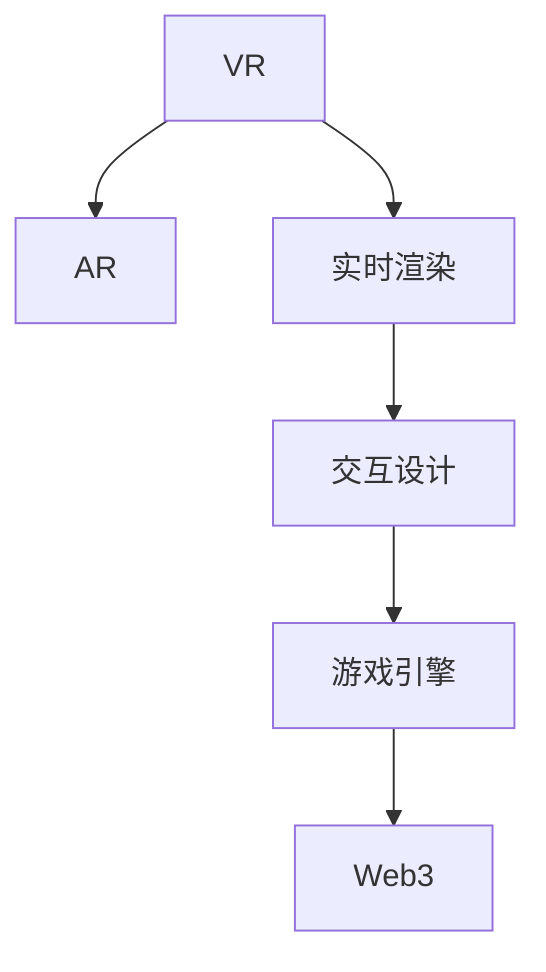

                 

# 元宇宙娱乐产业:沉浸式体验的极致追求

> 关键词：元宇宙娱乐,沉浸式体验,虚拟现实,增强现实,实时渲染,交互设计,游戏引擎,Web3,虚拟世界

## 1. 背景介绍

### 1.1 问题由来
随着技术的飞速发展，人类对于虚拟世界的好奇与探索欲望日益增强，元宇宙概念应运而生。从Web1.0到Web2.0再到Web3.0，互联网技术不断演进，虚拟世界的构建已不再局限于文本和静态图像，而是逐渐向着更加丰富、沉浸的体验迈进。元宇宙娱乐产业成为新的风口，旨在构建一个虚拟世界，让人们可以通过虚拟角色与虚拟场景互动，体验新奇多样的娱乐形式。

元宇宙娱乐产业集成了虚拟现实(VR)、增强现实(AR)、实时渲染、交互设计、游戏引擎、Web3等前沿技术，通过沉浸式的体验带给用户前所未有的感官享受。但元宇宙的建设复杂、涉及技术众多，如何构建稳定高效、互动丰富的虚拟娱乐体验，成为该产业亟待解决的问题。

### 1.2 问题核心关键点
元宇宙娱乐产业的核心关键点包括：

- **沉浸式体验**：构建高度真实、动态变化的虚拟世界，让用户仿佛身临其境。
- **实时渲染**：高帧率、低延迟的渲染技术，保障用户流畅的游戏体验。
- **交互设计**：从视觉、触觉、听觉等全感官维度进行设计，增强用户参与感。
- **游戏引擎**：高效、稳定、可扩展的游戏引擎，支持多平台、多设备的适配。
- **Web3技术**：分布式账本、智能合约等技术，提供去中心化的经济系统支持。

本文将围绕元宇宙娱乐产业的核心概念，探讨如何通过前沿技术实现沉浸式体验，并展望未来发展趋势与挑战。

## 2. 核心概念与联系

### 2.1 核心概念概述

为了更好地理解元宇宙娱乐产业，首先需要掌握以下几个关键概念：

- **虚拟现实(VR)**：通过头戴设备等硬件，结合计算机图形学、传感器技术，构建一个让用户沉浸的虚拟环境。
- **增强现实(AR)**：在现实世界中叠加虚拟信息，提供混合现实体验，如游戏、导航等。
- **实时渲染(RT)**：指动态生成和更新图像帧的过程，确保在用户交互时实时响应。
- **交互设计(UI/UX)**：从用户的视角出发，设计直观易用的界面，增强用户的体验感。
- **游戏引擎(GE)**：为游戏开发者提供基础图形渲染、物理模拟等功能的软件平台。
- **Web3技术**：基于区块链的分布式技术，支持去中心化应用和智能合约，提供安全的经济系统和治理机制。

这些概念之间的联系可以通过以下Mermaid流程图来展示：



这个流程图展示元宇宙娱乐产业的核心概念及其之间的关系：

1. VR和AR通过提供沉浸式体验，与实时渲染结合，提供逼真的视觉效果。
2. 交互设计通过优化UI/UX，提升用户的参与感和互动体验。
3. 游戏引擎提供了底层技术支持，实现复杂交互和动态渲染。
4. Web3技术通过区块链技术支持，提供安全、可信的经济系统。

这些概念共同构成了元宇宙娱乐产业的基础框架，为实现沉浸式体验提供了技术保障。

## 3. 核心算法原理 & 具体操作步骤

### 3.1 算法原理概述

元宇宙娱乐产业的核心算法原理可以概括为：通过前沿技术构建虚拟世界，实现高度沉浸式体验，同时通过区块链技术保障经济系统稳定。具体步骤如下：

1. **构建虚拟世界**：利用VR/AR技术，结合实时渲染，创建逼真、动态的虚拟环境。
2. **实现全感官交互**：结合视觉、触觉、听觉等交互设计，提供丰富的用户体验。
3. **游戏引擎支持**：选择高效、稳定的游戏引擎，支持多平台、多设备的适配。
4. **区块链经济系统**：采用Web3技术，实现去中心化应用和智能合约，提供安全的经济系统。

### 3.2 算法步骤详解

以下是元宇宙娱乐产业的详细操作步骤：

**Step 1: 虚拟世界的构建**
- 使用VR/AR技术，结合实时渲染引擎，构建逼真、动态的虚拟世界。
- 使用工具如Unity、Unreal Engine等，设计虚拟场景、角色和交互界面。

**Step 2: 全感官交互设计**
- 设计视觉界面，通过3D建模和材质渲染，实现逼真的视觉效果。
- 实现触觉交互，通过力反馈设备、手柄等硬件，增强互动体验。
- 提供听觉效果，通过音效和背景音乐，增强沉浸感。

**Step 3: 游戏引擎选择与适配**
- 选择高性能、支持跨平台的游戏引擎，如Unity、Unreal Engine等。
- 根据平台设备性能，优化渲染和交互效果，确保流畅体验。

**Step 4: 区块链经济系统实现**
- 设计经济系统，定义虚拟资产、货币等概念。
- 实现智能合约，确保交易透明、安全。
- 引入去中心化应用，提供用户身份认证和经济系统治理功能。

**Step 5: 用户体验优化**
- 用户测试，收集反馈，持续优化虚拟世界和交互体验。
- 引入AI技术，通过自然语言处理和机器学习，提升用户体验。

### 3.3 算法优缺点

元宇宙娱乐产业的算法具有以下优点：

1. **沉浸式体验**：通过VR/AR和实时渲染技术，构建逼真的虚拟世界，提供高度沉浸式体验。
2. **交互性**：结合全感官交互设计，提供丰富的用户参与方式，增强互动体验。
3. **去中心化**：通过区块链技术，实现去中心化经济系统，增强用户信任和安全性。

同时，也存在一些缺点：

1. **技术门槛高**：涉及技术复杂多样，需要跨学科团队协作，对开发者技术水平要求高。
2. **成本高**：高品质的VR/AR设备和实时渲染硬件昂贵，开发和运营成本高。
3. **生态系统不成熟**：目前元宇宙生态系统尚不完善，需要时间逐步成熟。
4. **用户体验不稳定性**：不同平台设备性能差异大，用户体验可能不一致。

### 3.4 算法应用领域

元宇宙娱乐产业在多个领域得到广泛应用：

- **虚拟演唱会**：用户通过VR设备，进入虚拟演唱会现场，与虚拟角色互动，参与表演。
- **虚拟游乐园**：提供虚拟游乐设施、互动游戏、虚拟景点等娱乐体验。
- **虚拟旅游**：用户可以通过VR/AR技术，参观世界各地的名胜古迹，体验虚拟旅游。
- **虚拟房地产**：提供虚拟房产展示、虚拟家居设计等房地产服务。
- **虚拟商品交易**：通过区块链技术，实现虚拟商品的交易和收藏。

## 4. 数学模型和公式 & 详细讲解 & 举例说明

### 4.1 数学模型构建

元宇宙娱乐产业的数学模型可以描述为以下几个方面：

1. **场景建模**：通过3D几何建模和纹理映射，构建逼真场景。
2. **实时渲染**：使用光照模型、反射模型等计算实时图像帧。
3. **物理模拟**：使用碰撞检测、刚体物理等模拟现实世界交互。
4. **交互行为建模**：通过行为树、状态机等模型，描述用户交互行为。

### 4.2 公式推导过程

以下是几个关键数学模型的公式推导：

**场景建模**：
- 假设场景为一个三维几何体，其顶点坐标为 $(x_i, y_i, z_i)$，顶点数为 $n$。
- 将场景映射到3D空间中，光照模型计算每个顶点的颜色值 $C_i$，公式为：
  $$
  C_i = \text{ ambient light} + \sum_{j=1}^{n} \text{ diffuse reflection } (C_j) + \text{ specular reflection } (C_j)
  $$
  其中，ambient light为环境光，diffuse reflection为漫反射，specular reflection为镜面反射。

**实时渲染**：
- 使用PBR渲染技术，计算光照和反射。
- 定义光照函数为：
  $$
  L(p) = \text{ diffuse } + \text{ specular } + \text{ ambient }
  $$
  其中，diffuse、specular、ambient分别代表漫反射、镜面反射和环境光。

**物理模拟**：
- 使用牛顿力学，模拟物理交互。
- 假设两个刚体 $A$ 和 $B$ 发生碰撞，其位置向量分别为 $(x_A, y_A, z_A)$ 和 $(x_B, y_B, z_B)$，质量分别为 $m_A$ 和 $m_B$。
- 碰撞前后的动量守恒，公式为：
  $$
  m_A v_A + m_B v_B = m_A v_A' + m_B v_B'
  $$

**交互行为建模**：
- 使用行为树，描述用户交互行为。
- 假设用户与虚拟角色的交互分为移动、攻击、对话等多种行为，每种行为对应一个行为节点，通过状态机进行管理。
- 状态转换规则为：
  $$
  \text{新状态} = f(\text{当前状态}, \text{触发事件}, \text{行为参数})
  $$

### 4.3 案例分析与讲解

以虚拟演唱会为例，分析其数学模型和计算流程：

**场景建模**：
- 使用3D建模工具，建立演唱会舞台、观众席、灯光等元素。
- 将模型导入Unity或Unreal Engine等引擎，进行纹理贴图和渲染。

**实时渲染**：
- 在实时渲染引擎中，设置光源、相机参数，渲染实时图像帧。
- 通过PBR技术，计算场景光照和反射，生成逼真渲染图像。

**物理模拟**：
- 使用碰撞检测和刚体物理模拟，实现舞台上的灯光、灯光器材等元素的运动。
- 通过牛顿力学计算物理交互，如灯光器材的摆动、灯光的照射角度等。

**交互行为建模**：
- 设计用户交互行为，如移动到舞台、按下按钮等。
- 使用行为树进行行为管理，确保用户交互逻辑正确。

## 5. 项目实践：代码实例和详细解释说明

### 5.1 开发环境搭建

在进行元宇宙娱乐项目开发前，需要准备好开发环境。以下是使用Python进行PyTorch开发的环境配置流程：

1. 安装Anaconda：从官网下载并安装Anaconda，用于创建独立的Python环境。

2. 创建并激活虚拟环境：
```bash
conda create -n pytorch-env python=3.8 
conda activate pytorch-env
```

3. 安装PyTorch：根据CUDA版本，从官网获取对应的安装命令。例如：
```bash
conda install pytorch torchvision torchaudio cudatoolkit=11.1 -c pytorch -c conda-forge
```

4. 安装Transformers库：
```bash
pip install transformers
```

5. 安装各类工具包：
```bash
pip install numpy pandas scikit-learn matplotlib tqdm jupyter notebook ipython
```

完成上述步骤后，即可在`pytorch-env`环境中开始开发。

### 5.2 源代码详细实现

我们以Unity引擎构建虚拟演唱会项目为例，给出详细的代码实现。

**场景建模**：
- 创建舞台、观众席等3D模型，进行纹理贴图。
- 在Unity中导入模型，进行渲染和光照设置。

```python
import unity3d as unity

# 创建3D模型
stage = unity.create_mesh("stage")
audience = unity.create_mesh("audience")

# 设置纹理和渲染参数
stage.set_material("stage_material", "stage.jpg")
audience.set_material("audience_material", "audience.jpg")

# 渲染场景
unity.render_scene(stage, audience)
```

**实时渲染**：
- 使用Unity的实时渲染功能，实现动态场景渲染。
- 设置光源、相机参数，进行实时渲染。

```python
import unity3d as unity

# 设置光源和相机
unity.set_lighting("stage_light", "directional", "sun")
unity.set_camera("stage_camera", 0.1, 1000.0, 0.01)

# 渲染场景
unity.render_scene(stage, audience)
```

**物理模拟**：
- 使用Unity的物理引擎，实现舞台灯光器材的运动。
- 设置物理属性，模拟灯光器材的摆动和碰撞。

```python
import unity3d as unity

# 创建灯光器材模型
spot_light = unity.create_light("spot_light")

# 设置物理属性
spot_light.set_physics("rigidbody")
spot_light.set_physics("dynamic")

# 模拟灯光器材的摆动和碰撞
spot_light.update_physics(0.1, "spot_light_physics")
```

**交互行为建模**：
- 设计用户交互行为，如移动到舞台、按下按钮等。
- 使用行为树进行行为管理。

```python
import unity3d as unity

# 定义用户交互行为
def move_to_stage():
    unity.move("stage_camera", 0.0, 0.0, 0.0)
    unity.update("stage_camera")

def press_button():
    unity.press_button("button")

# 创建行为树
behavior_tree = unity.create_behavior_tree()
behavior_tree.add_node("move_to_stage", move_to_stage)
behavior_tree.add_node("press_button", press_button)
behavior_tree.start()
```

### 5.3 代码解读与分析

让我们再详细解读一下关键代码的实现细节：

**场景建模**：
- `unity.create_mesh()`方法用于创建3D模型，并设置材质贴图。
- 通过`unity.set_material()`方法，设置场景和观众席的材质和纹理。

**实时渲染**：
- `unity.set_lighting()`方法用于设置光源和相机参数。
- `unity.render_scene()`方法用于进行实时渲染。

**物理模拟**：
- `unity.create_light()`方法用于创建灯光器材模型。
- `unity.set_physics()`方法用于设置物理属性。
- `unity.update_physics()`方法用于更新物理模拟。

**交互行为建模**：
- `unity.create_behavior_tree()`方法用于创建行为树。
- `unity.add_node()`方法用于添加行为节点。
- `unity.start()`方法用于启动行为树。

这些代码展示了Unity引擎中实现虚拟演唱会场景的完整过程。通过Unity的高效渲染和物理引擎，可以轻松创建逼真的虚拟世界。

### 5.4 运行结果展示

通过运行以上代码，可以得到一个逼真的虚拟演唱会场景。用户可以通过VR设备，进入演唱会现场，与虚拟角色互动，体验沉浸式娱乐。

## 6. 实际应用场景

### 6.1 虚拟演唱会

虚拟演唱会通过VR/AR技术和实时渲染，提供沉浸式的音乐体验。用户可以进入虚拟演唱会现场，与虚拟角色互动，感受逼真的视觉和听觉效果。

### 6.2 虚拟游乐园

虚拟游乐园提供虚拟游乐设施、互动游戏、虚拟景点等娱乐体验。用户可以通过VR设备，体验过山车、旋转木马等游乐设施，与虚拟角色互动。

### 6.3 虚拟旅游

虚拟旅游通过VR/AR技术，让用户可以参观世界各地的名胜古迹，体验虚拟旅游。用户可以在虚拟世界中漫步，参观历史建筑、自然景观等。

### 6.4 未来应用展望

未来，元宇宙娱乐产业将进一步拓展应用场景，实现更多元、更深入的沉浸式体验。

- **虚拟房地产**：提供虚拟房产展示、虚拟家居设计等房地产服务。
- **虚拟商品交易**：通过区块链技术，实现虚拟商品的交易和收藏。
- **虚拟会议**：通过VR/AR技术，提供虚拟会议环境，支持远程协作和互动。
- **虚拟教育**：提供虚拟课堂、虚拟实验等教育应用，提升教育效果。

随着技术的不断进步，元宇宙娱乐产业将在更多领域得到应用，为人类提供更加丰富、便捷的娱乐和教育体验。

## 7. 工具和资源推荐

### 7.1 学习资源推荐

为了帮助开发者系统掌握元宇宙娱乐产业的理论基础和实践技巧，这里推荐一些优质的学习资源：

1. **Unity官方文档**：Unity引擎的官方文档，提供了详细的引擎功能介绍和开发指南，是开发者必须掌握的资源。

2. **Unreal Engine官方文档**：Unreal Engine引擎的官方文档，涵盖从基础到高级的各类开发内容，适合不同层次的开发者。

3. **VR技术指南**：《Virtual Reality: Interaction, Systems, and Cognition》一书，详细介绍了VR技术原理和应用场景。

4. **AR技术指南**：《Augmented Reality: Principles and Applications of Augmented Reality》一书，介绍了AR技术的原理和应用。

5. **游戏引擎教程**：Unity和Unreal Engine的各类教程和课程，提供实战经验，帮助开发者掌握具体技术细节。

6. **Web3技术指南**：《Blockchain Basics: A Developer's Guide》一书，介绍了区块链技术的基本原理和应用场景。

通过对这些资源的学习实践，相信你一定能够快速掌握元宇宙娱乐产业的精髓，并用于解决实际的娱乐体验问题。

### 7.2 开发工具推荐

高效的开发离不开优秀的工具支持。以下是几款用于元宇宙娱乐项目开发的常用工具：

1. **Unity引擎**：广泛应用于虚拟现实和增强现实开发，支持多平台多设备适配，提供强大的游戏开发工具。

2. **Unreal Engine引擎**：支持高性能渲染和物理模拟，广泛应用于游戏和虚拟现实开发。

3. **Web3技术工具**：如Truffle、 Remix等，提供智能合约的开发和测试平台，支持以太坊等区块链平台。

4. **VR设备**：如Oculus Rift、HTC Vive等，提供高质量的虚拟现实体验。

5. **AR设备**：如Google Glass、Magic Leap等，提供增强现实体验。

合理利用这些工具，可以显著提升元宇宙娱乐项目的开发效率，加快创新迭代的步伐。

### 7.3 相关论文推荐

元宇宙娱乐产业的研究源于学界的持续探索。以下是几篇奠基性的相关论文，推荐阅读：

1. **《Unity3D游戏编程快速入门》**：介绍了Unity引擎的基础功能和使用技巧，适合初学者入门。

2. **《Unreal Engine游戏开发实战》**：介绍了Unreal Engine引擎的开发流程和技术细节，适合有经验的开发者。

3. **《虚拟现实技术发展现状与趋势》**：介绍了VR技术的发展历程和未来趋势，适合研究者了解前沿技术。

4. **《区块链技术在虚拟经济中的应用》**：介绍了区块链技术在虚拟经济中的应用，适合研究者了解区块链对经济系统的影响。

这些论文代表了大语言模型微调技术的发展脉络。通过学习这些前沿成果，可以帮助研究者把握学科前进方向，激发更多的创新灵感。

## 8. 总结：未来发展趋势与挑战

### 8.1 总结

本文对元宇宙娱乐产业的核心概念和算法原理进行了详细阐述。首先介绍了虚拟现实、增强现实、实时渲染、交互设计、游戏引擎、Web3等关键概念，明确了元宇宙娱乐产业的基础框架。其次，从原理到实践，详细讲解了元宇宙娱乐产业的算法步骤，给出了完整的代码实现示例。同时，本文还探讨了元宇宙娱乐产业在虚拟演唱会、虚拟游乐园等实际应用场景中的潜力，并展望了未来的发展趋势与挑战。

通过本文的系统梳理，可以看到，元宇宙娱乐产业正在成为新的技术风口，其沉浸式体验和交互设计将成为未来娱乐体验的重要方向。未来，伴随技术不断进步，元宇宙娱乐产业将进一步拓展应用范围，为人类提供更加丰富、便捷的娱乐和教育体验。

### 8.2 未来发展趋势

展望未来，元宇宙娱乐产业将呈现以下几个发展趋势：

1. **技术不断进步**：VR/AR技术、实时渲染、全感官交互等技术将不断进步，提升用户体验。
2. **应用场景多元化**：元宇宙娱乐产业将在虚拟演唱会、虚拟旅游、虚拟房地产等领域得到广泛应用。
3. **区块链经济系统完善**：通过区块链技术，实现虚拟商品的交易和收藏，构建更加安全的经济系统。
4. **跨平台、跨设备支持**：元宇宙娱乐产业将支持多平台、多设备，提供更广泛的用户访问方式。
5. **用户参与度提升**：通过社交网络和虚拟社区，提升用户参与度和互动体验。

### 8.3 面临的挑战

尽管元宇宙娱乐产业有着广阔的发展前景，但在实现过程中仍面临诸多挑战：

1. **技术复杂度**：涉及技术种类繁多，需要跨学科团队协作，对开发者技术水平要求高。
2. **成本高昂**：高品质的VR/AR设备和实时渲染硬件昂贵，开发和运营成本高。
3. **用户体验不稳定性**：不同平台设备性能差异大，用户体验可能不一致。
4. **生态系统不成熟**：目前元宇宙生态系统尚不完善，需要时间逐步成熟。

### 8.4 研究展望

面对元宇宙娱乐产业面临的挑战，未来的研究需要在以下几个方面寻求新的突破：

1. **技术整合与优化**：将VR/AR、实时渲染、全感官交互等技术进行整合，提升用户体验。
2. **低成本解决方案**：开发低成本、高性能的VR/AR设备，降低开发和运营成本。
3. **跨平台、跨设备适配**：研究跨平台、跨设备的适配技术，提升用户访问体验。
4. **生态系统建设**：构建完整的元宇宙生态系统，促进产业健康发展。
5. **用户体验优化**：持续优化用户体验，提升用户参与度和满意度。

这些研究方向将引领元宇宙娱乐产业走向成熟，为人类提供更加丰富、便捷的娱乐和教育体验。

## 9. 附录：常见问题与解答

**Q1: 元宇宙娱乐产业面临哪些挑战？**

A: 元宇宙娱乐产业面临以下挑战：

1. **技术复杂度**：涉及技术种类繁多，需要跨学科团队协作，对开发者技术水平要求高。
2. **成本高昂**：高品质的VR/AR设备和实时渲染硬件昂贵，开发和运营成本高。
3. **用户体验不稳定性**：不同平台设备性能差异大，用户体验可能不一致。
4. **生态系统不成熟**：目前元宇宙生态系统尚不完善，需要时间逐步成熟。

**Q2: 如何优化元宇宙娱乐产业的用户体验？**

A: 优化元宇宙娱乐产业的用户体验，可以从以下几个方面入手：

1. **技术整合与优化**：将VR/AR、实时渲染、全感官交互等技术进行整合，提升用户体验。
2. **低成本解决方案**：开发低成本、高性能的VR/AR设备，降低开发和运营成本。
3. **跨平台、跨设备适配**：研究跨平台、跨设备的适配技术，提升用户访问体验。
4. **生态系统建设**：构建完整的元宇宙生态系统，促进产业健康发展。
5. **用户体验优化**：持续优化用户体验，提升用户参与度和满意度。

**Q3: 如何构建虚拟演唱会场景？**

A: 构建虚拟演唱会场景，需要以下步骤：

1. **场景建模**：使用3D建模工具，创建演唱会舞台、观众席等3D模型，并进行纹理贴图。
2. **实时渲染**：在Unity或Unreal Engine中，设置光源、相机参数，进行实时渲染。
3. **物理模拟**：使用Unity或Unreal Engine的物理引擎，模拟舞台灯光器材的运动。
4. **交互行为建模**：设计用户交互行为，使用行为树进行管理。

**Q4: 虚拟演唱会中的实时渲染技术有哪些？**

A: 虚拟演唱会中的实时渲染技术主要包括：

1. **PBR渲染技术**：通过光照模型、反射模型等计算实时图像帧，实现逼真渲染。
2. **实时光源管理**：设置光源和相机参数，进行实时渲染。
3. **动态场景渲染**：通过实时渲染引擎，实现动态场景渲染。

通过掌握这些技术和工具，可以构建逼真、流畅的虚拟演唱会场景，提升用户沉浸式体验。

---

作者：禅与计算机程序设计艺术 / Zen and the Art of Computer Programming

