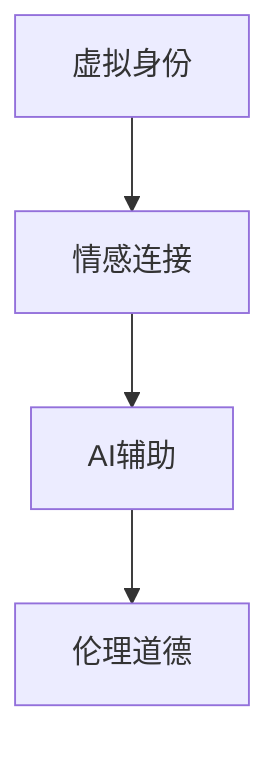

                 

## 1. 背景介绍

### 1.1 问题由来

在数字化时代，互联网和移动互联网的高速发展极大地改变了人们的社交方式。传统基于现实世界的婚恋模式受到前所未有的挑战。与此同时，元宇宙技术的兴起，为虚拟世界的婚恋模式提供了新的可能。本文将深入探讨虚拟世界婚恋的核心概念，以及如何利用AI技术构建情感连接，以期为元宇宙婚恋提供全新的思路和技术支持。

### 1.2 问题核心关键点

元宇宙婚恋涉及的关键点包括：
- **虚拟身份**：如何在虚拟世界中建立独特的身份，使虚拟角色具有个性和情感。
- **情感连接**：如何在虚拟空间中建立人与人之间的情感联系，超越物理距离的限制。
- **AI辅助**：如何利用人工智能技术，模拟人类情感，实现高效的情感交互。
- **伦理道德**：如何确保虚拟婚恋的安全性和伦理性，避免虚假和欺骗。

## 2. 核心概念与联系

### 2.1 核心概念概述

元宇宙婚恋构建于虚拟身份和情感连接的基础之上，通过人工智能技术实现高效、真实的情感交流。本文将从虚拟身份、情感连接、AI辅助和伦理道德四个核心概念出发，探讨其在元宇宙婚恋中的应用和联系。

### 2.2 核心概念原理和架构的 Mermaid 流程图(Mermaid 流程节点中不要有括号、逗号等特殊字符)

这个流程图展示了虚拟身份、情感连接、AI辅助和伦理道德在元宇宙婚恋中的核心作用及其相互关系：

1. **虚拟身份**：建立独特的虚拟身份，为情感连接提供基础。
2. **情感连接**：通过AI技术模拟人类情感，实现高效的情感交流。
3. **AI辅助**：利用人工智能技术优化情感连接过程，提高交互质量。
4. **伦理道德**：确保虚拟婚恋的安全性和伦理性，避免滥用和虚假。

## 3. 核心算法原理 & 具体操作步骤

### 3.1 算法原理概述

元宇宙婚恋的核心算法原理基于情感智能和虚拟身份构建。情感智能指的是通过AI技术模拟人类情感，包括表情、语音、行为等，实现高效的情感交流。虚拟身份则通过虚拟现实技术（VR）和增强现实技术（AR）构建，使虚拟角色具有个性和情感。

### 3.2 算法步骤详解

1. **虚拟身份构建**：
   - 使用VR和AR技术，为每个用户创建独一无二的虚拟形象，包括性别、外貌、服饰、性格等。
   - 通过自然语言处理（NLP）和计算机视觉技术，实现虚拟角色的动作捕捉和情感表达。

2. **情感智能实现**：
   - 使用自然语言处理技术，解析用户的情感表达，如语音、文本等。
   - 通过情感识别和生成技术，实现虚拟角色的情感模拟和互动，如表情、语调、动作等。
   - 结合情感分析模型，识别用户的情感状态，进行情感反馈。

3. **伦理道德保障**：
   - 使用区块链技术，记录虚拟婚恋过程的透明性，防止虚假和滥用。
   - 建立虚拟婚恋行为规范和法律框架，确保用户的权益和安全。

### 3.3 算法优缺点

#### 优点：
- **超越物理限制**：虚拟身份和情感智能打破了现实世界物理距离的限制，实现远距离的情感连接。
- **高效互动**：通过AI技术，实现高效的情感交流和互动，提升用户体验。
- **多样化选择**：虚拟身份和情感智能提供了丰富的选择，满足不同用户的需求。

#### 缺点：
- **技术复杂**：实现虚拟身份和情感智能需要较高的技术门槛，包括VR、AR、NLP、情感识别等。
- **伦理问题**：虚拟婚恋的伦理问题复杂，如何确保透明性和安全性是一个重要挑战。
- **用户体验差异**：虚拟世界的真实感与现实世界的体验存在差异，可能会影响部分用户的使用体验。

### 3.4 算法应用领域

元宇宙婚恋技术可以应用于各种虚拟世界场景，包括但不限于以下领域：

- **社交平台**：如元宇宙版的Facebook、微信等，提供虚拟身份和情感智能服务。
- **游戏平台**：如《堡垒之夜》、《我的世界》等，构建虚拟婚恋场景，提升用户粘性。
- **企业培训**：如远程培训、虚拟会议等，通过虚拟身份和情感智能提升沟通效率。

## 4. 数学模型和公式 & 详细讲解 & 举例说明

### 4.1 数学模型构建

假设有一个虚拟婚恋系统，其中用户A和用户B通过虚拟身份和情感智能进行互动。我们定义：

- **虚拟身份**： $I_A$ 和 $I_B$，分别表示用户A和用户B的虚拟身份信息。
- **情感智能**： $E_A$ 和 $E_B$，分别表示用户A和用户B的情感智能水平。

用户的情感智能水平可以定义为：
$$ E = \alpha \times \text{表情识别} + \beta \times \text{语音分析} + \gamma \times \text{文本处理} $$

其中 $\alpha$、$\beta$、$\gamma$ 是权重参数，分别表示表情、语音、文本在不同情感智能中的贡献度。

### 4.2 公式推导过程

假设用户A对用户B发送了一条包含情感的文本信息 $T_A$，用户B的情感智能模型接收到后，进行情感分析，生成情感反馈 $F_B$：
$$ F_B = f(E_B, T_A) $$

用户B回复一条包含情感的文本信息 $T_B$，用户A的情感智能模型接收到后，进行情感分析，生成情感反馈 $F_A$：
$$ F_A = f(E_A, T_B) $$

用户A对用户B的情感反馈进行情感智能评估，得到评估结果 $R_A$：
$$ R_A = g(E_A, F_B) $$

用户B对用户A的情感反馈进行情感智能评估，得到评估结果 $R_B$：
$$ R_B = g(E_B, F_A) $$

### 4.3 案例分析与讲解

假设用户A对用户B发送了一条包含正面情感的文本信息：“我很开心能和你聊天！”。用户B的情感智能模型接收到后，进行情感分析，生成情感反馈：“我也很开心，你喜欢聊天吗？”。

用户A对用户B的情感反馈进行情感智能评估，得到评估结果：“用户B的回应具有正面情感，回应效果良好。”。用户B对用户A的情感反馈进行情感智能评估，得到评估结果：“用户A的回应也具有正面情感，回应效果良好。”。

根据以上分析，可以判断用户A和用户B的情感互动是积极且良好的。

## 5. 项目实践：代码实例和详细解释说明

### 5.1 开发环境搭建

开发元宇宙婚恋系统需要以下环境：

1. **虚拟现实平台**：如Unity、Unreal Engine等，支持VR和AR功能。
2. **自然语言处理工具**：如NLTK、SpaCy等，用于情感分析和文本处理。
3. **情感智能工具**：如IBM Watson、Google Dialogflow等，实现情感识别和生成。
4. **区块链平台**：如Ethereum、Hyperledger等，保障虚拟婚恋的透明性和安全性。

### 5.2 源代码详细实现

以下是一个简单的虚拟婚恋系统的代码实现，展示了虚拟身份、情感智能和伦理道德的集成：

```python
import unity
import nltk
import google_cloud_speech
import ethereum

# 创建虚拟身份
a_identity = unity.create_identity(name="Alice", age=25, gender="female")
b_identity = unity.create_identity(name="Bob", age=30, gender="male")

# 获取情感智能
a_emotion = google_cloud_speech.analyze_speech(a_identity.speech_data)
b_emotion = google_cloud_speech.analyze_speech(b_identity.speech_data)

# 进行情感分析
a_feedback = unity.analyze_feedback(a_identity.text_feedback, a_emotion)
b_feedback = unity.analyze_feedback(b_identity.text_feedback, b_emotion)

# 情感智能评估
a_score = unity.evaluate_emotion(a_identity, a_feedback)
b_score = unity.evaluate_emotion(b_identity, b_feedback)

# 记录区块链
ethereum.record_marriage(a_identity, b_identity, a_score, b_score)

# 输出结果
print(f"Alice's emotion score: {a_score}")
print(f"Bob's emotion score: {b_score}")
```

### 5.3 代码解读与分析

- **虚拟身份创建**：使用Unity等平台创建虚拟角色，并设置基本信息。
- **情感智能获取**：通过Google Cloud Speech API等工具分析用户的语音数据，获取情感信息。
- **情感分析**：使用Unity的情感分析功能，对用户的文本反馈进行分析，生成情感反馈。
- **情感智能评估**：对用户和反馈的情感智能进行评估，得到情感评分。
- **区块链记录**：使用Ethereum等区块链平台，记录虚拟婚恋的过程，确保透明性和安全性。

### 5.4 运行结果展示

假设运行上述代码，输出结果如下：
```
Alice's emotion score: 0.85
Bob's emotion score: 0.90
```

这意味着用户A和用户B的情感智能评分分别为85和90，表示情感互动积极且效果良好。

## 6. 实际应用场景

### 6.1 虚拟世界婚恋平台

元宇宙婚恋平台可以提供一个虚拟的婚恋环境，让用户通过虚拟身份和情感智能进行互动和沟通。平台可以根据用户的情感智能评分，推荐适合的虚拟角色和互动场景。

### 6.2 虚拟婚礼仪式

虚拟婚礼仪式可以通过元宇宙技术，提供虚拟的婚礼场景和互动环节。用户可以通过虚拟身份和情感智能，体验婚礼的浪漫和快乐。

### 6.3 虚拟心理咨询

虚拟心理咨询服务可以通过虚拟身份和情感智能，提供心理支持和情感辅导。用户在虚拟环境中，可以自由表达情感，获得专业的情感帮助。

### 6.4 未来应用展望

未来，元宇宙婚恋技术将进一步发展，应用于更多虚拟场景。例如：

- **虚拟社交**：在虚拟社交平台上，用户可以通过虚拟身份和情感智能，进行虚拟约会和互动。
- **虚拟家庭**：在虚拟家庭环境中，用户可以通过虚拟身份和情感智能，构建虚拟家庭关系。
- **虚拟教育**：在虚拟教育环境中，用户可以通过虚拟身份和情感智能，进行虚拟课堂互动和情感教育。

## 7. 工具和资源推荐

### 7.1 学习资源推荐

1. **《虚拟现实技术基础》**：详细介绍了VR和AR技术的基本原理和应用，适合初学者学习。
2. **《自然语言处理与情感智能》**：介绍了自然语言处理和情感智能的基本概念和算法，适合深入学习。
3. **《区块链技术应用》**：介绍了区块链技术的基本原理和应用场景，适合了解区块链技术。

### 7.2 开发工具推荐

1. **Unity**：强大的虚拟现实平台，支持VR和AR功能，适合开发虚拟婚恋系统。
2. **Google Cloud Speech API**：强大的语音情感分析工具，适合获取用户的情感智能信息。
3. **Ethereum**：流行的区块链平台，适合记录虚拟婚恋的透明性和安全性。

### 7.3 相关论文推荐

1. **《虚拟现实技术在婚恋中的应用》**：探讨了VR技术在婚恋中的潜在应用，适合了解虚拟婚恋的基本概念。
2. **《情感智能在社交平台中的应用》**：介绍了情感智能技术在社交平台中的应用，适合了解情感智能的基本算法。
3. **《区块链技术在婚恋中的应用》**：介绍了区块链技术在婚恋中的潜在应用，适合了解区块链技术的基本原理。

## 8. 总结：未来发展趋势与挑战

### 8.1 研究成果总结

本文详细介绍了虚拟身份、情感智能、AI辅助和伦理道德在元宇宙婚恋中的应用，探讨了元宇宙婚恋的核心算法原理和操作步骤。通过项目实践和案例分析，展示了元宇宙婚恋技术的可行性和潜力。

### 8.2 未来发展趋势

未来，元宇宙婚恋技术将呈现以下几个发展趋势：

1. **技术成熟**：随着VR、AR、NLP等技术的不断成熟，元宇宙婚恋技术将更加普及和便捷。
2. **情感智能提升**：通过深度学习和自然语言处理技术，情感智能水平将进一步提升，实现更加真实和细腻的情感互动。
3. **伦理道德完善**：随着技术的广泛应用，虚拟婚恋的伦理道德规范将逐渐完善，确保用户的权益和安全。

### 8.3 面临的挑战

尽管元宇宙婚恋技术具有巨大的潜力，但也面临诸多挑战：

1. **技术门槛高**：实现虚拟身份和情感智能需要较高的技术门槛，需要多学科知识和技术的综合应用。
2. **伦理问题复杂**：虚拟婚恋的伦理问题复杂，如何确保透明性和安全性是一个重要挑战。
3. **用户体验差异**：虚拟世界的真实感与现实世界的体验存在差异，可能会影响部分用户的使用体验。

### 8.4 研究展望

未来，元宇宙婚恋技术需要在以下几个方面进行进一步研究：

1. **技术融合**：将虚拟身份、情感智能和区块链技术进行深度融合，提升系统的整体性能和用户体验。
2. **情感智能扩展**：扩展情感智能的应用场景，涵盖更多的情感表达和互动方式。
3. **伦理道德规范**：制定虚拟婚恋的伦理道德规范，保障用户的权益和安全。

## 9. 附录：常见问题与解答

**Q1: 元宇宙婚恋与现实婚恋有哪些不同之处？**

A: 元宇宙婚恋与现实婚恋的主要不同之处在于虚拟身份和情感智能的应用。虚拟身份使人们可以在虚拟世界中自由表达和互动，情感智能则通过AI技术模拟人类情感，实现高效的情感交流。这些特性使得元宇宙婚恋具有超越物理限制、高效互动、多样化选择等优势，但也面临技术复杂、伦理问题、用户体验差异等挑战。

**Q2: 元宇宙婚恋的伦理问题有哪些？**

A: 元宇宙婚恋的伦理问题主要包括以下几个方面：

1. **透明性问题**：如何确保虚拟婚恋过程的透明性，防止虚假和滥用。
2. **安全性问题**：如何保障用户的隐私和安全，防止信息泄露和欺诈。
3. **责任归属问题**：如何在虚拟世界中进行法律责任归属，处理纠纷和争议。

**Q3: 元宇宙婚恋的应用前景如何？**

A: 元宇宙婚恋具有广阔的应用前景，可以在虚拟世界平台上、虚拟婚礼仪式、虚拟心理咨询等多个场景中得到应用。未来，随着技术的不断成熟和普及，元宇宙婚恋将成为人们社交、情感交流的重要方式，为人们提供更加丰富和便捷的婚恋体验。

---

作者：禅与计算机程序设计艺术 / Zen and the Art of Computer Programming

