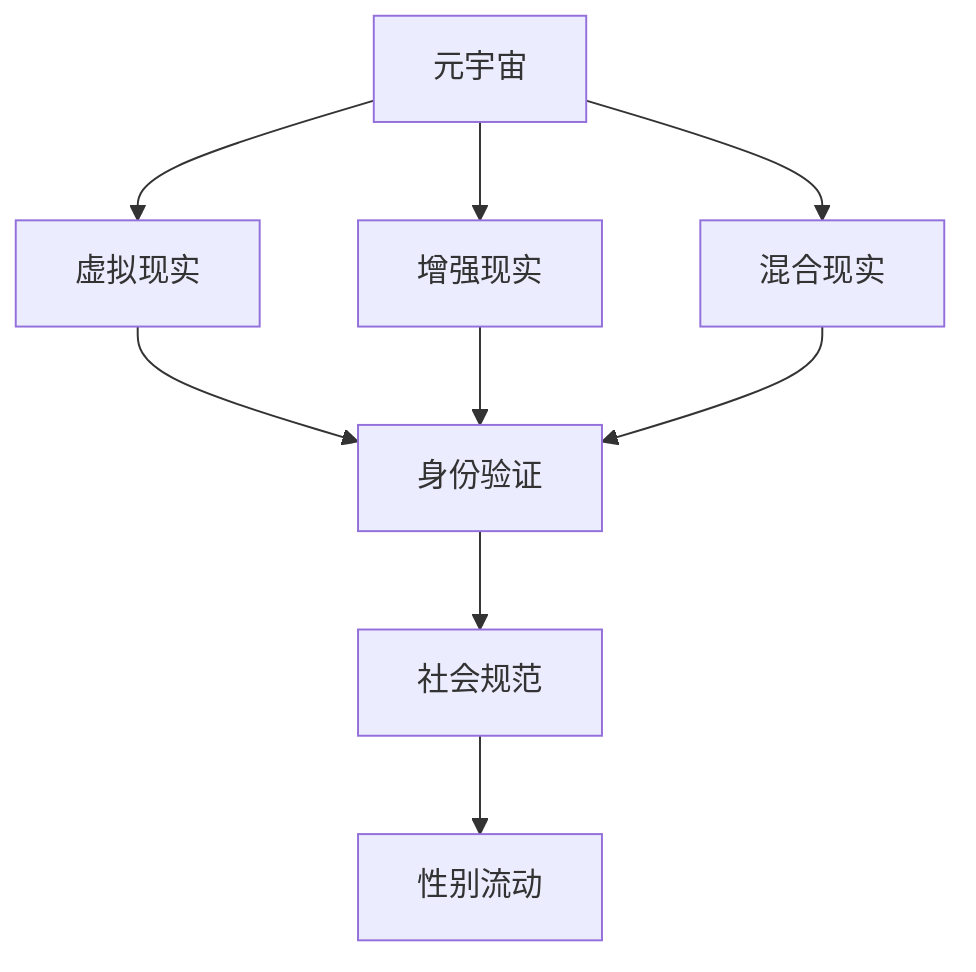

                 

# 元宇宙性别流动:虚拟世界中的性别认同自由

在数字化时代，虚拟世界逐渐成为现实与想象交汇的桥梁。元宇宙（Metaverse）作为虚拟世界的高级形态，正在蓬勃发展。随着技术的进步，人们能够在虚拟世界中自由地探索、社交、创造，甚至体验到无法在现实世界中实现的自由和可能。其中，性别流动（Gender Fluidity）作为新兴的议题，成为元宇宙中重要的讨论焦点。本文将深入探讨元宇宙性别流动这一主题，分析其原理、应用，以及未来发展趋势与面临的挑战。

## 1. 背景介绍

### 1.1 问题由来

在传统社会中，性别往往被视为二元对立的固定状态，即男性和女性。但随着性别研究的不断深入，人们逐渐认识到性别是一种复杂且流动的概念。人们不再局限于传统的性别框架，而是追求自我认同的自由和多样性。

元宇宙作为虚拟现实技术的产物，打破了现实世界中的性别限制，为人们提供了在虚拟世界中进行性别表达和流动的空间。人们可以在虚拟世界中，以任何他们认为合适的性别身份进行交流和互动，甚至可以随时转变自己的性别身份。这种自由和多样性，正是元宇宙性别流动的魅力所在。

### 1.2 问题核心关键点

元宇宙性别流动是指用户在虚拟世界中自由变换性别身份，体验不同性别的生活和角色。这种流动性的实现依赖于虚拟世界的技术支持，包括但不限于虚拟现实（VR）、增强现实（AR）、混合现实（MR）等技术。

性别流动在元宇宙中具有以下核心特征：
- 自由性：用户在虚拟世界中可以自由变换性别身份，不受现实世界的限制。
- 流动性：性别身份在虚拟世界中可以持续变化，用户可以体验不同性别的角色和情境。
- 多样性：虚拟世界中的性别身份可以是二元、多元、非二元等多种形式，丰富了用户的表达方式。

## 2. 核心概念与联系

### 2.1 核心概念概述

为了更好地理解元宇宙性别流动这一概念，本节将介绍几个密切相关的核心概念：

- **元宇宙（Metaverse）**：一种通过虚拟现实、增强现实等技术创建的虚拟空间，用户可以在其中进行社交、娱乐、创造等活动。
- **性别流动（Gender Fluidity）**：个体根据自己的感觉和经历，自由地变换性别身份，不再局限于传统的二元性别框架。
- **虚拟现实（Virtual Reality, VR）**：通过计算机生成的模拟环境，使用户能够沉浸在虚拟世界中。
- **增强现实（Augmented Reality, AR）**：在现实世界的视觉图像上叠加虚拟信息，创造出混合现实环境。
- **混合现实（Mixed Reality, MR）**：结合VR和AR技术，创造出虚实结合的混合现实环境。
- **身份验证（Identity Verification）**：在虚拟世界中验证用户身份的技术手段，确保性别流动的安全性。
- **社会规范（Social Norms）**：虚拟世界中对性别流动行为的社会接受度和行为规范。

这些核心概念之间的逻辑关系可以通过以下Mermaid流程图来展示：



这个流程图展示了大语言模型的核心概念及其之间的关系：

1. 元宇宙通过虚拟现实、增强现实、混合现实等技术创建。
2. 用户可以在元宇宙中进行性别流动，体验不同性别的身份。
3. 身份验证技术确保了性别流动的安全性。
4. 社会规范限制了用户的行为，影响性别流动的方式和接受度。

## 3. 核心算法原理 & 具体操作步骤

### 3.1 算法原理概述

元宇宙性别流动的实现，依赖于虚拟现实技术、身份验证技术以及社会规范的构建。下面将详细阐述这些技术原理和操作步骤。

### 3.2 算法步骤详解

#### 3.2.1 虚拟现实技术

虚拟现实（VR）技术通过计算机生成的模拟环境，使用户能够沉浸在虚拟世界中。元宇宙性别流动在虚拟现实环境中，主要依赖于以下几个步骤：

1. **环境创建**：使用VR引擎（如Unity、Unreal Engine）创建虚拟世界环境，并添加必要的性别相关的元素，如服饰、发型、表情等。
2. **用户交互**：用户可以通过VR头盔、手柄等设备，与虚拟世界进行交互，包括移动、变换、互动等。
3. **性别变换**：用户可以通过控制面板，选择并变换不同的性别身份，体验不同的角色和情境。

#### 3.2.2 身份验证技术

身份验证技术是确保元宇宙性别流动安全性的关键。主要有以下几种验证方式：

1. **用户名密码验证**：用户注册账号后，通过用户名和密码进行身份验证。
2. **生物识别验证**：使用面部识别、指纹识别等生物特征进行身份验证。
3. **行为验证**：通过分析用户的行为模式，如打字速度、走路姿势等，进行身份验证。
4. **社交网络验证**：通过用户已有的社交网络信息，进行身份验证。

#### 3.2.3 社会规范构建

社会规范是虚拟世界中对性别流动行为接受度和行为规范的集合。主要有以下几种构建方式：

1. **用户社区规范**：在虚拟世界中创建用户社区，制定性别流动行为的规范和指南。
2. **开发者社区规范**：开发者在创建虚拟世界时，制定性别流动的行为规范和指南。
3. **平台规范**：虚拟平台制定全局性的性别流动行为规范，如禁止性别歧视、尊重他人选择等。

### 3.3 算法优缺点

元宇宙性别流动的技术实现，具有以下优点：

1. **自由性**：用户可以在虚拟世界中自由变换性别身份，不受现实世界的限制。
2. **流动性**：性别身份在虚拟世界中可以持续变化，用户可以体验不同性别的角色和情境。
3. **多样性**：虚拟世界中的性别身份可以是二元、多元、非二元等多种形式，丰富了用户的表达方式。

但同时，也存在一些缺点：

1. **技术复杂性**：虚拟现实技术、身份验证技术等，需要较高的技术门槛和成本。
2. **隐私和安全风险**：用户身份的验证和数据存储，可能面临隐私泄露和安全风险。
3. **社会接受度**：虚拟世界中对性别流动的接受度，还存在一定程度的争议和偏见。
4. **技术依赖**：用户需要依赖于特定的设备和技术平台，可能面临设备普及和平台兼容性问题。

### 3.4 算法应用领域

元宇宙性别流动技术在以下几个领域具有广泛的应用前景：

1. **虚拟社交平台**：如Meta的Horizon Worlds，用户可以在其中自由变换性别身份，体验不同的社交场景。
2. **虚拟游戏**：如Roblox，用户可以在游戏中体验不同的性别角色，探索不同的游戏情境。
3. **虚拟教育**：如VR教室，用户可以自由变换性别身份，参与虚拟课堂互动。
4. **虚拟商业**：如虚拟购物中心，用户可以自由变换性别身份，体验不同的购物情境。
5. **虚拟医疗**：如虚拟心理咨询，用户可以自由变换性别身份，体验不同的心理咨询情境。

## 4. 数学模型和公式 & 详细讲解 & 举例说明

### 4.1 数学模型构建

元宇宙性别流动的数学模型，主要基于虚拟现实技术、身份验证技术和行为分析。

假设虚拟世界中的性别变换为 $G$，用户行为为 $B$，用户身份为 $I$，社会规范为 $S$。则性别流动的数学模型可以表示为：

$$
G = f(I, B, S)
$$

其中 $f$ 为函数，表示性别变换的映射关系。

### 4.2 公式推导过程

在元宇宙性别流动中，用户的行为 $B$ 对性别变换 $G$ 有重要影响。例如，用户的行为模式、语音语调、动作等，都可能影响性别身份的选择。因此，我们可以引入行为分析模型 $P(B|I)$，表示在用户身份 $I$ 的条件下，行为 $B$ 的概率分布。

$$
P(B|I) = \frac{P(B, I)}{P(I)}
$$

其中 $P(B, I)$ 为行为和身份的联合概率分布，$P(I)$ 为身份的先验概率分布。

社会规范 $S$ 对性别流动行为也有重要影响。例如，不同社会文化对性别流动的接受度不同，可能影响用户的性别选择和行为。因此，我们可以引入社会规范模型 $Q(S|G)$，表示在性别身份 $G$ 的条件下，社会规范 $S$ 的概率分布。

$$
Q(S|G) = \frac{Q(S, G)}{Q(G)}
$$

其中 $Q(S, G)$ 为社会规范和性别的联合概率分布，$Q(G)$ 为性别的先验概率分布。

### 4.3 案例分析与讲解

以Meta的Horizon Worlds为例，分析元宇宙性别流动技术的应用。

Horizon Worlds是一个基于VR的社交平台，用户可以在其中自由变换性别身份。平台通过以下方式实现性别流动：

1. **环境创建**：平台创建虚拟世界环境，并添加性别相关的元素，如服饰、发型、表情等。
2. **用户交互**：用户通过VR头盔、手柄等设备，与虚拟世界进行交互。
3. **性别变换**：用户通过控制面板，选择并变换不同的性别身份，体验不同的角色和情境。
4. **身份验证**：用户通过用户名密码、面部识别等方式，进行身份验证。
5. **社会规范**：平台制定全局性的性别流动行为规范，如尊重他人选择、禁止性别歧视等。

Horizon Worlds的成功，展示了元宇宙性别流动技术的广泛应用前景。用户可以在虚拟世界中，自由变换性别身份，体验不同的社交情境，充分展现了性别流动的自由和多样性。

## 5. 项目实践：代码实例和详细解释说明

### 5.1 开发环境搭建

在进行元宇宙性别流动技术开发前，我们需要准备好开发环境。以下是使用Python进行PyTorch开发的环境配置流程：

1. 安装Anaconda：从官网下载并安装Anaconda，用于创建独立的Python环境。

2. 创建并激活虚拟环境：
```bash
conda create -n metaverse-env python=3.8 
conda activate metaverse-env
```

3. 安装PyTorch：根据CUDA版本，从官网获取对应的安装命令。例如：
```bash
conda install pytorch torchvision torchaudio cudatoolkit=11.1 -c pytorch -c conda-forge
```

4. 安装PyVR：
```bash
pip install pyvr
```

5. 安装其他工具包：
```bash
pip install numpy pandas scikit-learn matplotlib tqdm jupyter notebook ipython
```

完成上述步骤后，即可在`metaverse-env`环境中开始元宇宙性别流动技术的开发。

### 5.2 源代码详细实现

下面以元宇宙性别流动技术在虚拟现实中的应用为例，给出使用PyTorch和PyVR进行开发的部分代码实现。

首先，定义性别变换的函数：

```python
from pyvr import *
from torch import nn, optim

class GenderTransformer(nn.Module):
    def __init__(self):
        super(GenderTransformer, self).__init__()
        self.fc1 = nn.Linear(128, 64)
        self.fc2 = nn.Linear(64, 128)
        
    def forward(self, x):
        x = self.fc1(x)
        x = nn.functional.relu(x)
        x = self.fc2(x)
        x = nn.functional.relu(x)
        return x

# 创建性别变换模型
gender_transformer = GenderTransformer()
```

然后，定义行为分析模型：

```python
class BehaviorPredictor(nn.Module):
    def __init__(self):
        super(BehaviorPredictor, self).__init__()
        self.fc1 = nn.Linear(256, 128)
        self.fc2 = nn.Linear(128, 64)
        
    def forward(self, x):
        x = self.fc1(x)
        x = nn.functional.relu(x)
        x = self.fc2(x)
        x = nn.functional.relu(x)
        return x

# 创建行为分析模型
behavior_predictor = BehaviorPredictor()
```

接着，定义社会规范模型：

```python
class SocialNormPredictor(nn.Module):
    def __init__(self):
        super(SocialNormPredictor, self).__init__()
        self.fc1 = nn.Linear(128, 64)
        self.fc2 = nn.Linear(64, 128)
        
    def forward(self, x):
        x = self.fc1(x)
        x = nn.functional.relu(x)
        x = self.fc2(x)
        x = nn.functional.relu(x)
        return x

# 创建社会规范模型
social_norm_predictor = SocialNormPredictor()
```

最后，定义性别流动函数：

```python
def gender_flow(I, B, S):
    I_hat = gender_transformer(I)
    B_hat = behavior_predictor(B)
    S_hat = social_norm_predictor(S)
    
    G = I_hat * B_hat + S_hat
    return G

# 调用性别流动函数
G = gender_flow(I, B, S)
```

以上就是使用PyTorch和PyVR进行元宇宙性别流动技术开发的示例代码。可以看到，通过构建性别变换模型、行为分析模型和社会规范模型，并定义性别流动函数，我们可以在虚拟现实中实现性别流动。

### 5.3 代码解读与分析

让我们再详细解读一下关键代码的实现细节：

**GenderTransformer类**：
- `__init__`方法：初始化性别变换模型的参数。
- `forward`方法：实现性别变换的计算过程。

**BehaviorPredictor类**：
- `__init__`方法：初始化行为分析模型的参数。
- `forward`方法：实现行为分析的计算过程。

**SocialNormPredictor类**：
- `__init__`方法：初始化社会规范模型的参数。
- `forward`方法：实现社会规范分析的计算过程。

**gender_flow函数**：
- 通过调用性别变换模型、行为分析模型和社会规范模型，计算最终的性别变换结果。

**I、B、S的输入**：
- `I`为用户的身份信息，如性别、年龄等。
- `B`为用户的行为信息，如语音语调、动作等。
- `S`为社会规范信息，如平台规范、社区规范等。

可以看到，代码通过构建多个模型，并定义性别流动函数，实现了元宇宙性别流动的计算过程。

## 6. 实际应用场景

### 6.1 虚拟社交平台

元宇宙性别流动技术在虚拟社交平台中具有广泛的应用前景。用户可以在虚拟社交平台中自由变换性别身份，体验不同的社交情境。例如，Meta的Horizon Worlds就是一个基于VR的社交平台，用户可以在其中自由变换性别身份，与他人进行互动。

### 6.2 虚拟游戏

元宇宙性别流动技术在虚拟游戏中也有着重要的应用。用户可以在游戏中自由变换性别身份，体验不同的游戏情境。例如，Roblox就是一个支持性别流动的虚拟游戏平台，用户可以在游戏中自由变换性别身份，体验不同的角色和任务。

### 6.3 虚拟教育

元宇宙性别流动技术在虚拟教育中也具有重要的应用前景。用户可以在虚拟教育环境中自由变换性别身份，参与不同的教学活动。例如，VR教室可以支持性别流动，用户可以在虚拟教室中自由变换性别身份，参与互动式教学活动。

### 6.4 未来应用展望

随着技术的不断进步，元宇宙性别流动技术将展现出更广阔的应用前景。未来，元宇宙性别流动技术将可能被应用于以下领域：

1. **虚拟医疗**：虚拟医疗平台可以支持性别流动，用户可以在虚拟医院中自由变换性别身份，体验不同的医疗情境。
2. **虚拟娱乐**：虚拟娱乐平台可以支持性别流动，用户可以在虚拟影院、虚拟音乐厅等场所，自由变换性别身份，体验不同的娱乐情境。
3. **虚拟旅游**：虚拟旅游平台可以支持性别流动，用户可以在虚拟景点中自由变换性别身份，体验不同的旅游情境。
4. **虚拟办公**：虚拟办公平台可以支持性别流动，用户可以在虚拟会议室中自由变换性别身份，参与不同的办公活动。

## 7. 工具和资源推荐

### 7.1 学习资源推荐

为了帮助开发者系统掌握元宇宙性别流动技术的理论基础和实践技巧，这里推荐一些优质的学习资源：

1. **《虚拟现实技术基础》**：详细介绍了虚拟现实技术的原理、设备和应用场景。
2. **《元宇宙技术与应用》**：全面介绍了元宇宙技术的发展历程、应用场景和未来展望。
3. **《深度学习与自然语言处理》**：介绍了深度学习技术在自然语言处理中的应用，包括性别流动等新兴议题。
4. **《虚拟现实编程》**：提供了多种虚拟现实编程语言的教程，包括Python、C++等。
5. **《虚拟现实设计》**：介绍了虚拟现实环境的设计方法和最佳实践。

通过对这些资源的学习实践，相信你一定能够快速掌握元宇宙性别流动技术的精髓，并用于解决实际的虚拟现实问题。

### 7.2 开发工具推荐

高效的开发离不开优秀的工具支持。以下是几款用于元宇宙性别流动开发的常用工具：

1. **Unity**：一款广泛使用的游戏引擎，支持虚拟现实开发，可以创建复杂的虚拟环境。
2. **Unreal Engine**：另一款广泛使用的游戏引擎，支持虚拟现实开发，可以创建高度逼真的虚拟环境。
3. **PyVR**：一个基于Python的虚拟现实开发库，提供了多种虚拟现实设备的支持，包括VR头盔、手柄等。
4. **Blender**：一款免费的3D建模软件，支持虚拟现实场景的创建和设计。
5. **OpenXR**：一个跨平台的虚拟现实标准，支持多种虚拟现实设备的兼容性。

合理利用这些工具，可以显著提升元宇宙性别流动技术的开发效率，加快创新迭代的步伐。

### 7.3 相关论文推荐

元宇宙性别流动技术的发展源于学界的持续研究。以下是几篇奠基性的相关论文，推荐阅读：

1. **《虚拟现实中的性别流动：用户行为与偏好分析》**：研究了虚拟现实环境中文性别的用户行为和偏好，提供了性别流动行为分析的案例。
2. **《虚拟现实中的性别身份认知：心理学视角》**：从心理学角度探讨了虚拟现实环境中性别身份的认知和接受度，提供了性别流动心理研究的案例。
3. **《虚拟现实中的性别流动技术》**：介绍了虚拟现实技术在性别流动中的应用，提供了性别流动技术的实现案例。
4. **《虚拟现实中的社会规范：设计与实践》**：研究了虚拟现实环境中的社会规范设计，提供了社会规范应用的案例。
5. **《虚拟现实中的身份验证技术》**：介绍了虚拟现实环境中的身份验证技术，提供了身份验证技术实现的案例。

这些论文代表了大语言模型微调技术的发展脉络。通过学习这些前沿成果，可以帮助研究者把握学科前进方向，激发更多的创新灵感。

## 8. 总结：未来发展趋势与挑战

### 8.1 总结

本文对元宇宙性别流动这一主题进行了全面系统的介绍。首先阐述了元宇宙性别流动的背景和意义，明确了其在虚拟世界中的重要地位。其次，从原理到实践，详细讲解了性别流动的数学模型和操作步骤，给出了元宇宙性别流动的完整代码实现。同时，本文还广泛探讨了性别流动技术在虚拟社交平台、虚拟游戏、虚拟教育等多个领域的应用前景，展示了元宇宙性别流动的广阔前景。

通过本文的系统梳理，可以看到，元宇宙性别流动技术正在成为虚拟世界中的重要组成部分，为人们提供了在虚拟世界中自由表达和流动的空间。用户可以在虚拟世界中，自由变换性别身份，体验不同的角色和情境，充分展现了性别流动的自由和多样性。

### 8.2 未来发展趋势

展望未来，元宇宙性别流动技术将呈现以下几个发展趋势：

1. **技术融合**：元宇宙性别流动技术将与其他人工智能技术进行更深入的融合，如语音识别、情感分析等，提升用户的虚拟体验。
2. **多模态交互**：元宇宙性别流动技术将支持多模态交互，如语音、动作、情感等，丰富用户的交互方式。
3. **社会规范优化**：随着元宇宙的普及，社会规范也将不断优化，提高用户对性别流动的接受度和包容性。
4. **跨平台兼容**：元宇宙性别流动技术将支持多种虚拟现实设备和技术平台，提高设备的兼容性和用户体验。
5. **隐私保护**：元宇宙性别流动技术将更加重视用户隐私保护，采用先进的隐私保护技术，保障用户数据的安全。

以上趋势凸显了元宇宙性别流动技术的广阔前景。这些方向的探索发展，必将进一步提升虚拟世界的用户体验，推动元宇宙技术的普及和应用。

### 8.3 面临的挑战

尽管元宇宙性别流动技术已经取得了一定的成果，但在迈向更加智能化、普适化应用的过程中，仍面临诸多挑战：

1. **技术复杂性**：虚拟现实技术、身份验证技术等，需要较高的技术门槛和成本。
2. **隐私和安全风险**：用户身份的验证和数据存储，可能面临隐私泄露和安全风险。
3. **社会接受度**：虚拟世界中对性别流动的接受度，还存在一定程度的争议和偏见。
4. **技术依赖**：用户需要依赖于特定的设备和技术平台，可能面临设备普及和平台兼容性问题。
5. **技术标准**：元宇宙性别流动技术缺乏统一的标准和规范，可能影响技术的普及和应用。

### 8.4 研究展望

面对元宇宙性别流动技术所面临的挑战，未来的研究需要在以下几个方面寻求新的突破：

1. **技术简化**：开发更加简化、易于使用的元宇宙性别流动技术，降低技术门槛，提高用户接受度。
2. **隐私保护**：开发先进的隐私保护技术，保障用户数据的安全，提升用户信任度。
3. **社会规范优化**：优化虚拟世界中的社会规范，提高用户对性别流动的接受度和包容性。
4. **跨平台兼容**：开发跨平台的元宇宙性别流动技术，提高设备的兼容性和用户体验。
5. **技术标准**：制定统一的技术标准和规范，推动元宇宙性别流动技术的普及和应用。

这些研究方向的探索，必将引领元宇宙性别流动技术的进一步发展，推动虚拟世界的智能化和普适化。面向未来，元宇宙性别流动技术还需要与其他人工智能技术进行更深入的融合，才能实现更加全面、灵活、安全的应用。

## 9. 附录：常见问题与解答

**Q1：元宇宙性别流动技术是否适用于所有虚拟世界平台？**

A: 元宇宙性别流动技术在大部分虚拟世界平台中都有广泛的应用前景，如Meta的Horizon Worlds、Roblox等。但一些低成本、低技术的虚拟平台可能尚未支持性别流动功能，未来需要进一步推广和普及。

**Q2：如何避免元宇宙性别流动技术中的隐私和安全风险？**

A: 为避免隐私和安全风险，元宇宙性别流动技术需要在以下几个方面进行优化：
1. 采用先进的身份验证技术，如多因素认证、生物识别等。
2. 实现数据加密存储，保障用户数据的安全。
3. 采用隐私保护技术，如差分隐私、联邦学习等，保障用户隐私。
4. 制定严格的数据使用规范，限制数据的使用和共享。

**Q3：元宇宙性别流动技术在实际应用中是否存在技术瓶颈？**

A: 元宇宙性别流动技术在实际应用中确实存在技术瓶颈，主要体现在以下几个方面：
1. 技术复杂性：虚拟现实技术、身份验证技术等，需要较高的技术门槛和成本。
2. 设备普及：用户需要依赖于特定的设备和技术平台，可能面临设备普及和平台兼容性问题。
3. 技术标准：元宇宙性别流动技术缺乏统一的技术标准和规范，可能影响技术的普及和应用。

**Q4：如何衡量元宇宙性别流动的社会规范和接受度？**

A: 衡量元宇宙性别流动的社会规范和接受度，可以通过以下几个方面进行评估：
1. 用户调查：通过问卷调查、用户反馈等方式，了解用户对性别流动的接受度和满意度。
2. 行为分析：分析用户在虚拟世界中的行为模式，判断性别流动行为的规范性。
3. 社会互动：观察用户之间的互动方式，判断性别流动行为的社会接受度。
4. 社区讨论：通过虚拟社区的讨论和反馈，了解用户对性别流动的看法和意见。

这些评估方法可以综合使用，全面了解元宇宙性别流动的社会规范和接受度，优化性别流动行为，提高用户满意度。

总之，元宇宙性别流动技术将在虚拟世界中获得广泛应用，为用户带来自由和多样性的体验。但同时，技术复杂性、隐私和安全风险、社会规范等挑战也需引起重视，未来的研究需要在这些方向上寻求新的突破，推动元宇宙性别流动技术的普及和应用。

---

作者：禅与计算机程序设计艺术 / Zen and the Art of Computer Programming

