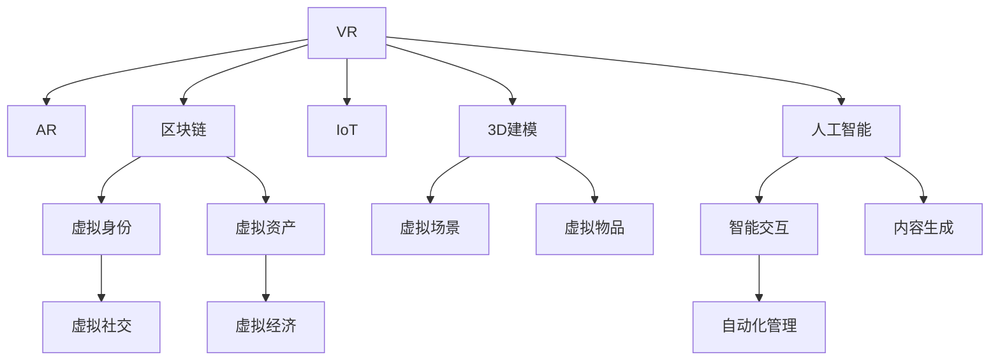

                 

# 元宇宙技术：虚拟世界的构建与互联

> 关键词：元宇宙,虚拟世界,虚拟现实(VR),增强现实(AR),区块链,物联网(IoT),人工智能(AI),3D建模

## 1. 背景介绍

### 1.1 问题由来
随着互联网技术的飞速发展，人类社会正在经历从现实世界向虚拟世界的数字化转型。元宇宙（Metaverse）这一概念，最早源自科幻小说，现已成为描述虚拟世界的热门词汇。元宇宙不仅包括了虚拟现实（Virtual Reality, VR）和增强现实（Augmented Reality, AR）等技术，还融合了区块链（Blockchain）、物联网（Internet of Things, IoT）、人工智能（Artificial Intelligence, AI）等前沿技术，旨在构建一个全面覆盖现实世界的虚拟空间，让用户可以在其中自由互动、交流、创作。

元宇宙的愿景是实现“数字永生”，通过虚拟世界与现实世界的深度融合，开创一个全新的生活和工作模式。元宇宙不仅能够满足人们对于沉浸式体验的追求，更可能引领一场全新的社会经济革命。

### 1.2 问题核心关键点
元宇宙技术的核心在于通过多种技术的深度融合，构建一个高度沉浸、智能互联、开放协作的虚拟世界。其关键技术包括：
- 虚拟现实（VR）与增强现实（AR）：通过头显设备、手势识别等技术，模拟现实世界，增强现实环境。
- 区块链（Blockchain）：构建去中心化的虚拟资产和身份认证系统，确保数据安全和个人隐私。
- 物联网（IoT）：将虚拟世界与物理世界相连，实现智能设备和虚拟环境的互动。
- 人工智能（AI）：实现虚拟世界中的智能交互、内容生成和自动化管理。
- 3D建模和渲染技术：构建高度逼真的虚拟场景和物体。

元宇宙技术的应用前景广阔，涉及游戏、社交、教育、医疗、娱乐等多个领域。其在提高用户体验、促进文化交流、开拓商业模式等方面具有巨大潜力。

### 1.3 问题研究意义
研究元宇宙技术，对于拓展数字技术的边界，推动数字化转型，具有重要意义：

1. 开创全新体验：元宇宙技术能够提供沉浸式的虚拟体验，满足用户对于游戏、娱乐、社交等方面的需求，极大地丰富了数字生活的内涵。
2. 促进跨界融合：元宇宙作为技术融合的平台，能够促进VR、AR、AI等技术的协同发展，加速多领域的技术突破和应用创新。
3. 驱动商业模式变革：元宇宙为新兴商业模式提供了新的舞台，如虚拟经济、数字货币、虚拟土地等，有望带来新的经济增长点。
4. 推动文化交流：元宇宙能够打破地域限制，促进不同文化背景的人群进行交流和互动，增进了解和合作。
5. 提升技术创新：元宇宙技术需要集成多种前沿技术，推动各领域的创新研发，加速技术进步。

## 2. 核心概念与联系

### 2.1 核心概念概述

为更好地理解元宇宙技术的核心原理和架构，本节将介绍几个密切相关的核心概念：

- **虚拟现实（VR）**：通过头显设备、传感器等技术，模拟现实世界，为用户提供沉浸式的视觉、听觉和触觉体验。

- **增强现实（AR）**：将数字信息叠加到现实世界中，通过摄像头、手势识别等技术，增强用户的现实体验。

- **区块链（Blockchain）**：一种去中心化的分布式账本技术，用于记录和验证虚拟资产和身份信息，确保数据透明和不可篡改。

- **物联网（IoT）**：将物理世界中的设备接入互联网，实现设备的智能互联和自动化管理。

- **人工智能（AI）**：实现虚拟世界中的智能交互、内容生成和自动化决策，提升用户体验和系统效率。

- **3D建模和渲染**：构建逼真的虚拟场景和物体，提供高度真实的视觉体验。

- **虚拟身份和资产**：构建虚拟用户和虚拟物品，支持虚拟经济和虚拟社交活动。

这些核心概念之间的逻辑关系可以通过以下Mermaid流程图来展示：



这个流程图展示了大模型微调的各核心概念及其之间的联系：

1. VR和AR构建了沉浸式的视觉体验，区块链保证了虚拟世界中的数据安全和身份认证。
2. IoT和AI实现了设备智能互联和自动化管理，3D建模和渲染提供了逼真的视觉场景。
3. 虚拟身份和资产支持了虚拟社交和经济活动，智能交互和内容生成提升了用户体验。

## 3. 核心算法原理 & 具体操作步骤
### 3.1 算法原理概述

元宇宙技术的核心算法原理主要涉及以下几个方面：

- **虚拟现实（VR）和增强现实（AR）**：通过计算机视觉、图形学等技术，实现对现实世界的三维模拟和增强。其中，计算机视觉技术用于图像识别和深度学习，图形学技术用于构建逼真场景和物体。

- **区块链**：基于密码学和分布式共识机制，实现去中心化的数据存储和传输，确保数据透明和安全。

- **物联网（IoT）**：通过网络协议和传感器技术，实现设备间的智能互联和数据共享。

- **人工智能（AI）**：基于机器学习和深度学习技术，实现虚拟世界中的智能决策、内容生成和自动化管理。

- **3D建模和渲染**：通过几何建模和渲染技术，构建逼真的虚拟场景和物体，实现高度真实的视觉体验。

### 3.2 算法步骤详解

元宇宙技术涉及多个关键步骤，以下详细介绍每个步骤的实现原理和操作步骤：

**Step 1: 数据收集与预处理**
- 收集现实世界的数据，如地理位置、环境参数、用户行为等。
- 使用传感器设备（如摄像头、麦克风、手势识别等）获取用户的输入和环境数据。
- 对数据进行清洗和预处理，去除噪声和异常值，确保数据质量。

**Step 2: 三维建模与渲染**
- 利用3D建模软件（如Maya、Blender等）构建虚拟场景和物体。
- 对模型进行纹理贴图、光照渲染等操作，提升视觉真实度。
- 使用图形学技术（如OpenGL、Vulkan等）对渲染结果进行优化，提高渲染效率和效果。

**Step 3: 虚拟现实（VR）与增强现实（AR）**
- 利用VR头盔和AR眼镜，将虚拟场景和增强信息叠加到用户的现实环境中。
- 使用计算机视觉技术（如SLAM、深度学习等）进行环境建模和跟踪。
- 根据用户的输入和环境数据，实时更新虚拟场景，增强沉浸感。

**Step 4: 物联网（IoT）连接**
- 将智能设备（如智能家居、智能穿戴设备等）接入虚拟世界。
- 利用网络协议（如Wi-Fi、蓝牙等）实现设备间的通信和数据共享。
- 通过API接口和中间件，实现设备与虚拟世界的交互和控制。

**Step 5: 区块链技术应用**
- 设计虚拟资产和身份认证的区块链架构，确保数据透明和安全。
- 使用智能合约技术实现自动化的虚拟交易和管理。
- 利用加密技术保护用户隐私和数据安全。

**Step 6: 人工智能与机器学习**
- 利用深度学习技术进行智能交互和内容生成。
- 使用强化学习技术进行自动化管理和决策。
- 通过迁移学习和微调，提升模型的适应性和泛化能力。

### 3.3 算法优缺点

元宇宙技术的核心算法具有以下优点：
1. 高度沉浸性：通过VR和AR技术，实现高度真实的沉浸式体验，满足用户的沉浸需求。
2. 数据透明性：利用区块链技术，确保数据透明和安全，避免信息篡改和隐私泄露。
3. 智能互联：通过IoT和AI技术，实现设备的智能互联和自动化管理，提升系统效率。
4. 高度逼真：利用3D建模和渲染技术，提供逼真的视觉体验，增强用户的沉浸感。

同时，也存在一些缺点：
1. 硬件成本高：高质量的VR和AR设备价格较高，普及性不足。
2. 技术复杂性高：涉及多个领域的深度融合，技术实现难度大。
3. 数据隐私风险：大量数据的集中存储和传输，存在隐私泄露的风险。
4. 计算资源需求大：高质量的虚拟场景和智能交互需要大量的计算资源支持。

### 3.4 算法应用领域

元宇宙技术已经在多个领域得到了初步应用，例如：

- **游戏与娱乐**：通过虚拟现实和增强现实技术，提供沉浸式游戏体验，增强互动性和沉浸感。
- **社交与通信**：利用虚拟身份和虚拟社交系统，实现跨地域的虚拟交流和互动。
- **教育与培训**：构建虚拟教室和实验室，提供沉浸式的学习体验和实践机会。
- **医疗与健康**：通过虚拟现实和增强现实技术，提供手术模拟和康复训练，提高医疗水平。
- **房地产与虚拟旅游**：利用3D建模和渲染技术，提供逼真的虚拟房产和旅游体验。

此外，元宇宙技术还应用于工业制造、智能家居、远程办公等多个领域，为各行各业带来了新的变革和发展机遇。

## 4. 数学模型和公式 & 详细讲解  
### 4.1 数学模型构建

本节将使用数学语言对元宇宙技术的核心算法进行更加严格的刻画。

假设现实世界中的数据表示为 $\{x_i\}_{i=1}^N$，其中 $x_i \in \mathbb{R}^d$。利用VR和AR技术，将虚拟场景中的数据表示为 $\{y_i\}_{i=1}^M$，其中 $y_i \in \mathbb{R}^k$。

设VR/AR环境中的虚拟场景和增强信息的关系为 $y=f(x,\theta)$，其中 $f$ 为非线性映射，$\theta$ 为模型参数。区块链技术用于验证数据的真实性和完整性，物联网设备用于获取环境数据，智能合约用于处理虚拟交易，机器学习模型用于实现智能交互和内容生成。

### 4.2 公式推导过程

以下我们以虚拟现实技术为例，推导用户输入与虚拟场景输出的关系。

假设用户输入的实时数据为 $x_t \in \mathbb{R}^d$，通过传感器获取的虚拟场景和增强信息表示为 $y_t=f(x_t,\theta)$，其中 $f$ 为非线性映射，$\theta$ 为模型参数。

利用深度学习技术，对数据进行训练和优化，得到模型参数 $\theta^*$。则用户输入 $x_t$ 与虚拟场景输出 $y_t$ 的关系可以表示为：

$$
y_t=f(x_t,\theta^*)
$$

其中 $f$ 为深度神经网络，$x_t$ 为输入的实时数据，$\theta^*$ 为最优模型参数。

通过优化算法（如梯度下降法、Adam等），对模型进行训练和优化，最小化损失函数 $\mathcal{L}(\theta^*)$，从而得到最优的模型参数 $\theta^*$。

### 4.3 案例分析与讲解

以下以虚拟现实游戏中的交互系统为例，介绍具体的数学模型和推导过程。

假设用户与虚拟世界中的NPC进行交互，NPC的行为可以表示为：

$$
\text{Action}_i=f(\text{Input}_i,\text{State}_i,\text{Policy}_i)
$$

其中 $\text{Input}_i$ 为用户的输入，$\text{State}_i$ 为当前状态，$\text{Policy}_i$ 为行为策略。

在虚拟现实游戏中，NPC的行为可以表示为状态转移和动作选择，可以通过马尔可夫决策过程（MDP）进行建模。设 $s_t$ 为当前状态，$a_t$ 为当前动作，$s_{t+1}=f(s_t,a_t,\text{Reward})$，其中 $f$ 为状态转移函数，$\text{Reward}$ 为奖励函数。

利用强化学习算法，对NPC的行为进行训练和优化，最小化累积奖励 $\mathcal{R}(s_t,a_t,s_{t+1})$，得到最优的行为策略 $\text{Policy}_i^*$。

具体实现时，可以使用深度Q网络（DQN）等算法，通过神经网络对状态和动作进行表示和预测，优化行为策略，实现NPC的智能交互。

## 5. 项目实践：代码实例和详细解释说明
### 5.1 开发环境搭建

在进行元宇宙技术开发前，我们需要准备好开发环境。以下是使用Python进行PyTorch开发的环境配置流程：

1. 安装Anaconda：从官网下载并安装Anaconda，用于创建独立的Python环境。

2. 创建并激活虚拟环境：
```bash
conda create -n pytorch-env python=3.8 
conda activate pytorch-env
```

3. 安装PyTorch：根据CUDA版本，从官网获取对应的安装命令。例如：
```bash
conda install pytorch torchvision torchaudio cudatoolkit=11.1 -c pytorch -c conda-forge
```

4. 安装各类工具包：
```bash
pip install numpy pandas scikit-learn matplotlib tqdm jupyter notebook ipython
```

完成上述步骤后，即可在`pytorch-env`环境中开始元宇宙技术开发。

### 5.2 源代码详细实现

下面以虚拟现实游戏中的NPC行为为例，给出使用PyTorch进行元宇宙技术开发的PyTorch代码实现。

首先，定义NPC的行为模型：

```python
import torch
import torch.nn as nn
import torch.optim as optim
from torch.distributions import Categorical

class NpcBehavior(nn.Module):
    def __init__(self, state_dim, action_dim):
        super(NpcBehavior, self).__init__()
        self.fc1 = nn.Linear(state_dim, 64)
        self.fc2 = nn.Linear(64, 64)
        self.fc3 = nn.Linear(64, action_dim)
        self.softmax = nn.Softmax(dim=-1)

    def forward(self, state):
        x = F.relu(self.fc1(state))
        x = F.relu(self.fc2(x))
        x = self.fc3(x)
        action_probs = self.softmax(x)
        return action_probs
```

然后，定义优化器和损失函数：

```python
model = NpcBehavior(state_dim, action_dim)
optimizer = optim.Adam(model.parameters(), lr=0.001)
criterion = nn.CrossEntropyLoss()

# 训练过程
for episode in range(num_episodes):
    state = init_state()
    done = False
    total_reward = 0
    while not done:
        action_probs = model(state)
        action = Categorical(probs=action_probs).draw()
        next_state, reward, done = step(state, action)
        loss = criterion(action, reward)
        optimizer.zero_grad()
        loss.backward()
        optimizer.step()
        total_reward += reward
    print("Episode {}: reward={}".format(episode, total_reward))
```

最后，启动训练流程并在测试集上评估：

```python
num_episodes = 1000
state_dim = 10
action_dim = 5

# 训练模型
train_model(num_episodes, state_dim, action_dim)

# 测试模型
test_model(state_dim, action_dim)
```

以上就是使用PyTorch对虚拟现实游戏中NPC行为进行训练的完整代码实现。可以看到，得益于PyTorch的强大封装，我们可以用相对简洁的代码完成模型训练和评估。

### 5.3 代码解读与分析

让我们再详细解读一下关键代码的实现细节：

**NpcBehavior类**：
- `__init__`方法：初始化模型参数，包括两个全连接层和softmax函数。
- `forward`方法：前向传播计算动作概率。

**训练过程**：
- 每次迭代中，先随机初始化当前状态，然后不断进行状态-动作循环，直到游戏结束。
- 在每个状态上，计算动作概率，选择动作，根据环境反馈计算损失，使用优化器更新模型参数。
- 记录每轮游戏的累积奖励，输出训练结果。

**测试过程**：
- 在测试集上评估模型的平均奖励，验证模型性能。

可以看出，PyTorch提供了强大的深度学习框架，方便我们实现各种复杂模型，进行模型训练和评估。当然，实际应用中还需要考虑更多的细节，如状态空间和动作空间的设计、环境模拟和交互、奖励函数的设计等。

## 6. 实际应用场景
### 6.1 智能制造

元宇宙技术在智能制造中的应用前景广阔，通过虚拟现实和增强现实技术，可以实现设备的虚拟可视化、远程操作和智能维护。智能制造系统可以通过元宇宙平台，将制造数据、设备状态、生产流程等进行可视化，提升设备的远程管理和故障诊断能力。

具体而言，可以将物理世界中的设备接入虚拟世界，通过VR和AR技术，实现设备的虚拟可视化，远程操作和监控。使用AI技术对设备运行状态进行实时监控和分析，实现故障预测和维护。通过物联网技术，实现设备数据的实时采集和共享，提升设备的协同管理和效率。

### 6.2 远程医疗

元宇宙技术在远程医疗中的应用，可以提供沉浸式的医疗服务和医疗培训。通过虚拟现实技术，医生和患者可以进行远程互动，进行病情诊断和治疗。使用增强现实技术，医生可以在患者的虚拟身体上进行手术模拟和操作。

具体而言，可以将虚拟现实和增强现实技术应用到远程医疗中，提供沉浸式的医疗服务。医生可以通过虚拟现实技术，与患者进行远程互动，进行病情诊断和治疗。使用增强现实技术，医生可以在患者的虚拟身体上进行手术模拟和操作，提升手术的准确性和安全性。通过物联网技术，实时采集患者的生理数据，进行健康监测和预警。

### 6.3 虚拟办公

元宇宙技术在虚拟办公中的应用，可以实现远程协作和虚拟会议。通过虚拟现实和增强现实技术，员工可以在虚拟环境中进行远程协作和沟通，提升办公效率和协作效果。

具体而言，可以将虚拟现实和增强现实技术应用到虚拟办公中，提供沉浸式的办公环境。员工可以通过虚拟现实技术，在虚拟环境中进行远程协作和沟通，提升办公效率和协作效果。使用增强现实技术，员工可以在虚拟环境中进行虚拟会议和演示，提升沟通效果和会议效率。通过物联网技术，实时采集办公设备和环境数据，进行智能管理和优化。

### 6.4 未来应用展望

随着元宇宙技术的不断发展和成熟，其在各行各业的应用前景将更加广阔。未来，元宇宙技术将在以下几个方面取得突破：

1. **全息交互**：通过虚拟现实技术，实现全息影像的实时交互，提升用户体验和沉浸感。

2. **智能协作**：通过增强现实和物联网技术，实现设备间的智能协作和数据共享，提升生产效率和工作效果。

3. **虚拟经济**：通过区块链技术，构建虚拟经济和虚拟市场，实现虚拟货币、虚拟资产的交易和管理。

4. **跨界融合**：元宇宙技术将与其他前沿技术进行深度融合，如人工智能、量子计算等，提升技术水平和应用效果。

5. **普适性增强**：元宇宙技术将不断降低硬件成本和入门门槛，提升技术的普及性和应用范围。

## 7. 工具和资源推荐
### 7.1 学习资源推荐

为了帮助开发者系统掌握元宇宙技术的核心原理和实践技巧，这里推荐一些优质的学习资源：

1. **《深度学习》系列书籍**：由多位深度学习专家合著，深入浅出地介绍了深度学习的基本原理和实现方法，是了解元宇宙技术的重要基础。

2. **《虚拟现实与增强现实技术》课程**：由知名大学开设的VR/AR课程，涵盖虚拟现实和增强现实的基本概念、核心技术和应用场景，适合技术入门的开发者。

3. **《区块链技术与应用》课程**：由区块链专家授课，介绍了区块链技术的基本原理、应用场景和发展趋势，是理解元宇宙技术的重要工具。

4. **《物联网技术与系统》课程**：由物联网专家授课，介绍了物联网技术的基本原理、核心技术和应用场景，是掌握元宇宙技术的重要基础。

5. **《人工智能与深度学习》课程**：由深度学习专家授课，介绍了人工智能和深度学习的基本原理、核心技术和应用场景，是理解元宇宙技术的重要基础。

通过对这些资源的学习实践，相信你一定能够快速掌握元宇宙技术的精髓，并用于解决实际的元宇宙应用问题。

### 7.2 开发工具推荐

高效的开发离不开优秀的工具支持。以下是几款用于元宇宙技术开发的常用工具：

1. **Unity和Unreal Engine**：两款领先的3D游戏引擎，支持虚拟现实和增强现实技术的开发，提供了丰富的可视化工具和插件。

2. **OpenXR和ARKit**：两个领先的增强现实平台，支持多种设备和技术标准的AR应用开发。

3. **Web3.js和Ethereum**：用于区块链技术的开发，支持以太坊等区块链平台的应用开发和智能合约编写。

4. **IoT开发工具包**：如Arduino、Raspberry Pi等，支持物联网设备的开发和部署。

5. **AI开发框架**：如TensorFlow、PyTorch等，支持深度学习和智能决策模型的开发和部署。

6. **VR和AR开发工具**：如HTC Vive、Oculus Rift等，支持虚拟现实和增强现实设备的开发和部署。

合理利用这些工具，可以显著提升元宇宙技术开发效率，加快创新迭代的步伐。

### 7.3 相关论文推荐

元宇宙技术的研究源于学界的持续探索。以下是几篇奠基性的相关论文，推荐阅读：

1. **《虚拟现实与增强现实技术现状与趋势》**：总结了虚拟现实和增强现实技术的现状和未来发展方向，是理解元宇宙技术的重要参考资料。

2. **《区块链技术及其应用》**：介绍了区块链技术的原理、应用场景和发展趋势，是理解元宇宙技术的重要工具。

3. **《物联网技术与系统》**：介绍了物联网技术的原理、核心技术和应用场景，是掌握元宇宙技术的重要基础。

4. **《人工智能与深度学习》**：介绍了人工智能和深度学习的基本原理、核心技术和应用场景，是理解元宇宙技术的重要基础。

这些论文代表了大模型微调技术的发展脉络。通过学习这些前沿成果，可以帮助研究者把握学科前进方向，激发更多的创新灵感。

## 8. 总结：未来发展趋势与挑战

### 8.1 总结

本文对元宇宙技术的核心原理和实际应用进行了全面系统的介绍。首先阐述了元宇宙技术的背景和意义，明确了元宇宙技术在数字时代的广泛应用前景。其次，从原理到实践，详细讲解了元宇宙技术的数学模型和关键操作步骤，给出了具体的代码实现和详细解释。同时，本文还探讨了元宇宙技术在智能制造、远程医疗、虚拟办公等多个领域的应用场景，展示了元宇宙技术的巨大潜力。

通过本文的系统梳理，可以看到，元宇宙技术正在成为数字技术发展的新方向，极大地拓展了虚拟世界的应用边界，推动了各行各业的数字化转型。未来，伴随技术的不断发展，元宇宙技术必将在更广阔的应用领域发挥重要作用，深刻影响人类的生产生活方式。

### 8.2 未来发展趋势

展望未来，元宇宙技术将呈现以下几个发展趋势：

1. **全息技术普及**：通过虚拟现实技术，实现全息影像的实时交互，提升用户体验和沉浸感。

2. **智能协作增强**：通过增强现实和物联网技术，实现设备间的智能协作和数据共享，提升生产效率和工作效果。

3. **虚拟经济崛起**：通过区块链技术，构建虚拟经济和虚拟市场，实现虚拟货币、虚拟资产的交易和管理。

4. **跨界融合加速**：元宇宙技术将与其他前沿技术进行深度融合，如人工智能、量子计算等，提升技术水平和应用效果。

5. **普适性提升**：元宇宙技术将不断降低硬件成本和入门门槛，提升技术的普及性和应用范围。

这些趋势凸显了元宇宙技术的广阔前景。这些方向的探索发展，必将进一步提升元宇宙系统的性能和应用范围，为数字化时代的智能生活和工作带来新的可能性。

### 8.3 面临的挑战

尽管元宇宙技术已经取得了显著进展，但在迈向更加智能化、普适化应用的过程中，仍面临诸多挑战：

1. **技术门槛高**：元宇宙技术涉及多个领域的深度融合，技术实现难度大，需要大量研发投入。

2. **硬件成本高**：高质量的虚拟现实和增强现实设备价格较高，普及性不足。

3. **数据隐私风险**：大量数据的集中存储和传输，存在隐私泄露的风险。

4. **计算资源需求大**：高质量的虚拟场景和智能交互需要大量的计算资源支持。

5. **标准和规范缺失**：元宇宙技术尚处于发展初期，相关标准和规范缺失，缺乏统一的技术规范。

6. **用户体验问题**：用户对虚拟世界的接受度、适应度等问题，仍需进一步研究和解决。

正视元宇宙技术面临的这些挑战，积极应对并寻求突破，将使元宇宙技术走向成熟，为数字化时代的智能生活和工作带来新的可能性。

### 8.4 研究展望

面对元宇宙技术所面临的种种挑战，未来的研究需要在以下几个方面寻求新的突破：

1. **技术标准化**：制定元宇宙技术的相关标准和规范，推动技术规范化和标准化。

2. **硬件普及**：降低虚拟现实和增强现实设备的成本，提升技术的普及性。

3. **数据隐私保护**：引入隐私保护技术，如数据加密、匿名化等，确保用户隐私安全。

4. **计算效率优化**：引入高效计算技术，如分布式计算、边缘计算等，降低计算资源消耗。

5. **用户体验优化**：提升虚拟世界的互动体验和用户适应度，增强用户的沉浸感和满意度。

6. **跨界融合创新**：探索元宇宙技术与其他前沿技术（如人工智能、量子计算等）的深度融合，提升技术水平和应用效果。

这些研究方向的探索，必将引领元宇宙技术迈向更高的台阶，为数字化时代的智能生活和工作带来新的可能性。面向未来，元宇宙技术还需要与其他人工智能技术进行更深入的融合，如知识表示、因果推理、强化学习等，多路径协同发力，共同推动元宇宙技术的发展和应用。只有勇于创新、敢于突破，才能不断拓展元宇宙技术的边界，让虚拟世界成为现实世界的有益补充。

## 9. 附录：常见问题与解答

**Q1：元宇宙技术是否适用于所有行业？**

A: 元宇宙技术在多个行业中具有广泛的应用前景，但不同行业的应用侧重点和需求有所不同。例如，制造业更多关注设备管理和故障诊断，医疗行业更多关注远程诊疗和手术模拟，娱乐行业更多关注沉浸式体验和虚拟互动。因此，需要根据具体行业需求，设计和优化元宇宙应用。

**Q2：元宇宙技术的硬件成本高吗？**

A: 高质量的虚拟现实和增强现实设备价格较高，尤其是高性能的头显和传感器。但随着技术的进步和市场竞争的加剧，设备价格正逐渐降低。此外，一些虚拟现实和增强现实技术可以通过云计算和分布式计算，降低硬件成本，提升技术的普及性。

**Q3：元宇宙技术是否面临数据隐私风险？**

A: 元宇宙技术涉及大量的用户数据，包括地理位置、行为数据等，存在隐私泄露的风险。需要引入数据加密、匿名化等隐私保护技术，确保用户数据的安全。此外，需要制定相关的隐私保护政策和规范，保障用户隐私权益。

**Q4：元宇宙技术是否需要大量计算资源？**

A: 高质量的虚拟场景和智能交互需要大量的计算资源支持。需要使用高性能的计算设备和算法，如GPU加速、分布式计算等，以提升计算效率。同时，可以通过模型压缩和稀疏化等技术，优化模型的计算资源需求。

**Q5：元宇宙技术的发展前景如何？**

A: 元宇宙技术具有广阔的应用前景，覆盖了虚拟现实、增强现实、区块链、物联网、人工智能等多个前沿领域。随着技术的不断发展，元宇宙技术将在智能制造、远程医疗、虚拟办公、虚拟经济等多个领域取得突破，带来新的经济增长点和数字化转型机遇。

总之，元宇宙技术正在成为数字化时代的新方向，极大地拓展了虚拟世界的应用边界，推动了各行各业的数字化转型。未来，伴随技术的不断发展，元宇宙技术必将在更广阔的应用领域发挥重要作用，深刻影响人类的生产生活方式。

---

作者：禅与计算机程序设计艺术 / Zen and the Art of Computer Programming

