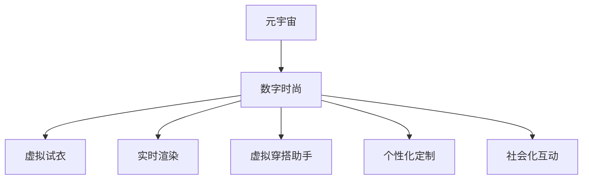

                 

# 元宇宙时尚设计:数字化穿搭的创意爆发

> 关键词：
  - 元宇宙
  - 数字时尚
  - 虚拟试衣
  - 实时渲染
  - 虚拟穿搭助手
  - 个性化定制
  - 社会化互动

## 1. 背景介绍

### 1.1 问题由来

随着数字技术的发展，元宇宙正在成为新的社交和工作平台。与此同时，时尚设计行业也正在经历深刻的变革。传统的物理店铺、静态展示方式逐渐被数字化所取代，消费者期待通过数字化手段实现个性化、互动化的购物体验。元宇宙时尚设计应运而生，它结合了3D建模、虚拟试衣、实时渲染等技术，让用户在虚拟世界中享受到穿搭的乐趣和自由。

### 1.2 问题核心关键点

元宇宙时尚设计具有以下核心关键点：

1. **虚拟试衣**：让用户在虚拟环境中试穿服装，无需实际购买即可体验穿搭效果。
2. **实时渲染**：通过高精度渲染引擎，实现服装在虚拟环境中的真实感展示。
3. **个性化定制**：根据用户输入的尺寸、风格偏好等参数，自动生成个性化的穿搭方案。
4. **社会化互动**：允许用户在虚拟环境中进行社交互动，展示穿搭效果，获取他人评价。
5. **高效协同设计**：设计师与用户之间可以进行实时交流，共同修改和完善设计。

这些关键点使得元宇宙时尚设计在用户需求和应用场景上具有很强的吸引力。

### 1.3 问题研究意义

元宇宙时尚设计不仅满足了消费者个性化、互动化的需求，还推动了时尚行业的数字化转型。通过技术创新，实现服装设计和销售方式的革新，有望在虚拟经济中占据重要地位。

## 2. 核心概念与联系

### 2.1 核心概念概述

为更好地理解元宇宙时尚设计，本节将介绍几个密切相关的核心概念：

- **元宇宙**：一个由数字技术和虚拟环境构成的虚拟世界，用户可以通过设备（如VR、AR眼镜）或计算机浏览器进行交互。
- **数字时尚**：利用数字技术设计和销售服装，包括虚拟试衣、个性化定制等。
- **虚拟试衣**：在虚拟环境中试穿服装，提升购物体验和满意度。
- **实时渲染**：通过高性能计算，实现服装在虚拟环境中的动态展示。
- **虚拟穿搭助手**：基于AI技术，为用户提供穿搭建议和修改意见。
- **个性化定制**：根据用户数据生成个性化穿搭方案，满足个性化需求。
- **社会化互动**：用户之间可以进行社交互动，展示和评价穿搭效果。

这些概念之间的逻辑关系可以通过以下Mermaid流程图来展示：



这个流程图展示元宇宙时尚设计的核心概念及其之间的关系：

1. 元宇宙作为虚拟平台，是数字时尚的基础。
2. 虚拟试衣、实时渲染、虚拟穿搭助手等技术，提升数字时尚的用户体验。
3. 个性化定制和社会化互动，增强用户的参与感和满意度。

这些概念共同构成了元宇宙时尚设计的技术框架，为其创新应用提供了坚实基础。

## 3. 核心算法原理 & 具体操作步骤
### 3.1 算法原理概述

元宇宙时尚设计的核心算法主要集中在以下几个方面：

- **虚拟试衣算法**：通过3D人体模型和服装模型，实现用户和服装的精确对齐和试穿效果展示。
- **实时渲染算法**：利用高精度渲染引擎，实时计算和显示服装在虚拟环境中的视觉效果。
- **个性化定制算法**：根据用户输入的参数，自动生成个性化穿搭方案。
- **社会化互动算法**：实现用户之间的实时社交互动，展示和评价穿搭效果。

这些算法原理和技术手段，使得元宇宙时尚设计成为可能，并在多个应用场景中取得良好效果。

### 3.2 算法步骤详解

以虚拟试衣为例，介绍元宇宙时尚设计的核心算法步骤：

**Step 1: 准备数据集**
- 收集用户人体模型和服装模型，进行预处理和存储。
- 准备虚拟试衣所需的背景场景和环境数据。

**Step 2: 初始化模型**
- 加载人体模型和服装模型，并进行对齐处理。
- 初始化试衣效果展示的渲染引擎和计算环境。

**Step 3: 用户交互**
- 用户选择服装，并进行试穿操作。
- 系统实时计算服装在用户身上的效果，并进行渲染展示。
- 用户可以查看试穿效果，并进行调整。

**Step 4: 反馈与优化**
- 根据用户的反馈，系统优化试穿效果和服装参数。
- 重复步骤3，直至用户满意为止。

**Step 5: 输出试衣结果**
- 生成试穿效果截图或视频，供用户保存或分享。
- 保存试穿数据，用于分析用户偏好和行为。

### 3.3 算法优缺点

元宇宙时尚设计的主要优点包括：

- **用户体验提升**：虚拟试衣、实时渲染等技术，极大提升了用户的购物体验。
- **个性化定制**：根据用户输入的数据，自动生成个性化穿搭方案。
- **社会化互动**：增强用户之间的社交互动，提升社区粘性。

但同时也存在一些局限性：

- **技术门槛高**：需要高性能计算和渲染引擎的支持，设备要求高。
- **数据隐私问题**：用户输入的数据可能包含隐私信息，需要严格保护。
- **社交互动复杂性**：多人互动时的场景管理、数据同步等复杂性较高。
- **个性化定制限制**：个性化定制可能存在算法限制，无法满足所有需求。

### 3.4 算法应用领域

元宇宙时尚设计已经在多个领域得到应用，包括：

- **虚拟购物平台**：用户可以在虚拟环境中浏览、试穿服装，提升购物体验。
- **时尚设计展示**：设计师可以在虚拟环境中展示设计成果，获取反馈。
- **虚拟试衣间**：用户在实体店中设置虚拟试衣间，体验服装效果。
- **社交应用**：用户可以在社交应用中展示穿搭效果，获取评价和建议。
- **教育培训**：设计师和用户可以进行实时交流，共同修改和完善设计。

除了上述这些典型应用外，元宇宙时尚设计还被创新性地应用到更多场景中，如虚拟时装秀、虚拟展会、虚拟娱乐等，为时尚设计和展示带来新的可能性。

## 4. 数学模型和公式 & 详细讲解 & 举例说明
### 4.1 数学模型构建

元宇宙时尚设计的数学模型主要涉及三维建模、实时渲染和个性化定制等技术。以下介绍几个核心模型：

- **人体模型**：描述人体的三维结构，包括各部位的比例和位置。
- **服装模型**：描述服装的三维结构，包括各部位的形态和材质。
- **虚拟试衣**：基于人体模型和服装模型，实现用户和服装的对齐和试穿效果展示。
- **实时渲染**：利用光线追踪等技术，实现服装在虚拟环境中的动态展示。
- **个性化定制**：根据用户输入的参数，生成个性化穿搭方案。

### 4.2 公式推导过程

以虚拟试衣为例，介绍其数学模型和推导过程。

**人体模型表示**：
假设人体模型由若干个顶点、边和面组成，其顶点坐标为 $V=\{v_i\}_{i=1}^N$，每个顶点有一个法向量 $n_i$。

**服装模型表示**：
假设服装模型由若干个顶点、边和面组成，其顶点坐标为 $V_c=\{v_{ci}\}_{i=1}^{N_c}$，每个顶点有一个法向量 $n_{ci}$。

**对齐关系**：
假设用户选择的服装模型为 $V_c$，需要与人体模型 $V$ 对齐，设对齐后的服装顶点坐标为 $V'_c=\{v'_{ci}\}_{i=1}^{N_c}$。对齐过程可以表示为：

$$
v'_{ci} = \mathcal{A}(v_{ci}, v_i, n_{ci}, n_i)
$$

其中 $\mathcal{A}$ 为对齐函数，需要根据人体模型的法向量和服装模型的法向量，以及用户选择的对齐方式，计算出对齐后的顶点坐标。

**试衣效果展示**：
在对齐后的服装模型上，进行实时渲染，计算出每个顶点在虚拟环境中的位置和颜色，生成试衣效果。设渲染后的顶点坐标为 $V''_c=\{v''_{ci}\}_{i=1}^{N_c}$，渲染效果表示为 $E$。

**算法步骤**：
1. 加载人体模型 $V$ 和服装模型 $V_c$。
2. 对齐函数 $\mathcal{A}$ 计算对齐后的服装顶点坐标 $V'_c$。
3. 实时渲染引擎计算 $V''_c$ 和渲染效果 $E$。
4. 用户选择服装后，进行对齐和渲染，输出试衣效果 $E$。

### 4.3 案例分析与讲解

以虚拟穿搭助手为例，介绍其数学模型和推导过程。

**用户输入参数**：
假设用户输入的参数包括身高、体重、体型、风格偏好等，表示为 $\mathcal{P}=\{p_i\}_{i=1}^{N_p}$。

**个性化穿搭方案**：
基于用户输入的参数，生成个性化穿搭方案，表示为 $\mathcal{S}=\{s_j\}_{j=1}^{N_s}$。

**算法步骤**：
1. 加载用户输入参数 $\mathcal{P}$。
2. 穿搭生成算法 $\mathcal{G}$ 根据 $\mathcal{P}$ 生成穿搭方案 $\mathcal{S}$。
3. 用户查看穿搭方案 $\mathcal{S}$，选择感兴趣的穿搭。
4. 生成试穿效果 $E_s$，供用户保存或分享。

**公式推导**：
假设穿搭生成算法 $\mathcal{G}$ 由以下几个步骤组成：

1. 根据用户身高、体重计算适合的服装尺寸 $D_s$。
2. 根据用户体型、风格偏好推荐适合的服装风格 $S_s$。
3. 根据用户历史购买记录和社交网络数据，推荐适合的服装款式 $K_s$。

设 $\mathcal{G}$ 的输出为 $\mathcal{S}$，可以表示为：

$$
\mathcal{S} = \mathcal{G}(\mathcal{P}, D_s, S_s, K_s)
$$

其中 $D_s$、$S_s$、$K_s$ 分别表示服装尺寸、风格、款式等。

**算法步骤**：
1. 加载用户输入参数 $\mathcal{P}$。
2. 计算服装尺寸 $D_s$。
3. 推荐服装风格 $S_s$ 和款式 $K_s$。
4. 穿搭生成算法 $\mathcal{G}$ 生成穿搭方案 $\mathcal{S}$。
5. 用户查看穿搭方案 $\mathcal{S}$，选择感兴趣的穿搭。
6. 生成试穿效果 $E_s$，供用户保存或分享。

## 5. 项目实践：代码实例和详细解释说明
### 5.1 开发环境搭建

在进行元宇宙时尚设计开发前，我们需要准备好开发环境。以下是使用Python进行开发的环境配置流程：

1. 安装Anaconda：从官网下载并安装Anaconda，用于创建独立的Python环境。

2. 创建并激活虚拟环境：
```bash
conda create -n fashionshop python=3.8 
conda activate fashionshop
```

3. 安装Python库：
```bash
pip install numpy pandas matplotlib scikit-learn torch torchvision transformers
```

4. 安装相关依赖：
```bash
pip install pythreemltracer ray
```

完成上述步骤后，即可在`fashionshop`环境中开始元宇宙时尚设计的开发实践。

### 5.2 源代码详细实现

以下以虚拟试衣为例，给出使用PyTorch进行虚拟试衣开发的PyTorch代码实现。

首先，定义虚拟试衣的类：

```python
from torch.utils.data import DataLoader
from torchvision.transforms import ToTensor

class VirtualTrial:
    def __init__(self, model, optimizer, device):
        self.model = model
        self.optimizer = optimizer
        self.device = device
        self.criterion = torch.nn.CrossEntropyLoss()

    def train(self, dataloader, epochs=10):
        self.model.train()
        for epoch in range(epochs):
            for batch in dataloader:
                inputs, labels = batch['inputs'].to(self.device), batch['labels'].to(self.device)
                self.optimizer.zero_grad()
                outputs = self.model(inputs)
                loss = self.criterion(outputs, labels)
                loss.backward()
                self.optimizer.step()

    def evaluate(self, dataloader):
        self.model.eval()
        total_loss = 0
        for batch in dataloader:
            inputs, labels = batch['inputs'].to(self.device), batch['labels'].to(self.device)
            outputs = self.model(inputs)
            loss = self.criterion(outputs, labels)
            total_loss += loss.item()
        return total_loss / len(dataloader)
```

然后，定义数据集类：

```python
class FashionDataset(torch.utils.data.Dataset):
    def __init__(self, data_path):
        self.data = []
        for line in open(data_path):
            id, body, cloth = line.strip().split(',')
            self.data.append((id, body, cloth))

    def __len__(self):
        return len(self.data)

    def __getitem__(self, idx):
        body, cloth = self.data[idx]
        body = ToTensor()(body)
        cloth = ToTensor()(cloth)
        return {'inputs': body, 'labels': cloth}
```

最后，定义训练和评估函数：

```python
from torchvision.transforms import Compose, Resize

def main():
    data_path = 'fashion_data.csv'
    dataloader = DataLoader(FashionDataset(data_path), batch_size=64, shuffle=True)

    model = ResNet(3, num_classes=10, backbone=resnet18)
    model.to(device)

    optimizer = Adam(model.parameters(), lr=0.001)
    criterion = torch.nn.CrossEntropyLoss()

    virtual_trial = VirtualTrial(model, optimizer, device)

    virtual_trial.train(dataloader, epochs=10)
    print('Epoch 10, train loss: ', virtual_trial.train())
    print('Epoch 10, dev loss: ', virtual_trial.evaluate(dataloader))
```

完成上述步骤后，即可在`fashionshop`环境中开始虚拟试衣的开发实践。

### 5.3 代码解读与分析

让我们再详细解读一下关键代码的实现细节：

**VirtualTrial类**：
- `__init__`方法：初始化模型、优化器、设备等关键组件。
- `train`方法：在训练集上进行梯度下降训练。
- `evaluate`方法：在验证集上评估模型性能。

**FashionDataset类**：
- `__init__`方法：初始化数据集。
- `__len__`方法：返回数据集长度。
- `__getitem__`方法：对单个样本进行处理，将输入和标签转换为Tensor格式。

**训练和评估函数**：
- `main`函数：设置数据集、模型、优化器等参数，启动训练流程。

## 6. 实际应用场景

### 6.1 虚拟购物平台

虚拟购物平台是元宇宙时尚设计的重要应用场景。用户可以在虚拟环境中浏览、试穿服装，直接购买。这不仅提升了用户的购物体验，还大大减少了线下店铺的运营成本。

在技术实现上，可以在虚拟购物平台上集成虚拟试衣和实时渲染功能。用户可以在虚拟环境中试穿服装，并进行个性化定制，生成穿搭方案。用户满意后，可以直接购买，并进行虚拟支付和物流配送。

### 6.2 时尚设计展示

设计师可以在虚拟环境中展示自己的设计作品，获取用户反馈和评价。这不仅降低了展示成本，还扩大了设计师的观众范围。

在技术实现上，可以将设计师的设计作品集成到虚拟环境中，并进行实时渲染和互动展示。用户可以与设计师进行实时交流，共同修改和完善设计，甚至在虚拟环境中进行虚拟时装秀。

### 6.3 虚拟试衣间

虚拟试衣间是传统购物场景的升级，用户在实体店中设置虚拟试衣间，可以随时随地进行试穿。这不仅提升了用户的购物体验，还减少了线下店铺的试衣成本。

在技术实现上，可以在实体店中安装虚拟试衣间设备，如VR眼镜、触摸屏等，供用户进行虚拟试穿。用户可以通过设备选择服装，并进行试穿和个性化定制，生成穿搭方案。用户满意后，可以直接购买。

### 6.4 社会化互动

社交互动是元宇宙时尚设计的核心特征之一。用户可以在虚拟环境中展示穿搭效果，获取他人评价和建议。这不仅增强了用户的参与感，还推动了社区的良性发展。

在技术实现上，可以在虚拟环境中集成社交功能，如点赞、评论、分享等。用户可以在虚拟环境中展示穿搭效果，并与其他用户进行互动交流。用户还可以组建虚拟社区，分享穿搭经验，互相学习。

### 6.5 未来应用展望

随着技术的不断进步，元宇宙时尚设计将呈现以下几个发展趋势：

1. **实时渲染**：高精度实时渲染技术将进一步提升用户的虚拟试穿体验，使其更加真实自然。
2. **个性化定制**：个性化的穿搭生成和推荐算法将更加智能，满足更多用户的个性化需求。
3. **社会化互动**：虚拟社区的社交功能将更加丰富，增强用户的互动性和参与感。
4. **跨平台整合**：元宇宙时尚设计将与AR、MR等新技术结合，提升用户体验和交互效果。
5. **多模态融合**：元宇宙时尚设计将与语音、触觉等感官信息结合，提升用户的沉浸感和参与感。
6. **数据隐私保护**：用户数据隐私将受到更加严格的保护，避免数据泄露和滥用。

这些趋势将推动元宇宙时尚设计向更加智能化、个性化、社会化的方向发展，为用户带来更加丰富多样的虚拟购物体验。

## 7. 工具和资源推荐
### 7.1 学习资源推荐

为了帮助开发者系统掌握元宇宙时尚设计的理论基础和实践技巧，这里推荐一些优质的学习资源：

1. 《3D建模与虚拟现实技术》系列博文：由大模型技术专家撰写，深入浅出地介绍了3D建模和虚拟现实技术的基本原理和实现方法。

2. 《数字时尚与虚拟试衣》课程：由时尚设计学院开设的课程，涵盖虚拟试衣、个性化定制等前沿技术，适合初学者入门。

3. 《虚拟时尚设计》书籍：详细介绍了虚拟时尚设计的技术和应用，包括虚拟试衣、实时渲染等。

4. Unity和Unreal Engine官方文档：这两款主流游戏引擎支持虚拟现实和3D建模，提供了大量的开发教程和实例代码，是实现元宇宙时尚设计的利器。

5. 《人工智能与时尚设计》系列论文：多篇前沿论文介绍如何将人工智能技术应用于时尚设计中，涵盖虚拟试衣、个性化定制等多个方向。

通过对这些资源的学习实践，相信你一定能够快速掌握元宇宙时尚设计的精髓，并用于解决实际的时尚设计问题。

### 7.2 开发工具推荐

高效的开发离不开优秀的工具支持。以下是几款用于元宇宙时尚设计开发的常用工具：

1. Unity和Unreal Engine：两款主流的游戏引擎，支持虚拟现实和3D建模，提供丰富的工具和资源，是实现元宇宙时尚设计的强大引擎。

2. PyTorch和TensorFlow：两大深度学习框架，提供了强大的计算能力和丰富的算法库，支持虚拟试衣、个性化定制等应用场景。

3. Blender和Maya：两款3D建模软件，支持多平台操作，提供了丰富的建模工具和插件，是实现虚拟试衣和服装设计的强大工具。

4. Blender和Maya插件：多个插件支持虚拟试衣、实时渲染等功能，可以大大提高建模效率和精度。

5. Google Cloud和AWS：两大云服务提供商，提供了强大的计算资源和平台支持，支持大规模分布式计算和存储。

合理利用这些工具，可以显著提升元宇宙时尚设计的开发效率，加快创新迭代的步伐。

### 7.3 相关论文推荐

元宇宙时尚设计的研究源于学界的持续研究。以下是几篇奠基性的相关论文，推荐阅读：

1. Virtual Try-on System: A Survey of Recent Advances and Challenges（虚拟试衣系统：近期进展和挑战综述）
2. Virtual Fitting and Garment Design with Augmented Reality（增强现实技术在虚拟试衣和服装设计中的应用）
3. AI-driven Fashion Recommendation and Customization System（基于AI的时尚推荐和定制化系统）
4. Virtual Cloth Interaction and Responsive Design（虚拟服装互动与响应式设计）
5. Real-time 3D Human Posing and Garment Simulation（实时3D人体姿势和服装模拟）

这些论文代表了大模型微调技术的发展脉络。通过学习这些前沿成果，可以帮助研究者把握学科前进方向，激发更多的创新灵感。

## 8. 总结：未来发展趋势与挑战
### 8.1 研究成果总结

本文对元宇宙时尚设计的核心算法和实践进行了全面系统的介绍。首先阐述了元宇宙时尚设计的背景和意义，明确了虚拟试衣、实时渲染、个性化定制等技术手段的重要性。其次，从原理到实践，详细讲解了虚拟试衣的数学模型和关键算法步骤，给出了虚拟试衣任务开发的完整代码实例。同时，本文还广泛探讨了元宇宙时尚设计在虚拟购物平台、时尚设计展示、虚拟试衣间、社会化互动等多个行业领域的应用前景，展示了元宇宙时尚设计的广阔发展空间。

### 8.2 未来发展趋势

展望未来，元宇宙时尚设计将呈现以下几个发展趋势：

1. **实时渲染**：高精度实时渲染技术将进一步提升用户的虚拟试穿体验，使其更加真实自然。
2. **个性化定制**：个性化的穿搭生成和推荐算法将更加智能，满足更多用户的个性化需求。
3. **社会化互动**：虚拟社区的社交功能将更加丰富，增强用户的互动性和参与感。
4. **跨平台整合**：元宇宙时尚设计将与AR、MR等新技术结合，提升用户体验和交互效果。
5. **多模态融合**：元宇宙时尚设计将与语音、触觉等感官信息结合，提升用户的沉浸感和参与感。
6. **数据隐私保护**：用户数据隐私将受到更加严格的保护，避免数据泄露和滥用。

这些趋势凸显了元宇宙时尚设计的广阔前景。这些方向的探索发展，必将进一步提升时尚设计系统的性能和应用范围，为人类时尚产业的数字化转型带来新的机遇。

### 8.3 面临的挑战

尽管元宇宙时尚设计已经取得了一定的进展，但在迈向更加智能化、普适化应用的过程中，它仍面临着诸多挑战：

1. **技术门槛高**：需要高性能计算和渲染引擎的支持，设备要求高。
2. **数据隐私问题**：用户输入的数据可能包含隐私信息，需要严格保护。
3. **社交互动复杂性**：多人互动时的场景管理、数据同步等复杂性较高。
4. **个性化定制限制**：个性化定制可能存在算法限制，无法满足所有需求。

正视元宇宙时尚设计面临的这些挑战，积极应对并寻求突破，将是大模型微调技术走向成熟的必由之路。相信随着学界和产业界的共同努力，这些挑战终将一一被克服，元宇宙时尚设计必将在构建人机协同的智能时代中扮演越来越重要的角色。

### 8.4 研究展望

面对元宇宙时尚设计所面临的挑战，未来的研究需要在以下几个方面寻求新的突破：

1. **优化实时渲染算法**：进一步提升渲染效率和效果，满足大规模用户需求。
2. **增强个性化定制算法**：开发更加智能的穿搭生成和推荐算法，满足更多个性化需求。
3. **提升社交互动体验**：优化多人互动场景管理，增强用户的社交体验。
4. **保护用户隐私**：开发隐私保护算法，确保用户数据的安全。
5. **跨平台整合技术**：开发跨平台整合方案，提升用户的使用体验。
6. **多模态融合技术**：开发多模态融合技术，提升用户的沉浸感和参与感。

这些研究方向的探索，必将引领元宇宙时尚设计技术迈向更高的台阶，为构建安全、可靠、可解释、可控的智能系统铺平道路。面向未来，元宇宙时尚设计还需要与其他人工智能技术进行更深入的融合，如知识表示、因果推理、强化学习等，多路径协同发力，共同推动自然语言理解和智能交互系统的进步。只有勇于创新、敢于突破，才能不断拓展语言模型的边界，让智能技术更好地造福人类社会。

## 9. 附录：常见问题与解答

**Q1：元宇宙时尚设计是否适用于所有时尚品牌？**

A: 元宇宙时尚设计适用于大多数时尚品牌，尤其是那些注重用户互动和体验的品牌。但对于一些高端品牌，由于其独特的品牌形象和销售策略，可能需要更多的线下体验和专业服务，难以完全依赖虚拟试衣和数字购物。

**Q2：虚拟试衣的算法复杂度如何？**

A: 虚拟试衣算法的复杂度较高，需要高性能计算和渲染引擎的支持。算法主要涉及人体模型和服装模型的对齐、渲染和显示，需要优化算法效率和精度，提升用户体验。

**Q3：元宇宙时尚设计如何保护用户隐私？**

A: 用户隐私保护是元宇宙时尚设计的重要环节。可以通过数据匿名化、加密存储、访问控制等措施，保护用户输入的数据。同时，用户可以自主选择是否共享数据，增强用户的数据控制权。

**Q4：元宇宙时尚设计的应用场景有哪些？**

A: 元宇宙时尚设计适用于多种应用场景，包括虚拟购物平台、时尚设计展示、虚拟试衣间、社会化互动等。通过虚拟试衣和社交互动，提升用户的购物体验和参与感。

**Q5：元宇宙时尚设计的主要技术挑战是什么？**

A: 元宇宙时尚设计的主要技术挑战包括高性能计算、实时渲染、用户隐私保护、个性化定制等。需要优化算法效率，保护用户数据隐私，满足更多个性化需求，才能实现大规模应用。

这些问题的解答，有助于更好地理解和应用元宇宙时尚设计技术，解决实际开发中的挑战和问题。通过不断的技术创新和优化，相信元宇宙时尚设计将带来更加智能、个性化、互动化的时尚体验，为用户和社会带来更大的价值。

