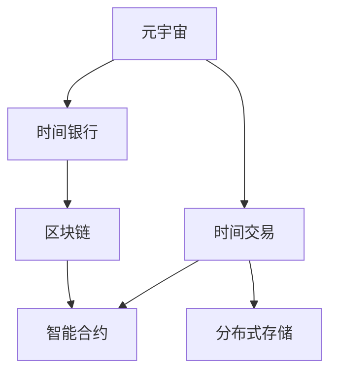

                 

# 元宇宙时间银行:打破物理局限的时间交易

> 关键词：元宇宙,时间银行,时间交易,区块链,加密算法,智能合约

## 1. 背景介绍

### 1.1 问题由来

近年来，随着技术的不断进步，元宇宙概念正逐渐由科幻走向现实。元宇宙不仅是一个虚拟的“数字世界”，更是一个基于区块链技术的开放平台，具有去中心化、自治、可编程等特性。在元宇宙中，个体可以实现超脱物理世界的时间、空间与身份的多重跨越，通过数字资产的创造、交换、消费，达到一种全新的社会化互动形式。

然而，元宇宙中的时间交易系统还面临诸多挑战。如何在去中心化的环境中高效地进行时间交易，如何确保交易的安全性、公平性，如何让时间交易真正体现其价值，都是亟待解决的问题。

### 1.2 问题核心关键点

本文聚焦于一种基于区块链技术的时间银行系统，利用区块链的特性和智能合约技术，打破物理世界的时空局限，实现一种新型的元宇宙时间交易机制。该系统通过去中心化的时间银行平台，支持用户存储、交换、验证时间的使用权，从而优化时间资源分配，提升时间交易的效率和公平性。

## 2. 核心概念与联系

### 2.1 核心概念概述

- **元宇宙(Metaverse)**：一个基于区块链技术的虚拟世界，具有去中心化、自治、可编程等特点，支持个体实现跨越物理世界的时空与身份转换。
- **时间银行(Time Bank)**：一种基于区块链技术的时间管理系统，支持个体存储、交换、验证时间的使用权。
- **时间交易(Time Trading)**：个体在元宇宙中交换、消费时间的行为，体现时间作为一种稀缺资源的价值。
- **区块链(Blockchain)**：一种去中心化的分布式账本技术，通过加密算法确保交易的不可篡改性和安全性。
- **智能合约(Smart Contract)**：一种运行在区块链上的自动化合约，具有自动执行、不可篡改的特性，用于确保时间交易的公平性、透明度。
- **分布式存储(Distributed Storage)**：通过分布式网络存储技术，确保时间银行数据的可靠性和安全性。

这些概念之间的逻辑关系可以通过以下Mermaid流程图来展示：



这个流程图展示了元宇宙、时间银行、时间交易、区块链、智能合约、分布式存储等核心概念之间的联系：

1. 元宇宙通过时间银行、时间交易等机制，实现时间资源的高效管理与优化分配。
2. 时间银行利用区块链技术，确保时间交易的安全性、透明度和公平性。
3. 智能合约基于区块链，用于自动执行和验证时间交易。
4. 分布式存储保障时间银行数据的安全性和可靠性。

## 3. 核心算法原理 & 具体操作步骤
### 3.1 算法原理概述

基于区块链的时间银行系统通过智能合约实现个体之间的时间交易。其核心原理如下：

- **时间记录与存储**：时间银行系统通过区块链记录个体存储的时间，将时间数据加密存储在分布式网络中。
- **交易验证与授权**：个体之间通过智能合约进行时间交易验证，确保交易的安全性和公平性。
- **时间银行平台**：构建一个去中心化的平台，供用户存储、交换和验证时间的使用权。

### 3.2 算法步骤详解

1. **系统初始化**：在区块链上创建时间银行智能合约，设定初始时间余额、交易规则等参数。
2. **时间存储**：用户通过智能合约向时间银行存储时间，时间数据被加密并存储在区块链上。
3. **时间交换**：用户可以通过智能合约交换时间，系统自动验证交易双方身份和余额，确保交易的公平性和安全性。
4. **时间消费**：用户通过智能合约验证时间的使用权，将时间消耗并记录在区块链上。
5. **时间审计**：系统定期进行时间银行审计，确保时间数据的安全性和完整性。

### 3.3 算法优缺点

**优点**：
- 去中心化：时间银行系统基于区块链技术，确保交易的透明性和公平性。
- 安全性：时间数据加密存储，交易过程通过智能合约自动验证，防止数据篡改和欺诈。
- 可编程性：通过智能合约实现复杂交易逻辑，灵活定制时间交易规则。
- 时间认证：智能合约自动记录时间的使用情况，确保时间的可靠性和准确性。

**缺点**：
- 存储成本高：时间数据需要加密存储在区块链上，占用大量存储空间。
- 交易效率低：智能合约执行和验证过程较慢，影响时间交易的速度。
- 复杂性高：系统设计复杂，需要处理时间存储、交换、消费等多个环节，技术门槛较高。
- 扩展性差：系统扩展性差，难以处理大规模时间交易。

### 3.4 算法应用领域

基于区块链的时间银行系统可以应用于多个领域，包括但不限于：

- **教育领域**：通过时间银行系统记录和交换学习时间，促进知识共享和学习效率的提升。
- **医疗健康**：记录和交换医生的诊疗时间，提高医疗资源分配的公平性和效率。
- **企业工作**：记录和交换员工的工作时间，提升团队协作和工作效率。
- **旅游服务**：记录和交换旅游服务的提供时间，优化旅游资源的分配和消费。

## 4. 数学模型和公式 & 详细讲解
### 4.1 数学模型构建

时间银行系统通过区块链和智能合约实现时间交易，其核心数学模型包括时间余额、交易记录、智能合约逻辑等。

设时间银行系统中，个体 $i$ 的时间余额为 $B_i$，时间交易记录为 $T_i$。智能合约通过数学公式计算时间余额和交易记录，确保时间交易的公平性和安全性。

时间余额计算公式为：
$$
B_i = B_i^{old} - T_i^{transfer}
$$
其中 $B_i^{old}$ 为初始时间余额，$T_i^{transfer}$ 为本次转移的时间量。

交易记录计算公式为：
$$
T_i = T_i^{init} + T_i^{transfer}
$$
其中 $T_i^{init}$ 为初始交易记录，$T_i^{transfer}$ 为本次转移的时间量。

### 4.2 公式推导过程

以时间存储和时间为基础，智能合约的逻辑推导如下：

设个体 $i$ 在时间银行系统中存储了 $T_i^{store}$ 的时间，其存储操作如下所示：
$$
S_i: B_i^{old} = B_i^{old} + T_i^{store}
$$

当个体 $i$ 请求转移 $T_i^{transfer}$ 的时间时，智能合约执行如下操作：
$$
M_i: B_i = B_i - T_i^{transfer}, T_i = T_i + T_i^{transfer}
$$

其中，$M_i$ 为转移操作的数学表达式，由智能合约自动验证执行。

### 4.3 案例分析与讲解

假设时间银行系统中有两个个体 $A$ 和 $B$，$A$ 存储了 $10$ 小时的时间，$B$ 存储了 $5$ 小时的时间。个体 $A$ 希望将 $2$ 小时的时间转移到个体 $B$ 的时间银行账户中，智能合约执行如下：

1. $A$ 的时间余额计算：
$$
B_A^{old} = 10, T_A^{transfer} = 2
$$
$$
B_A = 10 - 2 = 8, T_A = 0
$$

2. $B$ 的时间余额计算：
$$
B_B^{old} = 5, T_B^{transfer} = 2
$$
$$
B_B = 5 + 2 = 7, T_B = 2
$$

智能合约验证通过后，$2$ 小时的时间从 $A$ 转移到了 $B$ 的时间银行账户中。

## 5. 项目实践：代码实例和详细解释说明
### 5.1 开发环境搭建

在进行时间银行系统开发前，我们需要准备好开发环境。以下是使用Solidity和以太坊开发的时间银行系统开发流程：

1. 安装Solidity编译器和以太坊钱包。
2. 创建以太坊账户，将以太币转入账户中。
3. 搭建测试网络，例如使用Ganache或Ropsten，部署时间银行智能合约。
4. 开发时间银行的前端页面，通过Web3.js等技术连接时间银行智能合约。
5. 测试时间银行系统，验证时间存储、交换和消费的过程。

### 5.2 源代码详细实现

以下是一个基于Solidity的时间银行系统智能合约示例：

```solidity
pragma solidity ^0.8.0;

contract TimeBank {
    mapping(address => uint256) public balances;
    mapping(address => uint256) public transfers;
    
    event TimeTransfered(address indexed from, address indexed to, uint256 indexed amount);
    
    function storeTime(uint256 amount) public payable {
        balances[msg.sender] += amount;
        emit TimeStored(amount, msg.sender);
    }
    
    function transferTime(uint256 amount, address to) public payable {
        require(balances[msg.sender] >= amount, "Insufficient balance");
        balances[msg.sender] -= amount;
        balances[to] += amount;
        transfers[msg.sender][to] += amount;
        transfers[to][msg.sender] -= amount;
        emit TimeTransferred(amount, msg.sender, to);
    }
    
    function getBalance(address account) public view returns (uint256) {
        return balances[account];
    }
    
    function getTransfers(address from, address to) public view returns (uint256) {
        return transfers[from][to];
    }
}
```

以上代码定义了时间银行智能合约的四个主要函数：

- `storeTime`：用户将时间存储到时间银行中。
- `transferTime`：用户请求转移时间到其他用户账户。
- `getBalance`：获取用户的时间余额。
- `getTransfers`：获取用户的交易记录。

### 5.3 代码解读与分析

让我们详细解读一下关键代码的实现细节：

**TimeBank合约**：
- `balances` 和 `transfers` 映射存储了用户的余额和交易记录。
- `TimeTransfered` 事件记录每次时间转移的操作。
- `storeTime` 函数：用户向时间银行存储时间，更新余额并记录操作。
- `transferTime` 函数：用户请求时间转移，验证余额并更新余额和交易记录。
- `getBalance` 和 `getTransfers` 函数：用于获取用户的时间余额和交易记录。

**代码逻辑**：
- `storeTime` 和 `transferTime` 函数都包含参数验证，确保操作合法。
- 每次操作都会记录在时间银行智能合约中，确保交易的可追溯性和透明度。
- 时间余额和交易记录的更新逻辑清晰，易于理解和调试。

**运行结果展示**：

在测试网络中运行上述智能合约，可以使用以下代码调用相关函数：

```javascript
const contractAddress = "0x..."; // 时间银行智能合约地址
const timeBank = new web3.eth.Contract(timeBankABI, contractAddress);

async function storeTime() {
    const time = web3.utils.toBN(1); // 存储1小时的时间
    const tx = await timeBank.methods.storeTime(time).send({ from: web3.eth.accounts[0], value: time.multipliedBy(100).toString() });
    console.log("Time stored:", tx.receipt);
}

async function transferTime() {
    const toAddress = "0x..."; // 目标用户地址
    const time = web3.utils.toBN(2); // 转移2小时的时间
    const tx = await timeBank.methods.transferTime(time, toAddress).send({ from: web3.eth.accounts[0], value: time.multipliedBy(100).toString() });
    console.log("Time transferred:", tx.receipt);
}

async function getBalance() {
    const account = "0x..."; // 查询用户的地址
    const balance = await timeBank.methods.getBalance(account).call();
    console.log("Time balance:", balance);
}

async function getTransfers() {
    const from = "0x..."; // 查询用户的地址
    const to = "0x..."; // 查询目标用户的地址
    const transfers = await timeBank.methods.getTransfers(from, to).call();
    console.log("Transfers:", transfers);
}

// 运行存储和转移操作
await storeTime();
await transferTime();
await getBalance();
await getTransfers();
```

**结果分析**：
- `storeTime` 函数将时间存储到时间银行中，返回交易确认信息。
- `transferTime` 函数将时间转移到目标用户账户，返回交易确认信息。
- `getBalance` 函数获取用户的时间余额。
- `getTransfers` 函数获取用户的交易记录。

## 6. 实际应用场景
### 6.1 教育领域

时间银行系统在教育领域有广阔的应用前景。通过记录和交换教师的教学时间，可以优化教育资源的分配，提升教学效率和公平性。

具体而言，教师可以通过智能合约向时间银行存储教学时间，学生可以在线购买教师的时间进行一对一辅导或答疑。时间银行系统通过智能合约自动验证交易，确保教学时间的可靠性和公平性。

### 6.2 医疗健康

时间银行系统在医疗健康领域也具有重要价值。通过记录和交换医生的诊疗时间，可以提高医疗资源的分配效率，促进医疗服务的公平性。

例如，医院可以设立时间银行，医生可以通过智能合约存储诊疗时间，病人可以通过在线预约购买医生的时间进行诊断。智能合约自动验证医生的诊疗记录和病人的支付情况，确保医疗交易的透明性和公平性。

### 6.3 企业工作

时间银行系统在企业工作中同样有显著效果。通过记录和交换员工的工作时间，可以提高团队协作和工作效率，优化时间资源分配。

例如，公司可以设立时间银行，员工可以通过智能合约存储工作时间，其他员工可以通过在线请求购买时间进行协作或请教。智能合约自动验证时间的使用情况和支付情况，确保时间交易的合法性和公平性。

### 6.4 旅游服务

时间银行系统在旅游服务中也有应用潜力。通过记录和交换旅游服务的提供时间，可以优化旅游资源的分配和消费，提升旅游服务的体验。

例如，旅游公司可以设立时间银行，导游可以通过智能合约存储提供服务的时间，游客可以通过在线预约购买导游的时间进行导游服务。智能合约自动验证导游的服务记录和游客的支付情况，确保旅游交易的透明性和公平性。

## 7. 工具和资源推荐
### 7.1 学习资源推荐

为了帮助开发者系统掌握时间银行系统的开发，这里推荐一些优质的学习资源：

1. Solidity官方文档：官方提供的Solidity语言文档，详细介绍了Solidity语法、智能合约开发方法等。
2. Ethereum官方文档：以太坊官方文档，介绍了以太坊平台的各种技术细节和开发环境配置方法。
3. CryptoZombies：一款互动式的Solidity学习工具，通过游戏形式学习智能合约开发。
4. Smart Contract Academy：提供免费在线课程，涵盖智能合约开发和以太坊平台使用的各种技术。
5. GitHub上的时间银行项目：众多开发者在GitHub上分享的时间银行项目源代码，可以参考和借鉴。

通过学习这些资源，相信你一定能够快速掌握时间银行系统的开发技巧，并应用于实际开发中。

### 7.2 开发工具推荐

高效的开发离不开优秀的工具支持。以下是几款用于时间银行系统开发的常用工具：

1. Solidity编译器：用于编译Solidity智能合约代码。
2. Truffle：基于以太坊的开发框架，提供了智能合约测试和部署工具。
3. Web3.js：以太坊API库，用于连接以太坊节点，操作智能合约。
4. MetaMask：以太坊钱包，支持以太币交易和智能合约交互。
5. Ganache：以太坊本地测试网络，用于开发和测试智能合约。

合理利用这些工具，可以显著提升时间银行系统的开发效率，加快创新迭代的步伐。

### 7.3 相关论文推荐

时间银行系统涉及区块链和智能合约等前沿技术，以下是几篇奠基性的相关论文，推荐阅读：

1. "Blockchain Technology and Digital Economy"（区块链技术和数字经济）：探讨区块链技术在经济中的应用，包括时间银行系统的设计。
2. "Smart Contracts: Blockchain-Based Apps on Ethereum"（智能合约：基于以太坊的区块链应用）：介绍智能合约的基本概念和应用场景，包含时间银行系统的案例。
3. "Decentralized Applications (DApps) for the Future"（未来去中心化应用）：讨论DApp的开发和应用，包含时间银行系统的实例。
4. "Blockchain 2.0: Introduction to the Evolution of Blockchain Technology"（区块链2.0：区块链技术的演进）：介绍区块链技术的演进和未来方向，包含时间银行系统的应用。
5. "Time Bank System for Smart Grids"（智能电网中的时间银行系统）：讨论时间银行系统在智能电网中的应用，包含区块链和智能合约的设计。

这些论文代表了大语言模型微调技术的发展脉络。通过学习这些前沿成果，可以帮助研究者把握学科前进方向，激发更多的创新灵感。

## 8. 总结：未来发展趋势与挑战

### 8.1 总结

本文对基于区块链的时间银行系统进行了全面系统的介绍。首先阐述了时间银行系统的研究背景和意义，明确了时间银行系统在元宇宙中的重要价值。其次，从原理到实践，详细讲解了时间银行系统的数学模型和算法流程，给出了时间银行系统的前端代码实现。同时，本文还广泛探讨了时间银行系统在教育、医疗、企业、旅游等多个领域的应用前景，展示了时间银行系统的巨大潜力。此外，本文精选了时间银行系统的各类学习资源，力求为读者提供全方位的技术指引。

通过本文的系统梳理，可以看到，基于区块链的时间银行系统正在成为元宇宙中的重要基础设施，极大地提升了时间资源的利用效率和公平性。未来，伴随区块链技术和智能合约的不断演进，时间银行系统将进一步优化，为元宇宙中的时间交易提供更为安全、可靠、透明的服务。

### 8.2 未来发展趋势

展望未来，时间银行系统的发展趋势如下：

1. **去中心化程度提升**：随着区块链技术的进步，时间银行系统的去中心化程度将进一步提升，确保时间交易的透明性和公平性。
2. **跨链互操作性增强**：不同区块链之间的互操作性将增强，实现跨链时间交易，提高时间资源的高效利用。
3. **智能合约自动化程度提高**：智能合约的自动化程度将进一步提高，支持更复杂的交易逻辑和时间管理功能。
4. **数据隐私保护加强**：时间银行系统将加强数据隐私保护，确保用户信息的匿名性和安全性。
5. **生态系统拓展**：时间银行系统将拓展到更多行业和应用场景，形成多元化的生态系统。

这些趋势凸显了时间银行系统的广阔前景，相信在未来的元宇宙时代，时间银行系统将发挥越来越重要的作用，推动时间资源的优化和高效管理。

### 8.3 面临的挑战

尽管时间银行系统在元宇宙中展示了巨大的潜力，但在迈向更加智能化、普适化应用的过程中，它仍面临诸多挑战：

1. **存储成本高**：时间数据需要加密存储在区块链上，占用大量存储空间。如何降低存储成本，提高系统效率，仍是一大难题。
2. **交易效率低**：智能合约执行和验证过程较慢，影响时间交易的速度。如何提高交易效率，降低交易成本，仍需进一步探索。
3. **系统扩展性差**：时间银行系统难以处理大规模时间交易，如何提高系统扩展性，支持更多用户，仍是一大挑战。
4. **技术门槛高**：时间银行系统的开发和维护需要较高的技术门槛，如何降低技术门槛，提高开发效率，仍需进一步努力。
5. **法律合规性问题**：时间银行系统涉及资金和数据，如何确保系统符合法律法规，保障用户权益，仍是一大挑战。

这些挑战需要技术、法律、政策等多方面协同努力，才能推动时间银行系统向更加成熟、可靠、安全的方向发展。

### 8.4 研究展望

面向未来，时间银行系统需要在以下几个方面寻求新的突破：

1. **隐私保护技术**：开发更高效的隐私保护技术，确保时间银行系统的数据隐私和用户匿名性。
2. **分布式存储技术**：研究分布式存储技术，降低时间银行系统的存储成本，提高数据可靠性。
3. **跨链互操作技术**：开发跨链互操作技术，实现不同区块链之间的互操作，提高时间资源的高效利用。
4. **智能合约优化**：优化智能合约逻辑，提高交易效率，支持更复杂的交易逻辑和时间管理功能。
5. **生态系统建设**：构建多元化的时间银行生态系统，拓展应用场景，推动时间银行系统向更加普适化、智能化方向发展。

这些研究方向将推动时间银行系统向更高的台阶发展，为元宇宙中的时间交易提供更为安全、可靠、透明的服务。只有勇于创新、敢于突破，才能真正实现时间银行系统在元宇宙中的价值和潜力。

## 9. 附录：常见问题与解答

**Q1：时间银行系统如何保证交易的安全性？**

A: 时间银行系统通过智能合约和区块链技术，确保时间交易的安全性。智能合约自动验证交易双方的身份和余额，防止数据篡改和欺诈。区块链的去中心化特性确保交易记录不可篡改，确保时间交易的透明性和公平性。

**Q2：时间银行系统如何处理时间余额不足的情况？**

A: 时间银行系统通过智能合约设置余额限制，防止用户的时间余额低于预设阈值。当用户的时间余额不足时，系统自动拒绝请求，并提示用户支付相应的时间费用。

**Q3：时间银行系统如何防止恶意攻击？**

A: 时间银行系统通过智能合约和区块链技术，防止恶意攻击。智能合约自动验证交易的合法性和有效性，防止数据篡改和欺诈。区块链的去中心化特性和分布式存储技术，确保时间银行数据的可靠性和安全性。

**Q4：时间银行系统如何优化交易效率？**

A: 时间银行系统通过智能合约和分布式存储技术，优化交易效率。智能合约自动验证交易逻辑，支持复杂的交易逻辑和时间管理功能。分布式存储技术降低数据存储成本，提高系统效率。

**Q5：时间银行系统如何支持跨链互操作？**

A: 时间银行系统通过跨链互操作技术，支持不同区块链之间的互操作。时间银行系统通过智能合约和区块链技术，实现不同区块链之间的数据交互和信任验证，支持跨链时间交易。

这些问题的解答展示了时间银行系统的核心机制和设计理念，帮助开发者更好地理解时间银行系统的核心原理和实际应用。

---

作者：禅与计算机程序设计艺术 / Zen and the Art of Computer Programming

