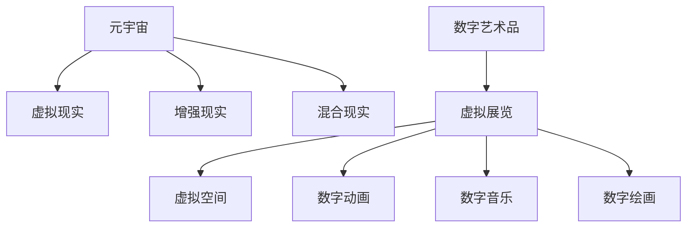

                 

# 元宇宙艺术策展:跨维度艺术展览的新形式

> 关键词：元宇宙, 艺术策展, 跨维度, 虚拟展览, 混合现实, 数字艺术品

## 1. 背景介绍

### 1.1 问题由来
随着数字技术的迅猛发展，元宇宙（Metaverse）这一概念逐渐成为讨论的热点。元宇宙作为一个虚拟的、开放的世界，为用户提供了沉浸式的体验，带来了一种全新的社交和生活方式。在元宇宙中，数字艺术品、虚拟展览、虚拟演播室等新形式的文化交流活动，正在悄然改变传统艺术展览的形式和内容。

然而，传统的艺术展览仍然存在一些问题。一方面，物理空间受限于地理和物流，难以覆盖到更广泛的人群；另一方面，部分地区和人群由于各种原因无法亲临现场，无法享受高质量的艺术展览。而虚拟现实（Virtual Reality, VR）和增强现实（Augmented Reality, AR）技术的进步，为元宇宙艺术策展提供了可能。

### 1.2 问题核心关键点
元宇宙艺术策展的核心关键点在于如何构建虚拟的、交互式的艺术展览，让参观者能够沉浸式地体验艺术作品，甚至直接与艺术品互动。这需要利用人工智能、计算机图形学、大数据等技术，结合虚拟现实、增强现实、混合现实（Mixed Reality, MR）等展示手段，实现多维度、跨域的展览形式。

## 2. 核心概念与联系

### 2.1 核心概念概述

为了更好地理解元宇宙艺术策展的概念，本节将介绍几个密切相关的核心概念：

- 元宇宙（Metaverse）：一个虚拟的、交互式的三维空间，包含数字化的物理对象、角色、场景等，是用户可以长时间沉浸、互动的虚拟环境。
- 虚拟现实（Virtual Reality, VR）：使用VR头盔和传感器等设备，为用户提供一个完全沉浸式的虚拟空间。
- 增强现实（Augmented Reality, AR）：将虚拟数字信息叠加到现实世界中，为用户提供更丰富的视觉和交互体验。
- 混合现实（Mixed Reality, MR）：结合了VR和AR的优点，用户可以在真实世界和虚拟世界间自由切换和互动。
- 数字艺术品：以数字形式存在的艺术品，包括但不限于数字绘画、雕塑、音乐、动画等。
- 虚拟展览：利用虚拟现实、增强现实等技术，构建虚拟空间，展出数字艺术品。

这些核心概念之间的逻辑关系可以通过以下Mermaid流程图来展示：



这个流程图展示了几者之间的关系：

1. 元宇宙作为一个大的框架，涵盖了虚拟现实、增强现实和混合现实。
2. 数字艺术品作为展览的对象，可以在虚拟空间中展示。
3. 虚拟展览利用VR、AR、MR等技术，为用户提供沉浸式的观看体验。

这些核心概念共同构成了元宇宙艺术策展的基础，使得艺术展览可以跨越物理空间，突破传统形式，以更加新颖的方式呈现给观众。

## 3. 核心算法原理 & 具体操作步骤
### 3.1 算法原理概述

元宇宙艺术策展的核心算法原理在于通过虚拟现实、增强现实等技术，构建一个可以沉浸、互动的虚拟展览空间。这个虚拟展览空间的构建，涉及三维建模、空间渲染、用户交互等多个方面。

### 3.2 算法步骤详解

元宇宙艺术策展的算法步骤大致可以分为以下几个步骤：

1. **三维建模**：
   - 使用计算机图形学技术，构建虚拟展览空间的三维模型。
   - 将数字艺术品转化为3D模型，放置在展览空间中的指定位置。
   - 使用光影、材质等技术，提升3D模型的逼真度和艺术效果。

2. **空间渲染**：
   - 利用GPU加速技术，对三维模型进行实时渲染，展示出逼真的虚拟空间。
   - 使用物理引擎和光线追踪技术，增强空间逼真度。
   - 通过视点变换和动态光照，提升用户沉浸感。

3. **用户交互**：
   - 使用控制器、手柄等设备，实现用户与虚拟展览的互动。
   - 通过计算机视觉和手势识别技术，让用户以自然的方式与艺术品交互。
   - 提供语音交互、文本输入等多种交互方式，满足不同用户的需求。

4. **数据管理与分发**：
   - 使用大数据技术，收集用户行为数据，用于展览分析和改进。
   - 通过CDN和P2P技术，将虚拟展览数据分发至全球用户，确保低延迟和高质量的展示体验。

5. **个性化推荐**：
   - 使用机器学习和协同过滤技术，根据用户兴趣推荐合适的艺术作品和展览路径。
   - 通过分析用户行为和反馈，不断调整和优化推荐系统，提升用户体验。

6. **安全和隐私保护**：
   - 采用加密技术，保护用户数据和艺术品的版权。
   - 实现用户身份验证和权限控制，保障展览和用户的隐私安全。

### 3.3 算法优缺点

元宇宙艺术策展具有以下优点：
1. 打破地域限制：用户可以在任何地方、任何时间，通过虚拟展览感受到艺术的魅力。
2. 提升用户体验：通过虚拟现实、增强现实等技术，用户能够沉浸式地体验艺术作品，增强互动性。
3. 降低运营成本：虚拟展览无需租赁物理空间和物流成本，可以大幅降低运营成本。
4. 丰富展览内容：数字艺术品可以通过渲染、互动等技术，实现更加多样化的展示形式。

同时，该方法也存在一些局限性：
1. 技术要求高：需要高性能的计算机设备、复杂的渲染引擎等，对技术门槛要求较高。
2. 设备成本高：VR头盔、手柄等设备仍较为昂贵，普通用户难以负担。
3. 交互方式受限：目前的交互方式仍较为基础，未来仍有更多创新空间。
4. 安全性和隐私保护需加强：用户数据和艺术品的版权保护需更加严格。

尽管存在这些局限性，但元宇宙艺术策展作为一种新的形式，为艺术展览的发展提供了新的可能。未来，相关技术的不断进步，将进一步提升虚拟展览的质量和用户体验。

### 3.4 算法应用领域

元宇宙艺术策展的应用领域非常广泛，包括但不限于以下方面：

1. **博物馆展览**：将实体博物馆的展品数字化，通过VR和AR技术，提供沉浸式的参观体验。
2. **艺术画廊**：利用数字技术，展示各类艺术品，包括传统绘画、现代雕塑、数字艺术等。
3. **音乐会演出**：通过虚拟现实技术，让用户在家中就能享受到现场音乐会的震撼体验。
4. **教育培训**：利用虚拟展览，开展艺术教育、美术教学等，提升学生的艺术素养。
5. **文化交流**：通过虚拟展览，打破地域和文化的隔阂，促进全球文化交流和理解。

## 4. 数学模型和公式 & 详细讲解 & 举例说明（备注：数学公式请使用latex格式，latex嵌入文中独立段落使用 $$，段落内使用 $)
### 4.1 数学模型构建

元宇宙艺术策展的数学模型主要涉及以下几个方面：

1. **三维建模**：
   - 使用三维建模技术，如多边形建模、曲面建模等，生成艺术品的3D模型。
   - 计算模型的顶点、面、边等属性，用于渲染和显示。

2. **空间渲染**：
   - 使用图形渲染方程，计算光源、材质、相机等对3D模型的影响。
   - 利用物理渲染技术，模拟真实的光照、反射等现象，提升渲染效果。

3. **用户交互**：
   - 使用手势识别和计算机视觉技术，计算用户的动作和位置。
   - 使用物理引擎，计算用户动作对场景的影响，实现自然交互。

4. **个性化推荐**：
   - 使用协同过滤和推荐算法，计算用户兴趣和艺术品特征的相似度。
   - 利用机器学习算法，如KNN、SVM等，实现推荐系统的构建和优化。

5. **安全和隐私保护**：
   - 使用加密算法，如AES、RSA等，保护用户数据和艺术品的版权。
   - 实现访问控制和权限管理，确保展览和用户的隐私安全。

### 4.2 公式推导过程

以下是元宇宙艺术策展中几个核心公式的推导：

1. **三维建模**：
   - 多面体体积公式：
     \[
     V = \frac{1}{3} \times \text{底面积} \times \text{高}
     \]
     \[
     V = \frac{1}{3} \times (a \times b \times c)
     \]
   - 三角剖分面积公式：
     \[
     S = \frac{1}{2} \times \sum_{i=1}^{n} \text{边长}
     \]

2. **空间渲染**：
   - 图形渲染方程：
     \[
     I(x) = L(x) \times \int_{\Omega} f(x, \omega) \times F(x, \omega) \times S(x, \omega) \times \cos(\theta) \times \text{d}\omega
     \]
     其中 \(L(x)\) 为光源，\(f(x, \omega)\) 为材质，\(F(x, \omega)\) 为几何体，\(S(x, \omega)\) 为表面，\(\theta\) 为观察角度。

3. **用户交互**：
   - 手势识别：
     \[
     P = \text{位置} + \text{速度} + \text{加速度}
     \]
     \[
     a = \frac{\Delta v}{\Delta t}
     \]
   - 物理引擎：
     \[
     F = m \times a
     \]

4. **个性化推荐**：
   - 协同过滤算法：
     \[
     \text{相似度} = \frac{A_{ij} - \mu_i}{\sigma_i} \times \frac{A_{kj} - \mu_k}{\sigma_k}
     \]
     其中 \(A\) 为评分矩阵，\(\mu\) 为均值，\(\sigma\) 为标准差。
   - 推荐系统：
     \[
     P(r_{ui}) = \sum_{j=1}^{N} \alpha_j \times \text{相似度} \times r_{uj}
     \]

5. **安全和隐私保护**：
   - 加密算法：
     \[
     E = (M, K)
     \]
     其中 \(E\) 为加密结果，\(M\) 为明文，\(K\) 为密钥。
   - 访问控制：
     \[
     P = \text{角色} \times \text{权限}
     \]

### 4.3 案例分析与讲解

以下是一个简单的案例，展示如何使用这些公式进行虚拟展览的构建和展示：

1. **三维建模**：
   - 使用Blender等工具，对数字艺术品进行3D建模。
   - 导入3D模型到Unity或Unreal Engine等引擎，进行渲染和展示。

2. **空间渲染**：
   - 在Unity或Unreal Engine中，使用图形渲染引擎，计算光源和材质对3D模型的影响。
   - 通过模拟光照和反射，实现高质量的渲染效果。

3. **用户交互**：
   - 使用Oculus Rift等VR设备，采集用户的头部和手柄动作数据。
   - 通过物理引擎，计算用户动作对场景的影响，实现自然的交互。

4. **个性化推荐**：
   - 收集用户对艺术品的评分和行为数据。
   - 使用协同过滤算法，计算用户兴趣和艺术品特征的相似度。
   - 利用推荐系统，根据用户行为预测其下一步选择，实现个性化推荐。

5. **安全和隐私保护**：
   - 使用AES算法对用户数据进行加密。
   - 实现身份验证和权限控制，保障展览和用户的隐私安全。

## 5. 项目实践：代码实例和详细解释说明
### 5.1 开发环境搭建

在进行元宇宙艺术策展的开发前，我们需要准备好开发环境。以下是使用Python进行Unity开发的环境配置流程：

1. 安装Unity编辑器：从Unity官网下载并安装Unity编辑器。
2. 安装Python：在Unity中导入Python脚本，完成Unity与Python的集成。
3. 安装必要的插件：安装VRSDK、ARSDK等插件，用于实现虚拟现实和增强现实功能。
4. 导入3D模型：导入已有的数字艺术品3D模型，并将其放置在虚拟展览空间中。

### 5.2 源代码详细实现

下面我们以一个简单的虚拟展览为例，给出使用Unity实现元宇宙艺术策展的Python代码实现。

```python
from unityagents import UnityEnvironment

# 初始化Unity环境
env = UnityEnvironment(file_name='Path/to/VirtualExhibition.unity', worker_id=0, viewer_id=0)

# 获取展览空间和艺术品
exhibition = env.get_global_object("ExhibitionController")
artifacts = exhibition.artifacts

# 渲染场景
def render_scene():
    env.render()
    time.sleep(0.02) # 渲染间隔时间

# 用户交互
def handle_user_input():
    user_input = env.get_user_input()
    if user_input == 'left':
        exhibition.move_left()
    elif user_input == 'right':
        exhibition.move_right()
    elif user_input == 'up':
        exhibition.move_up()
    elif user_input == 'down':
        exhibition.move_down()

# 用户行为统计
def user_behavior_analysis():
    # 统计用户行为数据
    behavior_data = exhibition.behavior_data
    # 分析行为数据，生成统计报表
    behavior_analysis = exhibition.behavior_analysis(behavior_data)

# 运行虚拟展览
def run_exhibition():
    while True:
        user_input = env.get_user_input()
        if user_input == 'quit':
            break
        handle_user_input()
        render_scene()
    # 关闭Unity环境
    env.close()
```

### 5.3 代码解读与分析

让我们再详细解读一下关键代码的实现细节：

**UnityEnvironment类**：
- 用于创建和控制Unity环境的Python接口，可以加载、初始化和关闭Unity编辑器中的场景。

**ExhibitionController类**：
- 用于控制虚拟展览空间的控制器，可以移动、交互等。

**handle_user_input函数**：
- 获取用户输入，并根据用户操作调整展览空间。

**user_behavior_analysis函数**：
- 统计用户行为数据，并分析行为数据，生成报表。

**run_exhibition函数**：
- 循环读取用户输入，根据输入进行相应的操作，同时渲染场景。

**注意事项**：
- 由于Unity中使用C#编写脚本，Python代码需要调用C#函数。因此需要在Unity编辑器中编写并导出C#脚本，在Python中调用。
- Unity与Python的集成需要使用Unity的Python插件，需确保插件已正确安装并配置。

通过以上代码，我们展示了如何在Unity中实现虚拟展览的基本功能，用户可以通过简单的手势操作，与虚拟展览空间中的艺术品进行互动，体验沉浸式的艺术展示。

## 6. 实际应用场景
### 6.1 智能客服系统

在智能客服系统中，元宇宙艺术策展可以应用于虚拟客服对话场景，为客服机器人提供更丰富的表达形式和沟通方式。通过虚拟现实和增强现实技术，客服机器人可以展示虚拟艺术品，解答用户问题，提升用户体验。

### 6.2 金融投资分析

在金融投资分析中，元宇宙艺术策展可以用于展示历史数据和市场行情，帮助分析师更好地理解市场动态。通过虚拟展览，分析师可以更加直观地了解各种金融产品，进行决策分析。

### 6.3 医疗健康应用

在医疗健康应用中，元宇宙艺术策展可以用于虚拟手术和医学教育，提升医生的手术技能和医学知识水平。通过虚拟现实技术，医生可以在虚拟环境中进行手术操作，提高手术准确性和安全性。

### 6.4 未来应用展望

随着技术的不断发展，元宇宙艺术策展将有以下几个发展趋势：

1. **沉浸式体验**：未来的元宇宙展览将更加沉浸式，用户可以通过虚拟现实头盔和手柄等设备，获得更为真实的感官体验。
2. **多感官交互**：除了视觉、听觉，未来的展览还将加入触觉、嗅觉等多感官交互，提升用户的整体体验。
3. **跨平台支持**：未来的元宇宙展览将支持多种平台，包括移动设备、PC端等，打破设备限制。
4. **实时互动**：未来的展览将支持实时互动，用户可以通过社交网络平台，与朋友、家人共同参观展览，增强社交体验。
5. **个性化推荐**：未来的推荐系统将更加智能，根据用户的兴趣和行为，提供个性化的展览内容和路径。

## 7. 工具和资源推荐
### 7.1 学习资源推荐

为了帮助开发者系统掌握元宇宙艺术策展的理论基础和实践技巧，这里推荐一些优质的学习资源：

1. Unity官方文档：Unity官网提供的详细文档，涵盖Unity编辑器的各种功能和API。
2. Unreal Engine官方文档：Unreal Engine官网提供的详细文档，涵盖Unreal Engine的各种功能和API。
3. ARKit和ARCore官方文档：Apple和Google提供的增强现实开发文档，涵盖ARSDK的各种功能和API。
4. VRSDK官方文档：Unity提供的VRSDK文档，涵盖虚拟现实开发的各种功能和API。
5. 《Unity编程的艺术》：一本介绍Unity开发的书籍，涵盖Unity编程的各个方面。

通过对这些资源的学习实践，相信你一定能够快速掌握元宇宙艺术策展的精髓，并用于解决实际的元宇宙艺术策展问题。

### 7.2 开发工具推荐

高效的开发离不开优秀的工具支持。以下是几款用于元宇宙艺术策展开发的常用工具：

1. Unity Editor：Unity官方的编辑器，提供可视化编程和实时预览，支持VR、AR开发。
2. Unreal Engine Editor：Unreal Engine官方的编辑器，提供可视化编程和实时预览，支持VR、AR开发。
3. ARKit和ARCore：Apple和Google提供的增强现实开发框架，支持移动设备的增强现实开发。
4. VRSDK：Unity提供的虚拟现实开发工具包，支持VR设备的开发和调试。
5. TensorBoard：TensorFlow配套的可视化工具，用于监控和调试深度学习模型的训练和推理过程。

合理利用这些工具，可以显著提升元宇宙艺术策展的开发效率，加快创新迭代的步伐。

### 7.3 相关论文推荐

元宇宙艺术策展的研究涉及多个领域，以下是几篇奠基性的相关论文，推荐阅读：

1. "Virtual Reality in Art and Culture: A Survey"：一篇关于虚拟现实在艺术和文化中应用的综述论文。
2. "Augmented Reality in Art Education"：一篇关于增强现实在艺术教育中应用的论文。
3. "Mixed Reality Art Exhibition Design"：一篇关于混合现实艺术展览设计的论文。
4. "Interactive Art in Virtual Environments"：一篇关于虚拟环境中交互式艺术应用的论文。

这些论文代表了大模型微调技术的发展脉络。通过学习这些前沿成果，可以帮助研究者把握学科前进方向，激发更多的创新灵感。

## 8. 总结：未来发展趋势与挑战
### 8.1 总结

本文对元宇宙艺术策展方法进行了全面系统的介绍。首先阐述了元宇宙和虚拟现实、增强现实、混合现实等概念，明确了虚拟展览的核心价值和应用场景。其次，从原理到实践，详细讲解了虚拟展览的数学模型和核心算法，给出了虚拟展览任务开发的完整代码实例。同时，本文还广泛探讨了虚拟展览在智能客服、金融投资、医疗健康等领域的实际应用前景，展示了虚拟展览的巨大潜力。

通过本文的系统梳理，可以看到，元宇宙艺术策展正在成为艺术展览的新趋势，极大地拓展了艺术展览的应用边界，为艺术展览提供了全新的展示形式。未来，伴随虚拟现实、增强现实等技术的不断进步，元宇宙艺术策展必将在艺术和文化领域发挥更大的作用，带来更多的创新和变革。

### 8.2 未来发展趋势

展望未来，元宇宙艺术策展将呈现以下几个发展趋势：

1. **技术进步**：虚拟现实、增强现实等技术将不断进步，实现更高的沉浸感和交互性。
2. **应用多样化**：元宇宙艺术策展将在更多领域得到应用，如教育、医疗、游戏等，带来新的文化交流和体验形式。
3. **跨平台支持**：未来的展览将支持多种平台，打破设备限制，实现更广泛的覆盖。
4. **个性化体验**：通过个性化推荐系统，提供更加个性化的展览体验，满足不同用户的需求。
5. **文化交流**：元宇宙艺术策展将促进全球文化交流和理解，打破地域和语言的障碍。

### 8.3 面临的挑战

尽管元宇宙艺术策展具有广阔的应用前景，但在迈向更加智能化、普适化应用的过程中，它仍面临着诸多挑战：

1. **技术门槛高**：需要掌握虚拟现实、增强现实等技术，对技术要求较高。
2. **设备成本高**：VR头盔、手柄等设备仍较为昂贵，普通用户难以负担。
3. **内容创作难度大**：高质量的数字艺术品创作需要较高的艺术水平和技术水平。
4. **数据安全问题**：用户数据和艺术品的版权保护需更加严格。
5. **用户体验问题**：用户交互方式和体验还需不断优化，提升用户满意度。

尽管存在这些挑战，但元宇宙艺术策展作为一种新的形式，为艺术展览的发展提供了新的可能。未来，相关技术的不断进步，将进一步提升虚拟展览的质量和用户体验。

### 8.4 研究展望

面对元宇宙艺术策展所面临的种种挑战，未来的研究需要在以下几个方面寻求新的突破：

1. **技术创新**：开发更加沉浸、互动的展示技术，提升用户体验。
2. **内容创作**：提供便捷、高效的内容创作工具，降低数字艺术品创作的门槛。
3. **数据安全**：采用更强的数据加密和安全机制，保护用户数据和艺术品的版权。
4. **跨平台支持**：支持多种平台，打破设备限制，实现更广泛的覆盖。
5. **个性化体验**：通过个性化推荐系统，提供更加个性化的展览体验，满足不同用户的需求。

这些研究方向的探索，必将引领元宇宙艺术策展技术迈向更高的台阶，为构建人机协同的智能时代中，元宇宙艺术策展带来更广泛的实际应用。总之，元宇宙艺术策展需要从技术、内容、体验等多个维度协同发力，才能真正实现艺术展览的创新和变革。

## 9. 附录：常见问题与解答

**Q1：元宇宙艺术策展是否适用于所有艺术类型？**

A: 元宇宙艺术策展可以适用于大部分艺术类型，包括但不限于绘画、雕塑、音乐、舞蹈等。数字技术能够将传统艺术形式数字化，实现虚拟展览。

**Q2：元宇宙艺术策展的虚拟空间如何构建？**

A: 虚拟空间的构建需要三维建模、空间渲染等技术。可以使用Unity或Unreal Engine等工具，创建虚拟展览空间和数字艺术品。

**Q3：元宇宙艺术策展是否需要高性能设备？**

A: 元宇宙艺术策展需要高性能设备，如VR头盔、手柄等。但随着技术的进步，设备成本将逐渐下降，普通用户也能负担得起。

**Q4：元宇宙艺术策展如何实现用户交互？**

A: 元宇宙艺术策展可以通过手势识别、语音交互、文本输入等方式实现用户交互。设备采集用户动作数据，并反馈到虚拟展览中。

**Q5：元宇宙艺术策展的安全性和隐私保护如何保障？**

A: 元宇宙艺术策展需采用加密技术、访问控制等手段，保护用户数据和艺术品的版权。需建立完善的安全机制，保障展览和用户的隐私安全。

---

作者：禅与计算机程序设计艺术 / Zen and the Art of Computer Programming

