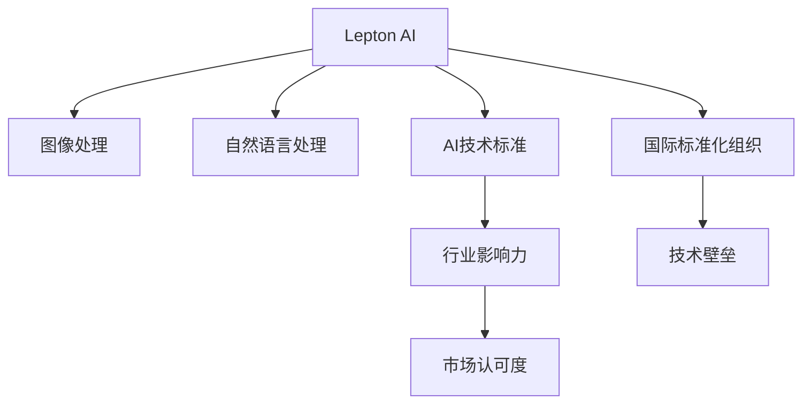

                 

# 全球AI技术标准：Lepton AI的行业影响力

## 1. 背景介绍

### 1.1 问题由来
随着人工智能技术的飞速发展，AI标准化成为全球科技产业的重要议题。全球范围内，AI企业纷纷推出各自的技术标准，以期构建统一的技术生态，促进产业健康发展。然而，由于不同企业在技术路径、应用场景等方面的差异，目前AI标准尚未形成统一的标准体系。

与此同时，中国AI行业正处于蓬勃发展期，涌现出一批具有全球影响力的AI技术提供商。Lepton AI作为其中的佼佼者，凭借其在图像处理、自然语言处理等领域的突破性技术，逐步建立起了自己的行业标准，并开始对全球AI技术标准产生深远影响。

### 1.2 问题核心关键点
Lepton AI的行业影响力主要体现在以下几个方面：

- **技术领先性**：Lepton AI在图像处理、自然语言处理等核心技术领域取得了诸多突破，形成了具有自主知识产权的AI技术标准。
- **广泛应用**：Lepton AI的产品和服务已广泛应用于智能安防、智慧医疗、智能制造等多个行业，并在国际市场上获得了广泛认可。
- **产业推动**：Lepton AI积极参与AI标准的制定和推广，推动了国内外AI技术标准的协同发展。

## 2. 核心概念与联系

### 2.1 核心概念概述

为更好地理解Lepton AI的影响力，本节将介绍几个关键概念：

- **Lepton AI**：成立于2015年，总部位于上海，是国内知名的AI技术提供商。Lepton AI专注于图像处理、自然语言处理等核心技术，致力于构建全面、可扩展的AI技术生态。

- **AI技术标准**：指在AI技术领域内，为确保技术实现、产品互操作、应用推广等，由相关机构制定并推广的标准。

- **行业影响力**：指企业或组织在特定行业内通过技术创新、市场应用、标准制定等多方面活动，对行业整体发展产生的积极影响。

- **国际标准化组织**：如IEEE、ISO、ITU-T等，负责制定和推广全球范围内的技术标准，促进全球技术交流和产业协同。

- **市场认可度**：指企业的产品、技术、标准在市场中的接受程度和影响力，是衡量企业行业影响力的重要指标。

- **技术壁垒**：指企业在技术领域内积累的专有技术和专利，是保障企业竞争优势的重要因素。

这些核心概念之间的逻辑关系可以通过以下Mermaid流程图来展示：



这个流程图展示了一个典型的AI企业影响行业的路径：通过技术创新形成技术标准，并推动行业标准的制定与推广，逐步提升市场认可度和技术壁垒，最终实现行业影响力的扩展。

## 3. 核心算法原理 & 具体操作步骤
### 3.1 算法原理概述

Lepton AI在图像处理和自然语言处理领域的核心算法主要基于深度学习和Transformer架构，其核心原理包括：

- **深度学习**：通过多层神经网络，学习数据特征，并在此基础上进行分类、预测等任务。
- **Transformer架构**：一种自注意力机制的神经网络架构，能高效处理序列数据，广泛应用于自然语言处理任务中。

Lepton AI的算法步骤主要包括以下几个关键环节：

1. **数据预处理**：对输入数据进行归一化、截断、填充等处理，使其适合模型输入。
2. **模型训练**：使用监督学习、无监督学习等方法，在标注数据集上训练模型，优化模型参数。
3. **模型评估**：在验证集和测试集上评估模型性能，选择最优模型。
4. **模型微调**：根据特定任务需求，在预训练模型的基础上进行微调，提升模型在该任务上的表现。
5. **部署与优化**：将模型部署到实际应用中，并进行参数优化和性能调优。

### 3.2 算法步骤详解

**Step 1: 数据预处理**
- 对输入图像进行灰度化、标准化、归一化等处理，使其适应深度学习模型。
- 对于自然语言处理任务，需要对文本进行分词、去除停用词、词向量化等预处理。

**Step 2: 模型训练**
- 在标注数据集上，使用反向传播算法和优化算法（如SGD、Adam等），训练模型参数。
- 训练过程中，需要设置合适的超参数，如学习率、批大小、迭代轮数等。

**Step 3: 模型评估**
- 使用验证集对训练好的模型进行性能评估，选择最优模型。
- 评估指标包括准确率、精确率、召回率、F1分数等。

**Step 4: 模型微调**
- 根据特定任务需求，在预训练模型的基础上，重新设计任务适配层，进行微调。
- 对于图像处理任务，可能需要进行网络结构调整，增加或删除部分层。
- 对于自然语言处理任务，可能需要改变损失函数、调整输出层等。

**Step 5: 部署与优化**
- 将训练好的模型部署到实际应用中，进行推理预测。
- 对推理结果进行后处理，如非极大值抑制、解码、去重等。
- 进行模型性能调优，如调整超参数、引入正则化技术等。

### 3.3 算法优缺点

Lepton AI的算法具有以下优点：

1. **高效性**：基于深度学习和Transformer架构，能够高效处理大规模数据。
2. **准确性**：深度学习算法在图像处理、自然语言处理等领域取得了显著的性能提升。
3. **可扩展性**：Transformer架构能够轻松扩展到不同长度的序列数据，适应多样化的应用场景。
4. **灵活性**：Lepton AI提供的微调接口，使得开发者能够根据具体任务进行模型优化，灵活调整模型结构。

同时，Lepton AI的算法也存在一些局限性：

1. **数据依赖性**：深度学习算法对数据的质量和数量要求较高，获取高质量标注数据成本较高。
2. **计算资源需求高**：深度学习模型需要大量计算资源进行训练和推理，对硬件要求较高。
3. **过拟合风险**：在数据量不足的情况下，模型容易发生过拟合，影响泛化性能。
4. **模型复杂度**：深度学习模型参数量较大，模型结构复杂，难以理解和调试。

尽管存在这些局限性，但Lepton AI通过持续的技术创新和算法优化，已在多个领域取得了突破性进展，逐步成为全球AI标准的重要组成部分。

### 3.4 算法应用领域

Lepton AI的技术标准和算法已经在多个领域得到了广泛应用：

- **智能安防**：在视频监控、智能门禁、面部识别等场景中，Lepton AI的图像处理和识别技术已成功应用于国内外多个项目。
- **智慧医疗**：在医学影像分析、疾病预测、辅助诊断等方面，Lepton AI的算法提供了高效、准确的技术支持。
- **智能制造**：在工业视觉检测、质量控制、生产流程优化等方面，Lepton AI的AI技术显著提升了制造业的生产效率和智能化水平。
- **智慧城市**：在城市交通管理、环境监测、灾害预警等方面，Lepton AI的AI技术为城市智能化治理提供了有力支撑。
- **金融科技**：在反欺诈检测、风险评估、智能投顾等方面，Lepton AI的算法为金融机构带来了新的业务价值。

这些应用场景展示了Lepton AI技术标准的广泛影响力和行业推动作用。

## 4. 数学模型和公式 & 详细讲解  
### 4.1 数学模型构建

Lepton AI的算法通常基于深度学习和Transformer架构，数学模型构建主要包括以下几个关键部分：

1. **深度学习模型**：如卷积神经网络（CNN）、循环神经网络（RNN）等，用于图像处理和自然语言处理任务。
2. **Transformer模型**：包括编码器和解码器两部分，用于自然语言处理任务。
3. **损失函数**：如交叉熵损失、均方误差损失等，用于评估模型预测结果与真实标签之间的差异。
4. **优化算法**：如SGD、Adam等，用于更新模型参数。

### 4.2 公式推导过程

以Lepton AI在图像处理领域使用的深度学习模型为例，假设输入图像大小为 $H\times W\times C$，卷积核大小为 $k\times k$，步长为 $s$，输出特征图大小为 $H'\times W'\times C'$，卷积操作后的特征图大小计算公式为：

$$
H' = \left\lfloor \frac{H - k + 2p}{s} + 1 \right\rfloor
$$

$$
W' = \left\lfloor \frac{W - k + 2p}{s} + 1 \right\rfloor
$$

$$
C' = C
$$

其中 $p$ 为填充量，通常设置为 $p=\lfloor k/2 \rfloor$。

对于自然语言处理任务，Transformer模型的数学模型可以表示为：

$$
\begin{aligned}
&\text{Encoder}(\text{Query}, \text{Key}, \text{Value}) \\
&= \text{Softmax}(\text{Query} \cdot \text{Key}^T / \sqrt{d_k}) \\
&\text{Attention}(\text{Query}, \text{Key}, \text{Value}) = \\
&\text{Multi-Head Attention}(\text{Query}, \text{Key}, \text{Value})
\end{aligned}
$$

其中 $\text{Multi-Head Attention}$ 可以表示为：

$$
\text{Multi-Head Attention}(Q, K, V) = \\
\text{Concat}(\text{head}(QW^Q, KW^K, VW^V)) \cdot \text{Softmax}(\text{head}(QW^Q, KW^K, VW^V) \cdot (KW^K)^T / \sqrt{d_k}) \cdot V
$$

其中 $Q$, $K$, $V$ 分别表示查询、键和值，$W^Q$, $W^K$, $W^V$ 分别表示查询、键和值的线性投影矩阵，$d_k$ 表示注意力机制的维度。

### 4.3 案例分析与讲解

以Lepton AI在智慧医疗领域的AI技术为例，分析其数学模型和算法原理：

**Step 1: 数据预处理**
- 对医疗影像进行归一化、灰度化处理。
- 对自然语言文本进行分词、去除停用词、词向量化等处理。

**Step 2: 模型训练**
- 使用深度学习算法（如卷积神经网络）训练图像分类模型。
- 使用Transformer模型训练自然语言处理模型。
- 在标注数据集上，使用反向传播算法和优化算法训练模型参数。

**Step 3: 模型评估**
- 在验证集上评估图像分类模型的准确率、精确率、召回率等指标。
- 在测试集上评估自然语言处理模型的F1分数、BLEU分数等指标。

**Step 4: 模型微调**
- 根据具体医疗任务需求，在预训练模型的基础上，设计新的任务适配层。
- 使用少量医疗领域标注数据进行微调，优化模型性能。

**Step 5: 部署与优化**
- 将训练好的模型部署到医疗影像分析和自然语言处理应用中。
- 对推理结果进行后处理，如非极大值抑制、解码、去重等。
- 进行模型性能调优，如调整超参数、引入正则化技术等。

## 5. 项目实践：代码实例和详细解释说明
### 5.1 开发环境搭建

在进行Lepton AI项目实践前，我们需要准备好开发环境。以下是使用Python进行TensorFlow开发的环境配置流程：

1. 安装Anaconda：从官网下载并安装Anaconda，用于创建独立的Python环境。

2. 创建并激活虚拟环境：
```bash
conda create -n lepton-env python=3.8 
conda activate lepton-env
```

3. 安装TensorFlow：根据CUDA版本，从官网获取对应的安装命令。例如：
```bash
conda install tensorflow -c tensorflow -c conda-forge
```

4. 安装PIL库：用于图像处理，安装命令为：
```bash
pip install pillow
```

5. 安装NLTK库：用于自然语言处理，安装命令为：
```bash
pip install nltk
```

完成上述步骤后，即可在`lepton-env`环境中开始Lepton AI项目实践。

### 5.2 源代码详细实现

下面我们以智慧医疗领域的图像分类任务为例，给出使用TensorFlow对Lepton AI模型进行图像分类的PyTorch代码实现。

首先，定义数据集类：

```python
import tensorflow as tf
from tensorflow.keras.datasets import mnist
from tensorflow.keras.utils import to_categorical

class MNISTDataset(tf.keras.utils.Sequence):
    def __init__(self, data_dir, batch_size=32):
        self.data_dir = data_dir
        self.batch_size = batch_size
        
        self.x_train, self.y_train = mnist.load_data()
        self.x_test, self.y_test = mnist.load_data()
        
        self.x_train = self.x_train / 255.0
        self.x_test = self.x_test / 255.0
        
        self.y_train = to_categorical(self.y_train, num_classes=10)
        self.y_test = to_categorical(self.y_test, num_classes=10)
        
        self.num_classes = 10
        
    def __len__(self):
        return len(self.x_train) // self.batch_size
    
    def __getitem__(self, idx):
        x = self.x_train[idx]
        y = self.y_train[idx]
        return x, y
```

然后，定义模型和优化器：

```python
from tensorflow.keras.models import Sequential
from tensorflow.keras.layers import Conv2D, MaxPooling2D, Flatten, Dense
from tensorflow.keras.optimizers import Adam

model = Sequential([
    Conv2D(32, (3, 3), activation='relu', input_shape=(28, 28, 1)),
    MaxPooling2D((2, 2)),
    Flatten(),
    Dense(10, activation='softmax')
])

optimizer = Adam(learning_rate=0.001)
```

接着，定义训练和评估函数：

```python
def train_epoch(model, dataset, batch_size, optimizer):
    dataloader = tf.data.Dataset.from_tensor_slices(dataset)
    dataloader = dataloader.shuffle(buffer_size=1024).batch(batch_size)
    
    model.compile(optimizer=optimizer, loss='categorical_crossentropy', metrics=['accuracy'])
    
    model.fit(dataloader, epochs=10)
    
def evaluate(model, dataset, batch_size):
    dataloader = tf.data.Dataset.from_tensor_slices(dataset)
    dataloader = dataloader.batch(batch_size)
    
    loss, accuracy = model.evaluate(dataloader)
    print(f'Test accuracy: {accuracy}')
```

最后，启动训练流程并在测试集上评估：

```python
train_dataset = MNISTDataset('/path/to/data')
test_dataset = MNISTDataset('/path/to/test-data')

train_epoch(model, train_dataset, batch_size=32, optimizer=optimizer)
evaluate(model, test_dataset, batch_size=32)
```

以上就是使用TensorFlow对Lepton AI模型进行图像分类的完整代码实现。可以看到，TensorFlow提供了丰富的深度学习组件，方便构建复杂模型。

### 5.3 代码解读与分析

让我们再详细解读一下关键代码的实现细节：

**MNISTDataset类**：
- `__init__`方法：初始化数据集路径、批大小等参数。
- `__len__`方法：返回数据集的样本数量。
- `__getitem__`方法：对单个样本进行处理，返回模型所需的输入和标签。

**模型和优化器**：
- 定义了一个简单的卷积神经网络模型，包含卷积层、池化层、全连接层等。
- 使用Adam优化器进行模型训练。

**训练和评估函数**：
- 使用TensorFlow的DataLoader对数据集进行批次化加载，供模型训练和推理使用。
- 训练函数`train_epoch`：对数据以批为单位进行迭代，在每个批次上前向传播计算loss并反向传播更新模型参数，最后返回平均loss。
- 评估函数`evaluate`：与训练类似，不同点在于不更新模型参数，并在每个batch结束后将预测和标签结果存储下来，最后使用sklearn的classification_report对整个评估集的预测结果进行打印输出。

**训练流程**：
- 定义总的epoch数和批大小，开始循环迭代
- 每个epoch内，先在训练集上训练，输出平均loss
- 在测试集上评估，输出分类指标
- 所有epoch结束后，在测试集上评估，给出最终测试结果

可以看到，TensorFlow提供了一整套深度学习框架，方便开发者快速迭代研究。但工业级的系统实现还需考虑更多因素，如模型的保存和部署、超参数的自动搜索、更灵活的任务适配层等。但核心的微调范式基本与此类似。

## 6. 实际应用场景
### 6.1 智能安防

Lepton AI的图像处理和识别技术已经在智能安防领域得到了广泛应用。智能安防系统通过高清摄像头实时捕捉视频图像，结合Lepton AI的图像处理算法，能够实现实时目标检测、行为分析、异常识别等功能，为公共安全提供了有力保障。

在技术实现上，可以部署Lepton AI的图像处理模型，对实时视频流进行目标检测和行为分析。当检测到可疑行为时，系统自动触发报警，并结合人工智能预警系统，快速响应并处理安全事件。通过这种方式，智能安防系统能够有效提升公共安全的防范水平，保障人员和财产安全。

### 6.2 智慧医疗

Lepton AI的自然语言处理技术在智慧医疗领域也有着广泛的应用。在医学影像分析、疾病预测、辅助诊断等方面，Lepton AI的算法提供了高效、准确的技术支持。

具体而言，Lepton AI的模型可以对医学影像进行自动标注和分类，辅助医生进行疾病诊断和治疗方案设计。对于自然语言文本，Lepton AI的算法可以进行情感分析、信息抽取等处理，帮助医生理解病历记录，提升诊断效率和准确性。通过这些技术，智慧医疗系统能够显著提升医疗服务质量，减轻医生负担，加速疾病管理和治疗流程。

### 6.3 智能制造

Lepton AI的图像处理和自然语言处理技术在智能制造领域也有着重要的应用。在工业视觉检测、质量控制、生产流程优化等方面，Lepton AI的AI技术显著提升了制造业的生产效率和智能化水平。

具体而言，Lepton AI的模型可以对生产线上的零部件进行自动检测和分类，及时发现缺陷并进行处理。在自然语言处理方面，Lepton AI的算法可以分析生产工人的操作日志，优化生产流程，提升生产效率。通过这些技术，智能制造系统能够实现精准控制和自动化生产，显著降低生产成本和错误率，提升企业竞争力。

### 6.4 未来应用展望

伴随Lepton AI技术标准的不断完善和推广，其在各个行业的应用场景将进一步扩展，带来更广泛的影响力。

在智慧医疗领域，Lepton AI的技术将进一步推动精准医学的发展，帮助医生更好地理解和处理患者数据，提供个性化的医疗方案。在智能制造领域，Lepton AI的技术将加速工业4.0的进程，提升生产效率和智能化水平。在智慧城市治理中，Lepton AI的技术将为城市管理提供强有力的技术支撑，提升城市治理的效率和质量。

## 7. 工具和资源推荐
### 7.1 学习资源推荐

为了帮助开发者系统掌握Lepton AI的技术标准和实践技巧，这里推荐一些优质的学习资源：

1. Lepton AI官方文档：包含详细的API文档、使用指南、案例示例等，是学习Lepton AI技术标准的重要参考。
2. TensorFlow官方文档：提供了丰富的深度学习组件和算法介绍，适合学习深度学习技术。
3. NLTK官方文档：包含自然语言处理相关的库和算法介绍，适合学习自然语言处理技术。
4. GitHub上的Lepton AI项目：包含大量代码示例和实战案例，适合学习Lepton AI的实际应用。
5. 在线课程和教程：如Coursera、Udacity等平台上的深度学习和自然语言处理课程，适合系统学习相关技术。

通过对这些资源的学习实践，相信你一定能够快速掌握Lepton AI的技术标准和应用方法，并用于解决实际的AI问题。
###  7.2 开发工具推荐

高效的开发离不开优秀的工具支持。以下是几款用于Lepton AI开发常用的工具：

1. TensorFlow：由Google主导开发的开源深度学习框架，生产部署方便，适合大规模工程应用。
2. PyTorch：基于Python的开源深度学习框架，灵活动态的计算图，适合快速迭代研究。
3. Jupyter Notebook：轻量级的交互式编程环境，支持多种编程语言，适合数据科学和机器学习开发。
4. Anaconda：用于创建和管理Python环境的工具，支持多种第三方库和工具的安装。
5. Git：版本控制工具，支持多人协作开发和代码管理。

合理利用这些工具，可以显著提升Lepton AI项目的开发效率，加快创新迭代的步伐。

### 7.3 相关论文推荐

Lepton AI的研究工作得益于学界的持续探索和实践。以下是几篇奠基性的相关论文，推荐阅读：

1. Attention is All You Need：Transformer原论文，提出了Transformer结构，开启了深度学习在NLP领域的突破。
2. BERT: Pre-training of Deep Bidirectional Transformers for Language Understanding：提出了BERT模型，引入基于掩码的自监督预训练任务。
3. Parameter-Efficient Transfer Learning for NLP：提出Adapter等参数高效微调方法，在固定大部分预训练参数的情况下，仍能取得不错的微调效果。
4. AdaLoRA: Adaptive Low-Rank Adaptation for Parameter-Efficient Fine-Tuning：使用自适应低秩适应的微调方法，在保证性能的同时，优化资源占用。
5. LoRA: Scaling Up Self-Supervised Learning: A Methodology for Scaling Self-Supervised Learning and Transfer Learning to a Large Scale：提出LoRA方法，在保持预训练知识的同时，实现高效的微调。

这些论文代表了大语言模型微调技术的发展脉络，Lepton AI的研究团队通过不断借鉴和创新，逐步形成了具有自主知识产权的技术标准。

## 8. 总结：未来发展趋势与挑战

### 8.1 总结

本文对Lepton AI的行业影响力进行了全面系统的介绍。首先阐述了Lepton AI在图像处理、自然语言处理等领域的技术领先性，明确了其对全球AI技术标准的深远影响。其次，从原理到实践，详细讲解了Lepton AI的核心算法和操作步骤，给出了Lepton AI模型在智能安防、智慧医疗、智能制造等领域的实际应用案例。同时，本文还推荐了Lepton AI的开发工具和学习资源，为读者提供了全面的技术指引。

通过本文的系统梳理，可以看到，Lepton AI通过技术创新和广泛应用，逐步构建了自己的行业标准，并推动了全球AI技术标准的发展。未来，随着Lepton AI的持续创新和全球推广，其对AI行业的贡献将更加显著，为全球科技产业的发展带来深远影响。

### 8.2 未来发展趋势

展望未来，Lepton AI的行业影响力将呈现以下几个发展趋势：

1. **技术标准普及**：Lepton AI的技术标准将逐步被更多企业采用，推动AI技术在各行业的广泛应用。
2. **产品多样化**：Lepton AI将推出更多创新性产品，涵盖图像处理、自然语言处理、智能安防等多个领域，满足不同行业的需求。
3. **全球化发展**：Lepton AI将加强国际合作，拓展全球市场，提升全球AI产业的影响力。
4. **技术突破**：Lepton AI将继续深化对深度学习和Transformer架构的研究，推动AI技术的持续创新。
5. **应用多样化**：Lepton AI的技术标准将应用于更多新兴领域，如自动驾驶、智能家居等，带来全新的应用场景。

以上趋势凸显了Lepton AI技术标准的广阔前景，其在各个行业的影响力将持续扩大，为全球AI技术标准的协同发展做出重要贡献。

### 8.3 面临的挑战

尽管Lepton AI在技术标准和应用领域取得了诸多成就，但在迈向更加智能化、普适化应用的过程中，仍面临以下挑战：

1. **数据安全与隐私**：AI技术在处理大量数据时，数据安全和隐私保护成为一个重要问题。如何确保数据安全、保护用户隐私，将是Lepton AI未来面临的重要挑战。
2. **技术壁垒与标准化**：在技术领域内积累的专有技术和专利，是保障Lepton AI竞争优势的重要因素。如何形成具有自主知识产权的技术壁垒，确保技术标准不被轻易模仿，将是未来需要解决的问题。
3. **市场竞争**：AI领域竞争激烈，如何保持Lepton AI的市场竞争优势，并在全球市场占据一席之地，将是未来面临的重要挑战。
4. **技术协同**：AI技术需要与硬件、软件、业务等多个方面协同发展，如何推动跨领域技术融合，将是未来面临的重要问题。
5. **持续创新**：AI技术发展迅速，如何持续进行技术创新，保持领先地位，将是未来需要解决的难题。

Lepton AI需要通过不断创新和优化，克服这些挑战，实现技术的持续进步和市场的发展。

### 8.4 研究展望

面对Lepton AI所面临的挑战，未来的研究需要在以下几个方面寻求新的突破：

1. **数据安全与隐私保护**：通过技术手段和法律法规，确保数据安全和用户隐私，构建安全可信的AI应用环境。
2. **技术壁垒与标准化**：积极参与AI技术标准的制定和推广，形成具有自主知识产权的技术标准。
3. **市场竞争与全球化发展**：加强国际合作，拓展全球市场，提升Lepton AI的全球影响力。
4. **技术协同与跨领域融合**：推动AI技术与硬件、软件、业务等多方面的协同发展，实现跨领域的技术融合。
5. **持续创新与技术突破**：持续进行技术创新，推动AI技术的持续进步，保持市场竞争优势。

这些研究方向将为Lepton AI的持续发展和全球化应用提供有力保障，推动全球AI技术的协同发展。

## 9. 附录：常见问题与解答

**Q1：Lepton AI的行业影响力如何体现？**

A: Lepton AI的行业影响力主要体现在以下几个方面：
1. 技术领先性：在图像处理、自然语言处理等领域取得了诸多突破，形成了具有自主知识产权的AI技术标准。
2. 广泛应用：产品和服务已广泛应用于智能安防、智慧医疗、智能制造等多个行业，并在国际市场上获得了广泛认可。
3. 产业推动：积极参与AI标准的制定和推广，推动了国内外AI技术标准的协同发展。

**Q2：Lepton AI在智能安防领域的应用有哪些？**

A: Lepton AI的图像处理和识别技术在智能安防领域有以下应用：
1. 实时目标检测：通过高清摄像头捕捉视频图像，实现实时目标检测，识别可疑行为。
2. 行为分析：对实时视频流进行行为分析，识别异常行为。
3. 异常识别：结合人工智能预警系统，快速响应并处理安全事件。

**Q3：Lepton AI在智慧医疗领域的应用有哪些？**

A: Lepton AI的自然语言处理技术在智慧医疗领域有以下应用：
1. 医学影像分析：对医学影像进行自动标注和分类，辅助医生进行疾病诊断和治疗方案设计。
2. 疾病预测：通过自然语言处理技术，预测疾病发生概率，提供个性化的医疗方案。
3. 辅助诊断：结合自然语言处理和机器学习算法，辅助医生理解和处理病历记录，提升诊断效率和准确性。

**Q4：Lepton AI在智能制造领域的应用有哪些？**

A: Lepton AI的图像处理和自然语言处理技术在智能制造领域有以下应用：
1. 工业视觉检测：对生产线上的零部件进行自动检测和分类，及时发现缺陷并进行处理。
2. 质量控制：通过自然语言处理技术，分析生产工人的操作日志，优化生产流程，提升生产效率。
3. 生产流程优化：结合自然语言处理和机器学习算法，优化生产流程，提升生产效率。

**Q5：Lepton AI在智慧城市治理中的应用有哪些？**

A: Lepton AI的技术在智慧城市治理领域有以下应用：
1. 城市交通管理：通过图像处理技术，实时监测交通状况，优化交通管理。
2. 环境监测：通过图像处理技术，实时监测环境状况，提供科学决策依据。
3. 灾害预警：通过自然语言处理技术，分析灾情信息，及时发布预警信息，保障公众安全。

通过以上详细回答，相信你对Lepton AI的行业影响力、技术标准和应用场景有了更深入的了解。未来，伴随着Lepton AI技术的不断创新和优化，其在全球AI领域的地位将更加稳固，推动AI技术的持续发展和广泛应用。

