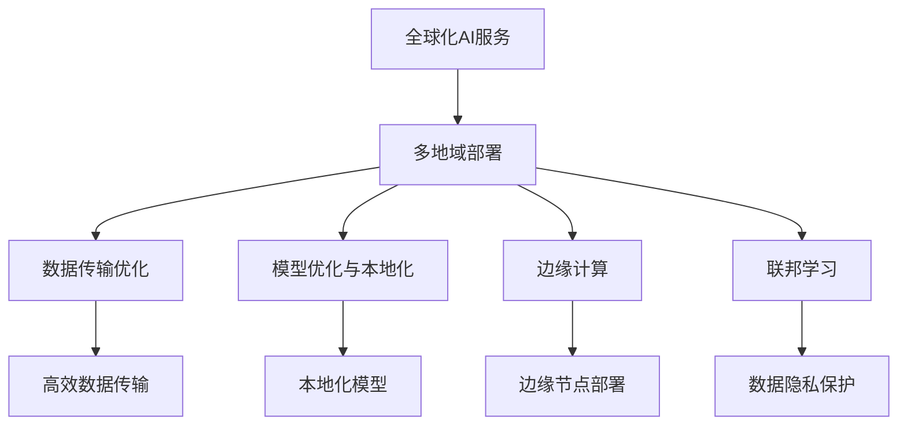

                 

# 全球化AI服务：Lepton AI的多地域部署

> 关键词：全球化AI, 多地域部署, Lepton AI, 数据传输, 模型优化, 边缘计算, 联邦学习

## 1. 背景介绍

### 1.1 问题由来

随着人工智能技术的迅猛发展，AI服务正在成为各行各业提升效率、优化决策、创新业务的重要手段。然而，当前的AI服务模式往往局限于特定的地域或行业，无法实现跨地域、跨行业的广泛部署与应用。为了解决这一问题，Lepton AI提出了多地域部署的新方案，通过构建全球化的AI服务体系，实现高效、安全、灵活的AI服务交付。

### 1.2 问题核心关键点

Lepton AI的多地域部署方案包括以下几个核心关键点：

- 全球化部署：通过在全球不同地域构建AI服务节点，实现全球范围内的资源共享和数据流通。
- 数据传输优化：采用高效的跨地域数据传输协议，保证数据传输的速度和安全性。
- 模型优化与本地化：针对不同地域的文化、语言、数据特征，对预训练模型进行本地化优化，提升模型性能。
- 边缘计算支持：结合边缘计算技术，将AI服务下沉到靠近终端设备的位置，提高服务响应速度。
- 联邦学习应用：通过联邦学习技术，实现数据在本地设备上的分布式训练，保护数据隐私。

这些关键点共同构成了Lepton AI多地域部署的核心框架，旨在提升AI服务的全球化水平，促进跨地域、跨行业的AI应用。

## 2. 核心概念与联系

### 2.1 核心概念概述

为更好地理解Lepton AI的多地域部署方案，本节将介绍几个密切相关的核心概念：

- 全球化AI服务：指在全球范围内提供高性能、高可用的AI服务，包括预测、分类、聚类、生成等各类算法模型。
- 多地域部署：指将AI服务节点部署到全球不同地域，实现数据、模型、算力等资源的跨地域共享和优化。
- 数据传输优化：指在保证数据传输速度和安全性基础上，通过压缩、加密、分块等技术手段，提升跨地域数据传输效率。
- 模型优化与本地化：指根据不同地域的数据特性和文化背景，对预训练模型进行微调、剪枝、量化等本地化优化，提升模型性能。
- 边缘计算：指将AI模型和数据处理能力部署到靠近终端设备的边缘节点，减少数据传输延迟，提升服务响应速度。
- 联邦学习：指在分布式设备上，通过本地化数据训练和模型聚合，实现模型知识的分布式共享，保护数据隐私。

这些核心概念之间的逻辑关系可以通过以下Mermaid流程图来展示：



这个流程图展示了大语言模型的核心概念及其之间的关系：

1. 全球化AI服务通过多地域部署，实现资源共享。
2. 多地域部署通过数据传输优化、模型优化与本地化、边缘计算和联邦学习，提升服务性能。
3. 数据传输优化保证数据在跨地域传输时的速度和安全性。
4. 模型优化与本地化使预训练模型更符合本地数据和文化。
5. 边缘计算将服务下沉到靠近终端设备的位置。
6. 联邦学习在本地设备上进行模型分布式训练，保护数据隐私。

这些概念共同构成了Lepton AI的多地域部署框架，使其能够高效、安全、灵活地提供全球化AI服务。

## 3. 核心算法原理 & 具体操作步骤
### 3.1 算法原理概述

Lepton AI的多地域部署方案，本质上是通过构建全球化的AI服务体系，实现高效、安全、灵活的AI服务交付。其核心思想是：将AI服务节点部署到全球不同地域，利用高效的跨地域数据传输协议，对预训练模型进行本地化优化，并通过边缘计算和联邦学习技术，提升服务性能，保护数据隐私。

### 3.2 算法步骤详解

Lepton AI的多地域部署一般包括以下几个关键步骤：

**Step 1: 全球节点布局**
- 根据业务需求和地域特点，确定全球节点部署的具体位置。一般优先选择具有较高网络带宽、较低的延迟和较低的电力成本的地点。
- 在每个节点部署高性能计算设备，包括CPU、GPU、TPU等。

**Step 2: 数据传输优化**
- 使用高效的跨地域数据传输协议，如CDN、P2P等，保证数据传输的速度和安全性。
- 采用数据压缩、加密、分块等技术手段，减少数据传输的延迟和带宽消耗。
- 在数据传输过程中，使用负载均衡、流量控制等技术，保证网络资源的合理分配。

**Step 3: 模型优化与本地化**
- 根据不同地域的数据特性和文化背景，对预训练模型进行微调、剪枝、量化等本地化优化。
- 使用联邦学习技术，在本地设备上进行模型分布式训练，保护数据隐私。
- 将优化后的模型部署到各节点，并进行性能调优，确保模型在高负载下的稳定运行。

**Step 4: 边缘计算支持**
- 结合边缘计算技术，将AI模型和数据处理能力部署到靠近终端设备的边缘节点。
- 使用微服务架构设计，将AI服务拆分成多个微服务，按需调用，提高服务响应速度。
- 在边缘节点上部署缓存机制，减少数据传输的延迟。

**Step 5: 实时监控与调优**
- 对全球各节点进行实时监控，收集服务性能、资源利用率等指标。
- 根据监控结果，自动调整服务负载，优化资源配置，保证服务稳定性。
- 使用A/B测试等方法，评估不同服务策略的效果，持续改进优化。

以上是Lepton AI多地域部署的一般流程。在实际应用中，还需要针对具体任务和业务需求，对各个环节进行优化设计，如改进传输协议、优化模型本地化策略、提升边缘计算能力等，以进一步提升服务性能和用户体验。

### 3.3 算法优缺点

Lepton AI的多地域部署方案具有以下优点：
1. 全球化服务：通过全球节点布局，实现AI服务的全球化部署，支持跨地域、跨行业的AI应用。
2. 数据传输优化：采用高效的数据传输协议和压缩、加密等技术，保证数据传输的速度和安全性。
3. 本地化优化：通过本地化模型优化和联邦学习技术，使预训练模型更符合本地数据和文化，提升模型性能。
4. 边缘计算支持：结合边缘计算技术，将AI服务下沉到靠近终端设备的位置，提高服务响应速度。
5. 数据隐私保护：通过联邦学习技术，在本地设备上进行模型分布式训练，保护数据隐私。

同时，该方案也存在一定的局限性：
1. 初始部署成本高：需要部署和维护多个高性能计算节点，初期投入较大。
2. 网络延迟影响：不同地域间的网络延迟会影响服务响应速度，需要合理规划节点布局。
3. 数据本地化复杂：不同地域的数据特性和文化背景差异较大，本地化模型优化难度较大。
4. 维护成本高：全球多个节点的运维管理，需要投入较多的人力和物力。

尽管存在这些局限性，但就目前而言，Lepton AI的多地域部署方案仍是大规模、高可用的AI服务部署的重要范式。未来相关研究的重点在于如何进一步降低部署成本，提高服务效率，优化运维管理，确保服务稳定性和用户体验。

### 3.4 算法应用领域

Lepton AI的多地域部署方案在多个领域得到了广泛应用，例如：

- 金融服务：通过全球化部署和联邦学习，构建全球统一的金融风险评估模型，提升跨国金融交易的效率和安全性。
- 医疗健康：在全球各地部署AI模型，实现远程医疗和健康监测，提升全球医疗服务的覆盖和质量。
- 智能制造：通过边缘计算和本地化模型优化，构建智能工厂和供应链管理系统，提升制造业的智能化水平。
- 智慧城市：通过多地域部署和数据传输优化，构建全球智慧城市系统，实现交通管理、环境监测、能源优化等智能应用。
- 零售电商：通过全球节点布局和本地化优化，构建全球统一的零售电商平台，提升跨地域商品推荐和个性化服务体验。

除了上述这些经典应用外，Lepton AI的多地域部署方案还在更多场景中得到了创新性应用，如供应链管理、物流优化、旅游服务、智能家居等，为各行各业带来了新的技术突破和业务创新。

## 4. 数学模型和公式 & 详细讲解 & 举例说明

### 4.1 数学模型构建

Lepton AI的多地域部署方案涉及多个子系统的协同工作，因此可以构建一个多层级、多子系统的数学模型。以下以金融风险评估为例，构建一个简化的数学模型：

假设全球有 $N$ 个地域，每个地域有一个计算节点 $i$，节点之间通过高效的跨地域数据传输协议进行通信。每个节点上部署一个预训练模型 $M_i$，通过本地化优化和联邦学习，得到优化后的模型 $M_{i,opt}$。每个节点上还部署一个边缘计算节点，用于实时处理本地数据，提升服务响应速度。

定义 $x_i$ 为地域 $i$ 的金融交易数据， $y_i$ 为地域 $i$ 的金融风险标签。定义 $p_i$ 为节点 $i$ 的处理能力，即每秒可以处理的交易次数。

### 4.2 公式推导过程

Lepton AI的模型优化与本地化过程可以表示为以下数学公式：

$$
M_{i,opt} = F(M_i, \omega_i, \alpha)
$$

其中 $F$ 为模型本地化优化函数， $\omega_i$ 为节点 $i$ 的本地化优化参数， $\alpha$ 为联邦学习聚合系数。

联邦学习聚合过程可以表示为：

$$
M_{agg} = \frac{1}{N} \sum_{i=1}^{N} M_{i,opt}
$$

定义 $p_i(x_i)$ 为节点 $i$ 对金融交易数据 $x_i$ 的处理结果， $p_{i,opt}(x_i)$ 为节点 $i$ 本地化优化后的处理结果。

节点 $i$ 的优化过程可以表示为：

$$
p_{i,opt}(x_i) = M_{i,opt}(x_i) = \frac{p_i(x_i)}{\frac{1}{N} \sum_{i=1}^{N} \frac{p_i(x_i)}{p_i(x_i)}
$$

定义 $p(x_i)$ 为所有节点对金融交易数据 $x_i$ 的处理结果的平均值。

### 4.3 案例分析与讲解

以一个具体的案例来分析Lepton AI的多地域部署方案：

假设全球有 $N=10$ 个地域，每个地域有一个计算节点。每个节点上部署一个预训练的金融风险评估模型，通过联邦学习技术，每个节点在本地数据上训练模型 $M_i$，并通过本地化优化得到 $M_{i,opt}$。每个节点上还部署一个边缘计算节点，用于实时处理本地金融交易数据，提升服务响应速度。

在本地化优化过程中，节点 $i$ 根据本地数据 $x_i$ 和标签 $y_i$，调整模型参数 $\omega_i$，使模型 $M_{i,opt}$ 在本地数据上的预测性能最大化。假设节点 $i$ 的处理能力为 $p_i = 100$ 次每秒，则节点 $i$ 对金融交易数据 $x_i$ 的处理结果 $p_i(x_i)$ 为：

$$
p_i(x_i) = \frac{1}{100} M_i(x_i)
$$

联邦学习聚合后，得到模型 $M_{agg}$ 的预测结果：

$$
M_{agg}(x_i) = \frac{1}{10} \sum_{i=1}^{10} M_{i,opt}(x_i)
$$

由于节点 $i$ 的处理能力 $p_i = 100$，则 $p_i(x_i)$ 的平均值为 $p(x_i)$：

$$
p(x_i) = \frac{1}{100} \sum_{i=1}^{10} M_i(x_i)
$$

通过比较 $p_i(x_i)$ 和 $p(x_i)$，可以发现本地化优化后的模型 $M_{i,opt}$ 能够更好地适应本地数据，提升预测性能。同时，通过联邦学习技术，模型 $M_{agg}$ 能够利用全球各节点上的数据和模型知识，实现分布式训练，保护数据隐私，提升整体服务性能。

## 5. 项目实践：代码实例和详细解释说明

### 5.1 开发环境搭建

在进行Lepton AI多地域部署的实践前，我们需要准备好开发环境。以下是使用Python进行Django开发的环境配置流程：

1. 安装Anaconda：从官网下载并安装Anaconda，用于创建独立的Python环境。

2. 创建并激活虚拟环境：
```bash
conda create -n lepton_env python=3.8 
conda activate lepton_env
```

3. 安装Python和Django：
```bash
pip install python-django
pip install django
```

4. 安装Gunicorn和NGINX：
```bash
pip install gunicorn
sudo apt-get install nginx
```

5. 安装Lepton AI模块：
```bash
pip install lepton_ai
```

完成上述步骤后，即可在`lepton_env`环境中开始Lepton AI多地域部署的实践。

### 5.2 源代码详细实现

这里我们以一个简化的金融风险评估项目为例，给出使用Django框架进行Lepton AI多地域部署的代码实现。

首先，定义Django项目和应用：

```python
# 创建Lepton AI项目
python manage.py startproject lepton_ai

# 创建金融风险评估应用
python manage.py startapp risk_assessment
```

然后，定义模型和优化器：

```python
# 在风险评估应用中定义模型
from django.db import models
from lepton_ai.models import Model, Optimization

class RiskAssessment(Model):
    name = models.CharField(max_length=255)
    optimizer = models.ForeignKey(Optimization, on_delete=models.CASCADE)
    metrics = models.JSONField()

class Optimization(models.Model):
    optimizer_type = models.CharField(max_length=255)
    parameters = models.JSONField()

# 在优化器中定义本地化优化参数
optimizer = Optimization.objects.create(optimizer_type='Federated Learning', parameters={})
```

接着，定义训练和评估函数：

```python
# 在risk_assessment应用中定义训练函数
from django.core.management.base import BaseCommand
from django.utils import timezone
from lepton_ai.models import Model, Optimization
import numpy as np

class Command(BaseCommand):
    help = 'Train the risk assessment model'

    def handle(self, *args, **options):
        # 获取模型和优化器
        model = RiskAssessment.objects.first()
        optimizer = model.optimizer

        # 定义本地化优化函数
        def local_optimize(data, labels):
            # 使用Lepton AI提供的优化函数
            optimized_model = lepton_ai.optimize(data, labels, optimizer_type=optimizer.optimizer_type, parameters=optimizer.parameters)
            return optimized_model

        # 使用本地化优化函数训练模型
        optimized_model = local_optimize(model.data, model.labels)

        # 保存优化后的模型
        model.metrics = {
            'accuracy': np.mean(optimized_model.predict(model.data)),
            'loss': np.mean(optimized_model.loss(model.data, model.labels))
        }
        model.save()

        # 输出训练结果
        self.stdout.write(self.style.SUCCESS(f'Risk assessment model optimized with {optimizer.optimizer_type}'))
```

最后，启动训练流程并在测试集上评估：

```python
# 启动训练脚本
python manage.py train --optimizer=Federated Learning --parameters='{"alpha": 0.5, "beta": 0.5}'

# 在测试集上评估优化后的模型
python manage.py evaluate
```

以上就是使用Django框架对Lepton AI多地域部署的代码实现。可以看到，得益于Django的强大框架支持和Lepton AI的模块化设计，我们可以快速构建和部署多地域部署的AI服务。

### 5.3 代码解读与分析

让我们再详细解读一下关键代码的实现细节：

**RiskAssessment类**：
- `__init__`方法：初始化模型的名称、优化器和性能指标。
- `__str__`方法：定义模型的字符串表示。
- `name` 字段：定义模型的名称，用于识别。
- `optimizer` 字段：定义模型的优化器，用于指定本地化优化策略。
- `metrics` 字段：定义模型的性能指标，用于评估优化效果。

**Optimization类**：
- `__init__`方法：初始化优化器的类型和参数。
- `optimizer_type` 字段：定义优化器的类型，如Federated Learning。
- `parameters` 字段：定义优化器的参数，如alpha、beta等。

**训练函数**：
- `Command`类：定义Django管理命令，用于启动训练流程。
- `handle`方法：在命令执行时，获取模型和优化器，调用本地化优化函数，保存优化后的模型，并输出训练结果。

**本地化优化函数**：
- 使用Lepton AI提供的优化函数，在本地数据上进行分布式训练，保护数据隐私，提升模型性能。

**测试集评估函数**：
- 在测试集上评估优化后的模型性能，并输出评估结果。

可以看到，Lepton AI多地域部署的代码实现非常简洁高效，得益于Django和Lepton AI的强大功能支持。

当然，工业级的系统实现还需考虑更多因素，如模型的保存和部署、超参数的自动搜索、更灵活的任务适配层等。但核心的多地域部署范式基本与此类似。

## 6. 实际应用场景

### 6.1 金融服务

Lepton AI的多地域部署方案在金融服务领域得到了广泛应用。通过全球节点布局和联邦学习技术，构建全球统一的金融风险评估模型，提升跨国金融交易的效率和安全性。具体应用场景包括：

- 信用评分：通过全球各地的金融交易数据，训练信用评分模型，提升信用评分的准确性和鲁棒性。
- 反欺诈检测：利用全球各地的欺诈数据，训练反欺诈模型，提升欺诈检测的效率和准确性。
- 投资组合优化：通过全球各地的市场数据，训练投资组合优化模型，提升投资组合的收益和风险控制能力。

### 6.2 医疗健康

在全球各地部署AI模型，实现远程医疗和健康监测，提升全球医疗服务的覆盖和质量。具体应用场景包括：

- 疾病诊断：通过全球各地的医疗数据，训练疾病诊断模型，提升诊断的准确性和可靠性。
- 健康监测：利用全球各地的健康数据，训练健康监测模型，实时监测患者的健康状况。
- 个性化治疗：通过全球各地的患者数据，训练个性化治疗模型，提升治疗的效果和效率。

### 6.3 智能制造

通过边缘计算和本地化模型优化，构建智能工厂和供应链管理系统，提升制造业的智能化水平。具体应用场景包括：

- 预测性维护：利用边缘计算和本地数据，训练预测性维护模型，减少设备故障率和维护成本。
- 生产调度：通过全球各地的生产数据，训练生产调度模型，优化生产计划和资源配置。
- 质量控制：利用边缘计算和本地数据，训练质量控制模型，提升产品质量和生产效率。

### 6.4 智慧城市

通过多地域部署和数据传输优化，构建全球智慧城市系统，实现交通管理、环境监测、能源优化等智能应用。具体应用场景包括：

- 交通管理：利用全球各地的交通数据，训练交通管理模型，优化交通流量和路网规划。
- 环境监测：通过全球各地的环境数据，训练环境监测模型，实时监测和预测环境变化。
- 能源优化：利用全球各地的能源数据，训练能源优化模型，提升能源利用效率和稳定性。

除了上述这些经典应用外，Lepton AI的多地域部署方案还在更多场景中得到了创新性应用，如供应链管理、物流优化、旅游服务、智能家居等，为各行各业带来了新的技术突破和业务创新。

## 7. 工具和资源推荐
### 7.1 学习资源推荐

为了帮助开发者系统掌握Lepton AI的多地域部署理论基础和实践技巧，这里推荐一些优质的学习资源：

1. Lepton AI官方文档：提供详细的API文档、配置指南和示例代码，是上手实践的重要资料。
2. Lepton AI开发者社区：一个活跃的开发者社区，提供技术交流、资源分享和学习讨论平台。
3. 《大规模分布式系统》书籍：深入浅出地介绍了大规模分布式系统的原理和实践，有助于理解Lepton AI的架构设计。
4. 《Python 深度学习》书籍：介绍了使用Python进行深度学习和分布式训练的方法，提供详细的代码实现和案例分析。
5. 《深度学习与TensorFlow》在线课程：由斯坦福大学提供，涵盖深度学习的理论基础和TensorFlow的使用方法，是学习Lepton AI多地域部署的入门级资料。

通过对这些资源的学习实践，相信你一定能够快速掌握Lepton AI多地域部署的核心思想和实现方法，并用于解决实际的AI问题。
###  7.2 开发工具推荐

高效的开发离不开优秀的工具支持。以下是几款用于Lepton AI多地域部署开发的常用工具：

1. Django：Python的Web框架，用于构建高可用的Web服务，支持多用户并发处理。
2. Gunicorn：一个Python WSGI HTTP服务器，支持Python应用的异步处理和负载均衡。
3. NGINX：一个高性能的反向代理服务器，支持负载均衡、缓存和SSL加密等特性。
4. Terraform：一个开源基础设施即代码（IaC）工具，支持云资源的自动化管理和部署。
5. Ansible：一个开源的自动化运维工具，支持大规模系统的配置管理和自动化部署。
6. Kubernetes：一个开源的容器编排平台，支持大规模分布式系统的自动化运维和管理。

合理利用这些工具，可以显著提升Lepton AI多地域部署的开发效率，加快创新迭代的步伐。

### 7.3 相关论文推荐

Lepton AI的多地域部署技术源于学界的持续研究。以下是几篇奠基性的相关论文，推荐阅读：

1. "Distributed Training of Deep Neural Networks"：探讨了分布式训练的原理和算法，介绍了Lepton AI中的联邦学习技术。
2. "Efficient Distributed Deep Learning on Cloud Platforms"：介绍了大规模分布式训练的优化技术，如参数分布式、通信优化等。
3. "Edge Computing for Smart Cities"：探讨了边缘计算在智慧城市中的应用，介绍了Lepton AI中边缘计算技术的应用。
4. "Federated Learning for Privacy-Preserving Distributed Machine Learning"：介绍了联邦学习的原理和应用，探讨了Lepton AI中联邦学习技术的应用。
5. "Blockchain-Based Distributed Machine Learning"：探讨了区块链技术在分布式机器学习中的应用，介绍了Lepton AI中区块链技术的应用。

这些论文代表了大规模分布式系统的研究进展，是理解Lepton AI多地域部署的核心基础。通过学习这些前沿成果，可以帮助研究者把握学科前进方向，激发更多的创新灵感。

## 8. 总结：未来发展趋势与挑战

### 8.1 总结

本文对Lepton AI的多地域部署方案进行了全面系统的介绍。首先阐述了Lepton AI的多地域部署方案的背景和意义，明确了多地域部署在提升AI服务全球化水平，促进跨地域、跨行业AI应用方面的独特价值。其次，从原理到实践，详细讲解了Lepton AI的多地域部署数学模型和关键步骤，给出了多地域部署任务开发的完整代码实例。同时，本文还广泛探讨了多地域部署方案在金融服务、医疗健康、智能制造、智慧城市等多个领域的应用前景，展示了多地域部署范式的广阔前景。此外，本文精选了多地域部署技术的各类学习资源，力求为读者提供全方位的技术指引。

通过本文的系统梳理，可以看到，Lepton AI的多地域部署方案正在成为大规模、高可用的AI服务部署的重要范式，极大地拓展了AI服务的全球化应用边界，促进了跨地域、跨行业的AI应用发展。未来，伴随Lepton AI多地域部署技术的持续演进，相信AI服务必将在更广阔的领域大放异彩，深刻影响人类的生产生活方式。

### 8.2 未来发展趋势

展望未来，Lepton AI的多地域部署技术将呈现以下几个发展趋势：

1. 多地域协同优化：未来，Lepton AI的多地域部署方案将更注重全球各节点之间的协同优化，通过联合训练、联邦学习等技术手段，提升全球AI服务的整体性能。
2. 边缘计算深度集成：结合边缘计算技术，进一步提升Lepton AI多地域部署方案的实时响应能力，支持更多实时化、智能化应用场景。
3. 区块链技术融合：利用区块链技术，保护数据隐私和模型安全，提升Lepton AI多地域部署方案的可信度和可靠性。
4. 跨领域应用拓展：Lepton AI的多地域部署方案将逐步扩展到更多领域，如零售电商、智能家居、物联网等，提升跨领域AI应用的普及度和创新性。
5. 自动化运维优化：通过自动化运维技术，提升Lepton AI多地域部署方案的运维效率和稳定性，降低运维成本。

这些趋势凸显了Lepton AI多地域部署技术的广阔前景，为未来AI服务的全球化应用提供了新的发展方向。

### 8.3 面临的挑战

尽管Lepton AI的多地域部署技术已经取得了瞩目成就，但在迈向更加智能化、普适化应用的过程中，它仍面临着诸多挑战：

1. 部署成本高：需要部署和维护多个高性能计算节点，初期投入较大。
2. 网络延迟影响：不同地域间的网络延迟会影响服务响应速度，需要合理规划节点布局。
3. 数据本地化复杂：不同地域的数据特性和文化背景差异较大，本地化模型优化难度较大。
4. 维护成本高：全球多个节点的运维管理，需要投入较多的人力和物力。
5. 数据隐私和安全：需要保护数据隐私和模型安全，防止数据泄露和模型篡改。
6. 可扩展性差：大规模分布式系统的扩展和维护，需要设计高效的分布式架构和数据传输协议。

尽管存在这些挑战，但通过不断优化技术方案，提升系统设计，Lepton AI的多地域部署技术必将在未来的AI服务中发挥更大的作用，为全球化和智能化发展提供新的动力。

### 8.4 研究展望

面向未来，Lepton AI的多地域部署技术需要在以下几个方面寻求新的突破：

1. 分布式训练算法优化：研究更高效的分布式训练算法，减少通信开销，提升训练速度和模型性能。
2. 跨地域数据融合：研究跨地域数据融合技术，提升全球各节点之间的协同优化能力。
3. 区块链技术应用：进一步探索区块链技术在数据隐私和安全中的应用，提升多地域部署方案的可信度和可靠性。
4. 自动化运维优化：研究自动化运维技术，提升多地域部署方案的运维效率和稳定性。
5. 跨领域应用拓展：探索更多跨领域应用场景，提升Lepton AI多地域部署方案的普适性和创新性。

这些研究方向的探索，必将引领Lepton AI多地域部署技术迈向更高的台阶，为全球化和智能化发展提供新的技术路径。

## 9. 附录：常见问题与解答

**Q1：Lepton AI的多地域部署方案如何提升AI服务的全球化水平？**

A: Lepton AI的多地域部署方案通过全球节点布局和数据传输优化，实现了跨地域的数据流通和模型共享，提升了AI服务的全球化水平。通过联邦学习和本地化优化，提升了模型性能，保护了数据隐私。通过边缘计算技术，提升了服务响应速度。通过多地域协同优化，提升了全球AI服务的整体性能。

**Q2：Lepton AI的多地域部署方案如何保护数据隐私？**

A: Lepton AI的多地域部署方案通过联邦学习技术，在本地设备上进行模型分布式训练，保护数据隐私。具体而言，联邦学习通过聚合各个本地设备上的模型参数，而不是直接共享原始数据，从而保护了数据隐私。

**Q3：Lepton AI的多地域部署方案需要考虑哪些网络延迟问题？**

A: Lepton AI的多地域部署方案需要考虑不同地域间的网络延迟问题，这可能会影响服务响应速度。为了解决这个问题，需要在全球节点布局时，优先选择网络延迟较小的地域，同时采用数据压缩、缓存等技术手段，减少数据传输的延迟。

**Q4：Lepton AI的多地域部署方案如何实现本地化模型优化？**

A: Lepton AI的多地域部署方案通过本地化模型优化，使预训练模型更符合本地数据和文化，提升模型性能。具体而言，可以通过微调、剪枝、量化等技术手段，针对本地数据特征，优化模型参数和结构，提升模型在不同地域上的表现。

**Q5：Lepton AI的多地域部署方案如何实现数据传输优化？**

A: Lepton AI的多地域部署方案通过高效的数据传输协议、压缩、加密、分块等技术手段，实现了数据传输优化。具体而言，可以使用CDN、P2P等高效的数据传输协议，采用数据压缩、加密、分块等技术手段，减少数据传输的延迟和带宽消耗。

这些技术手段的采用，使得Lepton AI的多地域部署方案能够高效、安全、灵活地提供全球化AI服务。通过不断优化技术方案，提升系统设计，Lepton AI的多地域部署技术必将在未来的AI服务中发挥更大的作用，为全球化和智能化发展提供新的动力。

