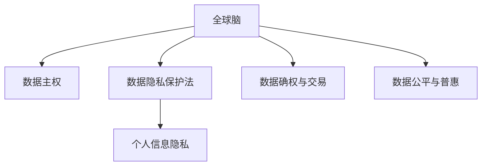

                 

# 全球脑与个人数据主权:信息时代的数据权益保护法

## 1. 背景介绍

### 1.1 问题由来
在信息时代，数据成为了一种重要的资源和资产，影响着全球经济、政治、文化等多个层面。然而，随着大数据、人工智能等技术的飞速发展，个人信息安全和个人数据主权问题也日益凸显。尤其在全球化背景下，个人信息跨界流动频繁，数据隐私和权益保护面临前所未有的挑战。

当前，全球脑（Global Brain）概念的提出，为解决这一问题提供了新的思路。全球脑，即人类社会作为一个整体的数据智能系统，通过信息流动和处理实现全球协同智能。在这个过程中，如何保障个人数据主权，成为亟待解决的难题。

### 1.2 问题核心关键点
全球脑下，数据流动频繁且跨界性强，个人信息隐私和权益保护难度极大。因此，本文聚焦于个人数据主权的问题，探讨如何在信息时代，通过法律和技术手段，保障个人信息的自由和控制权。

本文将详细讨论全球脑下个人数据主权的法律、技术、伦理等多维度的保护措施，希望为全球智能治理提供新的视角和解决方案。

## 2. 核心概念与联系

### 2.1 核心概念概述

为了更好地理解全球脑下个人数据主权问题，本节将介绍几个密切相关的核心概念：

- 全球脑（Global Brain）：人类社会作为一个整体的数据智能系统，通过信息流动和处理实现全球协同智能。

- 数据主权（Data Sovereignty）：个人对其数据资源的所有权和控制权，包括数据的收集、存储、处理、传输和使用等各个环节。

- 个人信息隐私（Personal Information Privacy）：保护个人数据不被非授权访问、使用和泄露，保障个人隐私权和尊严。

- 数据隐私保护法（Data Privacy Law）：以立法形式规定个人数据隐私权利和义务的法律框架，如欧盟的GDPR、美国的CCPA等。

- 数据确权与交易（Data Rights & Trading）：通过明确数据权利和建立数据交易市场，合理配置数据资源，激发数据价值。

- 数据公平与普惠（Data Fairness & Inclusion）：在数据治理中确保不同群体、不同地区的平等权益，避免数据鸿沟。

这些核心概念之间的逻辑关系可以通过以下Mermaid流程图来展示：



这个流程图展示了一些核心概念及其之间的联系：

1. 全球脑通过数据流动实现协同智能。
2. 数据主权是全球脑下个人数据的重要保障。
3. 数据隐私保护法为数据主权提供了法律保障。
4. 数据确权与交易使得数据主权在经济层面得以体现。
5. 数据公平与普惠则体现了数据治理中的社会公平性。

这些概念共同构成了全球脑下个人数据主权的法律、技术和伦理框架，为保障个人数据权益提供了全面的视角。

## 3. 核心算法原理 & 具体操作步骤
### 3.1 算法原理概述

在全球脑下，个人数据主权的保护问题，可以通过数据隐私保护法和技术手段来解决。具体而言，隐私保护法通过法律途径明确数据主权，而技术手段则通过数据加密、数据匿名化等方法，保障数据安全和隐私。

隐私保护法的基本原理是：
1. 数据收集前必须获得个人同意。
2. 数据使用必须遵循最小化原则，只收集和使用必要的数据。
3. 数据存储和传输必须采取加密措施。
4. 数据访问和使用必须受限于明确的授权。
5. 数据主体有权撤回同意和删除其数据。

技术手段则通过以下方法实现数据隐私保护：
1. 数据加密：通过加密算法保护数据，确保数据在存储和传输过程中的安全性。
2. 数据匿名化：去除或屏蔽个人身份信息，保护数据隐私。
3. 差分隐私：在数据分析和处理过程中，添加噪声或扰动数据，防止数据泄露。
4. 区块链：通过去中心化存储和透明交易记录，确保数据安全性和隐私性。
5. 联邦学习：通过本地训练和模型共享，避免数据集中存储和处理，保障数据隐私。

### 3.2 算法步骤详解

以下是全球脑下个人数据主权保护的具体操作步骤：

**Step 1: 制定隐私保护法**

- 明确个人数据权利：包括知情权、同意权、访问权、修正权、删除权、隐私权等。
- 规定数据收集和使用的原则：最小化、目的明确、数据质量、安全保护等。
- 设立数据保护官（DPO）：负责监督和实施隐私保护政策，处理数据主体投诉。
- 建立数据跨境流动机制：通过数据保护协定或数据保护令，规范跨国数据流动。

**Step 2: 实施技术保护措施**

- 数据加密：采用AES、RSA等加密算法，保护数据传输和存储。
- 数据匿名化：使用伪匿名化、假名化、去标识化等方法，去除个人身份信息。
- 差分隐私：在数据分析前，添加噪声，保证数据隐私性。
- 区块链：使用分布式账本技术，确保数据透明性和不可篡改性。
- 联邦学习：各节点本地训练模型，通过模型聚合和差分更新，实现模型共享和隐私保护。

**Step 3: 监测和评估**

- 定期审计：评估隐私保护措施的有效性，识别潜在风险和漏洞。
- 行为监控：对数据访问和使用行为进行监控，确保合规性。
- 用户反馈：收集数据主体的反馈，持续改进隐私保护措施。

**Step 4: 法律和技术融合**

- 法律和技术手段互补：通过法律明确数据主权和技术手段保障数据隐私，形成合力。
- 动态调整：根据技术发展和社会需求，适时调整隐私保护政策和技术手段。
- 多方合作：政府、企业、研究机构、公众等共同参与，推动数据隐私保护进步。

### 3.3 算法优缺点

全球脑下个人数据主权保护的方法，具有以下优点：
1. 法律明确：隐私保护法为数据主权提供了法律保障，使数据隐私保护有法可依。
2. 技术先进：通过技术手段保障数据隐私，如数据加密、差分隐私等，提升了数据安全性。
3. 多方合作：政府、企业和公众共同参与，形成合力，提升数据隐私保护效果。
4. 动态调整：根据技术发展和社会需求，适时调整隐私保护政策，保持政策的先进性和适应性。

同时，该方法也存在一定的局限性：
1. 法律复杂：隐私保护法需要复杂的立法和监管机制，涉及多部门协作。
2. 技术成本高：高级加密算法、差分隐私等技术，需要较高的计算资源和维护成本。
3. 用户信任度：用户可能对技术手段产生信任度不足，难以有效实施。
4. 跨国执法：跨国数据流动下，法律和技术的适用性受到限制，难以统一执行。

尽管存在这些局限性，但就目前而言，法律和技术手段的结合，仍是全球脑下个人数据主权保护的最佳途径。未来相关研究需继续优化法律和技术框架，提高隐私保护效果。

### 3.4 算法应用领域

全球脑下个人数据主权保护的方法，已在诸多领域得到应用，例如：

- 金融领域：如银行业务、金融科技等，通过加密、差分隐私等技术，保护用户数据隐私。
- 医疗领域：如电子健康记录（EHR）、远程医疗等，通过匿名化和联邦学习，保护患者隐私。
- 互联网公司：如社交网络、电子商务等，通过数据加密和差分隐私，保护用户数据。
- 政府部门：如公共安全、智慧城市等，通过数据匿名化和区块链，保护政府数据。
- 科研机构：如数据科学、人工智能等，通过数据共享和隐私保护，促进科研合作。

除了上述这些经典应用外，全球脑下个人数据主权保护的方法还将在更多领域得到应用，如能源、物流、交通等，推动各行业的智能化进程。

## 4. 数学模型和公式 & 详细讲解 & 举例说明
### 4.1 数学模型构建

本节将使用数学语言对全球脑下个人数据主权保护的方法进行更加严格的刻画。

记个人数据集为 $D=\{(x_i,y_i)\}_{i=1}^N, x_i \in \mathcal{X}, y_i \in \mathcal{Y}$。假设隐私保护法为 $L$，技术手段为 $T$，数据主体为 $M$，数据收集者为 $R$。

定义数据主权 $\mathcal{S}(D)$ 为数据集 $D$ 中个人数据的所有权和控制权。

隐私保护法 $L$ 为对数据主权 $\mathcal{S}(D)$ 进行法律保护的政策集合。

技术手段 $T$ 为对数据主权 $\mathcal{S}(D)$ 进行技术保护的措施集合。

数据主体 $M$ 为对数据主权 $\mathcal{S}(D)$ 进行管理和使用的实体。

数据收集者 $R$ 为收集和管理数据 $D$ 的实体。

数据流向 $\mathcal{F}(D)$ 为数据 $D$ 在数据主体 $M$ 和数据收集者 $R$ 之间的流动。

### 4.2 公式推导过程

以下我们以差分隐私为例，推导数据隐私保护的技术细节。

定义数据集 $D$ 的差分隐私 $\epsilon$-隐私，表示在加入随机噪声后，任意两个相邻的数据集产生的概率差异小于 $\frac{\epsilon}{2}$。差分隐私的数学形式为：

$$
\mathcal{L}_{DP}(D) = \{f: f(D) \approx f(D')\} \quad \text{if} \quad \|D - D'\|_1 \leq \frac{\epsilon}{\Delta}
$$

其中 $\|D - D'\|_1$ 表示数据集的L1距离，$\Delta$ 为数据的变化量，$\epsilon$ 为隐私参数，即隐私保护的目标。

根据差分隐私的定义，差分隐私的保护策略为在数据分析和处理前，向数据添加随机噪声。具体来说，对于任意两个相邻的数据集 $D$ 和 $D'$，其保护形式为：

$$
\Pr[f(D) = f(D')] \leq e^{-\epsilon}
$$

这意味着，在加入随机噪声后，任何两个相邻的数据集产生的概率差异小于 $\frac{\epsilon}{2}$，从而保护了数据隐私。

### 4.3 案例分析与讲解

假设某金融科技公司需要分析用户交易数据，以进行风险评估。该公司对用户数据进行了差分隐私处理，具体步骤如下：

1. 数据收集：公司收集用户交易数据 $D$，包括用户ID、交易金额、交易时间等。
2. 数据匿名化：公司对用户ID进行去标识化处理，将用户ID替换为随机标识符，防止数据泄露。
3. 数据分析：公司对匿名化后的数据进行统计分析，生成风险评估模型。
4. 差分隐私：公司向数据添加随机噪声，确保风险评估结果的隐私性。

差分隐私处理的具体算法为：
- 对每个数据点 $x_i$，生成一个随机噪声 $N(x_i)$。
- 将原始数据 $x_i$ 与随机噪声 $N(x_i)$ 相加，生成新的数据 $x_i' = x_i + N(x_i)$。
- 用新的数据 $x_i'$ 进行数据分析和建模。

通过差分隐私处理，该公司可以在保护用户隐私的同时，获得风险评估的可靠数据。

## 5. 项目实践：代码实例和详细解释说明
### 5.1 开发环境搭建

在进行全球脑下个人数据主权保护的项目实践前，我们需要准备好开发环境。以下是使用Python进行PyTorch开发的环境配置流程：

1. 安装Anaconda：从官网下载并安装Anaconda，用于创建独立的Python环境。

2. 创建并激活虚拟环境：
```bash
conda create -n pytorch-env python=3.8 
conda activate pytorch-env
```

3. 安装PyTorch：根据CUDA版本，从官网获取对应的安装命令。例如：
```bash
conda install pytorch torchvision torchaudio cudatoolkit=11.1 -c pytorch -c conda-forge
```

4. 安装TensorFlow：
```bash
pip install tensorflow==2.7
```

5. 安装各类工具包：
```bash
pip install numpy pandas scikit-learn matplotlib tqdm jupyter notebook ipython
```

完成上述步骤后，即可在`pytorch-env`环境中开始项目实践。

### 5.2 源代码详细实现

下面我们以差分隐私为例，给出使用TensorFlow实现差分隐私处理的Python代码实现。

首先，定义差分隐私模型：

```python
import tensorflow as tf

def DP_model(inputs, noise_std, epsilon):
    """计算差分隐私"""
    diff_privacy = tf.add_n(tf.square(inputs)) * noise_std
    return tf.sqrt(diff_privacy) + epsilon
```

然后，定义数据生成和处理函数：

```python
def generate_data(n):
    """生成n个随机数据"""
    x = tf.random.uniform([n])
    y = tf.sin(x)
    return x, y

def process_data(x, y, noise_std, epsilon):
    """对数据进行差分隐私处理"""
    y DP = DP_model(y, noise_std, epsilon)
    return x, y DP
```

接着，启动差分隐私处理流程：

```python
n = 100
x, y = generate_data(n)

noise_std = 0.1
epsilon = 0.1

x DP, y DP = process_data(x, y, noise_std, epsilon)

print(x DP, y DP)
```

以上就是使用TensorFlow实现差分隐私处理的完整代码实现。可以看到，差分隐私处理的基本思路是通过向数据添加随机噪声，保护数据隐私。

### 5.3 代码解读与分析

让我们再详细解读一下关键代码的实现细节：

**DP_model函数**：
- 计算差分隐私，具体公式为 $y_{DP} = y + N(y)$，其中 $N(y)$ 为标准正态分布的随机噪声。

**generate_data函数**：
- 生成n个随机数据点，用于差分隐私处理。

**process_data函数**：
- 对生成数据进行差分隐私处理，将原始数据 $y$ 加上噪声 $N(y)$，得到差分隐私后的数据 $y_{DP}$。

**启动差分隐私处理流程**：
- 定义噪声标准差和隐私参数。
- 调用generate_data函数生成数据。
- 调用process_data函数对数据进行差分隐私处理。

可以看到，差分隐私处理的基本流程为：生成随机噪声、将噪声添加到原始数据中，从而实现数据隐私保护。通过调整噪声标准差和隐私参数，可以控制隐私保护的程度和效果。

当然，工业级的系统实现还需考虑更多因素，如模型的保存和部署、超参数的自动搜索、更灵活的任务适配层等。但核心的差分隐私范式基本与此类似。

## 6. 实际应用场景
### 6.1 智能医疗系统

全球脑下，智能医疗系统对患者数据的隐私保护尤为重要。传统的医疗系统依赖医生手动记录和分析，存在数据泄露和误诊风险。基于差分隐私等技术的智能医疗系统，可以自动收集、分析患者数据，提升医疗服务的智能化水平，同时保障患者隐私。

具体而言，智能医疗系统可以通过差分隐私处理患者电子健康记录（EHR），在保护隐私的前提下，进行疾病预测、药物推荐、治疗方案优化等。患者可以随时查看自己的隐私保护状态，确保数据安全。

### 6.2 电子商务平台

全球脑下，电子商务平台依赖大量用户数据进行精准营销和个性化推荐。传统平台通过集中存储用户数据，存在数据泄露风险。基于差分隐私等技术的电子商务平台，可以在保护用户隐私的同时，进行数据分析和推荐，提升用户体验和转化率。

具体而言，平台可以在用户数据上应用差分隐私处理，生成匿名化的用户画像。通过对匿名化的用户数据进行分析，平台可以生成个性化的广告和推荐，提升用户满意度和留存率。同时，用户可以随时查看自己的隐私保护状态，确保数据安全。

### 6.3 智慧城市治理

全球脑下，智慧城市治理依赖大量传感器和监控设备，收集城市数据。传统治理系统存在数据集中存储和处理的风险，数据隐私问题严重。基于差分隐私等技术的智慧城市治理系统，可以在保护数据隐私的前提下，进行城市管理、环境监测、应急响应等，提升城市治理的智能化水平。

具体而言，系统可以通过差分隐私处理城市监控数据，生成匿名化的监控图像。通过对匿名化的数据进行分析，系统可以生成城市治理的决策支持信息，提升城市管理的效率和效果。同时，公众可以随时查看自己的隐私保护状态，确保数据安全。

### 6.4 未来应用展望

随着差分隐私等技术的不断发展，全球脑下个人数据主权保护将呈现以下几个发展趋势：

1. 技术多样性。除了差分隐私外，未来将出现更多隐私保护技术，如联邦学习、零知识证明等，为数据隐私保护提供更多选择。

2. 多方协作。隐私保护需要政府、企业、研究机构、公众等共同参与，形成合力，推动隐私保护技术的发展和应用。

3. 全球标准。全球脑下，隐私保护需要统一的国际标准，协调不同地区和国家的数据保护政策。

4. 隐私经济。通过明确数据权利和建立数据交易市场，促进数据资源的合理配置和利用，激发数据价值。

5. 伦理引导。在数据隐私保护中引入伦理导向的评估指标，防止数据滥用，保障数据公平和普惠。

以上趋势凸显了全球脑下个人数据主权保护的广阔前景。这些方向的探索发展，必将进一步提升数据隐私保护效果，保障个人数据权益。

## 7. 工具和资源推荐
### 7.1 学习资源推荐

为了帮助开发者系统掌握全球脑下个人数据主权保护的理论基础和实践技巧，这里推荐一些优质的学习资源：

1. 《数据隐私保护与差分隐私》系列博文：由数据隐私保护专家撰写，深入浅出地介绍了隐私保护的基本概念和技术细节。

2. CS224W《隐私保护》课程：斯坦福大学开设的隐私保护课程，有Lecture视频和配套作业，带你入门隐私保护的基本概念和技术方法。

3. 《数据隐私保护实战指南》书籍：该书系统介绍了数据隐私保护的理论和实践，包括差分隐私、联邦学习、区块链等技术。

4. IEEE Xplore：IEEE的权威数据库，提供大量的隐私保护论文和研究成果，是系统学习隐私保护的重要资源。

5. Coursera《数据隐私保护》课程：Coursera提供的隐私保护课程，涵盖隐私保护的基本概念、技术实现和应用场景。

通过对这些资源的学习实践，相信你一定能够快速掌握全球脑下个人数据主权的保护精髓，并用于解决实际的隐私保护问题。

### 7.2 开发工具推荐

高效的开发离不开优秀的工具支持。以下是几款用于数据隐私保护开发的常用工具：

1. TensorFlow：由Google主导开发的开源深度学习框架，生产部署方便，适合大规模工程应用。

2. PyTorch：基于Python的开源深度学习框架，灵活动态的计算图，适合快速迭代研究。

3. Apache Kafka：高性能的消息队列系统，用于数据流处理和传输。

4. Apache Spark：大规模数据处理框架，支持分布式计算和数据处理。

5. AWS Kinesis：亚马逊提供的流数据处理服务，支持实时数据流处理和分析。

6. Elasticsearch：分布式搜索引擎，支持大数据查询和分析。

合理利用这些工具，可以显著提升数据隐私保护任务的开发效率，加快创新迭代的步伐。

### 7.3 相关论文推荐

数据隐私保护的研究源于学界的持续研究。以下是几篇奠基性的相关论文，推荐阅读：

1. "Differential Privacy" by Cynthia Dwork, Frank McSherry, Abhi Nissim and Kobbi Pearl：差分隐私的奠基之作，阐述了差分隐私的基本原理和技术细节。

2. "Federated Learning: Concepts, Architectures, Applications, and Open Challenges" by Jialan Zhao, Jianfeng Gao, Huan Zhang, Jianpeng Wei, Changsheng Chen, and Jing Lin：系统介绍了联邦学习的基本概念和应用场景，探讨了联邦学习面临的挑战。

3. "Blockchain and Privacy" by Ross Kienzle and Balint Kiss：阐述了区块链技术在数据隐私保护中的应用，探讨了区块链的优势和挑战。

4. "Privacy-Preserving Data Analysis: An Overview" by S. Qin, G. Yang, G. Wang, Z. Zhang, and W. Wang：系统介绍了隐私保护技术的基本概念和方法，探讨了隐私保护的应用场景。

5. "Towards a Global Privacy Framework: Challenges and Opportunities for Privacy in the Age of Global Brain" by M. Zubair, J. J. Tomkins, and S. Yan：探讨了全球脑下隐私保护面临的挑战和机遇，提出了隐私保护的全球治理框架。

这些论文代表了大数据隐私保护的研究脉络。通过学习这些前沿成果，可以帮助研究者把握学科前进方向，激发更多的创新灵感。

## 8. 总结：未来发展趋势与挑战
### 8.1 总结

本文对全球脑下个人数据主权的问题进行了全面系统的介绍。首先阐述了全球脑下数据流动频繁和个人数据隐私保护的难点，明确了数据隐私保护的重要性和紧迫性。其次，从法律和技术角度，详细讲解了全球脑下个人数据主权的保护措施，提供了差分隐私等技术的实现细节。同时，本文还探讨了全球脑下个人数据主权的实际应用场景，展示了差分隐私等技术在智能医疗、电子商务、智慧城市等领域的巨大潜力。此外，本文精选了隐私保护的学习资源、开发工具和相关论文，力求为读者提供全方位的技术指引。

通过本文的系统梳理，可以看到，全球脑下个人数据主权的保护是数据智能系统发展的重要基础，数据隐私保护技术在各个领域都有广泛的应用前景。面对数据隐私保护面临的种种挑战，未来的研究需要在法律、技术、伦理等多个方面寻求新的突破，以构建安全、可靠、公平、普惠的数据智能系统。

### 8.2 未来发展趋势

展望未来，全球脑下个人数据主权保护将呈现以下几个发展趋势：

1. 技术多样性。未来将出现更多隐私保护技术，如联邦学习、零知识证明等，为数据隐私保护提供更多选择。

2. 多方协作。隐私保护需要政府、企业、研究机构、公众等共同参与，形成合力，推动隐私保护技术的发展和应用。

3. 全球标准。全球脑下，隐私保护需要统一的国际标准，协调不同地区和国家的数据保护政策。

4. 隐私经济。通过明确数据权利和建立数据交易市场，促进数据资源的合理配置和利用，激发数据价值。

5. 伦理引导。在数据隐私保护中引入伦理导向的评估指标，防止数据滥用，保障数据公平和普惠。

以上趋势凸显了全球脑下个人数据主权保护的广阔前景。这些方向的探索发展，必将进一步提升数据隐私保护效果，保障个人数据权益。

### 8.3 面临的挑战

尽管全球脑下个人数据主权保护技术已经取得了一定进展，但在迈向更加智能化、普适化应用的过程中，仍面临诸多挑战：

1. 法律复杂性。隐私保护法需要复杂的立法和监管机制，涉及多部门协作，难以统一执行。

2. 技术成本高。高级加密算法、差分隐私等技术，需要较高的计算资源和维护成本。

3. 用户信任度。用户可能对技术手段产生信任度不足，难以有效实施。

4. 跨国执法。跨国数据流动下，法律和技术的适用性受到限制，难以统一执行。

5. 数据泄露风险。差分隐私等技术无法完全消除数据泄露风险，需要结合其他技术手段进行补充。

尽管存在这些挑战，但就目前而言，法律和技术手段的结合，仍是全球脑下个人数据主权保护的最佳途径。未来相关研究需继续优化法律和技术框架，提高隐私保护效果。

### 8.4 研究展望

面对全球脑下个人数据主权保护所面临的挑战，未来的研究需要在以下几个方面寻求新的突破：

1. 探索无监督和半监督隐私保护方法。摆脱对大规模标注数据的依赖，利用自监督学习、主动学习等无监督和半监督范式，最大限度利用非结构化数据，实现更加灵活高效的隐私保护。

2. 研究参数高效和计算高效的隐私保护范式。开发更加参数高效的隐私保护方法，在固定大部分隐私参数的同时，只更新极少量的任务相关参数。同时优化隐私保护模型的计算图，减少前向传播和反向传播的资源消耗，实现更加轻量级、实时性的部署。

3. 引入更多先验知识。将符号化的先验知识，如知识图谱、逻辑规则等，与隐私保护网络进行巧妙融合，引导隐私保护过程学习更准确、合理的隐私保护模型。同时加强不同模态数据的整合，实现视觉、语音等多模态信息与文本信息的协同建模。

4. 结合因果分析和博弈论工具。将因果分析方法引入隐私保护模型，识别出模型决策的关键特征，增强输出解释的因果性和逻辑性。借助博弈论工具刻画人机交互过程，主动探索并规避模型的脆弱点，提高系统稳定性。

5. 纳入伦理道德约束。在隐私保护目标中引入伦理导向的评估指标，过滤和惩罚有偏见、有害的输出倾向。同时加强人工干预和审核，建立隐私保护行为的监管机制，确保输出符合人类价值观和伦理道德。

这些研究方向的探索，必将引领全球脑下个人数据主权保护技术迈向更高的台阶，为构建安全、可靠、可解释、可控的智能系统铺平道路。面向未来，全球脑下个人数据主权保护技术还需要与其他人工智能技术进行更深入的融合，如知识表示、因果推理、强化学习等，多路径协同发力，共同推动人工智能技术进步。

## 9. 附录：常见问题与解答

**Q1：差分隐私和联邦学习有什么区别？**

A: 差分隐私和联邦学习是两种不同的隐私保护技术，它们的目标和方法都略有不同。

差分隐私旨在保护个体数据隐私，通过向数据添加随机噪声，使单个数据点的泄露对整体数据的影响最小化。差分隐私主要用于单中心的数据分析和处理，保护单个数据点。

联邦学习则是保护整体数据隐私，通过在本地节点训练模型，将模型参数发送给中央服务器进行聚合和更新，从而实现数据分布式计算。联邦学习主要用于多中心的数据分布式训练，保护整体数据。

因此，差分隐私和联邦学习适用于不同的数据隐私保护场景，需要根据具体需求选择合适的技术。

**Q2：差分隐私和区块链的区别是什么？**

A: 差分隐私和区块链是两种不同的数据隐私保护技术，它们的目标和方法都略有不同。

差分隐私旨在保护个体数据隐私，通过向数据添加随机噪声，使单个数据点的泄露对整体数据的影响最小化。差分隐私主要用于单中心的数据分析和处理，保护单个数据点。

区块链则是保护数据透明性和不可篡改性，通过去中心化存储和透明交易记录，确保数据的安全性和隐私性。区块链主要用于多中心的数据共享和协同，保护整体数据。

因此，差分隐私和区块链适用于不同的数据隐私保护场景，需要根据具体需求选择合适的技术。

**Q3：差分隐私和数据加密有什么区别？**

A: 差分隐私和数据加密是两种不同的数据隐私保护技术，它们的目标和方法都略有不同。

差分隐私旨在保护个体数据隐私，通过向数据添加随机噪声，使单个数据点的泄露对整体数据的影响最小化。差分隐私主要用于单中心的数据分析和处理，保护单个数据点。

数据加密则是保护数据传输和存储的安全性，通过加密算法保护数据，确保数据在存储和传输过程中的安全性。数据加密主要用于单中心的数据存储和传输，保护数据本身。

因此，差分隐私和数据加密适用于不同的数据隐私保护场景，需要根据具体需求选择合适的技术。

**Q4：差分隐私在实际应用中如何操作？**

A: 差分隐私在实际应用中的操作步骤如下：

1. 数据收集：收集需要分析的数据，如用户行为数据、交易数据等。

2. 数据预处理：对原始数据进行清洗和标准化，去除噪声和异常值。

3. 差分隐私处理：对数据进行差分隐私处理，生成匿名化的数据。

4. 数据分析和建模：对差分隐私处理后的数据进行分析和建模，生成模型结果。

5. 输出结果：将模型结果输出，作为最终的分析结果。

在差分隐私处理过程中，需要注意以下几点：

1. 噪声强度：需要根据具体需求调整噪声强度，以保证隐私保护效果和分析精度。

2. 数据敏感性：需要根据数据的敏感性调整噪声强度，确保隐私保护效果。

3. 数据分布：需要考虑数据分布特征，避免噪声对分析结果的影响。

4. 数据收集方式：需要考虑数据收集方式，避免泄露敏感信息。

通过差分隐私处理，可以在保护数据隐私的前提下，进行数据分析和建模，保障数据安全。

---

作者：禅与计算机程序设计艺术 / Zen and the Art of Computer Programming

