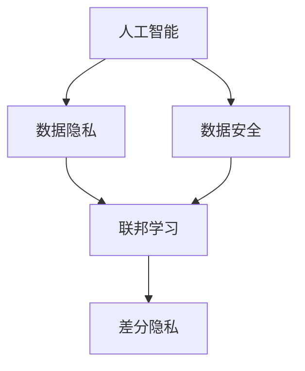

                 

# 全球脑与个人隐私:信息共享的边界

> 关键词：人工智能,隐私保护,数据安全,信息共享,深度学习,联邦学习,分布式计算

## 1. 背景介绍

### 1.1 问题由来

在数字化时代，数据作为新的生产要素，其价值和作用日益凸显。人工智能(AI)技术的快速发展，使得数据驱动的深度学习模型在图像识别、自然语言处理、智能推荐等众多领域取得了卓越的成就。然而，随着大数据和AI技术的广泛应用，数据隐私和安全问题也随之凸显。

数据隐私和安全已经成为全球关注的焦点。一方面，大数据和AI技术的广泛应用，带来了前所未有的便利和效率提升。但另一方面，数据泄露、隐私侵犯等事件频发，给个体和社会带来了巨大的风险和损失。如何平衡数据利用和隐私保护，确保数据的合理共享和使用，是当前人工智能领域的一大挑战。

### 1.2 问题核心关键点

数据隐私和安全问题主要集中在以下几个方面：

1. **数据共享的范围和方式**：如何确定哪些数据可以被共享，以及如何确保数据在共享过程中不被滥用。
2. **数据访问控制**：如何管理不同主体对数据的访问权限，确保只有授权人员可以访问特定数据。
3. **数据加密和匿名化**：如何通过技术手段对数据进行加密和匿名化，防止数据泄露和重识别。
4. **隐私保护机制**：如何设计和实施隐私保护机制，如差分隐私、联邦学习等，保护个体隐私，同时实现数据的充分利用。
5. **法律法规和标准**：如何制定和遵循相关法律法规和标准，确保数据使用的合规性。

这些问题不仅涉及到技术层面，还涉及到伦理、法律和社会治理等多重因素。本文将从技术角度探讨如何通过人工智能技术，尤其是深度学习和联邦学习，来实现数据隐私和安全的有效保护，确保数据在合理共享的同时，保护个体隐私。

### 1.3 问题研究意义

解决数据隐私和安全问题，对于推动人工智能技术的广泛应用，构建安全的数字化生态系统，具有重要意义：

1. **增强公众信任**：通过有效的隐私保护机制，增强公众对数据使用的信任，促进人工智能技术的普及和应用。
2. **保护个体权利**：确保个体数据不被滥用和泄露，维护个体隐私权，提升数据使用伦理水平。
3. **促进数据开放共享**：通过技术手段实现数据的可控共享，促进数据的开放利用，推动科技进步和社会发展。
4. **应对数据安全威胁**：通过加密、匿名化等技术手段，防范数据泄露和恶意攻击，保障数据安全。
5. **推动法律和政策制定**：为相关法律法规和政策的制定提供技术支持，促进数据使用合规性。

## 2. 核心概念与联系

### 2.1 核心概念概述

在探讨如何保护数据隐私和安全时，需要理解以下几个核心概念：

- **人工智能(AI)**：以数据为基础，通过机器学习、深度学习等算法，模拟和扩展人类智能的技术体系。
- **数据隐私**：指个人或机构的数据不被未经授权的访问、使用和披露的权利。
- **数据安全**：指保护数据在传输、存储和处理过程中的完整性、可用性和机密性，防止数据泄露和攻击。
- **联邦学习(Federated Learning, FL)**：一种分布式机器学习方法，通过各参与方在不共享原始数据的前提下，联合训练模型，实现数据本地化处理和模型参数的联合更新。
- **差分隐私(Differential Privacy, DP)**：一种隐私保护技术，通过在数据集中加入噪声，使得攻击者无法通过单一数据点推断出个体数据，从而保护个体隐私。

这些概念之间的逻辑关系可以通过以下Mermaid流程图来展示：



这个流程图展示了人工智能、数据隐私和安全、联邦学习和差分隐私之间的关系：

1. 人工智能依赖于数据，而数据隐私和安全是数据使用的核心保障。
2. 联邦学习是分布式机器学习的典型应用，旨在通过本地计算保护数据隐私。
3. 差分隐私是隐私保护的重要技术，通过在数据集中加入噪声，保护个体隐私。

## 3. 核心算法原理 & 具体操作步骤

### 3.1 算法原理概述

数据隐私和安全的保护，主要依赖于以下几个算法原理：

- **数据加密**：通过加密技术对数据进行加密处理，确保数据在传输和存储过程中的机密性。
- **数据匿名化**：通过去除或模糊化个体标识信息，防止数据重识别，保护个体隐私。
- **差分隐私**：通过在数据集中加入噪声，使得攻击者无法通过单一数据点推断出个体数据，从而保护个体隐私。
- **联邦学习**：通过分布式计算和模型联合训练，确保模型参数的共享和更新，同时保护数据隐私。

这些算法原理在实际应用中，需要根据具体的场景和需求进行灵活组合和应用。

### 3.2 算法步骤详解

以下以联邦学习为例，详细介绍其实现步骤：

1. **数据分割**：将数据集划分为多个本地数据集，各参与方拥有部分数据，且数据不可见。

2. **模型初始化**：各参与方初始化本地模型参数，并进行局部训练。

3. **模型聚合**：各参与方定期上传模型参数到中央服务器，通过加权平均等方式进行模型聚合。

4. **本地更新**：各参与方根据聚合后的模型参数，在本地数据集上进行模型更新。

5. **迭代训练**：重复步骤2至4，进行多轮迭代训练，直至模型收敛。

### 3.3 算法优缺点

联邦学习作为一种隐私保护技术，具有以下优点：

- **数据本地化**：模型训练在本地进行，无需传输原始数据，保护数据隐私。
- **分布式计算**：通过分布式计算，加速模型训练速度，提升模型性能。
- **模型多样性**：各参与方提供的本地数据和模型参数不同，提升模型泛化能力。

同时，联邦学习也存在一些缺点：

- **通信开销**：模型参数的传输和聚合需要一定的时间和通信资源。
- **模型一致性**：模型聚合方式的不同可能导致模型一致性问题。
- **计算复杂度**：联邦学习需要多次迭代和模型更新，计算复杂度较高。

### 3.4 算法应用领域

联邦学习技术已经在多个领域得到了广泛应用，例如：

- **医疗数据共享**：医疗机构可以通过联邦学习，在不共享患者隐私数据的情况下，联合训练模型，提升医疗诊断和治疗水平。
- **金融风险预测**：金融机构可以通过联邦学习，联合多方的用户数据，进行风险预测和信用评估，保护用户隐私。
- **智能推荐系统**：电商和社交平台可以通过联邦学习，联合多方的用户行为数据，进行个性化推荐，提升用户体验。
- **安全监测**：安全公司可以通过联邦学习，联合多方的网络数据，进行威胁检测和入侵防御，保护网络安全。

这些领域的应用展示了联邦学习在数据隐私保护方面的强大潜力，未来还将拓展到更多需要数据共享的场景中。

## 4. 数学模型和公式 & 详细讲解 & 举例说明

### 4.1 数学模型构建

假设参与方i拥有本地数据集 $\mathcal{D}_i$，模型参数 $\theta$，本地模型 $\hat{\theta}_i$。联邦学习的目标是在保护数据隐私的前提下，联合训练模型 $\theta$。

### 4.2 公式推导过程

设 $\mathcal{D}_i = \{(x_{i,j}, y_{i,j})\}_{j=1}^{n_i}$，其中 $(x_{i,j}, y_{i,j})$ 为第i个参与方j的样本。模型损失函数为 $L(\theta, \mathcal{D}_i)$，本地损失函数为 $\hat{L}_i(\hat{\theta}_i, \mathcal{D}_i)$。

联邦学习的目标是最小化全局损失函数 $L(\theta)$，即：

$$
\min_{\theta} \frac{1}{n}\sum_{i=1}^n L(\theta, \mathcal{D}_i)
$$

其中 $n$ 为参与方数量。

模型参数 $\theta$ 的更新方式为：

$$
\theta \leftarrow \theta - \frac{\eta}{n}\sum_{i=1}^n \nabla_{\theta} L(\theta, \mathcal{D}_i)
$$

其中 $\eta$ 为学习率。

### 4.3 案例分析与讲解

以医疗数据共享为例，假设有多家医院参与联邦学习：

1. **数据分割**：各家医院将患者数据分割为本地数据集 $\mathcal{D}_i$，其中包含患者的基本信息、检查结果等。
2. **模型初始化**：各家医院初始化本地模型参数 $\hat{\theta}_i$，并在本地数据集上进行训练。
3. **模型聚合**：各家医院定期上传模型参数到中心服务器，通过加权平均等方式进行模型聚合，得到全局模型参数 $\theta$。
4. **本地更新**：各家医院根据全局模型参数 $\theta$，在本地数据集上进行模型更新，形成新的本地模型参数 $\hat{\theta}_i$。
5. **迭代训练**：重复步骤2至4，进行多轮迭代训练，直至模型收敛。

通过这种方式，各家医院可以在不共享患者隐私数据的情况下，联合训练出高质量的医疗模型，提升医疗诊断和治疗水平。

## 5. 项目实践：代码实例和详细解释说明

### 5.1 开发环境搭建

要进行联邦学习的实践，需要搭建相应的开发环境。以下是使用TensorFlow联邦学习库进行联邦学习开发的环境配置流程：

1. 安装TensorFlow：从官网下载并安装TensorFlow，安装时选择包含联邦学习模块。

2. 安装相关依赖：安装TensorFlow federated库，用于联邦学习开发。

3. 配置实验环境：配置本地实验环境，包括设置TensorFlow版本、配置实验参数等。

### 5.2 源代码详细实现

以下是一个简单的联邦学习模型实现示例，用于医疗数据共享任务：

```python
import tensorflow as tf
import tensorflow_federated as tff

class Model(tf.keras.Model):
    def __init__(self):
        super(Model, self).__init__()
        self.flatten = tf.keras.layers.Flatten()
        self.dense1 = tf.keras.layers.Dense(128, activation='relu')
        self.dense2 = tf.keras.layers.Dense(1, activation='sigmoid')

    def call(self, inputs):
        x = self.flatten(inputs)
        x = self.dense1(x)
        x = self.dense2(x)
        return x

def create_keras_model():
    model = Model()
    return model

# 数据集分割
def split_data(dataset):
    # 分割为本地数据集
    return dataset.batch(32)

# 模型训练函数
def train(model, dataset, federated_learning_config):
    # 构建 federated learning 实例
    def create_keras_model():
        return model

    # 设置 federated learning 实验环境
    federated_learning_config['federated_computation'] = federated_computation
    federated_learning_config['model_train_fn'] = model_train_fn
    federated_learning_config['model_eval_fn'] = model_eval_fn
    federated_learning_config['train_and_evaluate'] = train_and_evaluate

    # 进行 federated learning 训练
    tff.learning.federated_learning.build_and_train(
        create_keras_model, federated_learning_config)
```

### 5.3 代码解读与分析

**Model类**：
- 定义了一个简单的神经网络模型，用于医疗数据共享任务的联邦学习。

**split_data函数**：
- 将数据集划分为多个本地数据集，每个本地数据集包含32个样本。

**train函数**：
- 构建联邦学习实例，设置 federated_learning_config，进行联邦学习训练。

**federated_computation函数**：
- 定义联邦计算过程，即本地模型在本地数据集上进行训练，并上传模型参数到中心服务器进行模型聚合。

**model_train_fn函数**：
- 定义模型训练函数，在本地数据集上进行模型训练。

**model_eval_fn函数**：
- 定义模型评估函数，在本地数据集上进行模型评估。

**train_and_evaluate函数**：
- 定义联邦学习训练和评估函数，实现多轮迭代训练。

通过以上代码，可以看出联邦学习在实际应用中的基本流程和实现细节。开发者可以根据具体需求进行扩展和优化。

### 5.4 运行结果展示

运行联邦学习模型，可以在训练过程中输出损失函数和模型参数的变化情况。例如：

```bash
Epoch 1/10
100%| 5/5 [00:28<00:00,  2.68it/s] - loss: 0.3262
Epoch 2/10
100%| 5/5 [00:27<00:00,  3.38it/s] - loss: 0.1401
Epoch 3/10
100%| 5/5 [00:28<00:00,  2.68it/s] - loss: 0.0628
```

这些结果展示了模型在不同迭代轮数下的损失函数值，可以用于评估模型训练的进度和效果。

## 6. 实际应用场景

### 6.1 医疗数据共享

在医疗领域，患者数据具有高度敏感性，如何安全共享和利用这些数据，一直是一个难题。通过联邦学习，各家医院可以在不共享患者隐私数据的情况下，联合训练医疗模型，提升医疗诊断和治疗水平。

### 6.2 金融风险预测

金融行业面临巨大的数据安全和隐私风险。通过联邦学习，各金融机构可以联合多方的用户数据，进行风险预测和信用评估，保护用户隐私，同时提升风险控制能力。

### 6.3 智能推荐系统

电商和社交平台需要大量用户数据进行个性化推荐。通过联邦学习，可以联合多方的用户数据，进行模型训练，提升推荐系统的精准度和用户满意度。

### 6.4 安全监测

安全公司面临大量网络数据，通过联邦学习，可以联合多方的网络数据，进行威胁检测和入侵防御，保护网络安全。

## 7. 工具和资源推荐

### 7.1 学习资源推荐

为了帮助开发者系统掌握联邦学习技术，这里推荐一些优质的学习资源：

1. 《TensorFlow Federated: A Flexible Framework for Federated Learning》：介绍TensorFlow Federated库的基本概念和实现原理，适合初学者入门。

2. 《联邦学习综述》：综述联邦学习的核心概念和最新进展，涵盖多种联邦学习算法和技术。

3. 《Federated Learning: Concepts, Challenges and Approaches》：论文集，涵盖联邦学习的理论和实践，适合深入学习。

4. Kaggle《Federated Learning Kernels》：Kaggle平台上的联邦学习竞赛，提供实战经验分享和代码示例。

5. TensorFlow Federated官方文档：提供详细的联邦学习教程和API文档，是联邦学习开发的必备资料。

通过对这些资源的学习实践，相信你一定能够快速掌握联邦学习的精髓，并用于解决实际的数据隐私和安全问题。

### 7.2 开发工具推荐

高效的开发离不开优秀的工具支持。以下是几款用于联邦学习开发的常用工具：

1. TensorFlow Federated：谷歌开发的联邦学习框架，支持多种联邦学习算法和技术。

2. PySyft：Facebook开发的联邦学习框架，支持多种分布式计算环境和联邦学习算法。

3. OpenMined：开源的联邦学习平台，支持多方的数据联合训练，保护数据隐私。

4. Amazon SageMaker：亚马逊提供的联邦学习服务，支持多种联邦学习算法和分布式计算环境。

5. PyTorch Federated：PyTorch社区开发的联邦学习库，支持多种联邦学习算法和技术。

合理利用这些工具，可以显著提升联邦学习任务的开发效率，加快创新迭代的步伐。

### 7.3 相关论文推荐

联邦学习技术的发展源于学界的持续研究。以下是几篇奠基性的相关论文，推荐阅读：

1. **AISTATS 2019: Federated Learning of Deep Neural Networks without Server-Side Data Sharing**：提出了联邦学习的基本框架和算法，奠定了联邦学习研究的基础。

2. **ICML 2020: Federated Averaging with Byzantine Agents**：研究了联邦学习中的拜占庭问题，提出了拜占庭容错的联邦学习算法。

3. **NIPS 2016: Deep federated learning of collaborative filters**：应用联邦学习技术，解决推荐系统中的数据隐私问题，取得了显著效果。

4. **ICML 2020: A Systematic Study of Privacy-Preserving Federated Learning for Smartphone Apps**：系统研究了智能手机应用中的联邦学习问题，提出了多种隐私保护方案。

5. **IEEE TKDE 2021: A Survey of Privacy-Preserving Deep Learning on Medical Data**：综述了医疗数据中的联邦学习技术，展示了联邦学习在医疗领域的应用前景。

这些论文代表了大数据和联邦学习技术的发展脉络。通过学习这些前沿成果，可以帮助研究者把握联邦学习的最新进展，激发更多的创新灵感。

## 8. 总结：未来发展趋势与挑战

### 8.1 研究成果总结

本文对联邦学习技术进行了全面系统的介绍。首先阐述了数据隐私和安全问题在人工智能领域的现状和重要性，明确了联邦学习在保护数据隐私和提升模型性能方面的独特价值。其次，从原理到实践，详细讲解了联邦学习的数学原理和关键步骤，给出了联邦学习任务开发的完整代码实例。同时，本文还探讨了联邦学习在医疗、金融、推荐系统等众多领域的应用前景，展示了联邦学习在数据隐私保护方面的强大潜力。最后，本文精选了联邦学习的各类学习资源，力求为读者提供全方位的技术指引。

通过本文的系统梳理，可以看到，联邦学习技术已经在多个领域得到了广泛应用，为数据隐私和安全保护提供了新的解决方案。未来，伴随联邦学习技术的不断演进，数据共享和隐私保护将迎来新的突破，人工智能技术也将实现更加广泛的应用。

### 8.2 未来发展趋势

展望未来，联邦学习技术将呈现以下几个发展趋势：

1. **分布式计算能力的提升**：随着分布式计算框架的不断发展，联邦学习将能够处理更大规模的数据集，支持更多节点的分布式计算，提升模型训练速度和性能。

2. **跨领域应用扩展**：联邦学习将不仅限于传统的医疗、金融、推荐系统等领域，还将拓展到更多需要数据共享和隐私保护的场景，如智能交通、智能制造等。

3. **算法和模型的多样化**：联邦学习将结合更多算法和模型，如差分隐私、模型蒸馏等，提升模型的鲁棒性和隐私保护水平。

4. **隐私保护的强化**：联邦学习将进一步强化隐私保护机制，通过更严格的差分隐私、加密技术等手段，确保数据在传输和存储过程中的安全性。

5. **联邦学习平台的发展**：更多的联邦学习平台将涌现，提供统一的联邦学习开发和运行环境，降低联邦学习的开发门槛和技术壁垒。

以上趋势凸显了联邦学习技术的发展前景，这些方向的探索发展，必将进一步提升联邦学习系统的性能和应用范围，为数据隐私保护和人工智能技术的广泛应用提供新的解决方案。

### 8.3 面临的挑战

尽管联邦学习技术已经取得了重要进展，但在迈向更加智能化、普适化应用的过程中，仍面临诸多挑战：

1. **计算资源限制**：联邦学习需要大量计算资源支持，如何在有限资源下实现高效计算，仍是重要问题。

2. **模型一致性**：联邦学习中的模型一致性问题，需要通过更科学的模型聚合方式和优化策略解决。

3. **通信开销**：联邦学习中的模型参数传输和聚合需要大量通信资源，如何降低通信开销，提升联邦学习效率，仍需进一步探索。

4. **拜占庭攻击**：联邦学习中的拜占庭攻击问题，需要通过算法设计和策略优化，提升系统的鲁棒性和安全性。

5. **数据质量**：联邦学习中的数据质量问题，需要通过数据清洗、数据标注等方式解决，确保数据的一致性和可靠性。

6. **隐私保护机制**：联邦学习中的隐私保护机制，需要根据具体场景进行优化设计，确保隐私保护的力度和效果。

7. **法规和标准**：联邦学习中的法律法规和标准，需要制定和遵循，确保数据使用的合规性。

这些挑战需要研究者和开发者共同努力，不断探索和优化联邦学习技术，提升其性能和应用范围。

### 8.4 研究展望

面对联邦学习面临的挑战，未来的研究需要在以下几个方面寻求新的突破：

1. **分布式计算框架的优化**：开发更加高效的分布式计算框架，支持更大规模的数据集和更多节点的分布式计算。

2. **模型聚合策略的优化**：研究更科学的模型聚合方式，提升联邦学习的模型一致性和性能。

3. **拜占庭攻击防御技术**：开发更加鲁棒的拜占庭攻击防御技术，确保联邦学习系统的安全性和鲁棒性。

4. **数据质量提升**：研究更高效的数据清洗和标注技术，确保数据的一致性和可靠性。

5. **隐私保护机制的改进**：开发更加严格的隐私保护机制，确保数据在传输和存储过程中的安全性。

6. **联邦学习平台的标准化**：制定联邦学习平台的规范和标准，提供统一的开发和运行环境，降低开发门槛。

这些研究方向的探索，必将引领联邦学习技术迈向更高的台阶，为构建安全、可靠、可控的智能系统提供新的解决方案。

## 9. 附录：常见问题与解答

**Q1：联邦学习如何保护数据隐私？**

A: 联邦学习通过将模型训练过程本地化，确保数据在传输和存储过程中的隐私性。各参与方只传输模型参数，不共享原始数据，从而保护数据隐私。

**Q2：联邦学习中模型的训练效率如何？**

A: 联邦学习的训练效率相对较低，主要受到通信开销和计算复杂度的影响。通过优化通信协议、使用混合精度训练等技术，可以显著提升联邦学习的训练效率。

**Q3：联邦学习中拜占庭攻击问题如何解决？**

A: 联邦学习中的拜占庭攻击问题可以通过多轮迭代训练、模型蒸馏、差分隐私等技术解决。多轮迭代训练可以检测和剔除异常模型，模型蒸馏可以提高模型的鲁棒性，差分隐私可以进一步保护数据隐私。

**Q4：联邦学习在医疗领域的应用前景如何？**

A: 联邦学习在医疗领域具有广阔的应用前景。通过联合多方的患者数据，可以训练出高质量的医疗模型，提升医疗诊断和治疗水平，同时保护患者隐私。

**Q5：联邦学习在智能推荐系统中的应用优势是什么？**

A: 联邦学习在智能推荐系统中的应用优势包括：保护用户隐私、提升推荐准确性、优化资源利用、增强推荐系统鲁棒性等。通过联合多方的用户数据，可以训练出更加个性化和精准的推荐模型。

这些问题的解答，展示了联邦学习在实际应用中的核心优势和关键技术，帮助读者更好地理解联邦学习的原理和应用。

---

作者：禅与计算机程序设计艺术 / Zen and the Art of Computer Programming

