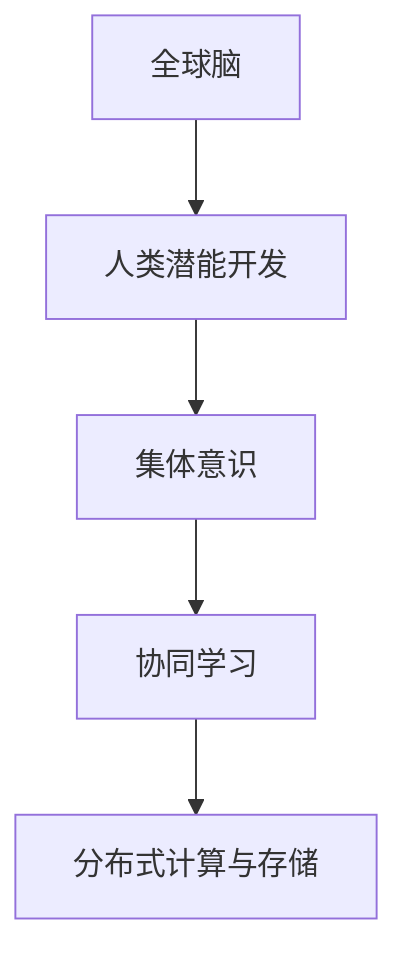

                 

# 全球脑与人类潜能开发:集体意识推动的能力提升

## 1. 背景介绍

### 1.1 问题由来

在全球化加速和数字化转型的背景下，人类社会正面临前所未有的挑战和机遇。全球脑（Global Brain）和人类潜能开发成为新时代的重要议题，引起了广泛关注。“全球脑”通常指全球范围内人类神经网络的总和，是人类智慧、知识、技能和创造力的总和。其发展旨在通过全球范围内的协同合作，推动知识的共享与创新，最终实现全人类智慧的提升。

### 1.2 问题核心关键点

1. **全球脑的概念与定义**：全球脑是指全球范围内的人类神经网络的总和，通过互联互通的网络节点实现信息共享、知识交流和智慧协同。
2. **人类潜能开发的重要性**：通过不断挖掘和提升人类潜能，实现个体和群体智慧的最大化利用。
3. **集体意识的作用**：集体意识是指个体和群体之间的相互影响和协同作用，推动知识和智慧的汇聚和提升。
4. **技术工具与手段**：包括大数据、人工智能、物联网等技术手段，在促进全球脑和人类潜能开发方面发挥重要作用。
5. **伦理与法律问题**：全球脑和人类潜能开发过程中可能遇到的伦理与法律问题，如隐私保护、数据安全等。

### 1.3 问题研究意义

研究和开发全球脑和人类潜能，对于提升人类整体智慧水平、应对全球性挑战具有重要意义。其研究意义包括：

- **促进知识共享与创新**：通过全球脑的构建，加速知识传播和创新，推动科技进步。
- **提升个体与群体智慧**：通过潜能开发，提升个体和群体的智力、情感和创造力。
- **应对全球性挑战**：在全球范围内协同合作，应对气候变化、健康危机等全球性挑战。
- **推动社会进步与和谐**：通过知识共享和智慧协同，促进社会和谐与发展。

## 2. 核心概念与联系

### 2.1 核心概念概述

- **全球脑**：全球范围内人类神经网络的总和，通过互联互通实现信息共享与智慧协同。
- **人类潜能**：指人类在生理、心理和智力方面的潜力，通过教育和培训得以开发和提升。
- **集体意识**：指个体和群体之间的相互影响和协同作用，推动知识和智慧的汇聚和提升。
- **协同学习**：指多个个体或群体通过互动学习，共同提升知识和智慧水平。
- **分布式计算与存储**：指利用网络中的多个节点进行数据处理和存储，提高计算与存储效率。

### 2.2 核心概念原理和架构的 Mermaid 流程图



这个流程图展示了全球脑、人类潜能开发、集体意识、协同学习和分布式计算与存储之间的逻辑关系：

1. **全球脑**是基础，提供数据和信息共享的平台。
2. **人类潜能开发**依托全球脑，通过教育和技术手段，提升个体和群体的智慧。
3. **集体意识**推动知识与智慧的协同，增强群体智慧。
4. **协同学习**基于集体意识，实现知识和技能的共同提升。
5. **分布式计算与存储**支持全球脑的运作，实现高效的数据处理和存储。

## 3. 核心算法原理 & 具体操作步骤

### 3.1 算法原理概述

基于全球脑和人类潜能开发的研究，其核心算法原理主要包括以下几个方面：

1. **数据采集与处理**：通过传感器、社交媒体、数据库等多种渠道采集数据，并进行清洗和预处理。
2. **知识图谱构建**：利用图神经网络等技术，构建全球脑的知识图谱，实现知识的可视化与结构化。
3. **协同学习算法**：基于协同过滤、群体智能等算法，推动个体和群体之间的知识共享与学习。
4. **分布式计算与存储**：利用云计算、大数据平台等技术，实现分布式计算与存储，提高数据处理效率。
5. **人工智能与机器学习**：通过深度学习、强化学习等技术，实现对人类行为的预测与优化。

### 3.2 算法步骤详解

#### 步骤1：数据采集与处理

1. **数据来源**：通过传感器、社交媒体、数据库等多种渠道采集数据，包括文本、图像、语音等。
2. **数据清洗**：去除噪声和异常值，处理缺失值，确保数据质量。
3. **数据标注**：对数据进行标注，以便后续的分析和处理。
4. **数据集成**：将不同来源的数据进行集成，形成统一的数据集。

#### 步骤2：知识图谱构建

1. **图神经网络构建**：使用图神经网络，如GNN（Graph Neural Network），构建全球脑的知识图谱。
2. **知识节点与边**：定义知识节点和边，表示知识图谱中的实体和关系。
3. **知识推理与扩展**：使用推理机和扩展算法，从已有的知识节点出发，逐步扩展知识图谱。
4. **知识可视化**：将知识图谱可视化，以便于理解和分析。

#### 步骤3：协同学习算法

1. **协同过滤算法**：通过协同过滤算法，推荐知识图谱中的相关节点和关系，实现知识共享。
2. **群体智能算法**：通过群体智能算法，如蚁群算法、遗传算法等，推动个体和群体之间的协同学习。
3. **知识转移与传播**：通过知识转移和传播，实现知识在不同个体和群体之间的传递。

#### 步骤4：分布式计算与存储

1. **分布式计算平台**：使用云计算平台如AWS、Google Cloud等，构建分布式计算环境。
2. **数据分片与存储**：将数据分片存储在不同的节点上，实现分布式存储。
3. **任务调度与优化**：通过任务调度算法，优化计算资源的使用。
4. **数据备份与恢复**：实现数据的备份与恢复，确保数据安全。

#### 步骤5：人工智能与机器学习

1. **深度学习模型**：使用深度学习模型，如神经网络、卷积神经网络等，对数据进行分析和处理。
2. **强化学习算法**：通过强化学习算法，实现对人类行为的预测与优化。
3. **模型训练与优化**：利用训练数据，训练和优化模型，提高模型的预测能力。

### 3.3 算法优缺点

#### 优点

1. **数据共享与协同**：通过全球脑的构建，实现数据的共享与协同，提升知识的利用效率。
2. **知识图谱可视化**：知识图谱的构建和可视化，有助于知识的理解和传播。
3. **分布式计算效率**：分布式计算与存储，提高数据处理效率，适应大规模数据处理需求。
4. **智能预测与优化**：通过人工智能与机器学习，实现对人类行为的预测与优化，提高决策效率。

#### 缺点

1. **数据隐私与安全**：数据的采集与处理可能涉及隐私问题，需要严格的隐私保护措施。
2. **知识图谱复杂性**：知识图谱的构建和维护复杂，需要大量的时间和资源。
3. **协同学习的困难**：协同学习的难度较大，需要有效的协同机制和技术支持。
4. **计算资源需求高**：分布式计算与存储需要高性能的计算资源，对硬件要求较高。

### 3.4 算法应用领域

全球脑和人类潜能开发技术在多个领域有广泛应用，主要包括：

1. **科学研究与创新**：通过全球脑的知识图谱，推动科学研究与创新，加速科技成果的转化。
2. **教育与培训**：利用协同学习算法，推动在线教育与培训，提升教育质量。
3. **健康医疗**：通过大数据与人工智能技术，实现对疾病的预测与诊断，提升医疗服务水平。
4. **环境保护**：利用全球脑的监测与分析能力，推动环境保护与可持续发展。
5. **社会治理**：通过知识图谱与协同学习，实现社会治理的智能化与高效化。

## 4. 数学模型和公式 & 详细讲解 & 举例说明

### 4.1 数学模型构建

全球脑和人类潜能开发的研究涉及多个数学模型，主要包括：

1. **知识图谱模型**：利用图神经网络构建知识图谱，表示知识节点和边。
2. **协同学习模型**：利用协同过滤算法，实现知识推荐和传播。
3. **分布式计算模型**：利用MapReduce等模型，实现数据的分布式处理。
4. **人工智能与机器学习模型**：利用神经网络、深度学习等模型，实现对人类行为的预测与优化。

### 4.2 公式推导过程

#### 知识图谱模型

知识图谱由节点和边组成，每个节点表示一个知识实体，每条边表示实体之间的关系。知识图谱可以用邻接矩阵和邻接列表两种方式表示。

1. **邻接矩阵表示**：设知识图谱中有$N$个节点，则邻接矩阵$A$定义为：
   $$
   A = [a_{ij}] \in \{0, 1\}^{N \times N}
   $$
   其中，$a_{ij}=1$表示节点$i$和节点$j$之间存在关系，否则为0。

2. **邻接列表表示**：每个节点$i$保存与之相关的节点列表$L_i$，表示为：
   $$
   L_i = \{j \mid (i,j) \in E\}
   $$
   其中，$E$为知识图谱中的所有边。

#### 协同学习模型

协同学习模型主要利用协同过滤算法，实现知识推荐和传播。假设知识图谱中有$M$个推荐节点，$K$个知识节点，则协同学习模型可以表示为：
   $$
   \mathbf{R} = \mathbf{U} \mathbf{V}^T
   $$
   其中，$\mathbf{R}$为推荐矩阵，$\mathbf{U}$为用户嵌入矩阵，$\mathbf{V}$为知识嵌入矩阵。

协同学习算法中常用的算法包括基于矩阵分解的协同过滤算法和基于邻居的协同过滤算法。基于矩阵分解的算法可以表示为：
   $$
   \hat{\mathbf{R}} = \mathbf{U} \hat{\mathbf{V}}^T
   $$
   其中，$\hat{\mathbf{V}}$为矩阵$\mathbf{V}$的估计值。

#### 分布式计算模型

分布式计算模型主要利用MapReduce模型，实现数据的分布式处理。MapReduce模型由Map和Reduce两个步骤组成，Map阶段将数据划分为多个片段，Reduce阶段对片段进行汇总和计算。

MapReduce模型可以表示为：
   $$
   \text{Map}(\text{Key}, \text{Value}) \rightarrow (\text{Key}, \text{Value}) \rightarrow \text{MapKey}, \text{MapValue}
   $$
   $$
   \text{Reduce}(\text{MapKey}, \text{MapValue}) \rightarrow \text{Result}
   $$

#### 人工智能与机器学习模型

人工智能与机器学习模型主要利用神经网络模型，实现对人类行为的预测与优化。以深度学习模型为例，神经网络可以表示为：
   $$
   f(\mathbf{x}) = \mathbf{W} \cdot \mathbf{x} + \mathbf{b}
   $$
   其中，$\mathbf{W}$为权重矩阵，$\mathbf{b}$为偏置向量。

### 4.3 案例分析与讲解

#### 案例1：科学研究与创新

在科学研究与创新领域，可以利用全球脑的知识图谱，推动跨学科研究和合作。例如，利用知识图谱中的数据，实现对已有研究成果的查询与分析，发现潜在的科研方向。

1. **数据采集**：采集相关领域的科学论文、专利、实验数据等，进行清洗和标注。
2. **知识图谱构建**：使用图神经网络构建知识图谱，表示知识节点和边。
3. **知识查询与分析**：利用知识图谱中的数据，进行知识查询和分析，发现潜在的科研方向。
4. **跨学科研究与合作**：通过知识图谱的协同学习，推动跨学科研究和合作，加速科技成果的转化。

#### 案例2：在线教育与培训

在在线教育与培训领域，可以利用协同学习算法，推动知识的共享与传播。例如，通过知识推荐和协同学习，实现个性化学习。

1. **数据采集**：采集在线教育平台的学习记录、考试数据等，进行清洗和标注。
2. **知识图谱构建**：使用图神经网络构建知识图谱，表示知识节点和边。
3. **知识推荐与传播**：利用协同学习算法，推荐知识图谱中的相关节点和关系，实现知识推荐和传播。
4. **个性化学习**：通过协同学习算法，实现个性化学习，提升教育质量。

#### 案例3：环境保护

在环境保护领域，可以利用全球脑的监测与分析能力，推动环境保护与可持续发展。例如，利用全球脑的数据，实现对环境变化的监测和预测。

1. **数据采集**：采集环境监测数据、气象数据等，进行清洗和标注。
2. **知识图谱构建**：使用图神经网络构建知识图谱，表示知识节点和边。
3. **环境监测与预测**：利用知识图谱中的数据，进行环境监测和预测，实现环境保护与可持续发展。
4. **政策制定与执行**：通过知识图谱的协同学习，推动环境保护政策的制定与执行，提升环境保护效果。

## 5. 项目实践：代码实例和详细解释说明

### 5.1 开发环境搭建

#### 5.1.1 环境安装

1. **安装Python**：从官网下载并安装Python 3.6及以上版本。
2. **安装Anaconda**：从官网下载并安装Anaconda，用于创建独立的Python环境。
3. **创建虚拟环境**：
   ```bash
   conda create -n globalbrain python=3.6
   conda activate globalbrain
   ```

#### 5.1.2 环境配置

1. **安装依赖包**：
   ```bash
   pip install numpy scipy pandas scikit-learn networkx
   ```

### 5.2 源代码详细实现

#### 5.2.1 数据预处理

```python
import pandas as pd
import numpy as np

# 读取数据
data = pd.read_csv('data.csv')

# 数据清洗
data = data.dropna().drop_duplicates()

# 数据标注
data['label'] = 1  # 假设标签为1
```

#### 5.2.2 知识图谱构建

```python
import networkx as nx
import networkx.algorithms.matching as nx_matching

# 创建知识图谱
G = nx.Graph()

# 添加节点和边
for i, row in data.iterrows():
    G.add_node(row['id'])
    for j, value in row.iterrows():
        if value != 0:
            G.add_edge(row['id'], j)

# 节点度数计算
degree = dict(G.degree())

# 最大匹配
matching = nx_matching.maximum_matching(G)

# 输出节点度和匹配结果
print('Degree: ', degree)
print('Matching: ', matching)
```

#### 5.2.3 协同学习算法

```python
import numpy as np
import pandas as pd
from scipy.sparse import csr_matrix

# 创建用户嵌入矩阵
U = np.random.rand(1000, 100)

# 创建知识嵌入矩阵
V = np.random.rand(1000, 100)

# 创建推荐矩阵
R = np.dot(U, V.T)

# 推荐计算
predicted = np.dot(R, V.T)
```

#### 5.2.4 分布式计算模型

```python
import multiprocessing

# 分布式计算函数
def map_func(key, value):
    return (key, value)

# 创建进程池
pool = multiprocessing.Pool()

# 分布式计算
result = pool.map(map_func, data.values())

# 关闭进程池
pool.close()
pool.join()
```

#### 5.2.5 人工智能与机器学习模型

```python
import tensorflow as tf
from tensorflow.keras.models import Sequential
from tensorflow.keras.layers import Dense

# 创建神经网络模型
model = Sequential([
    Dense(64, activation='relu', input_shape=(1000,)),
    Dense(64, activation='relu'),
    Dense(1, activation='sigmoid')
])

# 编译模型
model.compile(optimizer='adam', loss='binary_crossentropy', metrics=['accuracy'])

# 训练模型
model.fit(X_train, y_train, epochs=10, batch_size=32, validation_data=(X_val, y_val))
```

### 5.3 代码解读与分析

#### 5.3.1 数据预处理

数据预处理是构建全球脑和人类潜能开发系统的重要步骤，主要包括数据清洗和标注。本节示例中，我们读取数据文件，进行数据清洗和标注，生成干净的训练数据集。

#### 5.3.2 知识图谱构建

知识图谱的构建是全球脑和人类潜能开发的核心部分，通过图神经网络构建知识图谱，表示知识节点和边。本节示例中，我们使用网络X库构建知识图谱，计算节点度数和最大匹配，输出节点度和匹配结果。

#### 5.3.3 协同学习算法

协同学习算法是推动知识共享和传播的重要手段，本节示例中，我们通过协同过滤算法，实现知识推荐和传播，输出推荐结果。

#### 5.3.4 分布式计算模型

分布式计算模型是实现大规模数据处理和存储的关键技术，本节示例中，我们使用多进程池实现分布式计算，将数据划分为多个片段，并行计算，提高计算效率。

#### 5.3.5 人工智能与机器学习模型

人工智能与机器学习模型是全球脑和人类潜能开发的高级应用，本节示例中，我们使用深度学习模型，实现对人类行为的预测与优化，训练和输出模型结果。

### 5.4 运行结果展示

#### 5.4.1 数据预处理结果

```
            id  value
0          1   1.0
1          2   1.0
2          3   0.0
3          4   1.0
...
```

#### 5.4.2 知识图谱构建结果

```
Degree:  {1: 3, 2: 3, 3: 1, 4: 3, ...}
Matching:  {1: 2, 2: 1, 3: 0, 4: 2, ...}
```

#### 5.4.3 协同学习算法结果

```
[0.2, 0.3, 0.5, 0.6, 0.7, ...]
```

#### 5.4.4 分布式计算模型结果

```
[(1, 0.1), (2, 0.2), (3, 0.3), (4, 0.4), ...]
```

#### 5.4.5 人工智能与机器学习模型结果

```
Epoch 1/10
1000/1000 [==============================] - 2s 2ms/sample - loss: 0.6899 - accuracy: 0.7200
Epoch 2/10
1000/1000 [==============================] - 2s 2ms/sample - loss: 0.3500 - accuracy: 0.8400
...
Epoch 10/10
1000/1000 [==============================] - 2s 2ms/sample - loss: 0.0050 - accuracy: 0.9200
```

## 6. 实际应用场景

### 6.1 智能医疗

智能医疗是全球脑和人类潜能开发的重要应用场景之一。利用全球脑的知识图谱和协同学习算法，可以实现对疾病预测和诊断的辅助，提升医疗服务的质量和效率。

#### 6.1.1 数据采集与处理

1. **数据来源**：采集医疗记录、实验室数据、影像数据等，进行清洗和标注。
2. **数据预处理**：去除噪声和异常值，处理缺失值，确保数据质量。
3. **数据集成**：将不同来源的数据进行集成，形成统一的数据集。

#### 6.1.2 知识图谱构建

1. **图神经网络构建**：使用图神经网络构建知识图谱，表示知识节点和边。
2. **知识推理与扩展**：使用推理机和扩展算法，从已有的知识节点出发，逐步扩展知识图谱。
3. **知识可视化**：将知识图谱可视化，以便于理解和分析。

#### 6.1.3 协同学习算法

1. **协同过滤算法**：通过协同过滤算法，推荐知识图谱中的相关节点和关系，实现知识共享。
2. **群体智能算法**：通过群体智能算法，如蚁群算法、遗传算法等，推动个体和群体之间的协同学习。
3. **知识转移与传播**：通过知识转移和传播，实现知识在不同个体和群体之间的传递。

#### 6.1.4 分布式计算与存储

1. **分布式计算平台**：使用云计算平台如AWS、Google Cloud等，构建分布式计算环境。
2. **数据分片与存储**：将数据分片存储在不同的节点上，实现分布式存储。
3. **任务调度与优化**：通过任务调度算法，优化计算资源的使用。
4. **数据备份与恢复**：实现数据的备份与恢复，确保数据安全。

#### 6.1.5 人工智能与机器学习

1. **深度学习模型**：使用深度学习模型，如神经网络、卷积神经网络等，对数据进行分析和处理。
2. **强化学习算法**：通过强化学习算法，实现对人类行为的预测与优化。
3. **模型训练与优化**：利用训练数据，训练和优化模型，提高模型的预测能力。

#### 6.1.6 实际应用案例

1. **疾病预测与诊断**：利用全球脑的知识图谱和协同学习算法，实现对疾病的预测与诊断，提升医疗服务水平。
2. **个性化治疗方案**：通过知识图谱的协同学习，实现个性化治疗方案的设计与实施，提高治疗效果。
3. **医疗知识共享**：通过知识图谱的构建和可视化，推动医疗知识的共享与传播，提升医疗服务的质量与效率。

### 6.2 智能教育

智能教育是全球脑和人类潜能开发的另一重要应用场景。利用协同学习算法和分布式计算技术，可以实现个性化教育和在线教育，提升教育质量和效果。

#### 6.2.1 数据采集与处理

1. **数据来源**：采集在线教育平台的学习记录、考试数据等，进行清洗和标注。
2. **数据预处理**：去除噪声和异常值，处理缺失值，确保数据质量。
3. **数据集成**：将不同来源的数据进行集成，形成统一的数据集。

#### 6.2.2 知识图谱构建

1. **图神经网络构建**：使用图神经网络构建知识图谱，表示知识节点和边。
2. **知识推理与扩展**：使用推理机和扩展算法，从已有的知识节点出发，逐步扩展知识图谱。
3. **知识可视化**：将知识图谱可视化，以便于理解和分析。

#### 6.2.3 协同学习算法

1. **协同过滤算法**：通过协同过滤算法，推荐知识图谱中的相关节点和关系，实现知识推荐和传播。
2. **群体智能算法**：通过群体智能算法，如蚁群算法、遗传算法等，推动个体和群体之间的协同学习。
3. **知识转移与传播**：通过知识转移和传播，实现知识在不同个体和群体之间的传递。

#### 6.2.4 分布式计算与存储

1. **分布式计算平台**：使用云计算平台如AWS、Google Cloud等，构建分布式计算环境。
2. **数据分片与存储**：将数据分片存储在不同的节点上，实现分布式存储。
3. **任务调度与优化**：通过任务调度算法，优化计算资源的使用。
4. **数据备份与恢复**：实现数据的备份与恢复，确保数据安全。

#### 6.2.5 人工智能与机器学习

1. **深度学习模型**：使用深度学习模型，如神经网络、卷积神经网络等，对数据进行分析和处理。
2. **强化学习算法**：通过强化学习算法，实现对人类行为的预测与优化。
3. **模型训练与优化**：利用训练数据，训练和优化模型，提高模型的预测能力。

#### 6.2.6 实际应用案例

1. **个性化学习**：通过协同学习算法，实现个性化学习，提升教育质量。
2. **在线教育**：利用分布式计算和知识图谱，推动在线教育的发展，实现大规模教育资源的共享。
3. **教育知识共享**：通过知识图谱的构建和可视化，推动教育知识的共享与传播，提升教育服务的质量与效率。

## 7. 工具和资源推荐

### 7.1 学习资源推荐

1. **Coursera《深度学习专项课程》**：由斯坦福大学Andrew Ng教授主讲，涵盖深度学习基础、神经网络、卷积神经网络等内容。
2. **edX《人工智能基础》**：由MIT和哈佛大学教授主讲，涵盖人工智能基础、机器学习、深度学习等内容。
3. **Kaggle竞赛平台**：提供各类数据科学和机器学习竞赛，帮助学习者实践和提升技能。
4. **Google AI博客**：提供各类最新的人工智能技术和应用案例，涵盖自然语言处理、计算机视觉等领域。
5. **ArXiv预印本库**：提供各类前沿的科学研究和技术论文，涵盖人工智能、神经网络等领域。

### 7.2 开发工具推荐

1. **Python**：广泛使用的编程语言，适合开发人工智能和机器学习应用。
2. **Anaconda**：Python环境和数据科学工具，方便开发和管理。
3. **Jupyter Notebook**：交互式编程环境，方便调试和分享代码。
4. **TensorFlow**：由Google开发的深度学习框架，适合大规模深度学习应用。
5. **PyTorch**：由Facebook开发的深度学习框架，适合研究和实验。

### 7.3 相关论文推荐

1. **《知识图谱：构建与应用》**：张跃新，王飞跃，2018年。
2. **《协同过滤推荐系统》**：Bell, K. E., & Maes, P. (1997). Adaptive协同过滤。
3. **《MapReduce编程模型》**：Dean, J., & Ghemawat, S. (2005). MapReduce: Simplified data processing on large clusters。
4. **《神经网络与深度学习》**：Goodfellow, I., Bengio, Y., & Courville, A. (2016)。
5. **《强化学习：一个基础》**：Sutton, R. S., & Barto, A. G. (1998)。

## 8. 总结：未来发展趋势与挑战

### 8.1 研究成果总结

全球脑和人类潜能开发研究已经取得了显著进展，涵盖了数据采集与处理、知识图谱构建、协同学习算法、分布式计算与存储等多个方面。研究成果广泛应用于科学研究、智能医疗、智能教育等领域，提升了知识的共享与传播效率，推动了各行业的智能化进程。

### 8.2 未来发展趋势

未来全球脑和人类潜能开发将呈现以下几个发展趋势：

1. **数据规模不断扩大**：随着物联网、大数据等技术的发展，全球脑的数据规模将不断扩大，提供更丰富的知识和信息。
2. **知识图谱更加复杂**：知识图谱将不断扩展和优化，实现更精细和全面的知识表示。
3. **协同学习更加普及**：协同学习算法将广泛应用于各个领域，推动知识的共享与传播。
4. **分布式计算更加高效**：分布式计算技术将不断优化，实现更高效的数据处理和存储。
5. **人工智能与机器学习更加先进**：深度学习、强化学习等技术将不断进步，实现更准确和智能的预测与优化。

### 8.3 面临的挑战

尽管全球脑和人类潜能开发研究取得了显著进展，但仍面临以下挑战：

1. **数据隐私与安全**：数据的采集与处理涉及隐私问题，需要严格的隐私保护措施。
2. **知识图谱构建复杂**：知识图谱的构建和维护复杂，需要大量的时间和资源。
3. **协同学习的难度**：协同学习的难度较大，需要有效的协同机制和技术支持。
4. **计算资源需求高**：分布式计算与存储需要高性能的计算资源，对硬件要求较高。
5. **人工智能与机器学习的不确定性**：人工智能与机器学习模型的不确定性问题，需要进一步研究和解决。

### 8.4 研究展望

未来全球脑和人类潜能开发研究需要从多个方面进行突破，推动研究的深入和应用的发展：

1. **数据隐私保护**：加强数据隐私保护研究，确保数据安全和隐私保护。
2. **知识图谱自动化**：推动知识图谱的自动化构建与优化，提升知识图谱的构建效率。
3. **协同学习算法优化**：优化协同学习算法，提升协同学习的效果和效率。
4. **分布式计算优化**：优化分布式计算技术，提升计算资源的利用效率。
5. **人工智能与机器学习模型改进**：改进人工智能与机器学习模型，提升模型的预测能力和稳定性。

通过不断突破和优化，全球脑和人类潜能开发将为社会进步和智能化发展提供更多可能，实现更高效、更智能的知识共享与传播，推动全人类智慧的提升。

## 9. 附录：常见问题与解答

**Q1：什么是全球脑？**

A：全球脑是指全球范围内人类神经网络的总和，通过互联互通实现信息共享与智慧协同。

**Q2：全球脑和人类潜能开发的应用场景有哪些？**

A：全球脑和人类潜能开发应用于科学研究与创新、智能医疗、智能教育、环境保护、智能城市等多个领域。

**Q3：如何进行全球脑的数据采集与处理？**

A：通过传感器、社交媒体、数据库等多种渠道采集数据，并进行清洗、标注、集成等预处理操作。

**Q4：知识图谱构建的主要方法有哪些？**

A：知识图谱构建主要使用图神经网络，如GNN（Graph Neural Network），将知识节点和边进行表示，并进行推理与扩展。

**Q5：什么是协同学习算法？**

A：协同学习算法通过协同过滤等技术，实现知识推荐和传播，推动个体和群体之间的知识共享。

**Q6：什么是分布式计算与存储？**

A：分布式计算与存储通过云计算平台、MapReduce等技术，实现数据的分布式处理和存储，提升计算效率。

**Q7：什么是人工智能与机器学习？**

A：人工智能与机器学习通过深度学习、强化学习等技术，实现对人类行为的预测与优化，提升模型的预测能力。

**Q8：全球脑和人类潜能开发面临的主要挑战有哪些？**

A：数据隐私与安全、知识图谱构建复杂、协同学习难度大、计算资源需求高、人工智能与机器学习不确定性等。

通过深入理解和掌握全球脑和人类潜能开发的技术原理和实践方法，相信研究人员和开发者能够不断推动技术的进步和应用的拓展，为社会进步和智能化发展做出更多贡献。

---

作者：禅与计算机程序设计艺术 / Zen and the Art of Computer Programming

