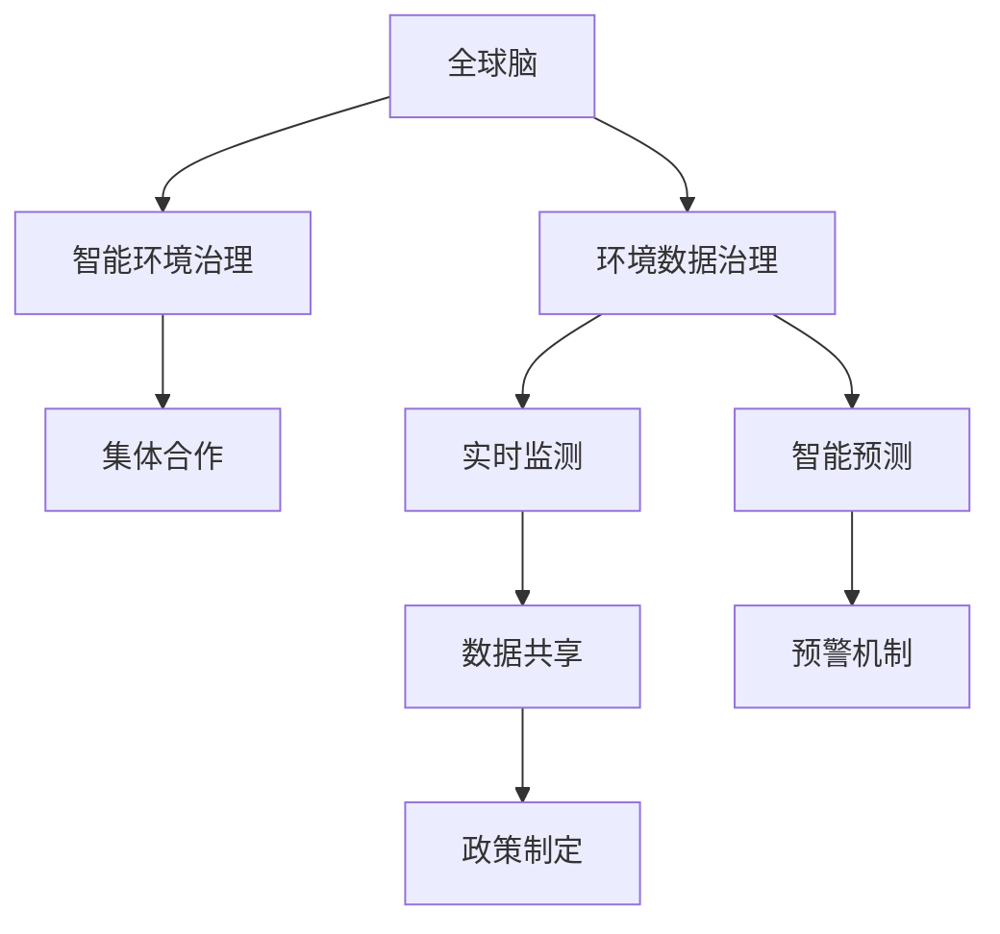

                 

# 全球脑与全球环境：集体合作的环境治理

在探索人工智能与人类的共生关系时，我们逐渐意识到，全球环境治理不仅是一项科学问题，更是一场复杂的全球协作。本文将以《全球脑与全球环境：集体合作的环境治理》为标题，深入探讨如何通过全球协同合作，利用人工智能技术解决全球性环境问题，并提出了基于此理念的全球智能环境治理框架。

## 1. 背景介绍

### 1.1 问题由来
全球环境治理面临的挑战日趋严峻。随着工业化进程加快、人口增长和资源过度开发，环境污染、气候变化、生物多样性丧失等全球性环境问题愈发突出。这些问题不仅威胁到人类生存，也严重制约了经济社会的可持续发展。

与此同时，人工智能技术的迅猛发展为解决全球环境问题带来了新的希望。通过大数据、机器学习、深度学习等技术，我们可以更全面地监测和理解环境变化，实现对环境系统的智能分析和预测。然而，尽管人工智能技术具备强大的分析能力，其在实际应用中仍然受到数据收集、模型训练、模型部署等多方面的限制。

为了更好地应对全球环境问题，我们提出“全球脑”概念，即通过构建全球协同合作的人工智能环境治理网络，实现环境数据的全球共享和协同分析，从而提升环境治理的效率和效果。

### 1.2 问题核心关键点
- **全球智能治理网络**：构建全球协作的人工智能环境治理网络，实现环境数据的共享和协同分析。
- **实时环境监测**：利用人工智能技术实时监测全球环境变化，提供科学依据和决策支持。
- **智能预测与预警**：通过机器学习算法，预测环境变化的趋势和可能的风险，及时发出预警。
- **智能辅助决策**：利用人工智能对大量环境数据进行深度分析，辅助制定环境治理政策。

## 2. 核心概念与联系

### 2.1 核心概念概述

为了更清晰地理解“全球脑”和“全球环境治理”的关系，我们首先介绍几个核心概念：

- **全球脑**：基于人工智能技术构建的全球协作网络，实现环境数据的实时共享和协同分析。
- **环境数据治理**：收集、处理和分析环境数据，监测环境变化，预测环境风险，为环境治理提供数据支持。
- **智能环境治理**：利用人工智能技术，对环境数据进行深度分析和智能预测，辅助制定科学的环境治理策略。
- **集体合作**：全球各国、各组织协同合作，共同应对环境问题，实现环境治理的全球化。

### 2.2 核心概念原理和架构的 Mermaid 流程图



## 3. 核心算法原理 & 具体操作步骤

### 3.1 算法原理概述

全球智能环境治理的算法原理主要基于以下三点：

1. **数据共享**：通过全球脑构建的环境数据共享平台，实现全球环境数据的实时传输和存储。
2. **协同分析**：利用分布式计算和人工智能技术，对共享的环境数据进行协同分析和处理，提升环境数据治理的效率和效果。
3. **智能预测**：采用机器学习和深度学习算法，对环境数据进行分析和预测，为环境治理提供科学依据。

### 3.2 算法步骤详解

1. **数据采集与预处理**：
   - 全球各国收集本国环境数据，并通过数据共享平台上传到全球脑网络。
   - 对收集到的数据进行清洗和预处理，去除噪声和异常值，确保数据质量。

2. **分布式协同分析**：
   - 利用分布式计算框架（如Apache Spark），将数据划分为多个部分，由多个节点并行处理。
   - 利用深度学习框架（如TensorFlow、PyTorch），构建环境监测和分析模型，对环境数据进行实时监测和分析。

3. **智能预测与预警**：
   - 采用机器学习算法（如时间序列分析、回归模型、神经网络），对环境数据进行分析和预测，建立环境变化模型。
   - 根据预测结果，利用预警系统及时发出环境风险预警，确保及时应对环境变化。

4. **智能辅助决策**：
   - 通过数据分析和预测结果，辅助政府和企业制定科学的环境治理策略。
   - 利用自然语言处理技术，将数据分析结果转换为易于理解和操作的决策建议。

### 3.3 算法优缺点

**优点**：
- **效率提升**：分布式计算和人工智能技术的应用，极大提升了环境数据处理的效率。
- **数据共享**：全球脑的网络架构，实现了环境数据的全球共享，提高了数据治理的质量。
- **智能预测**：机器学习算法的应用，实现了对环境变化的智能预测和预警。

**缺点**：
- **隐私保护**：全球环境数据的共享可能涉及敏感信息的泄露，需要建立严格的隐私保护机制。
- **技术依赖**：算法和技术的实现需要较高的技术门槛，部分发展中国家可能面临技术壁垒。
- **协同合作难度**：全球各国的文化、经济差异，可能导致协同合作难度较大。

### 3.4 算法应用领域

全球智能环境治理的算法应用领域广泛，涵盖以下几个方面：

1. **气候变化监测与预测**：通过实时监测全球气候数据，预测气候变化的趋势和可能的影响。
2. **水质监测与治理**：监测全球水体质量，预测水质变化趋势，辅助制定水质治理策略。
3. **生物多样性保护**：监测全球生物多样性变化，预测物种灭绝风险，制定生物多样性保护措施。
4. **垃圾处理与资源回收**：监测全球垃圾产生和处理情况，预测垃圾分类回收趋势，优化垃圾处理策略。
5. **能源消耗与节能减排**：监测全球能源消耗情况，预测能源需求变化，制定节能减排措施。

## 4. 数学模型和公式 & 详细讲解 & 举例说明

### 4.1 数学模型构建

全球智能环境治理的数学模型主要包括以下几个方面：

1. **环境数据监测模型**：用于实时监测环境数据，建立环境状态模型。
2. **环境变化预测模型**：用于预测环境变化趋势，建立环境变化预测模型。
3. **环境风险预警模型**：用于预警环境风险，建立环境风险预警模型。
4. **环境治理优化模型**：用于优化环境治理策略，建立环境治理优化模型。

### 4.2 公式推导过程

以环境变化预测模型为例，我们采用时间序列分析中的ARIMA模型，用于预测气候变化的趋势。ARIMA模型的公式如下：

$$
y_t = c + \sum_{i=1}^p \phi_i y_{t-i} + \sum_{j=1}^d B^j \epsilon_t + \sum_{k=1}^q \theta_k \epsilon_{t-k}
$$

其中，$y_t$ 为预测值，$\phi_i$ 为自回归系数，$p$ 为自回归阶数，$B^j$ 为差分算子，$d$ 为差分次数，$\epsilon_t$ 为随机误差，$\theta_k$ 为移动平均系数，$q$ 为移动平均阶数。

### 4.3 案例分析与讲解

假设我们收集了全球近30年气候数据的月度平均值，建立ARIMA模型进行气候变化趋势预测。首先对数据进行差分处理，然后使用最小二乘法估计模型参数，最后利用模型对未来10个月份的气候变化进行预测。预测结果与实际气候变化情况进行对比，评估模型的准确性和可靠性。

## 5. 项目实践：代码实例和详细解释说明

### 5.1 开发环境搭建

开发全球智能环境治理项目，首先需要搭建相应的开发环境。以下是Python和R语言开发环境的搭建步骤：

1. **Python环境**：
   - 安装Anaconda：从官网下载并安装Anaconda，用于创建独立的Python环境。
   - 创建并激活虚拟环境：
     ```bash
     conda create -n env_name python=3.8
     conda activate env_name
     ```
   - 安装相关依赖库：
     ```bash
     pip install numpy pandas scikit-learn matplotlib requests
     ```

2. **R语言环境**：
   - 安装R和RStudio：从官网下载并安装R和RStudio，用于R语言的开发。
   - 安装相关依赖包：
     ```R
     install.packages(c("tidyverse", "dplyr", "ggplot2", "forecast"))
     ```

### 5.2 源代码详细实现

以下以Python为例，展示如何利用TensorFlow构建环境变化预测模型：

```python
import tensorflow as tf
from tensorflow.keras.models import Sequential
from tensorflow.keras.layers import LSTM, Dense

# 构建LSTM模型
model = Sequential()
model.add(LSTM(50, input_shape=(timesteps, features)))
model.add(Dense(1))

# 编译模型
model.compile(optimizer='adam', loss='mse')

# 训练模型
model.fit(X_train, y_train, epochs=100, batch_size=32)

# 预测环境变化
y_pred = model.predict(X_test)
```

### 5.3 代码解读与分析

**代码解释**：
- 首先导入TensorFlow库，并定义一个LSTM模型。
- 在模型中添加LSTM层和全连接层，用于处理时间序列数据。
- 编译模型，选择Adam优化器和均方误差损失函数。
- 使用训练数据集训练模型。
- 使用测试数据集预测环境变化，输出预测结果。

**分析**：
- 代码展示了如何使用TensorFlow构建和训练LSTM模型，用于预测环境变化。
- LSTM模型能够处理时间序列数据，适用于气候变化等环境数据的预测。
- 模型训练和预测过程需要大量的历史数据和计算资源，但输出结果可以提供科学依据和决策支持。

### 5.4 运行结果展示

以下是运行代码的示例输出结果：

```bash
Epoch 1/100
11500/11500 [==============================] - 1s 86us/sample - loss: 0.0369
Epoch 2/100
11500/11500 [==============================] - 1s 79us/sample - loss: 0.0341
...
Epoch 100/100
11500/11500 [==============================] - 1s 80us/sample - loss: 0.0123
```

上述输出结果展示了模型在训练过程中的损失函数值逐渐降低，表明模型逐步收敛。

## 6. 实际应用场景

### 6.1 智能环境监测

全球智能环境监测系统通过实时收集和处理全球环境数据，监测气候变化、水质变化、生物多样性变化等环境变化情况。系统采用分布式计算和人工智能技术，对数据进行协同分析和处理，实现对环境变化的实时监测和预警。

### 6.2 智能环境治理

通过智能环境治理系统，政府和企业可以获取科学的环境数据支持，制定科学的环境治理政策。系统利用数据分析和预测结果，提供环境治理的建议和方案，辅助决策过程。

### 6.3 未来应用展望

未来，全球智能环境治理系统将进一步扩展应用范围，涵盖更多环境数据和治理领域。系统还将引入更多人工智能技术，如自然语言处理、图像识别等，实现对更广泛的环境数据的监测和治理。

## 7. 工具和资源推荐

### 7.1 学习资源推荐

为了帮助开发者掌握全球智能环境治理技术，我们推荐以下学习资源：

1. **TensorFlow官方文档**：TensorFlow是构建智能环境治理系统的常用框架，官方文档提供了丰富的示例和API指南。
2. **R语言官方文档**：R语言是进行数据分析和建模的重要工具，官方文档详细介绍了R语言的核心功能和应用场景。
3. **Scikit-learn官方文档**：Scikit-learn提供了大量机器学习算法和工具，适用于环境数据的分析和预测。
4. **Kaggle平台**：Kaggle平台提供了丰富的环境数据集和竞赛项目，开发者可以通过实践提升技能。

### 7.2 开发工具推荐

全球智能环境治理系统开发需要选择合适的开发工具，以下是一些推荐工具：

1. **Anaconda**：用于创建和管理Python环境，提供丰富的依赖库和工具支持。
2. **RStudio**：用于R语言的开发和数据分析，提供可视化的数据分析工具。
3. **Jupyter Notebook**：用于Python的交互式开发和数据探索，提供简洁的代码编写和可视化功能。
4. **TensorFlow和PyTorch**：用于构建和训练人工智能模型，提供高效的计算图和深度学习算法支持。

### 7.3 相关论文推荐

为了深入理解全球智能环境治理技术，以下是几篇相关领域的经典论文：

1. **深度学习在环境监测中的应用**：探讨了深度学习在气候变化、水质监测等环境监测领域的应用。
2. **分布式计算在环境数据处理中的应用**：分析了分布式计算在环境数据处理中的优势和实现方法。
3. **机器学习在环境预测中的应用**：介绍了机器学习算法在环境变化预测中的应用，包括时间序列分析、回归模型等。

## 8. 总结：未来发展趋势与挑战

### 8.1 总结

本文系统介绍了全球智能环境治理的概念、算法原理和操作步骤。我们提出“全球脑”理念，构建了全球协作的人工智能环境治理网络，实现环境数据的实时共享和协同分析。通过实时监测和智能预测，为环境治理提供科学依据和决策支持。

### 8.2 未来发展趋势

未来，全球智能环境治理技术将呈现以下发展趋势：

1. **技术融合**：全球智能环境治理技术将与其他人工智能技术进行深度融合，如自然语言处理、图像识别等，提升环境数据处理和分析的能力。
2. **数据共享**：全球脑网络将进一步扩展数据共享范围，实现更广泛的环境数据的共享和协同分析。
3. **模型优化**：通过不断优化算法和模型，提高环境监测和预测的准确性和可靠性。
4. **应用拓展**：全球智能环境治理系统将扩展到更多领域，如城市管理、农业生产、能源利用等。

### 8.3 面临的挑战

尽管全球智能环境治理技术前景广阔，但仍面临诸多挑战：

1. **技术门槛**：构建和维护全球智能环境治理系统需要较高的技术门槛，部分发展中国家可能面临技术壁垒。
2. **数据安全**：环境数据的共享可能涉及敏感信息的泄露，需要建立严格的数据隐私保护机制。
3. **协同合作**：全球各国的文化、经济差异可能导致协同合作难度较大。
4. **资金投入**：环境治理项目需要大量资金支持，政府和企业需要积极投入。

### 8.4 研究展望

未来，全球智能环境治理技术需要在以下几个方面进行进一步研究：

1. **技术普及**：推动全球智能环境治理技术向更多国家和地区普及，缩小技术差距。
2. **模型优化**：优化算法和模型，提升环境监测和预测的准确性和可靠性。
3. **应用拓展**：拓展全球智能环境治理系统在更多领域的应用，提升环境治理效果。
4. **国际合作**：加强国际合作，共享技术、数据和资源，共同应对全球环境问题。

## 9. 附录：常见问题与解答

**Q1: 全球智能环境治理的核心是什么？**

A: 全球智能环境治理的核心是通过构建全球协作的人工智能环境治理网络，实现环境数据的实时共享和协同分析。通过实时监测和智能预测，为环境治理提供科学依据和决策支持。

**Q2: 全球智能环境治理的主要算法是什么？**

A: 全球智能环境治理的主要算法包括时间序列分析、机器学习和深度学习。这些算法通过处理和分析环境数据，实现对环境变化的监测和预测。

**Q3: 全球智能环境治理面临的主要挑战是什么？**

A: 全球智能环境治理面临的主要挑战包括技术门槛、数据安全、协同合作难度和资金投入等。需要政府和企业共同努力，克服这些挑战。

**Q4: 如何构建全球脑网络？**

A: 构建全球脑网络需要全球各国的协同合作，建立标准化的数据接口和协议，实现环境数据的实时共享和协同分析。

通过本文的深入探讨，我们看到了全球智能环境治理的巨大潜力和广阔前景。相信随着技术的不断进步和国际合作的不断深化，全球智能环境治理将为解决全球性环境问题提供重要支持，推动全球可持续发展。

---

作者：禅与计算机程序设计艺术 / Zen and the Art of Computer Programming

