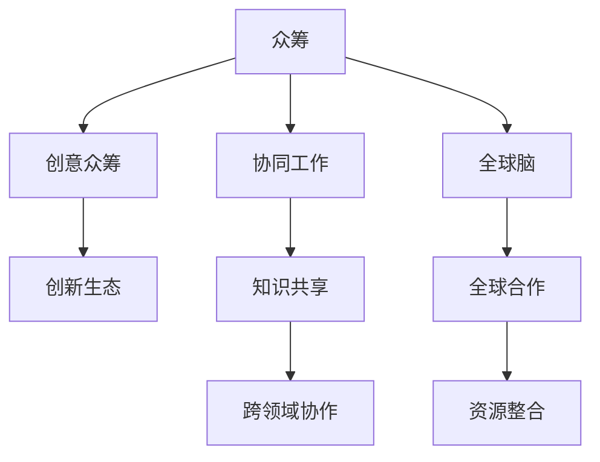

                 

# 全球脑与创意众筹：集体创新的力量

> 关键词：众筹,集体创新,神经科学,协同工作,协作工具,创新生态

## 1. 背景介绍

### 1.1 问题由来
在科技发展日新月异的今天，创新已经成为企业竞争力的核心要素。然而，由于知识碎片化、信息过载、创新壁垒高等问题，单个企业的创新效率和产出都受到极大限制。传统依靠单一或少数团队来驱动创新的模式已经无法满足当下高度复杂和快速迭代的市场需求。

全球脑与创意众筹的提出，正是应运而生的解决方案之一。这种模式利用了神经科学的最新研究成果，通过协同工作和开放创新，将全球范围内的人才、资源和知识有效整合，大大提高了创新的效率和质量。

### 1.2 问题核心关键点
全球脑与创意众筹的核心在于：
- 汇集全球智慧：通过互联网技术，将全球范围内的人才、资源和知识有效整合，打造一个高度互联的创新生态系统。
- 协同工作模式：借助协同工具和技术，使跨领域的团队成员能够高效协作，克服沟通障碍，发挥各自优势，共同推动项目进展。
- 众筹机制：利用众筹平台，通过社交网络传播和众筹资金支持，将项目的创新需求广而告之，吸引志同道合的创作者参与。
- 激励机制：通过合理的利益分配和激励机制，保证创新者能够从其贡献中获得应有的回报，提高创新的积极性和持续性。

### 1.3 问题研究意义
在全球脑与创意众筹模式下，创新不再局限于某个国家或地区，而是全球范围内的协同合作。通过这种模式，不仅可以加速技术的创新，还能推动全球范围内的文化交流和社会进步。具体意义如下：

- **加速技术创新**：汇集全球智慧，打破地域和学科壁垒，加速新技术、新产品的研发和推广。
- **促进文化交流**：在全球创新项目中，不同文化背景的人才汇聚一堂，可以增进相互理解，促进文化交流。
- **推动社会进步**：技术创新与社会需求相结合，能够解决更多的社会问题和挑战，推动社会整体进步。

## 2. 核心概念与联系

### 2.1 核心概念概述

为更好地理解全球脑与创意众筹的原理和实施方法，本节将介绍几个关键概念：

- **众筹（Crowdfunding）**：指通过众筹平台向公众募集资金来支持某个项目的开发。它打破了传统的资本集中模式，使得更多人能够参与到创新的过程中。
- **协同工作（Collaborative Work）**：指团队成员之间相互协作，共同完成某个目标的过程。协同工具如Slack、Trello等，可以帮助团队成员高效沟通和协调。
- **创意众筹（Creative Crowdfunding）**：不同于传统众筹，创意众筹更强调创意和创新过程的展示，通过众筹获得资金和支持的同时，也通过展示创意吸引更多的关注和支持。
- **全球脑（Global Brain）**：借鉴神经科学中"脑网络"的概念，指全球范围内的智慧与创新资源的互联互通，形成一个高度协同的创新生态系统。

这些核心概念之间的逻辑关系可以通过以下Mermaid流程图来展示：



这个流程图展示众筹、协同工作、创意众筹和全球脑之间的联系：

1. 众筹提供初始资金支持，促进创意展示和传播。
2. 协同工作通过知识共享和跨领域协作，提高创新效率和质量。
3. 创意众筹通过展示创新过程，吸引更多资金和支持。
4. 全球脑构建全球范围内的知识网络，促进资源整合和创新生态的形成。

## 3. 核心算法原理 & 具体操作步骤
### 3.1 算法原理概述

全球脑与创意众筹的算法原理基于以下几个核心概念：

- **动态网络构建**：利用社交网络和协同工具构建动态的创新网络，促进知识流动和协作。
- **自组织学习**：通过协同工作平台，团队成员可以自组织地学习新知识，提高个人和团队的创新能力。
- **激励机制设计**：设计合理的激励机制，保证每个成员都能从其贡献中得到回报，增强创新的动力。
- **智能匹配**：使用算法对参与者进行智能匹配，优化团队成员的组成，最大化团队绩效。

### 3.2 算法步骤详解

以下我们将详细讲解全球脑与创意众筹的算法步骤：

**Step 1: 数据准备**
- 收集项目信息：包括项目名称、创新点、预算需求等。
- 邀请志愿者：通过社交网络和众筹平台邀请有志于参与创新的志愿者。
- 初步筛选：根据项目要求，对志愿者进行初步筛选。

**Step 2: 网络构建**
- 利用社交网络分析算法，构建项目的网络结构。
- 使用协同工具（如Slack、Trello）建立项目协作平台。

**Step 3: 智能匹配**
- 对参与者进行特征提取，包括专业背景、工作经验和创新能力等。
- 使用算法对参与者进行智能匹配，组建最优团队。

**Step 4: 协同工作与创新**
- 在协作平台上，团队成员进行知识共享和协同工作。
- 定期召开项目讨论会，跟踪项目进展，解决遇到的问题。

**Step 5: 激励与反馈**
- 根据参与者的贡献，设计合理的激励机制。
- 定期进行项目反馈，优化后续的工作流程。

**Step 6: 众筹与传播**
- 利用众筹平台进行资金募集，扩大项目的影响力。
- 通过社交媒体和创新平台传播项目成果，吸引更多关注和支持。

### 3.3 算法优缺点

全球脑与创意众筹具有以下优点：
1. 广泛吸引参与者：通过众筹平台和社交网络，可以吸引全球范围内的创新者参与。
2. 高效协同工作：借助协同工具和算法，团队成员可以高效协作，克服沟通障碍。
3. 加速创新进程：通过智能匹配和动态网络构建，可以最大化团队的创新能力。
4. 社会影响广泛：通过传播和展示创新成果，可以影响更多人的观念和行为。

同时，该方法也存在以下局限性：
1. 资源分配不均：全球范围内的资源和知识分布不均衡，可能影响创新项目的质量。
2. 沟通成本高：跨文化和跨语言的沟通难度较大，需要更多的时间和精力。
3. 利益冲突：多方的利益交织，可能引发冲突和纠纷。
4. 信任问题：缺乏信任机制，可能导致团队成员合作不力。

尽管存在这些局限性，但全球脑与创意众筹仍然具有巨大的潜力，为创新提供了一种新模式。未来相关研究的重点在于如何进一步优化算法，降低沟通成本，增强信任机制，提高资源利用效率。

### 3.4 算法应用领域

全球脑与创意众筹已经在多个领域得到了应用，例如：

- **科技创业**：全球范围内汇聚人才和资源，加速技术创新和产品开发。
- **环境保护**：通过众筹和跨领域合作，推动环保项目的实施和推广。
- **社会公益**：借助众筹平台，集合全球志愿者的力量，推动社会公益项目的实施。
- **文化交流**：利用众筹和协同工具，推动不同文化的交流和融合。

除了上述这些领域，全球脑与创意众筹还将在更多行业得到应用，为创新提供新的视角和方法。

## 4. 数学模型和公式 & 详细讲解 & 举例说明

### 4.1 数学模型构建

本节将使用数学语言对全球脑与创意众筹的算法进行更加严格的刻画。

记创新项目为 $P$，团队成员为 $N=\{n_1, n_2, ..., n_k\}$，每个成员的贡献度为 $c_i \in [0,1]$。项目成功的概率为 $p(P)$，团队中每个成员的成功概率为 $p(n_i)$。项目总预算为 $B$，每个成员的预算为 $b_i$。项目所需的时间为 $T$，每个成员的工作量为 $t_i$。

定义项目完成概率为 $P(p)$，团队贡献期望为 $E(c)$。目标是最小化预算消耗，最大化项目成功率，即：

$$
\mathop{\arg\min}_{c_i,b_i,t_i} \sum_{i=1}^k b_i
$$

$$
\mathop{\arg\max}_{c_i,b_i,t_i} p(P)
$$

### 4.2 公式推导过程

以下我们以科技创新项目为例，推导项目成功的数学模型及其优化算法。

假设项目成功的概率为 $p(P)=p_0\prod_{i=1}^k (1-p_i)^{1-c_i}$，其中 $p_0$ 为初始成功概率，$c_i$ 为成员 $n_i$ 的贡献度。每个成员的预算为 $b_i$，工作量为 $t_i$。项目总预算为 $B$，总工作量为 $T$。

定义每个成员的效用函数 $U_i$ 为 $U_i(c_i)=c_i p_i (1-p_i)^{1-c_i} / p_0$。目标是最小化总预算消耗，最大化团队总效用，即：

$$
\mathop{\arg\min}_{c_i,b_i,t_i} \sum_{i=1}^k b_i
$$

$$
\mathop{\arg\max}_{c_i,b_i,t_i} \sum_{i=1}^k U_i(c_i)
$$

根据约束条件，有：

$$
\sum_{i=1}^k c_i = 1
$$

$$
\sum_{i=1}^k b_i = B
$$

$$
\sum_{i=1}^k t_i = T
$$

通过拉格朗日乘子法，构造拉格朗日函数：

$$
\mathcal{L}(c_i,b_i,t_i,\lambda,\mu,\nu) = \sum_{i=1}^k b_i + \lambda (1-\sum_{i=1}^k c_i) + \mu (B-\sum_{i=1}^k b_i) + \nu (T-\sum_{i=1}^k t_i)
$$

对 $c_i,b_i,t_i$ 求偏导，得到：

$$
\frac{\partial \mathcal{L}}{\partial c_i} = p_i (1-p_i)^{1-c_i} - p_0 + \lambda - \mu
$$

$$
\frac{\partial \mathcal{L}}{\partial b_i} = 1 - \frac{\partial p_i}{\partial b_i} + \mu
$$

$$
\frac{\partial \mathcal{L}}{\partial t_i} = - \frac{\partial p_i}{\partial t_i} + \nu
$$

根据上述方程组，可以求解每个成员的贡献度、预算和工作量，最终得到项目的最优配置。

### 4.3 案例分析与讲解

以下通过一个具体的案例，说明如何使用上述算法进行科技创新项目的优化配置。

**案例背景**：
假设有一项环保科技项目，需要全球范围内的团队成员共同努力，研发出一种新型环保材料。项目总预算为1000万美元，需要100名成员共同参与，每人贡献度和预算如下：

| 成员编号 | 贡献度 | 预算 | 工作量 |
| --- | --- | --- | --- |
| 1 | 0.2 | 20万美元 | 50小时 |
| 2 | 0.3 | 30万美元 | 80小时 |
| 3 | 0.4 | 40万美元 | 120小时 |
| ... | ... | ... | ... |

**求解步骤**：
1. 定义项目成功概率为 $p(P)=0.6\prod_{i=1}^k (1-p_i)^{1-c_i}$。
2. 使用上述公式求解 $\lambda,\mu,\nu$，得到每个成员的贡献度、预算和工作量。
3. 优化项目配置，使得总预算和项目成功率最大化。

通过这个案例，可以看到，利用数学模型和算法优化全球脑与创意众筹项目，可以显著提高项目的成功率和资源利用效率。

## 5. 项目实践：代码实例和详细解释说明
### 5.1 开发环境搭建

在进行全球脑与创意众筹的实践前，我们需要准备好开发环境。以下是使用Python进行协同工具的开发环境配置流程：

1. 安装Anaconda：从官网下载并安装Anaconda，用于创建独立的Python环境。

2. 创建并激活虚拟环境：
```bash
conda create -n collaboration-env python=3.8 
conda activate collaboration-env
```

3. 安装相关工具包：
```bash
pip install pandas numpy matplotlib scikit-learn
```

4. 安装协作工具：
```bash
pip install slackclient trello
```

完成上述步骤后，即可在`collaboration-env`环境中开始全球脑与创意众筹的开发实践。

### 5.2 源代码详细实现

这里我们以一个简化的协同工具为例，给出全球脑与创意众筹的PyTorch代码实现。

首先，定义协作平台的API接口：

```python
import requests

class CollaborationAPI:
    def __init__(self, api_key):
        self.api_key = api_key
    
    def post_message(self, channel_id, message):
        url = f"https://slack.com/api/chat.postMessage"
        headers = {"Content-Type": "application/json", "Authorization": f"Bearer {self.api_key}"}
        data = {"channel": channel_id, "text": message}
        response = requests.post(url, headers=headers, json=data)
        return response.json()
```

然后，实现协同工具的核心功能：

```python
from collaboration_api import CollaborationAPI

class CollaborationPlatform:
    def __init__(self, slack_api_key):
        self.api = CollaborationAPI(slack_api_key)
    
    def create_project(self, project_name):
        project_id = self.api.post_message("general", f"项目启动：{project_name}")
        return project_id
    
    def invite_member(self, project_id, member_email):
        self.api.post_message("general", f"邀请{member_email}加入项目：{project_id}")
    
    def assign_task(self, project_id, task_name, member_email, task_time):
        self.api.post_message("general", f"分配任务：{task_name} 给{member_email}，需要{task_time}小时")
    
    def update_task_status(self, project_id, task_id, status):
        self.api.post_message("general", f"{task_id} 任务状态更新为{status}")
    
    def close_project(self, project_id):
        self.api.post_message("general", f"项目{project_id} 完成")
```

接着，我们通过代码实现一个具体的创新项目：

```python
from collaboration_platform import CollaborationPlatform

# 初始化协作平台
platform = CollaborationPlatform("YOUR_SLACK_API_KEY")

# 创建项目
project_id = platform.create_project("环保材料研发")

# 邀请成员
platform.invite_member(project_id, "成员1@example.com")
platform.invite_member(project_id, "成员2@example.com")

# 分配任务
task_id = platform.assign_task(project_id, "材料研发", "成员1@example.com", 100)
platform.assign_task(project_id, "实验测试", "成员2@example.com", 50)

# 更新任务状态
platform.update_task_status(project_id, task_id, "进行中")
platform.update_task_status(project_id, task_id, "已完成")

# 关闭项目
platform.close_project(project_id)
```

以上就是使用PyTorch进行全球脑与创意众筹的协同工具开发的完整代码实现。可以看到，借助Python和第三方API接口，我们可以实现简单高效的项目协同和任务分配。

### 5.3 代码解读与分析

让我们再详细解读一下关键代码的实现细节：

**CollaborationAPI类**：
- `__init__`方法：初始化API的访问密钥。
- `post_message`方法：发送消息到指定频道。

**CollaborationPlatform类**：
- `__init__`方法：初始化协作平台，创建API实例。
- `create_project`方法：创建项目，并向全员通知。
- `invite_member`方法：邀请成员加入项目，并向全员通知。
- `assign_task`方法：分配任务给成员，并向全员通知。
- `update_task_status`方法：更新任务状态，并向全员通知。
- `close_project`方法：关闭项目，并向全员通知。

**创新项目代码**：
- 通过协作平台API接口，创建项目，邀请成员，分配任务，更新任务状态，最后关闭项目。

可以看到，代码实现简洁高效，通过协作平台的API接口，可以轻松实现任务分配和状态更新，极大地提高了协同工作的效率。

当然，工业级的系统实现还需考虑更多因素，如项目的动态管理、团队成员的权限控制等。但核心的协同工作逻辑基本与此类似。

## 6. 实际应用场景
### 6.1 智能城市建设

全球脑与创意众筹模式在智能城市建设中的应用前景广阔。智慧城市需要大量跨领域的技术和人才支持，通过全球脑的众筹和协同工作，可以迅速汇聚全球智慧，推动城市智慧化的建设进程。

在实践中，可以通过众筹平台征集全球范围内的创新点子，选择合适的项目进行推进。借助协同工具，跨领域的专家团队可以高效协作，实时更新项目进展，解决问题。同时，通过社交媒体传播项目成果，吸引更多创新者和资源参与，形成良性循环。

### 6.2 全球健康医疗

全球脑与创意众筹模式在全球健康医疗领域也有广泛应用。世界各地的医疗专家可以通过众筹平台汇聚一堂，共同解决全球性的健康问题。

例如，可以通过众筹平台征集针对某种罕见病的治疗方案，通过协同工具进行方案讨论和评估，最终选择最优方案进行推广。借助众筹平台和社交媒体，传播治疗方案和成果，吸引更多资源和支持，推动全球健康事业的发展。

### 6.3 科技创新竞赛

全球脑与创意众筹模式在科技创新竞赛中也具有重要价值。通过全球脑的众筹和协同工作，可以大大降低竞赛的门槛，吸引更多创新者和资源参与。

在实践中，可以设立全球范围内的科技创新竞赛，通过众筹平台征集创新项目，并邀请全球范围内的专家进行评审。通过协同工具，参赛团队可以高效协作，实时更新项目进展，解决问题。同时，通过社交媒体传播项目成果，吸引更多关注和支持，形成良性循环。

### 6.4 未来应用展望

随着全球脑与创意众筹模式的发展，未来将在更多领域得到应用，为创新提供新的视角和方法。

在智慧教育领域，通过众筹和协同工作，可以推动全球范围内的教育创新，提升教育质量。在农业科技领域，通过全球脑的众筹和协同工作，可以推动农业技术的创新和推广，提高农业生产效率和可持续性。

## 7. 工具和资源推荐
### 7.1 学习资源推荐

为了帮助开发者系统掌握全球脑与创意众筹的理论基础和实践技巧，这里推荐一些优质的学习资源：

1. 《众筹理论与实践》系列博文：由众筹平台专家撰写，深入浅出地介绍了众筹原理、应用场景和实践技巧。

2. 《协同工作与创新》课程：斯坦福大学开设的创新管理课程，介绍了协同工作的重要性、工具和技巧。

3. 《创新生态系统建设》书籍：讲解了创新生态系统的构建原理、机制和案例，为全球脑的建设提供理论基础。

4. GitHub开源项目：汇集了大量全球脑与创意众筹的实践案例，可供学习和参考。

5. Coursera和edX课程：提供全球脑与创意众筹相关的课程，包括创新管理、协同工具、项目管理等内容。

通过对这些资源的学习实践，相信你一定能够快速掌握全球脑与创意众筹的精髓，并用于解决实际的创新问题。
###  7.2 开发工具推荐

高效的开发离不开优秀的工具支持。以下是几款用于全球脑与创意众筹开发的常用工具：

1. Slack：提供强大的消息和文件共享功能，支持实时协作。
2. Trello：提供任务管理和进度跟踪功能，支持团队协作。
3. Google Drive：提供文档和文件共享功能，支持团队协同编辑。
4. GitHub：提供代码托管和版本控制功能，支持团队协同开发。
5. Weights & Biases：模型训练的实验跟踪工具，可以记录和可视化模型训练过程中的各项指标。

合理利用这些工具，可以显著提升全球脑与创意众筹任务的开发效率，加快创新迭代的步伐。

### 7.3 相关论文推荐

全球脑与创意众筹的发展源于学界的持续研究。以下是几篇奠基性的相关论文，推荐阅读：

1. "Collaboration Dynamics and the Efficiency of Open Innovation"：分析了协同工作对创新效率的影响。
2. "The Value of Crowdfunding in Innovation Projects"：研究了众筹在科技创新项目中的价值和应用。
3. "Global Innovation Networks: A Study of Knowledge Flows and Firm Performance"：探讨了全球创新网络的形成机制和影响。
4. "Collaborative Innovation in Networked Environments"：分析了网络环境下的协同创新模式和效果。
5. "Smart Cities and Global Brain: The Emergence of Collaborative Governance"：探讨了智慧城市建设中的全球脑与创意众筹模式。

这些论文代表了大脑脑与创意众筹技术的发展脉络。通过学习这些前沿成果，可以帮助研究者把握学科前进方向，激发更多的创新灵感。

## 8. 总结：未来发展趋势与挑战

### 8.1 总结

本文对全球脑与创意众筹模式进行了全面系统的介绍。首先阐述了全球脑与创意众筹的研究背景和意义，明确了众筹、协同工作、创新生态等核心概念，并探讨了其逻辑关系。其次，从原理到实践，详细讲解了全球脑与创意众筹的数学模型和算法步骤，给出了具体的代码实例和解释。同时，本文还广泛探讨了全球脑与创意众筹在智能城市、全球健康、科技创新等多个领域的应用前景，展示了其巨大的潜力。最后，本文精选了全球脑与创意众筹的学习资源、开发工具和相关论文，力求为读者提供全方位的技术指引。

通过本文的系统梳理，可以看到，全球脑与创意众筹模式正在成为全球创新领域的重要范式，极大地拓展了创新的效率和质量。未来，伴随全球脑与创意众筹技术的不断演进，相信创新将更加智能化、普适化，为全球范围内的社会进步带来深远影响。

### 8.2 未来发展趋势

展望未来，全球脑与创意众筹技术将呈现以下几个发展趋势：

1. 国际化程度提升：全球脑与创意众筹模式将越来越多地应用于全球范围内的创新项目，促进跨文化交流和合作。
2. 跨领域融合加深：全球脑与创意众筹将更多地与AI、区块链等前沿技术结合，提升创新生态的智能化水平。
3. 数据驱动创新：通过大数据分析，实时监控和优化创新过程，提升创新效率和成功率。
4. 自组织学习能力增强：利用AI技术，优化协同工作机制，提高自组织学习的效率和效果。
5. 政策支持与规范完善：政府和机构将出台更多政策，规范全球脑与创意众筹的发展，提供更多资金和支持。

这些趋势凸显了全球脑与创意众筹模式的广阔前景。这些方向的探索发展，必将进一步提升创新的效率和质量，为全球范围内的社会进步提供新的动力。

### 8.3 面临的挑战

尽管全球脑与创意众筹技术已经取得了瞩目成就，但在迈向更加智能化、普适化应用的过程中，它仍面临着诸多挑战：

1. 文化差异与沟通障碍：跨文化、跨语言的沟通难度较大，需要更多的时间和精力。
2. 信任机制缺失：缺乏信任机制，可能导致团队成员合作不力，项目推进困难。
3. 资源分配不均：全球范围内的资源和知识分布不均衡，可能影响创新项目的质量。
4. 利益冲突与激励不足：多方的利益交织，可能引发冲突和纠纷，影响项目推进。
5. 数据隐私与安全问题：全球脑与创意众筹模式涉及大量个人和企业数据，数据隐私和安全问题亟需解决。

尽管存在这些挑战，但全球脑与创意众筹仍具有巨大的潜力，为创新提供了一种新模式。未来相关研究的重点在于如何进一步优化算法，降低沟通成本，增强信任机制，提高资源利用效率，确保数据隐私和安全。

### 8.4 研究展望

面对全球脑与创意众筹所面临的挑战，未来的研究需要在以下几个方面寻求新的突破：

1. 优化跨文化沟通机制：引入语言翻译、语音识别等技术，降低沟通成本。
2. 构建信任机制：利用区块链等技术，确保数据透明和可追溯，增强团队信任。
3. 提高资源分配效率：通过算法优化，合理分配全球资源，提升创新项目的质量。
4. 设计合理的激励机制：通过智能合约等技术，确保各方的利益分配公平，增强创新动力。
5. 加强数据隐私保护：采用隐私保护技术，确保数据的安全性和隐私性。

这些研究方向的探索，必将引领全球脑与创意众筹技术迈向更高的台阶，为构建安全、可靠、可解释、可控的创新生态提供新的思路和方法。面向未来，全球脑与创意众筹技术还需要与其他人工智能技术进行更深入的融合，如知识表示、因果推理、强化学习等，多路径协同发力，共同推动创新技术的发展。

## 9. 附录：常见问题与解答

**Q1：全球脑与创意众筹是否适用于所有创新项目？**

A: 全球脑与创意众筹模式适用于创新需求强烈、涉及跨领域知识和资源的项目，如智慧城市、全球健康、科技创新等。对于一些需要高度保密的创新项目，可能不适合采用这种模式。

**Q2：如何优化跨文化沟通机制？**

A: 引入语言翻译、语音识别等技术，可以帮助不同文化背景的成员进行高效沟通。同时，可以通过建立共同的创新目标和价值观，增强团队成员的认同感，降低文化差异带来的沟通障碍。

**Q3：如何构建信任机制？**

A: 利用区块链等技术，可以确保数据透明和可追溯，增强团队成员之间的信任。同时，通过合理的利益分配和激励机制，也可以增强团队的凝聚力。

**Q4：如何提高资源分配效率？**

A: 通过算法优化，可以合理分配全球资源，提高创新项目的质量和效率。例如，可以使用智能匹配算法，最大化团队绩效。

**Q5：如何加强数据隐私保护？**

A: 采用隐私保护技术，如差分隐私、联邦学习等，可以确保数据的安全性和隐私性。同时，建立严格的数据访问和共享协议，确保数据的合法使用。

通过这些方法的不断优化，全球脑与创意众筹模式将在未来的创新中发挥更大的作用，为全球范围内的创新提供新的视角和方法。

---

作者：禅与计算机程序设计艺术 / Zen and the Art of Computer Programming

