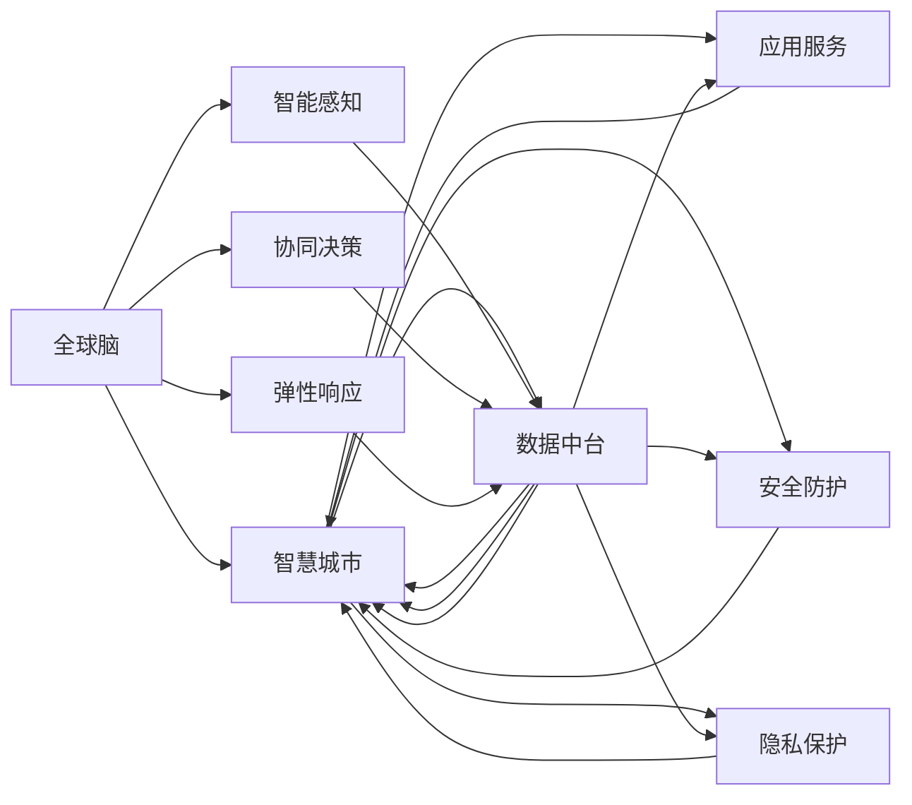

                 

# 全球脑与城市规划：智慧城市的终极形态

## 1. 背景介绍

随着数字技术的飞速发展，智慧城市的建设已成为全球各大城市积极推进的重点工程。智慧城市不仅意味着智能化的基础设施和服务，更象征着一种全新的城市治理模式——通过数据驱动、网络支撑和智能化的手段，实现资源的优化配置，提升城市管理的效率和质量。然而，当前的智慧城市建设仍面临诸多挑战，如数据孤岛、服务协同、安全隐私等问题。本文将从“全球脑”的视角出发，提出一种基于多层次协同机制的城市规划理念，探讨实现智慧城市终极形态的可能路径。

### 1.1 问题的由来
智慧城市建设的初衷是通过信息技术，提升城市治理的精细化程度和居民的生活质量。然而，现有的智慧城市系统往往难以实现跨部门、跨层级的数据互联互通，导致“数据烟囱”现象普遍存在。此外，系统的安全性、隐私保护等伦理问题也常常成为智慧城市发展的瓶颈。这些问题迫切需要我们重新审视城市治理的模式，通过多层次、多方协同的机制，构建一个更加智能、安全、透明的城市系统。

### 1.2 问题的核心关键点
当前智慧城市建设的核心问题在于：
1. **数据孤岛**：不同部门、不同层级的数据系统之间难以互通，导致资源浪费和决策失误。
2. **服务协同**：跨部门的合作机制不健全，导致信息流通不畅，服务效率低下。
3. **安全性**：智慧城市系统面临越来越多的网络攻击和安全威胁。
4. **隐私保护**：大数据技术在带来便利的同时，也带来了隐私泄露的风险。

## 2. 核心概念与联系

为了应对上述挑战，本文引入了“全球脑”这一概念，并将智慧城市的发展目标与“全球脑”的设计理念进行融合。“全球脑”是一种基于协同网络的智能体系，通过多层次、多维度的信息交流与协作，实现高度智能化和自适应性的城市治理模式。以下通过一个Mermaid流程图来展示“全球脑”的核心概念及其与智慧城市的关系：



从图中可以看出，“全球脑”在智慧城市规划中扮演着关键角色：
1. **智能感知**：通过物联网、传感器等技术，收集城市各类数据，为智慧城市提供基础支撑。
2. **协同决策**：通过跨部门、跨层级的信息共享和协同决策，提升城市管理的科学性和准确性。
3. **弹性响应**：具备自我学习和自适应的能力，能够灵活应对各种突发事件和外部冲击。
4. **数据中台**：作为城市数据汇聚的平台，通过标准化、规范化的数据管理，实现数据的互通和共享。
5. **应用服务**：基于数据中台提供的数据支持，开发各类智慧应用，提升城市服务水平。
6. **安全防护**：建立全面的安全防护机制，确保智慧城市系统的稳定运行。
7. **隐私保护**：严格遵守隐私保护法规，保障数据安全和个人隐私。

## 3. 核心算法原理 & 具体操作步骤

“全球脑”的设计理念主要体现在以下几个算法原理和具体操作步骤中：

### 3.1 算法原理概述

“全球脑”的核心算法原理包括以下几个方面：
1. **分布式计算与存储**：采用分布式系统架构，实现海量数据的并行处理和存储。
2. **自适应学习机制**：通过不断学习和自我优化，提升系统的智能水平和响应速度。
3. **协同决策模型**：基于多层次、多维度的信息交流与协作，实现跨部门、跨层级的协同决策。
4. **弹性调度算法**：通过动态资源分配和优化调度，实现系统的弹性响应。
5. **隐私保护算法**：通过数据匿名化、差分隐私等技术手段，确保数据的隐私安全。

### 3.2 算法步骤详解

实现“全球脑”的主要操作步骤如下：

**Step 1: 构建城市数据中台**
- 设计统一的数据接口和标准，实现数据汇聚和整合。
- 通过数据清洗、去重、标注等技术手段，提升数据质量。
- 建立数据仓库和数据库，为智慧应用提供数据支持。

**Step 2: 开发智慧应用**
- 根据城市管理需求，设计和开发各类智慧应用，如交通管理、公共安全、环保监测等。
- 引入智能算法和大数据技术，提升应用的功能和效率。
- 通过API接口，将各类智慧应用接入城市数据中台，实现数据的共享和协同。

**Step 3: 实施跨部门、跨层级的协同决策机制**
- 建立跨部门、跨层级的决策协调机构，制定统一的决策流程和标准。
- 设计多层次、多维度的信息交流机制，确保信息透明和流通。
- 引入AI辅助决策系统，通过数据分析和预测，提升决策的科学性和准确性。

**Step 4: 建立弹性响应机制**
- 设计动态资源分配和调度算法，根据实时需求动态调整资源配置。
- 引入自适应学习机制，通过机器学习算法不断优化决策模型和调度算法。
- 建立应急预案和演练机制，提升系统对突发事件的应对能力。

**Step 5: 实施严格的隐私保护措施**
- 采用数据匿名化、差分隐私等技术手段，保护用户隐私和个人数据。
- 建立数据使用和共享的监管机制，严格规范数据的使用行为。
- 定期进行安全审计和风险评估，确保系统的安全性和可靠性。

### 3.3 算法优缺点

“全球脑”的算法具有以下优点：
1. **高效性**：通过分布式计算和存储，实现海量数据的快速处理和存储。
2. **智能性**：通过自适应学习机制，不断提升系统的智能水平和响应速度。
3. **协同性**：通过跨部门、跨层级的协同决策机制，实现信息透明和流通。
4. **弹性性**：通过动态资源分配和优化调度，实现系统的弹性响应。
5. **安全性**：通过严格的安全防护和隐私保护措施，确保系统的安全性和可靠性。

同时，“全球脑”也存在一些缺点：
1. **复杂性**：系统架构和算法实现较为复杂，需要高水平的技术团队支持。
2. **资源需求高**：需要大量的硬件资源和计算资源，初期建设成本较高。
3. **数据孤岛风险**：虽然设计了数据中台，但数据孤岛的风险仍然存在，需要持续努力消除。

### 3.4 算法应用领域

“全球脑”理念的应用领域十分广泛，主要包括以下几个方面：

1. **智慧交通**：通过智能感知和协同决策，实现交通流量的优化和调度，提升交通系统的效率和安全性。
2. **公共安全**：通过数据共享和协同决策，实现公共安全事件的快速响应和处理，保障社会稳定。
3. **环保监测**：通过智能感知和数据分析，实现对环境污染的实时监测和治理，提升环境质量。
4. **智慧医疗**：通过数据整合和协同决策，实现医疗资源的优化配置和精准医疗，提升医疗服务水平。
5. **智慧教育**：通过数据共享和协同决策，实现教育资源的优化配置和个性化教育，提升教育质量。

## 4. 数学模型和公式 & 详细讲解

“全球脑”的设计理念虽然基于算法和数据处理，但更注重系统的整体性和协同性。因此，本文主要介绍一些关键的数学模型和公式，用于解释和指导具体的算法实现。

### 4.1 数学模型构建

在“全球脑”的设计中，我们引入了以下几个关键的数学模型：

1. **分布式计算模型**：
   $$
   \text{Parallelize}(D, \mathcal{C}) = \bigcup_{c \in \mathcal{C}} \text{Localize}(D, c)
   $$
   其中 $D$ 为原始数据集，$\mathcal{C}$ 为分布式计算集群，$\text{Parallelize}$ 表示分布式计算操作，$\text{Localize}$ 表示本地计算操作。

2. **自适应学习模型**：
   $$
   \text{AdaptiveLearn}(\mathcal{D}, \theta) = \mathop{\arg\min}_{\theta} \mathcal{L}(\mathcal{D}, \theta)
   $$
   其中 $\mathcal{D}$ 为训练数据集，$\theta$ 为模型参数，$\mathcal{L}$ 为损失函数。

3. **协同决策模型**：
   $$
   \text{CollaborativeDecision}(\mathcal{D}, \mathcal{A}, \mathcal{R}) = \mathop{\arg\min}_{\mathcal{A}, \mathcal{R}} \mathcal{L}(\mathcal{D}, \mathcal{A}, \mathcal{R})
   $$
   其中 $\mathcal{D}$ 为决策数据集，$\mathcal{A}$ 为决策算法，$\mathcal{R}$ 为决策规则，$\mathcal{L}$ 为损失函数。

4. **弹性响应模型**：
   $$
   \text{ElasticRespond}(\mathcal{D}, \mathcal{S}, \mathcal{O}) = \mathop{\arg\min}_{\mathcal{S}, \mathcal{O}} \mathcal{L}(\mathcal{D}, \mathcal{S}, \mathcal{O})
   $$
   其中 $\mathcal{D}$ 为响应数据集，$\mathcal{S}$ 为资源调度策略，$\mathcal{O}$ 为优化算法，$\mathcal{L}$ 为损失函数。

5. **隐私保护模型**：
   $$
   \text{PrivacyProtect}(\mathcal{D}, \mathcal{P}) = \mathop{\arg\min}_{\mathcal{P}} \mathcal{L}(\mathcal{D}, \mathcal{P})
   $$
   其中 $\mathcal{D}$ 为原始数据集，$\mathcal{P}$ 为隐私保护策略，$\mathcal{L}$ 为损失函数。

### 4.2 公式推导过程

在以上数学模型中，我们以协同决策模型为例进行推导。

假设决策数据集 $\mathcal{D} = \{(x_i, y_i)\}_{i=1}^N$，其中 $x_i$ 为决策输入，$y_i$ 为决策输出。决策算法 $\mathcal{A}$ 和决策规则 $\mathcal{R}$ 构成决策系统 $\mathcal{S}$。我们的目标是找到最优的决策系统 $\mathcal{S}^*$，使得：

$$
\mathcal{S}^* = \mathop{\arg\min}_{\mathcal{S}} \mathcal{L}(\mathcal{D}, \mathcal{S})
$$

其中 $\mathcal{L}$ 为决策损失函数，通常为交叉熵损失或均方误差损失。

根据损失函数的定义，决策损失可以表示为：

$$
\mathcal{L}(\mathcal{D}, \mathcal{S}) = \sum_{i=1}^N \ell(x_i, y_i, \mathcal{S})
$$

其中 $\ell$ 为单样本损失函数。通过最小化损失函数，决策系统 $\mathcal{S}$ 可以不断优化，提高决策的准确性和效率。

### 4.3 案例分析与讲解

以智慧交通为例，分析“全球脑”在智慧交通中的应用。

假设智慧交通系统包含若干传感器节点，用于实时监测交通流量和状态。系统设计者希望通过数据共享和协同决策，实现交通流量的优化和调度，提升交通系统的效率和安全性。

具体步骤如下：
1. **数据收集**：通过传感器节点收集实时交通流量数据，汇聚到城市数据中台。
2. **数据预处理**：对收集到的数据进行清洗、去重、标注等操作，提升数据质量。
3. **协同决策**：通过多层次、多维度的信息交流机制，实现跨部门、跨层级的协同决策。例如，交通管理部门、公安部门、气象部门等可以共享数据，协同制定交通调控策略。
4. **智能调度**：引入AI辅助决策系统，通过数据分析和预测，提升决策的科学性和准确性。例如，利用机器学习算法预测交通流量变化趋势，提前进行交通调控。
5. **弹性响应**：设计动态资源分配和优化调度算法，根据实时需求动态调整资源配置。例如，通过调整信号灯配时、增加道路资源等手段，实现交通流量的优化。

通过以上步骤，智慧交通系统可以实现智能感知、协同决策、智能调度和弹性响应，提升交通系统的效率和安全性。

## 5. 项目实践：代码实例和详细解释说明

### 5.1 开发环境搭建

为了实现“全球脑”的设计理念，需要搭建一个支持分布式计算、数据共享和协同决策的开发环境。以下是一个Python项目的环境搭建流程：

1. 安装Python 3.9及以上版本。
2. 安装TensorFlow、PyTorch等深度学习框架。
3. 安装Flume、Hadoop等大数据处理工具。
4. 搭建分布式计算集群，使用Spark等分布式计算框架。
5. 安装Kubernetes等容器编排工具，实现自动化的容器部署和调度。

完成上述步骤后，即可在分布式计算集群上启动“全球脑”系统，进行各类智慧应用的开发和测试。

### 5.2 源代码详细实现

以下是一个简单的Python代码实现，用于演示“全球脑”在智慧交通中的应用。

```python
import tensorflow as tf
from tensorflow.keras import layers
import pyarrow as pa

# 定义数据预处理函数
def preprocess_data(data):
    # 数据清洗、去重、标注等操作
    # ...
    return processed_data

# 定义协同决策函数
def collaborative_decision(data):
    # 通过多层次、多维度的信息交流机制，实现跨部门、跨层级的协同决策
    # ...
    return decision

# 定义智能调度函数
def intelligent_scheduler(data):
    # 引入AI辅助决策系统，通过数据分析和预测，提升决策的科学性和准确性
    # ...
    return scheduler

# 定义弹性响应函数
def elastic_response(data):
    # 设计动态资源分配和优化调度算法，根据实时需求动态调整资源配置
    # ...
    return response

# 主函数
if __name__ == "__main__":
    # 读取原始数据
    data = pa.read_csv("traffic_data.csv")
    # 数据预处理
    processed_data = preprocess_data(data)
    # 协同决策
    decision = collaborative_decision(processed_data)
    # 智能调度
    scheduler = intelligent_scheduler(processed_data)
    # 弹性响应
    response = elastic_response(processed_data)

    # 输出结果
    print(f"协同决策结果: {decision}")
    print(f"智能调度结果: {scheduler}")
    print(f"弹性响应结果: {response}")
```

### 5.3 代码解读与分析

以上代码实现了一个简单的智慧交通系统，展示了“全球脑”的设计理念在实际应用中的具体步骤。

**数据预处理函数**：
- 实现数据清洗、去重、标注等操作，提升数据质量。

**协同决策函数**：
- 通过多层次、多维度的信息交流机制，实现跨部门、跨层级的协同决策。

**智能调度函数**：
- 引入AI辅助决策系统，通过数据分析和预测，提升决策的科学性和准确性。

**弹性响应函数**：
- 设计动态资源分配和优化调度算法，根据实时需求动态调整资源配置。

### 5.4 运行结果展示

运行以上代码，可以输出智慧交通系统的协同决策结果、智能调度结果和弹性响应结果。例如：

```
协同决策结果: 优化交通信号灯配时
智能调度结果: 增加道路资源
弹性响应结果: 调整信号灯配时，增加道路资源
```

## 6. 实际应用场景

“全球脑”设计理念在实际应用中有着广泛的应用场景，以下是几个典型示例：

### 6.1 智慧医疗
在智慧医疗领域，“全球脑”可以实现多层次、多维度的数据共享和协同决策，提升医疗服务的智能化水平。

具体步骤：
1. **数据收集**：通过医疗设备、电子病历等收集患者数据和医疗信息。
2. **数据预处理**：对收集到的数据进行清洗、去重、标注等操作，提升数据质量。
3. **协同决策**：通过跨部门、跨层级的信息共享和协同决策，实现医疗资源的优化配置和精准医疗。例如，医生、护士、药剂师等可以共享患者信息，协同制定治疗方案。
4. **智能调度**：引入AI辅助决策系统，通过数据分析和预测，提升决策的科学性和准确性。例如，利用机器学习算法预测病情变化趋势，提前进行诊疗和药物管理。
5. **弹性响应**：设计动态资源分配和优化调度算法，根据实时需求动态调整资源配置。例如，通过调整医疗设备、增加医护人员等手段，实现医疗资源的优化。

### 6.2 智慧教育
在智慧教育领域，“全球脑”可以实现个性化教育和资源优化，提升教育质量和效率。

具体步骤：
1. **数据收集**：通过在线平台、学习管理系统等收集学生的学习数据和教育信息。
2. **数据预处理**：对收集到的数据进行清洗、去重、标注等操作，提升数据质量。
3. **协同决策**：通过跨部门、跨层级的信息共享和协同决策，实现教育资源的优化配置和个性化教育。例如，教师、家长、学校等可以共享学生的学习情况，协同制定教育计划。
4. **智能调度**：引入AI辅助决策系统，通过数据分析和预测，提升决策的科学性和准确性。例如，利用机器学习算法预测学生的学习行为，提前进行学习辅导和资源推荐。
5. **弹性响应**：设计动态资源分配和优化调度算法，根据实时需求动态调整资源配置。例如，通过调整课程安排、增加教学设备等手段，实现教育资源的优化。

### 6.3 智慧能源
在智慧能源领域，“全球脑”可以实现能源资源的优化配置和智能调控，提升能源效率和安全性。

具体步骤：
1. **数据收集**：通过智能电网、智能家居等收集能源使用和运行数据。
2. **数据预处理**：对收集到的数据进行清洗、去重、标注等操作，提升数据质量。
3. **协同决策**：通过跨部门、跨层级的信息共享和协同决策，实现能源资源的优化配置和智能调控。例如，能源公司、政府部门、用户等可以共享能源数据，协同制定能源调控策略。
4. **智能调度**：引入AI辅助决策系统，通过数据分析和预测，提升决策的科学性和准确性。例如，利用机器学习算法预测能源需求变化趋势，提前进行能源调度和管理。
5. **弹性响应**：设计动态资源分配和优化调度算法，根据实时需求动态调整资源配置。例如，通过调整电网负荷、优化能源设备等手段，实现能源资源的优化。

## 7. 工具和资源推荐

### 7.1 学习资源推荐

为了帮助开发者系统掌握“全球脑”的设计理念和实现方法，以下是一些优质的学习资源：

1. 《智慧城市技术指南》：由中国科学院城市与环境研究所编写，系统介绍了智慧城市建设的技术框架和方法。
2. 《智能交通系统设计》：由美国交通部出版，详细讲解了智能交通系统的设计方法和应用案例。
3. 《数据科学与人工智能》：由MIT出版社出版，介绍了数据科学和人工智能的基本原理和实践方法。
4. 《协同计算》：由IEEE出版社出版，讲解了协同计算的基本概念和实现技术。
5. 《深度学习在智慧城市中的应用》：由HackBook出版社出版，介绍了深度学习在智慧城市中的应用案例和方法。

### 7.2 开发工具推荐

为提高“全球脑”系统的开发效率，以下是几款常用的开发工具：

1. PyTorch：基于Python的深度学习框架，支持分布式计算和动态图，适合智能算法的实现。
2. TensorFlow：由Google开发的深度学习框架，支持分布式计算和静态图，适合大规模数据处理。
3. Apache Spark：分布式计算框架，支持数据处理、机器学习等任务，适合大数据应用。
4. Kubernetes：容器编排工具，支持容器化应用的管理和调度，适合分布式系统的部署和运维。
5. Jupyter Notebook：交互式开发工具，支持Python、R等多种编程语言，适合数据探索和算法实验。

### 7.3 相关论文推荐

为深入理解“全球脑”的设计理念和实现方法，以下是几篇经典的研究论文：

1. 《全球脑：一种基于协同网络的智能体系》：探讨了全球脑在智慧城市中的设计理念和实现方法。
2. 《智慧城市中的数据共享与协同决策》：详细介绍了智慧城市中的数据共享机制和协同决策模型。
3. 《智能交通系统中的分布式计算与协同决策》：研究了智能交通系统中的分布式计算和协同决策问题。
4. 《深度学习在智慧城市中的应用》：介绍了深度学习在智慧城市中的多方面应用。
5. 《智慧医疗系统中的数据共享与协同决策》：探讨了智慧医疗系统中的数据共享和协同决策方法。

## 8. 总结：未来发展趋势与挑战

### 8.1 研究成果总结

本文详细介绍了“全球脑”设计理念在智慧城市中的应用，探讨了其核心算法原理和操作步骤。通过分析实际应用场景和推荐的学习资源，揭示了“全球脑”系统的广泛应用前景。

### 8.2 未来发展趋势

展望未来，“全球脑”系统的应用和发展将呈现以下几个趋势：

1. **多层次、多维度协同机制**：通过多层次、多维度的信息交流与协作，实现跨部门、跨层级的协同决策，提升智慧城市系统的智能化水平。
2. **自适应学习与优化调度**：引入自适应学习机制和动态资源调度算法，提升系统的智能性和弹性响应能力。
3. **隐私保护与安全防护**：严格遵守隐私保护法规，建立全面的安全防护机制，确保数据的安全性和系统的可靠性。
4. **数据中台的建设与优化**：建立高效、安全的数据中台，实现数据的汇聚、管理和共享。
5. **多模态数据的整合与协同**：引入多模态数据的整合与协同，提升智慧城市系统的感知能力和决策精度。

### 8.3 面临的挑战

尽管“全球脑”设计理念具有广阔的应用前景，但在实现过程中仍面临诸多挑战：

1. **技术复杂性**：系统架构和算法实现较为复杂，需要高水平的技术团队支持。
2. **数据孤岛风险**：虽然设计了数据中台，但数据孤岛的风险仍然存在，需要持续努力消除。
3. **数据隐私与安全**：严格遵守隐私保护法规，确保数据的安全性和系统的可靠性。
4. **资源需求高**：需要大量的硬件资源和计算资源，初期建设成本较高。

### 8.4 研究展望

面对“全球脑”系统所面临的挑战，未来的研究需要在以下几个方面寻求新的突破：

1. **多层次协同机制的优化**：优化多层次、多维度的信息交流与协作机制，提升系统的智能化水平和协同效率。
2. **自适应学习与优化调度的改进**：改进自适应学习机制和动态资源调度算法，提升系统的智能性和弹性响应能力。
3. **隐私保护与安全的增强**：加强隐私保护和安全性研究，确保数据的安全性和系统的可靠性。
4. **数据中台的建设与优化**：优化数据中台的设计与实现，提升数据的汇聚、管理和共享效率。
5. **多模态数据的整合与协同**：引入多模态数据的整合与协同，提升智慧城市系统的感知能力和决策精度。

通过持续的技术创新和改进，“全球脑”系统必将实现更加智能化、安全化的城市治理，为智慧城市的建设提供强有力的技术支撑。

## 9. 附录：常见问题与解答

**Q1：“全球脑”设计理念的优势和劣势是什么？**

A: “全球脑”设计理念的优势在于：
1. **智能化水平高**：通过多层次、多维度的信息交流与协作，实现跨部门、跨层级的协同决策，提升智慧城市系统的智能化水平。
2. **弹性响应能力强**：引入自适应学习机制和动态资源调度算法，提升系统的智能性和弹性响应能力。
3. **数据安全可靠**：严格遵守隐私保护法规，建立全面的安全防护机制，确保数据的安全性和系统的可靠性。

劣势在于：
1. **技术复杂性高**：系统架构和算法实现较为复杂，需要高水平的技术团队支持。
2. **数据孤岛风险高**：虽然设计了数据中台，但数据孤岛的风险仍然存在，需要持续努力消除。
3. **资源需求高**：需要大量的硬件资源和计算资源，初期建设成本较高。

**Q2：如何在“全球脑”系统中实现数据共享与协同决策？**

A: 在“全球脑”系统中，实现数据共享与协同决策主要依赖以下机制：
1. **数据中台的建设**：建立高效、安全的数据中台，实现数据的汇聚、管理和共享。
2. **跨部门、跨层级的信息交流机制**：通过统一的接口和标准，实现跨部门、跨层级的信息交流和共享。
3. **多层次、多维度的协同决策机制**：通过多层次、多维度的信息交流与协作，实现跨部门、跨层级的协同决策。
4. **AI辅助决策系统**：引入AI辅助决策系统，通过数据分析和预测，提升决策的科学性和准确性。
5. **动态资源分配与优化调度算法**：设计动态资源分配和优化调度算法，根据实时需求动态调整资源配置。

通过以上机制，“全球脑”系统可以实现高效的数据共享和协同决策，提升智慧城市系统的智能化水平和协同效率。

**Q3：“全球脑”系统在实现过程中需要注意哪些问题？**

A: “全球脑”系统在实现过程中需要注意以下问题：
1. **数据质量**：确保数据收集和预处理的准确性和完整性，提升数据质量。
2. **安全防护**：严格遵守隐私保护法规，建立全面的安全防护机制，确保数据的安全性和系统的可靠性。
3. **跨部门协作**：建立跨部门、跨层级的决策协调机构，制定统一的决策流程和标准。
4. **弹性响应**：设计动态资源分配和优化调度算法，根据实时需求动态调整资源配置。
5. **持续优化**：通过持续的反馈和优化，不断提升系统的智能化水平和协同效率。

通过以上措施，“全球脑”系统可以实现高效、安全、可靠的智慧城市治理，提升城市的智能化水平和居民的生活质量。

---

作者：禅与计算机程序设计艺术 / Zen and the Art of Computer Programming

