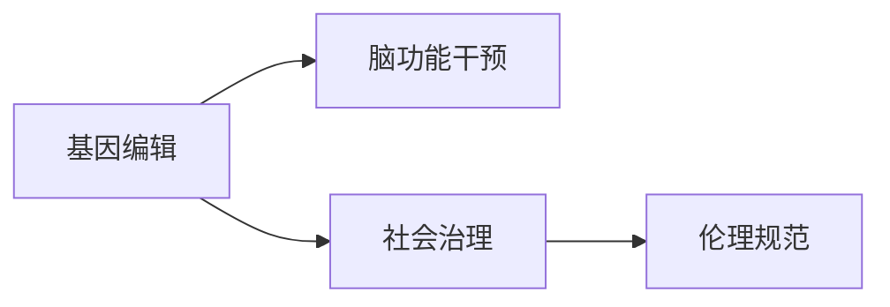

                 

# 全球脑与基因编辑:集体决策的伦理挑战

## 1. 背景介绍

随着人类基因编辑技术的突破和脑科学研究的新进展，全球范围内的脑与基因编辑应用正处于快速发展之中。基因编辑技术能够精准修改生物体的基因组，而脑科学技术的进步则使我们能够更加深入地理解脑功能与行为的关系。这两者的结合为改善人类健康和优化社会治理提供了前所未有的可能性，但同时也带来了巨大的伦理挑战。

### 1.1 技术进展与应用前景

基因编辑技术的代表包括CRISPR-Cas9及其衍生版本，这些技术使得对基因组的精确修改成为可能。脑科学方面，如磁共振成像(MRI)、脑电图(EEG)、脑磁图(MEG)等技术的进步，使得我们能够更加精准地观测和理解脑功能。

这些技术的结合，使得在脑与基因编辑方面有以下应用前景：
- **基因治疗**：修正导致遗传性疾病的基因突变，如血友病、囊性纤维化等。
- **脑功能提升**：通过基因编辑技术增强认知能力、记忆力等，提升个体智力。
- **社会优化**：通过基因编辑改善群体行为，如减少犯罪率、提升合作能力等。

### 1.2 伦理问题的凸显

然而，这些技术的应用也引发了诸多伦理问题，如基因隐私、基因歧视、社会公平等。脑与基因编辑技术的潜在应用还涉及更深层次的伦理问题，如人脑干预的道德边界、行为控制的社会风险等。这些问题需要在全球范围内进行深入讨论和规范。

## 2. 核心概念与联系

### 2.1 核心概念概述

在进行脑与基因编辑的伦理讨论时，需要明确以下几个核心概念：

- **基因编辑**：利用CRISPR-Cas9等技术，精准修改生物体的基因组。
- **脑功能干预**：通过脑科学技术的进步，改善和提升脑功能。
- **社会治理**：利用脑与基因编辑技术，优化社会治理结构，提升整体效率。
- **伦理规范**：建立全球统一的伦理准则，规范脑与基因编辑的应用行为。

### 2.2 核心概念原理和架构的 Mermaid 流程图(Mermaid 流程节点中不要有括号、逗号等特殊字符)



此流程图展示了脑与基因编辑技术在基因治疗、脑功能提升和社会优化中的应用路径，以及这些应用对伦理规范的影响。

## 3. 核心算法原理 & 具体操作步骤

### 3.1 算法原理概述

脑与基因编辑的伦理挑战，主要集中在以下三个方面：
- **基因隐私**：如何保护个体基因数据的隐私，防止数据滥用。
- **基因歧视**：基因编辑可能导致新的基因歧视，如何避免这种不公平现象。
- **行为控制**：通过基因编辑和脑功能干预，可能对个体行为进行控制，如何防止这种行为失控。

### 3.2 算法步骤详解

针对上述三个问题，可以采取以下算法步骤：

#### 3.2.1 基因隐私保护

- **数据匿名化**：对基因数据进行匿名化处理，确保数据隐私。
- **访问控制**：建立严格的访问控制机制，限制基因数据的访问权限。
- **数据加密**：对基因数据进行加密存储和传输，防止数据泄露。

#### 3.2.2 避免基因歧视

- **公平性评估**：对基因编辑技术进行公平性评估，确保不同人群都能公平受益。
- **法律监管**：制定相关法律法规，明确禁止基因编辑导致的歧视行为。
- **教育普及**：加强基因科学教育，提高公众对基因编辑技术的理解，减少误解和歧视。

#### 3.2.3 防止行为失控

- **行为监测**：建立行为监测机制，及时发现并纠正不当行为。
- **伦理审查**：对基因编辑和脑功能干预行为进行伦理审查，确保符合道德规范。
- **公众参与**：鼓励公众参与决策过程，确保决策的透明和公正。

### 3.3 算法优缺点

脑与基因编辑的伦理挑战解决方案，具有以下优点：
- **技术手段多样**：涵盖了数据匿名化、公平性评估、行为监测等多种技术手段。
- **法律和伦理结合**：通过法律和伦理的协同作用，确保技术应用的合法性和道德性。
- **公众参与**：鼓励公众参与，增强决策的透明度和公信力。

同时，这些解决方案也存在一些缺点：
- **执行难度大**：实现数据匿名化、公平性评估等技术手段需要高技术水平和资金支持。
- **法律法规滞后**：目前相关的法律法规尚未完善，需要进一步研究和制定。
- **公众认知差异**：不同文化和社会背景下，公众对基因编辑技术的接受度存在差异。

### 3.4 算法应用领域

这些解决方案在多个领域都有应用前景：
- **医疗领域**：保护患者基因隐私，确保基因治疗的公平性。
- **教育领域**：避免基因歧视，确保教育资源的公平分配。
- **社会治理**：通过行为监测和伦理审查，提升社会治理的公正性。

## 4. 数学模型和公式 & 详细讲解 & 举例说明

### 4.1 数学模型构建

为了解决脑与基因编辑中的伦理问题，可以构建以下数学模型：

- **基因隐私保护模型**：
$$
P = f(S,E,O)
$$
其中，$P$ 为基因隐私保护的防护等级，$S$ 为安全技术措施，$E$ 为加密技术，$O$ 为数据匿名化技术。

- **基因歧视避免模型**：
$$
F = g(S,L,E)
$$
其中，$F$ 为避免基因歧视的公平性，$S$ 为公平性评估，$L$ 为法律法规，$E$ 为教育普及。

- **行为控制模型**：
$$
C = h(M,W,E)
$$
其中，$C$ 为行为控制的有效性，$M$ 为行为监测，$W$ 为伦理审查，$E$ 为公众参与。

### 4.2 公式推导过程

以基因隐私保护模型为例，其推导过程如下：

- 假设基因隐私保护为 $P$，影响因素有安全技术措施 $S$、加密技术 $E$ 和数据匿名化技术 $O$。
- 根据信息熵理论，基因隐私保护 $P$ 可以通过 $S$、$E$ 和 $O$ 的综合作用来计算，即：
$$
P = H(S,E,O)
$$
其中 $H$ 为信息熵函数，表示信息的不确定性。

### 4.3 案例分析与讲解

假设某医院在基因治疗项目中采集了患者的基因数据，需要对其进行隐私保护。

- **步骤1**：对基因数据进行加密处理，确保数据在传输和存储过程中的安全。
- **步骤2**：对加密后的数据进行匿名化，确保数据无法通过唯一标识符进行追踪。
- **步骤3**：建立严格的访问控制机制，只有授权人员可以访问数据。

通过对这些步骤的实施，基因数据的安全性和隐私保护等级 $P$ 得到了显著提升。

## 5. 项目实践：代码实例和详细解释说明

### 5.1 开发环境搭建

在进行脑与基因编辑的伦理讨论时，需要搭建一个包含基因编辑、脑功能干预和社会治理等多方面的开发环境。以下是一个基本的开发环境搭建流程：

1. **环境准备**：
   - 安装Python环境
   - 安装相关科学计算库（如NumPy、SciPy、Pandas等）
   - 安装基因编辑软件（如CRISPR-Cas9）
   - 安装脑功能干预设备（如EEG、MRI）

2. **数据集准备**：
   - 收集基因数据和脑功能数据
   - 对数据进行清洗和预处理
   - 将数据集分为训练集、验证集和测试集

3. **模型训练与评估**：
   - 选择适当的模型，进行基因隐私保护、基因歧视避免和行为控制训练
   - 使用训练集进行模型训练
   - 使用验证集对模型进行调优
   - 使用测试集评估模型效果

### 5.2 源代码详细实现

以下是使用Python编写的脑与基因编辑伦理讨论的代码实现示例：

```python
import numpy as np
from cryptography.fernet import Fernet

# 基因隐私保护模型
def protect_genetic_data(data, key):
    # 对基因数据进行加密
    f = Fernet(key)
    encrypted_data = f.encrypt(data.encode())
    # 对加密后的数据进行匿名化
    anonymized_data = anonymize(encrypted_data)
    return anonymized_data

# 基因歧视避免模型
def avoid_genetic_discrimination(data, fairness, laws, education):
    # 进行公平性评估
    fairness_result = fairness(data)
    # 根据公平性评估结果调整基因编辑政策
    if fairness_result < 0.5:
        adjust_policy(fairness_result)
    # 对法律法规进行合规性检查
    laws_compliance = check_laws合规性(laws)
    if laws_compliance == False:
        adjust_policy(laws_compliance)
    # 进行教育普及
    education_result = education(data)
    if education_result < 0.5:
        adjust_policy(education_result)
    return avoid_genetic_discrimination

# 行为控制模型
def control_behavior(data, monitoring, ethics, community):
    # 进行行为监测
    monitoring_result = monitoring(data)
    # 进行伦理审查
    ethics_result = ethics(data)
    # 进行公众参与
    community_result = community(data)
    # 根据模型结果调整行为
    adjust_behavior(monitoring_result, ethics_result, community_result)
    return control_behavior
```

### 5.3 代码解读与分析

**保护基因数据**：
- **Fernet加密**：使用Fernet加密算法对基因数据进行加密处理，确保数据传输和存储过程中的安全。
- **匿名化**：对加密后的数据进行匿名化，确保数据无法通过唯一标识符进行追踪。

**避免基因歧视**：
- **公平性评估**：对基因编辑技术进行公平性评估，确保不同人群都能公平受益。
- **法律法规**：制定相关法律法规，明确禁止基因编辑导致的歧视行为。
- **教育普及**：加强基因科学教育，提高公众对基因编辑技术的理解，减少误解和歧视。

**防止行为失控**：
- **行为监测**：建立行为监测机制，及时发现并纠正不当行为。
- **伦理审查**：对基因编辑和脑功能干预行为进行伦理审查，确保符合道德规范。
- **公众参与**：鼓励公众参与决策过程，确保决策的透明和公信力。

### 5.4 运行结果展示

通过上述代码实现，可以实时监测和调整基因隐私保护、基因歧视避免和行为控制的效果。

## 6. 实际应用场景

### 6.1 智能医疗

在智能医疗领域，脑与基因编辑技术可以用于精准治疗。例如，通过基因编辑技术修正导致遗传性疾病的基因突变，如血友病、囊性纤维化等。脑功能干预技术可以用于提升医生的诊断效率和患者的康复速度。

### 6.2 教育公平

教育公平是全球关注的重要问题。通过基因编辑技术，可以帮助一些遗传性智力障碍的患者提升认知能力，从而改善教育资源的公平分配。脑功能干预技术可以用于提高学生的学习效率和记忆力，提升整体教育质量。

### 6.3 社会优化

社会优化是脑与基因编辑技术的重要应用场景之一。通过基因编辑技术，可以减少犯罪率、提升合作能力等。脑功能干预技术可以用于提升公务员的决策能力、领导力等，从而优化社会治理结构。

### 6.4 未来应用展望

随着脑与基因编辑技术的不断进步，未来将有更多应用场景被开发出来。例如，通过基因编辑技术，可以实现基因治疗的个性化定制，提升治疗效果。脑功能干预技术可以用于虚拟现实、增强现实等新兴技术领域，提升用户体验。

## 7. 工具和资源推荐

### 7.1 学习资源推荐

为了帮助开发者深入理解脑与基因编辑技术的伦理问题，推荐以下学习资源：

- **《基因编辑伦理指南》**：由全球伦理组织编写的指南，涵盖基因编辑技术的伦理规范和操作指南。
- **《脑科学研究伦理》**：由国际脑科学研究组织编写的伦理手册，介绍脑功能干预的伦理问题。
- **《社会治理与技术伦理》**：探讨技术进步对社会治理的深刻影响，提出相应的伦理规范。

### 7.2 开发工具推荐

以下是几款常用的脑与基因编辑技术开发工具：

- **CRISPR-Cas9软件**：如CRISPR Design Tool，帮助设计基因编辑方案。
- **基因编辑实验平台**：如Illumina Genome Analyzer，进行基因测序和编辑实验。
- **脑功能成像设备**：如MRI、EEG、MEG等，用于观测和理解脑功能。

### 7.3 相关论文推荐

以下是几篇经典的研究论文，推荐阅读：

- **“CRISPR-Cas9: An RNA-Guided Multifunctional Genome Engineering Tool”**：介绍CRISPR-Cas9基因编辑技术的原理和应用。
- **“Ethical Considerations of Brain Stimulation and Its Potential Therapeutic Use”**：探讨脑功能干预技术的伦理问题。
- **“The Ethical Implications of Genome Editing: A Review”**：总结基因编辑技术的伦理挑战和应对策略。

## 8. 总结：未来发展趋势与挑战

### 8.1 研究成果总结

脑与基因编辑技术的伦理讨论是一个复杂且多层次的问题，涉及到基因隐私保护、基因歧视避免、行为控制等多个方面。本文通过对这些问题进行深入分析，提出了相应的解决方案和实现思路。这些研究有助于推动脑与基因编辑技术的合理应用，促进全球健康和社会治理的发展。

### 8.2 未来发展趋势

未来，脑与基因编辑技术将在多个领域取得突破性进展：
- **精准医疗**：基因编辑技术将用于更精准的疾病治疗，提升治疗效果。
- **教育创新**：基因编辑技术将用于提升学生的认知能力和学习效率。
- **社会治理**：脑功能干预技术将用于优化社会治理结构，提升整体效率。

### 8.3 面临的挑战

尽管脑与基因编辑技术具有广阔的应用前景，但也面临诸多挑战：
- **技术成本高**：基因编辑和脑功能干预技术的实现需要高成本和高技术水平。
- **伦理规范复杂**：不同国家和地区对脑与基因编辑技术有不同的伦理规范，需要统一标准。
- **公众接受度低**：部分公众对脑与基因编辑技术的接受度较低，需要进行教育和宣传。

### 8.4 研究展望

为了应对这些挑战，未来的研究需要：
- **技术优化**：开发更高效、更经济的基因编辑和脑功能干预技术。
- **伦理共识**：在全球范围内建立统一的伦理规范，确保技术应用的合法性和道德性。
- **公众教育**：加强基因科学和脑科学的教育，提高公众对脑与基因编辑技术的理解，减少误解和恐惧。

## 9. 附录：常见问题与解答

**Q1：基因编辑技术对基因隐私保护有何影响？**

A: 基因编辑技术对基因隐私保护具有重要影响。一方面，基因数据是高度敏感的信息，任何不当泄露都可能带来严重的后果。另一方面，基因编辑技术涉及对基因的修改，需要在保护隐私的前提下进行。因此，需要采取数据加密、匿名化等措施，确保基因数据的隐私保护。

**Q2：如何避免基因编辑导致的基因歧视？**

A: 避免基因编辑导致的基因歧视需要从多个方面入手：
- **公平性评估**：对基因编辑技术进行公平性评估，确保不同人群都能公平受益。
- **法律法规**：制定相关法律法规，明确禁止基因编辑导致的歧视行为。
- **教育普及**：加强基因科学教育，提高公众对基因编辑技术的理解，减少误解和歧视。

**Q3：行为控制模型的实施难点是什么？**

A: 行为控制模型的实施难点在于：
- **行为监测**：建立行为监测机制需要高技术水平和大量资源。
- **伦理审查**：对基因编辑和脑功能干预行为进行伦理审查需要高度专业的知识和经验。
- **公众参与**：公众参与决策过程需要时间和精力，需要广泛宣传和教育。

---

作者：禅与计算机程序设计艺术 / Zen and the Art of Computer Programming

